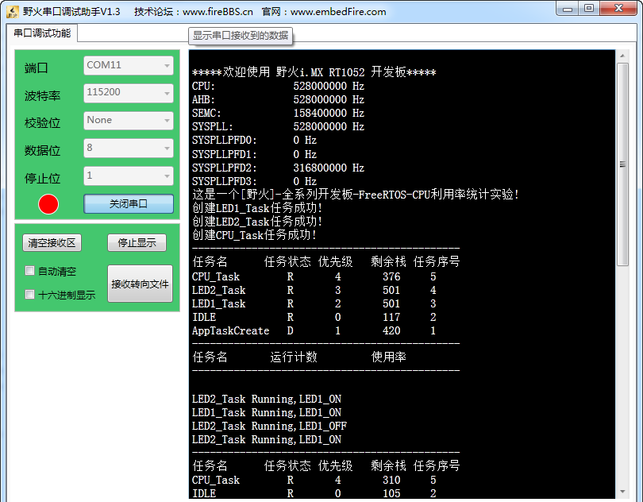

.. vim: syntax=rst

CPU使用率统计
==================================

CPU利用率的基本概念
~~~~~~~~~~~~~~~~~~~~~~

CPU使用率其实就是系统运行的程序占用的CPU资源，表示机器在某段时间程序运行的情况，如果这段时间中，程序一直在占用CPU的使用权，那么可以人为CPU的利用率是100%。CPU的利用率越高，说明机器在这个时间上运行了很多程序，反之较少。利用率的高低与CPU强弱有直接关系，就像一段一模一样的程序，如果
使用运算速度很慢的CPU，它可能要运行1000ms，而使用很运算速度很快的CPU可能只需要10ms，那么在1000ms这段时间中，前者的CPU利用率就是100%，而后者的CPU利用率只有1%，因为1000ms内前者都在使用CPU做运算，而后者只使用10ms的时间做运算，剩下的时间CPU可以做其他事情
。

FreeRTOS是多任务操作系统，对 CPU 都是分时使用的：比如A任务占用10ms，然后B任务占用30ms，然后空闲60ms，再又是A任务占10ms，B任务占30ms，空闲60ms;如果在一段时间内都是如此，那么这段时间内的利用率为40%，因为整个系统中只有40%的时间是CPU处理数据的时间。

CPU利用率的作用
~~~~~~~~~~~~~~~~~~~~

一个系统设计的好坏，可以使用CPU使用率来衡量，一个好的系统必然是能完美响应急需的处理，并且系统的资源不会过于浪费（性价比高）。举个例子，假设一个系统的CPU利用率经常在90%~100%徘徊，那么系统就很少有空闲的时候，这时候突然有一些事情急需CPU的处理，但是此时CPU都很可能被其他任务在占用了，
那么这个紧急事件就有可能无法被相应，即使能被相应，那么占用CPU的任务又处于等待状态，这种系统就是不够完美的，因为资源处理得太过于紧迫；反过来，假如CPU的利用率在1%以下，那么我们就可以认为这种产品的资源过于浪费，搞一个那么好的CPU去干着没啥意义的活（大部分时间处于空闲状态），使用，作为产品的设
计，既不能让资源过于浪费，也不能让资源过于紧迫，这种设计才是完美的，在需要的时候能及时处理完突发事件，而且资源也不会过剩，性价比更高。

CPU利用率统计
~~~~~~~~~~~~~~~~~~~

FreeRTOS是一个很完善很稳定的操作系统，当然也给我们提供测量各个任务占用CPU时间的函数接口，我们可以知道系统中的每个任务占用CPU的时间，从而得知系统设计的是否合理，出于性能方面的考虑，有的时候，我们希望知道CPU的使用率为多少，进而判断此CPU的负载情况和对于当前运行环境是否能够“胜任工作
”。所以，在调试的时候很有必要得到当前系统的CPU利用率相关信息，但是在产品发布的时候，就可以把CPU利用率统计这个功能去掉，因为使用任何功能的时候，都是需要消耗系统资源的，FreeRTOS 是使用一个外部的变量进行统计时间的，并且消耗一个高精度的定时器，其用于定时的精度是系统时钟节拍的10-20倍
，比如当前系统时钟节拍是1000HZ，那么定时器的计数节拍就要是10000-20000HZ。而且FreeRTOS进行CPU利用率统计的时候，也有一定缺陷，因为它没有对进行CPU利用率统计时间的变量做溢出保护，我们使用的是 32
位变量来系统运行的时间计数值，而按20000HZ的中断频率计算，每进入一中断就是50us，变量加一，最大支持计数时间：2^32 \* 50us / 3600s =59.6 分钟，运行时间超过了 59.6 分钟后统计的结果将不准确，除此之外整个系统一直响应定时器50us一次的中断会比较影响系统的性能。

用户想要使用使用CPU利用率统计的话，需要自定义配置一下，首先在FreeRTOSConfig.h配置与系统运行时间和任务状态收集有关的配置选项，并且实现portCONFIGURE_TIMER_FOR_RUN_TIME_STATS()与portGET_RUN_TIME_COUNTER_VALUE()这
两个宏定义，具体见 代码清单25_1 高亮部分。

.. code-block:: c
    :caption: 代码清单‑1配置运行时间和任务状态收集关宏定义
    :emphasize-lines: 4-7,13,15,17-18
    :name: 代码清单25_1
    :linenos:

	/********************************************************************
			FreeRTOS与运行时间和任务状态收集有关的配置选项
	**********************************************************************/
	//启用运行时间统计功能
	#define configGENERATE_RUN_TIME_STATS	        1
	//启用可视化跟踪调试
	#define configUSE_TRACE_FACILITY		1
	/* 与宏configUSE_TRACE_FACILITY同时为1时会编译下面3个函数
	* prvWriteNameToBuffer()
	* vTaskList(),
	* vTaskGetRunTimeStats()
	*/
	#define configUSE_STATS_FORMATTING_FUNCTIONS	1
	
	extern volatileuint32_t CPU_RunTime;
	
	#define portCONFIGURE_TIMER_FOR_RUN_TIME_STATS()     (CPU_RunTime = 0ul)
	#define portGET_RUN_TIME_COUNTER_VALUE()             CPU_RunTime

然后需要实现一个中断频率为20000HZ定时器，用于系统运行时间统计，其实很简单，只需将CPU_RunTime变量自加即可，这个变量是用于记录系统运行时间的，中断服务函数具体见 代码清单25_2_ 高亮部分。

.. code-block:: c
    :caption: 代码清单‑2定时器中断服务函数
    :emphasize-lines: 2-10
    :name: 代码清单25_1
    :linenos:

	/* 用于统计运行时间 */
	volatileuint32_t CPU_RunTime = 0UL;
	
	void  BASIC_TIM_IRQHandler (void)
	{
	if ( TIM_GetITStatus( BASIC_TIM, TIM_IT_Update) != RESET ) {
			CPU_RunTime++;
			TIM_ClearITPendingBit(BASIC_TIM , TIM_FLAG_Update);
		}
	}

然后我们就可以在任务中调用vTaskGetRunTimeStats()和vTaskList()函数获得任务的相关信息与CPU使用率的相关信息，然后打印出来即可，具体见 代码清单25_3_ 高亮部分。关于vTaskGetRunTimeStats()和vTaskList()函数的具体实现过程就不讲解了，有兴趣
可以看看源码。

.. code-block:: c
    :caption: 代码清单‑3获取任务信息与CPU使用率
    :emphasize-lines: 3,12
    :name: 代码清单25_3
    :linenos:

	memset(CPU_RunInfo,0,400);				//信息缓冲区清零

	vTaskList((char *)&CPU_RunInfo);  //获取任务运行时间信息

	printf("---------------------------------------------\r\n");
	printf("任务名任务状态优先级剩余栈任务序号\r\n");
	printf("%s", CPU_RunInfo);
	printf("---------------------------------------------\r\n");

	memset(CPU_RunInfo,0,400);				//信息缓冲区清零

	vTaskGetRunTimeStats((char *)&CPU_RunInfo);

	printf("任务名运行计数使用率\r\n");
	printf("%s", CPU_RunInfo);
	printf("---------------------------------------------\r\n\n");

CPU利用率统计实验
~~~~~~~~~~~~~~~~~~~~

CPU利用率实验是是在FreeRTOS中创建了三个任务，其中两个任务是普通任务，另一个任务用于获取CPU利用率与任务相关信息并通过串口打印出来。具体见 代码清单25_4_ 高亮部分。

.. code-block:: c
    :caption: 代码清单‑4CPU利用率统计实验
    :emphasize-lines: 189-212
    :name: 代码清单25_4
    :linenos:

	/**
	******************************************************************
	* @file    main.c
	* @author  fire
	* @version V1.0
	* @date    2018-xx-xx
	* @brief   CPU利用率统计
	******************************************************************
	* @attention
	*
	* 实验平台:野火  i.MXRT1052开发板
	* 论坛    :http://www.firebbs.cn
	* 淘宝    :http://firestm32.taobao.com
	*
	******************************************************************
	*/
	#include"fsl_debug_console.h"
	
	#include"board.h"
	#include"pin_mux.h"
	#include"clock_config.h"
	
	#include"./led/bsp_led.h"
	#include"./key/bsp_key.h"
	#include"./pit/bsp_pit.h"
	
	/* FreeRTOS头文件 */
	#include"FreeRTOS.h"
	#include"task.h"
	#include"event_groups.h"
	/**************************** 任务句柄 ********************************/
	/*
	* 任务句柄是一个指针，用于指向一个任务，当任务创建好之后，它就具有了一个任务句柄
	  * 以后我们要想操作这个任务都需要通过这个任务句柄，如果是自身的任务操作自己，那么
	* 这个句柄可以为NULL。
	*/
	/* 创建任务句柄 */
	static TaskHandle_t AppTaskCreate_Handle = NULL;
	/* LED任务句柄 */
	static TaskHandle_t LED1_Task_Handle = NULL;
	static TaskHandle_t LED2_Task_Handle = NULL;
	static TaskHandle_t CPU_Task_Handle = NULL;
	/************************** 内核对象句柄 *********************************/
	/*
	* 信号量，消息队列，事件标志组，软件定时器这些都属于内核的对象，要想使用这些内核
	* 对象，必须先创建，创建成功之后会返回一个相应的句柄。实际上就是一个指针，后续我
	* 们就可以通过这个句柄操作这些内核对象。
	*
	* 内核对象说白了就是一种全局的数据结构，通过这些数据结构我们可以实现任务间的通信，
	* 任务间的事件同步等各种功能。至于这些功能的实现我们是通过调用这些内核对象的函数
	* 来完成的
	*
	*/
 
 
	/************************* 全局变量声明 *********************************/
	/*
	* 当我们在写应用程序的时候，可能需要用到一些全局变量。
	*/
	
	
	/*
	*************************************************************************
	*                             函数声明
	*************************************************************************
	*/
	static void AppTaskCreate(void);/* 用于创建任务 */
	
	static void LED1_Task(void* pvParameters);/* LED1_Task任务实现 */
	static void LED2_Task(void* pvParameters);/* LED2_Task任务实现 */
	static void CPU_Task(void* pvParameters);/* CPU_Task任务实现 */
	static void BSP_Init(void);/* 用于初始化板载相关资源 */
	
	/*****************************************************************
	* @brief  主函数
	* @param  无
	* @retval 无
	* @note   第一步：开发板硬件初始化
	第二步：创建APP应用任务
	第三步：启动FreeRTOS，开始多任务调度
	****************************************************************/
	int main(void)
	{
		BaseType_t xReturn = pdPASS;/* 定义一个创建信息返回值，默认为pdPASS */
	
	/* 开发板硬件初始化 */
		BSP_Init();
		PRINTF("这是一个[野火]-全系列开发板-FreeRTOS-CPU利用率统计实验!\r\n");
	/* 创建AppTaskCreate任务 */
		xReturn = xTaskCreate((TaskFunction_t )AppTaskCreate,  /* 任务入口函数 

							(const char*    )"AppTaskCreate",/* 任务名字 */
							(uint16_t       )512,  /* 任务栈大小 */
							(void*          )NULL,/* 任务入口函数参数 */
	                          (UBaseType_t    )1, /* 任务的优先级 */
                          (TaskHandle_t*  )&AppTaskCreate_Handle);/* 任务控制块指针 

	/* 启动任务调度 */
	if (pdPASS == xReturn)
			vTaskStartScheduler();   /* 启动任务，开启调度 */
	else
	return -1;
	
	while (1);  /* 正常不会执行到这里 */
	}
	
	
	/***********************************************************************
	* @ 函数名： AppTaskCreate
	* @ 功能说明：为了方便管理，所有的任务创建函数都放在这个函数里面
	* @ 参数：无
	* @ 返回值：无
	
	*******************************************************************/
	static void AppTaskCreate(void)
	{
		BaseType_t xReturn = pdPASS;/* 定义一个创建信息返回值，默认为pdPASS */
	
		taskENTER_CRITICAL();           //进入临界区
	
	/* 创建LED_Task任务 */
		xReturn = xTaskCreate((TaskFunction_t )LED1_Task, /* 任务入口函数 */
							(const char*    )"LED1_Task",/* 任务名字 */
							(uint16_t       )512,   /* 任务栈大小 */
							(void*          )NULL,  /* 任务入口函数参数 */
							(UBaseType_t    )2,     /* 任务的优先级 */
							(TaskHandle_t*  )&LED1_Task_Handle);/* 任务控制块指针 */
	if (pdPASS == xReturn)
			PRINTF("创建LED1_Task任务成功!\r\n");
	
	/* 创建LED_Task任务 */
		xReturn = xTaskCreate((TaskFunction_t )LED2_Task, /* 任务入口函数 */
							(const char*    )"LED2_Task",/* 任务名字 */
							(uint16_t       )512,   /* 任务栈大小 */
							(void*          )NULL,  /* 任务入口函数参数 */
							(UBaseType_t    )3,     /* 任务的优先级 */
							(TaskHandle_t*  )&LED2_Task_Handle);/* 任务控制块指针 */
	if (pdPASS == xReturn)
			PRINTF("创建LED2_Task任务成功!\r\n");
	
	/* 创建LED_Task任务 */
		xReturn = xTaskCreate((TaskFunction_t )CPU_Task, /* 任务入口函数 */
							(const char*    )"CPU_Task",/* 任务名字 */
							(uint16_t       )512,   /* 任务栈大小 */
							(void*          )NULL,  /* 任务入口函数参数 */
							(UBaseType_t    )4,     /* 任务的优先级 */
							(TaskHandle_t*  )&CPU_Task_Handle);/* 任务控制块指针 */
	if (pdPASS == xReturn)
			PRINTF("创建CPU_Task任务成功!\r\n");
	
		vTaskDelete(AppTaskCreate_Handle); //删除AppTaskCreate任务
	
		taskEXIT_CRITICAL();            //退出临界区
	}
	

	/**********************************************************************
	* @ 函数名： LED_Task
	* @ 功能说明： LED_Task任务主体
	* @ 参数：
	* @ 返回值：无
	********************************************************************/
	static void LED1_Task(void* parameter)
	{
	while (1) {
			LED1_ON;
			vTaskDelay(500);   /* 延时500个tick */
			PRINTF("LED1_Task Running,LED1_ON\r\n");
			LED1_OFF;
			vTaskDelay(500);   /* 延时500个tick */
			PRINTF("LED1_Task Running,LED1_OFF\r\n");

		}
	}

	static void LED2_Task(void* parameter)
	{
	while (1) {
			LED2_ON;
			vTaskDelay(300);   /* 延时500个tick */
			PRINTF("LED2_Task Running,LED1_ON\r\n");

			LED2_OFF;
			vTaskDelay(300);   /* 延时500个tick */
			PRINTF("LED2_Task Running,LED1_OFF\r\n");
		}
	}

	static void CPU_Task(void* parameter)
	{
	uint8_t CPU_RunInfo[400];   //保存任务运行时间信息

	while (1) {
			memset(CPU_RunInfo,0,400);        //信息缓冲区清零

			vTaskList((char *)&CPU_RunInfo);  //获取任务运行时间信息

			PRINTF("---------------------------------------------\r\n");
			PRINTF("任务名任务状态优先级剩余栈任务序号\r\n");
			PRINTF("%s", CPU_RunInfo);
			PRINTF("---------------------------------------------\r\n");

			memset(CPU_RunInfo,0,400);        //信息缓冲区清零

			vTaskGetRunTimeStats((char *)&CPU_RunInfo);

			PRINTF("任务名运行计数使用率\r\n");
			PRINTF("%s", CPU_RunInfo);
			PRINTF("---------------------------------------------\r\n\n");
			vTaskDelay(1000);   /* 延时500个tick */
		}
	}

	/***********************************************************************
	* @ 函数名： BSP_Init
	* @ 功能说明：板级外设初始化，所有板子上的初始化均可放在这个函数里面
	* @ 参数：
	* @ 返回值：无
	*********************************************************************/
	static void BSP_Init(void)
	{
	/* 初始化内存保护单元 */
		BOARD_ConfigMPU();
	/* 初始化开发板引脚 */
		BOARD_InitPins();
	/* 初始化开发板时钟 */
		BOARD_BootClockRUN();
	/* 初始化调试串口 */
		BOARD_InitDebugConsole();
	
	/*RT1052不支持无子优先级的中断分组，按照port.c的770行代码相关的注释，
	调用NVIC_SetPriorityGrouping(0)设置中断优先级分组*/
		NVIC_SetPriorityGrouping(0);
	
	/* 打印系统时钟 */
		PRINTF("\r\n");
		PRINTF("*****欢迎使用野火i.MX RT1052 开发板*****\r\n");
		PRINTF("CPU:             %d Hz\r\n", CLOCK_GetFreq(kCLOCK_CpuClk));
		PRINTF("AHB:             %d Hz\r\n", CLOCK_GetFreq(kCLOCK_AhbClk));
		PRINTF("SEMC:            %d Hz\r\n", CLOCK_GetFreq(kCLOCK_SemcClk));
		PRINTF("SYSPLL:          %d Hz\r\n", CLOCK_GetFreq(kCLOCK_SysPllClk));
		PRINTF("SYSPLLPFD0:      %d Hz\r\n", CLOCK_GetFreq(kCLOCK_SysPllPfd0Clk));
		PRINTF("SYSPLLPFD1:      %d Hz\r\n", CLOCK_GetFreq(kCLOCK_SysPllPfd1Clk));
		PRINTF("SYSPLLPFD2:      %d Hz\r\n", CLOCK_GetFreq(kCLOCK_SysPllPfd2Clk));
		PRINTF("SYSPLLPFD3:      %d Hz\r\n", CLOCK_GetFreq(kCLOCK_SysPllPfd3Clk));
	
	/* 初始化SysTick */
		SysTick_Config(SystemCoreClock / configTICK_RATE_HZ);
	
	/* 硬件BSP初始化统统放在这里，比如LED，串口，LCD等 */
	
	/* LED 端口初始化 */
		LED_GPIO_Config();
	
	
	/* KEY 端口初始化 */
		Key_GPIO_Config();
	
	/*初始化PIT定时器*/
		PIT_TIMER_Init();
	
	/*开启定时器*/
		PIT_StartTimer(PIT, PIT_CHANNEL_X);
	
	
	}
	/****************************END OF FILE**********************/
	

CPU利用率统计实验现象
~~~~~~~~~~~~~~~~~~~~~~~~~~~~~~~~~~~~

程序编译好，用USB线连接电脑和开发板的USB接口（对应丝印为USB转串口），用DAP仿真器把配套程序下载到野火I.MX RT开发板（具体型号根据你买的板子而定，每个型号的板子都配套有对应的程序），在电脑上打开串口调试助手，然后复位开发板就可以在调试助手中看到串口的打印信息，具体见 图25_1_。

