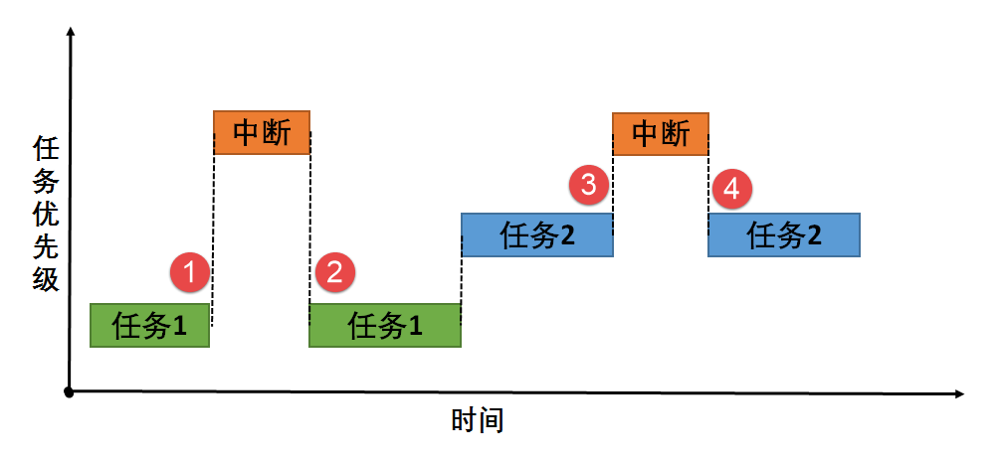
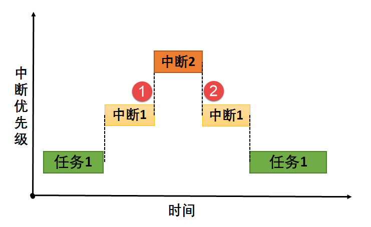
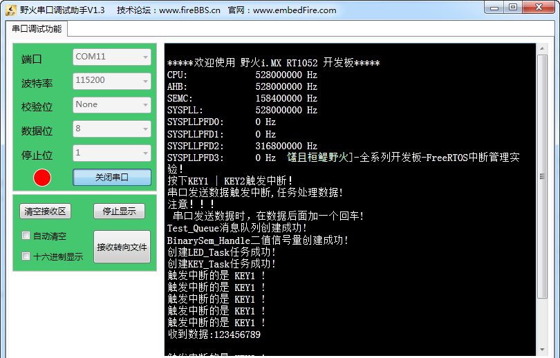

.. vim: syntax=rst

中断管理
==============

异常与中断的基本概念
~~~~~~~~~~~~~~~~~~~~

异常是导致处理器脱离正常运行转向执行特殊代码的任何事件，如果不及时进行处理，轻则系统出错，重则会导致系统毁灭性瘫痪。所以正确地处理异常，避免错误的发生是提高软件鲁棒性（稳定性）非常重要的一环，对于实时系统更是如此。

异常是指任何打断处理器正常执行，并且迫使处理器进入一个由有特权的特殊指令执行的事件。异常通常可以分成两类：同步异常和异步异常。由内部事件（像处理器指令运行产生的事件）引起的异常称为同步异常，例如造成被零除的算术运算引发一个异常，又如在某些处理器体系结构中，对于确定的数据尺寸必须从内存的偶数地址进行读
和写操作。从一个奇数内存地址的读或写操作将引起存储器存取一个错误事件并引起一个异常（称为校准异常）。

异步异常主要是指由于外部异常源产生的异常，是一个由外部硬件装置产生的事件引起的异步异常。同步异常不同于异步异常的地方是事件的来源，同步异常事件是由于执行某些指令而从处理器内部产生的，而异步异常事件的来源是外部硬件装置。例如按下设备某个按钮产生的事件。同步异常与异步异常的区别还在于，同步异常触发后，系
统必须立刻进行处理而不能够依然执行原有的程序指令步骤；而异步异常则可以延缓处理甚至是忽略，例如按键中断异常，虽然中断异常触发了，但是系统可以忽略它继续运行（同样也忽略了相应的按键事件）。

中断，中断属于异步异常。所谓中断是指中央处理器CPU正在处理某件事的时候，外部发生了某一事件，请求CPU迅速处理，CPU暂时中断当前的工作，转入处理所发生的事件，处理完后，再回到原来被中断的地方，继续原来的工作，这样的过程称为中断。

中断能打断任务的运行，无论该任务具有什么样的优先级，因此中断一般用于处理比较紧急的事件，而且只做简单处理，例如标记该事件，在使用FreeRTOS系统时，一般建议使用信号量、消息或事件标志组等标志中断的发生，将这些内核对象发布给处理任务，处理任务再做具体处理。

通过中断机制，在外设不需要CPU介入时，CPU可以执行其他任务，而当外设需要CPU时通过产生中断信号使CPU立即停止当前任务转而来响应中断请求。这样可以使CPU避免把大量时间耗费在等待、查询外设状态的操作上，因此将大大提高系统实时性以及执行效率。

此处读者要知道一点，FreeRTOS源码中有许多处临界段的地方，临界段虽然保护了关键代码的执行不被打断，但也会影响系统的实时，任何使用了操作系统的中断响应都不会比裸机快。比如，某个时候有一个任务在运行中，并且该任务部分程序将中断屏蔽掉，也就是进入临界段中，这个时候如果有一个紧急的中断事件被触发，这个
中断就会被挂起，不能得到及时响应，必须等到中断开启才可以得到响应，如果屏蔽中断时间超过了紧急中断能够容忍的限度，危害是可想而知的。所以，操作系统的中断在某些时候会有适当的中断延迟，因此调用中断屏蔽函数进入临界段的时候，也需快进快出。当然FreeRTOS也能允许一些高优先级的中断不被屏蔽掉，能够及时做
出响应，不过这些中断就不受系统管理，也不允许调用FreeRTOS中与中断相关的任何API函数接口。

FreeRTOS的中断管理支持：

-  开/关中断。

-  恢复中断。

-  中断使能。

-  中断屏蔽。

-  可选择系统管理的中断优先级。

中断的介绍
^^^^^^^^^^^^^^^

与中断相关的硬件可以划分为三类：外设、中断控制器、CPU本身。

外设：当外设需要请求CPU时，产生一个中断信号，该信号连接至中断控制器。

中断控制器：中断控制器是CPU众多外设中的一个，它一方面接收其他外设中断信号的输入，另一方面，它会发出中断信号给CPU。可以通过对中断控制器编程实现对中断源的优先级、触发方式、打开和关闭源等设置操作。在Cortex-M系列控制器中常用的中断控制器是NVIC（内嵌向量中断控制器Nested
Vectored Interrupt Controller）。

CPU：CPU会响应中断源的请求，中断当前正在执行的任务，转而执行中断处理程序。NVIC最多支持240个中断，每个中断最多256个优先级。

和中断相关的名词解释
^^^^^^^^^^^^^^^^^^^^

中断号：每个中断请求信号都会有特定的标志，使得计算机能够判断是哪个设备提出的中断请求，这个标志就是中断号。

中断请求：“紧急事件”需向CPU提出申请，要求CPU暂停当前执行的任务，转而处理该“紧急事件”，这一申请过程称为中断请求。

中断优先级：为使系统能够及时响应并处理所有中断，系统根据中断时间的重要性和紧迫程度，将中断源分为若干个级别，称作中断优先级。

中断处理程序：当外设产生中断请求后，CPU暂停当前的任务，转而响应中断申请，即执行中断处理程序。

中断触发：中断源发出并送给CPU控制信号，将中断触发器置“1”，表明该中断源产生了中断，要求CPU去响应该中断，CPU暂停当前任务，执行相应的中断处理程序。

中断触发类型：外部中断申请通过一个物理信号发送到NVIC，可以是电平触发或边沿触发。

中断向量：中断服务程序的入口地址。

中断向量表：存储中断向量的存储区，中断向量与中断号对应，中断向量在中断向量表中按照中断号顺序存储。

临界段：代码的临界段也称为临界区，一旦这部分代码开始执行，则不允许任何中断打断。为确保临界段代码的执行不被中断，在进入临界段之前须关中断，而临界段代码执行完毕后，要立即开中断。

中断管理的运作机制
~~~~~~~~~~~~~~~~~~~~~~~~~~~

当中断产生时，处理机将按如下的顺序执行：

1. 保存当前处理机状态信息

2. 载入异常或中断处理函数到PC寄存器

3. 把控制权转交给处理函数并开始执行

4. 当处理函数执行完成时，恢复处理器状态信息

5. 从异常或中断中返回到前一个程序执行点

中断使得CPU可以在事件发生时才给予处理，而不必让CPU连续不断地查询是否有相应的事件发生。通过两条特殊指令：关中断和开中断可以让处理器不响应或响应中断，在关闭中断期间，通常处理器会把新产生的中断挂起，当中断打开时立刻进行响应，所以会有适当的延时响应中断，故用户在进入临界区的时候应快进快出。

中断发生的环境有两种情况：在任务的上下文中，在中断服务函数处理上下文中。

-  任务在工作的时候，如果此时发生了一个中断，无论中断的优先级是多大，都会打断当前任务的执行，从而转到对应的中断服务函数中执行，其过程具体见 图24_1_。

图24_1_ **(1)、(3)**\ ：在任务运行的时候发生了中断，那么中断会打断任务的运行，那么操作系统将先保存当前任务的上下文环境，转而去处理中断服务函数。

图24_1_ **(2)、(4)**\ ：当且仅当中断服务函数处理完的时候才恢复任务的上下文环境，继续运行任务。

-  在执行中断服务例程的过程中，如果有更高优先级别的中断源触发中断，由于当前处于中断处理上下文环境中，根据不同的处理器构架可能有不同的处理方式，比如新的中断等待挂起直到当前中断处理离开后再行响应；或新的高优先级中断打断当前中断处理过程，而去直接响应这个更高优先级的新中断源。后面这种情况，称之为中断嵌套
  。在硬实时环境中，前一种情况是不允许发生的，不能使响应中断的时间尽量的短。而在软件处理（软实时环境）上，FreeRTOS允许中断嵌套，即在一个中断服务例程期间，处理器可以响应另外一个优先级更高的中断，过程如图24‑2所示。

图24_2_ **(1)**\ ：当中断1的服务函数在处理的时候发生了中断2，由于中断2的优先级比中断1更高，所以发生了中断嵌套，那么操作系统将先保存当前中断服务函数的上下文环境，并且转向处理中断2，当且仅当中断2执行完的时候 图24_2_ **(2)**\ ，才能继续执行中断1。

中断延迟的概念
~~~~~~~~~~~~~~

即使操作系统的响应很快了，但对于中断的处理仍然存在着中断延迟响应的问题，我们称之为中断延迟(Interrupt Latency) 。

中断延迟是指从硬件中断发生到开始执行中断处理程序第一条指令之间的这段时间。也就是：系统接收到中断信号到操作系统作出响应，并完成换到转入中断服务程序的时间。也可以简单地理解为：（外部）硬件（设备）发生中断，到系统执行中断服务子程序（ISR）的第一条指令的时间。

中断的处理过程是：外界硬件发生了中断后，CPU到中断处理器读取中断向量，并且查找中断向量表，找到对应的中断服务子程序（ISR）的首地址，然后跳转到对应的ISR去做相应处理。这部分时间，我称之为：识别中断时间。

在允许中断嵌套的实时操作系统中，中断也是基于优先级的，允许高优先级中断抢断正在处理的低优先级中断，所以，如果当前正在处理更高优先级的中断，即使此时有低优先级的中断，也系统不会立刻响应，而是等到高优先级的中断处理完之后，才会响应。而即使在不支持中断嵌套，即中断是没有优先级的，中断是不允许被中断的，所以
，如果当前系统正在处理一个中断，而此时另一个中断到来了，系统也是不会立即响应的，而只是等处理完当前的中断之后，才会处理后来的中断。此部分时间，我称其为：等待中断打开时间。

在操作系统中，很多时候我们会主动进入临界段，系统不允许当前状态被中断打断，故而在临界区发生的中断会被挂起，直到退出临界段时候打开中断。此部分时间，我称其为：关闭中断时间。

中断延迟可以定义为，从中断开始的时刻到中断服务例程开始执行的时刻之间的时间段。中断延迟 = 识别中断时间 + [等待中断打开时间] + [关闭中断时间]。

注意：“[ ]”的时间是不一定都存在的，此处为最大可能的中断延迟时间。

中断管理的应用场景
~~~~~~~~~~~~~~~~~~~~~~~~~~~

中断在嵌入式处理器中应用非常之多，没有中断的系统不是一个好系统，因为有中断，才能启动或者停止某件事情，从而转去做另一间事情。我们可以举一个日常生活中的例子来说明，假如你正在给朋友写信，电话铃响了，这时你放下手中的笔去接电话，通话完毕再继续写信。这个例子就表现了中断及其处理的过程：电话铃声使你暂时中止
当前的工作，而去处理更为急需处理的事情——接电话，当把急需处理的事情处理完毕之后，再回过头来继续原来的事情。在这个例子中，电话铃声就可以称为“中断请求”，而你暂停写信去接电话就叫作“中断响应”，那么接电话的过程就是“中断处理”。由此我们可以看出，在计算机执行程序的过程中，由于出现某个特殊情况(或称为
“特殊事件”)，使得系统暂时中止现行程序，而转去执行处理这一特殊事件的程序，处理完毕之后再回到原来程序的中断点继续向下执行。

为什么说吗没有中断的系统不是好系统呢？我们可以再举一个例子来说明中断的作用。假设有一个朋友来拜访你，但是由于不知何时到达，你只能在门口等待，于是什么事情也干不了；但如果在门口装一个门铃，你就不必在门口等待而可以在家里去做其他的工作，朋友来了按门铃通知你，这时你才中断手中的工作去开门，这就避免了不必要
的等待。CPU也是一样，如果时间都浪费在查询的事情上，那这个CPU啥也干不了，要他何用。在嵌入式系统中合理利用中断，能更好利用CPU的资源。

中断管理讲解
~~~~~~~~~~~~~~~~~~

ARM Cortex-M 系列内核的中断是由硬件管理的，而FreeRTOS是软件，它并不接管由硬件管理的相关中断（接管简单来说就是，所有的中断都由RTOS的软件管理，硬件来了中断时，由软件决定是否响应，可以挂起中断，延迟响应或者不响应），只支持简单的开关中断等，所以FreeRTOS中的中断使用其实跟
裸机差不多的，需要我们自己配置中断，并且使能中断，编写中断服务函数，在中断服务函数中使用内核IPC通信机制，一般建议使用信号量、消息或事件标志组等标志事件的发生，将事件发布给处理任务，等退出中断后再由相关处理任务具体处理中断。

用户可以自定义配置系统可管理的最高中断优先级的宏定义configLIBRARY_MAX_SYSCALL_INTERRUPT_PRIORITY，它是用于配置内核中的basepri寄存器的，当basepri设置为某个值的时候，NVIC不会响应比该优先级低的中断，而优先级比之更高的中断则不受影响。就是说当
这个宏定义配置为5的时候，中断优先级数值在0、1、2、3、4的这些中断是不受FreeRTOS屏蔽的，也就是说即使在系统进入临界段的时候，这些中断也能被触发而不是等到退出临界段的时候才被触发，当然，这些中断服务函数中也不能调用FreeRTOS提供的API函数接口，而中断优先级在5到15的这些中断是可以
被屏蔽的，也能安全调用FreeRTOS提供的API函数接口。

ARM Cortex-M NVIC支持中断嵌套功能：当一个中断触发并且系统进行响应时，处理器硬件会将当前运行的部分上下文寄存器自动压入中断栈中，这部分的寄存器包括PSR，R0，R1，R2，R3以及R12寄存器。当系统正在服务一个中断时，如果有一个更高优先级的中断触发，那么处理器同样的会打断当前运行的
中断服务例程，然后把老的中断服务例程上下文的PSR，R0，R1，R2，R3和R12寄存器自动保存到中断栈中。这些部分上下文寄存器保存到中断栈的行为完全是硬件行为，这一点是与其他ARM处理器最大的区别（以往都需要依赖于软件保存上下文）。

另外，在ARM Cortex-M系列处理器上，所有中断都采用中断向量表的方式进行处理，即当一个中断触发时，处理器将直接判定是哪个中断源，然后直接跳转到相应的固定位置进行处理。而在ARM7、ARM9中，一般是先跳转进入IRQ入口，然后再由软件进行判断是哪个中断源触发，获得了相对应的中断服务例程入口地址
后，再进行后续的中断处理。ARM7、ARM9的好处在于，所有中断它们都有统一的入口地址，便于OS的统一管理。而ARM Cortex-
M系列处理器则恰恰相反，每个中断服务例程必须排列在一起放在统一的地址上（这个地址必须要设置到NVIC的中断向量偏移寄存器中）。中断向量表一般由一个数组定义（或在起始代码中给出），在RT1052上，默认采用起始代码给出：具体见 代码清单24_1_。

.. code-block:: c
    :caption: 代码清单‑1中断向量表（部分）
    :name: 代码清单24_1
    :linenos:

   	__Vectors       DCD     |Image$$ARM_LIB_STACK$$ZI$$Limit| ; Top of Stack
      DCD     Reset_Handler  ; Reset Handler
      DCD     NMI_Handler                         ;NMI Handler
      DCD     HardFault_Handler                   ;Hard Fault Handler
      DCD     MemManage_Handler                   ;MPU Fault Handler
      DCD     BusFault_Handler                    ;Bus Fault Handler
      DCD     UsageFault_Handler                  ;Usage Fault Handler
      DCD     0                                   ;Reserved
      DCD     0                                   ;Reserved
      DCD     0                                   ;Reserved
      DCD     0                                   ;Reserved
      DCD     SVC_Handler                         ;SVCall Handler
      DCD     DebugMon_Handler                    ;Debug Monitor Handler
      DCD     0                                   ;Reserved
      DCD     PendSV_Handler                      ;PendSV Handler
      DCD     SysTick_Handler                     ;SysTick Handler

                                                ;External Interrupts
      DCD     DMA0_DMA16_IRQHandler               ;DMA channel 0/16 transfer complete
      DCD     DMA1_DMA17_IRQHandler               ;DMA channel 1/17 transfer complete
      DCD     DMA2_DMA18_IRQHandler               ;DMA channel 2/18 transfer complete
      DCD     DMA3_DMA19_IRQHandler               ;DMA channel 3/19 transfer complete
      DCD     DMA4_DMA20_IRQHandler               ;DMA channel 4/20 transfer complete
      DCD     DMA5_DMA21_IRQHandler               ;DMA channel 5/21 transfer complete
      DCD     DMA6_DMA22_IRQHandler               ;DMA channel 6/22 transfer complete
      DCD     DMA7_DMA23_IRQHandler               ;DMA channel 7/23 transfer complete
      DCD     DMA8_DMA24_IRQHandler               ;DMA channel 8/24 transfer complete
      DCD     DMA9_DMA25_IRQHandler               ;DMA channel 9/25 transfer complete
      DCD     DMA10_DMA26_IRQHandler              ;DMA channel 10/26 transfer complete
      DCD     DMA11_DMA27_IRQHandler              ;DMA channel 11/27 transfer complete
      DCD     DMA12_DMA28_IRQHandler              ;DMA channel 12/28 transfer complete
      DCD     DMA13_DMA29_IRQHandler              ;DMA channel 13/29 transfer complete
      DCD     DMA14_DMA30_IRQHandler              ;DMA channel 14/30 transfer complete
      DCD     DMA15_DMA31_IRQHandler              ;DMA channel 15/31 transfer complete
      DCD     DMA_ERROR_IRQHandler                ;DMA error interrupt channels 0-15 / 16-31
      DCD     CTI0_ERROR_IRQHandler               ;CTI0_Error
      DCD     CTI1_ERROR_IRQHandler               ;CTI1_Error
      DCD     CORE_IRQHandler                     ;CorePlatform exception IRQ
      DCD     LPUART1_IRQHandler                  ;LPUART1 TX interrupt and RX interrupt
      DCD     LPUART2_IRQHandler                  ;LPUART2 TX interrupt and RX interrupt

FreeRTOS在Cortex-M系列处理器上也遵循与裸机中断一致的方法，当用户需要使用自定义的中断服务例程时，只需要定义相同名称的函数覆盖弱化符号即可。所以，FreeRTOS在Cortex-M系列处理器的中断控制其实与裸机没什么差别。

中断管理实验
~~~~~~~~~~~~~~~~

中断管理实验是在FreeRTOS中创建了两个任务分别获取信号量与消息队列，并且定义了两个按键KEY1与KEY2的触发方式为中断触发，其触发的中断服务函数则跟裸机一样，在中断触发的时候通过消息队列将消息传递给任务，任务接收到消息就将信息通过串口调试助手显示出来。而且中断管理实验也实现了一个串口接收以回
车结尾的中断功能，当串口接收完不定长的数据并且检测以回车结尾时，将信号量传递给任务，任务在收到信号量的时候将串口的数据读取出来并且在串口调试助手中回显，具体见 代码清单24_2_ 高亮部分。

.. code-block:: c
    :caption: 代码清单‑2中断管理实验
    :emphasize-lines: 70-71,137-148,184-201,210-225
    :name: 代码清单24_2
    :linenos:	

	/**
	******************************************************************
	* @file    main.c
	* @author  fire
	* @version V1.0
	* @date    2018-xx-xx
	* @brief   中断管理
	******************************************************************
	* @attention
	*
	* 实验平台:野火  i.MXRT1052开发板
	* 论坛    :http://www.firebbs.cn
	* 淘宝    :http://firestm32.taobao.com
	*
	******************************************************************
	*/
	#include"fsl_debug_console.h"
	
	#include"board.h"
	#include"pin_mux.h"
	#include"clock_config.h"
	
	#include"./led/bsp_led.h"
	#include"./key/bsp_key.h"
	#include"./nvic/bsp_nvic.h"
	#include"./key/bsp_key_it.h"
	#include"./bsp/uart/bsp_uart.h"
	/* FreeRTOS头文件 */
	#include"FreeRTOS.h"
	#include"task.h"
	#include"queue.h"
	#include"semphr.h"
	

	/**************************** 任务句柄 ********************************/
	/*
	* 任务句柄是一个指针，用于指向一个任务，当任务创建好之后，它就具有了一个任务句柄
	* 以后我们要想操作这个任务都需要通过这个任务句柄，如果是自身的任务操作自己，那么
	* 这个句柄可以为NULL。
	*/
	static TaskHandle_t AppTaskCreate_Handle = NULL;/* 创建任务句柄 */
	static TaskHandle_t LED_Task_Handle = NULL;/* LED任务句柄 */
	static TaskHandle_t Receive_Task_Handle = NULL;/* KEY任务句柄 */

	/************************** 内核对象句柄 *********************************/
	/*
	* 信号量，消息队列，事件标志组，软件定时器这些都属于内核的对象，要想使用这些内核
	* 对象，必须先创建，创建成功之后会返回一个相应的句柄。实际上就是一个指针，后续我
	* 们就可以通过这个句柄操作这些内核对象。
	*
	* 内核对象说白了就是一种全局的数据结构，通过这些数据结构我们可以实现任务间的通信，
	* 任务间的事件同步等各种功能。至于这些功能的实现我们是通过调用这些内核对象的函数
	* 来完成的
	*
	*/
	QueueHandle_t Test_Queue =NULL;
	SemaphoreHandle_t BinarySem_Handle =NULL;

	/*********************** 全局变量声明 ************************************/
	/*
	* 当我们在写应用程序的时候，可能需要用到一些全局变量。
	*/

	externchar RX_BUFF[30];

	/*************************** 宏定义 ************************************/
	/*
	* 当我们在写应用程序的时候，可能需要用到一些宏定义。
	*/
	#define  QUEUE_LEN    4/* 队列的长度，最大可包含多少个消息 */
	#define  QUEUE_SIZE   4/* 队列中每个消息大小（字节） */

	/*
	*************************************************************************
	*                             函数声明
	*************************************************************************
	*/
	static void AppTaskCreate(void);/* 用于创建任务 */

	static void LED_Task(void* pvParameters);/* LED_Task任务实现 */
	static void Receive_Task(void* pvParameters);/* KEY_Task任务实现 */

	static void BSP_Init(void);/* 用于初始化板载相关资源 */

	/*****************************************************************
	* @brief  主函数
	* @param  无
	* @retval 无
	* @note   第一步：开发板硬件初始化
	第二步：创建APP应用任务
	第三步：启动FreeRTOS，开始多任务调度
	****************************************************************/
	int main(void)
	{
		BaseType_t xReturn = pdPASS;/* 定义一个创建信息返回值，默认为pdPASS */
	
	/* 开发板硬件初始化 */
		BSP_Init();
	
		PRINTF("这是一个[野火]-全系列开发板-FreeRTOS中断管理实验！\r\n");
		PRINTF("按下KEY1 | KEY2触发中断！\r\n");
		PRINTF("串口发送数据触发中断,任务处理数据!\r\n");
		PRINTF("注意！！！\r\n串口发送数据时，在数据后面加一个回车!\r\n");
	
	/* 创建AppTaskCreate任务 */
		xReturn = xTaskCreate((TaskFunction_t )AppTaskCreate,  /* 任务入口函数 

					(const char*    )"AppTaskCreate",/* 任务名字 */
					(uint16_t       )512,  /* 任务栈大小 */
					(void*          )NULL,/* 任务入口函数参数 */
					(UBaseType_t    )1, /* 任务的优先级 */
					(TaskHandle_t*  )&AppTaskCreate_Handle);/* 任务控制块指针 

	/* 启动任务调度 */
	if (pdPASS == xReturn)
			vTaskStartScheduler();   /* 启动任务，开启调度 */
	else
	return -1;
	
	while (1); /* 正常不会执行到这里 */
	}
	
	
	/***********************************************************************
	* @ 函数名： AppTaskCreate
	* @ 功能说明：为了方便管理，所有的任务创建函数都放在这个函数里面
	* @ 参数：无
	* @ 返回值：无
	
	*******************************************************************/
	static void AppTaskCreate(void)
	{
		BaseType_t xReturn = pdPASS;/* 定义一个创建信息返回值，默认为pdPASS */
	
		taskENTER_CRITICAL();           //进入临界区
	
	/* 创建Test_Queue */
		Test_Queue = xQueueCreate((UBaseType_t ) QUEUE_LEN,/* 消息队列的长度 */
								(UBaseType_t ) QUEUE_SIZE);/* 消息的大小 */
	
	if (NULL != Test_Queue)
			PRINTF("Test_Queue消息队列创建成功!\r\n");
	
	/* 创建 BinarySem */
		BinarySem_Handle = xSemaphoreCreateBinary();
	
	if (NULL != BinarySem_Handle)
			PRINTF("BinarySem_Handle二值信号量创建成功!\r\n");
	
	/* 创建LED_Task任务 */
	     xReturn = xTaskCreate((TaskFunction_t )LED_Task, /* 任务入口函数 */
					(const char*    )"LED_Task",/* 任务名字 */
					(uint16_t       )512,   /* 任务栈大小 */
					(void*          )NULL,  /* 任务入口函数参数 */
					(UBaseType_t    )2,     /* 任务的优先级 */
					(TaskHandle_t*  )&LED_Task_Handle);/* 任务控制块指针 */
	if (pdPASS == xReturn)
			PRINTF("创建LED_Task任务成功!\r\n");
	/* 创建KEY_Task任务 */
		xReturn = xTaskCreate((TaskFunction_t )Receive_Task,  /* 任务入口函数 

					(const char*    )"Receive_Task",/* 任务名字 */
					(uint16_t       )512,  /* 任务栈大小 */
					(void*          )NULL,/* 任务入口函数参数 */
					(UBaseType_t    )3, /* 任务的优先级 */
					(TaskHandle_t*  )&Receive_Task_Handle);/* 任务控制块指针 

	if (pdPASS == xReturn)
			PRINTF("创建Receive_Task任务成功!\r\n");
	
		vTaskDelete(AppTaskCreate_Handle); //删除AppTaskCreate任务
	
		taskEXIT_CRITICAL();            //退出临界区
	}
	
	
	
	/**********************************************************************
	* @ 函数名： LED_Task
	* @ 功能说明： LED_Task任务主体
	* @ 参数：
	* @ 返回值：无
	********************************************************************/
	static void LED_Task(void* parameter)
	{
		BaseType_t xReturn = pdPASS;/* 定义一个创建信息返回值，默认为pdPASS */
	uint32_t r_queue; /* 定义一个接收消息的变量 */
	while (1) {
	/* 队列读取（接收），等待时间为一直等待 */
			xReturn = xQueueReceive( Test_Queue,    /* 消息队列的句柄 */
	&r_queue,      /* 发送的消息内容 */
							portMAX_DELAY); /* 等待时间一直等 */
	
	if (pdPASS == xReturn) {
				PRINTF("触发中断的是 KEY%d !\n",r_queue);
			} else {
				PRINTF("数据接收出错\n");
			}
			LED1_TOGGLE;
		}
	}
	
	externint index_num;
	/**********************************************************************
	* @ 函数名： Receive_Task
	* @ 功能说明： Receive_Task任务主体
	* @ 参数：
	* @ 返回值：无
	********************************************************************/
	static void Receive_Task(void* parameter)
	{
	     BaseType_t xReturn = pdPASS;/* 定义一个创建信息返回值，默认为pdPASS */
 
	while (1) {
	//获取二值信号量 xSemaphore,没获取到则一直等待
			xReturn = xSemaphoreTake(BinarySem_Handle,/* 二值信号量句柄 */
									portMAX_DELAY); /* 等待时间 */
	if (pdPASS == xReturn) {
				LED2_TOGGLE;
				PRINTF("收到数据:%s\r\n",RX_BUFF);
				memset(RX_BUFF,0,USART_RBUFF_SIZE);
				index_num=0;
			}
		}
	}
	
	/***********************************************************************
	* @ 函数名： BSP_Init
	* @ 功能说明：板级外设初始化，所有板子上的初始化均可放在这个函数里面
	* @ 参数：
	* @ 返回值：无
	*********************************************************************/
	static void BSP_Init(void)
	{
	/* 初始化内存保护单元 */
		BOARD_ConfigMPU();
	/* 初始化开发板引脚 */
		BOARD_InitPins();
	/* 初始化开发板时钟 */
		BOARD_BootClockRUN();
	/* 初始化调试串口 */
		BOARD_InitDebugConsole();
	
	/*RT1052不支持无子优先级的中断分组，按照port.c的770行代码相关的注释，
	调用NVIC_SetPriorityGrouping(0)设置中断优先级分组*/
		NVIC_SetPriorityGrouping(0);
	
	/* 打印系统时钟 */
		PRINTF("\r\n");
		PRINTF("*****欢迎使用野火i.MX RT1052 开发板*****\r\n");
		PRINTF("CPU:             %d Hz\r\n", CLOCK_GetFreq(kCLOCK_CpuClk));
		PRINTF("AHB:             %d Hz\r\n", CLOCK_GetFreq(kCLOCK_AhbClk));
		PRINTF("SEMC:            %d Hz\r\n", CLOCK_GetFreq(kCLOCK_SemcClk));
		PRINTF("SYSPLL:          %d Hz\r\n", CLOCK_GetFreq(kCLOCK_SysPllClk));
		PRINTF("SYSPLLPFD0:      %d Hz\r\n", CLOCK_GetFreq(kCLOCK_SysPllPfd0Clk));
		PRINTF("SYSPLLPFD1:      %d Hz\r\n", CLOCK_GetFreq(kCLOCK_SysPllPfd1Clk));
		PRINTF("SYSPLLPFD2:      %d Hz\r\n", CLOCK_GetFreq(kCLOCK_SysPllPfd2Clk));
		PRINTF("SYSPLLPFD3:      %d Hz\r\n", CLOCK_GetFreq(kCLOCK_SysPllPfd3Clk));
	
	/* 初始化SysTick */
		SysTick_Config(SystemCoreClock / configTICK_RATE_HZ);
	
	/* 硬件BSP初始化统统放在这里，比如LED，串口，LCD等 */
	
	/* LED 端口初始化 */
		LED_GPIO_Config();
	
	/* uart 端口初始化 */
		UART_Config();
	
	/* 初始化KEY引脚 */
		Key_IT_GPIO_Config();
	
	}
	/****************************END OF FILE**********************/

	
 

而中断服务函数则需要我们自己编写，并且中断被触发的时候通过信号量、消息队列告知任务，具体见 代码清单24_3_ 高亮部分。

.. code-block:: c
    :caption: 代码清单‑3中断管理——中断服务函数
    :emphasize-lines: 174-210,222-258
    :name: 代码清单24_3
    :linenos:

	/**
	******************************************************************
	* @file    bsp_key_it.c
	* @author  fire
	* @version V1.0
	* @date    2018-xx-xx
	* @brief   按键应用函数接口(中断模式)
	******************************************************************
	* @attention
	*
	* 实验平台:野火  i.MXRT1052开发板
	* 论坛    :http://www.firebbs.cn
	* 淘宝    :https://fire-stm32.taobao.com
	*
	******************************************************************
	*/
	#include"fsl_iomuxc.h"
	#include"fsl_gpio.h"
	
	#include"pad_config.h"
	
	#include"./nvic/bsp_nvic.h"
	#include"./key/bsp_key_it.h"
	
	/******************************************************************
	* 变量定义
	******************************************************************/
	/* 按键是否被按下的中断标志 */
	__IO bool g_KeyDown[2] = { false};
	
	/******************************************************************
	* 宏
	******************************************************************/
	/* 所有引脚均使用同样的PAD配置 */
	#define KEY_PAD_CONFIG_DATA    (SRE_0_SLOW_SLEW_RATE| \
							DSE_0_OUTPUT_DRIVER_DISABLED| \
							SPEED_2_MEDIUM_100MHz| \
							ODE_0_OPEN_DRAIN_DISABLED| \
							PKE_1_PULL_KEEPER_ENABLED| \
							PUE_1_PULL_SELECTED| \
							PUS_3_22K_OHM_PULL_UP| \
							HYS_1_HYSTERESIS_ENABLED)
	/* 配置说明 : */
	/* 转换速率: 转换速率慢
	驱动强度: 关闭
	速度配置 : medium(100MHz)
	开漏配置: 关闭
	拉/保持器配置: 使能
	拉/保持器选择: 上下拉
	上拉/下拉选择: 22K欧姆上拉
	滞回器配置: 开启（仅输入时有效，施密特触发器，使能后可以过滤输入噪声）*/
	
	/******************************************************************
	* 声明
	******************************************************************/
	static void Key_IOMUXC_MUX_Config(void);
	static void Key_IOMUXC_PAD_Config(void);
	static void Key_GPIO_Mode_Config(void);

	/******************************************************************
	* 函数代码
	******************************************************************/
	/**
	* @brief  初始化按键相关IOMUXC的MUX复用配置
	* @param  无
	* @retval 无
	*/
	static void Key_IOMUXC_MUX_Config(void)
	{
	/* 设置按键引脚的复用模式为GPIO，不使用SION功能 */
		IOMUXC_SetPinMux(CORE_BOARD_WAUP_KEY_IOMUXC, 0U);
		IOMUXC_SetPinMux(CORE_BOARD_MODE_KEY_IOMUXC, 0U);
	}

	/**
	* @brief  初始化按键相关IOMUXC的MUX复用配置
	* @param  无
	* @retval 无
	*/
	static void Key_IOMUXC_PAD_Config(void)
	{
	/* 设置按键引脚属性功能 */
		IOMUXC_SetPinConfig(CORE_BOARD_WAUP_KEY_IOMUXC, KEY_PAD_CONFIG_DATA);
		IOMUXC_SetPinConfig(CORE_BOARD_MODE_KEY_IOMUXC, KEY_PAD_CONFIG_DATA);
	}

	/**
	* @brief  初始化按键相关的GPIO模式
	* @param  无
	* @retval 无
	*/
	static void Key_GPIO_Mode_Config(void)
	{
	/* 配置为输入模式，低电平中断，后面通过GPIO_PinInit函数加载配置 */
		gpio_pin_config_t key_config;

	/** 核心板的按键，GPIO配置 **/
		key_config.direction = kGPIO_DigitalInput;    //输入模式
		key_config.outputLogic =  1;                  //默认高电平（输入模式时无效）
		key_config.interruptMode = kGPIO_IntLowLevel; //低电平触发中断
	
	/* 初始化 KEY GPIO. */
		GPIO_PinInit(CORE_BOARD_WAUP_KEY_GPIO, CORE_BOARD_WAUP_KEY_GPIO_PIN, &key_config);
		GPIO_PinInit(CORE_BOARD_MODE_KEY_GPIO, CORE_BOARD_MODE_KEY_GPIO_PIN, &key_config);
	}
	
	
	/**
	* @brief  初始化按键中断相关的内容
	* @param  无
	* @retval 无
	*/
	static void Key_Interrupt_Config(void)
	{
	/* 开IOMUXC_SNVS 时钟 */
		CLOCK_EnableClock(kCLOCK_IomuxcSnvs);
	
	/* 开启GPIO端口某个引脚的中断 */
	     GPIO_PortEnableInterrupts(CORE_BOARD_WAUP_KEY_GPIO,
                               1U << CORE_BOARD_WAUP_KEY_GPIO_PIN);
 
     GPIO_PortEnableInterrupts(CORE_BOARD_MODE_KEY_GPIO,
                               1U << CORE_BOARD_MODE_KEY_GPIO_PIN);
 
	/*设置中断优先级,*/
		set_IRQn_Priority(CORE_BOARD_WAUP_KEY_IRQ,Group4_PreemptPriority_6, Group4_SubPriority_0);
		set_IRQn_Priority(CORE_BOARD_MODE_KEY_IRQ,Group4_PreemptPriority_6, Group4_SubPriority_0);
	
	/* 开启GPIO端口中断 */
		EnableIRQ(CORE_BOARD_WAUP_KEY_IRQ);
		EnableIRQ(CORE_BOARD_MODE_KEY_IRQ);
	}
	
	
	/**
	* @brief  初始化控制KEY的IO
	* @param  无
	* @retval 无
	*/
	void Key_IT_GPIO_Config(void)
	{
	/* 初始化GPIO复用、属性、模式及中断*/
		Key_IOMUXC_MUX_Config();
		Key_IOMUXC_PAD_Config();
		Key_GPIO_Mode_Config();
		Key_Interrupt_Config();
	}
	
	
	
	/********************中断服务函数**************************/
	/* FreeRTOS头文件 */
	#include"FreeRTOS.h"
	#include"task.h"
	#include"queue.h"
	#include"semphr.h"
	/* 声明引用外部队列&二值信号量 */
	extern QueueHandle_t Test_Queue;
	extern SemaphoreHandle_t BinarySem_Handle;
	
	static uint32_t send_data1 = 1;
	static uint32_t send_data2 = 2;
	
	/**
	* @brief  GPIO 输入中断服务函数
	*         CORE_BOARD_WAUP_KEY_IRQHandler只是一个宏，
	*         在本例中它指代函数名GPIO5_Combined_0_15_IRQHandler，
	*         中断服务函数名是固定的，可以在启动文件中找到。
	* @param  中断服务函数不能有输入参数
	* @note   中断函数一般只使用标志位进行指示，完成后尽快退出，
	*         具体操作或延时尽量不放在中断服务函数中
	* @retval 中断服务函数不能有返回值
	*/
	void CORE_BOARD_WAUP_KEY_IRQHandler(void)
	{
	
		BaseType_t pxHigherPriorityTaskWoken;
	uint32_t ulReturn;
	/* 进入临界段，临界段可以嵌套 */
		ulReturn = taskENTER_CRITICAL_FROM_ISR();
	
	/* 清除中断标志位 */
     GPIO_PortClearInterruptFlags(CORE_BOARD_MODE_KEY_GPIO,
                                  1U << CORE_BOARD_MODE_KEY_GPIO_PIN);
 
 
	/* 将数据写入（发送）到队列中，等待时间为 0  */
		xQueueSendFromISR(Test_Queue, /* 消息队列的句柄 */
	&send_data1,/* 发送的消息内容 */
	&pxHigherPriorityTaskWoken);
	
	//如果需要的话进行一次任务切换
		portYIELD_FROM_ISR(pxHigherPriorityTaskWoken);
	
	/* 退出临界段 */
		taskEXIT_CRITICAL_FROM_ISR( ulReturn );
	
	/* 以下部分是为 ARM 的勘误838869添加的,
	该错误影响 Cortex-M4, Cortex-M4F内核，
	立即存储覆盖重叠异常，导致返回操作可能会指向错误的中断
			CM7不受影响，此处保留该代码
		*/
	
	/* 原注释：Add for ARM errata 838869, affects Cortex-M4,
			Cortex-M4F Store immediate overlapping
			exception return operation might vector to incorrect interrupt */
	#if defined __CORTEX_M && (__CORTEX_M == 4U)
		__DSB();
	#endif
	}
	
	/**
	* @brief  GPIO 输入中断服务函数
	*         CORE_BOARD_MODE_KEY_IRQHandler只是一个宏，
	*         在本例中它指代函数名GPIO1_Combined_0_15_IRQHandler，
	*         中断服务函数名是固定的，可以在启动文件中找到。
	* @param  中断服务函数不能有输入参数
	* @note   中断函数一般只使用标志位进行指示，完成后尽快退出，
	*         具体操作或延时尽量不放在中断服务函数中
	* @retval 中断服务函数不能有返回值
	*/
	void CORE_BOARD_MODE_KEY_IRQHandler(void)
	{
	
		BaseType_t pxHigherPriorityTaskWoken;
	uint32_t ulReturn;
	/* 进入临界段，临界段可以嵌套 */
		ulReturn = taskENTER_CRITICAL_FROM_ISR();
	
	/* 清除中断标志位 */
		GPIO_PortClearInterruptFlags(CORE_BOARD_MODE_KEY_GPIO,
									1U << CORE_BOARD_MODE_KEY_GPIO_PIN);
	
	
	/* 将数据写入（发送）到队列中，等待时间为 0  */
		xQueueSendFromISR(Test_Queue, /* 消息队列的句柄 */
	&send_data2,/* 发送的消息内容 */
	&pxHigherPriorityTaskWoken);
	
	//如果需要的话进行一次任务切换
		portYIELD_FROM_ISR(pxHigherPriorityTaskWoken);
	
	/* 退出临界段 */
		taskEXIT_CRITICAL_FROM_ISR( ulReturn );
	
	/* 以下部分是为 ARM 的勘误838869添加的,
	该错误影响 Cortex-M4, Cortex-M4F内核，
	立即存储覆盖重叠异常，导致返回操作可能会指向错误的中断
			CM7不受影响，此处保留该代码
		*/
	
	/* 原注释：Add for ARM errata 838869, affects Cortex-M4,
			Cortex-M4F Store immediate overlapping
			exception return operation might vector to incorrect interrupt */
	#if defined __CORTEX_M && (__CORTEX_M == 4U)
		__DSB();
	#endif
	}
	

.. code-block:: c
    :caption: 代码清单‑4中断管理——中断服务函数
    :emphasize-lines: 165-184
    :name: 代码清单24_4
    :linenos:

	/**
	******************************************************************
	* @file    bsp_usart.c
	* @author  fire
	* @version V1.1
	* @date    2018-xx-xx
	* @brief   uart应用函数接口
	******************************************************************
	* @attention
	*
	* 实验平台:野火  i.MXRT1052开发板
	* 论坛    :http://www.firebbs.cn
	* 淘宝    :https://fire-stm32.taobao.com
	*
	******************************************************************
	*/

	#include"board.h"
	#include"fsl_iomuxc.h"
	#include"fsl_gpio.h"
	#include"fsl_lpuart.h"

	#include"pad_config.h"
	#include"fsl_debug_console.h"
	#include"./bsp/nvic/bsp_nvic.h"
	#include"./bsp/uart/bsp_uart.h"
	/* FreeRTOS头文件 */
	#include"FreeRTOS.h"
	#include"task.h"
	#include"queue.h"
	#include"semphr.h"

	uint8_t RX_BUFF[USART_RBUFF_SIZE]= {0};

	/**
	* @brief  初始化uart配置参数
	* @param  无
	* @retval 无
	*/
	void UART_ModeConfig(void)
	{
	/*定义串口配置参数结构体变量，用于保存串口的配置信息*/
		lpuart_config_t config;

	/*调用固件库函数得到默认的串口配置参数，在默认的配置参数基础上修改*/
	    LPUART_GetDefaultConfig(&config);
    config.baudRate_Bps = DEBUG_UART_BAUDRATE;  //波特率
    config.enableRx = DEBUG_UART_ENABLE_RESIVE; //是否允许接收数据
    config.enableTx = DEBUG_UART_ENABLE_SEND;   //是否允许发送数据

	/*调用固件库函数，将修改好的配置信息写入到串口的配置寄存器中*/
		LPUART_Init(DEBUG_UARTx, &config, BOARD_DEBUG_UART_CLK_FREQ);

	/*允许接收中断*/
	LPUART_EnableInterrupts(DEBUG_UARTx, kLPUART_RxDataRegFullInterruptEnable);

	/*设置中断优先级,*/
	set_IRQn_Priority(DEBUG_UART_IRQ,Group4_PreemptPriority_6, Group4_SubPriorit
	/*使能中断*/
		EnableIRQ(DEBUG_UART_IRQ);

	//LPUART_EnableRx(DEBUG_USARTx, true);
	//LPUART_EnableTx(DEBUG_USARTx, false);
	}

	/**
	* @brief  初始化uart引脚功能
	* @param  无
	* @retval 无
	*/
	void UART_IOMUXC_MUX_Config(void)
	{
	/* RX和TX引脚 */
		IOMUXC_SetPinMux(UART_RX_IOMUXC, 0U);
		IOMUXC_SetPinMux(UART_TX_IOMUXC, 0U);
	}

	/**
	* @brief  初始化uart相关IOMUXC的PAD属性配置
	* @param  无
	* @retval 无
	*/
	void UART_IOMUXC_PAD_Config(void)
	{
		IOMUXC_SetPinConfig(UART_RX_IOMUXC, UART_RX_PAD_CONFIG_DATA);
		IOMUXC_SetPinConfig(UART_TX_IOMUXC, UART_TX_PAD_CONFIG_DATA);
	}
	/**
	* @brief  初始化uart,并开启了收发功能
	* @param  无
	* @retval 无
	*/
	void UART_Config(void)
	{
		UART_IOMUXC_MUX_Config();
		UART_IOMUXC_PAD_Config();
		UART_ModeConfig();
	}
	
	
	/**
	* @brief  发送一个字符
	* @param  base:选择端口
	* @param  data:将要发送的数据
	* @retval 无
	*/
	void Uart_SendByte(LPUART_Type *base, uint8_t data)
	 {
     LPUART_WriteByte( base, data);
	while (!(base->STAT & LPUART_STAT_TDRE_MASK));
	}
	
	/**
	* @brief  发送一个字符串
	* @param  base:选择端口
	* @param  data:将要发送的数据
	* @retval 无
	*/
	void Uart_SendString( LPUART_Type *base,  const char *str)
	{
		LPUART_WriteBlocking( base, (const uint8_t *)str, strlen(str));
	}
	
	
	/**
	* @brief  发送一个16位数
	* @param  base:选择端口
	* @param  data:将要发送的数据
	* @retval 无
	*/
	void Uart_SendHalfWord(LPUART_Type *base, uint16_t ch)
	{
	uint8_t temp_h, temp_l;
	
	/* 取出高八位 */
		temp_h = (ch&0XFF00)>>8;
	/* 取出低八位 */
		temp_l = ch&0XFF;
	
	/* 发送高八位 */
		LPUART_WriteByte( base, temp_h);
	while (!(base->STAT & LPUART_STAT_TDRE_MASK));
	
	/* 发送低八位 */
		LPUART_WriteByte( base, temp_l);
	while (!(base->STAT & LPUART_STAT_TDRE_MASK));
	}
	extern SemaphoreHandle_t BinarySem_Handle;
	
	/******************串口接收中断服务函数********************/
	extern SemaphoreHandle_t BinarySem_Handle;
	void UART_IdelCallback(void)
	{
		BaseType_t pxHigherPriorityTaskWoken;
	
	//给出二值信号量，发送接收到新数据标志，供前台程序查询
		xSemaphoreGiveFromISR(BinarySem_Handle,&pxHigherPriorityTaskWoken); 
	放二值信号量
	//如果需要的话进行一次任务切换，系统会判断是否需要进行切换
		portYIELD_FROM_ISR(pxHigherPriorityTaskWoken);
	}

	int index_num=0;
	uint8_t str_c;//测试的字符串
	void DEBUG_UART_IRQHandler(void)
	{
	uint32_t ulReturn;
	/* 进入临界段，临界段可以嵌套 */
		ulReturn = taskENTER_CRITICAL_FROM_ISR();
	uint8_t ucTemp;
	/*串口接收到数据*/
	if ((kLPUART_RxDataRegFullFlag)&LPUART_GetStatusFlags(DEBUG_UARTx)) {
	/*读取数据*///这句话一定要有，否则清不了标志，会死在中断里面
			ucTemp = LPUART_ReadByte(DEBUG_UARTx);
			RX_BUFF[index_num++]=ucTemp;
	//发送数据时末尾加回车发送
	if ((RX_BUFF[index_num-2]==0x0D)&&(RX_BUFF[index_num-1]==0x0A)) {
				UART_IdelCallback();  /* 释放一个信号量，表示数据已接收 */
			}
		}

	/* 退出临界段 */
		taskEXIT_CRITICAL_FROM_ISR( ulReturn );
	}

	

中断管理实验现象
~~~~~~~~~~~~~~~~

程序编译好，用USB线连接电脑和开发板的USB接口（对应丝印为USB转串口），用DAP仿真器把配套程序下载到野火I.MX RT系列开发板（具体型号根据你买的板子而定，每个型号的板子都配套有对应的程序），在电脑上打开串口调试助手，然后复位开发板就可以在调试助手中看到串口的打印信息，按下开发板的KEY1
按键触发中断发送消息1，按下KEY2按键发送消息2；我们按下KEY1与KEY2试试，在串口调试助手中可以看到运行结果，然后通过串口调试助手发送一段不定长信息，触发中断会在中断服务函数发送信号量通知任务，任务接收到信号量的时候将串口信息打印出来，具体见 图24_3_。

