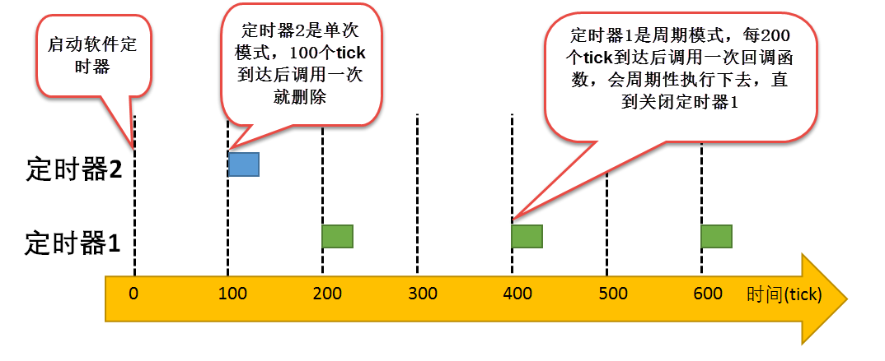
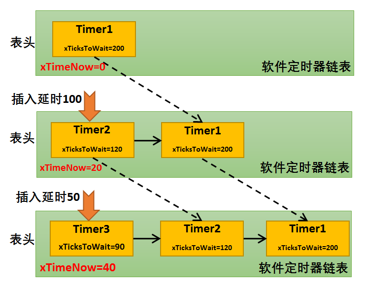
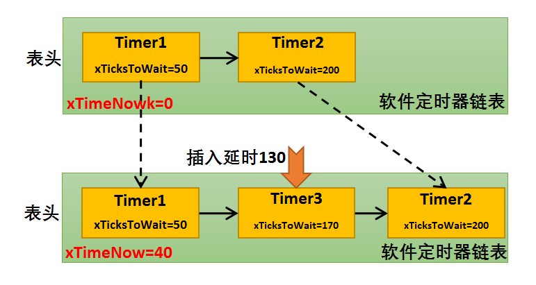
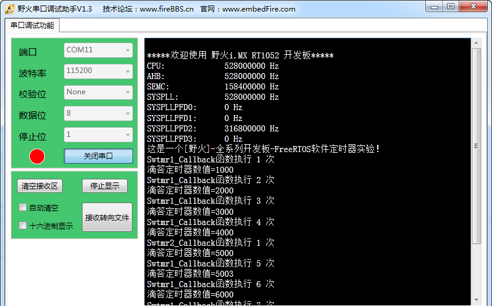

.. vim: syntax=rst

软件定时器
==============

软件定时器的基本概念
~~~~~~~~~~~~~~~~~~~~~~~~~~~~~~

定时器，是指从指定的时刻开始，经过一个指定时间，然后触发一个超时事件，用户可以自定义定时器的周期与频率。类似生活中的闹钟，我们可以设置闹钟每天什么时候响，还能设置响的次数，是响一次还是每天都响。

定时器有硬件定时器和软件定时器之分：

硬件定时器是芯片本身提供的定时功能。一般是由外部晶振提供给芯片输入时钟，芯片向软件模块提供一组配置寄存器，接受控制输入，到达设定时间值后芯片中断控制器产生时钟中断。硬件定时器的精度一般很高，可以达到纳秒级别，并且是中断触发方式。

软件定时器，软件定时器是由操作系统提供的一类系统接口，它构建在硬件定时器基础之上，使系统能够提供不受硬件定时器资源限制的定时器服务，它实现的功能与硬件定时器也是类似的。

使用硬件定时器时，每次在定时时间到达之后就会自动触发一个中断，用户在中断中处理信息；而使用软件定时器时，需要我们在创建软件定时器时指定时间到达后要调用的函数（也称超时函数/回调函数，为了统一，下文均用回调函数描述），在回调函数中处理信息。

注意：软件定时器回调函数的上下文是任务，下文所说的定时器均为软件定时器。

软件定时器在被创建之后，当经过设定的时钟计数值后会触发用户定义的回调函数。定时精度与系统时钟的周期有关。一般系统利用SysTick作为软件定时器的基础时钟，软件定时器的回调函数类似硬件的中断服务函数，所以，回调函数也要快进快出，而且回调函数中不能有任何阻塞任务运行的情况（软件定时器回调函数的上下文环
境是任务），比如vTaskDelay()以及其它能阻塞任务运行的函数，两次触发回调函数的时间间隔xTimerPeriodInTicks叫定时器的定时周期。

FreeRTOS操作系统提供软件定时器功能，软件定时器的使用相当于扩展了定时器的数量，允许创建更多的定时业务。FreeRTOS软件定时器功能上支持：

-  裁剪：能通过宏关闭软件定时器功能。

-  软件定时器创建。

-  软件定时器启动。

-  软件定时器停止。

-  软件定时器复位。

-  软件定时器删除。

FreeRTOS提供的软件定时器支持单次模式和周期模式，单次模式和周期模式的定时时间到之后都会调用软件定时器的回调函数，用户可以在回调函数中加入要执行的工程代码。

单次模式：当用户创建了定时器并启动了定时器后，定时时间到了，只执行一次回调函数之后就将该定时器删除，不再重新执行。

周期模式：这个定时器会按照设置的定时时间循环执行回调函数，直到用户将定时器删除，具体见 图21_1_。

FreeRTOS 通过一个prvTimerTask任务（也叫守护任务Daemon）管理软定时器，它是在启动调度器时自动创建的，为了满足用户定时需求。prvTimerTask任务会在其执行期间检查用户启动的时间周期溢出的定时器，并调用其回调函数。只有设置 FreeRTOSConfig.h
中的宏定义configUSE_TIMERS设置为1 ，将相关代码编译进来，才能正常使用软件定时器相关功能。

软件定时器应用场景
~~~~~~~~~~~~~~~~~~~~~~~~~~~

在很多应用中，我们需要一些定时器任务，硬件定时器受硬件的限制，数量上不足以满足用户的实际需求，无法提供更多的定时器，那么可以采用软件定时器来完成，由软件定时器代替硬件定时器任务。但需要注意的是软件定时器的精度是无法和硬件定时器相比的，因为在软件定时器的定时过程中是极有可能被其它中断所打断，因为软件定
时器的执行上下文环境是任务。所以，软件定时器更适用于对时间精度要求不高的任务，一些辅助型的任务。

软件定时器的精度
~~~~~~~~~~~~~~~~~~~~~~~~~~~

在操作系统中，通常软件定时器以系统节拍周期为计时单位。系统节拍是系统的心跳节拍，表示系统时钟的频率，就类似人的心跳，1s能跳动多少下，系统节拍配置为configTICK_RATE_HZ，该宏在FreeRTOSConfig.h中有定义，默认是1000。那么系统的时钟节拍周期就为1ms（1s跳动1000
下，每一下就为1ms）。软件定时器的所定时数值必须是这个节拍周期的整数倍，例如节拍周期是10ms，那么上层软件定时器定时数值只能是10ms，20ms，100ms等，而不能取值为15ms。由于节拍定义了系统中定时器能够分辨的精确度，系统可以根据实际系统CPU的处理能力和实时性需求设置合适的数值，系统节
拍周期的值越小，精度越高，但是系统开销也将越大，因为这代表在1秒中系统进入时钟中断的次数也就越多。

软件定时器的运作机制
~~~~~~~~~~~~~~~~~~~~~~~~~~~~~~

软件定时器是可选的系统资源，在创建定时器的时候会分配一块内存空间。当用户创建并启动一个软件定时器时，FreeRTOS会根据当前系统时间及用户设置的定时确定该定时器唤醒时间，并将该定时器控制块挂入软件定时器列表，FreeRTOS中采用两个定时器列表维护软件定时器，pxCurrentTimerList与
pxOverflowTimerList是列表指针，在初始化的时候分别指向xActiveTimerList1与xActiveTimerList2，具体见 代码清单21_1_。

.. code-block:: c
    :caption: 代码清单‑1软件定时器用到的列表
    :name: 代码清单21_1
    :linenos:

    PRIVILEGED_DATA static List_t xActiveTimerList1;
    PRIVILEGED_DATA static List_t xActiveTimerList2;
    PRIVILEGED_DATA static List_t *pxCurrentTimerList;
    PRIVILEGED_DATA static List_t *pxOverflowTimerList;

pxCurrentTimerList：系统新创建并激活的定时器都会以超时时间升序的方式插入到pxCurrentTimerList列表中。系统在定时器任务中扫描pxCurrentTimerList中的第一个定时器，看是否已超时，若已经超时了则调用软件定时器回调函数。否则将定时器任务挂起，因为定时时间是
升序插入软件定时器列表的，列表中第一个定时器的定时时间都还没到的话，那后面的定时器定时时间自然没到。

pxOverflowTimerList列表是在软件定时器溢出的时候使用，作用与pxCurrentTimerList一致。

同时，FreeRTOS的软件定时器还有采用消息队列进行通信，利用“定时器命令队列”向软件定时器任务发送一些命令，任务在接收到命令就会去处理命令对应的程序，比如启动定时器，停止定时器等。假如定时器任务处于阻塞状态，我们又需要马上再添加一个软件定时器的话，就是采用这种消息队列命令的方式进行添加，才能唤醒
处于等待状态的定时器任务，并且在任务中将新添加的软件定时器添加到软件定时器列表中，所以，在定时器启动函数中，FreeRTOS是采用队列的方式发送一个消息给软件定时器任务，任务被唤醒从而执行接收到的命令。

例如：系统当前时间xTimeNow值为0，注意：xTimeNow其实是一个局部变量，是根据xTaskGetTickCount()函数获取的，实际它的值就是全局变量xTickCount的值，下文都采用它表示当前系统时间。在当前系统中已经创建并启动了1个定时器Timer1；系统继续运行，当系统的时间xT
imeNow为20的时候，用户创建并且启动一个定时时间为100的定时器Timer2，此时Timer2的溢出时间xTicksToWait就为定时时间+系统当前时间（100+20=120），然后将Timer2按xTicksToWait升序插入软件定时器列表中；假设当前系统时间xTimeNow为40的时候
，用户创建并且启动了一个定时时间为50的定时器Timer3，那么此时Timer3的溢出时间xTicksToWait就为40+50=90，同样安装xTicksToWait的数值升序插入软件定时器列表中，在定时器链表中插入过程具体见 图21_2_。同理创建并且启动在已有的两个定时器中间的定时器也是一样的，具
体见 图21_3_。

那么系统如何处理软件定时器列表？系统在不断运行，而xTimeNow（xTickCount）随着SysTick的触发一直在增长（每一次硬件定时器中断来临，xTimeNow变量会加1），在软件定时器任务运行的时候会获取下一个要唤醒的定时器，比较当前系统时间xTimeNow是否大于或等于下一个定时器唤醒时
间xTicksToWait，若大于则表示已经超时，定时器任务将会调用对应定时器的回调函数，否则将软件定时器任务挂起，直至下一个要唤醒的软件定时器时间到来或者接收到命令消息。以图21‑3为例，讲解软件定时器调用回调函数的过程，在创建定Timer1并且启动后，假如系统经过了50个tick，xTimeNo
w从0增长到50，与Timer1的xTicksToWait值相等，这时会触发与Timer1对应的回调函数，从而转到回调函数中执行用户代码，同时将Timer1从软件定时器列表删除，如果软件定时器是周期性的，那么系统会根据Timer1下一次唤醒时间重新将Timer1添加到软件定时器列表中，按照xTick
sToWait的升序进行排列。同理，在xTimeNow=40的时候创建的Timer3，在经过130个tick后（此时系统时间xTimeNow是40，130个tick就是系统时间xTimeNow为170的时候），与Timer3定时器对应的回调函数会被触发，接着将Timer3从软件定时器列表中删除，如果
是周期性的定时器，还会按照xTicksToWait升序重新添加到软件定时器列表中。

   使用软件定时器时候要注意以下几点：

-  软件定时器的回调函数中应快进快出，绝对不允许使用任何可能引软件定时器起任务挂起或者阻塞的API接口，在回调函数中也绝对不允许出现死循环。

-  软件定时器使用了系统的一个队列和一个任务资源，软件定时器任务的优先级默认为configTIMER_TASK_PRIORITY，为了更好响应，该优先级应设置为所有任务中最高的优先级。

-  创建单次软件定时器，该定时器超时执行完回调函数后，系统会自动删除该软件定时器，并回收资源。

-  定时器任务的堆栈大小默认为configTIMER_TASK_STACK_DEPTH个字节。

软件定时器控制块
~~~~~~~~~~~~~~~~~~~~~~~~

软件定时器虽然不属于内核资源，但是也是FreeRTOS核心组成部分，是一个可以裁剪的功能模块，同样在系统中由一个控制块管理其相关信息，软件定时器的控制块中包含没用过创建的软件定时器基本信息，在使用定时器前我们需要通过xTimerCreate()/xTimerCreateStatic()函数创建一个软
件定时器，在函数中，FreeRTOS将向系统管理的内存申请一块软件定时器控制块大小的内存用于保存定时器的信息，下面来看看软件定时器控制块的成员变量，具体见 代码清单21_2_。

.. code-block:: c
    :caption: 代码清单‑2软件定时器控制块
    :name: 代码清单21_2
    :linenos:

	typedefstruct tmrTimerControl {
	const char				*pcTimerName;	(1)
		ListItem_t				xTimerListItem;	(2)
		TickType_t				xTimerPeriodInTicks;(3)
		UBaseType_t				uxAutoReload;	(4)
	void					*pvTimerID;	(5)
		TimerCallbackFunction_t	pxCallbackFunction;		(6)
	#if( configUSE_TRACE_FACILITY == 1 )
		UBaseType_t			uxTimerNumber;
	#endif

	#if( ( configSUPPORT_STATIC_ALLOCATION == 1 )\
			&& ( configSUPPORT_DYNAMIC_ALLOCATION == 1 ) )
	uint8_t			ucStaticallyAllocated;		(7)
	#endif
	} xTIMER;

	typedef xTIMER Timer_t;

代码清单21_2_ **(1)**\ ：软件定时器名字，这个名字一般用于调试的，RTOS使用定时器是通过其句柄，并不是使用其名字。

代码清单21_2_ **(2)**\ ：软件定时器列表项，用于插入定时器列表。

代码清单21_2_ **(3)**\ ：软件定时器的周期，单位为系统节拍周期（即tick），pdMS_TO_TICKS()可以把时间单位从ms转换为系统节拍周期。

代码清单21_2_ **(4)**\ ：软件定时器是否自动重置，如果该值为pdFalse，那么创建的软件定时器工作模式是单次模式，否则为周期模式。

代码清单21_2_ **(5)**\ ：软件定时器ID，数字形式。该ID典型的用法是当一个回调函数分配给一个或者多个软件定时器时，在回调函数里面根据ID号来处理不同的软件定时器。

代码清单21_2_ **(6)**\ ：软件定时器的回调函数，当定时时间到达的时候就会调用这个函数。

代码清单21_2_ **(7)**\ ：标记定时器使用的内存，删除时判断是否需要释放内存。

软件定时器函数接口讲解
~~~~~~~~~~~~~~~~~~~~~~

软件定时器的功能是在定时器任务（或者叫定时器守护任务）中实现的。软件定时器的很多API函数通过一个名字叫“定时器命令队列”的队列来给定时器守护任务发送命令。该定时器命令队列由RTOS内核提供，且应用程序不能够直接访问，其消息队列的长度由宏configTIMER_QUEUE_LENGTH定义，下面就讲
解一些常用的软件定时器函数接口。

软件定时器创建函数xTimerCreate()
^^^^^^^^^^^^^^^^^^^^^^^^^^^^^^^^^^^^^^^^^^^^^^

软件定时器与FreeRTOS内核其他资源一样，需要创建才允许使用的，FreeRTOS为我们提供了两种创建方式，一种是动态创建软件定时器xTimerCreate()，另一种是静态创建方式xTimerCreateStatic()，因为创建过程基本差不多，所以在这里我们只讲解动态创建方式。

xTimerCreate()用于创建一个软件定时器，并返回一个句柄。要想使用该函数函数必须在头文件FreeRTOSConfig.h中把宏configUSE_TIMERS 和\ `configSUPPORT_DYNAMIC_ALLOCATION
<http://www.freertos.org/a00110.html#configSUPPORT_DYNAMIC_ALLOCATION>`__ 均定义为1（\ `configSUPPORT_DYNAMIC_ALLOCATION
<http://www.freertos.org/a00110.html#configSUPPORT_DYNAMIC_ALLOCATION>`__\ 在FreeRTOS.h中默认定义为1），并且需要把FreeRTOS/source/times.c 这个C文件添加到工程中。

每一个软件定时器只需要很少的RAM空间来保存其的状态。如果使用函数xTimeCreate()来创建一个软件定时器，那么需要的RAM是动态分配的。如果使用函数\ `xTimeCreateStatic
<http://www.freertos.org/xEventGroupCreateStatic.html>`__\ ()来创建一个事件组，那么需要的RAM是静态分配的

软件定时器在创建成功后是处于休眠状态的，可以使用\ `xTimerStart() <http://www.freertos.org/FreeRTOS-timers-xTimerStart.html>`__\ 、\ `xTimerReset()
<http://www.freertos.org/FreeRTOS-timers-xTimerReset.html>`__\ 、\ `xTimerStartFromISR() <http://www.freertos.org/FreeRTOS-timers-
xTimerStartFromISR.html>`__\ 、\ `xTimerResetFromISR() <http://www.freertos.org/FreeRTOS-timers-xTimerResetFromISR.html>`__\ 、 `xTimerChangePeriod()
<http://www.freertos.org/FreeRTOS-timers-xTimerChangePeriod.html>`__ 和\ `xTimerChangePeriodFromISR() <http://www.freertos.org/FreeRTOS-timers-
xTimerChangePeriodFromISR.html>`__\ 这些函数将其状态转换为活跃态。

xTimerCreate()函数源码具体见 代码清单21_3_。

.. code-block:: c
    :caption: 代码清单‑3xTimerCreate()源码
    :name: 代码清单21_3
    :linenos:

	#if( configSUPPORT_DYNAMIC_ALLOCATION == 1 )
 
	TimerHandle_t xTimerCreate(const char * const pcTimerName,	(1)	
	const TickType_t xTimerPeriodInTicks,(2)	
	const UBaseType_t uxAutoReload,	(3)
	void * const pvTimerID,		(4)
	TimerCallbackFunction_t pxCallbackFunction )(5)
	{
		Timer_t *pxNewTimer;

	/* 为这个软件定时器申请一块内存 */
		pxNewTimer = ( Timer_t * ) pvPortMalloc( sizeof( Timer_t ) );(6)

	if ( pxNewTimer != NULL ) {
	/* 内存申请成功，进行初始化软件定时器 */
	prvInitialiseNewTimer( pcTimerName,
						xTimerPeriodInTicks,
						uxAutoReload,
						pvTimerID,
						pxCallbackFunction,
						pxNewTimer );			(7)

	#if( configSUPPORT_STATIC_ALLOCATION == 1 )
			{
				pxNewTimer->ucStaticallyAllocated = pdFALSE;
			}
	#endif
		}

	return pxNewTimer;
	}

代码清单21_3_ **(1)**\ ：软件定时器名字，文本形式，纯粹是为了调试，FreeRTOS使用定时器是通过其句柄，而不是使用其名字。

代码清单21_3_ **(2)**\ ：软件定时器的周期，单位为系统节拍周期（即tick）。使用pdMS_TO_TICKS()可以把时间单位从ms转换为系统节拍周期。如果软件定时器的周期为100个tick，那么只需要简单的设置xTimerPeriod的值为100即可。如果软件定时器的周期为500ms
，那么xTimerPeriod应设置为pdMS_TO_TICKS(500)。宏pdMS_TO_TICKS()只有当\ `configTICK_RATE_HZ <http://www.freertos.org/a00110.html#configTICK_RATE_HZ>`__\
配置成小于或者等于1000HZ时才可以使用。

代码清单21_3_ **(3)**\ ：如果uxAutoReload 设置为pdTRUE，那么软件定时器的工作模式就是周期模式，一直会以用户指定的xTimerPeriod周期去执行回调函数。如果uxAutoReload
设置为pdFALSE，那么软件定时器就在用户指定的xTimerPeriod周期下运行一次后就进入休眠态。

代码清单21_3_ **(4)**\ ：软件定时器ID，数字形式。该ID典型的用法是当一个回调函数分配给一个或者多个软件定时器时，在回调函数里面根据ID号来处理不同的软件定时器。

代码清单21_3_ **(5)**\ ：软件定时器的回调函数，当定时时间到达的时候就会调用这个函数，该函数需要用户自己实现。

代码清单21_3_ **(6)**\ ：为这个软件定时器申请一块内存，大小为软件定时器控制块大小，用于保存该定时器的基本信息。

代码清单21_3_ **(7)**\ ：调用prvInitialiseNewTimer()函数初始化一个新的软件定时器，该函数的源码具体见 代码清单21_4_ **(3)**\ ：。

.. code-block:: c
    :caption: 代码清单‑4 prvInitialiseNewTimer()源码
    :name: 代码清单21_4
    :linenos:

	static void prvInitialiseNewTimer(const char * const pcTimerName,
	 const TickType_t xTimerPeriodInTicks,
	const UBaseType_t uxAutoReload,
	void * const pvTimerID,
									TimerCallbackFunction_t pxCallbackFunction,
	Timer_t *pxNewTimer )
	{
	/* 断言，判断定时器的周期是否大于0 */
		configASSERT( ( xTimerPeriodInTicks > 0 ) );		(1)
	
	if ( pxNewTimer != NULL ) {
	/* 初始化软件定时器列表与创建软件定时器消息队列 */
			prvCheckForValidListAndQueue();				(2)
	
	/* 初始化软件定时信息，这些信息保存在软件定时器控制块中 */	(3)
			pxNewTimer->pcTimerName = pcTimerName;
			pxNewTimer->xTimerPeriodInTicks = xTimerPeriodInTicks;
			pxNewTimer->uxAutoReload = uxAutoReload;
			pxNewTimer->pvTimerID = pvTimerID;
			pxNewTimer->pxCallbackFunction = pxCallbackFunction;	
			vListInitialiseItem( &( pxNewTimer->xTimerListItem ) );	(4)
			traceTIMER_CREATE( pxNewTimer );
		}
	}

代码清单21_4_ **(1)**\ ：断言，判断软件定时器的周期是否大于0，否则的话其他任务是没办法执行的，因为系统会一直执行软件定时器回调函数。

代码清单21_4_ **(2)**\ ：在prvCheckForValidListAndQueue()函数中系统将初始化软件定时器列表与创建软件定时器消息队列，也叫“定时器命令队列”，因为在使用软件定时器的时候，用户是无法直接控制软件定时器的，必须通过“定时器命令队列”向软件定时器发送一个命令，软件
定时器任务被唤醒就去执行对应的命令操作。

代码清单21_4_ **(3)**\ ：初始化软件定时基本信息，如定时器名称、回调周期、定时器ID与定时器回调函数等，这些信息保存在软件定时器控制块中，在操作软件定时器的时候，就需要用到这些信息。

代码清单21_4_ **(4)**\ ：初始化定时器列表项。

软件定时器的创建很简单，需要用户根据自己需求指定相关信息即可，下面来看看xTimerCreate()函数使用实例，具体见 代码清单21_5_ 高亮部分。

.. code-block:: c
    :caption: 代码清单‑5xTimerCreate()使用实例
    :emphasize-lines: 4-8,19-23
    :name: 代码清单21_5
    :linenos:

	static TimerHandle_t Swtmr1_Handle =NULL;   /* 软件定时器句柄 */
	static TimerHandle_t Swtmr2_Handle =NULL;   /* 软件定时器句柄 */
	/* 周期模式的软件定时器1,定时器周期 1000(tick)*/
	Swtmr1_Handle=xTimerCreate((const char*)"AutoReloadTimer",
					(TickType_t)1000,/* 定时器周期 1000(tick) */
					(UBaseType_t)pdTRUE,/* 周期模式 */
					(void* )1,/* 为每个计时器分配一个索引的唯一ID */
					(TimerCallbackFunction_t)Swtmr1_Callback); /* 回调函数 */
	if (Swtmr1_Handle != NULL)
	{
	/********************************************************************
		* xTicksToWait:如果在调用xTimerStart()时队列已满，则以tick为单位指定调用任务应保持
		* 在Blocked(阻塞)状态以等待start命令成功发送到timer命令队列的时间。
		* 如果在启动调度程序之前调用xTimerStart()，则忽略xTicksToWait。在这里设置等待时间为0.
	**********************************************************************/
		xTimerStart(Swtmr1_Handle,0);	//开启周期定时器
	}
	 /* 单次模式的软件定时器2,定时器周期 5000(tick)*/
	Swtmr2_Handle=xTimerCreate((const char*	)"OneShotTimer",
				(TickType_t)5000,/* 定时器周期 5000(tick) */
						(UBaseType_t	)pdFALSE,/* 单次模式 */
						(void*)2,/* 为每个计时器分配一个索引的唯一ID */
						(TimerCallbackFunction_t)Swtmr2_Callback);
	if (Swtmr2_Handle != NULL)
	{
		xTimerStart(Swtmr2_Handle,0);	//开启单次定时器
	}
	
	static void Swtmr1_Callback(void* parameter)
	{
	/* 软件定时器的回调函数，用户自己实现 */
	}
	
	static void Swtmr2_Callback(void* parameter)
	{
	/* 软件定时器的回调函数，用户自己实现 */
	}

软件定时器启动函数
^^^^^^^^^^^^^^^^^^

xTimerStart()
''''''''''''''''''''''''''

如果是认真看上面xTimerCreate()函数使用实例的同学应该就发现了，这个软件定时器启动函数xTimerStart()在上面的实例中有用到过，前一小节已经说明了，软件定时器在创建完成的时候是处于休眠状态的，需要用FreeRTOS的相关函数将软件定时器活动起来，而xTimerStart()函数就
是可以让处于休眠的定时器开始工作。

我们知道，在系统开始运行的时候，系统会帮我们自动创建一个软件定时器任务（prvTimerTask），在这个任务中，如果暂时没有运行中的定时器，任务会进入阻塞态等待命令，而我们的启动函数就是通过“定时器命令队列”向定时器任务发送一个启动命令，定时器任务获得命令就解除阻塞，然后执行启动软件定时器命令。下
面来看看xTimerStart()是怎么让定时器工作的吧，其源码具体见 代码清单21_6_ 与 代码清单21_8_。

.. code-block:: c
    :caption: 代码清单‑6xTimerStart()函数原型
    :name: 代码清单21_6
    :linenos:

	#define xTimerStart( xTimer, xTicksToWait ) 			\
	xTimerGenericCommand( ( xTimer ), 		\(1)
				tmrCOMMAND_START, 		\(2)
				( xTaskGetTickCount() ),	\(3)
					NULL,				\(4)	
					( xTicksToWait ) )		(5)	

xTimerStart()函数就是一个宏定义，真正起作用的是xTimerGenericCommand()函数。

代码清单21_6_ **(1)**\ ：要操作的软件定时器句柄。

代码清单21_6_ **(2)**\ ：tmrCOMMAND_START是软件定时器启动命令，因为现在是要将软件定时器启动，该命令在timers.h中有定义。xCommandID参数可以指定多个命令，软件定时器操作支持的命令具体见 代码清单21_7_。

.. code-block:: c
    :caption: 代码清单‑7软件定时器支持的命令
    :name: 代码清单21_7
    :linenos:

	#define tmrCOMMAND_EXECUTE_CALLBACK_FROM_ISR 	( ( BaseType_t ) -2 )
	#define tmrCOMMAND_EXECUTE_CALLBACK		( ( BaseType_t ) -1 )
	#define tmrCOMMAND_START_DONT_TRACE		( ( BaseType_t ) 0 )
	#define tmrCOMMAND_START			 ( ( BaseType_t ) 1 )
	#define tmrCOMMAND_RESET			( ( BaseType_t ) 2 )
	#define tmrCOMMAND_STOP			( ( BaseType_t ) 3 )
	#define tmrCOMMAND_CHANGE_PERIOD		( ( BaseType_t ) 4 )
	#define tmrCOMMAND_DELETE			( ( BaseType_t ) 5 )

	#define tmrFIRST_FROM_ISR_COMMAND		( ( BaseType_t ) 6 )
	#define tmrCOMMAND_START_FROM_ISR		( ( BaseType_t ) 6 )
	#define tmrCOMMAND_RESET_FROM_ISR		( ( BaseType_t ) 7 )
	#define tmrCOMMAND_STOP_FROM_ISR		( ( BaseType_t ) 8 )
	#define tmrCOMMAND_CHANGE_PERIOD_FROM_ISR		( ( BaseType_t ) 9 )

代码清单21_6_ **(3)**\ ：获取当前系统时间。

代码清单21_6_ **(4)**\ ：pxHigherPriorityTaskWoken为NULL，该参数在中断中发送命令才起作用。

代码清单21_6_ **(5)**\ ：用户指定超时阻塞时间，单位为系统节拍周期(即tick)。调用xTimerStart()的任务将被锁定在阻塞态，在软件定时器把启动的命令成功发送到定时器命令队列之前。如果在FreeRTOS调度器开启之前调用xTimerStart()，形参将不起作用。

代码清单‑8 xTimerGenericCommand()源码

.. code-block:: c
    :caption: 代码清单‑8 xTimerGenericCommand()源码
    :name: 代码清单21_8
    :linenos:

	BaseType_t xTimerGenericCommand( TimerHandle_t xTimer,
	const BaseType_t xCommandID,
	const TickType_t xOptionalValue,
									BaseType_t * const pxHigherPriorityTaskWoken,
	const TickType_t xTicksToWait )
	{
		BaseType_t xReturn = pdFAIL;
		DaemonTaskMessage_t xMessage;
	
		configASSERT( xTimer );					
	
	/* 发送命令给定时器任务 */
	if ( xTimerQueue != NULL ) {				(1)
	/* 要发送的命令信息，包含命令、
	命令的数值（比如可以表示当前系统时间、要修改的定时器周期等）
	以及要处理的软件定时器句柄 */
			xMessage.xMessageID = xCommandID;			(2)
			xMessage.u.xTimerParameters.xMessageValue = xOptionalValue;
			xMessage.u.xTimerParameters.pxTimer = ( Timer_t * ) xTimer;
	
	/* 命令是在任务中发出的 */
	if ( xCommandID < tmrFIRST_FROM_ISR_COMMAND ) {		(3)
	/* 如果调度器已经运行了，就根据用户指定超时时间发送 */
	if ( xTaskGetSchedulerState() == taskSCHEDULER_RUNNING ) {
					xReturn = xQueueSendToBack( xTimerQueue,
	&xMessage,
												xTicksToWait );	(4)
				} else {
	/* 如果调度器还未运行，发送就行了，不需要阻塞 */
					xReturn = xQueueSendToBack( xTimerQueue,
	&xMessage,
												tmrNO_DELAY );	(5)
				}
			}
	/* 命令是在中断中发出的 */
	else {
	/* 调用从中断向消息队列发送消息的函数 */
				xReturn = xQueueSendToBackFromISR( xTimerQueue,	(6)
	&xMessage,
	pxHigherPriorityTaskWoken );
			}
	         traceTIMER_COMMAND_SEND( xTimer,
                                  xCommandID,
                                  xOptionalValue,
                                  xReturn );
		} else {
			mtCOVERAGE_TEST_MARKER();
		}
	
	return xReturn;
	}

代码清单21_8_ **(1)**\ ：系统打算通过“定时器命令队列”发送命令给定时器任务，需要先判断一下“定时器命令队列”是否存在，只有存在队列才允许发送命令。

代码清单21_8_ **(2)**\ ：要发送的命令基本信息，包括命令、命令的数值（比如可以表示当前系统时间、要修改的定时器周期等）以及要处理的软件定时器句柄等。

代码清单21_8_ **(3)**\ ：根据用户指定的xCommandID参数，判断命令是在哪个上下文环境发出的，如果是在任务中发出的，则执行\ **(4)**\ 、\ **(5)**\ 代码，否则就执行\ **(6)**\ 。

代码清单21_8_ **(4)**\ ：如果系统调度器已经运行了，就根据用户指定超时时间向“定时器命令队列”发送命令。

代码清单21_8_ **(5)**\ ：如果调度器还未运行，用户指定的超时时间是无效的，发送就行了，不需要阻塞，tmrNO_DELAY的值为0。

代码清单21_8_ **(6)**\ ：命令是在中断中发出的，调用从中断向消息队列发送消息的函数xQueueSendToBackFromISR()就行了。

软件定时器启动函数的使用很简单，在创建一个软件定时器完成后，就可以调用该函数启动定时器了，具体见 代码清单21_5_。

xTimerStartFromISR()
''''''''''''''''''''''''''''''''''''''''

当然除在任务启动软件定时器之外，还有在中断中启动软件定时器的函数xTimerStartFromISR()。xTimerStartFromISR()是函数xTimerStart()的中断版本，用于启动一个先前由函数\ `xTimerCreate()
<http://www.freertos.org/FreeRTOS-timers-xTimerCreate.html>`__ /xTimerCreateStatic()创建的软件定时器。
该函数的具体说明见表 xTimerStartFromISR函数说明_，使用实例具体见 代码清单21_9_。

表格‑1 xTimerStartFromISR()函数说明

.. list-table::
   :widths: 33 33
   :name: xTimerStartFromISR函数说明
   :header-rows: 0

   * - **函数原型**
     - #define xTimerStartFromISR( xTimer, pxHigherPriorityTaskWoken )
       xTimerGenericCommand( ( xTimer ), tmrCOMMAND_START_FROM_ISR,
       ( xTaskGetTickCountFromISR() ),
       ( pxHigherPriorityTaskWoken ), 0U )

   * - **功能**
     - 在中断中启动一个软件定时器。

   * - **形参**
     - xTimer	软件定时器句柄。

   * - **形参**
     - pxHigherPriorityTaskWoken	定时器守护任务的大部分时间都在阻塞态等待定时器命令队列的命令。调用函数xTimerStartFromISR()将会往定时器的命令队列发送一个启动命令，这很有可能会将定时器任务从阻塞态移除。如果调用函数xTimerStartFromISR()让定时器任务脱离阻塞态，且定时器守护任务的优先级大于或者等于当前被中断的任务的优先级，那么pxHigherPriorityTaskWoken的值会在函数xTimerStartFromISR()内部设置为pdTRUE，然后在中断退出之前执行一次上下文切换。

   * - **返回值**
     - 如果启动命令无法成功地发送到定时器命令队列则返回pdFAILE，成功发送则返回pdPASS。软件定时器成功发送的命令是否真正的被执行也还要看定时器守护任务的优先级，其优先级由宏configTIMER_TASK_PRIORITY定义。

.. code-block:: c
    :caption: 代码清单‑9xTimerStartFromISR()函数应用举例
    :emphasize-lines: 24-27,31-32
    :name: 代码清单21_9
    :linenos:

	/* 这个方案假定软件定时器xBacklightTimer已经创建，
	定时周期为5s，执行次数为一次，即定时时间到了之后
	就进入休眠态。
	程序说明：当按键按下，打开液晶背光，启动软件定时器，
	5s时间到，关掉液晶背光*/

	/* 软件定时器回调函数 */
	void vBacklightTimerCallback( TimerHandle_t pxTimer )
	{
	/* 关掉液晶背光 */
		vSetBacklightState( BACKLIGHT_OFF );
	}

	/* 按键中断服务程序 */
	void vKeyPressEventInterruptHandler( void )
	{
		BaseType_t xHigherPriorityTaskWoken = pdFALSE;

	/* 确保液晶背光已经打开 */
		vSetBacklightState( BACKLIGHT_ON );

	/* 启动软件定时器 */
	if ( xTimerStartFromISR( xBacklightTimer,
	&xHigherPriorityTaskWoken ) != pdPASS ) {
	/* 软件定时器开启命令没有成功执行 */
		}

	/* ...执行其他的按键相关的功能代码 */

	if ( xHigherPriorityTaskWoken != pdFALSE ) {
	/* 执行上下文切换 */
		}
	}

软件定时器停止函数
^^^^^^^^^^^^^^^^^^^^^^^^^^^

xTimerStop()
''''''''''''''''''''''''

xTimerStop() 用于停止一个已经启动的软件定时器，该函数的实现也是通过“定时器命令队列”发送一个停止命令给软件定时器任务，从而唤醒软件定时器任务去将定时器停止。要想使函数xTimerStop()必须在头文件FreeRTOSConfig.h中把宏configUSE_TIMERS定义为1。该函
数的具体说明见表 xTimerStop函数说明_。

表格‑2xTimerStop()函数说明

.. list-table::
   :widths: 33 33
   :name: xTimerStop函数说明
   :header-rows: 0

   * - **函数原型**
     - BaseType_t xTimerStop( TimerHandle_t xTimer, TickType_t xBlockTime );

   * - **功能**
     - 停止一个软件定时器，让其进入休眠态。

   * - **形参**
     - xTimer	软件定时器句柄。

   * - **形参**
     - xBlockTime	用户指定超时时间，单位为系统节拍周期(即tick)。如果在FreeRTOS调度器开启之前调用xTimerStop()，形参将不起作用。

   * - **返回值**
     - 如果启动命令在超时时间之前无法成功地发送到定时器命令队列则返回pdFAILE，成功发送则返回pdPASS。软件定时器成功发送的命令是否真正的被执行也还要看定时器守护任务的优先级，其优先级由宏configTIMER_TASK_PRIORITY定义。

软件定时器停止函数的使用实例很简单，在使用该函数前请确认定时器已经开启，具体见 代码清单21_10_  高亮部分。

.. code-block:: c
    :caption: 代码清单‑10xTimerStop()使用实例
    :emphasize-lines: 16,23
    :name: 代码清单21_10
    :linenos:

	static TimerHandle_t Swtmr1_Handle =NULL;   /* 软件定时器句柄 */
 
	/* 周期模式的软件定时器1,定时器周期 1000(tick)*/
	Swtmr1_Handle=xTimerCreate((const char*	)"AutoReloadTimer",
							(TickType_t	)1000,/* 定时器周期 1000(tick) */
							(UBaseType_t	)pdTRUE,/* 周期模式 */
							(void*)1,/* 为每个计时器分配一个索引的唯一ID */
								(TimerCallbackFunction_t)Swtmr1_Callback); /* 回调函数 */
	if (Swtmr1_Handle != NULL)
	{
	/********************************************************************
		* xTicksToWait:如果在调用xTimerStart()时队列已满，则以tick为单位指定调用任务应保持
		* 在Blocked(阻塞)状态以等待start命令成功发送到timer命令队列的时间。
		* 如果在启动调度程序之前调用xTimerStart()，则忽略xTicksToWait。在这里设置等待时间为0.
		*******************************************************************/
		xTimerStart(Swtmr1_Handle,0);	//开启周期定时器
	}
	
	static void test_task(void* parameter)
	{
	while (1) {
	/* 用户自己实现任务代码 */
			xTimerStop(Swtmr1_Handle,0);	//停止定时器
		}
	
	}

xTimerStopFromISR()
''''''''''''''''''''''''''''''''''''''

xTimerStopFromISR()是函数xTimerStop()的中断版本，用于停止一个正在运行的软件定时器，让其进入休眠态，实现过程也是通过“定时器命令队列”向软件定时器任务发送停止命令。
该函数的具体说明见表 xTimerStopFromISR函数说明_，应用举例见 代码清单21_11_ 高亮部分。

表格‑3xTimerStopFromISR()函数说明

.. list-table::
   :widths: 33 33
   :name: xTimerStopFromISR函数说明
   :header-rows: 0

   * - **函数原型**
     - BaseType_t xTimerStopFromISR(TimerHandle_t xTimer,BaseType_t \*pxHigherPriorityTaskWoken);

   * - **功能**
     - 在中断中停止一个软件定时器，让其进入休眠态。

   * - **形参**
     - xTimer	软件定时器句柄。

   * - **形参**
     - pxHigherPriorityTaskWoken	定时器守护任务的大部分时间都在阻塞态等待定时器命令队列的命令。调用函数xTimerStopFromISR()将会往定时器的命令队列发送一个停止命令，这很有可能会将定时器任务从阻塞态移除。如果调用函数xTimerStopFromISR()让定时器任务脱离阻塞态，且定时器守护任务的优先级大于或者等于当前被中断的任务的优先级，那么pxHigherPriorityTaskWoken的值会在函数xTimerStopFromISR()内部设置为pdTRUE，然后在中断退出之前执行一次上下文切换。

   * - **返回值**
     - 如果停止命令在超时时间之前无法成功地发送到定时器命令队列则返回pdFAILE，成功发送则返回pdPASS。软件定时器成功发送的命令是否真正的被执行也还要看定时器守护任务的优先级，其优先级由宏configTIMER_TASK_PRIORITY定义。

代码清单‑11xTimerStopFromISR()函数应用举例

.. code-block:: c
    :caption: 代码清单‑10xTimerStop()使用实例
    :emphasize-lines: 9,14
    :name: 代码清单21_11
    :linenos:

	/* 这个方案假定软件定时器xTimer已经创建且启动。
	当中断发生时，停止软件定时器 */

	/* 停止软件定时器的中断服务函数*/
	void vAnExampleInterruptServiceRoutine( void )
	{
		BaseType_t xHigherPriorityTaskWoken = pdFALSE;

	f (xTimerStopFromISR(xTimer,&xHigherPriorityTaskWoken)!=pdPASS ) {
	/* 软件定时器停止命令没有成功执行 */
		}

	if ( xHigherPriorityTaskWoken != pdFALSE ) {
	/* 执行上下文切换 */
		}
	}

软件定时器任务
^^^^^^^^^^^^^^^^^^^^^

我们知道，软件定时器回调函数运行的上下文环境是任务，那么软件定时器任务是在干什么的呢？如何创建的呢？下面跟我一步步来分析软件定时器的工作过程。

软件定时器任务是在系统开始调度（vTaskStartScheduler()函数）的时候就被创建的，前提是将宏定义configUSE_TIMERS开启，
具体见 代码清单21_12_ 高亮部分，在xTimerCreateTimerTask()函数里面就是创建了一个软件定时器任务，就跟我们创建任务一样，支持动态
与静态创建，我们暂时看动态创建的即可，具体见 代码清单21_13_ 高亮部分。

.. code-block:: c
    :caption: 代码清单‑12 vTaskStartScheduler()函数里面的创建定时器函数（已删减）
    :emphasize-lines: 7
    :name: 代码清单21_12
    :linenos:

	void vTaskStartScheduler( void )
	{
	#if ( configUSE_TIMERS == 1 )
		{
	if ( xReturn == pdPASS )
			{
				xReturn = xTimerCreateTimerTask();
			} else
			{
				mtCOVERAGE_TEST_MARKER();
			}
		}
		#endif/* configUSE_TIMERS */

	}

.. code-block:: c
    :caption: 代码清单‑13 xTimerCreateTimerTask()源码
    :emphasize-lines: 32-38
    :name: 代码清单21_13
    :linenos:

	BaseType_t xTimerCreateTimerTask( void )
	{
		BaseType_t xReturn = pdFAIL;
	
		prvCheckForValidListAndQueue();
	
	if ( xTimerQueue != NULL ) {
	#if( configSUPPORT_STATIC_ALLOCATION == 1 ) /* 静态创建任务 */
			{
				StaticTask_t *pxTimerTaskTCBBuffer = NULL;
				StackType_t *pxTimerTaskStackBuffer = NULL;
	uint32_t ulTimerTaskStackSize;
	
				vApplicationGetTimerTaskMemory( &pxTimerTaskTCBBuffer,
	&pxTimerTaskStackBuffer,
	&ulTimerTaskStackSize );
				xTimerTaskHandle = xTaskCreateStatic(prvTimerTask,
						"Tmr Svc",
						ulTimerTaskStackSize,
						NULL,
				( ( UBaseType_t ) configTIMER_TASK_PRIORITY ) | portPRIVILEGE_BIT,
						pxTimerTaskStackBuffer,
						pxTimerTaskTCBBuffer );
	
	if ( xTimerTaskHandle != NULL )
				{
					xReturn = pdPASS;
				}
			}
	#else		/* 动态创建任务 */
			{
				xReturn = xTaskCreate(prvTimerTask,
					"Tmr Svc",
					configTIMER_TASK_STACK_DEPTH,
					NULL,
				( ( UBaseType_t ) configTIMER_TASK_PRIORITY ) | portPRIVILEGE_BIT,
					&xTimerTaskHandle );	(1)
			}
	#endif
		} else {
			mtCOVERAGE_TEST_MARKER();
		}
	
		configASSERT( xReturn );
	return xReturn;
	}

代码清单21_13_ **(1)**\
：系统调用xTaskCreate()函数创建了一个软件定时器任务，任务的入口函数是prvTimerTask，任务的优先级是configTIMER_TASK_PRIORITY，
那么我们就去软件定时器任务函数prvTimerTask()中看看任务在做什么东西，具体见 代码清单21_14_。

.. code-block:: c
    :caption: 代码清单‑14prvTimerTask()源码（已删减）
    :name: 代码清单21_14
    :linenos:

	static void prvTimerTask( void *pvParameters )
	{
		TickType_t xNextExpireTime;
		BaseType_t xListWasEmpty;
	
		( void ) pvParameters;
	
	for ( ;; ) {
	/* 获取下一个要到期的软件定时器的时间 */
			xNextExpireTime = prvGetNextExpireTime( &xListWasEmpty );(1)

	/* 处理定时器或者将任务阻塞到下一个到期的软件定时器时间 */
			prvProcessTimerOrBlockTask( xNextExpireTime, xListWasEmpty );(2)

	/* 读取“定时器命令队列”，处理相应命令 */
			prvProcessReceivedCommands();				(3)
		}
	}

软件定时器任务的处理很简单，如果当前有软件定时器在运行，那么它大部分的时间都在等待定时器到期时间的到来，或者在等待对软件定时器操作的命令，而如果没有软件定时器在运行，那定时器任务的绝大部分时间都在阻塞中等待定时器的操作命令。

代码清单21_14_ **(1)**\ ：获取下一个要到期的软件定时器的时间，因为软件定时器是由定时器列表维护的，并且按照到期的时间进行升序排列，只需获取软件定时器列表中的第一个定时器到期时间就是下一个要到期的时间。

代码清单21_14_  **(2)**\ ：处理定时器或者将任务阻塞到下一个到期的软件定时器时间，因为系统时间节拍随着系统的运行可能会溢出，那么就需要处理溢出的情况，如果没有溢出，那么就等待下一个定时器到期时间的到来。该函数每次调用都会记录节拍值，下一次调用，通过比较相邻两次调用的值判断节拍计数器是否
溢出过。当节拍计数器溢出，需要处理掉当前定时器列表上的定时器（因为这条定时器列表上的定时器都已经溢出了），然后切换定时器列表。

软件定时器是一个任务，在下一个定时器到了之前的这段时间，系统要把任务状态转移为阻塞态，让其他的任务能正常运行，这样子就使得系统的资源能充分利用，prvProcessTimerOrBlockTask()源码具体见 代码清单21_15_。

.. code-block:: c
    :caption: 代码清单‑15prvProcessTimerOrBlockTask()源码
    :name: 代码清单21_15
    :linenos:

	static void prvProcessTimerOrBlockTask( const TickType_t xNextExpireTime,
                                         BaseType_t xListWasEmpty )
	{
		TickType_t xTimeNow;
		BaseType_t xTimerListsWereSwitched;
	
		vTaskSuspendAll();						(1)
		{
	// 获取当前系统时间节拍并判断系统节拍计数是否溢出
	// 如果是，那么就处理当前列表上的定时器，并切换定时器列表
			xTimeNow = prvSampleTimeNow( &xTimerListsWereSwitched );(2)
	
	// 系统节拍计数器没有溢出
	if ( xTimerListsWereSwitched == pdFALSE ) {		(3)
	// 判断是否有定时器是否到期，
	//定时器列表非空并且定时器的时间已比当前时间小，说明定时器到期了
	if ((xListWasEmpty == pdFALSE )&&(xNextExpireTime <= xTimeNow )){(4)
	// 恢复调度器
					( void ) xTaskResumeAll();			
	//执行相应定时器的回调函数
	// 对于需要自动重载的定时器，更新下一次溢出时间，插回列表
					prvProcessExpiredTimer( xNextExpireTime, xTimeNow );
				} else {
	// 当前定时器列表中没有定时器
	if ( xListWasEmpty != pdFALSE ) {		(5)
	//发生这种情况的可能是系统节拍计数器溢出了，
	//定时器被添加到溢出列表中，所以判断定时器溢出列表上是否有定时器
						xListWasEmpty = listLIST_IS_EMPTY( pxOverflowTimerList );
					}

	// 定时器定时时间还没到，将当前任务挂起，
	// 直到定时器到期才唤醒或者收到命令的时候唤醒
					vQueueWaitForMessageRestricted( xTimerQueue,
										( xNextExpireTime - xTimeNow ),
	xListWasEmpty );		(6)	

	// 恢复调度器
	if ( xTaskResumeAll() == pdFALSE ) {
	// 进行任务切换
						portYIELD_WITHIN_API();			(7)
					} else {
						mtCOVERAGE_TEST_MARKER();
					}
				}
			} else {
				( void ) xTaskResumeAll();
			}
		}
	}

代码清单21_15_1 **(1)**\ ：挂起调度器。接下来的操作会对定时器列表进行操作，系统不希望别的任务来操作定时器列表，所以暂时让定时器任务独享CPU使用权，在此期间不进行任务切换。

代码清单21_15_1 **(2)**\ ：获取当前系统时间节拍并判断系统节拍计数是否溢出，如果已经溢出了，那么就处理当前列表上的定时器，
并切换定时器列表，prvSampleTimeNow()函数就实现这些功能，其源码具体见 代码清单21_16_。

.. code-block:: c
    :caption: 代码清单‑16prvSampleTimeNow()源码
    :name: 代码清单21_16
    :linenos:

	static TickType_t prvSampleTimeNow( BaseType_t * const pxTimerListsWereSwitched )
	{
		TickType_t xTimeNow;
		// 定义一个静态变量记录上一次调用时系统时间节拍值
		PRIVILEGED_DATA static TickType_t xLastTime = ( TickType_t ) 0U;(1)
	
	//获取当前系统时间节拍
		xTimeNow = xTaskGetTickCount();				(2)
	
	//判断是否溢出了，
	//当前系统时间节拍比上一次调用时间节拍的值小，这种情况是溢出的情况
	if ( xTimeNow < xLastTime ) {				(3)
	// 发生溢出，处理当前定时器列表上所有定时器并切换定时器列表
			prvSwitchTimerLists();					
			*pxTimerListsWereSwitched = pdTRUE;			
		} else {
			*pxTimerListsWereSwitched = pdFALSE;			
		}
	// 更新本次系统时间节拍
		xLastTime = xTimeNow;					(4)
	
	return xTimeNow;						(5)
	}

代码清单21_16_ **(1)**\ ：定义一个静态变量，记录上一次调用时系统时间节拍的值。

代码清单21_16_ **(2)**\ ：获取当前系统时间节拍值。

代码清单21_16_ **(3)**\ ：判断是系统节拍计数器否溢出了，当前系统时间节拍比上一次调用时间节拍的值小，这种情况是溢出的情况。而如果发生了溢出，系统就要处理当前定时器列表上所有定时器并切将当前时器列表的定时器切换到定时器溢出列表中，因为软件定时器由两个列表维护，并且标记一下定时器列表已经
切换了，pxTimerListsWereSwitched的值等于pdTRUE。

代码清单21_16_ **(4)**\ ：更新本次系统时间节拍的值。

代码清单21_16_ **(5)**\ ：返回当前系统时间节拍。

代码清单21_15_ **(3)**\ ：如果系统节拍计数器没有溢出。

代码清单21_15_ **(4)**\ ：判断是否有定时器是否到期可以触发回调函数，如果定时器列表非空并且定时器的时间已比当前时间小，说明定时器到期了，系统可用恢复调度器，并且执行相应到期的定时器回调函数，对于需要自动重载的定时器，更新下一次溢出时间，然后插回定时器列表中，这些操作均在prvProc
essExpiredTimer()函数中执行。

代码清单21_15_ **(5)**\ ：定时器没有到期，后看看当前定时器列表中没有定时器，如果没有，那么发生这种情况的可能是系统节拍计数器溢出了，定时器被添加到溢出列表中，所以判断一下定时器溢出列表上是否有定时器。

代码清单21_15_ **(6)**\ ：定时器定时时间还没到，将当前的定时器任务阻塞，直到定时器到期才唤醒或者收到命令的时候唤醒。FreeRTOS采用获取“定时器命令队列”的命令的方式阻塞当前任务，阻塞时间为下一个定时器到期时间节拍减去当前系统时间节拍，为什么呢？因为获取消息队列的时候，没有消息会
将任务阻塞，时间由用户指定，这样子一来，既不会错过定时器的到期时间，也不会错过操作定时器的命令。

代码清单21_15_ **(7)**\ ：恢复调度器，看看是否有任务需要切换，如果有则进行任务切换。

以上就是软件定时器任务中的prvProcessTimerOrBlockTask()函数执行的代码，这样子看来，软件定时器任务大多数时间都处于阻塞状态的，而且一般在FreeRTOS中，软件定时器任务一般设置为所有任务中最高优先级，这样一来，定时器的时间一到，就会马上到定时器任务中执行对应的回调函数。

代码清单21_15_ **(3)**\ ：读取“定时器命令队列”，处理相应命令，前面我们已经讲解一下定时器的函数是通过发送命令去控制定时器的，而定时器任务就需要有一个接收命令并且处理的函数，prvProcessReceivedCommands()源码具体见 代码清单21_17_。

.. code-block:: c
    :caption: 代码清单‑17 prvProcessReceivedCommands()源码（已删减）
    :name: 代码清单21_17
    :linenos:

	static void	prvProcessReceivedCommands( void )
	{
		DaemonTaskMessage_t xMessage;
		Timer_t *pxTimer;
		BaseType_t xTimerListsWereSwitched, xResult;
		TickType_t xTimeNow;
	
	while ( xQueueReceive( xTimerQueue, &xMessage, tmrNO_DELAY ) != pdFAIL ) {
	/* 判断定时器命令是否有效 */
	if ( xMessage.xMessageID >= ( BaseType_t ) 0 ) {
	 /* 获取定时器消息，获取命令指定处理的定时器，*/
             pxTimer = xMessage.u.xTimerParameters.pxTimer;
 
	if ( listIS_CONTAINED_WITHIN( NULL,
	&( pxTimer->xTimerListItem ) ) == pdFALSE ) {
	/* 如果定时器在列表中，不管三七二十一，将定时器移除 */
					( void ) uxListRemove( &( pxTimer->xTimerListItem ) );
				} else {
					mtCOVERAGE_TEST_MARKER();
				}
	
				traceTIMER_COMMAND_RECEIVED( pxTimer,
									xMessage.xMessageID,
	xMessage.u.xTimerParameters.xMessageValue );
	
	// 判断节拍计数器是否溢出过，如果有就处理并切换定时器列表
	// 因为下面的操作可能有新定时器项插入确保定时器列表对应
				xTimeNow = prvSampleTimeNow( &xTimerListsWereSwitched );
	
	switch ( xMessage.xMessageID ) {
	case tmrCOMMAND_START :
	case tmrCOMMAND_START_FROM_ISR :
	case tmrCOMMAND_RESET :
	case tmrCOMMAND_RESET_FROM_ISR :
	case tmrCOMMAND_START_DONT_TRACE :
	// 以上的命令都是让定时器启动
	// 求出定时器到期时间并插入到定时器列表中
	if ( prvInsertTimerInActiveList( pxTimer,
								xMessage.u.xTimerParameters.xMessageValue
								+ pxTimer->xTimerPeriodInTicks,
	xTimeNow,
		xMessage.u.xTimerParameters.xMessageValue )
			!= pdFALSE ) {
	// 该定时器已经溢出赶紧执行其回调函数
						pxTimer->pxCallbackFunction( ( TimerHandle_t ) pxTimer );
						traceTIMER_EXPIRED( pxTimer );
	
	// 如果定时器是重载定时器，就重新启动
	if ( pxTimer->uxAutoReload == ( UBaseType_t ) pdTRUE ) {
							xResult = xTimerGenericCommand( pxTimer,
							tmrCOMMAND_START_DONT_TRACE,
					xMessage.u.xTimerParameters.xMessageValue
	+ pxTimer->xTimerPeriodInTicks,
	NULL,
									tmrNO_DELAY );
							configASSERT( xResult );
							( void ) xResult;
						} else {
							mtCOVERAGE_TEST_MARKER();
						}
					} else {
						mtCOVERAGE_TEST_MARKER();
					}
	break;
	
	case tmrCOMMAND_STOP :
	case tmrCOMMAND_STOP_FROM_ISR :
	// 如果命令是停止定时器，那就将定时器移除，
	// 在开始的时候已经从定时器列表移除，
	// 此处就不需要做其他操作
	break;
	
	case tmrCOMMAND_CHANGE_PERIOD :
	case tmrCOMMAND_CHANGE_PERIOD_FROM_ISR :
	// 更新定时器配置
                pxTimer->xTimerPeriodInTicks
                    = xMessage.u.xTimerParameter
                configASSERT( ( pxTimer->xTimerP

	// 插入到定时器列表，也重新启动了定时器
					( void ) prvInsertTimerInActiveL
	( xTimeNow + pxTimer->xTimerPeriodInTicks ),
								xTimeNow,
	xTimeNow );
	break;

	case tmrCOMMAND_DELETE :
	// 删除定时器
	// 判断定时器内存是否需要释放（动态的释放）
	#if( ( configSUPPORT_DYNAMIC_ALLOCATION == 1 )\
		&& ( configSUPPORT_STATIC_ALLOCATION == 0 )
				{
	/* 动态释放内存*/
					vPortFree( pxTimer );
				}
	break;

	default	:
	/* Don't expect to get here. */
	break;
				}
			}
		}
	}

 

其实处理这些软件定时器命令是很简单的，当任务获取到命令消息的时候，会先移除对应的定时器，无论是什么原因，然后就根据命令去处理对应定时器的操作即可，具体见 代码清单21_17_ 的源码注释即可。

软件定时器删除函数xTimerDelete()
^^^^^^^^^^^^^^^^^^^^^^^^^^^^^^^^^^^^^^^^^^^^^^

xTimerDelete()用于删除一个已经被创建成功的软件定时器，删除之后就无法使用该定时器，并且定时器相应的资源也会被系统回收释放。
要想使函数xTimerStop()必须在头文件FreeRTOSConfig.h中把宏configUSE_TIMERS定义为1，该函数的具体说明见表 xTimerDelete函数说明_。

表格‑4xTimerDelete()函数说明

.. list-table::
   :name: xTimerDelete函数说明
   :widths: 33 33
   :header-rows: 0

   * - **函数原型**
     - #define xTimerDelete( xTimer, xTicksToWait )
       xTimerGenericCommand( ( xTimer ),
       tmrCOMMAND_DELETE,
       0U, NULL, ( xTicksToWait ) )

   * - **功能**
     - 删除一个已经被创建成功的软件定时器。

   * - **形参**
     - xTimer	软件定时器句柄。

   * - **形参**
     - xBlockTime	用户指定的超时时间，单位为系统节拍周期(即tick)，如果在FreeRTOS调度器开启之前调用xTimerDelete()，该形参将不起作用。

   * - **返回值**
     - 如果删除命令在超时时间之前无法成功地发送到定时器命令队列则返回pdFAILE，成功发送则返回pdPASS。

从软件定时器删除函数xTimerDelete()的原型可以看出，删除一个软件定时器也是在软件定时器任务中删除，
调用xTimerDelete()将删除软件定时器的命令发送给软件定时器任务，软件定时器任务在接收到删除的命令之后就进行删除操作，该函数的使用方法很简单，具体见 代码清单21_18 高亮部分。

.. code-block:: c
    :caption: 代码清单‑18xTimerDelete()使用实例
    :emphasize-lines: 23
    :name: 代码清单21_18
    :linenos:

    static TimerHandle_t Swtmr1_Handle =NULL;   /* 软件定时器句柄 */

    /* 周期模式的软件定时器1,定时器周期 1000(tick)*/
    Swtmr1_Handle=xTimerCreate((const char*	)"AutoReloadTimer",
                            (TickType_t	)1000,/* 定时器周期 1000(tick) */
                            (UBaseType_t)pdTRUE,/* 周期模式 */
                            (void*	)1,/* 为每个计时器分配一个索引的唯一ID */
                            (TimerCallbackFunction_t)Swtmr1_Callback); /* 回调函数 */
    if (Swtmr1_Handle != NULL)
    {
    /****************************************************************
        * xTicksToWait:如果在调用xTimerStart()时队列已满，则以tick为单位指定调用任务应保持
        * 在Blocked(阻塞)状态以等待start命令成功发送到timer命令队列的时间。
        * 如果在启动调度程序之前调用xTimerStart()，则忽略xTicksToWait。在这里设置等待时间为0.
        *****************************************************************/
        xTimerStart(Swtmr1_Handle,0);	//开启周期定时器
    }

    static void test_task(void* parameter)
    {
    while (1) {
    /* 用户自己实现任务代码 */
            xTimerDelete(Swtmr1_Handle,0);	//删除软件定时器
        }
    }

软件定时器实验
~~~~~~~~~~~~~~~~~~~~~

软件定时器实验是在FreeRTOS中创建了两个软件定时器，其中一个软件定时器是单次模式，5000个tick调用一次回调函数，
另一个软件定时器是周期模式，1000个tick调用一次回调函数，在回调函数中输出相关信息，具体见 代码清单21_19_ 高亮部分。

.. code-block:: c
    :caption: 代码清单‑19软件定时器实验
    :emphasize-lines: 49-50,134-145,161-176,191-203,211-221
    :name: 代码清单21_19
    :linenos:

	/**
	******************************************************************
	* @file    main.c
	* @author  fire
	* @version V1.0
	* @date    2018-xx-xx
	* @brief   软件定时器
	******************************************************************
	* @attention
	*
	* 实验平台:野火  i.MXRT1052开发板
	* 论坛    :http://www.firebbs.cn
	* 淘宝    :http://firestm32.taobao.com
	*
	******************************************************************
	*/
	#include"fsl_debug_console.h"
	 #include"board.h"
	#include"pin_mux.h"
	#include"clock_config.h"
	
	#include"./led/bsp_led.h"
	#include"./key/bsp_key.h"
	
	/* FreeRTOS头文件 */
	#include"FreeRTOS.h"
	#include"task.h"
	#include"event_groups.h"
	/**************************** 任务句柄 ********************************/
	/*
	* 任务句柄是一个指针，用于指向一个任务，当任务创建好之后，它就具有了一个任务句柄
	* 以后我们要想操作这个任务都需要通过这个任务句柄，如果是自身的任务操作自己，那么
	* 这个句柄可以为NULL。
	*/
	static TaskHandle_t AppTaskCreate_Handle = NULL;/* 创建任务句柄 */
	
	/********************************** 内核对象句柄 
	*******************************/
	/*
	* 信号量，消息队列，事件标志组，软件定时器这些都属于内核的对象，要想使用这些内核
	* 对象，必须先创建，创建成功之后会返回一个相应的句柄。实际上就是一个指针，后续我
	* 们就可以通过这个句柄操作这些内核对象。
	*
	* 内核对象说白了就是一种全局的数据结构，通过这些数据结构我们可以实现任务间的通信，
	* 任务间的事件同步等各种功能。至于这些功能的实现我们是通过调用这些内核对象的函数
	* 来完成的
	*
	*/
	static TimerHandle_t Swtmr1_Handle =NULL;   /* 软件定时器句柄 */
	static TimerHandle_t Swtmr2_Handle =NULL;   /* 软件定时器句柄 */
	/******************************* 全局变量声明 
	**********************************/
	/*
	* 当我们在写应用程序的时候，可能需要用到一些全局变量。
	*/
	static uint32_t TmrCb_Count1 = 0; /* 记录软件定时器1回调函数执行次数 */
	static uint32_t TmrCb_Count2 = 0; /* 记录软件定时器2回调函数执行次数 */
	
	/******************************* 宏定义 
	**********************************/
	/*
	* 当我们在写应用程序的时候，可能需要用到一些宏定义。
	*/
	
	/*
	*************************************************************************
	*                             函数声明
	*************************************************************************
	*/
	static void AppTaskCreate(void);/* 用于创建任务 */
	
	static void Swtmr1_Callback(void* parameter);
	static void Swtmr2_Callback(void* parameter);
	
	static void BSP_Init(void);/* 用于初始化板载相关资源 */
	
	/*****************************************************************
	* @brief  主函数
	* @param  无
	  * @retval 无
	* @note   第一步：开发板硬件初始化
	第二步：创建APP应用任务
	第三步：启动FreeRTOS，开始多任务调度
	****************************************************************/
	int main(void)
	{
		BaseType_t xReturn = pdPASS;/* 定义一个创建信息返回值，默认为pdPASS */

	/* 开发板硬件初始化 */
		BSP_Init();

		PRINTF("这是一个[野火]-全系列开发板-FreeRTOS软件定时器实验！\n");

	/* 创建AppTaskCreate任务 */
		xReturn = xTaskCreate((TaskFunction_t )AppTaskCreate,  /* 任务入口函数 

					(const char*    )"AppTaskCreate",/* 任务名字 */
					(uint16_t       )512,  /* 任务栈大小 */
					(void*          )NULL,/* 任务入口函数参数 */
					(UBaseType_t    )1, /* 任务的优先级 */
					(TaskHandle_t*  )&AppTaskCreate_Handle);/* 任务控制块指针 

	/* 启动任务调度 */
	if (pdPASS == xReturn)
			vTaskStartScheduler();   /* 启动任务，开启调度 */
	else
	return -1;
	
	while (1);  /* 正常不会执行到这里 */
	}
	
	
	/***********************************************************************
	* @ 函数名： AppTaskCreate
	* @ 功能说明：为了方便管理，所有的任务创建函数都放在这个函数里面
	* @ 参数：无
	* @ 返回值：无
	*********************************************************************/
	static void AppTaskCreate(void)
	{
		taskENTER_CRITICAL();           //进入临界区
	
	/*******************************************************************
		* 创建软件周期定时器
		* 函数原型
		* TimerHandle_t xTimerCreate(  const char * const pcTimerName,
					const TickType_t xTimerPeriodInTicks,
					const UBaseType_t uxAutoReload,
					void * const pvTimerID,
					TimerCallbackFunction_t pxCallbackFunction )
		* @uxAutoReload : pdTRUE为周期模式，pdFALS为单次模式
		* 单次定时器，周期(1000个时钟节拍)，周期模式
		******************************************************************/
	Swtmr1_Handle=xTimerCreate((const char*   )"AutoReloadTimer",
				(TickType_t      )1000,/* 定时器周期 1000(tick) */
				(UBaseType_t   )pdTRUE,/* 周期模式 */
				(void*         )1,/* 为每个计时器分配一个索引的唯一ID 

							(TimerCallbackFunction_t)Swtmr1_Callback);
	if (Swtmr1_Handle != NULL) {
	/********************************************************************
	          * xTicksToWait:如果在调用xTimerStart()时队列已满，则以tick为单位指定调用任务应保

          * 在Blocked(阻塞)状态以等待start命令成功发送到timer命令队列的时间。
          * 如果在启动调度程序之前调用xTimerStart()，则忽略xTicksToWait。在这里设置等待时间
	.
	***********************************************************/
			xTimerStart(Swtmr1_Handle,0); //开启周期定时器
		}
	/******************************************************************
		* 创建软件周期定时器
		* 函数原型
		* TimerHandle_t xTimerCreate(  const char * const pcTimerName,
					const TickType_t xTimerPeriodInTicks,
					const UBaseType_t uxAutoReload,
					void * const pvTimerID,
					TimerCallbackFunction_t pxCallbackFunction )
		* @uxAutoReload : pdTRUE为周期模式，pdFALS为单次模式
		* 单次定时器，周期(5000个时钟节拍)，单次模式
		******************************************************************/
	Swtmr2_Handle=xTimerCreate((const char*     )"OneShotTimer",
					(TickType_t      )5000,/* 定时器周期
	0(tick) */
					(UBaseType_t     )pdFALSE,/* 单次模式 */
					(void*           )2,/* 为每个计时器分配一个索引的唯一ID 

					(TimerCallbackFunction_t)Swtmr2_Callback);
	if (Swtmr2_Handle != NULL) {
	/***************************************************************
			* xTicksToWait:如果在调用xTimerStart()时队列已满，则以tick为单位指定调用任务应保

			* 在Blocked(阻塞)状态以等待start命令成功发送到timer命令队列的时间。
			* 如果在启动调度程序之前调用xTimerStart()，则忽略xTicksToWait。在这里设置等待时间
	.
	***************************************************************/
			xTimerStart(Swtmr2_Handle,0); //开启周期定时器
		}
	
		vTaskDelete(AppTaskCreate_Handle); //删除AppTaskCreate任务
	
		taskEXIT_CRITICAL();            //退出临界区
	}
	
	/***********************************************************************
	* @ 函数名： Swtmr1_Callback
	* @ 功能说明：软件定时器1 回调函数，打印回调函数信息&当前系统时间
	*              软件定时器请不要调用阻塞函数，也不要进行死循环，应快进快出
	* @ 参数：无
	* @ 返回值：无
	*******************************************************************/
	static void Swtmr1_Callback(void* parameter)
	{
		TickType_t tick_num1;
	
		TmrCb_Count1++;           /* 每回调一次加一 */
	
		tick_num1 = xTaskGetTickCount();  /* 获取滴答定时器的计数值 */
	
		LED1_TOGGLE;
	
		PRINTF("Swtmr1_Callback函数执行 %d 次\n", TmrCb_Count1);
		PRINTF("滴答定时器数值=%d\n", tick_num1);
	}
	 /***********************************************************************
	* @ 函数名： Swtmr2_Callback
	* @ 功能说明：软件定时器2 回调函数，打印回调函数信息&当前系统时间
	*              软件定时器请不要调用阻塞函数，也不要进行死循环，应快进快出
	* @ 参数：无
	* @ 返回值：无
	*******************************************************************/
	static void Swtmr2_Callback(void* parameter)
	{
		TickType_t tick_num2;
	
		TmrCb_Count2++;           /* 每回调一次加一 */
	
		tick_num2 = xTaskGetTickCount();  /* 获取滴答定时器的计数值 */
	
		PRINTF("Swtmr2_Callback函数执行 %d 次\n", TmrCb_Count2);
		PRINTF("滴答定时器数值=%d\n", tick_num2);
	}
	
	
	
	/***********************************************************************
	* @ 函数名： BSP_Init
	* @ 功能说明：板级外设初始化，所有板子上的初始化均可放在这个函数里面
	* @ 参数：
	* @ 返回值：无
	*********************************************************************/
	static void BSP_Init(void)
	{
	/* 初始化内存保护单元 */
		BOARD_ConfigMPU();
	/* 初始化开发板引脚 */
		BOARD_InitPins();
	/* 初始化开发板时钟 */
		BOARD_BootClockRUN();
	/* 初始化调试串口 */
		BOARD_InitDebugConsole();
	/* 打印系统时钟 */
		PRINTF("\r\n");
		PRINTF("*****欢迎使用野火i.MX RT1052 开发板*****\r\n");
		PRINTF("CPU:             %d Hz\r\n", CLOCK_GetFreq(kCLOCK_CpuClk));
		PRINTF("AHB:             %d Hz\r\n", CLOCK_GetFreq(kCLOCK_AhbClk));
		PRINTF("SEMC:            %d Hz\r\n", CLOCK_GetFreq(kCLOCK_SemcClk));
		PRINTF("SYSPLL:          %d Hz\r\n", CLOCK_GetFreq(kCLOCK_SysPllClk));
		PRINTF("SYSPLLPFD0:      %d Hz\r\n", CLOCK_GetFreq(kCLOCK_SysPllPfd0Clk));
		PRINTF("SYSPLLPFD1:      %d Hz\r\n", CLOCK_GetFreq(kCLOCK_SysPllPfd1Clk));
		PRINTF("SYSPLLPFD2:      %d Hz\r\n", CLOCK_GetFreq(kCLOCK_SysPllPfd2Clk));
		PRINTF("SYSPLLPFD3:      %d Hz\r\n", CLOCK_GetFreq(kCLOCK_SysPllPfd3Clk));
	
	/* 初始化SysTick */
		SysTick_Config(SystemCoreClock / configTICK_RATE_HZ);
	
	/* 硬件BSP初始化统统放在这里，比如LED，串口，LCD等 */
	
	/* LED 端口初始化 */
		LED_GPIO_Config();
	
	
	/* KEY 端口初始化 */
		Key_GPIO_Config();
	
	}
	/****************************END OF FILE**********************/

 

软件定时器实验现象
~~~~~~~~~~~~~~~~~~

程序编译好，用USB线连接电脑和开发板的USB接口（对应丝印为USB转串口），用DAP仿真器把配套程序下载到野火I.MX RT系列开发板（具体型号根据你买的板子而定，每个型号的板子都配套有对应的程序），在电脑上打开串口调试助手，然后复位开发板就可以在调试助手中看到串口的打印信息，在串口调试助手中可以
看到运行结果我们可以看到，每1000个tick时候软件定时器就会触发一次回调函数，当5000个tick到来的时候，触发软件定时器单次模式的回调函数，之后便不会再次调用了，具体见 图21_4_。

