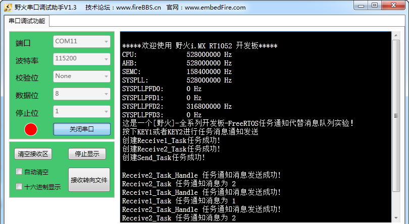
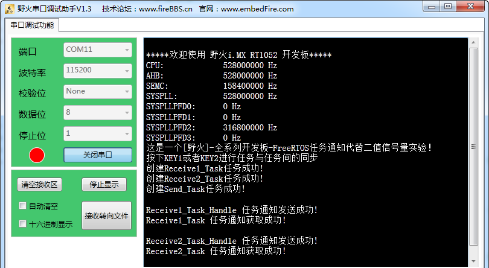
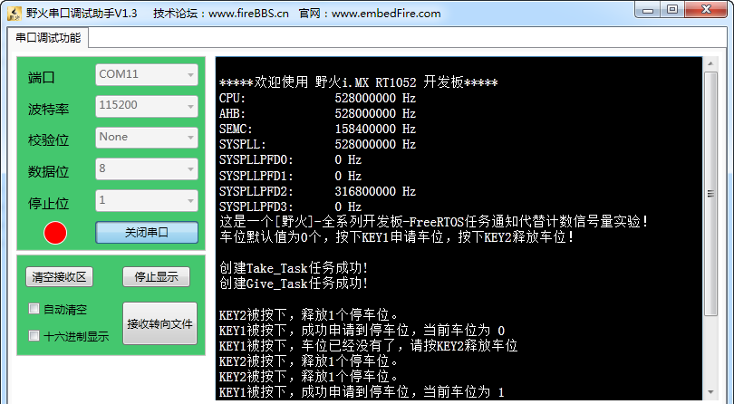
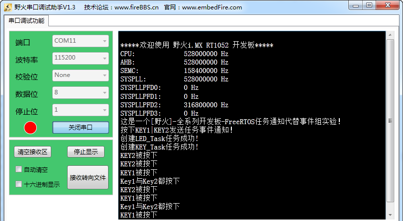

.. vim: syntax=rst

任务通知
==============

任务通知的基本概念
~~~~~~~~~~~~~~~~~~~~~~~~~~~

FreeRTOS 从V8.2.0版本开始提供任务通知这个功能，每个任务都有一个32位的通知值，在大多数情况下，任务通知可以替代二值信号量、计数信号量、事件组，也可以替代长度为1的队列（可以保存一个32位整数或指针值）。

相对于以前使用FreeRTOS内核通信的资源，必须创建队列、二进制信号量、计数信号量或事件组的情况，使用任务通知显然更灵活。按照 FreeRTOS 官方的说法，使用任务通知比通过信号量等ICP通信方式解除阻塞的任务要快
45%，并且更加省RAM内存空间（使用GCC编译器，-o2优化级别），任务通知的使用无需创建队列。想要使用任务通知，必须将FreeRTOSConfig.h中的宏定义configUSE_TASK_NOTIFICATIONS设置为1，其实FreeRTOS默认是为1的，所以任务通知是默认使能的。

FreeRTOS 提供以下几种方式发送通知给任务：

-  发送通知给任务，如果有通知未读，不覆盖通知值。

-  发送通知给任务，直接覆盖通知值。

-  发送通知给任务，设置通知值的一个或者多个位，可以当做事件组来使用。

-  发送通知给任务，递增通知值，可以当做计数信号量使用。

通过对以上任务通知方式的合理使用，可以在一定场合下替代FreeRTOS的信号量，队列、事件组等。

当然，凡是都有利弊，不然的话FreeRTOS还要内核的IPC通信机制干嘛，消息通知虽然处理更快，RAM开销更小，但也有以下限制：

-  只能有一个任务接收通知消息，因为必须指定接收通知的任务。。

-  只有等待通知的任务可以被阻塞，发送通知的任务，在任何情况下都不会因为发送失败而进入阻塞态。

任务通知的运作机制
~~~~~~~~~~~~~~~~~~~~~~~~~~~

顾名思义，任务通知是属于任务中附带的资源，所以在任务被创建的时候，任务通知也被初始化的，而在分析队列和信号量的章节中，我们知道在使用队列、信号量前，必须先创建队列和信号量，目的是为了创建队列数据结构。比如使用xQueueCreate()函数创建队列，用xSemaphoreCreateBinary()
函数创建二值信号量等等。再来看任务通知，由于任务通知的数据结构包含在任务控制块中，只要任务存在，任务通知数据结构就已经创建完毕，可以直接使用，所以使用的时候很是方便。

任务通知可以在任务中向指定任务发送通知，也可以在中断中向指定任务发送通知，FreeRTOS的每个任务都有一个32位的通知值，任务控制块中的成员变量ulNotifiedValue就是这个通知值。只有在任务中可以等待通知，而不允许在中断中等待通知。如果任务在等待的通知暂时无效，任务会根据用户指定的阻塞超
时时间进入阻塞状态，我们可以将等待通知的任务看作是消费者；其它任务和中断可以向等待通知的任务发送通知，发送通知的任务和中断服务函数可以看作是生产者，当其他任务或者中断向这个任务发送任务通知，任务获得通知以后，该任务就会从阻塞态中解除，这与FreeRTOS中内核的其他通信机制一致。

任务通知的数据结构
~~~~~~~~~~~~~~~~~~~~~~~~~~~

从前文我们知道，任务通知是任务控制块的资源，那它也算任务控制块中的成员变量，包含在任务控制块中，我们将其拿出来看看，具体见 代码清单22_1_ 高亮部分。

.. code-block:: c
    :caption: 代码清单‑1任务控制块中的任务通知成员变量
    :emphasize-lines: 62-63,156-193,201-236
    :name: 代码清单22_1
    :linenos:

	typedefstruct tskTaskControlBlock {
	volatile StackType_t	*pxTopOfStack;
	
	#if ( portUSING_MPU_WRAPPERS == 1 )
		xMPU_SETTINGS	xMPUSettings;
	#endif
	
		ListItem_t			xStateListItem;
		ListItem_t			xEventListItem;
		UBaseType_t			uxPriority;
		StackType_t			*pxStack;
	char				pcTaskName[ configMAX_TASK_NAME_LEN ];
	
	#if ( portSTACK_GROWTH > 0 )
		StackType_t		*pxEndOfStack;
	#endif
	
	#if ( portCRITICAL_NESTING_IN_TCB == 1 )
		UBaseType_t		uxCriticalNesting;
	#endif
	
	#if ( configUSE_TRACE_FACILITY == 1 )
		UBaseType_t		uxTCBNumber;
		UBaseType_t		uxTaskNumber;
	#endif
	
	#if ( configUSE_MUTEXES == 1 )
		UBaseType_t		uxBasePriority;
		UBaseType_t		uxMutexesHeld;
	#endif
	
	#if ( configUSE_APPLICATION_TASK_TAG == 1 )
		TaskHookFunction_t pxTaskTag;
	#endif
	
	#if( configNUM_THREAD_LOCAL_STORAGE_POINTERS > 0 )
	void *pvThreadLocalStoragePointers[ configNUM_THREAD_LOCAL_STORAGE_POINTERS ];
	#endif
	
	#if( configGENERATE_RUN_TIME_STATS == 1 )
	uint32_t		ulRunTimeCounter;
	#endif
	
	#if ( configUSE_NEWLIB_REENTRANT == 1 )
	struct	_reent xNewLib_reent;
	#endif
	#if( configUSE_TASK_NOTIFICATIONS == 1 )
	volatileuint32_t ulNotifiedValue;				(1)
	volatileuint8_t ucNotifyState;				(2)
	#endif
	
	#if( tskSTATIC_AND_DYNAMIC_ALLOCATION_POSSIBLE != 0 )
	uint8_t	ucStaticallyAllocated;
	#endif
	
	#if( INCLUDE_xTaskAbortDelay == 1 )
	uint8_t ucDelayAborted;
	#endif
	
	} tskTCB;
	
	typedef tskTCB TCB_t;

 

代码清单22_1_ **(1)**\ ：任务通知的值，可以保存一个32位整数或指针值。

代码清单22_1_ **(2)**\ ：任务通知状态，用于标识任务是否在等待通知。

任务通知的函数接口讲解
~~~~~~~~~~~~~~~~~~~~~~

发送任务通知函数xTaskGenericNotify()
^^^^^^^^^^^^^^^^^^^^^^^^^^^^^^^^^^^^^^^^^^^^^^^^^^^^^^^^

我们先看一下发送通知API函数。这类函数比较多，有6个。但仔细分析会发现它们只能完成3种操作，每种操作有两个API函数，分别为带中断保护版本和不带中断保护版本。FreeRTOS将API细分为带中断保护版本和不带中断保护版本是为了节省中断服务程序处理时间，提升性能。通过前面通信机制的学习，相信大家都了
解了FreeRTOS的风格，这里的任务通知发送函数也是利用宏定义来进行扩展的，所有的函数都是一个宏定义，在任务中发送任务通知的函数均是调用xTaskGenericNotify()函数进行发送通知，
下面来看看xTaskGenericNotify()的源码，具体见 代码清单22_2_。

.. code-block:: c
    :caption: 代码清单‑2 xTaskGenericNotify()源码
    :name: 代码清单22_2
    :linenos:

	#if( configUSE_TASK_NOTIFICATIONS == 1 )
 
	BaseType_t xTaskGenericNotify( TaskHandle_t xTaskToNotify,	(1)
	uint32_t ulValue,		(2)	
									eNotifyAction eAction,		(3)
	uint32_t *pulPreviousNotificationValue ) (4)
	{
		TCB_t * pxTCB;
		BaseType_t xReturn = pdPASS;
	uint8_t ucOriginalNotifyState;
	
		configASSERT( xTaskToNotify );
		pxTCB = ( TCB_t * ) xTaskToNotify;
	
		taskENTER_CRITICAL();
		{
	if ( pulPreviousNotificationValue != NULL ) {
	/*回传未被更新的任务通知值*/
				*pulPreviousNotificationValue = pxTCB->ulNotifiedValue; (5)
			}
	
	/* 获取任务通知的状态，看看任务是否在等待通知，方便在发送通知后恢复任务 */
			ucOriginalNotifyState = pxTCB->ucNotifyState;		(6)
		
	/* 不管状态是怎么样的，反正现在发送通知，任务就收到任务通知 */
			pxTCB->ucNotifyState = taskNOTIFICATION_RECEIVED;	(7)	
	
	/* 指定更新任务通知的方式 */
	switch ( eAction ) {					(8)		
	
	/*通知值按位或上ulValue。
	使用这种方法可以某些场景下代替事件组，但执行速度更快。*/
	case eSetBits	:					(9)
				pxTCB->ulNotifiedValue |= ulValue;
	break;
	
	/* 被通知任务的通知值增加1，这种发送通知方式，参数ulValue未使用 */
	case eIncrement:					(10)	
				( pxTCB->ulNotifiedValue )++;
	break;
	
	/* 将被通知任务的通知值设置为ulValue。无论任务是否还有通知，
	都覆盖当前任务通知值。使用这种方法，
	可以在某些场景下代替xQueueoverwrite()函数，但执行速度更快。 */
	case eSetValueWithOverwrite:				(11)
				pxTCB->ulNotifiedValue = ulValue;
	break;
	
	/*  如果被通知任务当前没有通知，则被通知任务的通知值设置为ulValue；
		在某些场景下替代长度为1的xQueuesend()，但速度更快。 */
	case eSetValueWithoutOverwrite :			(12)
	if ( ucOriginalNotifyState != taskNOTIFICATION_RECEIVED ) {
					pxTCB->ulNotifiedValue = ulValue;
				} else {
	/*如果被通知任务还没取走上一个通知，本次发送通知，
	任务又接收到了一个通知，则这次通知值丢弃，
	在这种情况下，函数调用失败并返回pdFALSE。*/
					xReturn = pdFAIL;				(13)
				}
	break;
	
	/* 发送通知但不更新通知值，这意味着参数ulValue未使用。 */
	case eNoAction:					(14)
	break;
			}
	
			traceTASK_NOTIFY();
	
	/* 如果被通知任务由于等待任务通知而挂起 */
	if ( ucOriginalNotifyState == taskWAITING_NOTIFICATION ) {(15)
	/* 唤醒任务，将任务从阻塞列表中移除，添加到就绪列表中 */
				( void ) uxListRemove( &( pxTCB->xStateListItem ) );
				prvAddTaskToReadyList( pxTCB );
	
	// 刚刚唤醒的任务优先级比当前任务高
	if ( pxTCB->uxPriority > pxCurrentTCB->uxPriority ) {(16)	
	//任务切换
					taskYIELD_IF_USING_PREEMPTION();
				} else {
					mtCOVERAGE_TEST_MARKER();
				}
			} else {
				mtCOVERAGE_TEST_MARKER();
			}
		}
		    taskEXIT_CRITICAL();

	return xReturn;
	}

	#endif

代码清单22_2_ **(1)**\ ：被通知的任务句柄，指定通知的任务。

代码清单22_2_ **(2)**\ ：发送的通知值。

代码清单22_2_ **(3)**\ ：枚举类型，指明更新通知值的方式。

代码清单22_2_ **(4)**\ ：任务原本的通知值返回。

代码清单22_2_ **(5)**\ ：回传任务原本的任务通值，保存在pulPreviousNotificationValue中。

代码清单22_2_ **(6)**\ ：获取任务通知的状态，看看任务是否在等待通知，方便在发送通知后恢复任务。

代码清单22_2_ **(7)**\ ：不管该任务的通知状态是怎么样的，现在调用发送通知函数，任务通知状态就要设置为收到任务通知，因为发送通知是肯定能被收到。

代码清单22_2_ **(8)**\ ：指定更新任务通知的方式。

代码清单22_2_ **(9)**\ ：通知值与原本的通知值按位或，使用这种方法可以某些场景下代替事件组，执行速度更快。

代码清单22_2_ **(10)**\ ：被通知任务的通知值增加1，这种发送通知方式，参数ulValue的值未使用，在某些场景可以代替信号量通信，并且执行速度更快。

代码清单22_2_ **(11)**\ ：将被通知任务的通知值设置为ulValue，无论任务是否还有通知，都覆盖当前任务通知值。这种方法是覆盖写入，使用这种方法，可以在某些场景下代替xQueueoverwrite()函数，执行速度更快。

代码清单22_2_ **(12)**\ ：如果被通知任务当前没有通知，则被通知任务的通知值设置为ulValue；在某些场景下替代队列长度为1的xQueuesend()，并且执行速度更快。

代码清单22_2_ **(13)**\ ：如果被通知任务还没取走上一个通知，本次发送通知，任务又接收到了一个通知，则这次通知值将被丢弃，在这种情况下，函数调用失败并返回pdFALSE。

代码清单22_2_ **(14)**\ ：发送通知但不更新通知值，这意味着参数ulValue未使用。

代码清单22_2_ **(15)**\ ：如果被通知的任务由于等待任务通知而挂起，系统将唤醒任务，将任务从阻塞列表中移除，添加到就绪列表中。

代码清单22_2_ **(16)**\ ：如果刚刚唤醒的任务优先级比当前任务高，就进行一次任务切换。

xTaskGenericNotify()函数是一个通用的任务通知发送函数，在任务中发送通知的API函数，如xTaskNotifyGive()、xTaskNotify()、xTaskNotifyAndQuery()，都是以xTaskGenericNotify()为原型的，只不过指定的发生方式不同而已。

xTaskNotifyGive()
''''''''''''''''''''''''''''''''''

xTaskNotifyGive()是一个宏，宏展开是调用函数xTaskNotify( ( xTaskToNotify ), ( 0 ), eIncrement
)，即向一个任务发送通知，并将对方的任务通知值加1。该函数可以作为二值信号量和计数信号量的一种轻量型的实现，速度更快，在这种情况下对象任务在等待任务通知的时候应该是使用函数 `ulTaskNotifyTake()
<http://www.freertos.org/ulTaskNotifyTake.html>`__ 而不是\ `xTaskNotifyWait()
<http://www.freertos.org/xTaskNotifyWait.html>`__ 。xTaskNotifyGive()不能在中断里面使用，而是使用具有中断保护功能的\ `vTaskNotifyGiveFromISR()
<http://www.freertos.org/vTaskNotifyGiveFromISR.html>`__\ 来代替。该函数的具体说明见表 xTaskNotifyGive函数说明_，应用举例见 代码清单22_3_ 高亮部分。

表格‑1xTaskNotifyGive()函数说明

.. list-table::
   :widths: 33 33
   :name: xTaskNotifyGive函数说明
   :header-rows: 0

   * - **函数原型**
     - #define xTaskNotifyGive( xTaskToNotify ) xTaskGenericNotify( ( xTaskToNotify ), ( 0 ), eIncrement, NULL )

   * - **功能**
     - 用于在任务中向指定任务发送任务通知，并更新对方的任务通知值（加1操作）。

   * - **参数**
     - xTaskToNotify	接收通知的任务句柄，并让其自身的任务通知值加1。

   * - **返回值**
     - 总是返回pdPASS。
 

.. code-block:: c
    :caption: 代码清单‑3xTaskNotifyGive()函数应用举例
    :name: 代码清单22_3
    :linenos:

	 /* 函数声明 */
	static void prvTask1( void *pvParameters );
	static void prvTask2( void *pvParameters );
	
	/*定义任务句柄 */
	static TaskHandle_t xTask1 = NULL, xTask2 = NULL;
	
	/* 主函数:创建两个任务，然后开始任务调度 */
	void main( void )
	{
		xTaskCreate(prvTask1, "Task1", 200, NULL, tskIDLE_PRIORITY, &xTask1);
		xTaskCreate(prvTask2, "Task2", 200, NULL, tskIDLE_PRIORITY, &xTask2);
		vTaskStartScheduler();
	}
	/*-----------------------------------------------------------*/
	
	static void prvTask1( void *pvParameters )
	{
	for ( ;; ) {
	/* 向prvTask2()发送一个任务通知，让其退出阻塞状态 */
			xTaskNotifyGive( xTask2 );
	
	/* 阻塞在prvTask2()的任务通知上
	如果没有收到通知，则一直等待*/
			ulTaskNotifyTake( pdTRUE, portMAX_DELAY );
		}
	}
	/*-----------------------------------------------------------*/
	
	static void prvTask2( void *pvParameters )
	{
	for ( ;; ) {
	/* 阻塞在prvTask1()的任务通知上
	如果没有收到通知，则一直等待*/
			ulTaskNotifyTake( pdTRUE, portMAX_DELAY );
	
	/* 向prvTask1()发送一个任务通知，让其退出阻塞状态 */
				xTaskNotifyGive( xTask1 );
		}
	}

vTaskNotifyGiveFromISR()
''''''''''''''''''''''''''''''''''''''''''''''''

vTaskNotifyGiveFromISR()是vTaskNotifyGive()的中断保护版本。用于在中断中向指定任务发送任务通知，并更新对方的任务通知值（加1操作），
在某些场景中可以替代信号量操作，因为这两个通知都是不带有通知值的。该函数的具体说明见表 vTaskNotifyGiveFromISR函数说明_。

表格‑2vTaskNotifyGiveFromISR()函数说明

.. list-table::
   :widths: 33 33
   :name: vTaskNotifyGiveFromISR函数说明
   :header-rows: 0

   * - **函数原型**
     - void vTaskNotifyGiveFromISR(TaskHandle_t xTaskToNotify,BaseType_t *pxHigherPriorityTaskWoken);

   * - **功能**
     - 用于在中断中向一个任务发送任务通知，并更新对方的任务通知值（加1操作）。

   * - **参数**
     - xTaskToNotify	接收通知的任务句柄，并让其自身的任务通知值加1。

   * - **参数**
     - pxHigherPriorityTaskWoken \*pxHigherPriorityTaskWoken在使用之前必须先初始化为pdFALSE。
       当调用该函数发送一个任务通知时，目标任务接收到通知后将从阻塞态变为就绪态，并且如果其优先级比
       当前运行的任务的优先级高，那么\*pxHigherPriorityTaskWoken会被设置为pdTRUE，然后在中断退出
       前执行一次上下文切换，去执行刚刚被唤醒的中断优先级较高的任务。pxHigherPriorityTaskWoken是
       一个可选的参数可以设置为NULL。

   * - **返回值**
     - 无

从上面的函数说明我们大概知道vTaskNotifyGiveFromISR()函数作用，每次调用该函数都会增加任务的通知值，任务通过接收函数返回值是否大于零，判断是否获取到了通知，任务通知值初始化为0，（如果与信号量做对比）则对应为信号量无效。当中断调用vTaskNotifyGiveFromISR()
通知函数给任务的时候，任务的通知值增加，使其大于零，使其表示的通知值变为有效，任务获取有效的通知值将会被恢复。
那么该函数是怎么实现的呢？下面一起来看看vTaskNotifyGiveFromISR()函数的源码，具体见 代码清单22_4_。

.. code-block:: c
    :caption: 代码清单‑4vTaskNotifyGiveFromISR()源码
    :name: 代码清单22_4
    :linenos:

	#if( configUSE_TASK_NOTIFICATIONS == 1 )
 
	void vTaskNotifyGiveFromISR( TaskHandle_t xTaskToNotify,
								BaseType_t *pxHigherPriorityTaskWoken )
	{
		TCB_t * pxTCB;
	uint8_t ucOriginalNotifyState;
		UBaseType_t uxSavedInterruptStatus;
	
		configASSERT( xTaskToNotify );
	
		portASSERT_IF_INTERRUPT_PRIORITY_INVALID();
	     pxTCB = ( TCB_t * ) xTaskToNotify;
 
	//进入中断
		uxSavedInterruptStatus = portSET_INTERRUPT_MASK_FROM_ISR();
		{
	//保存任务通知的原始状态，
	//看看任务是否在等待通知，方便在发送通知后恢复任务
			ucOriginalNotifyState = pxTCB->ucNotifyState;		(1)
	
	/* 不管状态是怎么样的，反正现在发送通知，任务就收到任务通知 */
			pxTCB->ucNotifyState = taskNOTIFICATION_RECEIVED;	(2)	
	
	/* 通知值自加，类似于信号量的释放 */
			( pxTCB->ulNotifiedValue )++;				(3)
	
			traceTASK_NOTIFY_GIVE_FROM_ISR();
	
	/* 如果任务在阻塞等待通知 */
	if ( ucOriginalNotifyState == taskWAITING_NOTIFICATION ) {(4)
	//如果任务调度器运行中
	if ( uxSchedulerSuspended == ( UBaseType_t ) pdFALSE ) {
	/* 唤醒任务，将任务从阻塞列表中移除，添加到就绪列表中 */
					( void ) uxListRemove( &( pxTCB->xStateListItem ) );(5)	
					prvAddTaskToReadyList( pxTCB );
				} else {
	/* 调度器处于挂起状态，中断依然正常发生，但是不能直接操作就绪列表
	将任务加入到就绪挂起列表，任务调度恢复后会移动到就绪列表 */
					vListInsertEnd( &( xPendingReadyList ),
	&( pxTCB->xEventListItem ) );(6)
				}
	
	/* 如果刚刚唤醒的任务优先级比当前任务高,
	则设置上下文切换标识,等退出函数后手动切换上下文,
	或者在系统节拍中断服务程序中自动切换上下文 */
	if ( pxTCB->uxPriority > pxCurrentTCB->uxPriority ) {(7)
	//
	/* 设置返回参数，表示需要任务切换，在退出中断前进行任务切换 */
	if ( pxHigherPriorityTaskWoken != NULL ) {
						*pxHigherPriorityTaskWoken = pdTRUE;		(8)	
					} else {
	/* 设置自动切换标志 */
						xYieldPending = pdTRUE;			(9)
					}
				} else {
					mtCOVERAGE_TEST_MARKER();
				}
			}
		}
		portCLEAR_INTERRUPT_MASK_FROM_ISR( uxSavedInterruptStatus );
	}
	
	#endif

代码清单22_4_ **(1)**\ ：保存任务通知的原始状态，看看任务是否处于等待通知的阻塞态，方便在中断发送通知完成后恢复任务。

代码清单22_4_ **(2)**\ ：不管状态是怎么样的，反正现在发送通知，任务就收到任务通知。

代码清单22_4_ **(3)**\ ：通知值自加，类似于信号量的释放操作。

代码清单22_4_ **(4)**\ ：如果任务在阻塞等待通知，并且系统调度器处于运行状态。

代码清单22_4_ **(5)**\ ：唤醒任务，将任务从阻塞列表中移除，添加到就绪列表中。

代码清单22_4_ **(6)**\ ：调度器处于挂起状态，中断依然正常发生，但是不能直接操作就绪列表，将任务加入到就绪挂起列表，任务调度恢复后会移动到就绪列表中。

代码清单22_4_ **(7)**\ ：如果刚刚唤醒的任务优先级比当前任务高，则设置上下文切换标识，等退出函数后手动切换上下文，或者在系统节拍中断服务程序中自动切换上下文

代码清单22_4_ **(8)**\ ：设置返回参数，表示需要任务切换，在退出中断前进行任务切换。

代码清单22_4_ **(9)**\ ：否则就设置自动切换标志。

.. code-block:: c
    :caption: 代码清单‑5vTaskNotifyGiveFromISR()函数应用举例
    :name: 代码清单22_5
    :linenos:

	static TaskHandle_t xTaskToNotify = NULL;
	
	/* 外设驱动的数据传输函数 */
	void StartTransmission( uint8_t *pcData, size_t xDataLength )
	{
	/* 在这个时候，xTaskToNotify应为NULL，因为发送并没有进行。
	如果有必要，对外设的访问可以用互斥量来保护*/
		configASSERT( xTaskToNotify == NULL );
	
	/* 获取调用函数StartTransmission()的任务的句柄 */
		xTaskToNotify = xTaskGetCurrentTaskHandle();
	
	/* 开始传输，当数据传输完成时产生一个中断 */
		vStartTransmit( pcData, xDatalength );
	}
	/*-----------------------------------------------------------*/
	/* 数据传输完成中断 */
	void vTransmitEndISR( void )
	{
		BaseType_t xHigherPriorityTaskWoken = pdFALSE;
	
	/* 这个时候不应该为NULL，因为数据传输已经开始 */
		configASSERT( xTaskToNotify != NULL );
	
	/* 通知任务传输已经完成 */
		vTaskNotifyGiveFromISR( xTaskToNotify, &xHigherPriorityTaskWoken );
	
	/* 传输已经完成，所以没有任务需要通知 */
		xTaskToNotify = NULL;
	
	/* 如果为pdTRUE，则进行一次上下文切换 */
		portYIELD_FROM_ISR( xHigherPriorityTaskWoken );
	}
	/*-----------------------------------------------------------*/
	/* 任务：启动数据传输，然后进入阻塞态，直到数据传输完成 */
	void vAFunctionCalledFromATask( uint8_t ucDataToTransmit,
	size_t xDataLength )
	{
	uint32_t ulNotificationValue;
	const TickType_t xMaxBlockTime = pdMS_TO_TICKS( 200 );
	
	/* 调用上面的函数StartTransmission()启动传输 */
		StartTransmission( ucDataToTransmit, xDataLength );
	
	/* 等待传输完成 */
		ulNotificationValue = ulTaskNotifyTake( pdFALSE, xMaxBlockTime );
	
	/* 当传输完成时，会产生一个中断
	在中断服务函数中调用vTaskNotifyGiveFromISR()向启动数据
	传输的任务发送一个任务通知，并将对象任务的任务通知值加1
	任务通知值在任务创建的时候是初始化为0的，当接收到任务后就变成1 */
	if ( ulNotificationValue == 1 ) {
	/* 传输按预期完成 */
		} else {
	/* 调用函数ulTaskNotifyTake()超时 */
		}
	}

xTaskNotify()
''''''''''''''''''''''''''

FreeRTOS每个任务都有一个32位的变量用于实现任务通知，在任务创建的时候初始化为0。这个32位的通知值在任务控制块TCB里面定义，具体见。xTaskNotify()用于在任务中直接向另外一个任务发送一个事件，接收到该任务通知的任务有可能解锁。如果你想使用任务通知来实现二值信号量和计数信号量，那
么应该使用更加简单的函数\ `xTaskNotifyGive()
<http://www.freertos.org/xTaskNotifyGive.html>`__ ，而不是使用xTaskNotify()，xTaskNotify()函数在发送任务通知的时候会指定一个通知值，并且用户可以指定通知值发送的方式。

注意：该函数不能在中断里面使用，而是使用具体中断保护功能的版本函数\ `xTaskNotifyFromISR() <http://www.freertos.org/xTaskNotifyFromISR.html>`__\
。xTaskNotify()函数的具体说明见表 xTaskNotify函数说明_，应用举例见 代码清单22_6_。

.. code-block:: c
    :caption: 代码清单‑6任务通知在任务控制块中的定义
    :name: 代码清单22_6
    :linenos:

	#if( configUSE_TASK_NOTIFICATIONS == 1 )
	volatileuint32_t ulNotifiedValue;
	volatileuint8_t ucNotifyState;
	#endif

表格‑3xTaskNotify()函数说明

.. list-table::
   :widths: 33 33
   :name: xTaskNotify函数说明
   :header-rows: 0

   * - **函数原型**
     - BaseType_t xTaskNotify( TaskHandle_t xTaskToNotify,
       uint32_t ulValue,
       eNotifyAction eAction );

   * - **功能**
     - 向指定的任务发送一个任务通知，带有通知值并且用户可以指定通知值的发送方式。

   * - **参数**
     - xTaskToNotify	需要接收通知的任务句柄。

   * - **参数**
     - ulValue	用于更新接收任务通知的任务通知值，具体如何更新由形参eAction决定。

   * - **参数**
     - eAction	任务通知值更新方式，具体见表 任务通知值的状态_。

   * - **返回值**
     - 参数eAction为eSetValueWithoutOverwrite时，如果被通知任务还没取走上一个通知，又接收到了一个通知，则这次通知值未能更新并返回pdFALSE，而其他情况均返回pdPASS。

表格‑4任务通知值的状态

.. list-table::
   :widths: 50 50
   :name: 任务通知值的状态
   :header-rows: 0

   * - eAction取值
     - 含义

   * - eNoAction
     - 对象任务接收任务通知，但是任务自身的任务通知值不更新，即形参ulValue没有用。

   * - eSetBits
     - 对象任务接收任务通知，同时任务自身的任务通知值与ulValue按位或。如果ulValue设置为0x01，那么任务的通知值的位0将被置为1。同样的如果ulValue设置为0x04，那么任务的通知值的位2将被置为1。
       在这种方式下，任务通知可以看成是事件标志的一种轻量型的实现，速度更快。

   * - eIncrement
     - 对象任务接收任务通知，任务自身的任务通知值加1，即形参ulValue没有用。这个时候调用xTaskNotify()等同于调用xTaskNotifyGive()。

   * - eSetValueWithOverwrite
     - 对象任务接收任务通知，且任务自身的任务通知值会无条件的被设置为ulValue。在这种方式下，任务通知可以看成是函数xQueueOverwrite()
       的一种轻量型的实现，速度更快。

   * - eSetValueWithoutOverwrite
     - 对象任务接收任务通知，且对象任务没有通知值，那么通知值就会被设置为ulValue。对象任务接收任务通知，
       但是上一次接收到的通知值并没有取走，那么本次的通知值将不会更新，同时函数返回pdFALSE。在这种
       方式下，任务通知可以看成是函数xQueueSend() 应用在队列深度为1的队列上的一种轻量型实现，速度更快。

.. code-block:: c
    :caption: 代码清单‑7xTaskNotify()函数应用举例
    :name: 代码清单22_7
    :linenos:

	 /* 设置任务xTask1Handle的任务通知值的位8为1*/
	xTaskNotify( xTask1Handle, ( 1UL << 8UL ), eSetBits );
	
	/* 向任务xTask2Handle发送一个任务通知
	有可能会解除该任务的阻塞状态，但是并不会更新该任务自身的任务通知值 */
	xTaskNotify( xTask2Handle, 0, eNoAction );
	
	
	/* 向任务xTask3Handle发送一个任务通知
	并把该任务自身的任务通知值更新为0x50
	即使该任务的上一次的任务通知都没有读取的情况下
	即覆盖写 */
	xTaskNotify( xTask3Handle, 0x50, eSetValueWithOverwrite );
	
	/* 向任务xTask4Handle发送一个任务通知
	并把该任务自身的任务通知值更新为0xfff
	但是并不会覆盖该任务之前接收到的任务通知值*/
	if(xTaskNotify(xTask4Handle,0xfff,eSetValueWithoutOverwrite)==pdPASS )
	{
	/* 任务xTask4Handle的任务通知值已经更新 */
	} else
	{
	/* 任务xTask4Handle的任务通知值没有更新
	即上一次的通知值还没有被取走*/
	}

xTaskNotifyFromISR()
''''''''''''''''''''''''''''''''''''''''

xTaskNotifyFromISR()是xTaskNotify()的中断保护版本，真正起作用的函数是中断发送任务通知通用函数xTaskGenericNotifyFromISR()，而xTaskNotifyFromISR()是一个宏定义，具体见 代码清单22_8_，用于在中断中向指定的任务发送一个任务通
知，该任务通知是带有通知值并且用户可以指定通知的发送方式，不返回上一个任务在的通知值。函数的具体说明见表 xTaskNotifyFromISR函数说明_。xTaskGenericNotifyFromISR()的源码具体见 代码清单22_9_。

.. code-block:: c
    :caption: 代码清单‑8 xTaskNotifyFromISR()函数原型
    :name: 代码清单22_8
    :linenos:

    #define xTaskNotifyFromISR( xTaskToNotify, 		\
                ulValue,			\
                eAction,			\
                pxHigherPriorityTaskWoken ) 	\
            xTaskGenericNotifyFromISR( ( xTaskToNotify ),	\
                ( ulValue ), 		\
                    ( eAction ),		\
                    NULL, 		\
                    ( pxHigherPriorityTaskWoken ) )

表格‑5xTaskNotifyFromISR()函数说明

.. list-table::
   :name: xTaskNotifyFromISR函数说明
   :widths: 33 33
   :header-rows: 0

   * - **函数原型**
     - BaseType_t xTaskNotifyFromISR( TaskHandle_t xTaskToNotify,
       uint32_t ulValue,
       eNotifyAction eAction,
       BaseType_t *pxHigherPriorityTaskWoken );

   * - **功能**
     - 在中断中向指定的任务发送一个任务通知。

   * - **参数**
     - xTaskToNotify	指定接收通知的任务句柄。

   * - **参数**
     - ulValue	用于更新接收任务通知的任务通知值，具体如何更新由形参eAction决定。

   * - **参数**
     - eAction	任务通知值的状态，具体见表 xTaskNotify函数说明_。

   * - **参数**
     - pxHigherPriorityTaskWoken \*pxHigherPriorityTaskWoken在使用之前必须先初始化为pdFALSE。
       当调用该函数发送一个任务通知时，目标任务接收到通知后将从阻塞态变为就绪态，并且如果其优先级
       比当前运行的任务的优先级高，那么\*pxHigherPriorityTaskWoken会被设置为pdTRUE，然后在中断
       退出前执行一次上下文切换，去执行刚刚被唤醒的中断优先级较高的任务。
       pxHigherPriorityTaskWoken是一个可选的参数可以设置为NULL。

   * - **返回值**
     - 参数eAction为eSetValueWithoutOverwrite时，如果被通知任务还没取走上一个通知，又接收到了一个通知，则这次通知值未能更新并返回pdFALSE，其他情况均返回pdPASS。

中断中发送任务通知通用函数xTaskGenericNotifyFromISR()
''''''''''''''''''''''''''''''''''''''''

xTaskGenericNotifyFromISR()是一个在中断中发送任务通知的通用函数，xTaskNotifyFromISR()、xTaskNotifyAndQueryFromISR()等函数都是以其为基础，采用宏定义的方式实现。
xTaskGenericNotifyFromISR()的源码具体见 代码清单22_9_。

.. code-block:: c
    :caption: 代码清单‑9xTaskGenericNotifyFromISR()源码
    :name: 代码清单22_9
    :linenos:

	#if( configUSE_TASK_NOTIFICATIONS == 1 )
 
	BaseType_t xTaskGenericNotifyFromISR( TaskHandle_t xTaskToNotify,(1)
	uint32_t ulValue,			(2)	
	eNotifyAction eAction,		(3)
	uint32_t *pulPreviousNotificationValue,(4)
	BaseType_t *pxHigherPriorityTaskWoken )(5)
	{
		TCB_t * pxTCB;
	uint8_t ucOriginalNotifyState;
		BaseType_t xReturn = pdPASS;
		UBaseType_t uxSavedInterruptStatus;

		configASSERT( xTaskToNotify );

		portASSERT_IF_INTERRUPT_PRIORITY_INVALID();

		pxTCB = ( TCB_t * ) xTaskToNotify;

	/* 进入中断临界区 */
		uxSavedInterruptStatus = portSET_INTERRUPT_MASK_FROM_ISR();	(6)
		{
	if ( pulPreviousNotificationValue != NULL ) {
	/*回传未被更新的任务通知值*/
				*pulPreviousNotificationValue = pxTCB->ulNotifiedValue;(7)
			}

	//保存任务通知的原始状态，
	//看看任务是否在等待通知，方便在发送通知后恢复任务
			ucOriginalNotifyState = pxTCB->ucNotifyState;		(8)

	/* 不管状态是怎么样的，反正现在发送通知，任务就收到任务通知 */
			pxTCB->ucNotifyState = taskNOTIFICATION_RECEIVED;	(9)

	/* 指定更新任务通知的方式 */
	switch ( eAction ) {					(10)
	/*通知值按位或上ulValue。
	使用这种方法可以某些场景下代替事件组，但执行速度更快。*/
	case eSetBits	:					(11)
				pxTCB->ulNotifiedValue |= ulValue;			
	break;

	/* 被通知任务的通知值增加1，这种发送通知方式，参数ulValue未使用
		在某些场景下可以代替信号量，执行速度更快 */
	case eIncrement:					(12)
				( pxTCB->ulNotifiedValue )++;
	break;

	/* 将被通知任务的通知值设置为ulValue。无论任务是否还有通知，
	都覆盖当前任务通知值。使用这种方法，
	可以在某些场景下代替xQueueoverwrite()函数，但执行速度更快。 */
	case eSetValueWithOverwrite:				(13)
				pxTCB->ulNotifiedValue = ulValue;
	break;

	//采用不覆盖发送任务通知的方式
	case eSetValueWithoutOverwrite :			(14)
	/*  如果被通知任务当前没有通知，则被通知任务的通知值设置为ulValue；
	在某些场景下替代长度为1的xQueuesend()，但速度更快。 */
	if ( ucOriginalNotifyState != taskNOTIFICATION_RECEIVED ) {
					pxTCB->ulNotifiedValue = ulValue;		
				} else {
	/*如果被通知任务还没取走上一个通知，本次发送通知，
	任务又接收到了一个通知，则这次通知值丢弃，
	在这种情况下，函数调用失败并返回pdFALSE。*/
					xReturn = pdFAIL;				(15)
	            }
	break;

	case eNoAction :
	/*  退出 */
	break;
			}

			traceTASK_NOTIFY_FROM_ISR();

	/* 如果任务在阻塞等待通知 */				
	if ( ucOriginalNotifyState == taskWAITING_NOTIFICATION ) {(16)
	//如果任务调度器运行中，表示可用操作就绪级列表
	if ( uxSchedulerSuspended == ( UBaseType_t ) pdFALSE ) {
	/* 唤醒任务，将任务从阻塞列表中移除，添加到就绪列表中 */
					( void ) uxListRemove( &( pxTCB->xStateListItem ) );
					prvAddTaskToReadyList( pxTCB );			(17)
				} else {
	/* 调度器处于挂起状态，中断依然正常发生，但是不能直接操作就绪列表
		将任务加入到就绪挂起列表，任务调度恢复后会移动到就绪列表 */
					vListInsertEnd( &( xPendingReadyList ), 
				&( pxTCB->xEventListItem ) );	(18)
			}
	/* 如果刚刚唤醒的任务优先级比当前任务高,
	则设置上下文切换标识,等退出函数后手动切换上下文,
	或者自动切换上下文 */
	if ( pxTCB->uxPriority > pxCurrentTCB->uxPriority ) {(19)	

	if ( pxHigherPriorityTaskWoken != NULL ) {
	/* 设置返回参数，表示需要任务切换，在退出中断前进行任务切换 */
						*pxHigherPriorityTaskWoken = pdTRUE;		(20)
					} else {
	/*设置自动切换标志，等高优先级任务释放CPU使用权 */
						xYieldPending = pdTRUE;			(21)
					}
				} else {
					mtCOVERAGE_TEST_MARKER();
				}
			}
		}
	/* 离开中断临界区 */
		portCLEAR_INTERRUPT_MASK_FROM_ISR( uxSavedInterruptStatus );(22)
	
	return xReturn;
	}
	
	#endif

代码清单22_9_ **(1)**\ ：指定接收通知的任务句柄。

代码清单22_9_ **(2)**\ ：用于更新接收任务通知值，具体如何更新由形参eAction决定。

代码清单22_9_ **(3)**\ ：任务通知值更新方式。

代码清单22_9_ **(4)**\ ：用于保存上一个任务通知值。

代码清单22_9_ **(5)**\ ：*pxHigherPriorityTaskWoken在使用之前必须先初始化为pdFALSE。当调用该函数发送一个任务通知时，目标任务接收到通知后将从阻塞态变为就绪态，并且如果其优先级比当前运行的任务的优先级高，那么*pxHigherPriorityTaskWo
ken会被设置为pdTRUE，然后在中断退出前执行一次上下文切换，去执行刚刚被唤醒的中断优先级较高的任务。pxHigherPriorityTaskWoken是一个可选的参数可以设置为NULL。

代码清单22_9_ **(6)**\ ：进入中断临界区。

代码清单22_9_ **(7)**\ ：如果pulPreviousNotificationValue参数不为空，就需要返回上一次的任务通知值。

代码清单22_9_**(8)**\ ：保存任务通知的原始状态，看看任务是否在等待通知，方便在发送通知后恢复任务。

代码清单22_9_ **(9)**\ ：不管当前任务通知状态是怎么样的，现在调用发送通知函数。任务通知肯定是发送到指定任务，那么任务通知的状态就设置为收到任务通知。

代码清单22_9_ **(10)**\ ：指定更新任务通知的方式。

代码清单22_9_ **(11)**\ ：通知值与原本的通知值按位或，使用这种方法可以某些场景下代替事件组，执行速度更快。

代码清单22_9_ **(12)**\ ：被通知任务的通知值增加1，这种发送通知方式，参数ulValue的值未使用，在某些场景可以代替信号量通信，并且执行速度更快。

代码清单22_9_ **(13)**\ ：将被通知任务的通知值设置为ulValue，无论任务是否还有通知，都覆盖当前任务通知值。这种方法是覆盖写入，使用这种方法，可以在某些场景下代替xQueueoverwrite()函数，执行速度更快。

代码清单22_9_ **(14)**\ ：采用不覆盖发送通知方式，如果被通知任务当前没有通知，则被通知任务的通知值设置为ulValue；在某些场景下替代队列长度为1的xQueuesend()，并且执行速度更快。

代码清单22_9_ **(15)**\ ：如果被通知任务还没取走上一个通知，本次发送通知，任务又接收到了一个通知，则这次通知值将被丢弃，在这种情况下，函数调用失败并返回pdFALSE。

代码清单22_9_ **(16)**\ ：如果任务在阻塞等待通知。

代码清单22_9_ **(17)**\ ：如果任务调度器在运行中，表示可用操作就绪级列表。那么系统将唤醒任务，将任务从阻塞列表中移除，添加到就绪列表中

代码清单22_9_ **(18)**\ ：如果调度器处于挂起状态，中断依然正常发生，但是不能直接操作就绪列表，系统会将任务加入到就绪挂起列表，任务调度恢复后会将在该列表的任务移动到就绪列表中。

代码清单22_9_ **(19)**\ ：如果刚刚唤醒的任务优先级比当前任务高，则设置上下文切换标识,等退出函数后手动切换上下文，或者按照任务优先级自动切换上下文。

代码清单22_9_ **(20)**\ ：设置返回参数，表示需要任务切换，在退出中断前进行任务切换。

代码清单22_9_ **(21)**\ ：设置自动切换标志，等高优先级任务释放CPU使用权。

代码清单22_9_ **(22)**\ ：离开中断临界区

xTaskNotifyFromISR()的使用很简单的，具体见 代码清单22_10_ 高亮部分。

.. code-block:: c
    :caption: 代码清单‑10xTaskNotifyFromISR()使用实例
    :emphasize-lines: 8-10,23-26
    :name: 代码清单20_10
    :linenos:

	/* 中断：向一个任务发送任务通知，并根据不同的中断将目标任务的
	任务通知值的相应位置1 */
	void vANInterruptHandler( void )
	{
		BaseType_t xHigherPriorityTaskWoken;
	uint32_t ulStatusRegister;
	
	/* 读取中断状态寄存器，判断到来的是哪个中断
	这里假设了Rx、Tx和buffer overrun 三个中断 */
		ulStatusRegister = ulReadPeripheralInterruptStatus();

	/* 清除中断标志位 */
		vClearPeripheralInterruptStatus( ulStatusRegister );

	/* xHigherPriorityTaskWoken 在使用之前必须初始化为pdFALSE
	如果调用函数xTaskNotifyFromISR()解锁了解锁了接收该通知的任务
	而且该任务的优先级比当前运行的任务的优先级高，那么
		xHigherPriorityTaskWoken就会自动的被设置为pdTRUE*/
		xHigherPriorityTaskWoken = pdFALSE;

	/* 向任务xHandlingTask发送任务通知，并将其任务通知值
	与ulStatusRegister的值相或，这样可以不改变任务通知其它位的值*/
		xTaskNotifyFromISR( xHandlingTask,
							ulStatusRegister,
							eSetBits,
	&xHigherPriorityTaskWoken );

	/* 如果xHigherPriorityTaskWoken的值为pdRTUE
	则执行一次上下文切换*/
		portYIELD_FROM_ISR( xHigherPriorityTaskWoken );
	}
	/* ----------------------------------------------------------- */

	/* 任务：等待任务通知，然后处理相关的事情 */
	void vHandlingTask( void *pvParameters )
	{
	uint32_t ulInterruptStatus;

	for ( ;; ) {
		/* 等待任务通知，无限期阻塞（没有超时，所以没有必要检查函数返回值）*/
				xTaskNotifyWait( 0x00,      /* 在进入的时候不清除通知值的任何位 */
								ULONG_MAX, /* 在退出的时候复位通知值为0 */
		&ulNotifiedValue, /* 任务通知值传递到变量
										ulNotifiedValue中*/
								portMAX_DELAY );  /* 无限期等待 */

		/* 根据任务通知值里面的各个位的值处理事情 */
		if ( ( ulInterruptStatus & 0x01 ) != 0x00 ) {
		/* Rx中断 */
					prvProcessRxInterrupt();
				}

		if ( ( ulInterruptStatus & 0x02 ) != 0x00 ) {
		/* Tx中断 */
					prvProcessTxInterrupt();
				}

		if ( ( ulInterruptStatus & 0x04 ) != 0x00 ) {
		/* 缓冲区溢出中断 */
					prvClearBufferOverrun();
				}
			}
		}

xTaskNotifyAndQuery()
'''''''''''''''''''''

xTaskNotifyAndQuery()与xTaskNotify()很像，都是调用通用的任务通知发送函数xTaskGenericNotify()来实现通知的发送，不同的是多了一个附加的参数pulPreviousNotifyValue用于回传接收任务的上一个通知值，
函数原型具体见 代码清单22_11_。xTaskNotifyAndQuery()函数不能用在中断中，而是必须使用带中断保护功能的xTaskNotifyAndQuery()FromISR来代替。
该函数的具体说明见表格 xTaskNotifyAndQuery函数说明_，应用举例见 代码清单22_12_ 高亮部分。

.. code-block:: c
    :caption: 代码清单‑11xTaskNotifyAndQuery()函数原型
    :name: 代码清单22_11
    :linenos:

    #define xTaskNotifyAndQuery( 	xTaskToNotify, 			\
                    ulValue, 			\
                    eAction,				\
                    pulPreviousNotifyValue )		\
            xTaskGenericNotify( ( xTaskToNotify ),		\
                    ( ulValue ), 			\
                    ( eAction ),			\
                        ( pulPreviousNotifyValue ) )

表格‑6xTaskNotifyAndQuery()函数说明

.. list-table::
   :widths: 33 33
   :name: xTaskNotifyAndQuery函数说明
   :header-rows: 0

   * - **函数原型**
     - BaseType_t xTaskNotifyAndQuery( TaskHandle_t xTaskToNotify,uint32_t ulValue,
       eNotifyAction eAction,uint32_t *pulPreviousNotifyValue );

   * - **功能**
     - 向指定的任务发送一个任务通知，并返回对象任务的上一个通知值。

   * - **参数**
     - xTaskToNotify	需要接收通知的任务句柄。

   * - **参数**
     - ulValue	用于更新接收任务通知的任务通知值，具体如何更新由形参eAction决定。

   * - **参数**
     - eAction	任务通知值更新方式，具体见表 xTaskNotify函数说明_。

   * - **参数**
     - pulPreviousNotifyValue	对象任务的上一个任务通知值，如果为NULL，则不需要回传，这个时候就等价于函数xTaskNotify()。

   * - **返回值**
     - 参数eAction为eSetValueWithoutOverwrite时，如果被通知任务还没取走上一个通知，又接收到了一个通知，则这次通知值未能更新并返回pdFALSE，其他情况均返回pdPASS。

.. code-block:: c
    :caption: 代码清单‑12xTaskNotifyAndQuery()函数应用举例
    :emphasize-lines: 4-5,10,14,19-22
    :name: 代码清单22_12
    :linenos:

    uint32_t ulPreviousValue;

    /* 设置对象任务xTask1Handle的任务通知值的位8为1
    在更新位8的值之前把任务通知值回传存储在变量ulPreviousValue中*/
    xTaskNotifyAndQuery( xTask1Handle, ( 1UL << 8UL ), eSetBits, &ulPreviousValue );

    /* 向对象任务xTask2Handle发送一个任务通知，有可能解除对象任务的阻塞状态
    但是不更新对象任务的通知值，并将对象任务的通知值存储在变量ulPreviousValue中 */
    xTaskNotifyAndQuery( xTask2Handle, 0, eNoAction, &ulPreviousValue );

    /* 覆盖式设置对象任务的任务通知值为0x50
    且对象任务的任务通知值不用回传，则最后一个形参设置为NULL */
    xTaskNotifyAndQuery( xTask3Handle, 0x50, eSetValueWithOverwrite,  NULL );

    /* 设置对象任务的任务通知值为0xfff，但是并不会覆盖对象任务通过
    xTaskNotifyWait()和ulTaskNotifyTake()这两个函数获取到的已经存在
    的任务通知值。对象任务的前一个任务通知值存储在变量ulPreviousValue中*/
    if ( xTaskNotifyAndQuery( xTask4Handle,
                            0xfff,
                            eSetValueWithoutOverwrite,
                &ulPreviousValue ) == pdPASS )
    {
    /* 任务通知值已经更新 */
    } else
    {
    /* 任务通知值没有更新 */
    }

xTaskNotifyAndQueryFromISR()
''''''''''''''''''''''''''''

xTaskNotifyAndQueryFromISR()是xTaskNotifyAndQuery
()的中断版本，用于向指定的任务发送一个任务通知，并返回对象任务的上一个通知值，该函数也是一个宏定义，真正实现发送通知的是xTaskGenericNotifyFromISR()。
xTaskNotifyAndQueryFromISR()函数说明见表 xTaskNotifyAndQueryFromISR函数说明_，使用实例具体见 代码清单22_13_。

表格‑7xTaskNotifyAndQueryFromISR()函数说明

.. list-table::
   :widths: 33 33
   :name: xTaskNotifyAndQueryFromISR函数说明
   :header-rows: 0

   * - **函数原型**
     - BaseType_t xTaskNotifyAndQueryFromISR(TaskHandle_t xTaskToNotify,
       uint32_t ulValue,
       eNotifyAction eAction,
       uint32_t *pulPreviousNotifyValue,
       BaseType_t *pxHigherPriorityTaskWoken );

   * - **功能**
     - 在中断中向指定的任务发送一个任务通知，并返回对象任务的上一个通知值。

   * - **参数**
     - xTaskToNotify	需要接收通知的任务句柄。

   * - **参数**
     - ulValue	用于更新接收任务通知的任务通知值，具体如何更新由形参eAction决定。

   * - **参数**
     - eAction	任务通知值的状态。

   * - **参数**
     - pulPreviousNotifyValue	对象任务的上一个任务通知值。如果为NULL，则不需要回传。

   * - **参数**
     - pxHigherPriorityTaskWoken \*pxHigherPriorityTaskWoken在使用之前必须先初始化为pdFALSE。
       当调用该函数发送一个任务通知时，目标任务接收到通知后将从阻塞态变为就绪态，并且如果其优先级
       比当前运行的任务的优先级高，那么\*pxHigherPriorityTaskWoken会被设置为pdTRUE，然后在中断
       退出前执行一次上下文切换，去执行刚刚被唤醒的中断优先级较高的任务。
       pxHigherPriorityTaskWoken是一个可选的参数可以设置为NULL。

   * - **返回值**
     - 参数eAction为eSetValueWithoutOverwrite时，如果被通知任务还没取走上一个通知，又接收到了一个通知，则这次通知值未能更新并返回pdFALSE，其他情况均返回pdPASS。

.. code-block:: c
    :caption: 代码清单‑13xTaskNotifyAndQueryFromISR()函数应用举例
    :emphasize-lines: 9-13
    :name: 代码清单22_13
    :linenos:

	void vAnISR( void )
	{
	/* xHigherPriorityTaskWoken在使用之前必须设置为pdFALSE */
		BaseType_t xHigherPriorityTaskWoken = pdFALSE.
	uint32_t ulPreviousValue;

	/* 设置目标任务xTask1Handle的任务通知值的位8为1
	在任务通知值的位8被更新之前把上一次的值存储在变量ulPreviousValue中*/
		xTaskNotifyAndQueryFromISR( xTask1Handle,
									( 1UL << 8UL ),
									eSetBits,
	&ulPreviousValue,
	&xHigherPriorityTaskWoken );

	/* 如果任务xTask1Handle阻塞在任务通知上，那么现在已经被解锁进入就绪态
	如果其优先级比当前正在运行的任务的优先级高，则xHigherPriorityTaskWoken
	会被设置为pdRTUE，然后在中断退出前执行一次上下文切换，在中断退出后则去
	执行这个被唤醒的高优先级的任务 */
		portYIELD_FROM_ISR( xHigherPriorityTaskWoken );
	}

获取任务通知函数
^^^^^^^^^^^^^^^^^^^^^^^^

既然FreeRTOS中发送任务的函数有那么多个，那么任务怎么获取到通知呢？我们说了，任务通知在某些场景可以替代信号量、消息队列、事件等。获取任务通知函数只能用在任务中，没有带中断保护版本，因此只有两个API函数：ulTaskNotifyTake()和xTaskNotifyWait
()。前者是为代替二值信号量和计数信号量而专门设计的，它和发送通知API函数xTaskNotifyGive()、vTaskNotifyGiveFromISR()配合使用；后者是全功能版的等待通知，可以根据不同的参数实现轻量级二值信号量、计数信号量、事件组和长度为1的队列。

所有的获取任务通知API函数都带有指定阻塞超时时间参数，当任务因为等待通知而进入阻塞时，用来指定任务的阻塞时间，这些超时机制与FreeRTOS的消息队列、信号量、事件等的超时机制一致。

ulTaskNotifyTake()
''''''''''''''''''

ulTaskNotifyTake()作为二值信号量和计数信号量的一种轻量级实现，速度更快。如果FreeRTOS中使用函数xSemaphoreTake() 来获取信号量，这个时候则可以试试使用函数ulTaskNotifyTake()来代替。

对于这个函数，任务通知值为0，对应信号量无效，如果任务设置了阻塞等待，任务被阻塞挂起。当其他任务或中断发送了通知值使其不为0后，通知变为有效，等待通知的任务将获取到通知，并且在退出时候根据用户传递的第一个参数xClearCountOnExit选择清零通知值或者执行减一操作。

xTaskNotifyTake()在退出的时候处理任务的通知值的时候有两种方法，一种是在函数退出时将通知值清零，这种方法适用于实现二值信号量；另外一种是在函数退出时将通知值减1，这种方法适用于实现计数信号量。

当一个任务使用其自身的任务通知值作为二值信号量或者计数信号量时，其他任务应该使用函数xTaskNotifyGive()或者xTaskNotify( ( xTaskToNotify ), ( 0 ), eIncrement
)来向其发送信号量。如果是在中断中，则应该使用他们的中断版本函数。该函数的具体说明见表 ulTaskNotifyTake函数说明_。

表格‑8ulTaskNotifyTake()函数说明

.. list-table::
   :widths: 33 33
   :name: ulTaskNotifyTake函数说明
   :header-rows: 0

   * - **函数原型**
     - uint32_t ulTaskNotifyTake( BaseType_t xClearCountOnExit,TickType_t xTicksToWait );

   * - **功能**
     - 用于获取一个任务通知，获取二值信号量、计数信号量类型的任务通知。

   * - **参数**
     - xClearCountOnExit	设置为pdFALSE时，函数xTaskNotifyTake()退出前，将任务的通知值减1，可以用来实现计数信号量；设置为pdTRUE时，函数xTaskNotifyTake()退出前，将任务通知值清零，可以用来实现二值信号量。

   * -
     - xTicksToWait	超时时间，单位为系统节拍周期。宏pdMS_TO_TICKS用于将毫秒转化为系统节拍数。

   * - **返回值**
     - 返回任务的当前通知值，在其减1或者清0之前。

下面一起来看看ulTaskNotifyTake()源码的实现过程，其实也是很简单的，具体见 代码清单22_14_。

.. code-block:: c
    :caption: 代码清单‑14ulTaskNotifyTake()源码
    :name: 代码清单22_14
    :linenos:

    #if( configUSE_TASK_NOTIFICATIONS == 1 )

    uint32_t ulTaskNotifyTake( BaseType_t xClearCountOnExit,
                            TickType_t xTicksToWait )
    {
    uint32_t ulReturn;

        taskENTER_CRITICAL();		//进入中断临界区
        {
    // 如果通知值为 0 ，阻塞任务
    // 默认初始化通知值为 0，说明没有未读通知
    if ( pxCurrentTCB->ulNotifiedValue == 0UL ) {		(1)
    /* 标记任务状态：等待消息通知 */
                pxCurrentTCB->ucNotifyState = taskWAITING_NOTIFICATION;

    //用户指定超时时间了，那就进入等待状态
    if ( xTicksToWait > ( TickType_t ) 0 ) {		(2)
    //根据用户指定超时时间将任务添加到延时列表
                    prvAddCurrentTaskToDelayedList( xTicksToWait, pdTRUE );
                    traceTASK_NOTIFY_TAKE_BLOCK();

    // 切换任务
                    portYIELD_WITHIN_API();
                } else {
                    mtCOVERAGE_TEST_MARKER();
                }
            } else {
                mtCOVERAGE_TEST_MARKER();
            }
        }
        taskEXIT_CRITICAL();
        // 到这里说明其他任务或中断向这个任务发送了通知,或者任务阻塞超时,现在继续处理
        taskENTER_CRITICAL();					(3)
        {
    // 获取任务通知值
            traceTASK_NOTIFY_TAKE();			
            ulReturn = pxCurrentTCB->ulNotifiedValue;			

    // 看看任务通知是否有效，有效则返回
    if ( ulReturn != 0UL ) {				(4)
    //是否需要清除通知
    if ( xClearCountOnExit != pdFALSE ) {		(5)
                    pxCurrentTCB->ulNotifiedValue = 0UL;
                } else {
    // 不清除，就减一
                    pxCurrentTCB->ulNotifiedValue = ulReturn - 1;	(6)
                }
            } else {
                mtCOVERAGE_TEST_MARKER();
            }

    //恢复任务通知状态变量
            pxCurrentTCB->ucNotifyState = taskNOT_WAITING_NOTIFICATION;(7)
        }
        taskEXIT_CRITICAL();

    return ulReturn;
    }

    #endif

代码清单22_14_ **(1)**\ ：进入临界区，先看看任务通知值是否有效，有效才能获取，无效则根据指定超时时间等待，标记一下任务状态，表示任务在等待通知。任务通知在任务初始化的时候是默认为无效的。

代码清单22_14_ **(2)**\ ：用户指定超时时间了，那就进入等待状态，根据用户指定超时时间将任务添加到延时列表，然后切换任务，触发PendSV中断，等到退出临界区时立即执行任务切换。

代码清单22_14_ **(3)**\ ：进入临界区，程序能执行到这里说明其它任务或中断向这个任务发送了一个任务通知，或者任务本身的阻塞超时时间到了，现在无论有没有任务通知都要继续处理。

代码清单22_14_ **(4)**\ ：先获取一下任务通知值，因为现在并不知道任务通知是否有效，所以还是要再判断一下任务通知是否有效，有效则返回通知值，无效则退出，并且返回0，代表无效的任务通知值。

代码清单22_14_ **(5)**\ ：如果任务通知有效，那在函数前判断一下是否要清除任务通知，根据用户指定的参数xClearCountOnExit处理，设置为pdFALSE时，函数xTaskNotifyTake()退出前，将任务的通知值减1，可以用来实现计数信号量；设置为pdTRUE时，函数xT
askNotifyTake()退出前，将任务通知值清零，可以用来实现二值信号量。

代码清单22_14_ **(6)**\ ：不清除，那任务通知值就减1。

代码清单22_14_ **(7)**\ ：恢复任务通知状态。

与获取二值信号量和获取计数信号量的函数相比，ulTaskNotifyTake()函数少了很多调用子函数开销、少了很多判断、少了事件列表处理、少了队列上锁与解锁处理等等，因此ulTaskNotifyTake()函数相对效率很高。

.. code-block:: c
    :caption: 代码清单‑15ulTaskNotifyTake()函数应用举例
    :name: 代码清单22_15
    :linenos:

    /* 中断服务程序：向一个任务发送任务通知 */
    void vANInterruptHandler( void )
    {
        BaseType_t xHigherPriorityTaskWoken;

    /* 清除中断 */
        prvClearInterruptSource();

    /* xHigherPriorityTaskWoken在使用之前必须设置为pdFALSE
    如果调用vTaskNotifyGiveFromISR()会解除vHandlingTask任务的阻塞状态，
    并且vHandlingTask任务的优先级高于当前处于运行状态的任务，
    则xHigherPriorityTaskWoken将会自动被设置为pdTRUE */
        xHigherPriorityTaskWoken = pdFALSE;

    /* 发送任务通知，并解锁阻塞在该任务通知下的任务 */
        vTaskNotifyGiveFromISR( xHandlingTask, &xHigherPriorityTaskWoken );

    /* 如果被解锁的任务优先级比当前运行的任务的优先级高
    则在中断退出前执行一次上下文切换，在中断退出后去执行
    刚刚被唤醒的优先级更高的任务*/
        portYIELD_FROM_ISR( xHigherPriorityTaskWoken );
    }
    /*-----------------------------------------------------------*/
    /* 任务：阻塞在一个任务通知上 */
    void vHandlingTask( void *pvParameters )
    {
        BaseType_t xEvent;

    for ( ;; ) {
    /* 一直阻塞（没有时间限制，所以没有必要检测函数的返回值）
    这里 RTOS 的任务通知值被用作二值信号量，所以在函数退出
    时，任务通知值要被清0 。要注意的是真正的应用程序不应该
    无限期的阻塞*/
            ulTaskNotifyTake( pdTRUE, /* 在退出前清0任务通知值 */
                            portMAX_DELAY ); /* 无限阻塞 */

    /* RTOS 任务通知被当作二值信号量使用
    当处理完所有的事情后继续等待下一个任务通知*/
    do {
                xEvent = xQueryPeripheral();

    if ( xEvent != NO_MORE_EVENTS ) {
                    vProcessPeripheralEvent( xEvent );
                }

            } while ( xEvent != NO_MORE_EVENTS );
        }
    }

xTaskNotifyWait()
'''''''''''''''''

xTaskNotifyWait()函数用于实现全功能版的等待任务通知，根据用户指定的参数的不同，可以灵活的用于实现轻量级的消息队列队列、二值信号量、计数信号量和事件组功能，
并带有超时等待。函数的具体说明见表 xTaskNotifyWait函数说明_，函数实现源码具体见 代码清单22_16_。

表格‑9xTaskNotifyWait()函数说明

.. list-table::
   :widths: 33 33
   :name: xTaskNotifyWait函数说明
   :header-rows: 0

   * - **函数原型**
     - BaseType_t xTaskNotifyWait( uint32_t ulBitsToClearOnEntry,
       uint32_t ulBitsToClearOnExit,
       uint32_t *pulNotificationValue,
       TickType_t xTicksToWait );

   * - **功能**
     - 用于等待一个任务通知，并带有超时等待。

   * - **参数**
     - ulBitsToClearOnEntry	ulBitsToClearOnEntry表示在使用通知之前，将任务通知值的哪些位清0，
       实现过程就是将任务的通知值与参数ulBitsToClearOnEntry的按位取反值按位与操作。如果
       ulBitsToClearOnEntry设置为0x01，那么在函数进入前，任务通知值的位1会被清0，其他位保持不变。
       如果ulBitsToClearOnEntry设置为 0xFFFFFFFF(ULONG_MAX)，那么在进入函数前任务通知值的所有
       位都会被清0，表示清零任务通知值。

   * - **参数**
     - ulBitsToClearOnExit	ulBitsToClearOnExit表示在函数xTaskNotifyWait()退出前，决定任务接
       收到的通知值的哪些位会被清0，实现过程就是将任务的通知值与参数ulBitsToClearOnExit的按位取
       反值按位与操作。在清0前，接收到的任务通知值会先被保存到形参*pulNotificationValue中。
       如果ulBitsToClearOnExit设置为0x03，那么在函数退出前，接收到的任务通知值的位0和位1会被清0，
       其他位保持不变。如果ulBitsToClearOnExi设置为 0xFFFFFFFF(ULONG_MAX)，那么在退出函数前接
       收到的任务通知值的所有位都会被清0，表示退出时清零任务通知值。

   * - **参数**
     - pulNotificationValue	用于保存接收到的任务通知值。如果接收到的任务通知不需要使用，则设置为NULL即可。这个通知值在参数ulBitsToClearOnExit起作用前将通知值拷贝到*pulNotificationValue中。

   * - **参数**
     - xTicksToWait	等待超时时间，单位为系统节拍周期。宏pdMS_TO_TICKS用于将单位毫秒转化为系统节拍数。

   * - **返回值**
     - 如果获取任务通知成功则返回pdTRUE，失败则返回pdFALSE。

.. code-block:: c
    :caption: 代码清单‑16xTaskNotifyWait()源码
    :name: 代码清单22_16
    :linenos:

	#if( configUSE_TASK_NOTIFICATIONS == 1 )

	BaseType_t xTaskNotifyWait( uint32_t ulBitsToClearOnEntry,
	uint32_t ulBitsToClearOnExit,
	uint32_t *pulNotificationValue,
                            TickType_t xTicksToWait )
	{
		BaseType_t xReturn;

	/* 进入临界段 */
		taskENTER_CRITICAL();					(1)
		{
	/* 只有任务当前没有收到任务通知，才会将任务阻塞 */		(2)
	if ( pxCurrentTCB->ucNotifyState != taskNOTIFICATION_RECEIVED ) {
	/* 使用任务通知值之前,根据用户指定参数ulBitsToClearOnEntryClear
	将通知值的某些或全部位清零 */
				pxCurrentTCB->ulNotifiedValue &= ~ulBitsToClearOnEntry;(3)

	/* 设置任务状态标识:等待通知 */
				pxCurrentTCB->ucNotifyState = taskWAITING_NOTIFICATION;

	/* 挂起任务等待通知或者进入阻塞态 */
	if ( xTicksToWait > ( TickType_t ) 0 ) {		(4)
	/* 根据用户指定超时时间将任务添加到延时列表 */
					prvAddCurrentTaskToDelayedList( xTicksToWait, pdTRUE );
					traceTASK_NOTIFY_WAIT_BLOCK();

	/* 任务切换 */
					portYIELD_WITHIN_API();				(5)
				} else {
					mtCOVERAGE_TEST_MARKER();
				}
			} else {
				mtCOVERAGE_TEST_MARKER();
			}
		}
		taskEXIT_CRITICAL();

	//程序能执行到这里说明其它任务或中断向这个任务发送了通知或者任务阻塞超时,
	现在继续处理

		taskENTER_CRITICAL();					(6)	
		{
			traceTASK_NOTIFY_WAIT();

	if ( pulNotificationValue != NULL ) {			(7)
	/* 返回当前通知值,通过指针参数传递 */
				*pulNotificationValue = pxCurrentTCB->ulNotifiedValue;
			}

	/* 判断是否是因为任务阻塞超时，因为如果有
	任务发送了通知的话，任务通知状态会被改变 */
	if ( pxCurrentTCB->ucNotifyState == taskWAITING_NOTIFICATION ) {
	/* 没有收到任务通知,是阻塞超时 */
				xReturn = pdFALSE;					(8)
			} else {
	/* 收到任务值,先将参数ulBitsToClearOnExit取反后与通知值位做按位与运算
	在退出函数前,将通知值的某些或者全部位清零. */
				pxCurrentTCB->ulNotifiedValue &= ~ulBitsToClearOnExit;
				xReturn = pdTRUE;					(9)
			}

	//重新设置任务通知状态
			pxCurrentTCB->ucNotifyState = taskNOT_WAITING_NOTIFICATION;(10)
		}
		taskEXIT_CRITICAL();
	
	return xReturn;
	}
	#endif

代码清单22_16_ **(1)**\ ：进入临界段。因为下面的操作可能会对任务的状态列表进行操作，系统不希望被打扰。

代码清单22_16_ **(2)**\ ：只有任务当前没有收到任务通知，才会将任务阻塞，先看看任务通知是否有效，无效的话就将任务阻塞。

代码清单22_16_ **(3)**\ ：使用任务通知值之前，根据用户指定参数ulBitsToClearOnEntryClear将通知值的某些或全部位清零。然后设置任务状态标识，表示当前任务在等待通知。

代码清单22_16_ **(4)**\ ：如果用户指定了阻塞超时时间，那么系统将挂起任务等待通知或进入阻塞态，根据用户指定超时时间将任务添加到延时列表。

代码清单22_16_ **(5)**\ ：然后进行任务切换。触发PendSV悬挂中断，在退出临界区的时候，进行任务切换。

代码清单22_16_ **(6)**\ ：程序能执行到这里说明其它任务或中断向这个任务发送了通知或者任务阻塞超时，任务从阻塞态变成运行态，现在继续处理。

代码清单22_16_ **(7)**\ ：返回当前通知值，通过指针参数传递。

代码清单22_16_ **(8)**\ ：判断是否是因为任务阻塞超时才退出阻塞的，还是因为其他任务或中断发送了任务通知导致任务被恢复，为什么简单判断一下任务状态就知道？因为如果有任务发送了通知的话，任务通知状态会被改变，而阻塞退出的时候，任务通知状态还是原来的，现在看来是阻塞超时时间到来才恢复运行的
，并没有接收到如何通知，那么返回pdFALSE。

代码清单22_16_ **(9)**\ ：收到任务值，先将参数 ulBitsToClearOnExit 取反后与通知值位做按位与运算，在退出函数前，将通知值的某些或者全部位清零。

代码清单22_16_ **(10)**\ ：重新设置任务通知状态。

纵观整个任务通知的实现，我们不难发现它比消息队列、信号量、事件的实现方式要简单很多。它可以实现轻量级的消息队列、二值信号量、计数信号量和事件组，并且使用更方便、更节省RAM、更高效，xTaskNotifyWait()函数的使用很简单，具体见 代码清单22_17_。

至此，任务通知的函数基本讲解完成，但是我们有必要说明一下，任务通知并不能完全代替队列、二值信号量、计数信号量和事件组，使用的时候需要用户按需处理，此外，再提一次任务通知的局限性：

-  只能有一个任务接收通知事件。

-  接收通知的任务可以因为等待通知而进入阻塞状态，但是发送通知的任务即便不能立即完成发送通知，也不能进入阻塞状态。

.. code-block:: c
    :caption: 代码清单‑17xTaskNotifyWait()函数使用实例
    :name: 代码清单22_17
    :linenos:

	/* 这个任务展示使用任务通知值的位来传递不同的事件
	这在某些情况下可以代替事件标志组。*/
	void vAnEventProcessingTask( void *pvParameters )
	{
	uint32_t ulNotifiedValue;
	
	for ( ;; ) {
	/* 等待任务通知，无限期阻塞（没有超时，所以没有必要检查函数返回值）
	这个任务的任务通知值的位由标志事件发生的任务或者中断来设置*/
			xTaskNotifyWait( 0x00,      /* 在进入的时候不清除通知值的任何位 */
							ULONG_MAX, /* 在退出的时候复位通知值为0 */
	&ulNotifiedValue, /* 任务通知值传递到变量
									ulNotifiedValue中*/
							portMAX_DELAY );  /* 无限期等待 */
	
	
	/* 根据任务通知值里面的各个位的值处理事情 */
	if ( ( ulNotifiedValue & 0x01 ) != 0 ) {
	/* 位0被置1 */
				prvProcessBit0Event();
			}
	
	if ( ( ulNotifiedValue & 0x02 ) != 0 ) {
	/* 位1被置1 */
				prvProcessBit1Event();
			}
	
	if ( ( ulNotifiedValue & 0x04 ) != 0 ) {
	/* 位2被置1 */
				prvProcessBit2Event();
			}
	
	/* ... 等等 */
		}
	}

任务通知实验
~~~~~~~~~~~~~~~~~~

任务通知代替消息队列
^^^^^^^^^^^^^^^^^^^^^^^^^^^^^^

任务通知代替消息队列是在FreeRTOS中创建了三个任务，其中两个任务是用于接收任务通知，另一个任务发送任务通知。三个任务独立运行，发送消息任务是通过检测按键的按下情况来发送消息通知，另两个任务获取消息通知，在任务通知中没有可用的通知之前就一直等待消息，一旦获取到消息通知就把消息打印在串口调试助手里
，具体见 代码清单22_18_ 高亮部分。

.. code-block:: c
    :caption: 代码清单‑18任务通知代替消息队列
    :emphasize-lines: 178-220,228-268,276-331
    :name: 代码清单22_18
    :linenos:

	/**
	******************************************************************
	* @file    main.c
	* @author  fire
	* @version V1.0
	* @date    2018-xx-xx
	* @brief   任务通知代替消息队列
	******************************************************************
	* @attention
	*
	* 实验平台:野火  i.MXRT1052开发板
	* 论坛    :http://www.firebbs.cn
	* 淘宝    :http://firestm32.taobao.com
	*
	******************************************************************
	*/
	#include"fsl_debug_console.h"
	
	#include"board.h"
	#include"pin_mux.h"
	#include"clock_config.h"
	
	#include"./led/bsp_led.h"
	#include"./key/bsp_key.h"
	
	/* FreeRTOS头文件 */
	#include"FreeRTOS.h"
	#include"task.h"
	#include"limits.h"
	/**************************** 任务句柄 ********************************/
	/*
	* 任务句柄是一个指针，用于指向一个任务，当任务创建好之后，它就具有了一个任务句柄
	* 以后我们要想操作这个任务都需要通过这个任务句柄，如果是自身的任务操作自己，那么
	* 这个句柄可以为NULL。
	*/
	static TaskHandle_t AppTaskCreate_Handle = NULL;/* 创建任务句柄 */
	static TaskHandle_t Receive1_Task_Handle = NULL;/* Receive1_Task任务句柄 

	static TaskHandle_t Receive2_Task_Handle = NULL;/* Receive2_Task任务句柄 

	static TaskHandle_t Send_Task_Handle = NULL;/* Send_Task任务句柄 */
	
	/***************************内核对象句柄********************************/
	/*
	* 信号量，消息队列，事件标志组，软件定时器这些都属于内核的对象，要想使用这些内核
	* 对象，必须先创建，创建成功之后会返回一个相应的句柄。实际上就是一个指针，后续我
	* 们就可以通过这个句柄操作这些内核对象。
	*
	* 内核对象说白了就是一种全局的数据结构，通过这些数据结构我们可以实现任务间的通信，
	* 任务间的事件同步等各种功能。至于这些功能的实现我们是通过调用这些内核对象的函数
	* 来完成的
	*
	*/
	
	
	/************************全局变量声明********************************/
	/*
	* 当我们在写应用程序的时候，可能需要用到一些全局变量。
	*/
	
	
	/***************************宏定义******************************/
	/*
	* 当我们在写应用程序的时候，可能需要用到一些宏定义。
	*/
	#define  USE_CHAR  0/* 测试字符串的时候配置为 1 ，测试变量配置为 0  */
	
	/*
	*************************************************************************
	*                             函数声明
	*************************************************************************
	*/
	static void AppTaskCreate(void);/* 用于创建任务 */

	static void Receive1_Task(void* pvParameters);/* Receive1_Task任务实现 */
	static void Receive2_Task(void* pvParameters);/* Receive2_Task任务实现 */

	static void Send_Task(void* pvParameters);/* Send_Task任务实现 */

	static void BSP_Init(void);/* 用于初始化板载相关资源 */

	/*****************************************************************
	* @brief  主函数
	* @param  无
	* @retval 无
	* @note   第一步：开发板硬件初始化
	第二步：创建APP应用任务
	第三步：启动FreeRTOS，开始多任务调度
	****************************************************************/
	int main(void)
	{
		BaseType_t xReturn = pdPASS;/* 定义一个创建信息返回值，默认为pdPASS */

	/* 开发板硬件初始化 */
		BSP_Init();
		PRINTF("这是一个[野火]-全系列开发板-FreeRTOS任务通知代替消息队列实验！\n");
		PRINTF("按下KEY1或者KEY2进行任务消息通知发送\n");
	/* 创建AppTaskCreate任务 */
		xReturn = xTaskCreate((TaskFunction_t )AppTaskCreate,  /* 任务入口函数 

							(const char*    )"AppTaskCreate",/* 任务名字 */
							(uint16_t       )512,  /* 任务栈大小 */
							(void*          )NULL,/* 任务入口函数参数 */
							(UBaseType_t    )1, /* 任务的优先级 */
							(TaskHandle_t*  )&AppTaskCreate_Handle);/* 任务
	块指针 */
	/* 启动任务调度 */
	if (pdPASS == xReturn)
			vTaskStartScheduler();   /* 启动任务，开启调度 */
	else
	return -1;
	
	while (1);  /* 正常不会执行到这里 */
	}
	
	
	/***********************************************************************
	* @ 函数名： AppTaskCreate
	* @ 功能说明：为了方便管理，所有的任务创建函数都放在这个函数里面
	* @ 参数：无
	* @ 返回值：无
	
	*******************************************************************/
	static void AppTaskCreate(void)
	{
		BaseType_t xReturn = pdPASS;/* 定义一个创建信息返回值，默认为pdPASS */
	
		taskENTER_CRITICAL();           //进入临界区
	
	/* 创建Receive1_Task任务 */
	     xReturn = xTaskCreate((TaskFunction_t )Receive1_Task, /* 任务入口函数 

						(const char*    )"Receive1_Task",/* 任务名字 */
						(uint16_t       )512,   /* 任务栈大小 */
						(void*          )NULL,  /* 任务入口函数参数 */
						(UBaseType_t    )2,     /* 任务的优先级 */
						(TaskHandle_t*  )&Receive1_Task_Handle);/* 任务控制块指针 

	if (pdPASS == xReturn)
			PRINTF("创建Receive1_Task任务成功!\r\n");
	
	/* 创建Receive2_Task任务 */
		xReturn = xTaskCreate((TaskFunction_t )Receive2_Task, /* 任务入口函数 

						(const char*    )"Receive2_Task",/* 任务名字 */
						(uint16_t       )512,   /* 任务栈大小 */
						(void*          )NULL,  /* 任务入口函数参数 */
						(UBaseType_t    )3,     /* 任务的优先级 */
						(TaskHandle_t*  )&Receive2_Task_Handle);/* 任务控制块指针 

	if (pdPASS == xReturn)
			PRINTF("创建Receive2_Task任务成功!\r\n");
	
	/* 创建Send_Task任务 */
		xReturn = xTaskCreate((TaskFunction_t )Send_Task,  /* 任务入口函数 */
						(const char*    )"Send_Task",/* 任务名字 */
						(uint16_t       )512,  /* 任务栈大小 */
						(void*          )NULL,/* 任务入口函数参数 */
						(UBaseType_t    )4, /* 任务的优先级 */
						(TaskHandle_t*  )&Send_Task_Handle);/* 任务控制
	针 */
	if (pdPASS == xReturn)
			PRINTF("创建Send_Task任务成功!\n\n");
	
		vTaskDelete(AppTaskCreate_Handle); //删除AppTaskCreate任务
	
		taskEXIT_CRITICAL();            //退出临界区
	}
	
	
	
	/**********************************************************************
	* @ 函数名： Receive_Task
	* @ 功能说明： Receive_Task任务主体
	* @ 参数：
	* @ 返回值：无
	********************************************************************/
	static void Receive1_Task(void* parameter)
	{
		BaseType_t xReturn = pdTRUE;/* 定义一个创建信息返回值，默认为pdPASS */
	#if USE_CHAR
	char *r_char;
	#else
	uint32_t r_num;
	#endif
	while (1) {
	/* BaseType_t xTaskNotifyWait(uint32_t ulBitsToClearOnEntry,
							uint32_t ulBitsToClearOnExit,
							uint32_t *pulNotificationValue,
							TickType_t xTicksToWait );
	* ulBitsToClearOnEntry：当没有接收到任务通知的时候将任务通知值与此参数的取
	反值进行按位与运算，当此参数为Oxfffff或者ULONG_MAX的时候就会将任务通知值清零。
	* ulBits ToClearOnExit：如果接收到了任务通知，在做完相应的处理退出函数之前将
	任务通知值与此参数的取反值进行按位与运算，当此参数为0xfffff或者ULONG MAX的时候
	就会将任务通知值清零。
			* pulNotification Value：此参数用来保存任务通知值。
			* xTick ToWait：阻塞时间。
			*
			* 返回值：pdTRUE：获取到了任务通知。pdFALSE：任务通知获取失败。
			*/
	//获取任务通知 ,没获取到则一直等待
			xReturn=xTaskNotifyWait(0x0,      //进入函数的时候不清除任务bit
									ULONG_MAX,    //退出函数的时候清除所有的bit
	#if USE_CHAR
									(uint32_t *)&r_char,      //保存任务通知值
	#else
	&r_num,     //保存任务通知值
	#endif
									portMAX_DELAY); //阻塞时间
	if ( pdTRUE == xReturn )
	#if USE_CHAR
				PRINTF("Receive1_Task 任务通知消息为 %s\n",r_char);
	#else
				PRINTF("Receive1_Task 任务通知消息为 %d\n",r_num);
	#endif
	
	
			LED1_TOGGLE;
		}
	}
	
	/**********************************************************************
	* @ 函数名： Receive_Task
	* @ 功能说明： Receive_Task任务主体
	* @ 参数：
	* @ 返回值：无
	********************************************************************/
	static void Receive2_Task(void* parameter)
	{
		BaseType_t xReturn = pdTRUE;/* 定义一个创建信息返回值，默认为pdPASS */
	#if USE_CHAR
	char *r_char;
	#else
	uint32_t r_num;
	#endif
	while (1) {
	/* BaseType_t xTaskNotifyWait(uint32_t ulBitsToClearOnEntry,
								uint32_t ulBitsToClearOnExit,
								uint32_t *pulNotificationValue,
								TickType_t xTicksToWait );
	* ulBitsToClearOnEntry：当没有接收到任务通知的时候将任务通知值与此参数的取
	反值进行按位与运算，当此参数为Oxfffff或者ULONG_MAX的时候就会将任务通知值清零。
	* ulBits ToClearOnExit：如果接收到了任务通知，在做完相应的处理退出函数之前将
	任务通知值与此参数的取反值进行按位与运算，当此参数为0xfffff或者ULONG MAX的时候
	就会将任务通知值清零。
	* pulNotification Value：此参数用来保存任务通知值。
	* xTick ToWait：阻塞时间。
	*
	* 返回值：pdTRUE：获取到了任务通知。pdFALSE：任务通知获取失败。
	*/
	//获取任务通知 ,没获取到则一直等待
			xReturn=xTaskNotifyWait(0x0,      //进入函数的时候不清除任务bit
									ULONG_MAX,    //退出函数的时候清除所有的bit
	#if USE_CHAR
                                (uint32_t *)&r_char,      //保存任务通知值
	#else
	&r_num,     //保存任务通知值
	#endif
									portMAX_DELAY); //阻塞时间
	if ( pdTRUE == xReturn )
	#if USE_CHAR
				PRINTF("Receive2_Task 任务通知消息为 %s\n",r_char);
	#else
				PRINTF("Receive2_Task 任务通知消息为 %d\n",r_num);
	#endif
			LED2_TOGGLE;
		}
	}

	/**********************************************************************
	* @ 函数名： Send_Task
	* @ 功能说明： Send_Task任务主体
	* @ 参数：
	* @ 返回值：无
	********************************************************************/
	static void Send_Task(void* parameter)
	{
		BaseType_t xReturn = pdPASS;/* 定义一个创建信息返回值，默认为pdPASS */
	#if USE_CHAR
	char test_str1[] = "this is a mail test 1";/* 邮箱消息test1 */
	char test_str2[] = "this is a mail test 2";/* 邮箱消息test2 */
	#else
	uint32_t send1 = 1;
	uint32_t send2 = 2;
	#endif

	while (1) {
	/* KEY1 被按下 */
	if ( Key_Scan(KEY1_GPIO_PORT,KEY1_PIN) == KEY_ON ) {
	/* 原型:BaseType_t xTaskNotify( TaskHandle_t xTaskToNotify,
												uint32_t ulValue,
												eNotifyAction eAction );
				* eNoAction = 0，通知任务而不更新其通知值。
				* eSetBits，设置任务通知值中的位。
				* eIncrement，增加任务的通知值。
				* eSetvaluewithoverwrite，覆盖当前通知
				* eSetValueWithoutoverwrite 不覆盖当前通知
				*
				* pdFAIL：当参数eAction设置为eSetValueWithoutOverwrite的时候，
				* 如果任务通知值没有更新成功就返回pdFAIL。
				* pdPASS: eAction 设置为其他选项的时候统一返回pdPASS。
				*/
				xReturn = xTaskNotify( Receive1_Task_Handle, /*任务句柄*/
	#if USE_CHAR
							(uint32_t)&test_str1, /* 发送的数据，最
	4字节 */
	#else
							send1, /* 发送的数据，最大为4字节 */
	#endif
							eSetValueWithOverwrite );/*覆盖当前通知
	if ( xReturn == pdPASS )
                PRINTF("Receive1_Task_Handle 任务通知消息发送成功!\r\n");
        }
	/* KEY2 被按下 */
	if ( Key_Scan(KEY2_GPIO_PORT,KEY2_PIN) == KEY_ON ) {
				xReturn = xTaskNotify( Receive2_Task_Handle, /*任务句柄*/
	#if USE_CHAR
							(uint32_t)&test_str2, /* 发送的数据，最
	4字节 */
	#else
							send2, /* 发送的数据，最大为4字节 */
	#endif
							eSetValueWithOverwrite );/*覆盖当前通知

	/* 此函数只会返回pdPASS */
	if ( xReturn == pdPASS )
					PRINTF("Receive2_Task_Handle 任务通知消息发送成功!\r\n");
			}
			vTaskDelay(20);
		}
	}

	/***********************************************************************
	* @ 函数名： BSP_Init
	* @ 功能说明：板级外设初始化，所有板子上的初始化均可放在这个函数里面
	* @ 参数：
	* @ 返回值：无
	*********************************************************************/
	static void BSP_Init(void)
	{
	/* 初始化内存保护单元 */
		BOARD_ConfigMPU();
	/* 初始化开发板引脚 */
		BOARD_InitPins();
	/* 初始化开发板时钟 */
		BOARD_BootClockRUN();
	/* 初始化调试串口 */
		BOARD_InitDebugConsole();
	/* 打印系统时钟 */
		PRINTF("\r\n");
		PRINTF("*****欢迎使用野火i.MX RT1052 开发板*****\r\n");
		PRINTF("CPU:             %d Hz\r\n", CLOCK_GetFreq(kCLOCK_CpuClk));
		PRINTF("AHB:             %d Hz\r\n", CLOCK_GetFreq(kCLOCK_AhbClk));
		PRINTF("SEMC:            %d Hz\r\n", CLOCK_GetFreq(kCLOCK_SemcClk));
		PRINTF("SYSPLL:          %d Hz\r\n", CLOCK_GetFreq(kCLOCK_SysPllClk));
		PRINTF("SYSPLLPFD0:      %d Hz\r\n", CLOCK_GetFreq(kCLOCK_SysPllPfd0Clk));
		PRINTF("SYSPLLPFD1:      %d Hz\r\n", CLOCK_GetFreq(kCLOCK_SysPllPfd1Clk));
		PRINTF("SYSPLLPFD2:      %d Hz\r\n", CLOCK_GetFreq(kCLOCK_SysPllPfd2Clk));
		PRINTF("SYSPLLPFD3:      %d Hz\r\n", CLOCK_GetFreq(kCLOCK_SysPllPfd3Clk));

	/* 初始化SysTick */
		SysTick_Config(SystemCoreClock / configTICK_RATE_HZ);

	/* 硬件BSP初始化统统放在这里，比如LED，串口，LCD等 */

	/* LED 端口初始化 */
		LED_GPIO_Config();

	/* KEY 端口初始化 */
		Key_GPIO_Config();
	
	}
	/****************************END OF FILE**********************/

任务通知代替二值信号量
^^^^^^^^^^^^^^^^^^^^^^

任务通知代替消息队列是在FreeRTOS中创建了三个任务，其中两个任务是用于接收任务通知，另一个任务发送任务通知。三个任务独立运行，发送通知任务是通过检测按键的按下情况来发送通知，另两个任务获取通知，在任务通知中没有可用的通知之前就一直等待任务通知，获取到通知以后就将通知值清0，这样子是为了代替二值
信号量，任务同步成功则继续执行，然后在串口调试助手里将运行信息打印出来，具体见 代码清单22_19_ 高亮部分。

.. code-block:: c
    :caption: 代码清单‑19任务通知代替二值信号量
    :emphasize-lines: 171-188,196-213,221-242
    :name: 代码清单22_19
    :linenos:

	/**
	******************************************************************
	* @file    main.c
	* @author  fire
	* @version V1.0
	* @date    2018-xx-xx
	* @brief   任务通知代替二值信号量
	******************************************************************
	* @attention
	*
	* 实验平台:野火  i.MXRT1052开发板
	* 论坛    :http://www.firebbs.cn
	* 淘宝    :http://firestm32.taobao.com
	*
	******************************************************************
	*/
	#include"fsl_debug_console.h"
	
	#include"board.h"
	#include"pin_mux.h"
	#include"clock_config.h"
	
	#include"./led/bsp_led.h"
	#include"./key/bsp_key.h"
	
	/* FreeRTOS头文件 */
	#include"FreeRTOS.h"
	#include"task.h"
	/**************************** 任务句柄 ********************************/
	/*
	* 任务句柄是一个指针，用于指向一个任务，当任务创建好之后，它就具有了一个任务句柄
	* 以后我们要想操作这个任务都需要通过这个任务句柄，如果是自身的任务操作自己，那么
	* 这个句柄可以为NULL。
	*/
	static TaskHandle_t AppTaskCreate_Handle = NULL;/* 创建任务句柄 */
	static TaskHandle_t Receive1_Task_Handle = NULL;/* Receive1_Task任务句柄 

	static TaskHandle_t Receive2_Task_Handle = NULL;/* Receive2_Task任务句柄 

	static TaskHandle_t Send_Task_Handle = NULL;/* Send_Task任务句柄 */
	/***************************内核对象句柄*******************************/
	/*
	* 信号量，消息队列，事件标志组，软件定时器这些都属于内核的对象，要想使用这些内核
	* 对象，必须先创建，创建成功之后会返回一个相应的句柄。实际上就是一个指针，后续我
	* 们就可以通过这个句柄操作这些内核对象。
	*
	* 内核对象说白了就是一种全局的数据结构，通过这些数据结构我们可以实现任务间的通信，
	* 任务间的事件同步等各种功能。至于这些功能的实现我们是通过调用这些内核对象的函数
	* 来完成的
	*
	*/

	/************************全局变量声明*********************************/
	/*
	* 当我们在写应用程序的时候，可能需要用到一些全局变量。
	*/

	/**************************宏定义**********************************/
	/*
	* 当我们在写应用程序的时候，可能需要用到一些宏定义。
	*/

	/*
	*************************************************************************
	*                             函数声明
	*************************************************************************
	*/
	static void AppTaskCreate(void);/* 用于创建任务 */

	static void Receive1_Task(void* pvParameters);/* Receive1_Task任务实现 */
	static void Receive2_Task(void* pvParameters);/* Receive2_Task任务实现 */

	static void Send_Task(void* pvParameters);/* Send_Task任务实现 */

	static void BSP_Init(void);/* 用于初始化板载相关资源 */

	/*****************************************************************
	* @brief  主函数
	* @param  无
	* @retval 无
	* @note   第一步：开发板硬件初始化
	第二步：创建APP应用任务
	第三步：启动FreeRTOS，开始多任务调度
	****************************************************************/
	int main(void)
	{
		BaseType_t xReturn = pdPASS;/* 定义一个创建信息返回值，默认为pdPASS */

	/* 开发板硬件初始化 */
		BSP_Init();
		PRINTF("这是一个[野火]-全系列开发板-FreeRTOS任务通知代替二值信号量实验！\n");
		PRINTF("按下KEY1或者KEY2进行任务与任务间的同步\n");
	/* 创建AppTaskCreate任务 */
		xReturn = xTaskCreate((TaskFunction_t )AppTaskCreate,  /* 任务入口函数 

					(const char*    )"AppTaskCreate",/* 任务名字 */
					(uint16_t       )512,  /* 任务栈大小 */
						(void*          )NULL,/* 任务入口函数参数 */
					(UBaseType_t    )1, /* 任务的优先级 */
					(TaskHandle_t*  )&AppTaskCreate_Handle);/* 任务
	控制块指针 */
	/* 启动任务调度 */
	if (pdPASS == xReturn)
			vTaskStartScheduler();   /* 启动任务，开启调度 */
	else
	return -1;
	
	while (1);  /* 正常不会执行到这里 */
	}
	
	
	/***********************************************************************
	* @ 函数名： AppTaskCreate
	* @ 功能说明：为了方便管理，所有的任务创建函数都放在这个函数里面
	* @ 参数：无
	* @ 返回值：无
	
	*******************************************************************/
	static void AppTaskCreate(void)
	{
		BaseType_t xReturn = pdPASS;/* 定义一个创建信息返回值，默认为pdPASS */
	
		taskENTER_CRITICAL();           //进入临界区
	
	/* 创建Receive1_Task任务 */
		xReturn = xTaskCreate((TaskFunction_t )Receive1_Task, /* 任务入口函数 

					(const char*    )"Receive1_Task",/* 任务名字 */
					(uint16_t       )512,   /* 任务栈大小 */
					(void*          )NULL,  /* 任务入口函数参数 */
					(UBaseType_t    )2,     /* 任务的优先级 */
					(TaskHandle_t*  )&Receive1_Task_Handle);/* 任务
	控制块指针 */
	if (pdPASS == xReturn)
			PRINTF("创建Receive1_Task任务成功!\r\n");
	
	/* 创建Receive2_Task任务 */
		xReturn = xTaskCreate((TaskFunction_t )Receive2_Task, /* 任务入口函数 

					(const char*    )"Receive2_Task",/* 任务名字 */
					(uint16_t       )512,   /* 任务栈大小 */
					(void*          )NULL,  /* 任务入口函数参数 */
					(UBaseType_t    )3,     /* 任务的优先级 */
					(TaskHandle_t*  )&Receive2_Task_Handle);/* 任务
	控制块指针 */
	if (pdPASS == xReturn)
			PRINTF("创建Receive2_Task任务成功!\r\n");
	
	/* 创建Send_Task任务 */
		xReturn = xTaskCreate((TaskFunction_t )Send_Task,  /* 任务入口函数 */
					(const char*    )"Send_Task",/* 任务名字 */
					(uint16_t       )512,  /* 任务栈大小 */
					(void*          )NULL,/* 任务入口函数参数 */
					(UBaseType_t    )4, /* 任务的优先级 */
					(TaskHandle_t*  )&Send_Task_Handle);/* 任务控制
	块指针 */
	if (pdPASS == xReturn)
        PRINTF("创建Send_Task任务成功!\n\n");

    vTaskDelete(AppTaskCreate_Handle); //删除AppTaskCreate任务

    taskEXIT_CRITICAL();            //退出临界区
	}

	/**********************************************************************
	* @ 函数名： Receive_Task
	* @ 功能说明： Receive_Task任务主体
	* @ 参数：
	* @ 返回值：无
	********************************************************************/
	static void Receive1_Task(void* parameter)
	{
	while (1) {
	/* uint32_t ulTaskNotifyTake( BaseType_t xClearCountOnExit, TickType_t 
	ksToWait );
			* xClearCountOnExit：pdTRUE 在退出函数的时候任务任务通知值清零，类似二
	号量
			* pdFALSE 在退出函数ulTaskNotifyTakeO的时候任务通知值减一，类似计数型
	量。
			*/
	//获取任务通知 ,没获取到则一直等待
			ulTaskNotifyTake(pdTRUE,portMAX_DELAY);

			PRINTF("Receive1_Task 任务通知获取成功!\n\n");

			LED1_TOGGLE;
		}
	}

	/**********************************************************************
	* @ 函数名： Receive_Task
	* @ 功能说明： Receive_Task任务主体
	* @ 参数：
	* @ 返回值：无
	********************************************************************/
	static void Receive2_Task(void* parameter)
	{
	while (1) {
	/* uint32_t ulTaskNotifyTake( BaseType_t xClearCountOnExit, TickType_t 
	ksToWait );
			* xClearCountOnExit：pdTRUE 在退出函数的时候任务任务通知值清零，类似二
	号量
			* pdFALSE 在退出函数ulTaskNotifyTakeO的时候任务通知值减一，类似计数型
	量。
			*/
	//获取任务通知 ,没获取到则一直等待
			ulTaskNotifyTake(pdTRUE,portMAX_DELAY);

			PRINTF("Receive2_Task 任务通知获取成功!\n\n");

			LED2_TOGGLE;
		}
	}

	/**********************************************************************
	   * @ 函数名： Send_Task
	* @ 功能说明： Send_Task任务主体
	* @ 参数：
	* @ 返回值：无
	********************************************************************/
	static void Send_Task(void* parameter)
	{
		BaseType_t xReturn = pdPASS;/* 定义一个创建信息返回值，默认为pdPASS */
	while (1) {
	/* KEY1 被按下 */
	if ( Key_Scan(KEY1_GPIO_PORT,KEY1_PIN) == KEY_ON ) {
	/* 原型:BaseType_t xTaskNotifyGive( TaskHandle_t xTaskToNotify ); */
				xReturn = xTaskNotifyGive(Receive1_Task_Handle);
	/* 此函数只会返回pdPASS */
	if ( xReturn == pdTRUE )
					PRINTF("Receive1_Task_Handle 任务通知发送成功!\r\n");
			}
	/* KEY2 被按下 */
	if ( Key_Scan(KEY2_GPIO_PORT,KEY2_PIN) == KEY_ON ) {
				xReturn = xTaskNotifyGive(Receive2_Task_Handle);
	/* 此函数只会返回pdPASS */
	if ( xReturn == pdPASS )
					PRINTF("Receive2_Task_Handle 任务通知发送成功!\r\n");
			}
			vTaskDelay(20);
		}
	}
	/***********************************************************************
	* @ 函数名： BSP_Init
	* @ 功能说明：板级外设初始化，所有板子上的初始化均可放在这个函数里面
	* @ 参数：
	* @ 返回值：无
	*********************************************************************/
	static void BSP_Init(void)
	{
	/* 初始化内存保护单元 */
		BOARD_ConfigMPU();
	/* 初始化开发板引脚 */
		BOARD_InitPins();
	/* 初始化开发板时钟 */
		BOARD_BootClockRUN();
	/* 初始化调试串口 */
		BOARD_InitDebugConsole();
	/* 打印系统时钟 */
		PRINTF("\r\n");
		PRINTF("*****欢迎使用野火i.MX RT1052 开发板*****\r\n");
		PRINTF("CPU:             %d Hz\r\n", CLOCK_GetFreq(kCLOCK_CpuClk));
		PRINTF("AHB:             %d Hz\r\n", CLOCK_GetFreq(kCLOCK_AhbClk));
		PRINTF("SEMC:            %d Hz\r\n", CLOCK_GetFreq(kCLOCK_SemcClk));
		PRINTF("SYSPLL:          %d Hz\r\n", CLOCK_GetFreq(kCLOCK_SysPllClk));
		PRINTF("SYSPLLPFD0:      %d Hz\r\n", CLOCK_GetFreq(kCLOCK_SysPllPfd0Clk));
		PRINTF("SYSPLLPFD1:      %d Hz\r\n", CLOCK_GetFreq(kCLOCK_SysPllPfd1Clk));
		PRINTF("SYSPLLPFD2:      %d Hz\r\n", CLOCK_GetFreq(kCLOCK_SysPllPfd2Clk));
		PRINTF("SYSPLLPFD3:      %d Hz\r\n", CLOCK_GetFreq(kCLOCK_SysPllPfd3Clk));
	
	/* 初始化SysTick */
		SysTick_Config(SystemCoreClock / configTICK_RATE_HZ);
	
	/* 硬件BSP初始化统统放在这里，比如LED，串口，LCD等 */
	
	/* LED 端口初始化 */
		LED_GPIO_Config();
	

	/* KEY 端口初始化 */
		Key_GPIO_Config();

	}
	/****************************END OF FILE**********************/

	

任务通知代替计数信号量
^^^^^^^^^^^^^^^^^^^^^^

任务通知代替计数信号量是基于计数型信号量实验修改而来，模拟停车场工作运行。并且在FreeRTOS中创建了两个任务：一个是获取任务通知，一个是发送任务通知，两个任务独立运行，获取通知的任务是通过按下KEY1按键获取，模拟停车场停车操作，其等待时间是0；发送通知的任务则是通过检测KEY2按键按下进行通知
的发送，模拟停车场取车操作，并且在串口调试助手输出相应信息，实验源码具体见 代码清单22_20_ 高亮部分。

.. code-block:: c
    :caption: 代码清单‑20任务通知代替计数信号量
    :emphasize-lines: 158-179,187-203
    :name: 代码清单22_20
    :linenos:

	/**
	******************************************************************
	* @file    main.c
	* @author  fire
	* @version V1.0
	* @date    2018-xx-xx
	* @brief   任务通知代替计数信号量
	******************************************************************
	* @attention
	*
	* 实验平台:野火  i.MXRT1052开发板
	* 论坛    :http://www.firebbs.cn
	* 淘宝    :http://firestm32.taobao.com
	*
	******************************************************************
	*/
	#include"fsl_debug_console.h"
	
	#include"board.h"
	#include"pin_mux.h"
	#include"clock_config.h"
	
	#include"./led/bsp_led.h"
	#include"./key/bsp_key.h"
	
	/* FreeRTOS头文件 */
	#include"FreeRTOS.h"
	#include"task.h"
	#include"queue.h"
	#include"semphr.h"
	/**************************** 任务句柄 ********************************/
	/*
	* 任务句柄是一个指针，用于指向一个任务，当任务创建好之后，它就具有了一个任务句柄
	* 以后我们要想操作这个任务都需要通过这个任务句柄，如果是自身的任务操作自己，那么
	* 这个句柄可以为NULL。
	*/
	static TaskHandle_t AppTaskCreate_Handle = NULL;/* 创建任务句柄 */
	static TaskHandle_t Take_Task_Handle = NULL;/* Take_Task任务句柄 */
	static TaskHandle_t Give_Task_Handle = NULL;/* Give_Task任务句柄 */
	
	/************************** 内核对象句柄 *********************************/
	/*
	* 信号量，消息队列，事件标志组，软件定时器这些都属于内核的对象，要想使用这些内核
	* 对象，必须先创建，创建成功之后会返回一个相应的句柄。实际上就是一个指针，后续我
	* 们就可以通过这个句柄操作这些内核对象。
	*
	* 内核对象说白了就是一种全局的数据结构，通过这些数据结构我们可以实现任务间的通信，
	* 任务间的事件同步等各种功能。至于这些功能的实现我们是通过调用这些内核对象的函数
	* 来完成的
	*
	*/
	SemaphoreHandle_t CountSem_Handle =NULL;

	/*********************** 全局变量声明 ************************************/
	/*
	* 当我们在写应用程序的时候，可能需要用到一些全局变量。
	*/

	/************************** 宏定义 ************************************/
	/*
	* 当我们在写应用程序的时候，可能需要用到一些宏定义。
	*/

	/*
	*************************************************************************
	*                             函数声明
	*************************************************************************
	*/
	static void AppTaskCreate(void);/* 用于创建任务 */

	static void Take_Task(void* pvParameters);/* Take_Task任务实现 */
	static void Give_Task(void* pvParameters);/* Give_Task任务实现 */

	static void BSP_Init(void);/* 用于初始化板载相关资源 */

	/*****************************************************************
	* @brief  主函数
	* @param  无
	* @retval 无
	* @note   第一步：开发板硬件初始化
	第二步：创建APP应用任务
	第三步：启动FreeRTOS，开始多任务调度
	****************************************************************/
	int main(void)
	{
		BaseType_t xReturn = pdPASS;/* 定义一个创建信息返回值，默认为pdPASS */

	/* 开发板硬件初始化 */
		BSP_Init();

		PRINTF("这是一个[野火]-全系列开发板-FreeRTOS任务通知代替计数信号量实验！\n");
		PRINTF("车位默认值为0个，按下KEY1申请车位，按下KEY2释放车位！\n\n");

	/* 创建AppTaskCreate任务 */
		xReturn = xTaskCreate((TaskFunction_t )AppTaskCreate,  /* 任务入口函数 

					(const char*    )"AppTaskCreate",/* 任务名字 */
						(uint16_t       )512,  /* 任务栈大小 */
					(void*          )NULL,/* 任务入口函数参数 */
					(UBaseType_t    )1, /* 任务的优先级 */
					(TaskHandle_t*  )&AppTaskCreate_Handle);/* 任务
	控制块指针 */
	/* 启动任务调度 */
	if (pdPASS == xReturn)
			vTaskStartScheduler();   /* 启动任务，开启调度 */
	else
	return -1;

	while (1);  /* 正常不会执行到这里 */
	}

	/***********************************************************************
	* @ 函数名： AppTaskCreate
	* @ 功能说明：为了方便管理，所有的任务创建函数都放在这个函数里面
	* @ 参数：无
	* @ 返回值：无
	
	******************************************************************/
	static void AppTaskCreate(void)
	{
		BaseType_t xReturn = pdPASS;/* 定义一个创建信息返回值，默认为pdPASS */

		taskENTER_CRITICAL();           //进入临界区

	/* 创建Take_Task任务 */
		xReturn = xTaskCreate((TaskFunction_t )Take_Task, /* 任务入口函数 */
					(const char*    )"Take_Task",/* 任务名字 */
					(uint16_t       )512,   /* 任务栈大小 */
					(void*          )NULL,  /* 任务入口函数参数 */
					(UBaseType_t    )2,     /* 任务的优先级 */
					(TaskHandle_t*  )&Take_Task_Handle);/* 任务控制
	块指针 */
	if (pdPASS == xReturn)
			PRINTF("创建Take_Task任务成功!\r\n");

	/* 创建Give_Task任务 */
		xReturn = xTaskCreate((TaskFunction_t )Give_Task,  /* 任务入口函数 */
					(const char*    )"Give_Task",/* 任务名字 */
					(uint16_t       )512,  /* 任务栈大小 */
					(void*          )NULL,/* 任务入口函数参数 */
					(UBaseType_t    )3, /* 任务的优先级 */
					(TaskHandle_t*  )&Give_Task_Handle);/* 任务控制
	块指针 */
	if (pdPASS == xReturn)
			PRINTF("创建Give_Task任务成功!\n\n");

		vTaskDelete(AppTaskCreate_Handle); //删除AppTaskCreate任务

		taskEXIT_CRITICAL();            //退出临界区
	}

	/**********************************************************************
	* @ 函数名： Take_Task
	* @ 功能说明： Take_Task任务主体
	* @ 参数：
	* @ 返回值：无
	********************************************************************/
	static void Take_Task(void* parameter)
	{
	uint32_t take_num = pdTRUE;/* 定义一个创建信息返回值，默认为pdPASS */
	/* 任务都是一个无限循环，不能返回 */
	while (1) {
	//如果KEY1被单击
	if ( Key_Scan(KEY1_GPIO_PORT,KEY1_PIN) == KEY_ON ) {
	/* uint32_t ulTaskNotifyTake( BaseType_t xClearCountOnExit, TickType_t 
	cksToWait );
				* xClearCountOnExit：pdTRUE 在退出函数的时候任务任务通知值清零，类似二值信号量
				* pdFALSE 在退出函数ulTaskNotifyTakeO的时候任务通知值减一，类似计数型信号量。
				*/
	//获取任务通知 ,没获取到则不等待
				take_num=ulTaskNotifyTake(pdFALSE,0);//
	if (take_num > 0)
					PRINTF( "KEY1被按下，成功申请到停车位，当前车位为 %d\n", take_num - 1);
	else
					PRINTF( "KEY1被按下，车位已经没有了，请按KEY2释放车位\n" );
			}
			vTaskDelay(20);     //每20ms扫描一次
		}
	}
	
	/**********************************************************************
	* @ 函数名： Give_Task
	* @ 功能说明： Give_Task任务主体
	* @ 参数：
	* @ 返回值：无
	********************************************************************/
	static void Give_Task(void* parameter)
	{
		BaseType_t xReturn = pdPASS;/* 定义一个创建信息返回值，默认为pdPASS */
	/* 任务都是一个无限循环，不能返回 */
	while (1) {
	//如果KEY2被单击
	if ( Key_Scan(KEY2_GPIO_PORT,KEY2_PIN) == KEY_ON ) {
	/* 原型:BaseType_t xTaskNotifyGive( TaskHandle_t xTaskToNotify ); */
	/* 释放一个任务通知 */
				xTaskNotifyGive(Take_Task_Handle);//发送任务通知
	/* 此函数只会返回pdPASS */
	if ( pdPASS == xReturn )
					PRINTF( "KEY2被按下，释放1个停车位。\n" );
			}
			vTaskDelay(20);     //每20ms扫描一次
		}
	}
	
	/***********************************************************************
	* @ 函数名： BSP_Init
	* @ 功能说明：板级外设初始化，所有板子上的初始化均可放在这个函数里面
	* @ 参数：
	* @ 返回值：无
	*********************************************************************/
	static void BSP_Init(void)
	{
	/* 初始化内存保护单元 */
		BOARD_ConfigMPU();
	/* 初始化开发板引脚 */
		BOARD_InitPins();
	/* 初始化开发板时钟 */
		BOARD_BootClockRUN();
	/* 初始化调试串口 */
		BOARD_InitDebugConsole();
	/* 打印系统时钟 */
		PRINTF("\r\n");
		PRINTF("*****欢迎使用野火i.MX RT1052 开发板*****\r\n");
		PRINTF("CPU:             %d Hz\r\n", CLOCK_GetFreq(kCLOCK_CpuClk));
		PRINTF("AHB:             %d Hz\r\n", CLOCK_GetFreq(kCLOCK_AhbClk));
		PRINTF("SEMC:            %d Hz\r\n", CLOCK_GetFreq(kCLOCK_SemcClk));
		PRINTF("SYSPLL:          %d Hz\r\n", CLOCK_GetFreq(kCLOCK_SysPllClk));
		PRINTF("SYSPLLPFD0:      %d Hz\r\n", CLOCK_GetFreq(kCLOCK_SysPllPfd0Clk));
		PRINTF("SYSPLLPFD1:      %d Hz\r\n", CLOCK_GetFreq(kCLOCK_SysPllPfd1Clk));
		PRINTF("SYSPLLPFD2:      %d Hz\r\n", CLOCK_GetFreq(kCLOCK_SysPllPfd2Clk));
		PRINTF("SYSPLLPFD3:      %d Hz\r\n", CLOCK_GetFreq(kCLOCK_SysPllPfd3Clk));

	/* 初始化SysTick */
		SysTick_Config(SystemCoreClock / configTICK_RATE_HZ);

	/* 硬件BSP初始化统统放在这里，比如LED，串口，LCD等 */

	/* LED 端口初始化 */
		LED_GPIO_Config();

	/* KEY 端口初始化 */
		Key_GPIO_Config();

	}
	/****************************END OF FILE**********************/

任务通知代替事件组
^^^^^^^^^^^^^^^^^^

任务通知代替事件组实验是在事件标志组实验基础上进行修改，实验任务通知替代事件实现事件类型的通信，该实验是在FreeRTOS中创建了两个任务，一个是发送事件通知任务，一个是等待事件通知任务，两个任务独立运行，发送事件通知任务通过检测按键的按下情况设置不同的通知值位，等待事件通知任务则获取这任务通知值，
并且根据通知值判断两个事件是否都发生，如果是则输出相应信息，LED进行翻转。等待事件通知任务的等待时间是portMAX_DELAY，一直在等待事件通知的发生，
等待获取到事件之后清除对应的任务通知值的位，具体见 代码清单22_21_ 高亮部分。

.. code-block:: c
    :caption: 代码清单‑21任务通知代替事件组
    :emphasize-lines: 6-11,15-19
    :name: 代码清单18_10
    :linenos:

	/**
	******************************************************************
	* @file    main.c
	* @author  fire
	* @version V1.0
	* @date    2018-xx-xx
	* @brief   任务通知代替事件组
	******************************************************************
	* @attention
	*
	* 实验平台:野火  i.MXRT1052开发板
	* 论坛    :http://www.firebbs.cn
	* 淘宝    :http://firestm32.taobao.com
	*
	  ******************************************************************
	*/
	#include"fsl_debug_console.h"

	#include"board.h"
	#include"pin_mux.h"
	#include"clock_config.h"

	#include"./led/bsp_led.h"
	#include"./key/bsp_key.h"

	/* FreeRTOS头文件 */
	#include"FreeRTOS.h"
	#include"task.h"
	#include"limits.h"

	/**************************** 任务句柄 ********************************/
	/*
	* 任务句柄是一个指针，用于指向一个任务，当任务创建好之后，它就具有了一个任务句柄
	* 以后我们要想操作这个任务都需要通过这个任务句柄，如果是自身的任务操作自己，那么
	* 这个句柄可以为NULL。
	*/
	static TaskHandle_t AppTaskCreate_Handle = NULL;/* 创建任务句柄 */
	static TaskHandle_t LED_Task_Handle = NULL;/* LED_Task任务句柄 */
	static TaskHandle_t KEY_Task_Handle = NULL;/* KEY_Task任务句柄 */

	/************************** 内核对象句柄 *********************************/
	/*
	* 信号量，消息队列，事件标志组，软件定时器这些都属于内核的对象，要想使用这些内核
	* 对象，必须先创建，创建成功之后会返回一个相应的句柄。实际上就是一个指针，后续我
	* 们就可以通过这个句柄操作这些内核对象。
	*
	* 内核对象说白了就是一种全局的数据结构，通过这些数据结构我们可以实现任务间的通信，
	* 任务间的事件同步等各种功能。至于这些功能的实现我们是通过调用这些内核对象的函数
	* 来完成的
	*
	*/

	/*********************** 全局变量声明 ************************************/
	/*
	* 当我们在写应用程序的时候，可能需要用到一些全局变量。
	*/

	/*************************** 宏定义 ************************************/
	/*
	* 当我们在写应用程序的时候，可能需要用到一些宏定义。
	*/
	#define KEY1_EVENT  (0x01 << 0)//设置事件掩码的位0
	#define KEY2_EVENT  (0x01 << 1)//设置事件掩码的位1

	/*
	*************************************************************************
	*                             函数声明
	*************************************************************************
	*/
	static void AppTaskCreate(void);/* 用于创建任务 */

	static void LED_Task(void* pvParameters);/* LED_Task 任务实现 */
	static void KEY_Task(void* pvParameters);/* KEY_Task 任务实现 */
	static void BSP_Init(void);/* 用于初始化板载相关资源 */

	/*****************************************************************
	* @brief  主函数
	* @param  无
	* @retval 无
	* @note   第一步：开发板硬件初始化
	第二步：创建APP应用任务
	第三步：启动FreeRTOS，开始多任务调度
	****************************************************************/
	int main(void)
	{
		BaseType_t xReturn = pdPASS;/* 定义一个创建信息返回值，默认为pdPASS */

	/* 开发板硬件初始化 */
		BSP_Init();
		PRINTF("这是一个[野火]-全系列开发板-FreeRTOS任务通知代替事件组实验！\n");
		PRINTF("按下KEY1|KEY2发送任务事件通知！\n");
	/* 创建AppTaskCreate任务 */
		xReturn = xTaskCreate((TaskFunction_t )AppTaskCreate,  /* 任务入口函数

							(const char*    )"AppTaskCreate",/* 任务名字 */
							(uint16_t       )512,  /* 任务栈大小 */
							(void*          )NULL,/* 任务入口函数参数 */
							(UBaseType_t    )1, /* 任务的优先级 */
							(TaskHandle_t*  )&AppTaskCreate_Handle);/* 任务
	块指针 */
	/* 启动任务调度 */
	if (pdPASS == xReturn)
			vTaskStartScheduler();   /* 启动任务，开启调度 */
	else
	return -1;
	
	while (1);  /* 正常不会执行到这里 */
	}
	
	
	/***********************************************************************
	* @ 函数名： AppTaskCreate
	* @ 功能说明：为了方便管理，所有的任务创建函数都放在这个函数里面
	* @ 参数：无
	* @ 返回值：无
	
	*******************************************************************/
	static void AppTaskCreate(void)
	{
		BaseType_t xReturn = pdPASS;/* 定义一个创建信息返回值，默认为pdPASS */
	
		taskENTER_CRITICAL();           //进入临界区
	
	
	/* 创建LED_Task任务 */
		xReturn = xTaskCreate((TaskFunction_t )LED_Task, /* 任务入口函数 */
							(const char*    )"LED_Task",/* 任务名字 */
							(uint16_t       )512,   /* 任务栈大小 */
							(void*          )NULL,  /* 任务入口函数参数 */
							(UBaseType_t    )2,     /* 任务的优先级 */
							(TaskHandle_t*  )&LED_Task_Handle);/* 任务控制块指针 */
	if (pdPASS == xReturn)
			PRINTF("创建LED_Task任务成功!\r\n");
	
	/* 创建KEY_Task任务 */
		xReturn = xTaskCreate((TaskFunction_t )KEY_Task,  /* 任务入口函数 */
							(const char*    )"KEY_Task",/* 任务名字 */
							(uint16_t       )512,  /* 任务栈大小 */
							(void*          )NULL,/* 任务入口函数参数 */
							(UBaseType_t    )3, /* 任务的优先级 */
							(TaskHandle_t*  )&KEY_Task_Handle);/* 任务控制块指针 */
	if (pdPASS == xReturn)
			PRINTF("创建KEY_Task任务成功!\n");

		vTaskDelete(AppTaskCreate_Handle); //删除AppTaskCreate任务

		taskEXIT_CRITICAL();            //退出临界区
	}

	/**********************************************************************
	* @ 函数名： LED_Task
	* @ 功能说明： LED_Task任务主体
	* @ 参数：
	* @ 返回值：无
	********************************************************************/
	static void LED_Task(void* parameter)
	{
	uint32_t r_event = 0;  /* 定义一个事件接收变量 */
	uint32_t last_event = 0;/* 定义一个保存事件的变量 */
		BaseType_t xReturn = pdTRUE;/* 定义一个创建信息返回值，默认为pdPASS */
	/* 任务都是一个无限循环，不能返回 */
	while (1) {
	/* BaseType_t xTaskNotifyWait(uint32_t ulBitsToClearOnEntry,
										uint32_t ulBitsToClearOnExit,
										uint32_t *pulNotificationValue,
										TickType_t xTicksToWait );
			* ulBitsToClearOnEntry：当没有接收到任务通知的时候将任务通知值与此参数的取
	反值进行按位与运算，当此参数为Oxfffff或者ULONG_MAX的时候就会将任务通知值清零。
			* ulBits ToClearOnExit：如果接收到了任务通知，在做完相应的处理退出函数之前将
	任务通知值与此参数的取反值进行按位与运算，当此参数为0xfffff或者ULONG MAX的时候
	就会将任务通知值清零。
			* pulNotification Value：此参数用来保存任务通知值。
			* xTick ToWait：阻塞时间。
			*
			* 返回值：pdTRUE：获取到了任务通知。pdFALSE：任务通知获取失败。
			*/
	//获取任务通知 ,没获取到则一直等待
			xReturn = xTaskNotifyWait(0x0,      //进入函数的时候不清除任务bit
									ULONG_MAX,    //退出函数的时候清除所有的bitR
	&r_event,     //保存任务通知值
									portMAX_DELAY); //阻塞时间
	if ( pdTRUE == xReturn ) {
				last_event |= r_event;
	/* 如果接收完成并且正确 */
	if (last_event == (KEY1_EVENT|KEY2_EVENT)) {
					last_event = 0;     /* 上一次的事件清零 */
					PRINTF ( "Key1与Key2都按下\n");
					LED1_TOGGLE;       //LED1 反转
				} else/* 否则就更新事件 */
					last_event = r_event;   /* 更新上一次触发的事件 */
			}
	     }
	}
	
	/**********************************************************************
	* @ 函数名： KEY_Task
	* @ 功能说明： KEY_Task任务主体
	* @ 参数：
	* @ 返回值：无
	********************************************************************/
	static void KEY_Task(void* parameter)
	{
	/* 任务都是一个无限循环，不能返回 */
	while (1) {
	if ( Key_Scan(KEY1_GPIO_PORT,KEY1_PIN) == KEY_ON ) {
				PRINTF ( "KEY1被按下\n" );
	/* 原型:BaseType_t xTaskNotify( TaskHandle_t xTaskToNotify,
												uint32_t ulValue,
												eNotifyAction eAction );
				* eNoAction = 0，通知任务而不更新其通知值。
				* eSetBits，设置任务通知值中的位。
				* eIncrement，增加任务的通知值。
				* eSetvaluewithoverwrite，覆盖当前通知
				* eSetValueWithoutoverwrite 不覆盖当前通知
				*
				* pdFAIL：当参数eAction设置为eSetValueWithoutOverwrite的时候，
				* 如果任务通知值没有更新成功就返回pdFAIL。
				* pdPASS: eAction 设置为其他选项的时候统一返回pdPASS。
				*/
	/* 触发一个事件1 */
				xTaskNotify((TaskHandle_t )LED_Task_Handle,//接收任务通知的任务句柄
							(uint32_t   )KEY1_EVENT,      //要触发的事件
							(eNotifyAction)eSetBits);     //设置任务通知值中的位
	
			}
	
	if ( Key_Scan(KEY2_GPIO_PORT,KEY2_PIN) == KEY_ON ) {
				PRINTF ( "KEY2被按下\n" );
	/* 触发一个事件2 */
				xTaskNotify((TaskHandle_t )LED_Task_Handle,//接收任务通知的任务句柄
							(uint32_t   )KEY2_EVENT,      //要触发的事件
							(eNotifyAction)eSetBits);     //设置任务通知值中的位
			}
			vTaskDelay(20);     //每20ms扫描一次
		}
	}
	
	/***********************************************************************
	* @ 函数名： BSP_Init
	* @ 功能说明：板级外设初始化，所有板子上的初始化均可放在这个函数里面
	* @ 参数：
	* @ 返回值：无
	*********************************************************************/
	static void BSP_Init(void)
	{
	/* 初始化内存保护单元 */
		BOARD_ConfigMPU();
	/* 初始化开发板引脚 */
		BOARD_InitPins();
	/* 初始化开发板时钟 */
		BOARD_BootClockRUN();
	/* 初始化调试串口 */
		BOARD_InitDebugConsole();
	/* 打印系统时钟 */
		PRINTF("\r\n");
		PRINTF("*****欢迎使用野火i.MX RT1052 开发板*****\r\n");
		PRINTF("CPU:             %d Hz\r\n", CLOCK_GetFreq(kCLOCK_CpuClk));
		PRINTF("AHB:             %d Hz\r\n", CLOCK_GetFreq(kCLOCK_AhbClk));
		PRINTF("SEMC:            %d Hz\r\n", CLOCK_GetFreq(kCLOCK_SemcClk));
		PRINTF("SYSPLL:          %d Hz\r\n", CLOCK_GetFreq(kCLOCK_SysPllClk));
		PRINTF("SYSPLLPFD0:      %d Hz\r\n", CLOCK_GetFreq(kCLOCK_SysPllPfd0Clk));
		PRINTF("SYSPLLPFD1:      %d Hz\r\n", CLOCK_GetFreq(kCLOCK_SysPllPfd1Clk));
		PRINTF("SYSPLLPFD2:      %d Hz\r\n", CLOCK_GetFreq(kCLOCK_SysPllPfd2Clk));
		PRINTF("SYSPLLPFD3:      %d Hz\r\n", CLOCK_GetFreq(kCLOCK_SysPllPfd3Clk));

	/* 初始化SysTick */
		SysTick_Config(SystemCoreClock / configTICK_RATE_HZ);

	/* 硬件BSP初始化统统放在这里，比如LED，串口，LCD等 */

	/* LED 端口初始化 */
		LED_GPIO_Config();

	/* KEY 端口初始化 */
		Key_GPIO_Config();

	}
	/****************************END OF FILE**********************/

任务通知实验现象
~~~~~~~~~~~~~~~~~~~~~~~~

任务通知代替消息队列实验现象
^^^^^^^^^^^^^^^^^^^^^^^^^^^^^^^^^^^^^^^^^^

将程序编译好，用USB线连接电脑和开发板的USB接口（对应丝印为USB转串口），用DAP仿真器把配套程序下载到野火I.MX RT系列开发板（具体型号根据你买的板子而定，每个型号的板子都配套有对应的程序），在电脑上打开串口调试助手，然后复位开发板就可以在调试助手中看到串口的打印信息，按下开发版的KEY
1按键发送消息1，按下KEY2按键发送消息2；我们按下KEY1试试，在串口调试助手中可以看到接收到消息1，我们按下KEY2试试，在串口调试助手中可以看到接收到消息2，具体见 图22_1_。

任务通知代替二值信号量实验现象
^^^^^^^^^^^^^^^^^^^^^^^^^^^^^^

将程序编译好，用USB线连接电脑和开发板的USB接口（对应丝印为USB转串口），用DAP仿真器把配套程序下载到野火I.MX
RT系列开发板（具体型号根据你买的板子而定，每个型号的板子都配套有对应的程序），在电脑上打开串口调试助手，然后复位开发板就可以在调试助手中看到串口的打印信息，
它里面输出了信息表明任务正在运行中，我们按下开发板的按键，串口打印任务运行的信息，表明两个任务同步成功，具体见 图22_2_。

任务通知代替计数信号量实验现象
^^^^^^^^^^^^^^^^^^^^^^^^^^^^^^

将程序编译好，用USB线连接电脑和开发板的USB接口（对应丝印为USB转串口），用DAP仿真器把配套程序下载到野火I.MX RT系列开发板（具体型号根据你买的板子而定，每个型号的板子都配套有对应的程序），在电脑上打开串口调试助手，然后复位开发板就可以在调试助手中看到串口的打印信息，按下开发版的KEY
1按键获取信号量模拟停车，按下KEY2按键释放信号量模拟取车，因为是使用任务通知代替信号量，所以任务通知值默认为0，表当前车位为0；
我们按下KEY1与KEY2试试，在串口调试助手中可以看到运行结果，具体见 图22_3_。

任务通知代替事件组实验现象
^^^^^^^^^^^^^^^^^^^^^^^^^^^^

程序编译好，用USB线连接电脑和开发板的USB接口（对应丝印为USB转串口），用DAP仿真器把配套程序下载到野火I.MX RT系列开发板（具体型号根据你买的板子而定，每个型号的板子都配套有对应的程序），在电脑上打开串口调试助手，然后复位开发板就可以在调试助手中看到串口的打印信息，按下开发版的KEY1
按键发送事件通知1，按下KEY2按键发送事件通知2；我们按下KEY1与KEY2试试，在串口调试助手中可以看到运行结果，并且当事件1与事件2都发生的时候，开发板的LED会进行翻转，具体见 图22_4_。

