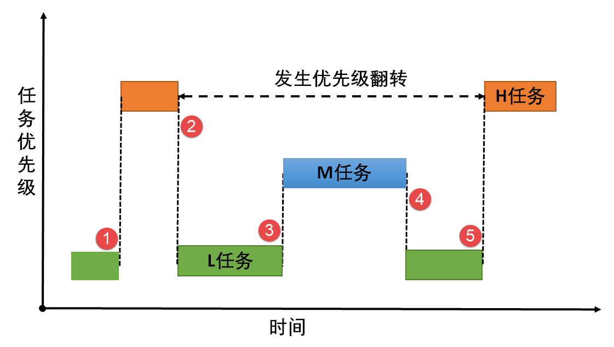
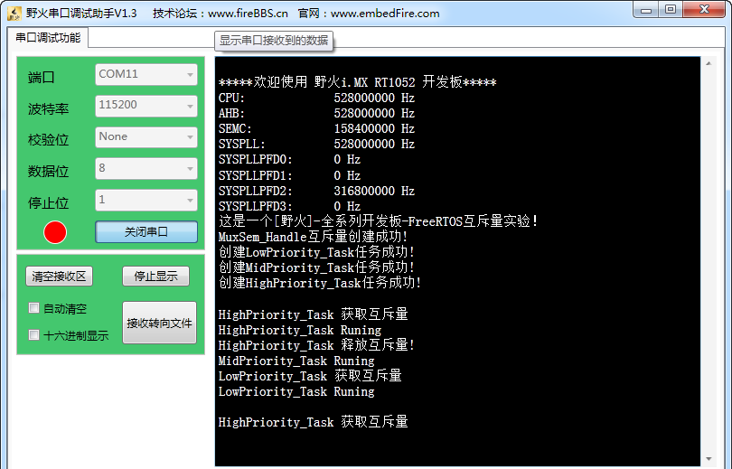

.. vim: syntax=rst

互斥量
============

互斥量基本概念
~~~~~~~~~~~~~~~~~~~~~~~~~~~~

互斥量又称互斥信号量（本质是信号量），是一种特殊的二值信号量，它和信号量不同的是，它支持互斥量所有权、递归访问以及防止优先级翻转的特性，用于实现对临界资源的独占式处理。任意时刻互斥量的状态只有两种，开锁或闭锁。当互斥量被任务持有时，该互斥量处于闭锁状态，这个任务获得互斥量的所有权。当该任务释放这个互
斥量时，该互斥量处于开锁状态，任务失去该互斥量的所有权。当一个任务持有互斥量时，其他任务将不能再对该互斥量进行开锁或持有。持有该互斥量的任务也能够再次获得这个锁而不被挂起，这就是递归访问，也就是递归互斥量的特性，这个特性与一般的信号量有很大的不同，在信号量中，由于已经不存在可用的信号量，任务递归获取
信号量时会发生主动挂起任务最终形成死锁。

如果想要用于实现同步（任务之间或者任务与中断之间），二值信号量或许是更好的选择，虽然互斥量也可以用于任务与任务、任务与中断的同步，但是互斥量更多的是用于保护资源的互锁。

用于互锁的互斥量可以充当保护资源的令牌，当一个任务希望访问某个资源时，它必须先获取令牌。当任务使用完资源后，必须还回令牌，以便其它任务可以访问该资源。是不是很熟悉，在我们的二值信号量里面也是一样的，用于保护临界资源，保证多任务的访问井然有序。当任务获取到信号量的时候才能开始使用被保护的资源，使用完就
释放信号量，下一个任务才能获取到信号量从而可用使用被保护的资源。但是信号量会导致的另一个潜在问题，那就是任务优先级翻转（具体会在下文讲解）。而FreeRTOS提供的互斥量可以通过优先级继承算法，可以降低优先级翻转问题产生的影响，所以，用于临界资源的保护一般建议使用互斥量。

互斥量的优先级继承机制
~~~~~~~~~~~~~~~~~~~~~~~~~~~~~~~~~

在FreeRTOS操作系统中为了降低优先级翻转问题利用了优先级继承算法。优先级继承算法是指，暂时提高某个占有某种资源的低优先级任务的优先级，使之与在所有等待该资源的任务中优先级最高那个任务的优先级相等，而当这个低优先级任务执行完毕释放该资源时，优先级重新回到初始设定值。因此，继承优先级的任务避免了系
统资源被任何中间优先级的任务抢占。

互斥量与二值信号量最大的不同是：互斥量具有优先级继承机制，而信号量没有。也就是说，某个临界资源受到一个互斥量保护，如果这个资源正在被一个低优先级任务使用，那么此时的互斥量是闭锁状态，也代表了没有任务能申请到这个互斥量，如果此时一个高优先级任务想要对这个资源进行访问，去申请这个互斥量，那么高优先级任务
会因为申请不到互斥量而进入阻塞态，那么系统会将现在持有该互斥量的任务的优先级临时提升到与高优先级任务的优先级相同，这个优先级提升的过程叫做优先级继承。这个优先级继承机制确保高优先级任务进入阻塞状态的时间尽可能短，以及将已经出现的“优先级翻转”危害降低到最小。

没有理解？没问题，结合过程示意图再说一遍。我们知道任务的优先级在创建的时候就已经是设置好的，高优先级的任务可以打断低优先级的任务，抢占CPU的使用权。但是在很多场合中，某些资源只有一个，当低优先级任务正在占用该资源的时候，即便高优先级任务也只能乖乖的等待低优先级任务使用完该资源后释放资源。这里高优先
级任务无法运行而低优先级任务可以运行的现象称为“优先级翻转”。

为什么说优先级翻转在操作系统中是危害很大？因为在我们一开始创造这个系统的时候，我们就已经设置好了任务的优先级了，越重要的任务优先级越高。但是发生优先级翻转，对我们操作系统是致命的危害，会导致系统的高优先级任务阻塞时间过长。

举个例子，现在有3个任务分别为H任务（High）、M任务（Middle）、L任务（Low），3个任务的优先级顺序为H任务>M任务>L任务。正常运行的时候H任务可以打断M任务与L任务，M任务可以打断L任务，假设系统中有一个资源被保护了，此时该资源被L任务正在使用中，某一刻，H任务需要使用该资源，但是L
任务还没使用完，H任务则因为申请不到资源而进入阻塞态，L任务继续使用该资源，此时已经出现了“优先级翻转”现象，高优先级任务在等着低优先级的任务执行，如果在L任务执行的时候刚好M任务被唤醒了，由于M任务优先级比L任务优先级高，那么会打断L任务，抢占了CPU的使用权，直到M任务执行完，再把CUP使用权归
还给L任务，L任务继续执行，等到执行完毕之后释放该资源，H任务此时才从阻塞态解除，使用该资源。这个过程，本来是最高优先级的H任务，在等待了更低优先级的L任务与M任务，其阻塞的时间是M任务运行时间+L任务运行时间，这只是只有3个任务的系统，假如很多个这样子的任务打断最低优先级的任务，那这个系统最高优先
级任务岂不是崩溃了，这个现象是绝对不允许出现的，高优先级的任务必须能及时响应。所以，没有优先级继承的情况下，使用资源保护，其危害极大，具体见 图19_1_。

图19_1_ **(1)**\ ：L任务正在使用某临界资源， H任务被唤醒，执行H任务。但L任务并未执行完毕，此时临界资源还未释放。

图19_1_ **(2)**\ ：这个时刻H任务也要对该临界资源进行访问，但 L任务还未释放资源，由于保护机制，H任务进入阻塞态，L任务得以继续运行，此时已经发生了优先级翻转现象。

图19_1_ **(3)**\ ：某个时刻M任务被唤醒，由于M任务的优先级高于L任务， M任务抢占了CPU的使用权，M任务开始运行，此时L任务尚未执行完，临界资源还没被释放。

图19_1_ **(4)**\ ：M任务运行结束，归还CPU使用权，L任务继续运行。

图19_1_ **(5)**\ ：L任务运行结束，释放临界资源，H任务得以对资源进行访问，H任务开始运行。

在这过程中，H任务的等待时间过长，这对系统来说这是很致命的，所以这种情况不允许出现，而互斥量就是用来降低优先级翻转的产生的危害。

假如有优先级继承呢？那么，在H任务申请该资源的时候，由于申请不到资源会进入阻塞态，那么系统就会把当前正在使用资源的L任务的优先级临时提高到与H任务优先级相同，此时M任务被唤醒了，因为它的优先级比H任务低，所以无法打断L任务，因为此时L任务的优先级被临时提升到H，所以当L任务使用完该资源了，进行释放，
那么此时H任务优先级最高，将接着抢占CPU的使用权， H任务的阻塞时间仅仅是L任务的执行时间，此时的优先级的危害降到了最低，看！这就是优先级继承的优势，具体见 图19_2_。

.. image:: media/The_mutex/Themut003.png
   :align: center
   :name: 图19_2
   :alt: 图:Select_Device_ARMCM7_For_Target

图19_2_ **(1)**\ ：L任务正在使用某临界资源，L任务正在使用某临界资源， H任务被唤醒，执行H任务。但L任务并未执行完毕，此时临界资源还未释放。

图19_2_ **(2)**\ ：某一时刻H任务也要对该资源进行访问，由于保护机制，H任务进入阻塞态。此时发生优先级继承，系统将L任务的优先级暂时提升到与H任务优先级相同，L任务继续执行。

图19_2_ **(3)**\ ：在某一时刻M任务被唤醒，由于此时M任务的优先级暂时低于L任务，所以M任务仅在就绪态，而无法获得CPU使用权。

图19_2_ **(4)**\ ：L任务运行完毕，H任务获得对资源的访问权，H任务从阻塞态变成运行态，此时L任务的优先级会变回原来的优先级。

图19_2_ **(5)**\ ：当H任务运行完毕，M任务得到CPU使用权，开始执行。

图19_2_ **(6)**\ ：系统正常运行，按照设定好的优先级运行。

但是使用互斥量的时候一定需要注意：在获得互斥量后，请尽快释放互斥量，同时需要注意的是在任务持有互斥量的这段时间，不得更改任务的优先级。FreeRTOS的优先级继承机制不能解决优先级反转，只能将这种情况的影响降低到最小，硬实时系统在一开始设计时就要避免优先级反转发生。

互斥量应用场景
~~~~~~~~~~~~~~~~~~~~~

互斥量的使用比较单一，因为它是信号量的一种，并且它是以锁的形式存在。在初始化的时候，互斥量处于开锁的状态，而被任务持有的时候则立刻转为闭锁的状态。互斥量更适合于：

-  可能会引起优先级翻转的情况。

递归互斥量更适用于：

-  任务可能会多次获取互斥量的情况下。这样可以避免同一任务多次递归持有而造成死锁的问题。

多任务环境下往往存在多个任务竞争同一临界资源的应用场景，互斥量可被用于对临界资源的保护从而实现独占式访问。另外，互斥量可以降低信号量存在的优先级翻转问题带来的影响。

比如有两个任务需要对串口进行发送数据，其硬件资源只有一个，那么两个任务肯定不能同时发送啦，不然导致数据错误，那么，就可以用互斥量对串口资源进行保护，当一个任务正在使用串口的时候，另一个任务则无法使用串口，等到任务使用串口完毕之后，另外一个任务才能获得串口的使用权。

另外需要注意的是互斥量不能在中断服务函数中使用，因为其特有的优先级继承机制只在任务起作用，在中断的上下文环境毫无意义。

互斥量运作机制
~~~~~~~~~~~~~~~~~~~~~

多任务环境下会存在多个任务访问同一临界资源的场景，该资源会被任务独占处理。其他任务在资源被占用的情况下不允许对该临界资源进行访问，这个时候就需要用到FreeRTOS的互斥量来进行资源保护，那么互斥量是怎样来避免这种冲突？

用互斥量处理不同任务对临界资源的同步访问时，任务想要获得互斥量才能进行资源访问，如果一旦有任务成功获得了互斥量，则互斥量立即变为闭锁状态，此时其他任务会因为获取不到互斥量而不能访问这个资源，任务会根据用户自定义的等待时间进行等待，直到互斥量被持有的任务释放后，其他任务才能获取互斥量从而得以访问该临界
资源，此时互斥量再次上锁，如此一来就可以确保每个时刻只有一个任务正在访问这个临界资源，保证了临界资源操作的安全性。

.. image:: media/The_mutex/Themut004.png
   :align: center
   :name: 图19_3
   :alt: 图:Select_Device_ARMCM7_For_Target

图19_3_ **(1)**\ ：因为互斥量具有优先级继承机制，一般选择使用互斥量对资源进行保护，如果资源被占用的时候，无论是什么优先级的任务想要使用该资源都会被阻塞。

图19_3_ **(2)**\ ：假如正在使用该资源的任务1比阻塞中的任务2的优先级还低，那么任务1将被系统临时提升到与高优先级任务2相等的优先级（任务1的优先级从L 变成H）。

图19_3_ **(3)**\ ：当任务1使用完资源之后，释放互斥量，此时任务1的优先级会从H变回原来的L。

图19_3_ **(4)-(5)**\ ：任务2此时可以获得互斥量，然后进行资源的访问，当任务2访问了资源的时候，该互斥量的状态又为闭锁状态，其他任务无法获取互斥量。

互斥量控制块
~~~~~~~~~~~~~~~~~~

互斥量的API函数实际上都是宏，它使用现有的队列机制，这些宏定义在semphr.h文件中，如果使用互斥量，需要包含semphr.h头文件。所以FreeRTOS的互斥量控制块结构体与消息队列结构体是一模一样的，只不过结构体中某些成员变量代表的含义不一样而已，我们会具体讲解一下哪里与消息队列不一样。先来
看看结构体控制块，具体见 代码清单19_1 高亮部分。

注意：没说明的部分与消息队列一致。

代码清单‑1互斥量控制块

.. code-block:: c
    :caption: 代码清单19 1互斥量控制块
    :emphasize-lines: 7-8, 14-16
    :name: 代码清单19_1
    :linenos:

    typedefstruct QueueDefinition {
	int8_t *pcHead;				
	int8_t *pcTail;				
	int8_t *pcWriteTo;				
	
	union {
	int8_t *pcReadFrom;			
			UBaseType_t uxRecursiveCallCount;	(1)	
		} u;
	
		List_t xTasksWaitingToSend;		
		List_t xTasksWaitingToReceive;		
	
	volatile UBaseType_t uxMessagesWaiting;	(1)
		UBaseType_t uxLength;			(2)
		UBaseType_t uxItemSize;			(3)
	
	volatileint8_t cRxLock;			
	volatileint8_t cTxLock;			
	
	#if( ( configSUPPORT_STATIC_ALLOCATION == 1 )
	&& ( configSUPPORT_DYNAMIC_ALLOCATION == 1 ) )
	uint8_t ucStaticallyAllocated;
	#endif
	
	#if ( configUSE_QUEUE_SETS == 1 )
	struct QueueDefinition *pxQueueSetContainer;
	#endif
	
	#if ( configUSE_TRACE_FACILITY == 1 )
				UBaseType_t uxQueueNumber;
	uint8_t ucQueueType;
	#endif
	
			} xQUEUE;
	
	typedef xQUEUE Queue_t;

代码清单19_1_ **(1)**\ ： pcReadFrom与uxRecursiveCallCount是一对互斥变量，使用联合体用来确保两个互斥的结构体成员不会同时出现。当结构体用于队列时，pcReadFrom指向出队消息空间的最后一个，见文知义，就是读取消息时候是从pcReadFrom指向的空间
读取消息内容。当结构体用于互斥量时，uxRecursiveCallCount用于计数，记录递归互斥量被“调用”的次数。

代码清单19_1_ **(2)**\ ：如果控制块结构体是用于消息队列：uxMessagesWaiting用来记录当前消息队列的消息个数；如果控制块结构体被用于互斥量的时候，这个值就表示有效互斥量个数，这个值是1则表示互斥量有效，如果是0则表示互斥量无效。

代码清单19_1_ **(3)**\ ：如果控制块结构体是用于消息队列：uxLength表示队列的长度，也就是能存放多少消息；如果控制块结构体被用于互斥量的时候，uxLength表示最大的信号量可用个数，uxLength最大为1，因为信号量要么是有效的，要么是无效的。

代码清单19_1_ **(4)**\ ：如果控制块结构体是用于消息队列：uxItemSize表示单个消息的大小；如果控制块结构体被用于互斥量的时候，则无需存储空间，为0即可。

互斥量函数接口讲解
~~~~~~~~~~~~~~~~~~~~~~~~~~~

互斥量创建函数xSemaphoreCreateMutex()
^^^^^^^^^^^^^^^^^^^^^^^^^^^^^^^^^^^^^^^^^^^^^^^^^^^^^^^^^^^^

xSemaphoreCreateMutex()用于创建一个互斥量，并返回一个互斥量句柄。该句柄的原型是一个void 型的指针，在使用之前必须先由用户定义一个互斥量句柄。要想使用该函数必须在FreeRTOSConfig.h中把宏\ `configSUPPORT_DYNAMIC_ALLOCATION
<http://www.freertos.org/a00110.html#configSUPPORT_DYNAMIC_ALLOCATION>`__\
定义为1，即开启动态内存分配，其实该宏在FreeRTOS.h中默认定义为1，即所有FreeRTOS的对象在创建的时候都默认使用动态内存分配方案，同时还需在FreeRTOSConfig.h中把configUSE_MUTEXES宏定义打开，表示使用互斥量。

.. code-block:: c
    :caption: 代码清单‑2 xSemaphoreCreateMutex()函数原型
    :name: 代码清单19_2
    :linenos:
	
	#if( configSUPPORT_DYNAMIC_ALLOCATION == 1 )
	#define xSemaphoreCreateMutex() xQueueCreateMutex( queueQUEUE_TYPE_MUTEX )
	#endif

从xSemaphoreCreateMutex()函数原型就可以看出，创建互斥量其实是调用xQueueCreateMutex函数，下面看看xQueueCreateMutex的源码，具体见 代码清单19_3_。

.. code-block:: c
    :caption: 代码清单19 3 xQueueCreateMutex源码
    :name: 代码清单19_3
    :linenos:
	
	#if( ( configUSE_MUTEXES == 1 ) &&			\
	( configSUPPORT_DYNAMIC_ALLOCATION == 1 ) )

	QueueHandle_t xQueueCreateMutex( const uint8_t ucQueueType )
	{
		Queue_t *pxNewQueue;
	const UBaseType_t uxMutexLength =( UBaseType_t ) 1,
	uxMutexSize = ( UBaseType_t ) 0;		

		pxNewQueue = ( Queue_t * ) xQueueGenericCreate(
						uxMutexLength,
						uxMutexSize,
						ucQueueType );			(1)
		prvInitialiseMutex( pxNewQueue );			(2)
	 
	return pxNewQueue;
	}

这个函数是带条件编译的，只有将宏configUSE_MUTEXES定义为1才会编译这个函数。

代码清单19_3_ **(1)**\ ：其实互斥量的创建也是调用xQueueGenericCreate()函数进行创建。uxQueueLength为1表示创建的队列长度为1，其实用作互斥量就表示互斥量的最大可用个数，从前面的知识点我们就知道，互斥量要么是开锁（有效），要么是闭锁（无效），长度为1不正
是这样子的表示吗？同时uxMutexSize的值为0，表示创建的消息空间（队列项）大小为0，因为这个所谓的“消息队列”其实并不是用于存储消息的，而是被用作互斥量，因为我们根本无需关注消息内容是什么，只要知道互斥量是否有效即可， ucQueueType
表示的是创建队列的类型，在queue.h中有定义，具体见代码清单18‑4，现在创建的是互斥量，其类型就是queueQUEUE_TYPE_MUTEX，在前面的章节我们已经讲解了通用队列创建函数，在此就不重复赘述。

代码清单19_3_ **(2)**\ ：调用prvInitialiseMutex()函数进行初始胡互斥量，函数源码具体见 代码清单19_4_。

.. code-block:: c
    :caption: 代码清单‑4 prvInitialiseMutex()源码
    :name: 代码清单19_4
    :linenos:

	#define pxMutexHolder					pcTail	(4)
	#define uxQueueType					pcHead
	#define queueQUEUE_IS_MUTEX				NULL
	
	#if( configUSE_MUTEXES == 1 )
	
	static void prvInitialiseMutex( Queue_t *pxNewQueue )
	{
	if ( pxNewQueue != NULL ) {
			pxNewQueue->pxMutexHolder = NULL;			(1)
			pxNewQueue->uxQueueType = queueQUEUE_IS_MUTEX;		
	
			pxNewQueue->u.uxRecursiveCallCount = 0;			(2)
	
			traceCREATE_MUTEX( pxNewQueue );
	
			( void ) xQueueGenericSend( pxNewQueue,
										NULL,
										( TickType_t ) 0U,
										queueSEND_TO_BACK );		(3)
		} else {
			traceCREATE_MUTEX_FAILED();
		}
	}
	
	#endif

代码清单19_4_ **(1)**\ ：第一次看源码，是不是会感觉很奇怪，pxMutexHolder与uxQueueType这个成员变量是从哪出来的？明明结构体中没有这个东西，其实，FreeRTOS为了代码的可读性，真的做了很多优化的工作，在代码清单19‑4\ **(4)**\ 中，我们可以看到，F
reeRTOS用宏定义的方式来重新定义了结构体中的pcTail与pcHead成员变量，更方便阅读。为什么要这样子呢？我们知道，pcTail与pcHead用于指向消息存储区域的，但是如果队列用作互斥量，那么我们就无需理会消息存储区域了，因为都没有消息存储区域，但是互斥量有个很重要的特性，那就是优先级继
承机制，所有，我们要知道持有互斥量的任务是哪一个，因为只有持有互斥量的任务才能得到互斥量的所有权，所以，pxMutexHolder就被用于指向持有互斥量的任务控制块，现在初始化的时候，就初始化为NULL，表示没有任务持有互斥量。uxQueueType表示队列的类型，设置为queueQUEUE_IS_
MUTEX（NULL），表示的是用作互斥量。

代码清单19_4_ **(2)**\ ：如果是递归互斥量的话，还需要联合体成员变量u.uxRecursiveCallCount初始化一下。

代码清单19_4_ **(3)**\ ：调用xQueueGenericSend()函数释放互斥量，在创建成功的时候互斥量默认是有效的。

互斥量创建成功的示意图具体见 图19_4_。

xSemaphoreCreateMutex()函数使用是非常简单的，只不过需要用户自己定义一个互斥量的控制块指针，使用实例具体见 代码清单19_5_ 高亮部分。

.. code-block:: c
    :caption: 代码清单‑5xSemaphoreCreateMutex()函数使用实例
    :emphasize-lines: 6-8
    :name: 代码清单19_5
    :linenos:

	SemaphoreHandle_t MuxSem_Handle;

	void vATask( void * pvParameters )
	{
	/* 创建一个互斥量 */
		MuxSem_Handle= xSemaphoreCreateMutex();

	if (MuxSem_Handle!= NULL ) {
	/* 互斥量创建成功 */
		}
	}

	
递归互斥量创建函数xSemaphoreCreateRecursiveMutex()
^^^^^^^^^^^^^^^^^^^^^^^^^^^^^^^^^^^^^^^^^^^^^^^^^^^^^^^^^^^^^^^^^^^^^^^^^^^^^^^^^^

xSemaphoreCreateRecursiveMutex()用于创建一个递归互斥量，不是递归的互斥量由函数xSemaphoreCreateMutex()
或xSemaphoreCreateMutexStatic()创建（我们只讲解动态创建），且只能被同一个任务获取一次，如果同一个任务想再次获取则会失败。递归信号量则相反，它可以被同一个任务获取很多次，获取多少次就需要释放多少次。递归信号量与互斥量一样，都实现了优先级继承机制，可以减少优先级反转的反生。

要想使用该函数必须在FreeRTOSConfig.h中把宏\ `configSUPPORT_DYNAMIC_ALLOCATION <http://www.freertos.org/a00110.html#configSUPPORT_DYNAMIC_ALLOCATION>`__\
和configUSE_RECURSIVE_MUTEXES均定义为1。宏\ `configSUPPORT_DYNAMIC_ALLOCATION <http://www.freertos.org/a00110.html#configSUPPORT_DYNAMIC_ALLOCATION>`__\
定义为1即表示开启动态内存分配，其实该宏在FreeRTOS.h中默认定义为1，即所有FreeRTOS的对象在创建的时候都默认使用动态内存分配方案。该函数的具体说明见表 xSemaphoreCreateRecursiveMutex函数说明_，应用举例见

其实xSemaphoreCreateRecursiveMutex()实际调用的函数就是xQueueCreateMutex()函数，具体的创建过程也不再重复赘述，参考前一小节，
下面来看看如何使用xSemaphoreCreateRecursiveMutex()函数，具体见 代码清单19_6_ 高亮部分。

表格‑1xSemaphoreCreateRecursiveMutex()函数说明

.. list-table::
   :widths: 33 33
   :name: xSemaphoreCreateRecursiveMutex函数说明
   :header-rows: 0

   * - **函数原型**
     - #if((configSUPPORT_DYNAMIC_ALLOCATION==1) && (configUSE_RECURSIVE_MUTEXES ==1))
       #define xSemaphoreCreateRecursiveMutex() xQueueCreateMutex( queueQUEUE_TYPE_RECURSIVE_MUTEX )
       #endif

   * - **功能**
     - 创建一个递归互斥量。

   * - **参数**
     - void	无。

   * - **返回值**
     - 如果创建成功则返回一个递归互斥量句柄，用于访问创建的递归互斥量。如果创建不成功则返回NULL。

其实xSemaphoreCreateRecursiveMutex()实际调用的函数就是xQueueCreateMutex()函数，具体的创建过程也不再重复赘述，参考前一小节，
下面来看看如何使用xSemaphoreCreateRecursiveMutex()函数，具体见 代码清单19_6_ 高亮部分。

.. code-block:: c
    :caption: 代码清单‑6xSemaphoreCreateRecursiveMutex()函数使用实例
    :emphasize-lines: 5-9
    :name: 代码清单19_6
    :linenos:

	SemaphoreHandle_t xMutex;

	void vATask( void * pvParameters )
	{
	/* 创建一个递归互斥量 */
		xMutex = xSemaphoreCreateRecursiveMutex();

	if ( xMutex != NULL ) {
	/* 递归互斥量创建成功 */
		}
	}

互斥量删除函数vSemaphoreDelete()
^^^^^^^^^^^^^^^^^^^^^^^^^^^^^^^^^^^^^^^^^^^^^^^^^^

互斥量的本质是信号量，直接调用vSemaphoreDelete()函数进行删除即可，具体见18.6.2 信号量删除函数章节。

互斥量获取函数xSemaphoreTake()
^^^^^^^^^^^^^^^^^^^^^^^^^^^^^^^^^^^^^^^^^^^^^^

我们知道，当互斥量处于开锁的状态，任务才能获取互斥量成功，当任务持有了某个互斥量的时候，其它任务就无法获取这个互斥量，需要等到持有互斥量的任务进行释放后，其他任务才能获取成功，任务通过互斥量获取函数来获取互斥量的所有权。任务对互斥量的所有权是独占的，任意时刻互斥量只能被一个任务持有，如果互斥量处于开
锁状态，那么获取该互斥量的任务将成功获得该互斥量，并拥有互斥量的使用权；如果互斥量处于闭锁状态，获取该互斥量的任务将无法获得互斥量，任务将被挂起，在任务被挂起之前，会进行优先级继承，如果当前任务优先级比持有互斥量的任务优先级高，那么将会临时提升持有互斥量任务的优先级。互斥量的获取函数是一个宏定义，实
际调用的函数就是xQueueGenericReceive()，具体见 代码清单19_7_。

.. code-block:: c
    :caption: 代码清单‑7 xSemaphoreTake()函数原型
    :name: 代码清单19_7
    :linenos:

	#define xSemaphoreTake( xSemaphore, xBlockTime ) \\

	xQueueGenericReceive(( QueueHandle_t ) ( xSemaphore ), \\

	NULL, \\

	(xBlockTime ), \\

	pdFALSE )

xQueueGenericReceive()函数想必我们都不陌生，其实就是消息队列获取函数，只不过如果是使用了互斥量的时候，这个函数会稍微有点不一样，因为互斥量本身的优先级继承机制，所以，在这个函数里面会使用宏定义进行编译，如果获取的对象是互斥量，那么这个函数就拥有优先级继承算法，如果获取对象不是互
斥量，就没有优先级继承机制，下面来看看xQueueGenericReceive源码，具体见 代码清单19_8_ 高亮部分，其他地方的解释具体见17.6.5 3章节。

.. code-block:: c
    :caption: 代码清单‑8 xQueueGenericReceive源码（已删减）
    :emphasize-lines: 34-40,94-109
    :name: 代码清单19_8
    :linenos:

	BaseType_t xQueueGenericReceive( QueueHandle_t xQueue,
	void * const pvBuffer,
	TickType_t xTicksToWait,
	const BaseType_t xJustPeeking )
	{
		BaseType_t xEntryTimeSet = pdFALSE;
		TimeOut_t xTimeOut;
	int8_t *pcOriginalReadPosition;
		Queue_t * const pxQueue = ( Queue_t * ) xQueue;
	
	/* 已删除一些断言 */
	
	for ( ;; ) {
			taskENTER_CRITICAL();
			{
	const UBaseType_t uxMessagesWaiting = pxQueue->uxMessagesWaiting;
	
	/* 看看队列中有没有消息 */
	if ( uxMessagesWaiting > ( UBaseType_t ) 0 ) {		
	/*防止仅仅是读取消息，而不进行消息出队操作*/
					pcOriginalReadPosition = pxQueue->u.pcReadFrom;
	
	/* 拷贝消息到用户指定存放区域pvBuffer */
					prvCopyDataFromQueue( pxQueue, pvBuffer );
	
	if ( xJustPeeking == pdFALSE ) {
	/* 读取消息并且消息出队 */
						traceQUEUE_RECEIVE( pxQueue );
	
	/* 获取了消息，当前消息队列的消息个数需要减一 */
						pxQueue->uxMessagesWaiting = uxMessagesWaiting - 1;
	
	/* 如果系统支持使用互斥量 */
	#if ( configUSE_MUTEXES == 1 )					
						{
	/* 如果队列类型是互斥量 */
		if(pxQueue->uxQueueType == queueQUEUE_IS_MUTEX) {
	/* 获取当前任务控制块 */		(1)
								pxQueue->pxMutexHolder =
								( int8_t * )pvTaskIncrementMutexHeldCount();
							} else {
								mtCOVERAGE_TEST_MARKER();
							}
						}
	#endif
	
	/* 判断一下消息队列中是否有等待发送消息的任务 */
	if ( listLIST_IS_EMPTY(
	&( pxQueue->xTasksWaitingToSend ) ) == pdFALSE) {
	/* 将任务从阻塞中恢复 */
	if ( xTaskRemoveFromEventList(
	&( pxQueue->xTasksWaitingToSend))!= pdFALSE ){
	/* 如果被恢复的任务优先级比当前任务高，会进行一次任务切换 */
								queueYIELD_IF_USING_PREEMPTION();
							} else {
								mtCOVERAGE_TEST_MARKER();
							}
						} else {
							mtCOVERAGE_TEST_MARKER();
						}
					}
	
					taskEXIT_CRITICAL();
	return pdPASS;
	            }
	/* 消息队列中没有消息可读 */
	else {						
	if ( xTicksToWait == ( TickType_t ) 0 ) {
	/* 不等待，直接返回 */
						taskEXIT_CRITICAL();
						traceQUEUE_RECEIVE_FAILED( pxQueue );
	return errQUEUE_EMPTY;
					} else if ( xEntryTimeSet == pdFALSE ) {
	/* 初始化阻塞超时结构体变量，初始化进入
	阻塞的时间xTickCount和溢出次数xNumOfOverflows */
						vTaskSetTimeOutState( &xTimeOut );
						xEntryTimeSet = pdTRUE;
					} else {
						mtCOVERAGE_TEST_MARKER();
					}
				}
			}
			taskEXIT_CRITICAL();

			vTaskSuspendAll();
			prvLockQueue( pxQueue );

	/* 检查超时时间是否已经过去了*/
	if(xTaskCheckForTimeOut(&xTimeOut, &xTicksToWait) == pdFALS
	/* 如果队列还是空的 */
	if ( prvIsQueueEmpty( pxQueue ) != pdFALSE ) {
					traceBLOCKING_ON_QUEUE_RECEIVE( pxQueue );

	/* 如果系统支持使用互斥量 */
	#if ( configUSE_MUTEXES == 1 )
					{
	/* 如果队列类型是互斥量 */
	if ( pxQueue->uxQueueType == queueQUEUE_IS_MUTEX ) {
							taskENTER_CRITICAL();
							{
	/* 进行优先级继承 */
	vTaskPriorityInherit((void*)pxQueue->pxMutexHolder);(2)
							}
							taskEXIT_CRITICAL();
						} else {
							mtCOVERAGE_TEST_MARKER();
						}
					}
	#endif
	
	/* 将当前任务添加到队列的等待接收列表中
	以及阻塞延时列表，阻塞时间为用户指定的超时时间xTicksToWait */
	
					vTaskPlaceOnEventList(
	&( pxQueue->xTasksWaitingToReceive ), xTicksToWait );
					prvUnlockQueue( pxQueue );
	if ( xTaskResumeAll() == pdFALSE ) {
	/* 如果有任务优先级比当前任务高，会进行一次任务切换 */
						portYIELD_WITHIN_API();
					} else {
						mtCOVERAGE_TEST_MARKER();
					}
				} else {
	/* 如果队列有消息了，就再试一次获取消息 */
					prvUnlockQueue( pxQueue );
					( void ) xTaskResumeAll();
				}
	         } else {
	/* 超时时间已过，退出 */
				prvUnlockQueue( pxQueue );
				( void ) xTaskResumeAll();
	
	if ( prvIsQueueEmpty( pxQueue ) != pdFALSE ) {
	/* 如果队列还是空的，返回错误代码errQUEUE_EMPTY */
					traceQUEUE_RECEIVE_FAILED( pxQueue );
	return errQUEUE_EMPTY;
				} else {
					mtCOVERAGE_TEST_MARKER();
				}
			}
		}
	}
	/*-----------------------------------------------------------*/

对于获取互斥量过程，因为与操作队列消息队列没啥差别，我们可以将其简化一下，但是有一些地方要注意一点，过程简化后具体如下：

如果互斥量有效，调用获取互斥量函数后结构体成员变量uxMessageWaiting会减1，然后将队列结构体成员指针pxMutexHolder指向任务控制块，表示这个互斥量被哪个任务持有，只有这个任务才拥有互斥量的所有权，并且该任务的控制块结构体成员uxMutexesHeld会加1，表示任务已经获取到
互斥量。

如果此时互斥量是无效状态并且用户指定的阻塞时间为0，则直接返回错误码（errQUEUE_EMPTY）。

而如果用户指定的阻塞超时时间不为0，则当前任务会因为等待互斥量有效而进入阻塞状态，在将任务添加到延时列表之前，会判断当前任务和拥有互斥量的任务优先级哪个更高，如果当前任务优先级高，则拥有互斥量的任务继承当前任务优先级，也就是我们说的优先级继承机制。

代码清单19_8_ **(1)**\ ：如果互斥量是有效的，获取成功后结构体成员变量pxMutexHolder指向当前任务控制块。pvTaskIncrementMutexHeldCount()函数做了两件事，把当前任务控制块的成员变量uxMutexesHeld加1，表示当前任务持有的互斥量数量，然后
返回指向当前任务控制块的指针pxCurrentTCB。

代码清单19_8_ **(2)**\ ：如果互斥量是无效状态，当前任务是无法获取到互斥量的，并且用户指定了阻塞时间，那么在当前任务进入阻塞的时候，需要进行优先级继承。
而vTaskPriorityInherit()函数就是进行优先级继承操作，源码具体见 代码清单19_9_。

.. code-block:: c
    :caption: 代码清单‑9 vTaskPriorityInherit()函数源码
    :name: 代码清单19_9
    :linenos:

	#if ( configUSE_MUTEXES == 1 )
 
	void vTaskPriorityInherit( TaskHandle_t const pxMutexHolder )
	{
		TCB_t * const pxTCB = ( TCB_t * ) pxMutexHolder;		(1)
	
	
	if ( pxMutexHolder != NULL ) {				
	/* 判断当前任务与持有互斥量任务的优先级 */
	if ( pxTCB->uxPriority < pxCurrentTCB->uxPriority ) {	(2)
	if ( ( listGET_LIST_ITEM_VALUE( &( pxTCB->xEventListItem ) )
	& taskEVENT_LIST_ITEM_VALUE_IN_USE ) == 0UL ) {
	/* 调整互斥锁持有者等待的事件列表项的优先级 */
					listSET_LIST_ITEM_VALUE( &( pxTCB->xEventListItem ),
	      mtCOVERAGE_TEST_MARKER();
             }
 
	/* 如果被提升优先级的任务处于就绪列表中 */
	if (listIS_CONTAINED_WITHIN( &( pxReadyTasksLists[ pxTCB->uxPriority ] ),
	&( pxTCB->xStateListItem ) ) != pdFALSE ) {(4)
	/* 先将任务从就绪列表中移除 */
	if ( uxListRemove( &( pxTCB->xStateListItem ) ) == ( UBaseType_t ) 0 ) {
						taskRESET_READY_PRIORITY( pxTCB->uxPriority );(5)
					} else {
						mtCOVERAGE_TEST_MARKER();
					}
	/* 暂时提升持有互斥量任务的优先级，提升到与当前任务优先级一致*/
					pxTCB->uxPriority = pxCurrentTCB->uxPriority;	(6)
	
	/* 再插入就绪列表中 */
					prvAddTaskToReadyList( pxTCB );			(7)
				} else {
	/* 如果任务不是在就绪列表中，就仅仅是提升任务优先级即可 */
					pxTCB->uxPriority = pxCurrentTCB->uxPriority;	(8)
				}
	
				traceTASK_PRIORITY_INHERIT( pxTCB, pxCurrentTCB->uxPriority );
			} else {
				mtCOVERAGE_TEST_MARKER();
			}
		} else {
			mtCOVERAGE_TEST_MARKER();
		}
	}
	
	#endif/* configUSE_MUTEXES */
	/*-----------------------------------------------------------*/

代码清单19_9_ **(1)**\ ：获取持互斥量的任务控制块。

代码清单19_9_ **(2)**\ ：判断当前任务与持有互斥量任务的优先级，如果当前任务比持有互斥量任务的优先级高，那么需要进行优先级继承。

代码清单19_9_ **(3)**\ ：如果持有互斥量的任务在等待事件列表中，就调整互斥锁持有者等待的事件列表项的优先级，因为待会会暂时修改持有互斥量任务的优先级。

代码清单19_9_ **(4)**\ ：如果被提升优先级的任务处于就绪列表中，就要麻烦一点，因为如果修改了任务的优先级，那么在就绪列表中的任务也要重新排序。

代码清单19_9_ **(5)**\ ：先将任务从就绪列表中移除，待优先级继承完毕就重新插入就绪列表中。

代码清单19_9_ **(6)**\ ：修改持有互斥量任务的优先级，暂时提升到与当前任务优先级一致。

代码清单19_9_ **(7)**\ ：调用prvAddTaskToReadyList()函数将已经修改的任务优先级重新插入就绪列表，插入就绪列表会重新按照优先级进行排序。

代码清单19_9_ **(8)**\ ：如果持有互斥量的任务不是在就绪列表中，就仅仅是提升任务优先级即可。

至此，获取互斥量的操作就完成了，如果任务获取互斥量成功，那么在使用完毕需要立即释放，否则很容易造成其他任务无法获取互斥量，因为互斥量的优先级继承机制是只能将优先级危害降低，而不能完全消除。同时还需注意的是，互斥量是不允许在中断中操作的，因为优先级继承机制在中断是无意义的，互斥量获取函数的使用实例具体
见代码清单19‑10加粗部分。

.. code-block:: c
    :caption: 代码清单‑10 xSemaphoreTake()函数使用实例
    :emphasize-lines: 6-8
    :name: 代码清单19_10
    :linenos:

	static void HighPriority_Task(void* parameter)
	{
		BaseType_t xReturn = pdTRUE;/* 定义一个创建信息返回值，默认为pdTRUE */
	while (1) {
			printf("HighPriority_Task 获取信号量\n");
	//获取互斥量 MuxSem,没获取到则一直等待
			xReturn = xSemaphoreTake(MuxSem_Handle,/* 互斥量句柄 */
									portMAX_DELAY); /* 等待时间 */
	if (pdTRUE == xReturn)
				printf("HighPriority_Task Runing\n");
			LED1_TOGGLE;
			//处理临界资源
	
	printf("HighPriority_Task 释放信号量!\r\n");
	
	xSemaphoreGive( MuxSem_Handle );//释放互斥量
	
			vTaskDelay(1000);
		}
	}

递归互斥量获取函数xSemaphoreTakeRecursive()
^^^^^^^^^^^^^^^^^^^^^^^^^^^^^^^^^^^^^^^^^^^^^^^^^^^^^^^^^^^^^^^^^^^^

xSemaphoreTakeRecursive()是一个用于获取递归互斥量的宏，与互斥量的获取函数一样，xSemaphoreTakeRecursive()也是一个宏定义，它最终使用现有的队列机制，实际执行的函数是xQueueTakeMutexRecursive()。互斥量之前必须由xSemaphor
eCreateRecursiveMutex()这个函数创建。要注意的是该函数不能用于获取由函数xSemaphoreCreateMutex()创建的互斥量。要想使用该函数必须在头文件FreeRTOSConfig.h
中把宏configUSE_RECURSIVE_MUTEXES定义为1。该函数的具体说明见表 xSemaphoreTakeRecursive函数说明_，应用举例见 代码清单19_12_。

表格‑2xSemaphoreTakeRecursive()函数说明

.. list-table::
   :widths: 33 33
   :name: xSemaphoreTakeRecursive函数说明
   :header-rows: 0

   * - **函数原型**
     - #if( configUSE_RECURSIVE_MUTEXES == 1 )
       #define xSemaphoreTakeRecursive( xMutex, xBlockTime )	xQueueTakeMutexRecursive( ( xMutex ), ( xBlockTime ) )
       #endif

   * - **功能**
     - 获取递归互斥量。

   * - **参数**
     - xMutex	信号量句柄。

   * -
     - xBlockTime	如果不是持有互斥量的任务去获取无效的互斥量，那么任务将进行等待用户指定超时时间，单位为tick（即系统节拍周期）。如果宏 INCLUDE_vTaskSuspend定义为1且形参xTicksToWait设置为portMAX_DELAY ，则任务将一直阻塞在该递归互斥量上（即没有超时时间）。

   * - **返回值**
     - 获取成功则返回pdTRUE，在超时之前没有获取成功则返回errQUEUE_EMPTY。

下面来看看获取递归互斥量的实现过程，具体见 代码清单19_11_。

.. code-block:: c
    :caption: 代码清单‑11xQueueTakeMutexRecursive源码
    :name: 代码清单19_11
    :linenos:

	#if ( configUSE_RECURSIVE_MUTEXES == 1 )
 
	BaseType_t xQueueTakeMutexRecursive( QueueHandle_t xMutex,
										TickType_t xTicksToWait )
	{
		BaseType_t xReturn;
		Queue_t * const pxMutex = ( Queue_t * ) xMutex;		
	
		configASSERT( pxMutex );
	
		traceTAKE_MUTEX_RECURSIVE( pxMutex );
	
	/* 如果持有互斥量的任务就是当前任务 */
	if ( pxMutex->pxMutexHolder == ( void * ) xTaskGetCurrentTaskHandle()){(1)
	
	/* u.uxRecursiveCallCount自加，表示调用了多少次递归互斥量获取 */
			( pxMutex->u.uxRecursiveCallCount )++;			
			xReturn = pdPASS;
		} else {
	/* 如果持有递归互斥量的任务不是当前任务，就只能等待递归互斥量被释放 */
			xReturn = xQueueGenericReceive( pxMutex, NULL, xTicksToWait, pdFALSE );(2)
	
	if ( xReturn != pdFAIL ) {
	/* 获取递归互斥量成功，记录递归互斥量的获取次数 */
				( pxMutex->u.uxRecursiveCallCount )++;		(3)	
			} else {
				traceTAKE_MUTEX_RECURSIVE_FAILED( pxMutex );
			}
		}
	
	return xReturn;
	}
	
	#endif

代码清单19_11_  **(1)**\ ：判断一下持有递归互斥量的任务是不是当前要获取的任务，如果是，则只需要将结构体中u.uxRecursiveCallCount成员变量自加，表示该任务调用了多少次递归互斥量获取即可，然后返回pdPASS，这样子就无需理会用户指定的超时时间了，效率就会很高。

代码清单19_11_  **(2)**\
：如果不是同一个任务去获取递归互斥量，那么按照互斥量的性质，当递归互斥量有效的时候才能被获取成功。如果此时有任务持有该递归互斥量，那么当前获取递归互斥量的任务就会进入阻塞等待，阻塞超时时间xTicksToWait由用户指定，这其实就是消息队列的出队操作，前面的章节已经详细讲解，就不再重复赘述。

代码清单19_11_  **(3)**\ ：当任务获取递归互斥量成功，就需要把结构体中u.uxRecursiveCallCount成员变量加1，记录递归互斥量的获取次数，并且返回获取成功。

递归互斥量可以在一个任务中多次获取，当第一次获取递归互斥量时，队列结构体成员指针pxMutexHolder指向获取递归互斥量的任务控制块，当任务再次尝试获取这个递归互斥量时，如果任务就是拥有递归互斥量所有权的任务，那么只需要将记录获取递归次数的成员变量u.uxRecursiveCallCount加1
即可，不需要再操作队列，下面看看xSemaphoreTakeRecursive()函数的使用实例，具体见 代码清单19_12_ 高亮部分。

.. code-block:: c
    :caption: 代码清单‑12xSemaphoreTakeRecursive()函数使用实例
    :emphasize-lines: 16-24
    :name: 代码清单19_12
    :linenos:

	SemaphoreHandle_t xMutex = NULL;

	/* 创建信号量的任务 */
	void vATask( void * pvParameters )
	{
	/* 创建一个递归互斥量，保护共享资源 */
		xMutex = xSemaphoreCreateRecursiveMutex();
	}

	/* 使用互斥量 */
	void vAnotherTask( void * pvParameters )
	{
	/* ... 做其他的事情 */

	if ( xMutex != NULL ) {
	/* 尝试获取递归信号量。
	如果信号量不可用则等待10个ticks */
	if(xSemaphoreTakeRecursive(xMutex,( TickType_t)10)==pdTRUE ) {
	/* 获取到递归信号量，可以访问共享资源 */
	/* ... 其他功能代码 */

	/* 重复获取递归信号量 */
				xSemaphoreTakeRecursive( xMutex, ( TickType_t ) 10 );
				xSemaphoreTakeRecursive( xMutex, ( TickType_t ) 10 );

	/* 释放递归信号量，获取了多少次就要释放多少次 */
				xSemaphoreGiveRecursive( xMutex );
				xSemaphoreGiveRecursive( xMutex );
				xSemaphoreGiveRecursive( xMutex );

	/* 现在递归互斥量可以被其他任务获取 */
			} else {
	/* 没能成功获取互斥量，所以不能安全的访问共享资源 */
			}
		}
	}

互斥量释放函数xSemaphoreGive()
^^^^^^^^^^^^^^^^^^^^^^^^^^^^^^^^^^^^^^^^^^^^^^

任务想要访问某个资源的时候，需要先获取互斥量，然后进行资源访问，在任务使用完该资源的时候，必须要及时归还互斥量，这样别的任务才能对资源进行访问。在前面的讲解中，我们知道，当互斥量有效的时候，任务才能获取互斥量，那么，是什么函数使得信号量变得有效呢？FreeRTOS给我们提供了互斥量释放函数xSema
phoreGive()，任务可以调用xSemaphoreGive()函数进行释放互斥量，表示我已经用完了，别人可以申请使用，互斥量的释放函数与信号量的释放函数一致，都是调用xSemaphoreGive()函数，但是要注意的是，互斥量的释放只能在任务中，不允许在中断中释放互斥量。

使用该函数接口时，只有已持有互斥量所有权的任务才能释放它，当任务调用xSemaphoreGive()函数时会将互斥量变为开锁状态，等待获取该互斥量的任务将被唤醒。
如果任务的优先级被互斥量的优先级翻转机制临时提升，那么当互斥量被释放后，任务的优先级将恢复为原本设定的优先级，具体见 代码清单19_13_。

.. code-block:: c
    :caption: 代码清单‑13xSemaphoreGive()函数原型
    :name: 代码清单19_13
    :linenos:

	#define xSemaphoreGive( xSemaphore )				\
	xQueueGenericSend( ( QueueHandle_t ) ( xSemaphore ),	\
						NULL, 				\
					semGIVE_BLOCK_TIME,		\
						queueSEND_TO_BACK )

我们知道互斥量、信号量的释放就是调用xQueueGenericSend()函数，但是互斥量的处理还是有一些不一样的地方，因为它有优先级继承机制，在释放互斥量的时候我们需要恢复任务的初始优先级，所以，下面我们来看看具体在哪恢复任务的优先级，其实就是prvCopyDataToQueue()这个函数，该函
数在xQueueGenericSend()中被调用，源码具体见 代码清单19_14_。

.. code-block:: c
    :caption: 代码清单‑14 prvCopyDataToQueue()源码（已删减，只保留互斥量部分）
    :name: 代码清单19_14
    :linenos:

	#if ( configUSE_MUTEXES == 1 )
	{
	if ( pxQueue->uxQueueType == queueQUEUE_IS_MUTEX )
		{
	/* The mutex is no longer being held. */
			xReturn = xTaskPriorityDisinherit( ( void * ) pxQueue->pxMutexHolder );
	pxQueue->pxMutexHolder = NULL;
		} else
		{
			mtCOVERAGE_TEST_MARKER();
		}
	}
	#endif/* configUSE_MUTEXES */

		pxQueue->uxMessagesWaiting = uxMessagesWaiting + 1;

看FreeRTOS的源码就是比较头大，层层调用，真正恢复任务的优先级函数其实是调用xTaskPriorityDisinherit()，而且系统会将结构体的pxMutexHolder成员变量指向NULL，表示暂时没有任务持有改互斥量，对结构体成员uxMessagesWaiting加1操作就代表了释放互
斥量，表示此时互斥量是有效的，其他任务可以来获取。下面来看看xTaskPriorityDisinherit()函数的源码，具体见 代码清单19_15_。

.. code-block:: c
    :caption: 代码清单‑15 xTaskPriorityDisinherit()源码
    :name: 代码清单19_15
    :linenos:

	#if ( configUSE_MUTEXES == 1 )
 
	BaseType_t xTaskPriorityDisinherit( TaskHandle_t const pxMutexHolder )
	{
		TCB_t * const pxTCB = ( TCB_t * ) pxMutexHolder;
		BaseType_t xReturn = pdFALSE;
	
	if ( pxMutexHolder != NULL ) {			(1)
			configASSERT( pxTCB == pxCurrentTCB );
	
			configASSERT( pxTCB->uxMutexesHeld );
			( pxTCB->uxMutexesHeld )--;
	
	/* 判断优先级是否被临时提升*/
	if ( pxTCB->uxPriority != pxTCB->uxBasePriority ) {	(2)
	/* 如果任务没有持有其他互斥量 */
	if ( pxTCB->uxMutexesHeld == ( UBaseType_t ) 0 ) {	(3)
	/* 将任务从状态列表中删除 */

	if (uxListRemove(&(pxTCB->xStateListItem ) ) == ( UBaseType_t ) 0 ) {
                    taskRESET_READY_PRIORITY( pxTCB->uxPriority );(4)
                } else {
                    mtCOVERAGE_TEST_MARKER();
                }
                traceTASK_PRIORITY_DISINHERIT( pxTCB, pxTCB->uxBasePriority );

	/* 在将任务添加到新的就绪列表之前，恢复任务的初始优先级 */
					pxTCB->uxPriority = pxTCB->uxBasePriority;	(5)

	/* 同时要重置等待事件列表的优先级 */
	listSET_LIST_ITEM_VALUE( &( pxTCB->xEventListItem ),	(6)
	( TickType_t ) configMAX_PRIORITIES -(TickType_t ) pxTCB->uxPriority );

	/* 将任务重新添加到就绪列表中 */
					prvAddTaskToReadyList( pxTCB );			(7)

					xReturn = pdTRUE;
				} else {
					mtCOVERAGE_TEST_MARKER();
				}
			} else {
				mtCOVERAGE_TEST_MARKER();
			}
		} else {
			mtCOVERAGE_TEST_MARKER();
		}

	return xReturn;
	}

	#endif/* configUSE_MUTEXES */

代码清单19_15_ **(1)**\ ：只有当有任务持有互斥量的时候，才会进行释放互斥量的操作。而且必须是持有互斥量的任务才允许释放互斥量，其他任务都没有权利去操作被任务持有的互斥量。

代码清单19_15_ **(2)**\ ：判断优先级是否被提升，如果没有继承过优先级，那也无需进行优先级恢复的操作\ **(3)-(8)**\ ，可以直接退出。

代码清单19_15_ **(3)**\ ：再看看这个任务持有多少个互斥量，因为任务可以持有多个互斥量的，如果这个互斥量释放了，就恢复初始的优先级，那么其他互斥量的优先级继承机制岂不是不起作用了，当然啦，这种一个任务持有多个互斥量的情景不多见，一般情况都是一个任务持有一个互斥量。

代码清单19_15_ **(4)**\ ：调用uxListRemove()函数将任务从状态列表中删除，无论该任务处于什么状态，因为要恢复任务的初始优先级，就必须先从状态列表中移除，待恢复初后再添加到就绪列表中，按优先级进行排序。

代码清单19_15_ **(5)**\ ：在将任务添加到就绪列表之前，恢复任务的初始优先级。

代码清单19_15_ **(6)**\ ：同时要重置等待事件列表的优先级。

代码清单19_15_ **(7)**\ ：将任务重新添加到就绪列表中。

至此，优先级继承恢复就讲解完毕，简单总结一下互斥量释放的过程：

被释放前的互斥量是处于无效状态，被释放后互斥量才变得有效，除了结构体成员变量uxMessageWaiting加1外，还要判断持有互斥量的任务是否有优先级继承，如果有的话，要将任务的优先级恢复到初始值。当然，该任务必须在没有持有其它互斥量的情况下，才能将继承的优先级恢复到原始值。然后判断是否有任务要获
取互斥量并且进入阻塞状态，有的话解除阻塞，最后返回成功信息（pdPASS），下面看看互斥量释放函数是如何使用的，具体见 代码清单19_16_ 高亮部分。

代码清单‑16xSemaphoreGive()使用实例

.. code-block:: c
    :caption: 代码清单‑16xSemaphoreGive()使用实例
    :emphasize-lines: 20-21
    :name: 代码清单19_16
    :linenos:

	SemaphoreHandle_t xSemaphore = NULL;

	void vATask( void * pvParameters )
	{
	/* 创建一个互斥量用于保护共享资源 */
		xSemaphore = xSemaphoreCreateMutex();

	if ( xSemaphore != NULL ) {
	if ( xSemaphoreGive( xSemaphore ) != pdTRUE ) {
	/* 
	如果要释放一个互斥量，必须先有第一次的获取*/
			}

	/* 获取互斥量，不等待 */
	if ( xSemaphoreTake( xSemaphore, ( TickType_t ) 0 ) ) {
	/* 获取到互斥量，可以访问共享资源 */

	/* ... 访问共享资源代码 */

	/* 共享资源访问完毕，释放互斥量 */
	if ( xSemaphoreGive( xSemaphore ) != pdTRUE ) {
	/* 互斥量释放失败，这可不是我们希望的 */
				}
			}
		}
	}

递归互斥量释放函数xSemaphoreGiveRecursive()
^^^^^^^^^^^^^^^^^^^^^^^^^^^^^^^^^^^^^^^^^^^^^^^^^^^^^^^^^^^^^^^^^^^^

 xSemaphoreGiveRecursive()是一个用于释放递归互斥量的宏。要想使用该函数必须在头文件FreeRTOSConfig.h把宏configUSE_RECURSIVE_MUTEXES定义为1。

.. code-block:: c
    :caption: 代码清单‑17 xSemaphoreGiveRecursive函数原型
    :name: 代码清单19_17
    :linenos:

	#if( configUSE_RECURSIVE_MUTEXES == 1 )
 
	#definexSemaphoreGiveRecursive( xMutex )		\
		xQueueGiveMutexRecursive( ( xMutex ) )
	
	#endif

xSemaphoreGiveRecursive()函数用于释放一个递归互斥量。已经获取递归互斥量的任务可以重复获取该递归互斥量。使用xSemaphoreTakeRecursive() 函数成功获取几次递归互斥量，就要使用xSemaphoreGiveRecursive()函数返还几次，在此之前递归互斥
量都处于无效状态，别的任务就无法获取该递归互斥量。使用该函数接口时，只有已持有互斥量所有权的任务才能释放它，每释放一次该递归互斥量，它的计数值就减1。当该互斥量的计数值为0时（即持有任务已经释放所有的持有操作），互斥量则变为开锁状态，等待在该互斥量上的任务将被唤醒。如果任务的优先级被互斥量的优先级翻
转机制临时提升，那么当互斥量被释放后，任务的优先级将恢复为原本设定的优先级，具体见 代码清单19_18_。

.. code-block:: c
    :caption: 代码清单‑18 xQueueGiveMutexRecursive源码
    :name: 代码清单19_18
    :linenos:

	#if ( configUSE_RECURSIVE_MUTEXES == 1 )
 
	BaseType_t xQueueGiveMutexRecursive( QueueHandle_t xMutex )
	{
		BaseType_t xReturn;
		Queue_t * const pxMutex = ( Queue_t * ) xMutex;
	
		configASSERT( pxMutex );
	/* 判断任务是否持有这个递归互斥量 */
	if ( pxMutex->pxMutexHolder == (void *)xTaskGetCurrentTaskHandle()){	(1)
			traceGIVE_MUTEX_RECURSIVE( pxMutex );
	
	/* 调用次数的计数值减一 */
			( pxMutex->u.uxRecursiveCallCount )--;			(2)
	
	/* 如果计数值减到0 */
	if ( pxMutex->u.uxRecursiveCallCount==(UBaseType_t) 0 ){	(3)
	/* 释放成功 */
				( void ) xQueueGenericSend( pxMutex,
											NULL,
											queueMUTEX_GIVE_BLOCK_TIME,
											queueSEND_TO_BACK );	(4)
			} else {
				mtCOVERAGE_TEST_MARKER();
			}
	
			xReturn = pdPASS;
		} else {
	/* 这个任务不具备释放这个互斥量的权利 */
			xReturn = pdFAIL;					(5)
	
			traceGIVE_MUTEX_RECURSIVE_FAILED( pxMutex );
		}
	
	return xReturn;
	}
	
	#endif/* configUSE_RECURSIVE_MUTEXES */
	/*-----------------------------------------------------------*/

代码清单19_18_ **(1)**\ ：判断任务是否持有这个递归互斥量，只有拥有这个递归互斥量所有权的任务才能对其进行释放操作。

代码清单19_18_ **(2)**\ ：每调用一次递归互斥量释放函数，递归互斥量的计数值u.uxRecursiveCallCount就会减一。

代码清单19_18_ **(3)**\ ：如果计数值减到0，就表明这个递归互斥量已经可以变得有效了。

代码清单19_18_ **(4)**\ ：需要调用一次通用入队函数xQueueGenericSend()释放一个递归互斥量，注意了，这一步才是让递归互斥量从无效变成有效，同时系统还需要检查一下释放有任务想获取这个递归互斥量，如果有就将其恢复。

代码清单19_18_ **(5)**\ ：这个任务不具备释放这个互斥量的权利，直接返回错误。

互斥量和递归互斥量的最大区别在于一个递归互斥量可以被已经获取这个递归互斥量的任务重复获取，而不会形成死锁。这个递归调用功能是通过队列结构体成员u\ **.**\ uxRecursiveCallCount实现的，这个变量用于存储递归调用的次数，每次获取递归互斥量后，这个变量加1，在释放递归互斥量后，这
个变量减1。只有这个变量减到0，即释放和获取的次数相等时，互斥量才能变成有效状态，
然后才允许使用xQueueGenericSend()函数释放一个递归互斥量，xSemaphoreGiveRecursive()函数使用实例具体见 代码清单19_19_ 高亮部分。

.. code-block:: c
    :caption: 代码清单‑19xSemaphoreGiveRecursive()函数使用实例
    :emphasize-lines: 24-27
    :name: 代码清单19_19
    :linenos:

	SemaphoreHandle_t xMutex = NULL;

	void vATask( void * pvParameters )
	{
	/* 创建一个递归互斥量用于保护共享资源 */
		xMutex = xSemaphoreCreateRecursiveMutex();
	}

	void vAnotherTask( void * pvParameters )
	{
	/* 其他功能代码 */

	if ( xMutex != NULL ) {
	/* 尝试获取递归互斥量
	如果不可用则等待10个ticks */
	if(xSemaphoreTakeRecursive(xMutex,( TickType_t ) 10 )== pdTRUE) {
	/* 获取到递归信号量，可以访问共享资源 */
	/* ... 其他功能代码 */

	/* 重复获取递归互斥量 */
				xSemaphoreTakeRecursive( xMutex, ( TickType_t ) 10 );
				xSemaphoreTakeRecursive( xMutex, ( TickType_t ) 10 );

	/* 释放递归互斥量，获取了多少次就要释放多少次 */
				xSemaphoreGiveRecursive( xMutex );
				xSemaphoreGiveRecursive( xMutex );
				xSemaphoreGiveRecursive( xMutex );

	/* 现在递归互斥量可以被其他任务获取 */
			} else {
	/* 没能成功获取互斥量，所以不能安全的访问共享资源 */
			}
		}
	}

互斥量实验
~~~~~~~~~~~~~~~

模拟优先级翻转实验
^^^^^^^^^^^^^^^^^^^^^^^^^^^

模拟优先级翻转实验是在FreeRTOS中创建了三个任务与一个二值信号量，任务分别是高优先级任务，中优先级任务，低优先级任务，用于模拟产生优先级翻转。低优先级任务在获取信号量的时候，被中优先级打断，中优先级的任务执行时间较长，因为低优先级还未释放信号量，那么高优先级任务就无法取得信号量继续运行，此时就
发生了优先级翻转，任务在运行中，使用串口打印出相关信息，具体见 代码清单19_20_ 高亮部分。

.. code-block:: c
    :caption: 代码清单‑20模拟优先级翻转实验
    :emphasize-lines: 37-40,52,178-201,209-215,223-240
    :name: 代码清单19_20
    :linenos:

	/**
	******************************************************************
	* @file    main.c
	* @author  fire
	* @version V1.0
	* @date    2018-xx-xx
	  * @brief   互斥量
	******************************************************************
	* @attention
	*
	* 实验平台:野火  i.MXRT1052开发板
	* 论坛    :http://www.firebbs.cn
	* 淘宝    :http://firestm32.taobao.com
	*
	******************************************************************
	*/
	#include"fsl_debug_console.h"

	#include"board.h"
	#include"pin_mux.h"
	#include"clock_config.h"

	#include"./led/bsp_led.h"
	#include"./key/bsp_key.h"

	/* FreeRTOS头文件 */
	#include"FreeRTOS.h"
	#include"task.h"
	#include"queue.h"
	#include"semphr.h"
	/**************************** 任务句柄 ********************************/
	/*
	* 任务句柄是一个指针，用于指向一个任务，当任务创建好之后，它就具有了一个任务句柄
	* 以后我们要想操作这个任务都需要通过这个任务句柄，如果是自身的任务操作自己，那么
	* 这个句柄可以为NULL。
	*/
	static TaskHandle_t AppTaskCreate_Handle = NULL;/* 创建任务句柄 */
	static TaskHandle_t LowPriority_Task_Handle = NULL;/* LowPriority_Task任务句柄 */
	static TaskHandle_t MidPriority_Task_Handle = NULL;/* MidPriority_Task任务句柄 */
	static TaskHandle_t HighPriority_Task_Handle = NULL;/* HighPriority_Task任务句柄 */
	****************************内核对象句柄 *********************************/
	/*
	* 信号量，消息队列，事件标志组，软件定时器这些都属于内核的对象，要想使用这些内核
	* 对象，必须先创建，创建成功之后会返回一个相应的句柄。实际上就是一个指针，后续我
	* 们就可以通过这个句柄操作这些内核对象。
	*
	* 内核对象说白了就是一种全局的数据结构，通过这些数据结构我们可以实现任务间的通信，
	* 任务间的事件同步等各种功能。至于这些功能的实现我们是通过调用这些内核对象的函数
	* 来完成的
	*
	*/
	SemaphoreHandle_t MuxSem_Handle =NULL;

	**************************全局变量声明************************************/
	/*
	* 当我们在写应用程序的时候，可能需要用到一些全局变量。
	*/

	*******************************宏定义***********************************/
	/*
	* 当我们在写应用程序的时候，可能需要用到一些宏定义。
	*/

	/*
	*************************************************************************
	*                             函数声明
	*************************************************************************
	*/
	static void AppTaskCreate(void);/* 用于创建任务 */

	static void LowPriority_Task(void* pvParameters);/* LowPriority_Task任务实现 */
	static void MidPriority_Task(void* pvParameters);/* MidPriority_Task任务实现 */
	static void HighPriority_Task(void* pvParameters);/* MidPriority_Task任务实现 */

	static void BSP_Init(void);/* 用于初始化板载相关资源 */

	/*****************************************************************
	* @brief  主函数
	* @param  无
	* @retval 无
	* @note   第一步：开发板硬件初始化
	第二步：创建APP应用任务
	第三步：启动FreeRTOS，开始多任务调度
	****************************************************************/
	int main(void)
	{
		BaseType_t xReturn = pdPASS;/* 定义一个创建信息返回值，默认为pdPASS */

	/* 开发板硬件初始化 */
		BSP_Init();
		PRINTF("这是一个[野火]-全系列开发板-FreeRTOS互斥量实验！\n");
	/* 创建AppTaskCreate任务 */
		xReturn = xTaskCreate((TaskFunction_t )AppTaskCreate,  /* 任务入口函数 

							(const char*    )"AppTaskCreate",/* 任务名字 */
							(uint16_t       )512,  /* 任务栈大小 */
							(void*          )NULL,/* 任务入口函数参数 */
							(UBaseType_t    )1, /* 任务的优先级 */
							(TaskHandle_t*  )&AppTaskCreate_Handle);/* 任务
	块指针 */
	/* 启动任务调度 */
	if (pdPASS == xReturn)
			vTaskStartScheduler();   /* 启动任务，开启调度 */
	else
	return -1;
	
	while (1);  /* 正常不会执行到这里 */
	}
	
	
	/***********************************************************************
	* @ 函数名： AppTaskCreate
	* @ 功能说明：为了方便管理，所有的任务创建函数都放在这个函数里面
	* @ 参数：无
	* @ 返回值：无
	
	*******************************************************************/
	static void AppTaskCreate(void)
	{
		BaseType_t xReturn = pdPASS;/* 定义一个创建信息返回值，默认为pdPASS */
	
		taskENTER_CRITICAL();           //进入临界区
	
	/* 创建MuxSem */
		MuxSem_Handle = xSemaphoreCreateMutex();
	if (NULL != MuxSem_Handle)
			PRINTF("MuxSem_Handle互斥量创建成功!\r\n");
	     xReturn = xSemaphoreGive( MuxSem_Handle );//给出互斥量
	//  if( xReturn == pdTRUE )
	//    PRINTF("释放信号量!\r\n");
	
	/* 创建LowPriority_Task任务 */
		xReturn = xTaskCreate((TaskFunction_t )LowPriority_Task, /* 任务入口函数 */
							(const char*    )"LowPriority_Task",/* 任务名字 */
							(uint16_t       )512,   /* 任务栈大小 */
							(void*          )NULL,  /* 任务入口函数参数 */
							(UBaseType_t    )2,     /* 任务的优先级 */
							(TaskHandle_t*  )&LowPriority_Task_Handle);/* 任务控制块指
	针/
	if (pdPASS == xReturn)
			PRINTF("创建LowPriority_Task任务成功!\r\n");
	
	/* 创建MidPriority_Task任务 */
		xReturn = xTaskCreate((TaskFunction_t )MidPriority_Task,  /* 任务入口函数 */
							(const char*    )"MidPriority_Task",/* 任务名字 */
							(uint16_t       )512,  /* 任务栈大小 */
							(void*          )NULL,/* 任务入口函数参数 */
							(UBaseType_t    )3, /* 任务的优先级 */
							(TaskHandle_t*  )&MidPriority_Task_Handle);/* 任务控制块指
	针/
	if (pdPASS == xReturn)
			PRINTF("创建MidPriority_Task任务成功!\n");
	
	/* 创建HighPriority_Task任务 */
		xReturn = xTaskCreate((TaskFunction_t )HighPriority_Task,  /* 任务入口函数 */
							(const char*    )"HighPriority_Task",/* 任务名字 */
							(uint16_t       )512,  /* 任务栈大小 */
							(void*          )NULL,/* 任务入口函数参数 */
							(UBaseType_t    )4, /* 任务的优先级 */
							(TaskHandle_t*  )&HighPriority_Task_Handle);/* 任务控制块
	指针*/
	if (pdPASS == xReturn)
			PRINTF("创建HighPriority_Task任务成功!\n\n");
	
		vTaskDelete(AppTaskCreate_Handle); //删除AppTaskCreate任务
	
		taskEXIT_CRITICAL();            //退出临界区
	}
	
	
	
	/**********************************************************************
	* @ 函数名： LowPriority_Task
	* @ 功能说明： LowPriority_Task任务主体
	* @ 参数：
	* @ 返回值：无
	********************************************************************/
	static void LowPriority_Task(void* parameter)
	{
	static uint32_t i;
		BaseType_t xReturn = pdPASS;/* 定义一个创建信息返回值，默认为pdPASS */
	while (1) {
			PRINTF("LowPriority_Task 获取互斥量\n");
	//获取互斥量 MuxSem,没获取到则一直等待
			xReturn = xSemaphoreTake(MuxSem_Handle,/* 互斥量句柄 */
									portMAX_DELAY); /* 等待时间 */
	if (pdTRUE == xReturn)
				PRINTF("LowPriority_Task Runing\n\n");
	
	for (i=0; i<2000000; i++) { //模拟低优先级任务占用互斥量
				taskYIELD();//发起任务调度
	        }

        PRINTF("LowPriority_Task 释放互斥量!\r\n");
        xReturn = xSemaphoreGive( MuxSem_Handle );//给出互斥量

        LED1_TOGGLE;

        vTaskDelay(1000);
    }
	}

	/**********************************************************************
	* @ 函数名： MidPriority_Task
	* @ 功能说明： MidPriority_Task任务主体
	* @ 参数：
	* @ 返回值：无
	********************************************************************/
	static void MidPriority_Task(void* parameter)
	{
	while (1) {
			PRINTF("MidPriority_Task Runing\n");
			vTaskDelay(1000);
		}
	}

	/**********************************************************************
	* @ 函数名： HighPriority_Task
	* @ 功能说明： HighPriority_Task 任务主体
	* @ 参数：
	* @ 返回值：无
	********************************************************************/
	static void HighPriority_Task(void* parameter)
	{
		BaseType_t xReturn = pdTRUE;/* 定义一个创建信息返回值，默认为pdPASS */
	while (1) {
			PRINTF("HighPriority_Task 获取互斥量\n");
	//获取互斥量 MuxSem,没获取到则一直等待
			xReturn = xSemaphoreTake(MuxSem_Handle,/* 互斥量句柄 */
									portMAX_DELAY); /* 等待时间 */
	if (pdTRUE == xReturn)
				PRINTF("HighPriority_Task Runing\n");
			LED1_TOGGLE;

			PRINTF("HighPriority_Task 释放互斥量!\r\n");
			xReturn = xSemaphoreGive( MuxSem_Handle );//给出互斥量

			vTaskDelay(1000);
		}
	}

	/***********************************************************************
	* @ 函数名： BSP_Init
	* @ 功能说明：板级外设初始化，所有板子上的初始化均可放在这个函数里面
	* @ 参数：
	* @ 返回值：无
	*********************************************************************/
	static void BSP_Init(void)
	{
	/* 初始化内存保护单元 */
		BOARD_ConfigMPU();
	/* 初始化开发板引脚 */
	     BOARD_InitPins();
	/* 初始化开发板时钟 */
		BOARD_BootClockRUN();
	/* 初始化调试串口 */
		BOARD_InitDebugConsole();
	/* 打印系统时钟 */
		PRINTF("\r\n");
		PRINTF("*****欢迎使用野火i.MX RT1052 开发板*****\r\n");
		PRINTF("CPU:             %d Hz\r\n", CLOCK_GetFreq(kCLOCK_CpuClk));
		PRINTF("AHB:             %d Hz\r\n", CLOCK_GetFreq(kCLOCK_AhbClk));
		PRINTF("SEMC:            %d Hz\r\n", CLOCK_GetFreq(kCLOCK_SemcClk));
		PRINTF("SYSPLL:          %d Hz\r\n", CLOCK_GetFreq(kCLOCK_SysPllClk));
		PRINTF("SYSPLLPFD0:      %d Hz\r\n", CLOCK_GetFreq(kCLOCK_SysPllPfd0Clk));
		PRINTF("SYSPLLPFD1:      %d Hz\r\n", CLOCK_GetFreq(kCLOCK_SysPllPfd1Clk));
		PRINTF("SYSPLLPFD2:      %d Hz\r\n", CLOCK_GetFreq(kCLOCK_SysPllPfd2Clk));
		PRINTF("SYSPLLPFD3:      %d Hz\r\n", CLOCK_GetFreq(kCLOCK_SysPllPfd3Clk));
	
	/* 初始化SysTick */
		SysTick_Config(SystemCoreClock / configTICK_RATE_HZ);
	
	/* 硬件BSP初始化统统放在这里，比如LED，串口，LCD等 */
	
	/* LED 端口初始化 */
		LED_GPIO_Config();
	
	
	/* KEY 端口初始化 */
		Key_GPIO_Config();
	
	}
	/****************************END OF FILE**********************/

互斥量实验现象
~~~~~~~~~~~~~~~~~~~~~~~~~~~~

模拟优先级翻转实验现象
^^^^^^^^^^^^^^^^^^^^^^^^^^^^^^^^^

将程序编译好，用USB线连接电脑和开发板的USB接口（对应丝印为USB转串口），用DAP仿真器把配套程序下载到野火I.MX
RT系列开发板（具体型号根据你买的板子而定，每个型号的板子都配套有对应的程序），在电脑上打开串口调试助手，然后复位开发板就可以在调试助手中看到串口的打印信息，它里面输出了信息表明任务正在运行中，并且很明确可以看到高优先级任务在等待低优先级任务运行完毕才能得到信号量继续运行，具体见 图19_5_。

互斥量实验现象
^^^^^^^^^^^^^^^^^^^^^^^^^^^^^^^^^

将程序编译好，用USB线连接电脑和开发板的USB接口（对应丝印为USB转串口），用DAP仿真器把配套程序下载到野火I.MX RT系列开发板（具体型号根据你买的板子而定，每个型号的板子都配套有对应的程序），在电脑上打开串口调试助手，然后复位开发板就可以在调试助手中看到串口的打印信息，它里面输出了信息表
明任务正在运行中，并且很明确可以看到在低优先级任务运行的时候，中优先级任务无法抢占低优先级的任务，这是因为互斥量的优先级继承机制，从而最大程度降低了优先级翻转产生的危害，具体见 图19_6_。

