.. vim: syntax=rst

移植FreeRTOS到I.MX RT系列芯片
===============================

本章开始，先新建一个基于野火I.MX RT全系列（包含RT1020/RT1050/RT1060）开发板的的FreeRTOS的工程模板，让FreeRTOS先跑起来。以后所有的FreeRTOS相关的例程我们都在此模板上修改和添加代码，不用再反反复复地新建。在本书配套的例程中，每一章的例程对野火I.MX
RT的每一个板子都会有一个对应的例程，但是区别都很小，如果有区别的地方我会在教程里面详细指出，如果没有特别备注那么都是一样的。

获取I.MX RT的裸机工程模板
~~~~~~~~~~~~~~~~~~~~~~~~~~~~~~~~

I.MX RT的裸机工程模板我们直接使用野火I.MX
RT开发板配套的固件库例程即可。这里我们选取比较简单的例程—“GPIO输出—使用固件库点亮LED”作为裸机工程模板。该裸机工程模板均可以在对应板子的A盘/程序源码/固件库例程的目录下获取到，
下面以野火F103-霸道板子的光盘目录为例，具体见 图 STM32裸机工程模板在光盘资料中的位置_。

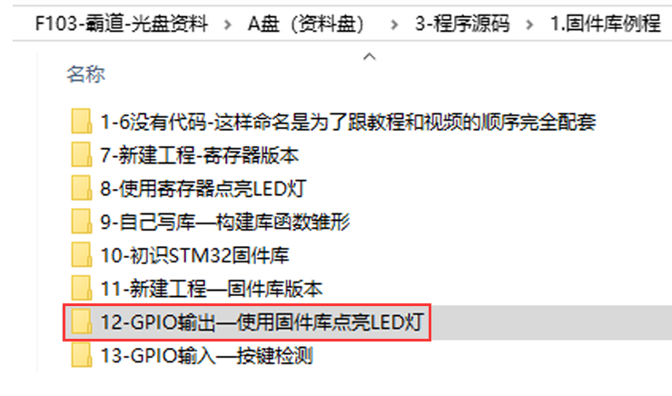

下载FreeRTOS V9.0.0源码
~~~~~~~~~~~~~~~~~~~~~~~~~~~~~~~~~~~

在移植之前，我们首先要获取到FreeRTOS的官方的源码包。这里我们提供两个下载链接，一个是官网：\ http://www.freertos.org/\ ，另外一个是代码托管网站：\ https://sourceforge.net/projects/freertos/files/FreeRTOS/\
。这里我们演示如何在代码托管网站里面下载。打开网站链接之后，我们选择FreeRTOS的最新版本V9.0.0（2016年），尽管现在FreeRTOS的版本已经更新到V10.0.1了，但是我们还是选择V9.0.0，因为内核很稳定，并且网上资料很多，因为V10.0.0版本之后是亚马逊收购了FreeRTOS
之后才出来的版本，主要添加了一些云端组件，我们本书所讲的FreeRTOS是实时内核，采用V9.0.0版本足以。

我们打开FreeRTOS的代码托管网站，就可以看到FreeRTOS的源码及其版本信息了，具体见图 FreeRTOS_V9.0.0版本源码_。

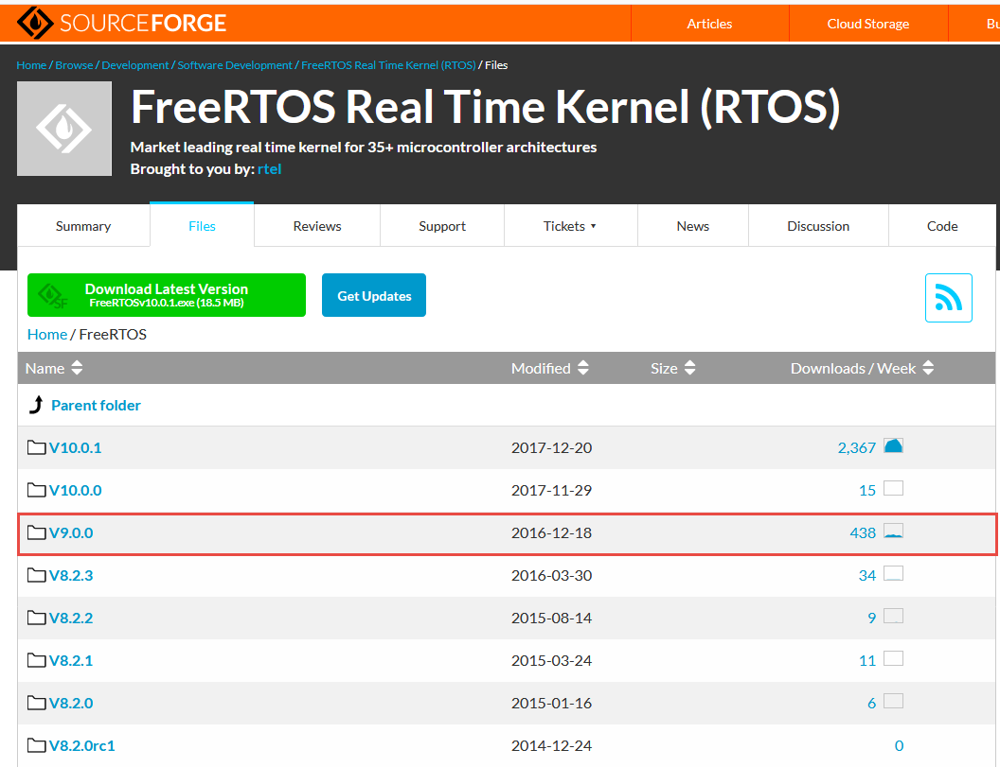

点击V9.0.0会跳转到版本目录，具体见图 FreeRTOS源码包下载链接_。这里有zip和exe格式的压缩包，其实都是FreeRTOS的源码，只是压缩的格式不一样，所以大小也不一样，我们这里选择zip的下载，点击了就会出现下载的链接，下载完成解压后就可以得到我们想要的FreeRTOS
V9.0.0版本的源码了，具体见图 FreeRTOSv9.0.0源码_。

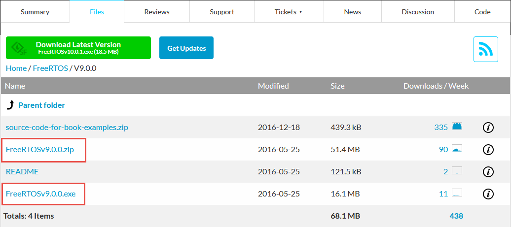

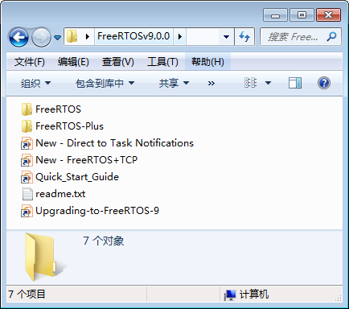

FreeRTOS文件夹内容简介
~~~~~~~~~~~~~~~~~~~~~~~~~~~~~~~

FreeRTOS文件夹
^^^^^^^^^^^^^^^^^^^^^^

FreeRTOS包含Demo例程和内核源码（比较重要，我们就需要提取该目录下的大部分文件），具体见图 FreeRTOS文件夹内容_。FreeRTOS文件夹下的 Source文件夹里面包含的是FreeRTOS内核的源代码，我们移植FreeRTOS的时候就需要这部分源代码；FreeRTOS文件夹下的Demo文件夹里面包含了F
reeRTOS官方为各个单片机移植好的工程代码，FreeRTOS为了推广自己，会给各种半导体厂商的评估板写好完整的工程程序，这些程序就放在Demo这个目录下，这部分Demo非常有参考价值。我们把FreeRTOS到I.MX
RT的时候，FreeRTOSConfig.h这个头文件就是从这里拷贝过来的，下面我们对FreeRTOS的文件夹进行分析说明。

.. image:: media/Transplant_FreeRTOS/Transp006.png
   :align: center
   :name: FreeRTOS文件夹内容
   :alt: FreeRTOS文件夹内容

Source文件夹
''''''''''''''''''

这里我们再重点分析下FreeRTOS/ Source文件夹下的文件，具体见图 Source文件夹内容_。编号\ **①**\ 和\ **③**\ 包含的是FreeRTOS的通用的头文件和C文件，这两部分的文件试用于各种编译器和处理器，是通用的。需要移植的头文件和C文件放在编号\ **②**\
portblle这个文件夹。

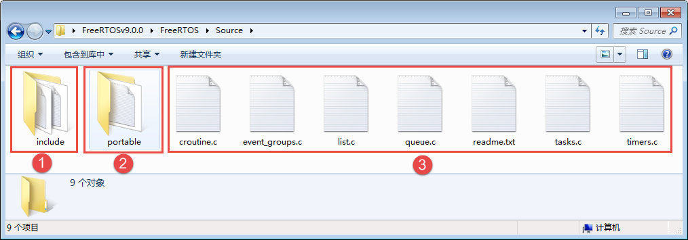

我们打开portblle这个文件夹，可以看到里面很多与编译器相关的文件夹，在不同的编译器中使用不同的支持文件。编号\ **①**\ 中的KEIL就是我们就是我们使用的编译器，
当年打开KEIL文件夹的时候，你会看到一句话“See-also-the-RVDS-directory.txt”，其实KEIL里面的内容跟RVDS里面的内容一样，所以我们只需要编号\ **③**\ RVDS文件夹里面的内容即可。
而编号\ **②**\ MemMang文件夹下存放的是跟内存管理相关的，稍后具体介绍，portblle文件夹内容具体见图 portblle文件夹内容_。

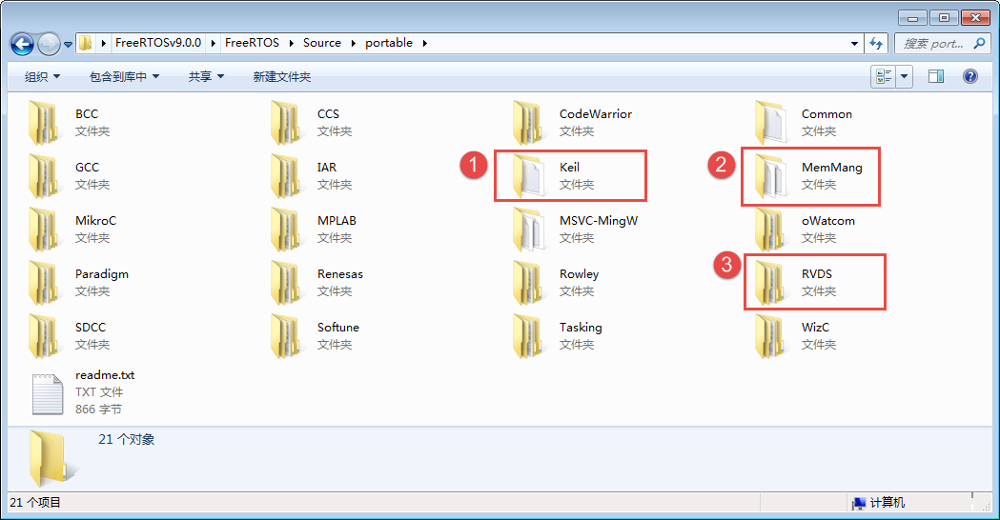

打开RVDS文件夹，下面包含了各种处理器相关的文件夹，从文件夹的名字我们就非常熟悉了，我们学习的I.MX RT有RT1020/RT1050/RT1060等各种系列，FreeRTOS是一个软件，单片机是一个硬件，FreeRTOS要想运行在一个单片机上面，它们就必须关联在一起，那么怎么关联？还是得通过写
代码来关联，这部分关联的文件叫接口文件，通常由汇编和C联合编写。这些接口文件都是跟硬件密切相关的，不同的硬件接口文件是不一样的，但都大同小异。编写这些接口文件的过程我们就叫移植，移植的过程通常由FreeRTOS和mcu原厂的人来负责，移植好的这些接口文件就放在RVDS这个文件夹的目录下，
具体见图 RVDS文件夹内容_。

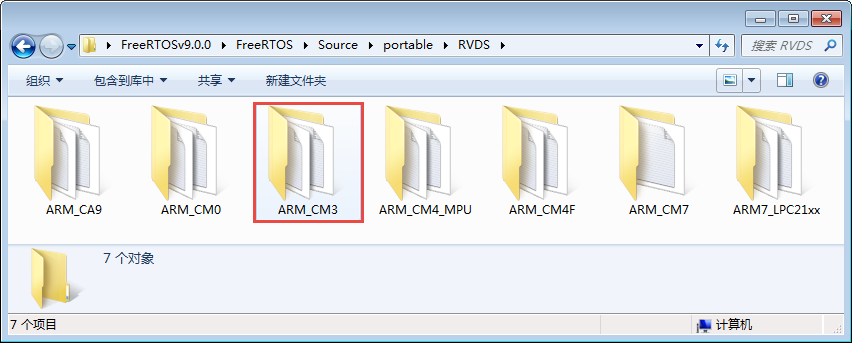

FreeRTOS为我们提供了cortex-m0、m3、m4和m7等内核的单片机的接口文件，只要是使用了这些内核的mcu都可以使用里面的接口文件。通常网络上出现的叫“移植某某某RTOS到某某某MCU”的教程，其实准确来说，不能够叫移植，应该叫使用官方的移植，因为这些跟硬件相关的接口文件，RTOS官方都
已经写好了，我们只是使用而已。我们本章讲的移植也是使用FreeRTOS官方的移植，关于这些底层的移植文件我们已经在第一部分“从0到1教你写FreeRTOS内核”有非常详细的讲解，这里我们直接使用即可。我们这里以ARM_CM3这个文件夹为例，看看里面的文件，里面只有“port.c”与“portmacr
o.h”两个文件，port.c文件里面的内容是由FreeRTOS官方的技术人员为Cortex-M3内核的处理器写的接口文件，里面核心的上下文切换代码是由汇编语言编写而成，对技术员的要求比较高，我们刚开始学习的之后只需拷贝过来用即可，深入的学习可以放在后面的日子；portmacro.h则是port.c
文件对应的头文件，主要是一些数据类型和宏定义，具体见图  ARM_CM3文件夹内容_。

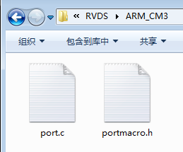

编号\ **②**\ MemMang文件夹下存放的是跟内存管理相关的，总共有五个heap文件以及一个readme说明文件，这五个heap文件在移植的时候必须使用一个，因为FreeRTOS在创建内核对象的时候使用的是动态分配内存，而这些动态内存分配的函数则在这几个文件里面实现，不同的分配算法会导致不同
的效率与结果，后面在内存管理中我们会讲解每个文件的区别，由于现在是初学，所以我们选用heap4.c即可，具体见图 MemMang文件夹内容_。

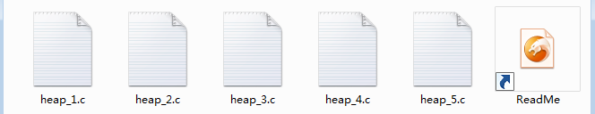

至此，FreeRTOS/source文件夹下的主要内容就讲完，剩下的可根据兴趣自行查阅。

Demo文件夹
''''''''''''''

这个目录下内容就是Deme例程，我们可以直接打开里面的工程文件，各种开发平台的完整Demo，开发者可以方便的以此搭建出自己的项目，甚至直接使用。FreeRTOS当然也为ST写了很多Demo，其中就有F1、F4、F7等工程，这样子对我们学习FreeRTOS是非常方便的，当遇到不懂的直接就可以参考官方的
Demo，具体见图  Demo文件夹内容_。

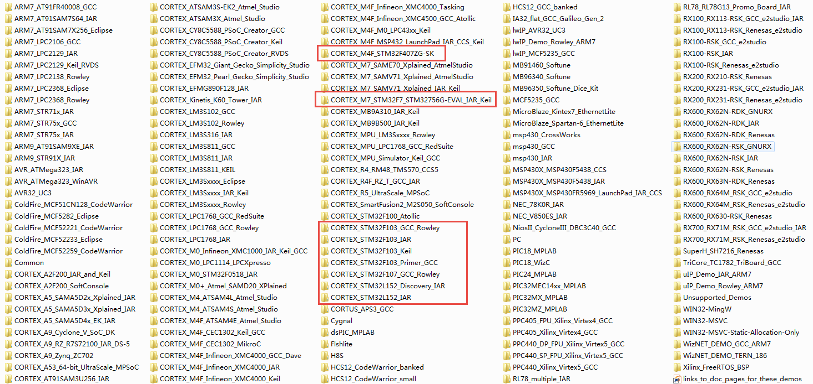

License文件夹
'''''''''''''''''

这里面只有一个许可文件“license.txt”，用FreeRTOS做产品的话就需要看看这个文件，但是我们是学习FreeRTOS，所以暂时不需要理会这个文件。

FreeRTOS-Plus文件夹
^^^^^^^^^^^^^^^^^^^^^^^^^^^^^^^^

FreeRTOS-Plus文件夹里面包含的是第三方的产品，一般我们不需要使用，FreeRTOS-Plus的预配置演示项目组件（组件大多数都要收费），大多数演示项目都是在Windows环境中运行的，使用FreeRTOS windows模拟器，所以暂时不需要关注这个文件夹。

HTML文件
^^^^^^^^^^^^

一些直接可以打开的网页文件，里面包含一些关于FreeRTOS的介绍，是FreeRTOS官方人员所写，所以都是英文的，有兴趣可以打开看看，具体相关内容可以看HTML文件名称。

往裸机工程添加FreeRTOS源码
~~~~~~~~~~~~~~~~~~~~~~~~~~~~~~~~~~

提取FreeRTOS最简源码
^^^^^^^^^^^^^^^^^^^^^^^^^^^^

在前一章节中，我们看到了FreeRTOS源码中那么多文件，一开始学我们根本看不过来那么多文件，我们需要提取源码中的最简洁的部分代码，方便同学们学习，更何况我们学习的只是FreeRTOS的实时内核中的知识，因为这才是FreeRTOS的核心，那些demo都是基于此移植而来的，我们不需要学习，下面提取源码
的操作过程。

1. 首先在我们的I.MX RT裸机工程模板根目录下新建一个文件夹，命名为“FreeRTOS”，并且在FreeRTOS文件夹下新建三个空文件夹，分别命名为“src”、“port”和“include”，src文件夹用于保存FreeRTOS中的核心源文件，也就是我们常说的‘.c文件’，include文件夹用于
   保存‘.c文件’的相关‘.h文件’，port文件夹用于保存内存管理以及处理器架构相关代码，这些代码FreeRTOS官方已经提供给我们的，直接使用即可，在前面已经说了，FreeRTOS是软件，我们的开发版是硬件，软硬件必须有桥梁来连接，这些与处理器架构相关的代码，可以称之为RTOS硬件接口层，它们位于
   FreeRTOS/Source/Portable文件夹下。

2. 打开FreeRTOS V9.0.0源码，在“FreeRTOSv9.0.0\FreeRTOS\Source”目录下找到所有的‘.c文件’，将它们拷贝到我们新建的src文件夹中，具体见图 提取FreeRTOS源码文件_。

..

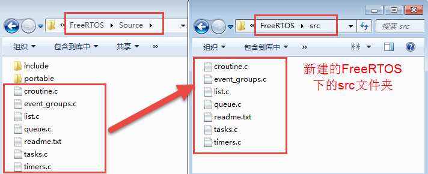

3. 打开FreeRTOS V9.0.0源码，在“FreeRTOSv9.0.0\FreeRTOS\Source\portable”目录下找到“MemMang”文件夹与“RVDS”文件夹，将它们拷贝到我们新建的port文件夹中，具体见
 提取MemMang与RVDS源码文件_。

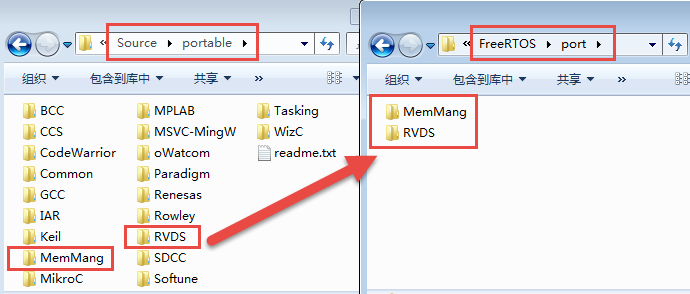

图‑13提取MemMang与RVDS源码文件

4. 打开FreeRTOS V9.0.0源码，在“FreeRTOSv9.0.0\\ FreeRTOS\Source”目录下找到“include”文件夹，它是我们需要用到FreeRTOS的一些头文件，将它直接拷贝到我们新建的FreeRTOS文件夹中，完成这一步之后就可以看到我们新建的FreeRTOS文件夹已
   经有3个文件夹，这3个文件夹就包含FreeRTOS的核心文件，至此，FreeRTOS的源码就提取完成，具体见图  提取FreeRTOS核心文件完成状态_。

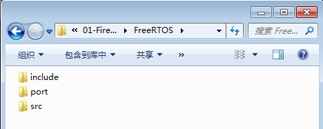

拷贝FreeRTOS到裸机工程根目录
^^^^^^^^^^^^^^^^^^^^^^^^^^^^^^^^^^^^

鉴于FreeRTOS容量很小，我们直接将刚刚提取的整个FreeRTOS文件夹拷贝到我们的I.MX RT裸机工程里面，让整个FreeRTOS跟随我们的工程一起发布，使用这种方法打包的FreeRTOS
工程，即使是将工程拷贝到一台没有安装FreeRTOS支持包（MDK中有FreeRTOS的支持包）的电脑上面都是可以直接使用的，因为工程已经包含了FreeRTOS的源码。具体见图 拷贝FreeRTOS_Package到裸机工程_。

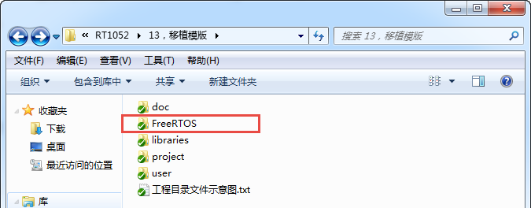

中FreeRTOS文件夹下就是我们提取的FreeRTOS的核心代码，该文件夹下的具体内容作用在前面就已经描述的很清楚了，这里就不再重复赘述。

拷贝FreeRTOSConfig.h文件到user文件夹
^^^^^^^^^^^^^^^^^^^^^^^^^^^^^^^^^^^^^^^^^^^^^^^^^^^^^^^^

FreeRTOSConfig.h文件是FreeRTOS的工程配置文件，因为FreeRTOS是可以裁剪的实时操作内核，应用于不同的处理器平台，用户可以通过修改这个FreeRTOS内核的配置头文件来裁剪FreeRTOS的功能，所以我们把它拷贝一份放在user这个文件夹下面。

打开FreeRTOSv9.0.0源码，在“FreeRTOSv9.0.0\FreeRTOS\Demo”文件夹下面找M7内核的文件夹来代替I.MX RT1052，例如“CORTEX_M7_STM32F7_STM32756G-EVAL_IAR_Keil”这个文件夹，双击打开，在其根目录下找到这个“Free
RTOSConfig.h”文件，然后拷贝到我们工程的user文件夹下即可，等下我们需要对这个文件进行修改。user文件夹，见名知义我们就可以知道里面存放的文件都是用户自己编写的。

添加FreeRTOS源码到工程组文件夹
^^^^^^^^^^^^^^^^^^^^^^^^^^^^^^^^^^^^^^

在上一步我们只是将FreeRTOS的源码放到了本地工程目录下，还没有添加到开发环境里面的组文件夹里面，FreeRTOS也就没有移植到我们的工程中去。

新建FreeRTOS/src和FreeRTOS/port组
''''''''''''''''''''''''''''''''''''''''''''''''''''''''''

接下来我们在开发环境里面新建FreeRTOS/src和FreeRTOS/port两个组文件夹，其中FreeRTOS/src用于存放src文件夹的内容，FreeRTOS/port用于存放port\MemMang文件夹与port\RVDS\ARM_CM？文件夹的内容，“？”表示3、4或者7，具体选择哪个
得看你使用的是野火哪个型号的开发板，具体见 型号表格_。

.. image:: media/Transplant_FreeRTOS/Transp021.png
   :align: center
   :name: 型号表格
   :alt: 型号表格

然后我们将工程文件中FreeRTOS的内容添加到工程中去，按照已经新建的分组添加我们的FreeRTOS工程源码。

在FreeRTOS/port分组中添加MemMang文件夹中的文件只需选择其中一个即可，我们选择“heap_4.c”，这是FreeRTOS的一个内存管理源码文件。同时，需要根据自己的开发板型号在FreeRTOS\port\RVDS\ARM_CM?中选择，“？”表示3、4或者7，具体选择哪个得看你使用
的是野火哪个型号的开发板，具体见 型号表格_。

然后在user分组中添加我们FreeRTOS的配置文件“FreeRTOSConfig.h”，因为这是头文件（.h），所以需要在添加时选择文件类型为“All files (*.*)”，至此我们的FreeRTOS添加到工程中就已经完成，完成的效果具体见图 添加FreeRTOS源码到工程分组中_。

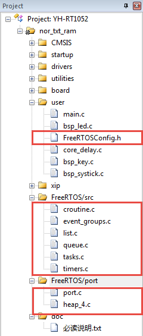

指定FreeRTOS头文件的路径
''''''''''''''''''''''''''''''''

FreeRTOS的源码已经添加到开发环境的组文件夹下面，编译的时候需要为这些源文件指定头文件的路径，不然编译会报错。FreeRTOS的源码里面只有FreeRTOS\include和FreeRTOS\port\RVDS\ARM_CM？这两个文件夹下面有头文件，只需要将这两个头文件的路径在开发环境里面指
定即可。同时我们还将FreeRTOSConfig.h这个头文件拷贝到了工程根目录下的user文件夹下，所以user的路径也要加到开发环境里面。FreeRTOS头文件的路径添加完成后的效果具体见图 在开发环境中指定FreeRTOS的头文件的路径_。

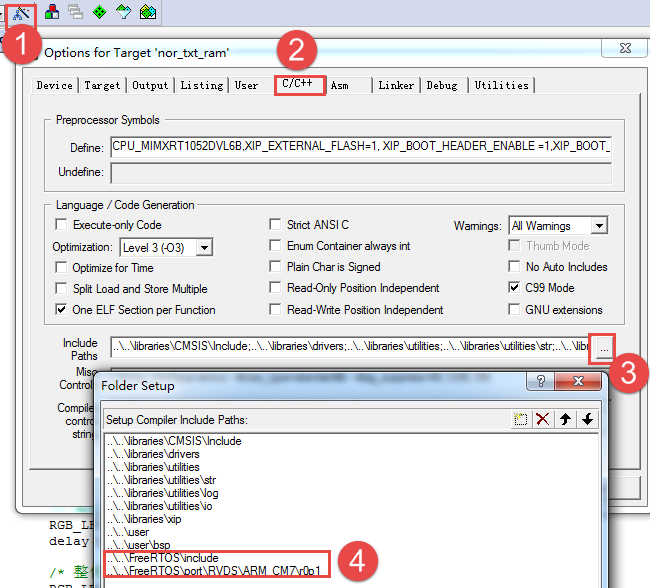

至此，FreeRTOS的整体工程基本移植完毕，我们需要修改FreeRTOS配置文件，按照我们的需求来进行修改。

修改FreeRTOSConfig.h
~~~~~~~~~~~~~~~~~~~~~~~~~~

FreeRTOSConfig.h是直接从demo文件夹下面拷贝过来的，该头文件对裁剪整个FreeRTOS所需的功能的宏均做了定义，有些宏定义被使能，有些宏定义被失能，一开始我们只需要配置最简单的功能即可。要想随心所欲的配置FreeRTOS的功能，我们必须对这些宏定义的功能有所掌握，下面我们先简单的介
绍下这些宏定义的含义，然后再对这些宏定义进行修改。

注意：此FreeRTOSConfig.h文件内容与我们从demo移植过来的FreeRTOSConfig.h文件不一样，因为这是我们野火修改过的FreeRTOSConfig.h文件，并不会影响FreeRTOS的功能，我们只是添加了一些中文注释，并且把相关的头文件进行分类，方便查找宏定义已经阅读，仅此而
已。强烈建议使用我们修加工过的FreeRTOSConfig.h文件。

FreeRTOSConfig.h文件内容讲解
^^^^^^^^^^^^^^^^^^^^^^^^^^^^^^^^^^^^

.. code-block:: c
    :caption: 代码清单:移植-1FreeRTOSConfig.h文件内容
    :name: 代码清单13_1
    :linenos:
    
    #ifndef FREERTOS_CONFIG_H
    #define FREERTOS_CONFIG_H
    //针对不同的编译器调用不同的 stdint.h 文件
    #if defined(__ICCARM__) || defined(__CC_ARM) || defined(__GNUC__) (
    #include <stdint.h>
    #include "fsl_debug_console.h"
    extern uint32_t SystemCoreClock;
    #endif
    //断言
    #define vAssertCalled(char,int) PRINTF("Error:%s,%d\r\n",char,int)
    #define configASSERT(x) if((x)==0) vAssertCalled(__FILE__,__LINE__)
    /*******************************************************************
    * FreeRTOS 基础配置配置选项
    *******************************************************************
    /* 置 1： RTOS 使用抢占式调度器；置 0： RTOS 使用协作式调度器（时间片）
    *
    * 注：在多任务管理机制上，操作系统可以分为抢占式和协作式两种。
    * 协作式操作系统是任务主动释放 CPU 后，切换到下一个任务。
    * 任务切换的时机完全取决于正在运行的任务。
    */
    #define configUSE_PREEMPTION 1 (3)
    //1 使能时间片调度(默认式使能的)
    #define configUSE_TIME_SLICING 1 (4)
    /* 某些运行 FreeRTOS 的硬件有两种方法选择下一个要执行的任务：
    * 通用方法和特定于硬件的方法（以下简称“特殊方法”）。
    *
    * 通用方法：
    * 1.configUSE_PORT_OPTIMISED_TASK_SELECTION 为 0 或者硬件不支持这种特殊方法
    * 2.可以用于所有 FreeRTOS 支持的硬件
    * 3.完全用 C 实现，效率略低于特殊方法。
    * 4.不强制要求限制最大可用优先级数目
    * 特殊方法：
    * 1.必须将 configUSE_PORT_OPTIMISED_TASK_SELECTION 设置为 1。
    * 2.依赖一个或多个特定架构的汇编指令（一般是类似计算前导零[CLZ]
    指令）。
    * 3.比通用方法更高效
    * 4.一般强制限定最大可用优先级数目为 32
    *
    一般是硬件计算前导零指令，如果所使用的， MCU 没有这些硬件指令的话此宏
    该设置为 0！
    */
    #define configUSE_PORT_OPTIMISED_TASK_SELECTION 1 (5)
    /* 置 1：使能低功耗 tickless 模式；置 0：保持系统节拍（tick）中断一直运行
    * 假设开启低功耗的话可能会导致下载出现问题，因为程序在睡眠中,
    可用以下办法解决
    *
    * 下载方法：
    * 1.将开发版正常连接好
    * 2.按住复位按键，点击下载瞬间松开复位按键
    *
    * 1.通过跳线帽将 BOOT 0 接高电平(3.3V)
    * 2.重新上电，下载
    *
    * 1.使用 FlyMcu 擦除一下芯片，然后进行下载
    * STMISP -> 清除芯片(z)
    */
    #define configUSE_TICKLESS_IDLE 0 (6)
    /*
    * 写入实际的 CPU 内核时钟频率，也就是 CPU 指令执行频率，通常称为 Fclk
    * Fclk 为供给 CPU 内核的时钟信号，我们所说的 cpu 主频为 XX MHz，
    * 就是指的这个时钟信号，相应的， 1/Fclk 即为 cpu 时钟周期；
    */
    #define configCPU_CLOCK_HZ (SystemCoreClock) (7)
    //RTOS 系统节拍中断的频率。即一秒中断的次数，每次中断 RTOS 都会进行任务调
    #define configTICK_RATE_HZ (( TickType_t )1000) (8)
    //可使用的最大优先级
    #define configMAX_PRIORITIES (32) (9)
    //空闲任务使用的堆栈大小
    #define configMINIMAL_STACK_SIZE ((unsigned short)128) (10)
    //任务名字字符串长度
    #define configMAX_TASK_NAME_LEN (16) (11)
    //系统节拍计数器变量数据类型， 1 表示为 16 位无符号整形， 0 表示为 32 位无符号
    整形
    #define configUSE_16_BIT_TICKS 0 (12)
    //空闲任务放弃 CPU 使用权给其他同优先级的用户任务
    #define configIDLE_SHOULD_YIELD 1 (13)
    //启用队列
    #define configUSE_QUEUE_SETS 0 (14)
    //开启任务通知功能，默认开启
    #define configUSE_TASK_NOTIFICATIONS 1 (15)
    //使用互斥信号量
    #define configUSE_MUTEXES 0 (16)
    //使用递归互斥信号量
    #define configUSE_RECURSIVE_MUTEXES 0 (17)
    //为 1 时使用计数信号量
    #define configUSE_COUNTING_SEMAPHORES 0 (18)
    /* 设置可以注册的信号量和消息队列个数 */
    #define configQUEUE_REGISTRY_SIZE 10 (19)
    #define configUSE_APPLICATION_TASK_TAG 0
    /*****************************************************************
    FreeRTOS 与内存申请有关配置选项
    *****************************************************************/
    //支持动态内存申请
    #define configSUPPORT_DYNAMIC_ALLOCATION 1 (20)
    //支持静态内存
    #define configSUPPORT_STATIC_ALLOCATION 0
    //系统所有总的堆大小
    #define configTOTAL_HEAP_SIZE ((size_t)(36*1024)) (21)
    /***************************************************************
    FreeRTOS 与钩子函数有关的配置选项
    **************************************************************/
    /* 置 1：使用空闲钩子（Idle Hook 类似于回调函数）；置 0：忽略空闲钩子
    *
    * 空闲任务钩子是一个函数，这个函数由用户来实现，
    * FreeRTOS 规定了函数的名字和参数： void vApplicationIdleHook(void )，
    * 这个函数在每个空闲任务周期都会被调用
    * 对于已经删除的 RTOS 任务，空闲任务可以释放分配给它们的堆栈内存。
    * 因此必须保证空闲任务可以被 CPU 执行
    * 使用空闲钩子函数设置 CPU 进入省电模式是很常见的
    * 不可以调用会引起空闲任务阻塞的 API 函数
    */
    #define configUSE_IDLE_HOOK 0 (22)
    /* 置 1：使用时间片钩子（Tick Hook）；置 0：忽略时间片钩子
    *
    *
    * 时间片钩子是一个函数，这个函数由用户来实现，
    * FreeRTOS 规定了函数的名字和参数： void vApplicationTickHook(void )
    * 时间片中断可以周期性的调用
    * 函数必须非常短小，不能大量使用堆栈，
    * 不能调用以”FromISR" 或 "FROM_ISR”结尾的 API 函数
    */
    /*xTaskIncrementTick 函数是在 xPortSysTickHandler 中断函数中被调用的。因
    licatiovAppnTickHook()函数执行的时间必须很短才行*/
    #define configUSE_TICK_HOOK 0 (23)
    //使用内存申请失败钩子函数
    #define configUSE_MALLOC_FAILED_HOOK 0 (24)
    /*
    * 大于 0 时启用堆栈溢出检测功能，如果使用此功能
    * 用户必须提供一个栈溢出钩子函数，如果使用的话
    * 此值可以为 1 或者 2，因为有两种栈溢出检测方法 */
    #define configCHECK_FOR_STACK_OVERFLOW 0 (25)
    /********************************************************************
    FreeRTOS 与运行时间和任务状态收集有关的配置选项
    *********************************************************************
    //启用运行时间统计功能
    #define configGENERATE_RUN_TIME_STATS 0 (26)
    //启用可视化跟踪调试
    #define configUSE_TRACE_FACILITY 0 (27)
    /* 与宏 configUSE_TRACE_FACILITY 同时为 1 时会编译下面 3 个函数
    * prvWriteNameToBuffer()
    * vTaskList(),
    * vTaskGetRunTimeStats()
    */
    #define configUSE_STATS_FORMATTING_FUNCTIONS 1
    /********************************************************************
    FreeRTOS 与协程有关的配置选项
    *********************************************************************/
    //启用协程，启用协程以后必须添加文件 croutine.c
    #define configUSE_CO_ROUTINES 0 (28)
    //协程的有效优先级数目
    #define configMAX_CO_ROUTINE_PRIORITIES ( 2 ) (29)
    /***********************************************************************
    FreeRTOS 与软件定时器有关的配置选项
    **********************************************************************/
    //启用软件定时器
    #define configUSE_TIMERS 0 (30)
    //软件定时器优先级
    #define configTIMER_TASK_PRIORITY (configMAX_PRIORITIES-1) (31)
    //软件定时器队列长度
    #define configTIMER_QUEUE_LENGTH 10 (32)
    //软件定时器任务堆栈大小
    #define configTIMER_TASK_STACK_DEPTH (configMINIMAL_STACK_SIZE*2) (33)
    /************************************************************
    FreeRTOS 可选函数配置选项
    ************************************************************/
    #define INCLUDE_xTaskGetSchedulerState 1 (34)
    #define INCLUDE_vTaskPrioritySet 1 (35)
    #define INCLUDE_uxTaskPriorityGet 1 (36)
    #define INCLUDE_vTaskDelete 1 (37)
    #define INCLUDE_vTaskCleanUpResources 1
    #define INCLUDE_vTaskSuspend 1
    #define INCLUDE_vTaskDelayUntil 1
    #define INCLUDE_vTaskDelay 1
    #define INCLUDE_eTaskGetState 1
    #define INCLUDE_xTimerPendFunctionCall 0
    //#define INCLUDE_xTaskGetCurrentTaskHandle 1
    //#define INCLUDE_uxTaskGetStackHighWaterMark 0
    //#define INCLUDE_xTaskGetIdleTaskHandle 0
    /******************************************************************
    FreeRTOS 与中断有关的配置选项
    ******************************************************************/
    #ifdef __NVIC_PRIO_BITS
    #define configPRIO_BITS __NVIC_PRIO_BITS (38)
    #else
    #define configPRIO_BITS 4 (39)
    #endif
    //中断最低优先级
    #define configLIBRARY_LOWEST_INTERRUPT_PRIORITY 15 (40)
    //系统可管理的最高中断优先级
    #define configLIBRARY_MAX_SYSCALL_INTERRUPT_PRIORITY 5 (41)
    #define configKERNEL_INTERRUPT_PRIORITY (42)
    configLIBRARY_LOWEST_INTERRUPT_PRIORITY << (8 -
    configPRIO_BITS) ) /* 240 */
    #define configMAX_SYSCALL_INTERRUPT_PRIORITY (43)
    ( configLIBRARY_MAX_SYSCALL_INTERRUPT_PRIORITY << (8 - configPRIO_BITS) )
    /****************************************************************
    FreeRTOS 与中断服务函数有关的配置选项
    ****************************************************************/
    #define xPortPendSVHandler PendSV_Handler
    #define vPortSVCHandler SVC_Handler
    /* 以 下 为 使 用 Percepio Tracealyzer 需 要 的 东 西 ， 不 需 要 时 将
    configUSE_TRACE_FACILITY定义为 0 */
    #if ( configUSE_TRACE_FACILITY == 1 ) (44)
    #include "trcRecorder.h"
    #define INCLUDE_xTaskGetCurrentTaskHandle 1 //
    启用一个可选函数（该函数被 Trace 源码使用，默认该值为 0 表示不用）
    #endif

    #endif /* FREERTOS_CONFIG_H */
   

代码清单13_1_ **(1)**\ ：针对不同的编译器调用不同的stdint.h文件，在MDK中，我们默认的是__CC_ARM。

代码清单13_1_ **(2)**\ ：断言简介：在使用C语言编写工程代码时，我们总会对某种假设条件进行检查，断言就是用于在代码中捕捉这些假设，可以将断言看作是异常处理的一种高级形式。断言表示为一些布尔表达式，程序员相信在程序中的某个特定表达式值为真。可以在任何时候启用和禁用断言验证，因此可以在测试
时启用断言，而在发布时禁用断言。同样，程序投入运行后，最终用户在遇到问题时可以重新启用断言。它可以快速发现并定位软件问题，同时对系统错误进行自动报警。断言可以对在系统中隐藏很深，用其它手段极难发现的问题可以用断言来进行定位，从而缩短软件问题定位时间，提高系统的可测性。实际应用时，可根据具体情况灵活地
设计断言。这里只是使用宏定义实现了断言的功能，断言作用很大，特别是在调试的时候，而FreeRTOS中使用了很多断言接口configASSERT，所以我们需要实现断言，把错误信息打印出来从而在调试中快速定位，打印信息的内容是xxx文件xxx行(__FILE__,__LINE__)。

代码清单13_1_ **(3)**\ ：置1：FreeRTOS使用抢占式调度器；置0：FreeRTOS使用协作式调度器（时间片）。抢占式调度：在这种调度方式中，系统总是选择优先级最高的任务进行调度，并且一旦高优先级的任务准备就绪之后，它就会马上被调度而不等待低优先级的任务主动放弃CPU，高优先级的任务抢占了低优先级任务
的CPU使用权，这就是抢占，在实习操作系统中，这样子的方式往往是最适用的。而协作式调度则是由任务主动放弃CPU，然后才进行任务调度。

注意：在多任务管理机制上，操作系统可以分为抢占式和协作式两种。协作式操作系统是任务主动释放CPU后，切换到下一个任务。任务切换的时机完全取决于正在运行的任务。

代码清单13_1_ **(4)**\ ：使能时间片调度(默认式使能的)。当优先级相同的时候，就会采用时间片调度，这意味着RTOS调度器总是运行处于最高优先级的就绪任务，在每个FreeRTOS系统节拍中断时在相同优先级的多个任务间进行任务切换。如果宏configUSE_TIME_SLICING设置为0，FreeRTOS调
度器仍然总是运行处于最高优先级的就绪任务，但是当RTOS 系统节拍中断发生时，相同优先级的多个任务之间不再进行任务切换，而是在执行完高优先级的任务之后才进行任务切换。一般来说，FreeRTOS默认支持32个优先级，很少情况会把32个优先级全用完，所以，官方建议采用抢占式调度。

代码清单13_1_ **(5)**\ ：FreeRTOS支持两种方法选择下一个要执行的任务：一个是软件方法扫描就绪链表，这种方法我们通常称为通用方法，configUSE_PORT_OPTIMISED_TASK_SELECTION 为 0 或者硬件不支持特殊方法，才使用通用方法获取下一个即将运行的任务
，通用方法可以用于所有FreeRTOS支持的硬件平台，因为这种方法是完全用C语言实现，所以效率略低于特殊方法，但不强制要求限制最大可用优先级数目；另一个是硬件方式查找下一个要运行的任务，必须将configUSE_PORT_OPTIMISED_TASK_SELECTION设置为1，因为是必须依赖一个或
多个特定架构的汇编指令（一般是类似计算前导零[CLZ]指令，在M3、M4、M7内核中都有，这个指令是用来计算一个变量从最高位开始的连续零的个数），所以效率略高于通用方法，但受限于硬件平台，一般强制限定最大可用优先级数目为32，这也是FreeRTOS官方为什么推荐使用32位优先级的原因。

代码清单13_1_ **(6)**\ ：低功耗tickless模式。置1：使能低功耗tickless模式；置0：保持系统节拍（tick）中断一直运行，如果不是用于低功耗场景，我们一般置0即可。

代码清单13_1_ **(7)**\ ：配置CPU内核时钟频率，也就是CPU指令执行频率，通常称为Fclk ， Fclk为供给CPU内核的时钟信号，我们所说的cpu主频为 XX
MHz，就是指的这个时钟信号，相应的，1/Fclk即为CPU时钟周期，在野火RT1052开发板上系统时钟为SystemCoreClock = SYSCLK_FREQ_528MHz，也就是528MHz。

代码清单13_1_ **(8)**\ ：FreeRTOS系统节拍中断的频率。表示操作系统每1秒钟产生多少个tick，tick即是操作系统节拍的时钟周期，时钟节拍就是系统以固定的频率产生中断（时基中断），并在中断中处理与时间相关的事件，推动所有任务向前运行。时钟节拍需要依赖于硬件定时器，在I.MX
RT裸机程序中经常使用的SysTick 时钟是MCU的内核定时器，通常都使用该定时器产生操作系统的时钟节拍。在FreeRTOS中，系统延时和阻塞时间都是以tick为单位，配置configTICK_RATE_HZ的值可以改变中断的频率，从而间接改变了FreeRTOS的时钟周期（T=1/f）。我们设置为
1000，那么FreeRTOS的时钟周期为1ms，过高的系统节拍中断频率也意味着FreeRTOS内核占用更多的CPU时间，因此会降低效率，一般配置为100~1000即可。

代码清单13_1_ **(9)**\ ：可使用的最大优先级，默认为32即可，官方推荐的也是32。每一个任务都必须被分配一个优先级，优先级值从0~ （configMAX_PRIORITIES - 1）之间。低优先级数值表示低优先级任务。空闲任务的优先级为0（tskIDLE_PRIORITY），因此它是
最低优先级任务。FreeRTOS调度器将确保处于就绪态的高优先级任务比同样处于就绪状态的低优先级任务优先获取处理器时间。换句话说，FreeRTOS运行的永远是处于就绪态的高优先级任务。处于就绪状态的相同优先级任务使用时间片调度机制共享处理器时间。

代码清单13_1_ **(10)**\ ：空闲任务默认使用的堆栈大小，默认为128字即可（在M3、M4、M7中为128*4字节），堆栈大小不是以字节为单位而是以字为单位的，比如在32位架构下，栈大小为100表示栈内存占用400字节的空间。

代码清单13_1_ **(11)**\ ：任务名字字符串长度，这个宏用来定义该字符串的最大长度。这里定义的长度包括字符串结束符’\0’。

代码清单13_1_ **(12)**\ ：系统节拍计数器变量数据类型，1表示为16位无符号整形，0表示为32位无符号整形，i.MX RT系列芯片是32位机器，所以默认使用为0即可，这个值位数的大小决定了能计算多少个tick，比如假设系统以1ms产生一个tick中断的频率计时，那么32位无符号整形的值
则可以计算4294967295个tick，也就是系统从0运行到4294967.295秒的时候才溢出，转换为小时的话，则能运行1193个小时左右才溢出，当然，溢出就会重置时间，这点完全不用担心；而假如使用16位无符号整形的值，只能计算65535个tick，在65.535秒之后就会溢出，然后重置。

代码清单13_1_ **(13)**\
：控制任务在空闲优先级中的行为，空闲任务放弃CPU使用权给其他同优先级的用户任务。仅在满足下列条件后，才会起作用，1：启用抢占式调度；2：用户任务优先级与空闲任务优先级相等。一般不建议使用这个功能，能避免尽量避免，1：设置用户任务优先级比空闲任务优先级高，2：这个宏定义配置为0。

代码清单13_1_ **(14)**\ ：启用消息队列，消息队列是FreeRTOS的IPC通信的一种，用于传递消息。

代码清单13_1_ **(15)**\ ：开启任务通知功能，默认开启。每个FreeRTOS任务具有一个32位的通知值，FreeRTOS任务通知是直接向任务发送一个事件，并且接收任务的通知值是可以选择的，任务通过接收到的任务通知值来解除任务的阻塞状态（假如因等待该任务通知而进入阻塞状态）。相对于队列、
二进制信号量、计数信号量或事件组等IPC通信，使用任务通知显然更灵活。官方说明：相比于使用信号量解除任务阻塞，使用任务通知可以快45%（使用GCC编译器，-o2优化级别），并且使用更少的RAM。

FreeRTOS官方说明：Unblocking an RTOS task with a direct notification is 45% faster and uses less RAM than unblocking a task with a binary semaphore.

代码清单13_1_ **(16)**\ ：使用互斥信号量。

代码清单13_1_ **(17)**\ ：使用递归互斥信号量。

代码清单13_1_ **(18)**\ ：使用计数信号量。

代码清单13_1_ **(19)**\ ：设置可以注册的信号量和消息队列个数，用户可以根据自己需要修改即可，RAM小的芯片尽量裁剪得小一些。

代码清单13_1_ **(20)**\ ：支持动态分配申请，一般在系统中采用的内存分配都是动态内存分配。FreeRTOS同时也支持静态分配内存，但是常用的就是动态分配了。

代码清单13_1_ **(21)**\ ： FreeRTOS内核总计可用的有效的RAM大小，不能超过芯片的RAM大小，一般来说用户可用的内存大小会小于configTOTAL_HEAP_SIZE定义的大小，因为系统本身就需要内存。每当创建任务、队列、互斥量、软件定时器或信号量时，FreeRTOS内核会
为这些内核对象分配RAM，这里的RAM都属于configTOTAL_HEAP_SIZE指定的内存区。

代码清单13_1_ **(22)**\ ：配置空闲钩子函数，钩子函数是类似一种回调函数，在任务执行到某个点的时候，跳转到对应的钩子函数执行，这个宏定义表示是否启用空闲任务钩子函数，这个函数由用户来实现，但是FreeRTOS规定了函数的名字和参数：void
vApplicationIdleHook(void)，我们自定义的钩子函数不允许出现阻塞的情况。

代码清单13_1_ **(23)**\ ：配置时间片钩子函数，与空闲任务钩子函数一样。这个宏定义表示是否启用时间片钩子函数，这个函数由用户来实现，但是FreeRTOS规定了函数的名字和参数：void vApplicationTickHook(void)，我们自定义的钩子函数不允许出现阻塞的情况。同时
需要知道的是xTaskIncrementTick函数在xPortSysTickHandler中断函数中被调用的。因此，vApplicationTickHook()函数执行的时间必须很短才行，同时不能调用任何不是以”FromISR" 或 "FROM_ISR”结尾的API函数。

代码清单13_1_ **(24)**\ ：使用内存申请失败钩子函数。

代码清单13_1_ **(25)**\ ：这个宏定义大于0时启用堆栈溢出检测功能，如果使用此功能，用户必须提供一个栈溢出钩子函数，如果使用的话，此值可以为1或者2，因为有两种栈溢出检测方法。使用该功能，可以分析是否有内存越界的情况。

代码清单13_1_ **(26)**\ ：不启用运行时间统计功能。

代码清单13_1_ **(27)**\ ：启用可视化跟踪调试。

代码清单13_1_ **(28)**\ ：启用协程，启用协程以后必须添加文件croutine.c，默认不使用，因为FreeRTOS不对协程做支持了。

代码清单13_1_ **(29)**\ ：协程的有效优先级数目，当configUSE_CO_ROUTINES这个宏定义有效的时候才有效，默认即可。

代码清单13_1_ **(30)**\ ：启用软件定时器。

代码清单13_1_ **(31)**\ ：配置软件定时器任务优先级为最高优先级(configMAX_PRIORITIES-1) 。

代码清单13_1_ **(32)**\ ：软件定时器队列长度，也就是允许配置多少个软件定时器的数量，其实FreeRTOS中理论上能配置无数个软件定时器，因为软件定时器是不基于硬件的。

代码清单13_1_ **(33)**\ ：配置软件定时器任务堆栈大小，默认为(configMINIMAL_STACK_SIZE*2)。

代码清单13_1_ **(34)**\ ：必须将INCLUDE_XTaskGetSchedulerState这个宏定义必须设置为1才能使用xTaskGetSchedulerState()这个API函数接口。

代码清单13_1_ **(35)**\ ：INCLUDE_VTaskPrioritySet这个宏定义必须设置为1才能使vTaskPrioritySet()这个API函数接口。

代码清单13_1_ **(36)**\ ：INCLUDE_uxTaskPriorityGet这个宏定义必须设置为1才能使uxTaskPriorityGet()这个API函数接口。

代码清单13_1_ **(37)**\ ：INCLUDE_vTaskDelete这个宏定义必须设置为1才能使vTaskDelete()这个API函数接口。其他都是可选的宏定义，根据需要自定义即可。

代码清单13_1_ **(38)**\ ：定义__NVIC_PRIO_BITS表示配置FreeRTOS使用多少位作为中断优先级，在i.MX RT系列芯片中使用4位作为中断的优先级。

代码清单13_1_ **(39)**\ ：如果没有定义，那么默认就是4位。

代码清单13_1_ **(40)**\
：配置中断最低优先级是15（一般配置为15）。configLIBRARY_LOWEST_INTERRUPT_PRIORITY是用于配置SysTick与PendSV的。注意了：这里是中断优先级，中断优先级的数值越小，优先级越高。而FreeRTOS的任务优先级是，任务优先级数值越小，任务优先级越低。

代码清单13_1_ **(41)**\ ：配置系统可管理的最高中断优先级为5，configLIBRARY_MAX_SYSCALL_INTERRUPT_PRIORITY是用于配置basepri寄存器的，当basepri设置为某个值的时候，会让系统不响应比该优先级低的中断，而优先级比之更高的中断则不受影
响。就是说当这个宏定义配置为5的时候，中断优先级数值在0、1、2、3、4的这些中断是不受FreeRTOS管理的，不可被屏蔽，也不能调用FreeRTOS中的API函数接口，而中断优先级在5到15的这些中断是受到系统管理，可以被屏蔽的。

代码清单13_1_ **(42)**\ ：对需要配置的SysTick与PendSV进行偏移（因为是高4位才有效），在port.c中会用到configKERNEL_INTERRUPT_PRIORITY这个宏定义来配置SCB_SHPR3（系统处理优先级寄存器，地址为：0xE000
ED20），具体见图 配置SysTick与PendSV_。

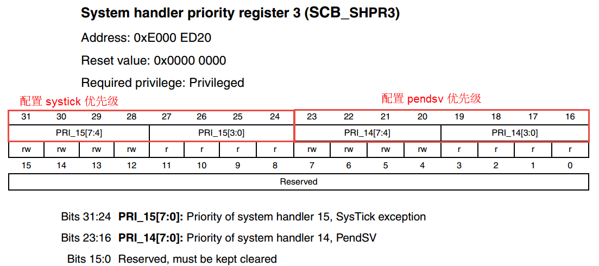

代码清单13‑1\ **(43)**\
：configLIBRARY_MAX_SYSCALL_INTERRUPT_PRIORITY是用于配置basepri寄存器的，让FreeRTOS屏蔽优先级数值大于这个宏定义的中断（数值越大，优先级越低），而basepri的有效位为高4位，所以需要进行偏移，因为i.MX
RT系列芯片只使用了优先级寄存器中的4位，所以要以最高有效位对齐，具体见图 配置basepri寄存器_。

还需要注意的是：中断优先级0（具有最高的逻辑优先级）不能被basepri寄存器屏蔽，因此，configMAX_SYSCALL_INTERRUPT_PRIORITY绝不可以设置成0。

为什么要屏蔽中断?

先了解一下什么是临界段！临界段用一句话概括就是一段在执行的时候不能被中断的代码段。在FreeRTOS里面，这个临界段最常出现的就是对全局变量的操作，全局变量就好像是一个枪把子，谁都可以对他开枪，但是我开枪的时候，你就不能开枪，否则就不知道是谁命中了靶子。

那么什么情况下临界段会被打断？一个是系统调度，还有一个就是外部中断。在FreeRTOS中，系统调度，最终也是产生PendSV中断，在PendSV
Handler里面实现任务的切换，所以还是可以归结为中断。既然这样，FreeRTOS对临界段的保护就很有必要了，在必要的时候将中断屏蔽掉，但是又必须保证某些特别紧急的中断的处理，比如像无人机的碰撞检测。

PRIMASK和FAULTMAST是Cortex-M内核里面三个中断屏蔽寄存器中的两个，还有一个是BASEPRI，有关这三个寄存器的详细用
法见 表:内核中断屏蔽寄存器组描述_。

表:内核中断屏蔽寄存器组描述

.. list-table::
   :widths: 50 50
   :name: 表:内核中断屏蔽寄存器组描述
   :header-rows: 0

   * - 名字
     - 功能描述

   * - PRIMASK
     - 这是个只有单一比特的寄存器。在它被置1后，就关掉所有可屏蔽的异常，只剩下NMI和硬FAULT可以响应。它的缺省值是0，表示没有关中断。

   * - FAULTMASK
     - 这是个只有1 个位的寄存器。当它置1 时，只有NMI才能响应，所有其他的异常，甚至是硬FAULT，也通通闭嘴。它的缺省值也是0，表示没有关异常。

   * - BASEPRI
     - 这个寄存器最多有9位（由表达优先级的位数决定）。它定义了被屏蔽优先级的阈值。当它被设成
       某个值后，所有优先级号大于等于此值的中断都被关（优先级号越大，优先级越低）。但若被设成0，则不关闭任何中断，0也是缺省值。

代码清单13‑1\ **(44)**\ ：configUSE_TRACE_FACILITY这个宏定义是用于FreeRTOS可视化调试软件Tracealyzer需要的东西，我们现在暂时不需要，将 configUSE_TRACE_FACILITY 定义为 0即可。

FreeRTOSConfig.h文件修改
^^^^^^^^^^^^^^^^^^^^^^^^^^^^^^^^^^^^^^^^

FreeRTOSConfig.h头文件的内容修改的不多，具体是：修改与对应开发板的头文件，如果是使用野火STM32F1的开发板，则包含F1的头文件#include
"stm32f10x.h"，同理是使用了其它系列的开发板，则包含与开发板对应的头文件即可，当然还需要包含我们的串口的头文件“bsp_usart.h”，因为在我们FreeRTOSConfig.h中实现了断言操作，需要打印一些信息。其他根据需求修改即可，具体见代码清单 代码清单13_2_ 的加粗部分。

提示：虽然FreeRTOS中默认是打开很多宏定义的，但是用户还是要根据需要选择打开与关闭，因为这样子的系统会更适合用户需要，更严谨与更加节省系统资源。

.. code-block:: c
    :caption: 代码清单:移植-2rtconfig.h文件修改
    :emphasize-lines: 77-78, 219-220
    :name: 代码清单13_2
    :linenos:

    #ifndef FREERTOS_CONFIG_H
    #define FREERTOS_CONFIG_H

    //针对不同的编译器调用不同的stdint.h文件
    #if defined(__ICCARM__) || defined(__CC_ARM) || defined(__GNUC__)
    #include <stdint.h>
    #include "fsl_debug_console.h"
    extern uint32_t SystemCoreClock;
    #endif

    //断言
    #define vAssertCalled(char,int) printf("Error:%s,%d\r\n",char,int)
    #define configASSERT(x) if((x)==0) vAssertCalled(__FILE__,__LINE__)

    /************************************************************************
    *               FreeRTOS基础配置配置选项
    *********************************************************************/
    /* 置1：RTOS使用抢占式调度器；置0：RTOS使用协作式调度器（时间片）
    *
    * 注：在多任务管理机制上，操作系统可以分为抢占式和协作式两种。
    * 协作式操作系统是任务主动释放CPU后，切换到下一个任务。
    * 任务切换的时机完全取决于正在运行的任务。
    */
    #define configUSE_PREEMPTION					1

    //1使能时间片调度(默认式使能的)
    #define configUSE_TIME_SLICING					1

    /* 某些运行FreeRTOS的硬件有两种方法选择下一个要执行的任务：
    * 通用方法和特定于硬件的方法（以下简称“特殊方法”）。
    *
    * 通用方法：
    *      1.configUSE_PORT_OPTIMISED_TASK_SELECTION 为 0 或者硬件不支持这种特殊方法。
    *      2.可以用于所有FreeRTOS支持的硬件
    *      3.完全用C实现，效率略低于特殊方法。
    *      4.不强制要求限制最大可用优先级数目
    * 特殊方法：
    *      1.必须将configUSE_PORT_OPTIMISED_TASK_SELECTION设置为1。
    *      2.依赖一个或多个特定架构的汇编指令（一般是类似计算前导零[CLZ]指令）。
    *      3.比通用方法更高效
     *      4.一般强制限定最大可用优先级数目为32
    * 
    一般是硬件计算前导零指令，如果所使用的，MCU没有这些硬件指令的话此宏应该设置为0！
    */
    #define configUSE_PORT_OPTIMISED_TASK_SELECTION	        1

    /* 置1：使能低功耗tickless模式；置0：保持系统节拍（tick）中断一直运行 */
    #define configUSE_TICKLESS_IDLE			1

    /*
    * 写入实际的CPU内核时钟频率，也就是CPU指令执行频率，通常称为Fclk
    * Fclk为供给CPU内核的时钟信号，我们所说的cpu主频为 XX MHz，
    * 就是指的这个时钟信号，相应的，1/Fclk即为cpu时钟周期；
    */
    #define configCPU_CLOCK_HZ		  (SystemCoreClock)

    //RTOS系统节拍中断的频率。即一秒中断的次数，每次中断RTOS都会进行任务调度
    #define configTICK_RATE_HZ		  (( TickType_t )1000)

    //可使用的最大优先级
    #define configMAX_PRIORITIES					  (32)

    //空闲任务使用的堆栈大小
    #define configMINIMAL_STACK_SIZE	((unsigned short)128)

    //任务名字字符串长度
    #define configMAX_TASK_NAME_LEN		(16)

    //系统节拍计数器变量数据类型，1表示为16位无符号整形，0表示为32位无符号整形
    #define configUSE_16_BIT_TICKS			0

    //空闲任务放弃CPU使用权给其他同优先级的用户任务
    #define configIDLE_SHOULD_YIELD		1

    //启用队列
    #define configUSE_QUEUE_SETS			0

    //开启任务通知功能，默认开启
    #define configUSE_TASK_NOTIFICATIONS    1

    //使用互斥信号量
    #define configUSE_MUTEXES			0

    //使用递归互斥信号量
    #define configUSE_RECURSIVE_MUTEXES		0

    //为1时使用计数信号量
    #define configUSE_COUNTING_SEMAPHORES		0

    /* 设置可以注册的信号量和消息队列个数 */
    #define configQUEUE_REGISTRY_SIZE		10

    #define configUSE_APPLICATION_TASK_TAG		0

    /*****************************************************************
                FreeRTOS与内存申请有关配置选项
    *****************************************************************/
    //支持动态内存申请
    #define configSUPPORT_DYNAMIC_ALLOCATION        1
    //支持静态内存申请
    #define configSUPPORT_STATIC_ALLOCATION         0
    //系统所有总的堆大小
    #define configTOTAL_HEAP_SIZE		((size_t)(36*1024))
    /***************************************************************
                FreeRTOS与钩子函数有关的配置选项
    **************************************************************/
    /* 置1：使用空闲钩子（Idle Hook类似于回调函数）；置0：忽略空闲钩子
    *
    * 空闲任务钩子是一个函数，这个函数由用户来实现，
    * FreeRTOS规定了函数的名字和参数：void vApplicationIdleHook(void )，
    * 这个函数在每个空闲任务周期都会被调用
    * 对于已经删除的RTOS任务，空闲任务可以释放分配给它们的堆栈内存。
    * 因此必须保证空闲任务可以被CPU执行
    * 使用空闲钩子函数设置CPU进入省电模式是很常见的
    * 不可以调用会引起空闲任务阻塞的API函数
    */
    #define configUSE_IDLE_HOOK				0

    /* 置1：使用时间片钩子（Tick Hook）；置0：忽略时间片钩子
    *
    *
    * 时间片钩子是一个函数，这个函数由用户来实现，
    * FreeRTOS规定了函数的名字和参数：void vApplicationTickHook(void )
    * 时间片中断可以周期性的调用
    * 函数必须非常短小，不能大量使用堆栈，
    * 不能调用以”FromISR" 或 "FROM_ISR”结尾的API函数
    */
    /*xTaskIncrementTick函数是在xPortSysTickHandler中断函数中被调用的。因此，
    *	vApplicationTickHook()函数执的时间必须很短才行
    */                                                                      

    #define configUSE_TICK_HOOK			0

    //使用内存申请失败钩子函数
    #define configUSE_MALLOC_FAILED_HOOK		0

    /*
    * 大于0时启用堆栈溢出检测功能，如果使用此功能
    * 用户必须提供一个栈溢出钩子函数，如果使用的话
    * 此值可以为1或者2，因为有两种栈溢出检测方法 */
    #define configCHECK_FOR_STACK_OVERFLOW			0

    /********************************************************************
            FreeRTOS与运行时间和任务状态收集有关的配置选项
    **********************************************************************/
    //启用运行时间统计功能
    #define configGENERATE_RUN_TIME_STATS			 0
    //启用可视化跟踪调试
    #define configUSE_TRACE_FACILITY			0
    /* 与宏configUSE_TRACE_FACILITY同时为1时会编译下面3个函数
    * prvWriteNameToBuffer()
    * vTaskList(),
    * vTaskGetRunTimeStats()
    */
    #define configUSE_STATS_FORMATTING_FUNCTIONS		1

    /********************************************************************
                    FreeRTOS与协程有关的配置选项
    *********************************************************************/
     //启用协程，启用协程以后必须添加文件croutine.c
    #define configUSE_CO_ROUTINES 		0
    //协程的有效优先级数目
    #define configMAX_CO_ROUTINE_PRIORITIES       ( 2 )
    
    
    /***********************************************************************
                                    FreeRTOS与软件定时器有关的配置选项
    **********************************************************************/
    //启用软件定时器
    #define configUSE_TIMERS				1
    //软件定时器优先级
    #define configTIMER_TASK_PRIORITY	 (configMAX_PRIORITIES-1)
    //软件定时器队列长度
    #define configTIMER_QUEUE_LENGTH		10
    //软件定时器任务堆栈大小
    #define configTIMER_TASK_STACK_DEPTH	      (configMINIMAL_STACK_SIZE*2)
    
    /************************************************************
                FreeRTOS可选函数配置选项
    ************************************************************/
    #define INCLUDE_xTaskGetSchedulerState       	1
    #define INCLUDE_vTaskPrioritySet		1
    #define INCLUDE_uxTaskPriorityGet		1
    #define INCLUDE_vTaskDelete			1
    #define INCLUDE_vTaskCleanUpResources	1
    #define INCLUDE_vTaskSuspend			1
    #define INCLUDE_vTaskDelayUntil		1
    #define INCLUDE_vTaskDelay			1
    #define INCLUDE_eTaskGetState			1
    #define INCLUDE_xTimerPendFunctionCall		0
    //#define INCLUDE_xTaskGetCurrentTaskHandle       1
    //#define INCLUDE_uxTaskGetStackHighWaterMark     0
    //#define INCLUDE_xTaskGetIdleTaskHandle          0
    /******************************************************************
                FreeRTOS与中断有关的配置选项                                     
    ******************************************************************/
    #ifdef __NVIC_PRIO_BITS
        #define configPRIO_BITS       		__NVIC_PRIO_BITS
    #else
        #define configPRIO_BITS       		4                  
    #endif
    //ÖжÏ×îµÍÓÅÏȼ¶
    #define configLIBRARY_LOWEST_INTERRUPT_PRIORITY	
        15     

    #define configLIBRARY_MAX_SYSCALL_INTERRUPT_PRIORITY	5 
    
    #define configKERNEL_INTERRUPT_PRIORITY 	
        ( configLIBRARY_LOWEST_INTERRUPT_PRIORITY << (8 - configPRIO_BITS) ) 
    240 */
    
    #define configMAX_SYSCALL_INTERRUPT_PRIORITY
        ( configLIBRARY_MAX_SYSCALL_INTERRUPT_PRIORITY << (8 – 
    configPRIO_BITS) )

    /****************************************************************
                FreeRTOS与中断服务有关的配置选项                        
    ****************************************************************/
    #define xPortPendSVHandler 	PendSV_Handler
    #define vPortSVCHandler 	SVC_Handler

    /* 以下为使用Percepio Tracealyzer需要的东西
    不需要则设置configUSE_TRACE_FACILITY 为 0 */
    #if ( configUSE_TRACE_FACILITY == 1 )
    #include "trcRecorder.h"
    #define INCLUDE_xTaskGetCurrentTaskHandle               1   // 
    选择一个可选的函数
    #endif

    #endif 

修改bsp_systick.c
~~~~~~~~~~~~~~~

SysTick中断服务函数是一个非常重要的函数，FreeRTOS所有跟时间相关的事情都在里面处理，SysTick就是FreeRTOS的一个心跳时钟，驱动着FreeRTOS的运行，就像人的心跳一样，假如没有心跳，我们就相当于“死了”，同样的，FreeRTOS没有了心跳，那么它就会卡死在某个地方，不能进
行任务调度，不能运行任何的东西，因此我们需要实现一个FreeRTOS的心跳时钟，FreeRTOS帮我们实现了SysTick的启动的配置：在port.c文件中已经实现vPortSetupTimerInterrupt()函数，并且FreeRTOS通用的SysTick中断服务函数也实现了：在port.c文
件中已经实现xPortSysTickHandler()函数，所以移植的时候只需要我们在bsp_systick.c文件中实现对应（I.MX RT）平台上的SysTick_Handler()函数即可。FreeRTOS为开发者考虑得特别多，PendSV_Handler()与SVC_Handler()这两个
很重要的函数都帮我们实现了，在port.c文件中已经实现xPortPendSVHandler()与vPortSVCHandler()函数，防止我们自己实现不了，具体实现见 代码清单13_3_ 加粗部分。

.. code-block:: c
    :caption: 代码清单:移植-3bsp_systick.c文件修改
    :emphasize-lines: 14,17,19
    :name: 代码清单13_3
    :linenos: 

    #include "./systick/bsp_systick.h"
    /* FreeRTOS 头文件 */
    #include "FreeRTOS.h"
    #include "task.h"
    /*===============================中断方式============================
    /**********************中断服务函数******************************/
    extern void xPortSysTickHandler(void);
    /**
    * @brief SysTick 中断服务函数
    * @param 无
    * @retval 无
    * @attention
    */
    void SysTick_Handler(void)
    {
    #if (INCLUDE_xTaskGetSchedulerState == 1 )
    if (xTaskGetSchedulerState() != taskSCHEDULER_NOT_STARTED) {
    #endif /* INCLUDE_xTaskGetSchedulerState */
    xPortSysTickHandler();
    #if (INCLUDE_xTaskGetSchedulerState == 1 )
    }
    #endif /* INCLUDE_xTaskGetSchedulerState */
    }

至此，我们的FreeRTOS基本移植完成，下面是测试的时候了。

修改main.c
~~~~~~~~~~~~

我们将原来裸机工程里面main.c的文件内容全部删除，新增如下内容，具体见 代码清单13_4_ 。

.. code-block:: c
    :caption: 代码清单:移植-4main.c文件修改
    :name: 代码清单13_4
    :linenos: 

    /**
    *********************************************************************
    * @file    main.c
    * @author  fire
    * @version V1.0
    * @date    2018-xx-xx
    * @brief   FreeRTOS 3.0 + I.MX RT工程模版
    *********************************************************************
    * @attention
    *
    * 实验平台:野火I.MX RT开发板
    * 论坛    :http://www.firebbs.cn
    * 淘宝    :https://fire-stm32.taobao.com
    *
    **********************************************************************
    */
    
    /*
    *************************************************************************
    *                             包含的头文件
    *************************************************************************
    */
    #include" FreeRTOS.h"
    #include" task.h"
    
    
    /*
    *************************************************************************
    *                               变量
    *************************************************************************
    */
    
    
    /*
    *************************************************************************
    *                             函数声明
    *************************************************************************
    */
    
    
    
    /*
    *************************************************************************
    *                             main 函数
    *************************************************************************
    */
    /**
    * @brief  主函数
    * @param  无
    * @retval 无
    */
    int main(void)
    {
    /*暂时没有在main任务里面创建任务应用任务 */
    }

    /********************************END OF FILE****************************/

下载验证
~~~~~~~~

将程序编译好，用DAP仿真器把程序下载到野火I.MX RT系列开发板（具体型号根据你买的板子而定，每个型号的板子都配套有对应的程序），一看，啥现象都没有，一脸懵逼，我说，你急个肾，目前我们还没有在main任务里面创建应用任务，但是系统是已经跑起来了，只有默认的空闲任务和main任务。要想看现象，得自
己在main创建里面应用任务，如果创建任务，请看下一章“创建任务”。

