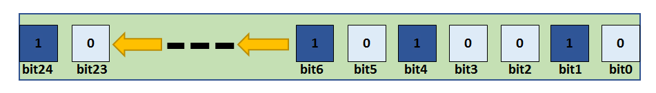
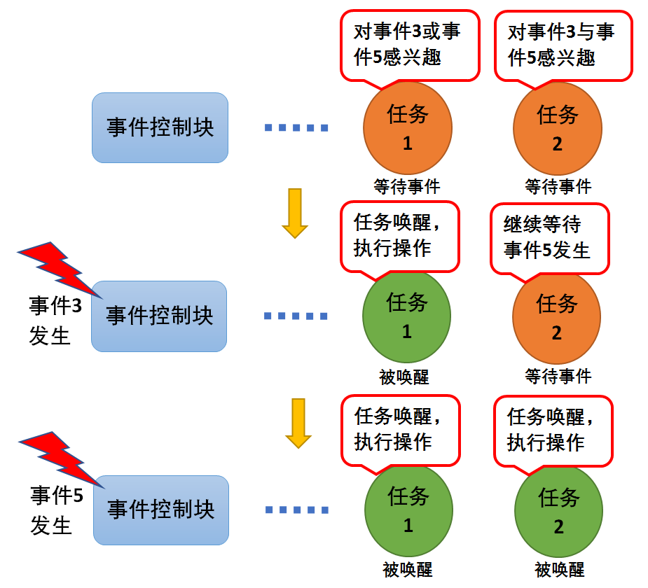
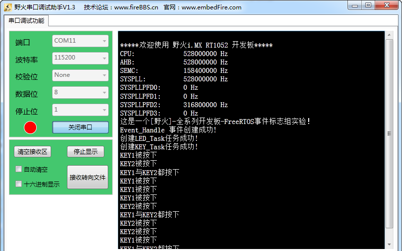

.. vim: syntax=rst

事件
===========

事件的基本概念
~~~~~~~~~~~~~~~~~~~~~

事件是一种实现任务间通信的机制，主要用于实现多任务间的同步，但事件通信只能是事件类型的通信，无数据传输。与信号量不同的是，它可以实现一对多，多对多的同步。即一个任务可以等待多个事件的发生：可以是任意一个事件发生时唤醒任务进行事件处理；也可以是几个事件都发生后才唤醒任务进行事件处理。同样，也可以是多个
任务同步多个事件。

每一个事件组只需要很少的RAM空间来保存事件组的状态。事件组存储在一个EventBits_t类型的变量中，该变量在事件组结构体中定义。如果宏\ `configUSE_16_BIT_TICKS
<http://www.freertos.org/a00110.html#configUSE_16_BIT_TICKS>`__ 定义为1，那么变量uxEventBits就是16位的，其中有8个位用来存储事件组；而如果宏\ `configUSE_16_BIT_TICKS
<http://www.freertos.org/a00110.html#configUSE_16_BIT_TICKS>`__ 定义为0，那么变量uxEventBits就是32位的，其中有24个位用来存储事件组。在I.MX RT中，我们一般将\ `configUSE_16_BIT_TICKS <ht
tp://www.freertos.org/a00110.html#configUSE_16_BIT_TICKS>`__ 定义为0，那么uxEventBits是32位的，有24个位用来实现事件标志组。每一位代表一个事件，任务通过“逻辑与”或“逻辑或”与一个或多个事件建立关联，形成一个事件组。事件的“
逻辑或”也被称作是独立型同步，指的是任务感兴趣的所有事件任一件发生即可被唤醒；事件“逻辑与”则被称为是关联型同步，指的是任务感兴趣的若干事件都发生时才被唤醒，并且事件发生的时间可以不同步。

多任务环境下，任务、中断之间往往需要同步操作，一个事件发生会告知等待中的任务，即形成一个任务与任务、中断与任务间的同步。事件可以提供一对多、多对多的同步操作。一对多同步模型：一个任务等待多个事件的触发，这种情况是比较常见的；多对多同步模型：多个任务等待多个事件的触发。

任务可以通过设置事件位来实现事件的触发和等待操作。FreeRTOS的事件仅用于同步，不提供数据传输功能。

FreeRTOS提供的事件具有如下特点：

-  事件只与任务相关联，事件相互独立，一个32位的事件集合（EventBits_t类型的变量，实际可用与表示事件的只有24位），用于标识该任务发生的事件类型，其中每一位表示一种事件类型（0表示该事件类型未发生、1表示该事件类型已经发生），一共24种事件类型。

-  事件仅用于同步，不提供数据传输功能。

-  事件无排队性，即多次向任务设置同一事件(如果任务还未来得及读走)，等效于只设置一次。

-  允许多个任务对同一事件进行读写操作。

-  支持事件等待超时机制。

在FreeRTOS事件中，每个事件获取的时候，用户可以选择感兴趣的事件，并且选择读取事件信息标记，它有三个属性，分别是逻辑与，逻辑或以及是否清除标记。当任务等待事件同步时，可以通过任务感兴趣的事件位和事件信息标记来判断当前接收的事件是否满足要求，如果满足则说明任务等待到对应的事件，系统将唤醒等待的任
务；否则，任务会根据用户指定的阻塞超时时间继续等待下去。

事件的应用场景
~~~~~~~~~~~~~~~~~~~~~

FreeRTOS的事件用于事件类型的通讯，无数据传输，也就是说，我们可以用事件来做标志位，判断某些事件是否发生了，然后根据结果做处理，那很多人又会问了，为什么我不直接用变量做标志呢，岂不是更好更有效率？非也非也，若是在裸机编程中，用全局变量是最为有效的方法，这点我不否认，但是在操作系统中，使用全局变
量就要考虑以下问题了：

-  如何对全局变量进行保护呢，如何处理多任务同时对它进行访问？

-  如何让内核对事件进行有效管理呢？使用全局变量的话，就需要在任务中轮询查看事件是否发送，这简直就是在浪费CPU资源啊，还有等待超时机制，使用全局变量的话需要用户自己去实现。

所以，在操作系统中，还是使用操作系统给我们提供的通信机制就好了，简单方便还实用。

在某些场合，可能需要多个时间发生了才能进行下一步操作，比如一些危险机器的启动，需要检查各项指标，当指标不达标的时候，无法启动，但是检查各个指标的时候，不能一下子检测完毕啊，所以，需要事件来做统一的等待，当所有的事件都完成了，那么机器才允许启动，这只是事件的其中一个应用。

事件可使用于多种场合，它能够在一定程度上替代信号量，用于任务与任务间，中断与任务间的同步。一个任务或中断服务例程发送一个事件给事件对象，而后等待的任务被唤醒并对相应的事件进行处理。但是它与信号量不同的是，事件的发送操作是不可累计的，而信号量的释放动作是可累计的。事件另外一个特性是，接收任务可等待多种
事件，即多个事件对应一个任务或多个任务。同时按照任务等待的参数，可选择是“逻辑或”触发还是“逻辑与”触发。这个特性也是信号量等所不具备的，信号量只能识别单一同步动作，而不能同时等待多个事件的同步。

各个事件可分别发送或一起发送给事件对象，而任务可以等待多个事件，任务仅对感兴趣的事件进行关注。当有它们感兴趣的事件发生时并且符合感兴趣的条件，任务将被唤醒并进行后续的处理动作。

事件运作机制
~~~~~~~~~~~~~~~~~~

接收事件时，可以根据感兴趣的参事件类型接收事件的单个或者多个事件类型。事件接收成功后，必须使用xClearOnExit选项来清除已接收到的事件类型，否则不会清除已接收到的事件，这样就需要用户显式清除事件位。用户可以自定义通过传入参数xWaitForAllBits选择读取模式，是等待所有感兴趣的事件还
是等待感兴趣的任意一个事件。

设置事件时，对指定事件写入指定的事件类型，设置事件集合的对应事件位为1，可以一次同时写多个事件类型，设置事件成功可能会触发任务调度。

清除事件时，根据入参数事件句柄和待清除的事件类型，对事件对应位进行清0操作。事件不与任务相关联，事件相互独立，一个32位的变量（事件集合，实际用于表示事件的只有24位），用于标识该任务发生的事件类型，其中每一位表示一种事件类型（0表示该事件类型未发生、1表示该事件类型已经发生），一共24种事件类型具
体见 图20_1_。

事件唤醒机制，当任务因为等待某个或者多个事件发生而进入阻塞态，当事件发生的时候会被唤醒，其过程具体见 图20_2。

任务1对事件3或事件5感兴趣（逻辑或），当发生其中的某一个事件都会被唤醒，并且执行相应操作。而任务2对事件3与事件5感兴趣（逻辑与），当且仅当事件3与事件5都发生的时候，任务2才会被唤醒，如果只有一个其中一个事件发生，那么任务还是会继续等待事件发生。如果接在收事件函数中设置了清除事件位xClearO
nExit，那么当任务唤醒后将把事件3和事件5的事件标志清零，否则事件标志将依然存在。

事件控制块
~~~~~~~~~~~~~~~~~~~~

事件标志组存储在一个EventBits_t类型的变量中，该变量在事件组结构体中定义，具体见加粗部分。如果宏\ `configUSE_16_BIT_TICKS
<http://www.freertos.org/a00110.html#configUSE_16_BIT_TICKS>`__ 定义为1，那么变量uxEventBits就是16位的，其中有8个位用来存储事件组，如果宏\ `configUSE_16_BIT_TICKS <http://www.free
rtos.org/a00110.html#configUSE_16_BIT_TICKS>`__ 定义为0，那么变量uxEventBits就是32位的，其中有24个位用来存储事件组，每一位代表一个事件的发生与否，利用逻辑或、逻辑与等实现不同事件的不同唤醒处理。在RT1052中，uxEventBits是3
2位的，所以我们有24个位用来实现事件组。除了事件标志组变量之外，FreeRTOS还使用了一个链表来记录等待事件的任务，所有在等待此事件的任务均会被挂载在等待事件列表xTasksWaitingForBits。

.. code-block:: c
    :caption: 代码清单‑1事件控制块
    :name: 代码清单20_1
    :linenos:

	typedefstruct xEventGroupDefinition {
	EventBits_t uxEventBits;
		List_t xTasksWaitingForBits;

	#if( configUSE_TRACE_FACILITY == 1 )
		UBaseType_t uxEventGroupNumber;
	#endif

	#if( ( configSUPPORT_STATIC_ALLOCATION == 1 ) \
	&& ( configSUPPORT_DYNAMIC_ALLOCATION == 1 ) )
	uint8_t ucStaticallyAllocated;
	#endif
	} EventGroup_t;

事件函数接口讲解
~~~~~~~~~~~~~~~~~~~~~~~~

事件创建函数xEventGroupCreate()
^^^^^^^^^^^^^^^^^^^^^^^^^^^^^^^^^^^^^^^^^^^^^^^^^^

xEventGroupCreate()用于创建一个事件组，并返回对应的句柄。要想使用该函数必须在头文件FreeRTOSConfig.h定义宏\ `configSUPPORT_DYNAMIC_ALLOCATION
<http://www.freertos.org/a00110.html#configSUPPORT_DYNAMIC_ALLOCATION>`__ 为1（在FreeRTOS.h中默认定义为1）且需要把FreeRTOS/source/event_groups.c 这个C文件添加到工程中。

每一个事件组只需要很少的RAM空间来保存事件的发生状态。如果使用函数xEventGroupCreate()来创建一个事件，那么需要的RAM是动态分配的。如果使用函数\ `xEventGroupCreateStatic
<http://www.freertos.org/xEventGroupCreateStatic.html>`__\ ()来创建一个事件，那么需要的RAM是静态分配的。我们暂时不讲解静态创建函数\ `xEventGroupCreateStatic
<http://www.freertos.org/xEventGroupCreateStatic.html>`__\ ()。

事件创建函数，顾名思义，就是创建一个事件，与其他内核对象一样，都是需要先创建才能使用的资源，FreeRTOS给我们提供了一个创建事件的函数xEventGroupCreate()，当创建一个事件时，系统会首先给我们分配事件控制块的内存空间，然后对该事件控制块进行基本的初始化，创建成功返回事件句柄；创建
失败返回NULL。所以，在使用创建函数之前，我们需要先定义有个事件的句柄，事件创建的源码具体见 代码清单20_2_。

.. code-block:: c
    :caption: 代码清单‑2xEventGroupCreate()源码
    :name: 代码清单20_2
    :linenos:

	#if( configSUPPORT_DYNAMIC_ALLOCATION == 1 )
 
	EventGroupHandle_t xEventGroupCreate( void )
	{
		EventGroup_t *pxEventBits;
	
	/* 分配事件控制块的内存 */
		pxEventBits = ( EventGroup_t * ) pvPortMalloc( sizeof( EventGroup_t ) );(1)
	
	if ( pxEventBits != NULL ) {			(2)
			pxEventBits->uxEventBits = 0;
			vListInitialise( &( pxEventBits->xTasksWaitingForBits ) );
	
	#if( configSUPPORT_STATIC_ALLOCATION == 1 )
			{
	/* 
		静态分配内存的，此处暂时不用理会
				*/
				pxEventBits->ucStaticallyAllocated = pdFALSE;
			}
	#endif
	
			traceEVENT_GROUP_CREATE( pxEventBits );
		} else {
			traceEVENT_GROUP_CREATE_FAILED();
		}
	
	return ( EventGroupHandle_t ) pxEventBits;
	}
	
	#endif

代码清单20_2_ **(1)**\ ：因为事件标志组是FreeRTOS的内部资源，也是需要RAM的，所以，在创建的时候，会向系统申请一块内存，大小是事件控制块大小sizeof( EventGroup_t )。

代码清单20_2_ **(2)**\
：如果分配内存成功，那么久对事件控制块的成员变量进行初始化，事件标志组变量清零，因为现在是创建事件，还没有事件发生，所以事件集合中所有位都为0，然后调用vListInitialise()函数将事件控制块中的等待事件列表进行初始化，该列表用于记录等待在此事件上的任务。

事件创建函数的源码都那么简单，其使用更为简单，不过需要我们在使用前定义一个指向事件控制块的指针，也就是常说的事件句柄，当事件创建成功，我们就可以根据我们定义的事件句柄来调用FreeRTOS的其他事件函数进行操作，具体见 代码清单20_3_ 高亮部分。

.. code-block:: c
    :caption: 代码清单‑3事件创建函数xEventGroupCreate()使用实例
    :emphasize-lines: 4
    :name: 代码清单20_3
    :linenos:

	static EventGroupHandle_t Event_Handle =NULL;
 
	/* 创建 Event_Handle */
	Event_Handle = xEventGroupCreate();
	if (NULL != Event_Handle)
		printf("Event_Handle 事件创建成功!\r\n");
	else
	/* 创建失败，应为内存空间不足 */

事件删除函数vEventGroupDelete()
^^^^^^^^^^^^^^^^^^^^^^^^^^^^^^^^^^^^^^^^^^^^^^^^^^

在很多场合，某些事件只用一次的，就好比在事件应用场景说的危险机器的启动，假如各项指标都达到了，并且机器启动成功了，那这个事件之后可能就没用了，那就可以进行销毁了。想要删除事件怎么办？FreeRTOS给我们提供了一个删除事件的函数——vEventGroupDelete()，使用它就能将事件进行删除了。
当系统不再使用事件对象时，可以通过删除事件对象控制块来释放系统资源，具体见 代码清单20_4_。

.. code-block:: c
    :caption: 代码清单‑4vEventGroupDelete()源码
    :name: 代码清单20_4
    :linenos:

	/*-----------------------------------------------------------*/
	void vEventGroupDelete( EventGroupHandle_t xEventGroup )
	{
		EventGroup_t *pxEventBits = ( EventGroup_t * ) xEventGroup;
	const List_t *pxTasksWaitingForBits = &( pxEventBits->xTasksWaitingForBits );
	
		vTaskSuspendAll();					(1)
		{
			traceEVENT_GROUP_DELETE( xEventGroup );
		while(listCURRENT_LIST_LENGTH( pxTasksWaitingForBits )>(UBaseType_t )0)(2)
			{
	/* 如果有任务阻塞在这个事件上，那么就要把事件从等待事件列表中移除 */
				configASSERT( pxTasksWaitingForBits->xListEnd.pxNext
						!= ( ListItem_t * ) &( pxTasksWaitingForBits->xListEnd ) );

				( void ) xTaskRemoveFromUnorderedEventList(
					pxTasksWaitingForBits->xListEnd.pxNext,
					eventUNBLOCKED_DUE_TO_BIT_SET );		(3)
			}
	#if( ( configSUPPORT_DYNAMIC_ALLOCATION == 1 ) \
				&& ( configSUPPORT_STATIC_ALLOCATION == 0 ) )
			{
	/* 释放事件的内存*/
				vPortFree( pxEventBits );				(4)
			}
	
	/* 已删除静态创建释放内存部分代码 */
	
	#endif
		}
		( void ) xTaskResumeAll();					(5)
	}
	/*-----------------------------------------------------------*/

代码清单20_4_ **(1)**\ ：挂起调度器，因为接下来的操作不知道需要多长的时间，并且在删除的时候，不希望其他任务来操作这个事件标志组，所以暂时把调度器挂起，让当前任务占有CPU。

代码清单20_4_ **(2)**\ ：当有任务被阻塞在事件等待列表中的时候，我们就要把任务恢复过来，否则删除了事件的话，就无法对事件进行读写操作，那这些任务可能永远等不到事件（因为任务有可能是一直在等待事件发生的），使用while循环保证所有的任务都会被恢复。

代码清单20_4_ **(3)**\ ：调用xTaskRemoveFromUnorderedEventList()函数将任务从等待事件列表中移除，然后添加到就绪列表中，参与任务调度，当然，因为挂起了调度器，所以在这段时间里，即使是优先级更高的任务被添加到就绪列表，系统也不会进行任务调度，所以也就不会
影响当前任务删除事件的操作，这也是为什么需要挂起调度器的原因。但是，使用事件删除函数vEventGroupDelete()的时候需要注意，尽量在没有任务阻塞在这个事件的时候进行删除，否则任务无法等到正确的事件，因为删除之后，所有被恢复的任务都只能获得事件的值为0。

代码清单20_4_ **(4)**\ ：释放事件的内存，因为在创建事件的时候申请了内存的，在不使用事件的时候就把内核还给系统。

代码清单20_4_ **(5)**\ ：恢复调度器，之前的操作是恢复了任务，现在恢复调度器，那么处于就绪态的最高优先级任务将被运行。

vEventGroupDelete()用于删除由函数\ `xEventGroupCreate() <http://www.freertos.org/xEventGroupCreate.html>`__\
创建的事件组，只有被创建成功的事件才能被删除，但是需要注意的是该函数不允许在中断里面使用。当事件组被删除之后，阻塞在该事件组上的任务都会被解锁，
并向等待事件的任务返回事件组的值为0，其使用是非常简单的，具体见 代码清单20_5_ 高亮部分。

.. code-block:: c
    :caption: 代码清单‑5vEventGroupDelete函数使用实例
    :emphasize-lines: 9-10
    :name: 代码清单20_5
    :linenos:

	static EventGroupHandle_t Event_Handle =NULL;
 
	/* 创建 Event_Handle */
	Event_Handle = xEventGroupCreate();
	if (NULL != Event_Handle)
	{
		printf("Event_Handle 事件创建成功!\r\n");
	
	/* 创建成功，可以删除 */
		xEventGroupCreate(Event_Handle);
	} else
	/* 创建失败，应为内存空间不足 */

事件组置位函数xEventGroupSetBits()（任务）
^^^^^^^^^^^^^^^^^^^^^^^^^^^^^^^^^^^^^^^^^^^^^^^^^^^^^^^^^^^^^^

xEventGroupSetBits()用于置位事件组中指定的位，当位被置位之后，阻塞在该位上的任务将会被解锁。使用该函数接口时，通过参数指定的事件标志来设定事件的标志位，然后遍历等待在事件对象上的事件等待列表，判断是否有任务的事件激活要求与当前事件对象标志值匹配，如果有，则唤醒该任务。简单来说，就
是设置我们自己定义的事件标志位为1，并且看看有没有任务在等待这个事件，有的话就唤醒它。

注意的是该函数不允许在中断中使用，xEventGroupSetBits()的具体说明见表 xEventGroupSetBits函数说明_，源码具体见 代码清单20_6_。

表格‑1xEventGroupSetBits()函数说明

.. list-table::
   :widths: 33 33
   :name: xEventGroupSetBits函数说明
   :header-rows: 0

   * - **函数原型**
     - EventBits_t xEventGroupSetBits( EventGroupHandle_t xEventGroup,const EventBits_t uxBitsToSet );

   * - **功能**
     - 置位事件组中指定的位。

   * - **参数**
     - xEventGroup	事件句柄。
   * -
     - uxBitsToSet	指定事件中的事件标志位。如设置uxBitsToSet为0x08则只置位位3，如果设置uxBitsToSet为0x09则位3和位0都需要被置位。

   * - **返回值**
     - 返回调用xEventGroupSetBits() 时事件组中的值。

.. code-block:: c
    :caption: 代码清单‑6 xEventGroupSetBits()源码
    :emphasize-lines: 4
    :name: 代码清单20_6
    :linenos:

	/*-----------------------------------------------------------*/
	EventBits_t xEventGroupSetBits( EventGroupHandle_t xEventGroup,
	const EventBits_t uxBitsToSet )
	{
		ListItem_t *pxListItem, *pxNext;
		ListItem_t const *pxListEnd;
		List_t *pxList;
		EventBits_t uxBitsToClear = 0, uxBitsWaitedFor, uxControlBits;
		EventGroup_t *pxEventBits = ( EventGroup_t * ) xEventGroup;
		BaseType_t xMatchFound = pdFALSE;
	
	/* 断言，判断事件是否有效 */
		configASSERT( xEventGroup );
	/* 断言，判断要设置的事件标志位是否有效 */
		configASSERT((uxBitsToSet&eventEVENT_BITS_CONTROL_BYTES ) == 0 );(1)
	
		pxList = &( pxEventBits->xTasksWaitingForBits );
		pxListEnd = listGET_END_MARKER( pxList );
	
		vTaskSuspendAll();						(2)
		{
			traceEVENT_GROUP_SET_BITS( xEventGroup, uxBitsToSet );
	
			pxListItem = listGET_HEAD_ENTRY( pxList );
	
	/* 设置事件标志位. */
			pxEventBits->uxEventBits |= uxBitsToSet;		(3)	
	
	/* 设置这个事件标志位可能是某个任务在等待的事件
	就遍历等待事件列表中的任务 */
	while ( pxListItem != pxListEnd ) {			(4)
				pxNext = listGET_NEXT( pxListItem );
				uxBitsWaitedFor = listGET_LIST_ITEM_VALUE( pxListItem );
				xMatchFound = pdFALSE;
	
	/* 获取要等待事件的标记信息，是逻辑与还是逻辑或 */
				uxControlBits = uxBitsWaitedFor & eventEVENT_BITS_CONTROL_BYTES;(5)
	uxBitsWaitedFor &= ~eventEVENT_BITS_CONTROL_BYTES;	(6)	
	
	/* 如果只需要有一个事件标志位满足即可 */
	if ((uxControlBits & eventWAIT_FOR_ALL_BITS ) == ( EventBits_t )0) {(7)
	/*  判断要等待的事件是否发生了 */
	if ( ( uxBitsWaitedFor & pxEventBits->uxEventBits )
						!= ( EventBits_t ) 0 ) {
						xMatchFound = pdTRUE;			(8)
					} else {
						mtCOVERAGE_TEST_MARKER();
					}
				}
	/* 否则就要所有事件都发生的时候才能解除阻塞 */
	else if ( ( uxBitsWaitedFor & pxEventBits->uxEventBits )
						== uxBitsWaitedFor ) {			(9)
	/* 所有事件都发生了 */
					xMatchFound = pdTRUE;
	             } else {						(10)
	/* Need all bits to be set, but not all the bits were set. */
				}
	
	if ( xMatchFound != pdFALSE ) {			(11)
	/* 找到了，然后看下是否需要清除标志位
	如果需要，就记录下需要清除的标志位，等遍历完队列之后统一处理 */
	if ( ( uxControlBits & eventCLEAR_EVENTS_ON_EXIT_BIT )
						!= ( EventBits_t ) 0 ) {			
						uxBitsToClear |= uxBitsWaitedFor;		(12)	
					} else {
						mtCOVERAGE_TEST_MARKER();
					}
	
	/*  将满足事件条件的任务从等待列表中移除，并且添加到就绪列表中 */
				( void ) xTaskRemoveFromUnorderedEventList( pxListItem,
	pxEventBits->uxEventBits | eventUNBLOCKED_DUE_TO_BIT_SET );(13)
				}
	
	/* 循环遍历事件等待列表，可能不止一个任务在等待这个事件 */
				pxListItem = pxNext;				(14)
			}
	
	/* 遍历完毕，清除事件标志位 */
			pxEventBits->uxEventBits &= ~uxBitsToClear;		(15)	
		}
		( void ) xTaskResumeAll();					(16)
	
	return pxEventBits->uxEventBits;				(17)
	}
	/*-----------------------------------------------------------*/

代码清单20_6_ **(1)**\ ：断言，判断要设置的事件标志位是否有效，因为一个32位的事件标志组变量只有24位是用于设置事件的，
而16位的事件标志组变量只有8位用于设置事件，高8位不允许设置事件，有其他用途，具体见 代码清单20_7_。

.. code-block:: c
    :caption: 代码清单‑7事件标志组高8位的用途
    :name: 代码清单20_7
    :linenos:

	 #if configUSE_16_BIT_TICKS == 1
	#define eventCLEAR_EVENTS_ON_EXIT_BIT	0x0100U
	#define eventUNBLOCKED_DUE_TO_BIT_SET	0x0200U
	#define eventWAIT_FOR_ALL_BITS		0x0400U
	#define eventEVENT_BITS_CONTROL_BYTES	0xff00U
	#else
	#define eventCLEAR_EVENTS_ON_EXIT_BIT	0x01000000UL
	#define eventUNBLOCKED_DUE_TO_BIT_SET	0x02000000UL
	#define eventWAIT_FOR_ALL_BITS		0x04000000UL
	#define eventEVENT_BITS_CONTROL_BYTES	0xff000000UL
	#endif

代码清单20_6_ **(2)**\ ：挂起调度器，因为接下来的操作不知道需要多长的时间，因为需要遍历等待事件列表，并且有可能不止一个任务在等待事件，所以在满足任务等待的事件时候，任务允许被恢复，但是不允许运行，只有遍历完成的时候，任务才能被系统调度，在遍历期间，系统也不希望其他任务来操作这个事件标
志组，所以暂时把调度器挂起，让当前任务占有CPU。

代码清单20_6_ **(3)**\ ：根据用户指定的uxBitsToSet设置事件标志位。

代码清单20_6_ **(4)**\ ：设置这个事件标志位可能是某个任务在等待的事件，就需要遍历等待事件列表中的任务，看看这个事件是否与任务等待的事件匹配。

代码清单20_6_ **(5)**\ ：获取要等待事件的标记信息，是逻辑与还是逻辑或。

代码清单20_6_ **(6)**\ ：再获取任务的等待事件是什么。

代码清单20_6_ **(7)**\ ：如果只需要有任意一个事件标志位满足唤醒任务（也是我们常说的“逻辑或”），那么还需要看看是否有这个事件发生了。

代码清单20_6_ **(8)**\ ：判断要等待的事件是否发生了，发生了就需要把任务恢复，在这里记录一下要恢复的任务。

代码清单20_6_ **(9)**\ ：如果任务等待的事件都要发生的时候（也是我们常说的“逻辑与”），就需要就要所有判断事件标志组中的事件是否都发生，如果是的话任务才能从阻塞中恢复，同样也需要标记一下要恢复的任务。

代码清单20_6_ **(10)**\ ：这里是FreeRTOS暂时不用的，暂时不用理会。

代码清单20_6_ **(11)**\ ：找到能恢复的任务，然后看下是否需要清除标志位，如果需要，就记录下需要清除的标志位，等遍历完队列之后统一处理，注意了，在一找到的时候不能清除，因为后面有可能一样有任务等着这个事件，只能在遍历任务完成之后才能清除事件标志位。

代码清单20_6_ **(12)**\ ：运用或运算，标记一下要清除的事件标志位是哪些。

代码清单20_6_ **(13)**\ ：将满足事件条件的任务从等待列表中移除，并且添加到就绪列表中。

代码清单20_6_ **(14)**\ ：循环遍历事件等待列表，可能不止一个任务在等待这个事件。

代码清单20_6_ **(15)**\ ：遍历完毕，清除事件标志位。

代码清单20_6_ **(16)**\ ：恢复调度器，之前的操作是恢复了任务，现在恢复调度器，那么处于就绪态的最高优先级任务将被运行。

代码清单20_6_ **(17)**\ ：返回用户设置的事件标志位值。

xEventGroupSetBits()的运用很简单，举个例子，比如我们要记录一个事件的发生，这个事件在事件组的位置是bit0，当它还未发生的时候，那么事件组bit0的值也是0，当它发生的时候，我们往事件集合bit0中写入这个事件，也就是0x01，那这就表示事件已经发生了，为了便于理解，一般操作我们
都是用宏定义来实现#define EVENT (0x01 << x)，“<< x”表示写入事件集合的bit x ，在使用该函数之前必须先创建事件，具体见 代码清单20_8_ 部分。

.. code-block:: c
    :caption: 代码清单‑8xEventGroupSetBits()函数使用实例
    :name: 代码清单20_8
    :linenos:

	#define KEY1_EVENT  (0x01 << 0)//设置事件掩码的位0
	#define KEY2_EVENT  (0x01 << 1)//设置事件掩码的位1

	static EventGroupHandle_t Event_Handle =NULL;

	/* 创建 Event_Handle */
	Event_Handle = xEventGroupCreate();
	if (NULL != Event_Handle)
	PRINTF("Event_Handle 事件创建成功!\r\n");

	static void KEY_Task(void* parameter)
	{
	/* 任务都是一个无限循环，不能返回 */
	while (1) {
	//如果KEY1被按下
	if ( Key_Scan(KEY1_GPIO_PORT,KEY1_GPIO_PIN) == KEY_ON ) {
	PRINTF ( "KEY1被按下\n" );
	/* 触发一个事件1 */
				xEventGroupSetBits(Event_Handle,KEY1_EVENT);
			}

	//如果KEY2被按下
	if ( Key_Scan(KEY2_GPIO_PORT,KEY2_GPIO_PIN) == KEY_ON ) {
	PRINTF( "KEY2被按下\n" );
	/* 触发一个事件2 */
				xEventGroupSetBits(Event_Handle,KEY2_EVENT);
			}
			vTaskDelay(20);     //每20ms扫描一次
		}
	}

事件组置位函数xEventGroupSetBitsFromISR()（中断）
^^^^^^^^^^^^^^^^^^^^^^^^^^^^^^^^^^^^^^^^^^^^^^^^^^^^^^^^^^^^^^^^^^^^^^^^^^^^

xEventGroupSetBitsFromISR()是xEventGroupSetBits()的中断版本，用于置位事件组中指定的位。置位事件组中的标志位是一个不确定的操作，因为阻塞在事件组的标志位上的任务的个数是不确定的。FreeRTOS是不允许不确定的操作在中断和临界段中发生的，所以xEvent
GroupSetBitsFromISR()给FreeRTOS的守护任务发送一个消息，让置位事件组的操作在守护任务里面完成，守护任务是基于调度锁而非临界段的机制来实现的。

需要注意的地方：正如上文提到的那样，在中断中事件标志的置位是在守护任务（也叫软件定时器服务任务）中完成的。因此FreeRTOS的守护任务与其他任务一样，都是系统调度器根据其优先级进行任务调度的，但守护任务的优先级必须比任何任务的优先级都要高，保证在需要的时候能立即切换任务从而达到快速处理的目的，因为
这是在中断中让事件标志位置位，其优先级由FreeRTOSConfig.h中的宏\ `configTIMER_TASK_PRIORITY <http://www.freertos.org/Configuring-a-real-time-RTOS-application-to-use-software-
timers.html>`__ 来定义。

其实xEventGroupSetBitsFromISR()函数真正调用的也是xEventGroupSetBits()函数，只不过是在守护任务中进行调用的，所以它实际上执行的上下文环境依旧是在任务中。

要想使用该函数，必须把configUSE_TIMERS 和 INCLUDE_xTimerPendFunctionCall 这些宏在FreeRTOSConfig.h中都定义为1，并且把FreeRTOS/source/event_groups.c 这个C文件添加到工程中编译。

xEventGroupSetBitsFromISR()函数的具体说明见表 xEventGroupSetBitsFromISR函数说明_，其使用实例见 代码清单20_9_ 高亮部分。

表格‑2xEventGroupSetBitsFromISR()函数说明

.. list-table::
   :widths: 33 33
   :name: xEventGroupSetBitsFromISR函数说明
   :header-rows: 0

   * - **函数原型**
     - BaseType_t xEventGroupSetBitsFromISR(EventGroupHandle_t xEventGroup,const EventBits_t uxBitsToSet,BaseType_t \*pxHigherPriorityTaskWoken);

   * - **功能**
     - 置位事件组中指定的位，在中断函数中使用。

   * - **参数**
     - xEventGroup	事件句柄。

   * - **参数**
     - uxBitsToSet	指定事件组中的哪些位需要置位。如设置uxBitsToSet为0x08则只置位位3，如果设置uxBitsToSet为0x09则位3和位0都需要被置位。

   * - **参数**
     - pxHigherPriorityTaskWoken	pxHigherPriorityTaskWoken在使用之前必须初始化成pdFALSE。调用xEventGroupSetBitsFromISR()会给守护任务发送一个消息，如果守护任务的优先级高于当前被中断的任务的优先级的话（一般情况下都需要将守护任务的优先级设置为所有任务中最高优先级），pxHigherPriorityTaskWoken会被置为pdTRUE，然后在中断退出前执行一次上下文切换。

   * - **返回值**
     - 消息成功发送给守护任务之后则返回pdTRUE，否则返回pdFAIL。如果定时器服务队列满了将返回pdFAIL。

.. code-block:: c
    :caption: 代码清单‑9xEventGroupSetBitsFromISR()函数使用实例
    :emphasize-lines: 12-19,25
    :name: 代码清单20_9
    :linenos:

	#define BIT_0    ( 1 << 0 )
	#define BIT_4    ( 1 << 4 )

	/* 假定事件组已经被创建 */
	EventGroupHandle_t xEventGroup;

	/* 中断ISR */
	void anInterruptHandler( void )
	{
		BaseType_t xHigherPriorityTaskWoken, xResult;

	/* xHigherPriorityTaskWoken在使用之前必须先初始化为pdFALSE */
		xHigherPriorityTaskWoken = pdFALSE;

	/* 置位事件组xEventGroup的的Bit0 和Bit4 */
		xResult = xEventGroupSetBitsFromISR(
					xEventGroup,
					BIT_0 | BIT_4,
	&xHigherPriorityTaskWoken );

	/* 信息是否发送成功 */
	if ( xResult != pdFAIL ) {
	/* 如果xHigherPriorityTaskWoken 的值为 pdTRUE
	则进行一次上下文切换*/
			portYIELD_FROM_ISR( xHigherPriorityTaskWoken );
		}
	}

等待事件函数xEventGroupWaitBits()
^^^^^^^^^^^^^^^^^^^^^^^^^^^^^^^^^^^^^^^^^^^^^^^^^^^^^^

既然标记了事件的发生，那么我怎么知道他到底有没有发生，这也是需要一个函数来获取事件是否已经发生，FreeRTOS提供了一个等待指定事件的函数——xEventGroupWaitBits()，通过这个函数，任务可以知道事件标志组中的哪些位，有什么事件发生了，然后通过“逻辑与”、“逻辑或”等操作对感兴趣的
事件进行获取，并且这个函数实现了等待超时机制，当且仅当任务等待的事件发生时，任务才能获取到事件信息。在这段时间中，如果事件一直没发生，该任务将保持阻塞状态以等待事件发生。当其它任务或中断服务程序往其等待的事件设置对应的标志位，该任务将自动由阻塞态转为就绪态。当任务等待的时间超过了指定的阻塞时间，即使
事件还未发生，任务也会自动从阻塞态转移为就绪态。这样子很有效的体现了操作系统的实时性，如果事件正确获取（等待到）则返回对应的事件标志位，由用户判断再做处理，因为在事件超时的时候也会返回一个不能确定的事件值，所以需要判断任务所等待的事件是否真的发生。

EventGroupWaitBits()用于获取事件组中的一个或多个事件发生标志，当要读取的事件标志位没有被置位时任务将进入阻塞等待状态。要想使用该函数必须把FreeRTOS/source/event_groups.c 这个C文件添加到工程中。
xEventGroupWaitBits()的具体说明见表 xEventGroupWaitBits函数说明_，源码具体见 代码清单20_10_。

表格‑3xEventGroupWaitBits()函数说明

.. list-table::
   :widths: 33 33
   :name: xEventGroupWaitBits函数说明
   :header-rows: 0

   * - **函数原型**
     - EventBits_t xEventGroupWaitBits(const EventGroupHandle_t xEventGroup,
       const EventBits_t uxBitsToWaitFor,
       const BaseType_t xClearOnExit,
       const BaseType_t xWaitForAllBits,
       TickType_t xTicksToWait );

   * - **功能**
     - 用于获取任务感兴趣的事件。

   * - **参数**
     - xEventGroup	事件句柄。

   * - **参数**
     - uxBitsToWaitFor	一个按位或的值，指定需要等待事件组中的哪些位置1。如果需要等待bit 0 and/or bit 2那么uxBitsToWaitFor配置为0x05(0101b)。如果需要等待bits 0 and/or bit 1 and/or bit 2那么uxBitsToWaitFor配置为0x07(0111b)。

   * - **参数**
     - xClearOnExit	pdTRUE：当xEventGroupWaitBits()等待到满足任务唤醒的事件时，系统将清除由形参uxBitsToWaitFor指定的事件标志位。pdFALSE：不会清除由形参uxBitsToWaitFor指定的事件标志位。

   * - **参数**
     - xWaitForAllBits	pdTRUE：当形参uxBitsToWaitFor指定的位都置位的时候，xEventGroupWaitBits()才满足任务唤醒的条件，这也是“逻辑与”等待事件，并且在没有超时的情况下返回对应的事件标志位的值。pdFALSE：当形参uxBitsToWaitFor指定的位有其中任意一个置位的时候，这也是常说的“逻辑或”等待事件，在没有超时的情况下函数返回对应的事件标志位的值。

   * - **参数**
     - xTicksToWait	最大超时时间，单位为系统节拍周期，常量portTICK_PERIOD_MS用于辅助把时间转换成MS。

   * - **返回值**
     - 返回事件中的哪些事件标志位被置位，返回值很可能并不是用户指定的事件位，需要对返回值进行判断再处理。

.. code-block:: c
    :caption: 代码清单‑10xEventGroupWaitBits()源码
    :name: 代码清单20_10
    :linenos:

	/*-----------------------------------------------------------*/
	EventBits_t xEventGroupWaitBits( EventGroupHandle_t xEventGroup,
	const EventBits_t uxBitsToWaitFor,
	const BaseType_t xClearOnExit,
	const BaseType_t xWaitForAllBits,
									TickType_t xTicksToWait )
	{
		EventGroup_t *pxEventBits = ( EventGroup_t * ) xEventGroup;
		EventBits_t uxReturn, uxControlBits = 0;
		BaseType_t xWaitConditionMet, xAlreadyYielded;
		BaseType_t xTimeoutOccurred = pdFALSE;
	
	/* 断言 */
		configASSERT( xEventGroup );
		configASSERT( ( uxBitsToWaitFor & eventEVENT_BITS_CONTROL_BYTES ) == 0 );
		configASSERT( uxBitsToWaitFor != 0 );
	#if ( ( INCLUDE_xTaskGetSchedulerState == 1 ) || ( configUSE_TIMERS == 1 ) )
		{
			configASSERT( !( ( xTaskGetSchedulerState()
				== taskSCHEDULER_SUSPENDED ) && ( xTicksToWait != 0 ) ) );
		}
	#endif

		vTaskSuspendAll();					(1)
		{
	const EventBits_t uxCurrentEventBits = pxEventBits->uxEventBits;

	/* 先看下当前事件中的标志位是否已经满足条件了 */
			xWaitConditionMet = prvTestWaitCondition( uxCurrentEventBits,
								uxBitsToWaitFor,
								xWaitForAllBits );		(2)

	if ( xWaitConditionMet != pdFALSE ) {		(3)
	/* 满足条件了，就可以直接返回了，注意这里返回的是的当前事件的所有标志位 */
				uxReturn = uxCurrentEventBits;
				xTicksToWait = ( TickType_t ) 0;

	/* 看看在退出的时候是否需要清除对应的事件标志位 */
	if ( xClearOnExit != pdFALSE ) {		(4)	
					pxEventBits->uxEventBits &= ~uxBitsToWaitFor;
				} else {
					mtCOVERAGE_TEST_MARKER();
				}
			}
	/* 不满足条件，并且不等待 */
	else if ( xTicksToWait == ( TickType_t ) 0 ) {	(5)
	/* 同样也是返回当前事件的所有标志位 */
				uxReturn = uxCurrentEventBits;
			}
	/* 用户指定超时时间了，那就进入等待状态 */
	else {					(6)
	/* 保存一下当前任务的信息标记，以便在恢复任务的时候对事件进行相应的操作 */
	if ( xClearOnExit != pdFALSE ) {
					uxControlBits |= eventCLEAR_EVENTS_ON_EXIT_BIT;
				} else {
					mtCOVERAGE_TEST_MARKER();
				}

	if ( xWaitForAllBits != pdFALSE ) {
					uxControlBits |= eventWAIT_FOR_ALL_BITS;
				} else {
					mtCOVERAGE_TEST_MARKER();
				}

	/* 当前任务进入事件等待列表中，任务将被阻塞指定时间xTicksToWait */
				vTaskPlaceOnUnorderedEventList(
	&( pxEventBits->xTasksWaitingForBits ),
					( uxBitsToWaitFor | uxControlBits ),
					xTicksToWait );			(7)

				uxReturn = 0;

				traceEVENT_GROUP_WAIT_BITS_BLOCK( xEventGroup,
												uxBitsToWaitFor );	
			}
		}
	    xAlreadyYielded = xTaskResumeAll();			(8)

	if ( xTicksToWait != ( TickType_t ) 0 ) {
	if ( xAlreadyYielded == pdFALSE ) {
	/* 进行一次任务切换 */
				portYIELD_WITHIN_API();			(9)
			} else {
				mtCOVERAGE_TEST_MARKER();
			}

	/* 进入到这里说明当前的任务已经被重新调度了 */

			uxReturn = uxTaskResetEventItemValue();		(10)	

	if ( ( uxReturn & eventUNBLOCKED_DUE_TO_BIT_SET )
				== ( EventBits_t ) 0 ) {			(11)
				taskENTER_CRITICAL();		
				{	
	/* 超时返回时，直接返回当前事件的所有标志位 */
					uxReturn = pxEventBits->uxEventBits;

	/* 再判断一次是否发生了事件 */
	if ( prvTestWaitCondition(uxReturn,		(12)
	uxBitsToWaitFor,
	xWaitForAllBits )!= pdFALSE) {
	/* 如果发生了，那就清除事件标志位并且返回 */
	if ( xClearOnExit != pdFALSE ) {
						pxEventBits->uxEventBits &= ~uxBitsToWaitFor;(13)
						} else {
							mtCOVERAGE_TEST_MARKER();
						}
					} else {
						mtCOVERAGE_TEST_MARKER();
					}
				}
				taskEXIT_CRITICAL();
	
				xTimeoutOccurred = pdFALSE;
			} else {
	
			}
	
	/* 返回事件所有标志位 */
			uxReturn &= ~eventEVENT_BITS_CONTROL_BYTES;		(14)
		}
		traceEVENT_GROUP_WAIT_BITS_END( xEventGroup,
										uxBitsToWaitFor,
										xTimeoutOccurred );
	
	return uxReturn;
	}
	/*-----------------------------------------------------------*/

代码清单20_10_ **(1)**\ ：挂起调度器。

代码清单20_10_ **(2)**\ ：先看下当前事件中的标志位是否已经满足条件了任务等待的事件， prvTestWaitCondition()函数其实就是判断一下用户等待的事件是否与当前事件标志位一致。

代码清单20_10_ **(3)**\ ：满足条件了，就可以直接返回了，注意这里返回的是的当前事件的所有标志位，所以这是一个不确定的值，需要用户自己判断一下是否满足要求。然后把用户指定的等待超时时间xTicksToWait也重置为0，这样子等下就能直接退出函数返回了。

代码清单20_10_ **(4)**\ ：看看在退出的时候是否需要清除对应的事件标志位，如果xClearOnExit为pdTRUE则需要清除事件标志位，如果为pdFALSE就不需要清除。

代码清单20_10_ **(5)**\ ：当前事件中不满足任务等待的事件，并且用户指定不进行等待，那么可以直接退出，同样也会返回当前事件的所有标志位，所以在使用xEventGroupWaitBits()函数的时候需要对返回值做判断，保证等待到的事件是任务需要的事件。

代码清单20_10_ **(6)**\ ：而如果用户指定超时时间了，并且当前事件不满足任务的需求，那任务就进入等待状态以等待事件的发生。

代码清单20_10_ **(7)**\ ：将当前任务添加到事件等待列表中，任务将被阻塞指定时间xTicksToWait，并且这个列表项的值是用于保存任务等待事件需求的信息标记，以便在事件标志位置位的时候对等待事件的任务进行相应的操作。

代码清单20_10_ **(8)**\ ：恢复调度器。

代码清单20_10_ **(9)**\ ：在恢复调度器的时候，如果有更高优先级的任务恢复了，那么就进行一次任务的切换。

代码清单20_10_ **(10)**\ ：程序能进入到这里说明当前的任务已经被重新调度了，调用uxTaskResetEventItemValue()返回并重置xEventListItem的值，因为之前事件列表项的值被保存起来了，现在取出来看看是不是有事件发生。

代码清单20_10_ **(11)**\ ：如果仅仅是超时返回，那系统就会直接返回当前事件的所有标志位。

代码清单20_10_ **(12)**\ ：再判断一次是否发生了事件。

代码清单20_10_ **(13)**\ ：如果发生了，那就清除事件标志位并且返回。

代码清单20_10_ **(14)**\ ：否则就返回事件所有标志位，然后退出。

下面简单分析处理过程：当用户调用这个函数接口时，系统首先根据用户指定参数和接收选项来判断它要等待的事件是否发生，如果已经发生，则根据参数xClearOnExit来决定是否清除事件的相应标志位，并且返回事件标志位的值，但是这个值并不是一个稳定的值，所以在等待到对应事件的时候，还需我们判断事件是否与任务
需要的一致；如果事件没有发生，则把任务添加到事件等待列表中，把任务感兴趣的事件标志值和等待选项填用列表项的值来表示，
直到事件发生或等待时间超时，事件等待函数xEventGroupWaitBits()具体用法见 代码清单20_11_ 高亮部分。

.. code-block:: c
    :caption: 代码清单‑11xEventGroupWaitBits()使用实例
    :emphasize-lines: 21-28
    :name: 代码清单18_10
    :linenos:

	static void LED_Task(void* parameter)
	{
		EventBits_t r_event;  /* 定义一个事件接收变量 */
	/* 任务都是一个无限循环，不能返回 */
	while (1) {
	/****************************************************************
			* 等待接收事件标志
			*
			* 如果xClearOnExit设置为pdTRUE，那么在xEventGroupWaitBits()返回之前，
			* 如果满足等待条件（如果函数返回的原因不是超时），那么在事件组中设置
			* 的uxBitsToWaitFor中的任何位都将被清除。
			* 如果xClearOnExit设置为pdFALSE，
	         * 则在调用xEventGroupWaitBits()时，不会更改事件组中设置的位。
         *
         * xWaitForAllBits如果xWaitForAllBits设置为pdTRUE，则当uxBitsToWaitFor中
         * 的所有位都设置或指定的块时间到期时，xEventGroupWaitBits()才返回。
         * 如果xWaitForAllBits设置为pdFALSE，则当设置uxBitsToWaitFor中设置的任何
         * 一个位置1 或指定的块时间到期时，xEventGroupWaitBits()都会返回。
         * 阻塞时间由xTicksToWait参数指定。
          *********************************************************/
        r_event = xEventGroupWaitBits(Event_Handle,  /* 事件对象句柄 */
                           KEY1_EVENT|KEY2_EVENT,/* 接收任务感兴趣的事件 */
                           pdTRUE,   /* 退出时清除事件位 */
                           pdTRUE,   /* 满足感兴趣的所有事件 */
                           portMAX_DELAY);/* 指定超时事件,一直等 */

	if ((r_event & (KEY1_EVENT|KEY2_EVENT)) == (KEY1_EVENT|KEY2_EVENT)) {
	/* 如果接收完成并且正确 */
				printf ( "KEY1与KEY2都按下\n");
				LED1_TOGGLE;       //LED1	反转
			} else
				printf ( "事件错误！\n");
		}
	}

xEventGroupClearBits()与xEventGroupClearBitsFromISR()
^^^^^^^^^^^^^^^^^^^^^^^^^^^^^^^^^^^^^^^^^^^^^^^^^^^^^^^^^^^^^^^^^^^^^^^^^^^^^^^^^^^^^^^^^^^^^^^^^^^^^^^^

xEventGroupClearBits()与xEventGroupClearBitsFromISR()都是用于清除事件组指定的位，如果在获取事件的时候没有将对应的标志位清除，那么就需要用这个函数来进行显式清除，xEventGroupClearBits()函数不能在中断中使用，而是由具有中断保护功能
的\ `xEventGroupClearBitsFromISR()
<http://www.freertos.org/xEventGroupSetBitsFromISR.html>`__ 来代替，中断清除事件标志位的操作在守护任务（也叫定时器服务任务）里面完成。守护进程的优先级由FreeRTOSConfig.h中的宏\
`configTIMER_TASK_PRIORITY <http://www.freertos.org/Configuring-a-real-time-RTOS-application-to-use-software-
timers.html>`__ 来定义。要想使用该函数必须把FreeRTOS/source/event_groups.c 这个C文件添加到工程中。xEventGroupClearBits()的具体说明见表 xEventGroupClearBits与xEventGroupClearBitsFromISR函数说明_，
应用举例见 代码清单20_12_ 高亮部分。

表格‑4xEventGroupClearBits()与xEventGroupClearBitsFromISR()函数说明

.. list-table::
   :widths: auto
   :name: xEventGroupClearBits与xEventGroupClearBitsFromISR函数说明
   :header-rows: 0

   * - **函数原型**
     - EventBits_t xEventGroupClearBits(EventGroupHandle_t xEventGroup,
       const EventBits_t uxBitsToClear );
       BaseType_t xEventGroupClearBitsFromISR(EventGroupHandle_t xEventGroup,
       const EventBits_t uxBitsToClear );

   * - **功能**
     - 清除事件组中指定的位。

   * - **参数**
     - xEventGroup	事件句柄。

   * - **参数**
     - uxBitsToClear	指定事件组中的哪个位需要清除。如设置uxBitsToSet为0x08则只清除位3，如果设置uxBitsToSet为0x09则位3和位0都需要被清除。

   * - **返回值**
     - 事件在还没有清除指定位之前的值。

注：由于这两个源码过于简单，就不讲解。

.. code-block:: c
    :caption: 代码清单‑12xEventGroupClearBits()函数使用实例
    :emphasize-lines: 8-11
    :name: 代码清单18_10
    :linenos:

	#define BIT_0 ( 1 << 0 )
	#define BIT_4 ( 1 << 4 )

	void aFunction( EventGroupHandle_t xEventGroup )
	{
		EventBits_t uxBits;

	/* 清楚事件组的 bit 0 and bit 4  */
		uxBits = xEventGroupClearBits(
					xEventGroup,
					BIT_0 | BIT_4 );

	if ( ( uxBits & ( BIT_0 | BIT_4 ) ) == ( BIT_0 | BIT_4 ) ) {
	/* 在调用xEventGroupClearBits()之前bit0和bit4都置位
	但是现在是被清除了*/
		} else if ( ( uxBits & BIT_0 ) != 0 ) {
	/* 在调用xEventGroupClearBits()之前bit0已经置位
	但是现在是被清除了*/
		} else if ( ( uxBits & BIT_4 ) != 0 ) {
	/* 在调用xEventGroupClearBits()之前bit4已经置位
	但是现在是被清除了*/
		} else {
	/* 在调用xEventGroupClearBits()之前bit0和bit4都没被置位 */
		}
	}

事件实验
~~~~~~~~~~~~

事件标志组实验是在FreeRTOS中创建了两个任务，一个是设置事件任务，一个是等待事件任务，两个任务独立运行，设置事件任务通过检测按键的按下情况设置不同的事件标志位，等待事件任务则获取这两个事件标志位，并且判断两个事件是否都发生，如果是则输出相应信息，LED进行翻转。等待事件任务的等待时间是port
MAX_DELAY，一直在等待事件的发生，等待到事件之后清除对应的事件标记位，具体见 代码清单20_13_ 高亮部分。

.. code-block:: c
    :caption: 代码清单‑13事件实验
    :emphasize-lines: 63-64,125-129,163-197,205-222
    :name: 代码清单20_13
    :linenos:

	/**
	******************************************************************
	* @file    main.c
	* @author  fire
	* @version V1.0
	* @date    2018-xx-xx
	* @brief   事件
	******************************************************************
	* @attention
	*
	* 实验平台:野火  i.MXRT1052开发板
	* 论坛    :http://www.firebbs.cn
	* 淘宝    :http://firestm32.taobao.com
	*
	******************************************************************
	*/
	#include"fsl_debug_console.h"
	 #include"board.h"
	#include"pin_mux.h"
	#include"clock_config.h"
	
	#include"./led/bsp_led.h"
	#include"./key/bsp_key.h"
	
	/* FreeRTOS头文件 */
	#include"FreeRTOS.h"
	#include"task.h"
	#include"event_groups.h"
	/**************************** 任务句柄 ********************************/
	/*
	* 任务句柄是一个指针，用于指向一个任务，当任务创建好之后，它就具有了一个任务句柄
	* 以后我们要想操作这个任务都需要通过这个任务句柄，如果是自身的任务操作自己，那么
	* 这个句柄可以为NULL。
	*/
	static TaskHandle_t AppTaskCreate_Handle = NULL;/* 创建任务句柄 */
	static TaskHandle_t LED_Task_Handle = NULL;/* LED_Task任务句柄 */
	static TaskHandle_t KEY_Task_Handle = NULL;/* KEY_Task任务句柄 */
	
	/********************************** 内核对象句柄 
	*******************************/
	/*
	* 信号量，消息队列，事件标志组，软件定时器这些都属于内核的对象，要想使用这些内核
	* 对象，必须先创建，创建成功之后会返回一个相应的句柄。实际上就是一个指针，后续我
	* 们就可以通过这个句柄操作这些内核对象。
	*
	* 内核对象说白了就是一种全局的数据结构，通过这些数据结构我们可以实现任务间的通信，
	* 任务间的事件同步等各种功能。至于这些功能的实现我们是通过调用这些内核对象的函数
	* 来完成的
	*
	*/
	static EventGroupHandle_t Event_Handle =NULL;
	
	/***********************全局变量声明*******************************/
	/*
	* 当我们在写应用程序的时候，可能需要用到一些全局变量。
	*/
	
	
	/***********************宏定义***********************************/
	/*
	* 当我们在写应用程序的时候，可能需要用到一些宏定义。
	*/
	#define KEY1_EVENT  (0x01 << 0)//设置事件掩码的位0
	#define KEY2_EVENT  (0x01 << 1)//设置事件掩码的位1
	
	/*
	*************************************************************************
	*                             函数声明
	*************************************************************************
	*/
	static void AppTaskCreate(void);/* 用于创建任务 */
	
	static void LED_Task(void* pvParameters);/* LED_Task 任务实现 */
	static void KEY_Task(void* pvParameters);/* KEY_Task 任务实现 */
	
	static void BSP_Init(void);/* 用于初始化板载相关资源 */
	
	/*****************************************************************
	* @brief  主函数
	  * @param  无
	* @retval 无
	* @note   第一步：开发板硬件初始化
	第二步：创建APP应用任务
	第三步：启动FreeRTOS，开始多任务调度
	****************************************************************/
	int main(void)
	{
		BaseType_t xReturn = pdPASS;/* 定义一个创建信息返回值，默认为pdPASS */

	/* 开发板硬件初始化 */
		BSP_Init();
		PRINTF("这是一个[野火]-全系列开发板-FreeRTOS事件标志组实验！\n");
	/* 创建AppTaskCreate任务 */
		xReturn = xTaskCreate((TaskFunction_t )AppTaskCreate,  /* 任务入口函数

		(const char*    )"AppTaskCreate",/* 任务名字 */
		(uint16_t       )512,  /* 任务栈大小 */
		(void*          )NULL,/* 任务入口函数参数 */
		(UBaseType_t    )1, /* 任务的优先级 */
		(TaskHandle_t*  )&AppTaskCreate_Handle);/* 任务
	块指针 */
	/* 启动任务调度 */
	if (pdPASS == xReturn)
		vTaskStartScheduler();   /* 启动任务，开启调度 */
	else
	return -1;
	
	while (1);  /* 正常不会执行到这里 */
	}
	
	
	/***********************************************************************
	* @ 函数名： AppTaskCreate
	* @ 功能说明：为了方便管理，所有的任务创建函数都放在这个函数里面
	* @ 参数：无
	* @ 返回值：无
	
	*******************************************************************/
	static void AppTaskCreate(void)
	{
		BaseType_t xReturn = pdPASS;/* 定义一个创建信息返回值，默认为pdPASS */
	
		taskENTER_CRITICAL();           //进入临界区
	
	/* 创建 Event_Handle */
		Event_Handle = xEventGroupCreate();
	if (NULL != Event_Handle)
			PRINTF("Event_Handle 事件创建成功!\r\n");
	
	/* 创建LED_Task任务 */
		xReturn = xTaskCreate((TaskFunction_t )LED_Task, /* 任务入口函数 */
			(const char*    )"LED_Task",/* 任务名字 */
			(uint16_t       )512,   /* 任务栈大小 */
			(void*          )NULL,  /* 任务入口函数参数 */
			(UBaseType_t    )2,     /* 任务的优先级 */
			(TaskHandle_t*  )&LED_Task_Handle);/* 任务控制块指针 */
	if (pdPASS == xReturn)
			PRINTF("创建LED_Task任务成功!\r\n");
	
	/* 创建KEY_Task任务 */
	     xReturn = xTaskCreate((TaskFunction_t )KEY_Task,  /* 任务入口函数 */
            (const char*    )"KEY_Task",/* 任务名字 */
            (uint16_t       )512,  /* 任务栈大小 */
            (void*          )NULL,/* 任务入口函数参数 */
            (UBaseType_t    )3, /* 任务的优先级 */
        (TaskHandle_t*  )&KEY_Task_Handle);/* 任务控制块指针 */
	if (pdPASS == xReturn)
			PRINTF("创建KEY_Task任务成功!\n");
	
		vTaskDelete(AppTaskCreate_Handle); //删除AppTaskCreate任务
	
		taskEXIT_CRITICAL();            //退出临界区
	}
	
	
	
	/**********************************************************************
	* @ 函数名： LED_Task
	* @ 功能说明： LED_Task任务主体
	* @ 参数：
	* @ 返回值：无
	********************************************************************/
	static void LED_Task(void* parameter)
	{
		EventBits_t r_event;  /* 定义一个事件接收变量 */
	/* 任务都是一个无限循环，不能返回 */
	while (1) {
	/*******************************************************************
	* 等待接收事件标志
	*
	* 如果xClearOnExit设置为pdTRUE，那么在xEventGroupWaitBits()返回之前，
	* 如果满足等待条件（如果函数返回的原因不是超时），那么在事件组中设置
	* 的uxBitsToWaitFor中的任何位都将被清除。
	* 如果xClearOnExit设置为pdFALSE，
	* 则在调用xEventGroupWaitBits()时，不会更改事件组中设置的位。
	*
	* xWaitForAllBits如果xWaitForAllBits设置为pdTRUE，则当uxBitsToWaitFor中
	* 的所有位都设置或指定的块时间到期时，xEventGroupWaitBits()才返回。
	* 如果xWaitForAllBits设置为pdFALSE，则当设置uxBitsToWaitFor中设置的任何
	* 一个位置1 或指定的块时间到期时，xEventGroupWaitBits()都会返回。
	* 阻塞时间由xTicksToWait参数指定。
	*********************************************************/
	r_event = xEventGroupWaitBits(Event_Handle,  /* 事件对象句柄 */
				EY1_EVENT|KEY2_EVENT,/* 接收线程感兴趣的事件 

				pdTRUE,   /* 退出时清除事件位 */
				pdTRUE,   /* 满足感兴趣的所有事件 */
				portMAX_DELAY);/* 指定超时事件,一直等 */
	
	if ((r_event & (KEY1_EVENT|KEY2_EVENT)) == (KEY1_EVENT|KEY2_EVENT)) {
	/* 如果接收完成并且正确 */
				PRINTF ( "KEY1与KEY2都按下\n");
				LED1_TOGGLE;       //LED1 反转
			} else
				PRINTF ( "事件错误！\n");
		}
	}
	
	/**********************************************************************
	* @ 函数名： KEY_Task
	* @ 功能说明： KEY_Task任务主体
	* @ 参数：
	* @ 返回值：无
	********************************************************************/
	static void KEY_Task(void* parameter)
	 {
	/* 任务都是一个无限循环，不能返回 */
	while (1) {
	if ( Key_Scan(KEY1_GPIO_PORT,KEY1_PIN) == KEY_ON ) {    //如果KEY2被单击
				PRINTF ( "KEY1被按下\n" );
	/* 触发一个事件1 */
				xEventGroupSetBits(Event_Handle,KEY1_EVENT);
			}
	
	if ( Key_Scan(KEY2_GPIO_PORT,KEY2_PIN) == KEY_ON ) {    //如果KEY2被单击
				PRINTF ( "KEY2被按下\n" );
	/* 触发一个事件2 */
				xEventGroupSetBits(Event_Handle,KEY2_EVENT);
			}
			vTaskDelay(20);     //每20ms扫描一次
		}
	}
	
	
	/***********************************************************************
	* @ 函数名： BSP_Init
	* @ 功能说明：板级外设初始化，所有板子上的初始化均可放在这个函数里面
	* @ 参数：
	* @ 返回值：无
	*********************************************************************/
	static void BSP_Init(void)
	{
	/* 初始化内存保护单元 */
		BOARD_ConfigMPU();
	/* 初始化开发板引脚 */
		BOARD_InitPins();
	/* 初始化开发板时钟 */
		BOARD_BootClockRUN();
	/* 初始化调试串口 */
		BOARD_InitDebugConsole();
	/* 打印系统时钟 */
		PRINTF("\r\n");
		PRINTF("*****欢迎使用野火i.MX RT1052 开发板*****\r\n");
		PRINTF("CPU:             %d Hz\r\n", CLOCK_GetFreq(kCLOCK_CpuClk));
		PRINTF("AHB:             %d Hz\r\n", CLOCK_GetFreq(kCLOCK_AhbClk));
		PRINTF("SEMC:            %d Hz\r\n", CLOCK_GetFreq(kCLOCK_SemcClk));
		PRINTF("SYSPLL:          %d Hz\r\n", CLOCK_GetFreq(kCLOCK_SysPllClk));
		PRINTF("SYSPLLPFD0:      %d Hz\r\n", CLOCK_GetFreq(kCLOCK_SysPllPfd0Clk));
		PRINTF("SYSPLLPFD1:      %d Hz\r\n", CLOCK_GetFreq(kCLOCK_SysPllPfd1Clk));
		PRINTF("SYSPLLPFD2:      %d Hz\r\n", CLOCK_GetFreq(kCLOCK_SysPllPfd2Clk));
		PRINTF("SYSPLLPFD3:      %d Hz\r\n", CLOCK_GetFreq(kCLOCK_SysPllPfd3Clk));
	
	/* 初始化SysTick */
		SysTick_Config(SystemCoreClock / configTICK_RATE_HZ);
	
	/* 硬件BSP初始化统统放在这里，比如LED，串口，LCD等 */
	
	/* LED 端口初始化 */
		LED_GPIO_Config();
	
	
	/* KEY 端口初始化 */
		Key_GPIO_Config();
	
	}
	/****************************END OF FILE**********************/

 

事件实验现象
~~~~~~~~~~~~

程序编译好，用USB线连接电脑和开发板的USB接口（对应丝印为USB转串口），用DAP仿真器把配套程序下载到野火I.MX RT系列开发板（具体型号根据你买的板子而定，每个型号的板子都配套有对应的程序），在电脑上打开串口调试助手，然后复位开发板就可以在调试助手中看到串口的打印信息，按下开发版的KEY1
按键发送事件1，按下KEY2按键发送事件2；我们按下KEY1与KEY2试试，在串口调试助手中可以看到运行结果，并且当事件1与事件2都发生的时候，开发板的LED会进行翻转，具体见 图20_3_。

