.. vim: syntax=rst

内存管理
============

内存管理的基本概念
~~~~~~~~~~~~~~~~~~

在计算系统中，变量、中间数据一般存放在系统存储空间中，只有在实际使用时才将它们从存储空间调入到中央处理器内部进行运算。通常存储空间可以分为两种：内部存储空间和外部存储空间。内部存储空间访问速度比较快，能够按照变量地址随机地访问，也就是我们通常所说的RAM（随机存储器），或电脑的内存；而外部存储空间内
所保存的内容相对来说比较固定，即使掉电后数据也不会丢失，可以把它理解为电脑的硬盘。在这一章中我们主要讨论内部存储空间（RAM）的管理——内存管理。

FreeRTOS操作系统将内核与内存管理分开实现，操作系统内核仅规定了必要的内存管理函数原型，而不关心这些内存管理函数是如何实现的，所以在FreeRTOS中提供了多种内存分配算法（分配策略），但是上层接口（API）却是统一的。这样做可以增加系统的灵活性：用户可以选择对自己更有利的内存管理策略，在不同
的应用场合使用不同的内存分配策略。

在嵌入式程序设计中内存分配应该是根据所设计系统的特点来决定选择使用动态内存分配还是静态内存分配算法，一些可靠性要求非常高的系统应选择使用静态的，而普通的业务系统可以使用动态来提高内存使用效率。静态可以保证设备的可靠性但是需要考虑内存上限，内存使用效率低，而动态则是相反。

FreeRTOS内存管理模块管理用于系统中内存资源，它是操作系统的核心模块之一。主要包括内存的初始化、分配以及释放。

很多人会有疑问，什么不直接使用C标准库中的内存管理函数呢？在电脑中我们可以用 malloc()和 free()这两个函数动态的分配内存和释放内存。但是，在嵌入式实时操作系统中，调用 malloc()和 free()却是危险的，原因有以下几点：

-  这些函数在小型嵌入式系统中并不总是可用的，小型嵌入式设备中的RAM不足。

-  它们的实现可能非常的大，占据了相当大的一块代码空间。

-  他们几乎都不是安全的。

-  它们并不是确定的，每次调用这些函数执行的时间可能都不一样。

-  它们有可能产生碎片。

-  这两个函数会使得链接器配置得复杂。

-  如果允许堆空间的生长方向覆盖其他变量占据的内存，它们会成为debug的灾难。

在一般的实时嵌入式系统中，由于实时性的要求，很少使用虚拟内存机制。所有的内存都需要用户参与分配，直接操作物理内存，所分配的内存不能超过系统的物理内存，所有的系统堆栈的管理，都由用户自己管理。

同时，在嵌入式实时操作系统中，对内存的分配时间要求更为苛刻，分配内存的时间必须是确定的。一般内存管理算法是根据需要存储的数据的长度在内存中去寻找一个与这段数据相适应的空闲内存块，然后将数据存储在里面。而寻找这样一个空闲内存块所耗费的时间是不确定的，因此对于实时系统来说，这就是不可接受的，实时系统必须
要保证内存块的分配过程在可预测的确定时间内完成，否则实时任务对外部事件的响应也将变得不可确定。

而在嵌入式系统中，内存是十分有限而且是十分珍贵的，用一块内存就少了一块内存，而在分配中随着内存不断被分配和释放，整个系统内存区域会产生越来越多的碎片，因为在使用过程中，申请了一些内存，其中一些释放了，导致内存空间中存在一些小的内存块，它们地址不连续，不能够作为一整块的大内存分配出去，所以一定会在某个
时间，系统已经无法分配到合适的内存了，导致系统瘫痪。其实系统中实际是还有内存的，但是因为小块的内存的地址不连续，导致无法分配成功，所以我们需要一个优良的内存分配算法来避免这种情况的出现。

不同的嵌入式系统具有不同的内存配置和时间要求。所以单一的内存分配算法只可能适合部分应用程序。因此，FreeRTOS将内存分配作为可移植层面（相对于基本的内核代码部分而言），FreeRTOS有针对性的提供了不同的内存分配管理算法，这使得应用于不同场景的设备可以选择适合自身内存算法。

FreeRTOS对内存管理做了很多事情，FreeRTOS的V9.0.0版本为我们提供了5种内存管理算法，分别是heap_1.c、heap_2.c、heap_3.c、heap_4.c、heap_5.c，源文件存放于FreeRTOS\Source\portable\MemMang路径下，在使用的时候选择
其中一个添加到我们的工程中去即可。

FreeRTOS的内存管理模块通过对内存的申请、释放操作，来管理用户和系统对内存的使用，使内存的利用率和使用效率达到最优，同时最大限度地解决系统可能产生的内存碎片问题。

内存管理的应用场景
~~~~~~~~~~~~~~~~~~

首先，在使用内存分配前，必须明白自己在做什么，这样做与其他的方法有什么不同，特别是会产生哪些负面影响，在自己的产品面前，应当选择哪种分配策略。

内存管理的主要工作是动态划分并管理用户分配好的内存区间，主要是在用户需要使用大小不等的内存块的场景中使用，当用户需要分配内存时，可以通过操作系统的内存申请函数索取指定大小内存块，一旦使用完毕，通过动态内存释放函数归还所占用内存，使之可以重复使用（heap_1.c的内存管理除外）。

例如我们需要定义一个float型数组：floatArr[];

但是，在使用数组的时候，总有一个问题困扰着我们：数组应该有多大？在很多的情况下，你并不能确定要使用多大的数组，可能为了避免发生错误你就需要把数组定义得足够大。即使你知道想利用的空间大小，但是如果因为某种特殊原因空间利用的大小有增加或者减少，你又必须重新去修改程序，扩大数组的存储范围。这种分配固定大小
的内存分配方法称之为静态内存分配。这种内存分配的方法存在比较严重的缺陷，在大多数情况下会浪费大量的内存空间，在少数情况下，当你定义的数组不够大时，可能引起下标越界错误，甚至导致严重后果。

我们用动态内存分配就可以解决上面的问题。所谓动态内存分配就是指在程序执行的过程中动态地分配或者回收存储空间的分配内存的方法。动态内存分配不象数组等静态内存分配方法那样需要预先分配存储空间，而是由系统根据程序的需要即时分配，且分配的大小就是程序要求的大小。

内存管理方案详解
~~~~~~~~~~~~~~~~~

FreeRTOS规定了内存管理的函数接口，具体见，但是不管其内部的内存管理方案是怎么实现的，所以，FreeRTOS可以提供多个内存管理方案，下面，就一起看看各个内存管理方案的区别。

.. code-block:: c
    :caption: 代码清单‑1FreeRTOS规定的内存管理函数接口
    :name: 代码清单23_1
    :linenos:

   	void *pvPortMalloc( size_t xSize ); 	//内存申请函数
	void vPortFree( void *pv ); 		//内存释放函数
	void vPortInitialiseBlocks( void ); 	//初始化内存堆函数
	size_t xPortGetFreeHeapSize( void ); 	//获取当前未分配的内存堆大小
	size_t xPortGetMinimumEverFreeHeapSize( void ); //获取未分配的内存堆历史最小值

FreeRTOS提供的内存管理都是从内存堆中分配内存的。从前面学习的过程中，我们也知道，创建任务、消息队列、事件等操作都使用到分配内存的函数，这是系统中默认使用内存管理函数从内存堆中分配内存给系统核心组件使用。

对于heap_1.c、heap_2.c和heap_4.c这三种内存管理方案，内存堆实际上是一个很大的数组，定义为static uint8_t ucHeap[
configTOTAL_HEAP_SIZE]，而宏定义configTOTAL_HEAP_SIZE则表示系统管理内存大小，单位为字，在FreeRTOSConfig.h中由用户设定。

对于heap_3.c这种内存管理方案，它封装了C标准库中的malloc()和free()函数，封装后的malloc()和free()函数具备保护，可以安全在嵌入式系统中执行。因此，用户需要通过编译器或者启动文件设置堆空间。

heap_5.c方案允许用户使用多个非连续内存堆空间，每个内存堆的起始地址和大小由用户定义。这种应用其实还是很大的，比如做图形显示、GUI等，可能芯片内部的RAM是不够用户使用的，需要外部SDRAM，那这种内存管理方案则比较合适。

heap_1.c
^^^^^^^^^^^^^^^^

heap_1.c管理方案是FreeRTOS提供所有内存管理方案中最简单的一个，它只能申请内存而不能进行内存释放，并且申请内存的时间是一个常量，这样子对于要求安全的嵌入式设备来说是最好的，因为不允许内存释放，就不会产生内存碎片而导致系统崩溃，但是也有缺点，那就是内存利用率不高，某段内存只能用于内存申请
的地方，即使该内存只使用一次，也无法让系统回收重新利用。

实际上，大多数的嵌入式系统并不会经常动态申请与释放内存，一般都是在系统完成的时候，就一直使用下去，永不删除，所以这个内存管理方案实现简洁、安全可靠，使用的非常广泛。

heap1.c方案具有以下特点：

1. 用于从不删除任务、队列、信号量、互斥量等的应用程序（实际上大多数使用FreeRTOS的应用程序都符合这个条件）。

2. 函数的执行时间是确定的并且不会产生内存碎片。

heap_1.c管理方案使用两个静态变量对系统管理的内存进行跟踪内存分配，具体见 代码清单23_2_。

.. code-block:: c
    :caption: 代码清单‑2heap_1.c静态变量
    :name: 代码清单23_2
    :linenos:

	static size_t xNextFreeByte = ( size_t ) 0;
	static uint8_t *pucAlignedHeap = NULL;

变量xNextFreeByte用来定位下一个空闲的内存堆位置。真正的运作过程是记录已经被分配的内存大小，在每次申请内存成功后，都会增加申请内存的字节数目。因为内存堆实际上是一个大数组，我们只需要知道已分配内存的大小，就可以用它作为偏移量找到未分配内存的起始地址。

静态变量pucAlignedHeap是一个指向对齐后的内存堆起始地址，我们使用一个数组作为堆内存，但是数组的起始地址并不一定是对齐的内存地址，所以我们需要得到FreeRTOS管理的内存空间对齐后的起始地址，并且保存在静态变量pucAlignedHeap中。为什么要对齐？这是因为大多数硬件访问内存对齐
的数据速度会更快。为了提高性能，FreeRTOS会进行对齐操作，不同的硬件架构的内存对齐操作可能不一样，对于Cortex-M3架构，进行8字节对齐。

下面一起来看看heap_1.c方案中的内存管理相关函数的实现过程。

内存申请函数pvPortMalloc()
''''''''''''''''''''''''''''''''''''''''

内存申请函数就是用于申请一块用户指定大小的内存空间，当系统管理的内存空间满足用户需要的大小的时候，就能申请成功，并且返回内存空间的起始地址，内存申请函数源码具体见 代码清单23_3_。

.. code-block:: c
    :caption: 代码清单‑3pvPortMalloc()源码（heap_1.c）
    :name: 代码清单23_3
    :linenos:
	
	void *pvPortMalloc( size_t xWantedSize )
	{
	void *pvReturn = NULL;
	static uint8_t *pucAlignedHeap = NULL;
	
	/* 如果内存对齐字节!=1，即申请内存不是1字节对齐，
	那么就把要申请的内存大小(xWantedSize)按照要求对齐 */
	#if( portBYTE_ALIGNMENT != 1 )					(1)
		{
	if ( xWantedSize & portBYTE_ALIGNMENT_MASK ) {
				xWantedSize += ( portBYTE_ALIGNMENT -
	( xWantedSize & portBYTE_ALIGNMENT_MASK ) );
			}
		}
	#endif
	
	//挂起调度器
		vTaskSuspendAll();						(2)
		{
	if ( pucAlignedHeap == NULL ) {				(3)
	/* 第一次使用，确保内存堆起始位置正确对齐，
	系统需要保证pucAlignedHeap也是在按照指定内存要求对齐的，
	通过这里可以知道，初始化pucAlignedHeap时并不是一定等于&ucHeap[0]的，
	而是会根据字节对齐的要求，在&ucHeap[0]和&ucHeap[portBYTE_ALIGNMENT]之间 */
	 pucAlignedHeap = ( uint8_t * ) ( ( ( portPOINTER_SIZE_TYPE )
 		&ucHeap[ portBYTE_ALIGNMENT ] ) & ( ~( ( portPOINTER_SIZE_TYPE
               portBYTE_ALIGNMENT_MASK ) ) );
         }
 
	/* 边界检测，如果已经使用的内存空间 + 新申请的内存大小<
	系统能够提供的内存大小，那么就从数组中取一块 */
	if ( ( ( xNextFreeByte + xWantedSize ) < configADJUSTED_HEAP_SIZE ) &&
				( ( xNextFreeByte + xWantedSize ) > xNextFreeByte )) {(4)
	/* 获取申请的内存空间起始地址并且保存在返回值中 */
				pvReturn = pucAlignedHeap + xNextFreeByte;		(5)	
	//更新索引
				xNextFreeByte += xWantedSize;	
			}
	
			traceMALLOC( pvReturn, xWantedSize );
		}
	//恢复调度器运行
		( void ) xTaskResumeAll();					(6)
	
	#if( configUSE_MALLOC_FAILED_HOOK == 1 )
		{
	if ( pvReturn == NULL ) {				(7)
	externvoid vApplicationMallocFailedHook( void );	
				vApplicationMallocFailedHook();
			}
		}
	#endif
	
	//返回申请成功的内存起始地址
	return pvReturn;						(8)
	}

代码清单23_3_ **(1)**\ ：如果系统要求内存对齐的字节不是按1字节对齐，那么就把要申请的内存大小xWantedSize按照要求对齐。举个例子，如果系统设置按8字节对齐，我们本来想要申请的内存大小 xWantedSize 是30个字节，与
portBYTE_ALIGNMENT_MASK相与的结果是2，这代表着我们申请的内存与系统设定对齐不一致，为了内存统一对齐，系统会再多给我们分配2个字节，也就是32个字节。实际上可能我们不应该用到后面的2个字节，因为我们只申请了30个字节。

代码清单23_3_ **(2)**\ ：系统调用了 vTaskSuspendAll() 函数挂起调度器，保证申请内存任务安全，避免分配时被切任务导致出错，因为内存申请是不可重入的（使用了静态变量）。

代码清单23_3_ **(3)**\ ：如果内存申请函数是第一次使用，那必须保证堆内存起始地址pucAlignedHeap也是按照指定内存对齐要求进行对齐，通过这里可以知道，初始化pucAlignedHeap时并不是一定等于&ucHeap[0]的，而是会根据字节对齐的要求，在&ucHeap[0]和&
ucHeap[portBYTE_ALIGNMENT]之间。

代码清单23_3_ **(4)**\
：在申请内存的时候进行边界检测，如果已经使用的内存空间加上新申请的内存大小小于系统能够提供的内存大小，表示目前有足够的可用内存空间，那么系统就从管理的内存中取一块分配给用户，configADJUSTED_HEAP_SIZE是一个宏定义，表示系统真正管理的内存大小。

代码清单23_3_ **(5)**\ ：获取申请的内存空间起始地址并且保存在返回值中，并且更新索引，记录目前申请了多少内存，在下一次调用的时候进行偏移。

代码清单23_3_ **(6)**\ ：恢复调度器。

代码清单23_3_ **(7)**\ ：如果内存分配不成功，这里最可能是内存堆空间不够用了。如果用户使能了内存申请失败钩子函数这个宏定义，那么在内存申请失败的时候会调用vApplicationMallocFailedHook()钩子函数，这个钩子函数由用户实现，通常可以输出内存申请失败的相关提示。

代码清单23_3_ **(8)**\ ：返回申请成功的内存起始地址或者NULL。

在使用内存申请函数之前，需要将管理的内存进行初始化，需要将变量pucAlignedHeap指向内存域第一个地址对齐处，因为系统管理的内存其实是一个大数组，而编译器为这个数组分配的起始地址是随机的，不一定符合系统的对齐要求，这时候要进行内存地址对齐操作。比如数组ucHeap的地址从0x20000123
处开始，系统按照8字节对齐，则对齐后系统管理的内存示意图具体见 图23_1_。

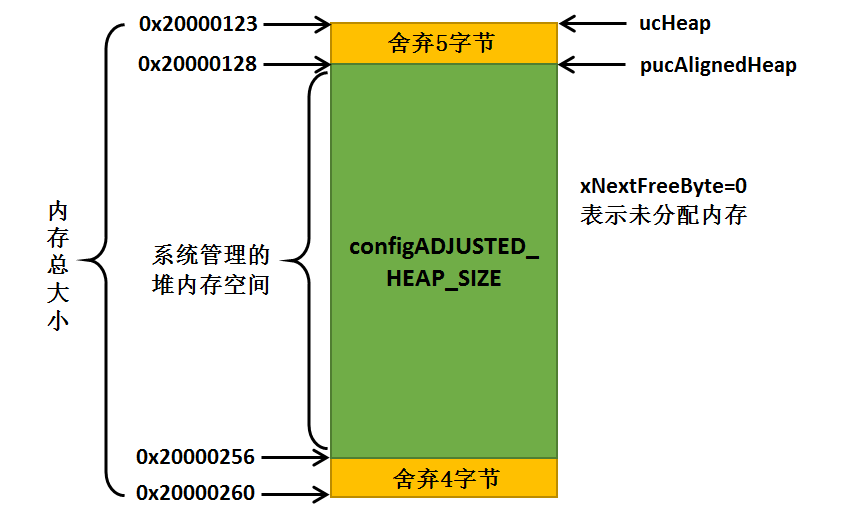

在内存对齐完成后，用户想要申请一个30字节大小的内存，那么按照系统对齐的要求，我们会申请到32个字节大小的内存空间，即使我们只需要30字节的内存，申请完成的示意图具体见 图23_2_。

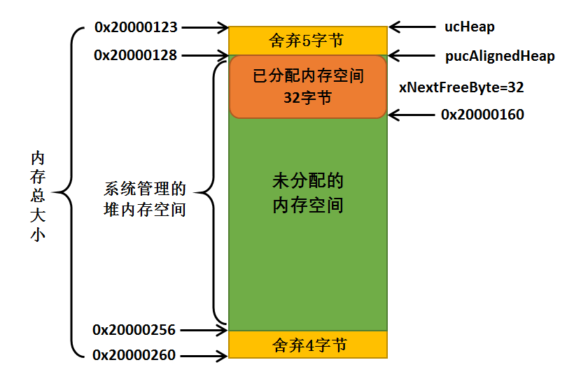

其他函数
''''''''''''

其实heap_1.c方案还有一些其他函数，只不过基本没啥用，就简单说说，vPortFree()这个函数其实上面都没做，因为heap_1.c采用的内存管理算法中不支持释放内存。vPortInitialiseBlocks()仅仅将静态局部变量xNextFreeByte设置为0，表示内存没有被申请。xPo
rtGetFreeHeapSize()则是获取当前未分配的内存堆大小，这个函数通常用于检查我们设置的内存堆是否合理，通过这个函数可以估计出最坏情况下需要多大的内存堆，以便合理的节省内存资源。

heap_2.c
^^^^^^^^^^^^^^^^

heap_2.c方案与heap_1.c方案采用的内存管理算法不一样，它采用一种最佳匹配算法(best fit algorithm)，比如我们申请100字节的内存，而可申请内存中有三块对应大小200字节， 500字节和 1000字节大小的内存块，按照算法的最佳匹配，这时候系统会把200字节大小的内存块
进行分割并返回申请内存的起始地址，剩余的内存则插回链表留待下次申请。Heap_2.c方案支持释放申请的内存，但是它不能把相邻的两个小的内存块合成一个大的内存块，对于每次申请内存大小都比较固定的，这个方式是没有问题的，而对于每次申请并不是固定内存大小的则会造成内存碎片，后面要讲解的heap_4.c方案
采用的内存管理算法能解决内存碎片的问题，可以把这些释放的相邻的小的内存块合并成一个大的内存块。

同样的，内存分配时需要的总的内存堆空间由文件FreeRTOSConfig.h中的宏configTOTAL_HEAP_SIZE配置，单位为字。通过调用函数xPortGetFreeHeapSize() 我们可以知道还剩下多少内存没有使用，但是并不包括内存碎片，这样一来我们可以实时的调整和优化config
TOTAL_HEAP_SIZE的大小。

     heap_2.c方案具有以下特点：

1. 可以用在那些反复的删除任务、队列、信号量、等内核对象且不担心内存碎片的应用程序。

2. 如果我们的应用程序中的队列、任务、信号量、等工作在一个不可预料的顺序，这样子也有可能会导致内存碎片。

3. 具有不确定性，但是效率比标准C库中的malloc函数高得多

4. 不能用于那些内存分配和释放是随机大小的应用程序。

heap_2.c方案与 heap_1方案在内存堆初始化的时候操作都是一样的，在内存中开辟了一个静态数组作为堆的空间，大小由用户定义，然后进行字节对齐处理。

heap_2.c方案采用链表的数据结构记录空闲内存块，将所有的空闲内存块组成一个空闲内存块链表，FreeRTOS采用2个BlockLink_t类型的局部静态变量xStart、xEnd来标识空闲内存块链表的起始位置与结束位置，
空闲内存块链表结构体具体见 代码清单23_4_。

.. code-block:: c
    :caption: 代码清单‑4空闲链表结构体
    :name: 代码清单23_4
    :linenos:

	typedefstruct A_BLOCK_LINK {
	struct A_BLOCK_LINK *pxNextFreeBlock;	
	size_t xBlockSize;		
	} BlockLink_t;

pxNextFreeBlock成员变量是指向下一个空闲内存块的指针。

xBlockSize用于记录申请的内存块的大小，包括链表结构体大小。

内存申请函数pvPortMalloc()
'''''''''''''''''''''''''''''''''''''''''''''''''''''''''

heap_2.c内存管理方案采用最佳匹配算法管理内存，系统会先从内存块空闲链表头开始进行遍历，查找符合用户申请大小的内存块（内存块空闲链表按内存块大小升序排列，所以最先返回的的块一定是最符合申请内存大小，所谓的最匹配算法就是这个意思来的）。当找到内存块的时候，返回该内存块偏移heapSTRUCT_S
IZE 个字节后的地址，因为在每块内存块前面预留的节点是用于记录内存块的信息，用户不需要也不允许操作这部分内存。

在申请内存成功的同时系统还会判断当前这块内存是否有剩余（大于一个链表节点所需内存空间），这样子就表示剩下的内存块还是能存放东西的，也要将其利用起来。如果有剩余的内存空间，系统会将内存块进行分割，在剩余的内存块头部添加一个内存节点，并且完善该空闲内存块的信息，然后将其按内存块大小插入内存块空闲链表中，
供下次分配使用，其中 prvInsertBlockIntoFreeList() 这个函数就是把节点按大小插入到链表中。下面一起看看源码是怎么实现的，具体见 代码清单23_5_。

.. code-block:: c
    :caption: 代码清单‑5pvPortMalloc()源码（heap_2.c）
    :name: 代码清单23_5
    :linenos:

	void *pvPortMalloc( size_t xWantedSize )
	{
		BlockLink_t *pxBlock, *pxPreviousBlock, *pxNewBlockLink;
	static BaseType_t xHeapHasBeenInitialised = pdFALSE;
	void *pvReturn = NULL;
	 
	/* 挂起调度器 */
		vTaskSuspendAll();						(1)
		{
	/* 如果是第一次调用内存分配函数，先初始化内存堆 */
	if ( xHeapHasBeenInitialised == pdFALSE ) {		(2)	
				prvHeapInit();
				xHeapHasBeenInitialised = pdTRUE;
			}
	
	
	if ( xWantedSize > 0 ) {				
	/* 调整要分配的内存值，需要增加上链表结构体所占的内存空间
				heapSTRUCT_SIZE 表示链表结构体节点经过内存对齐后的内存大小
	因为空余内存的头部要放一个BlockLink_t类型的节点来管理，
	因此这里需要人为的扩充下申请的内存大小 */
				xWantedSize += heapSTRUCT_SIZE;			(3)
	
	/* 需要申请的内存大小与系统要求对齐的字节数不匹配，需要进行内存对齐 */
	if ( ( xWantedSize & portBYTE_ALIGNMENT_MASK ) != 0 ) {
					xWantedSize += ( portBYTE_ALIGNMENT -
	( xWantedSize & portBYTE_ALIGNMENT_MASK ) );(4)
				}
			}
	
	//如果当前的空闲内存足够满足用户申请的内存大小，就进行内存申请操作
	if ( ( xWantedSize > 0 ) && ( xWantedSize < configADJUSTED_HEAP_SIZE ) ) {
	/* 从空余内存链表的头部开始找，如果该空余内存的大小>xWantedSize，
	就从这块内存中抠出一部分内存返回，剩余的内存生成新的BlockLink_t插入链表中 */
	
				pxPreviousBlock = &xStart;				(5)	
				pxBlock = xStart.pxNextFreeBlock;		
	//从链表头部开始查找大小符合条件的空余内存
	while ( ( pxBlock->xBlockSize < xWantedSize )
	&& ( pxBlock->pxNextFreeBlock != NULL ) ) {	(6)
					pxPreviousBlock = pxBlock;
					pxBlock = pxBlock->pxNextFreeBlock;
				}
	
	/*如果搜索到链表尾xEnd，说明没有找到合适的空闲内存块，否则进行下一步处理*/ 
	
	if ( pxBlock != &xEnd ) {				(7)
	/* 能执行到这里，说明已经找到合适的内存块了，找到内存块，就
	返回内存块地址，注意了：这里返回的是内存块 +
	内存块链表结构体空间的偏移地址，因为内存块头部需要有一个空闲链表节点
					*/
					pvReturn = ( void * ) ( ( ( uint8_t * ) pxPreviousBlock->
								pxNextFreeBlock ) + heapSTRUCT_SIZE );(8)	
	
	/* 因为这个内存块被用户使用了，需要从空闲内存块链表中移除 */
					pxPreviousBlock->pxNextFreeBlock = pxBlock->pxNextFreeBlock;(9)
	
	/*再看看这个内存块的内存空间够不够多，能不能分成两个，
	申请的内存块就给用户，剩下的内存就留出来，
	放到空闲内存块链表中作为下一次内存块申请。 */
	if (( pxBlock->xBlockSize - xWantedSize)>heapMINIMUM_BLOCK_SIZE ) {(10)
	/* 去除分配出去的内存，在剩余内存块的起始位置放置一个链表节点*/
						pxNewBlockLink = ( void * ) ( ( ( uint8_t * ) pxBlock )
													+ xWantedSize );(11)	
	
	/* 通过计算得到剩余的内存大小，并且赋值给剩余内存块链表节点中
	的xBlockSize成员变量，方便下一次的内存查找 */
	pxNewBlockLink->xBlockSize = pxBlock->xBlockSize - xWantedSize;(12)
	                  pxBlock->xBlockSize = xWantedSize;		(13)	
	
	/* 将被切割而产生的新空闲内存块添加到空闲链表中 */
						prvInsertBlockIntoFreeList( ( pxNewBlockLink ) );(14)
					}
	
					xFreeBytesRemaining -= pxBlock->xBlockSize;
				}
			}
	
			traceMALLOC( pvReturn, xWantedSize );
		}
		( void ) xTaskResumeAll();					(15)
	
	#if( configUSE_MALLOC_FAILED_HOOK == 1 )
		{
	if ( pvReturn == NULL ) {
	externvoid vApplicationMallocFailedHook( void );
				vApplicationMallocFailedHook();			(16)
			}
		}
	#endif
	
	return pvReturn;						(17)
	}

代码清单23_5_ **(1)**\ ：系统调用了 vTaskSuspendAll() 函数挂起调度器，保证申请内存任务安全，避免分配时被切任务导致出错，因为内存申请是不可重入的（使用了静态变量）。

代码清单23_5_ **(2)**\ ：如果是第一次调用内存分配函数，先调用prvHeapInit()函数初始化内存堆，该函数源码具体见 代码清单23_6_。

.. code-block:: c
    :caption: 代码清单‑6 prvHeapInit()源码
    :name: 代码清单23_6
    :linenos:

	static void prvHeapInit( void )
	{
		BlockLink_t *pxFirstFreeBlock;
	uint8_t *pucAlignedHeap;
	
	/* 保证pucAlignedHeap也是按照指定内存要求对齐的 */
		pucAlignedHeap = ( uint8_t * ) ( ( ( portPOINTER_SIZE_TYPE )
	&ucHeap[ portBYTE_ALIGNMENT ] ) & ( ~( ( portPOINTER_SIZE_TYPE )
	portBYTE_ALIGNMENT_MASK ) ) );			(1)
	
	/* 空闲内存链表头部初始化 */
	
		xStart.pxNextFreeBlock = ( void * ) pucAlignedHeap;		(2)
		xStart.xBlockSize = ( size_t ) 0;				
	
	/* 空闲内存链表尾部初始化 */
		xEnd.xBlockSize = configADJUSTED_HEAP_SIZE;			(3)
		xEnd.pxNextFreeBlock = NULL;
	
	/* 将pxFirstFreeBlock放入空闲链表中，因为空闲内存块链表除了要有头部与尾部，
	还需要有真正可用的内存，而第一块可用的内存就是pxFirstFreeBlock，
		pxFirstFreeBlock的大小是系统管理的内存大小configADJUSTED_HEAP_SIZE */
		pxFirstFreeBlock = ( void * ) pucAlignedHeap;		(4)
		pxFirstFreeBlock->xBlockSize = configADJUSTED_HEAP_SIZE;
		pxFirstFreeBlock->pxNextFreeBlock = &xEnd;
	}

代码清单23_6_ **(1)**\ ：按照内存管理的要求，所有归FreeRTOS管理的内存堆都需要按指定的内存对齐字节数对齐，这里当然也不例外，保证pucAlignedHeap也是按照指定内存要求对齐的。

代码清单23_6_ **(2)**\
：空闲内存链表头部初始化，空闲内存块头部是一个索引，用于查找能用的内存块，所以xStart的pxNextFreeBlock成员变量指向对齐后的内存起始地址pucAlignedHeap。并且空闲内存块链表的头部是没有可用的内存空间的，所以xStart的xBlockSize成员变量的值为0。

代码清单23_6_ **(3)**\ ：同理，初始化空闲内存链表尾部节点，尾部只是一个标记，当遍历空闲链表到这里的时候，表示已经没有可用的内存块了，所以xEnd的pxNextFreeBlock成员变量为NULL，并且空闲内存块链表头部与尾部都是不可用的，至于xEnd的xBlockSize成员变量的值
是什么并不重要，但是为了方便排序，FreeRTOS给其赋值为configADJUSTED_HEAP_SIZE，这个就是管理内存最大的值了，所以，无论当前内存块的内存是多大的，在初始化完成之后，空闲内存块链表会按内存块大小进行升序排列。

代码清单23_6_ **(4)**\ ：将pxFirstFreeBlock放入空闲链表中，因为空闲内存块链表除了要有头部与尾部，还需要有真正可用的内存，而第一块可用的内存就是pxFirstFreeBlock，内存块的起始地址就是对齐后的起始地址pucAlignedHeap，内存块的大小是系统管理的内
存大小configADJUSTED_HEAP_SIZE，并且在内存块链表中的下一个指向就是尾部节点xEnd。

支持，空闲内存块的初始化就分析完成，将内存块以链表的形式去管理，初始化完成示意图具体见 图23_3_。

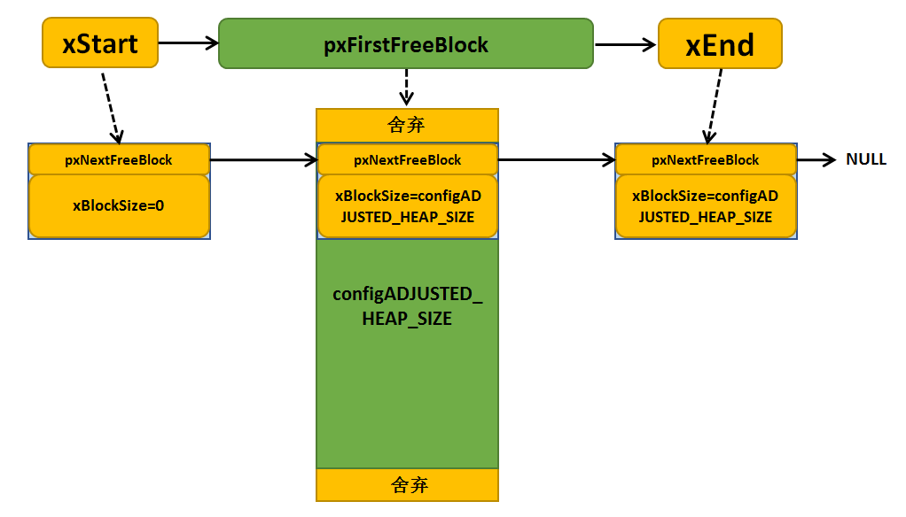

代码清单23_5_ **(3)**\ ：在申请内存的时候，需要调整要分配的内存值，必须增加上链表结构体所占的内存空间，heapSTRUCT_SIZE
表示链表结构体节点经过内存对齐后的内存大小，因为每一块被申请出去的内存块的头部都要放一个BlockLink_t类型的节点来管理，因此这里需要人为的扩充下申请的内存大小。

代码清单23_5_ **(4)**\ ：需要申请的内存大小与系统要求对齐的字节数不匹配，需要进行内存对齐。

代码清单23_5_ **(5)**\ ：如果当前的空闲内存足够满足用户申请的内存大小，就进行内存申请操作，怎么从空闲内存块链表中申请内存？系统会从空闲内存块链表的头部开始找，如果该空闲内存块的大小大于用户想要申请的内存大小xWantedSize，那么就从这块内存中分离出一部分用户需要的内存大小，剩余
的内存则生成新的内存块插入空闲内存块链表中。想要进行空闲内存块链表的遍历，那就需要找到起始节点xStart，然后根据其指向的下一个空闲内存块开始查找。

代码清单23_5_ **(6)**\ ：从空闲内存块链表头部开始查找大小符合条件的空闲内存，直到满足用户要求或者遍历完链表才退出循环。

代码清单23_5_ **(7)**\ ：如果搜索到链表尾xEnd，说明没有找到合适的空闲内存块，否则进行下一步处理。

代码清单23_5_ **(8)**\ ：能执行到这里，说明已经找到合适的内存块了，找到内存块，就返回内存块地址。注意了：这里返回的是内存块起始地址加上内存块链表结构体空间的偏移地址，因为内存块头部需要有一个节点用于保存内存相关信息。

代码清单23_5_ **(9)**\ ：因为这个内存块被用户使用了，需要从空闲内存块链表中移除。

代码清单23_5_ **(10)**\ ：分配到内存后，系统还要再看看这个内存块的内存空间够不够多，能不能分成两个，申请的内存块就给用户，剩下的内存就留出来，放到空闲内存块链表中作为下一次内存块申请，这样子就能节约内存。

代码清单23_5_ **(11)**\ ：去除分配出去的内存，在剩余内存块的起始位置放置一个链表节点，用来记录该空闲内存块的信息。

代码清单23_5_ **(12)**\ ：通过计算得到剩余的内存大小，并且赋值给剩余内存块链表节点中的xBlockSize成员变量，方便下一次的内存查找。

代码清单23_5_ **(13)**\ ：同时也对当前申请的内存进行保存信息处理，节点中的成员变量xBlockSize的值为当前申请的内存大小。

代码清单23_5_ **(14)**\ ：将被切割而产生的新空闲内存块添加到空闲链表中。

代码清单23_5_ **(15)**\ ：恢复调度器运行。

代码清单23_5_ **(16)**\ ：如果内存分配不成功，这里最可能是内存堆空间不够用了。如果用户使能了内存申请失败钩子函数这个宏定义，那么在内存申请失败的时候会调用vApplicationMallocFailedHook()钩子函数，这个钩子函数由用户实现，通常可以输出内存申请失败的相关提示。

代码清单23_5_ **(17)**\ ：返回申请成功的内存起始地址或者NULL。

随着内存申请，越来越多申请的内存块脱离空闲内存链表，但链表仍是以xStart节点开头以xEnd节点结尾，空闲内存块链表根据空闲内存块的大小进行排序。每当用户申请一次内存的时候，系统都要分配一个BlockLink_t类型结构体空间，用于保存申请的内存块信息，并且每个内存块在申请成功后会脱离空闲内存块链
表，申请两次后的内存示意图具体见 图23_4_。

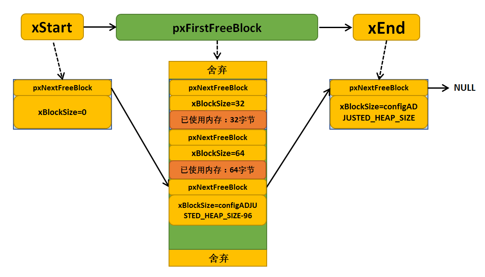

内存释放函数vPortFree()
''''''''''''''''''''''''''''''''''

分配内存的过程简单，那么释放内存的过程更简单，只需要向内存释放函数中传入要释放的内存地址，那么系统会自动向前索引到对应链表节点，并且取出这块内存块的信息，
将这个节点插入到空闲内存块链表中，将这个内存块归还给系统，下面来看看vPortFree()的源码，具体见 代码清单23_7_。

.. code-block:: c
    :caption: 代码清单‑7vPortFree()源码（heap_2.c）
    :name: 代码清单23_7
    :linenos:

	void vPortFree( void *pv )
	{
	uint8_t *puc = ( uint8_t * ) pv;
		BlockLink_t *pxLink;
	
	if ( pv != NULL ) {
	/* 根据要释放的内存块找到对应的链表节点 */
			puc -= heapSTRUCT_SIZE;			(1)
	
			pxLink = ( void * ) puc;
	
			vTaskSuspendAll();				(2)
			{
	/* 将要释放的内存块添加到空闲链表 */
				prvInsertBlockIntoFreeList( ( ( BlockLink_t * ) pxLink ) );
	/* 更新一下当前的未分配的内存大小 */
             xFreeBytesRemaining += pxLink->xBlockSize;	(3)	
				traceFREE( pv, pxLink->xBlockSize );
			}
			( void ) xTaskResumeAll();			(4)
		}
	}

代码清单23_7_ **(1)**\ ：根据要释放的内存块进行地址偏移找到对应的链表节点。

代码清单23_7_ **(2)**\ ：挂起调度器，内存的操作都需要挂起调度器。

代码清单23_7_ **(3)**\ ：将要释放的内存块添加到空闲链表，prvInsertBlockIntoFreeList是一个宏定义，就是对链表的简单操作，将释放的内存块按内存大小插入空闲内存块链表中。然后系统更新一下表示未分配内存大小的变量xFreeBytesRemaining。在释放内存完成
之后的示意图具体见 图23_5_ 与 图23_6_。

代码清单23_7_ **(4)**\ ：恢复调度器。

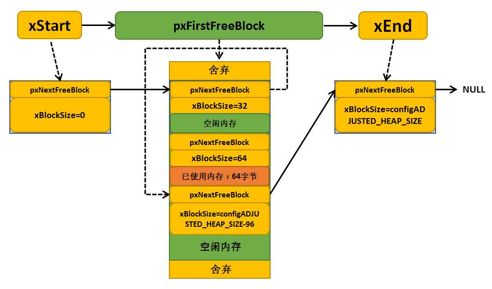

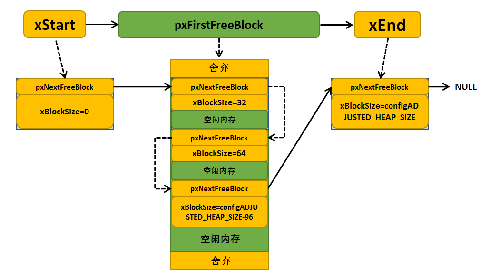

从内存的申请与释放看来，heap_2.c方案采用的内存管理算法虽然是高效但还是有缺陷的，由于在释放内存时不会将相邻的内存块合并，所以这可能造成内存碎片，当然并不是说这种内存管理算法不好，只不过对使用的条件比较苛刻，要求用户每次创建或释放的任务、队列等必须大小相同如果分配或释放的内存是随机的，绝对不可
以用这种内存管理策略；如果申请和释放的顺序不可预料，那也很危险。举个例子，假设用户先申请128字节内存，然后释放，此时系统释放的128字节内存可以重复被利用；如果用户再接着申请64k的字节内存，那么一个本来128字节的大块就会被分为两个64字节的小块，如果这种情况经常发生，就会导致每个空闲块都可能很
小，最终在申请一个大块时就会因为没有合适的空闲内存块而申请失败，这并不是因为总的空闲内存不足，而是无法申请到连续可以的大块内存。

heap_3.c
^^^^^^^^^^^^^^^^

heap_3.c方案只是简单的封装了标准C库中的malloc()和free()函数，并且能满足常用的编译器。重新封装后的malloc()和free()函数具有保护功能，采用的封装方式是操作内存前挂起调度器、完成后再恢复调度器。

heap_3.c方案具有以下特点：

1. 需要链接器设置一个堆，malloc()和free()函数由编译器提供。

2. 具有不确定性。

3. 很可能增大RTOS内核的代码大小。

要注意的是在使用heap_3.c方案时，FreeRTOSConfig.h文件中的configTOTAL_HEAP_SIZE宏定义不起作用。在STM32系列的工程中，这个由编译器定义的堆都在启动文件里面设置，单位为字节，我们具体以STM32F10x系列为例，具体见 图23_7_。而其它系列的都差不多。

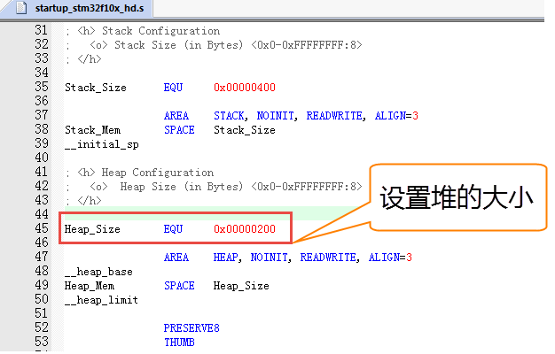

heap_3.c方案中的内存申请与释放相关函数源码过于简单，就不再讲述，源码具体见 代码清单23_8_ 与 代码清单23_9_。

.. code-block:: c
    :caption: 代码清单‑8pvPortMalloc()源码（heap_3.c）
    :name: 代码清单23_8
    :linenos:

	void *pvPortMalloc( size_t xWantedSize )
	{
	void *pvReturn;
	
		vTaskSuspendAll();
		{
			pvReturn = malloc( xWantedSize );
			traceMALLOC( pvReturn, xWantedSize );
		}
		( void ) xTaskResumeAll();
	
	#if( configUSE_MALLOC_FAILED_HOOK == 1 )
		{
	if ( pvReturn == NULL ) {
	externvoid vApplicationMallocFailedHook( void );
				vApplicationMallocFailedHook();
			}
		}
	#endif
	
	return pvReturn;
	}

.. code-block:: c
    :caption: 代码清单‑9vPortFree()源码（heap_3.c）
    :name: 代码清单23_9
    :linenos:

	void vPortFree( void *pv )
	{
	if ( pv ) {
			vTaskSuspendAll();
			{
				free( pv );
				traceFREE( pv, 0 );
			}
			( void ) xTaskResumeAll();
		}
	}

heap_4.c
^^^^^^^^^^^^^^^^

heap_4.c方案与heap_2.c方案一样都采用最佳匹配算法来实现动态的内存分配，但是不一样的是heap_4.c方案还包含了一种合并算法，能把相邻的空闲的内存块合并成一个更大的块，这样可以减少内存碎片。heap_4.c方案特别适用于移植层中可以直接使用pvPortMalloc()和
vPortFree()函数来分配和释放内存的代码。

内存分配时需要的总的堆空间由文件FreeRTOSConfig.h中的宏configTOTAL_HEAP_SIZE配置，单位为字。通过调用函数xPortGetFreeHeapSize() 我们可以知道还剩下多少内存没有使用，但是并不包括内存碎片。这样一来我们可以实时的调整和优化configTOTAL_
HEAP_SIZE的大小。

heap_4.c方案的空闲内存块也是以单链表的形式连接起来的，BlockLink_t类型的局部静态变量xStart表示链表头，但heap_4.c内存管理方案的链表尾部则保存在内存堆空间最后位置，并使用BlockLink_t指针类型局部静态变量pxEnd指向这个区域（而heap_2.c内存管理方案则使
用BlockLink_t类型的静态变量xEnd表示链表尾）

heap_4.c内存管理方案的空闲块链表不是以内存块大小进行排序的，而是以内存块起始地址大小排序，内存地址小的在前，地址大的在后，因为heap_4.c方案还有一个内存合并算法，在释放内存的时候，假如相邻的两个空闲内存块在地址上是连续的，那么就可以合并为一个内存块，这也是为了适应合并算法而作的改变。

heap_4.c方案具有以下特点：

1、可用于重复删除任务、队列、信号量、互斥量等的应用程序

2、可用于分配和释放随机字节内存的应用程序，但并不像heap2.c那样产生严重的内存碎片。

3、具有不确定性，但是效率比标准C库中的malloc函数高得多。

内存申请函数pvPortMalloc()
''''''''''''''''''''''''''''''''''''''''

heap_4.c方案的内存申请函数与heap_2.c方案的内存申请函数大同小异，同样是从链表头xStart开始遍历查找合适的内存块，如果某个空闲内存块的大小能容得下用户要申请的内存，则将这块内存取出用户需要内存空间大小的部分返回给用户，剩下的内存块组成一个新的空闲块，按照空闲内存块起始地址大小顺序插
入到空闲块链表中，内存地址小的在前，内存地址大的在后。在插入到空闲内存块链表的过程中，系统还会执行合并算法将地址相邻的内存块进行合并：判断这个空闲内存块是相邻的空闲内存块合并成一个大内存块，如果可以则合并，合并算法是heap_4.c内存管理方案和heap_2.c内存管理方案最大的不同之处，这样一来，
会导致的内存碎片就会大大减少，内存管理方案适用性就很强，能一样随机申请和释放内存的应用中，灵活性得到大大的提高，下面来看看heap_4.c的内存申请源码，具体见 代码清单23_10_。

.. code-block:: c
    :caption: 代码清单‑10pvPortMalloc()源码（heap_4.c）
    :name: 代码清单23_10
    :linenos:

	void *pvPortMalloc( size_t xWantedSize )
	{
    BlockLink_t *pxBlock, *pxPreviousBlock, *pxNewBlockLink;
	void *pvReturn = NULL;

		vTaskSuspendAll();
		{
	/* 如果是第一次调用内存分配函数，先初始化内存堆 */
	if ( pxEnd == NULL ) {
				prvHeapInit();					(1)
			} else {
				mtCOVERAGE_TEST_MARKER();
			}

	/* 这里xWantedSize的大小有要求，需要最高位为0。
	因为后面BlockLink_t结构体中的xBlockSize的最高位需要使用
	这个成员的最高位被用来标识这个块是否空闲。因此要申请的块大小不能使用这个位		
			*/
	if ( ( xWantedSize & xBlockAllocatedBit ) == 0 ) {		(2)
	/* 调整要分配的内存值，需要增加上链表结构体所占的内存空间
				heapSTRUCT_SIZE 表示链表结构体节点经过内存对齐后的内存大小
	因为空余内存的头部要放一个BlockLink_t类型的节点来管理，
	因此这里需要人为的扩充下申请的内存大小 */
	if ( xWantedSize > 0 ) {
					xWantedSize += xHeapStructSize;

	/* 需要申请的内存大小与系统要求对齐的字节数不匹配，需要进行内存对齐 */
	if ( ( xWantedSize & portBYTE_ALIGNMENT_MASK ) != 0x00 ) {
						xWantedSize += ( portBYTE_ALIGNMENT - ( xWantedSize &
						portBYTE_ALIGNMENT_MASK ) );
					} else {
						mtCOVERAGE_TEST_MARKER();
					}
				} else {
					mtCOVERAGE_TEST_MARKER();
				}

	//如果当前的空闲内存足够满足用户申请的内存大小，就进行内存申请操作
	if ( ( xWantedSize > 0 ) && ( xWantedSize <= xFreeBytesRemaining ) ) {
	* 从空余内存链表的头部开始找，如果该空余内存的大小>xWantedSize，
	就从这块内存中抠出一部分内存返回，剩余的内存生成新的BlockLink_t插入链表中
					*/
					pxPreviousBlock = &xStart;
					pxBlock = xStart.pxNextFreeBlock;
	//从链表头部开始查找大小符合条件的空余内存
	while ( ( pxBlock->xBlockSize < xWantedSize )
	&& ( pxBlock->pxNextFreeBlock != NULL ) ) {
						pxPreviousBlock = pxBlock;
						pxBlock = pxBlock->pxNextFreeBlock;
					}

	/* 
	如果搜索到链表尾xEnd，说明没有找到合适的空闲内存块，否则进行下一步处理
					*/
	if ( pxBlock != pxEnd ) {
	/* 能执行到这里，说明已经找到合适的内存块了，找到内存块，就
		返回内存块地址，注意了：这里返回的是内存块 +
		内存块链表结构体空间的偏移地址，因为内存块头部需要有一个空闲
				链表节点*/
						pvReturn = ( void * ) ( ( ( uint8_t * ) pxPreviousBlock->
			pxNextFreeBlock ) + xHeapStructSize );

	//* 因为这个内存块被用户使用了，需要从空闲内存块链表中移除 */
						pxPreviousBlock->pxNextFreeBlock = pxBlock->pxNextFreeBlock;
	/*再看看这个内存块的内存空间够不够多，能不能分成两个，
	申请的内存块就给用户，剩下的内存就留出来，
	放到空闲内存块链表中作为下一次内存块申请。 */
		if((pxBlock->xBlockSize - xWantedSize ) > heapMINIMUM_BLOCK_SIZE ) {
	/* 去除分配出去的内存，在剩余内存块的起始位置放置一个链表节点*/
	pxNewBlockLink = ( void * ) ( ( ( uint8_t * ) pxBlock ) +
												xWantedSize );

							configASSERT( ( ( ( size_t ) pxNewBlockLink )
	& portBYTE_ALIGNMENT_MASK ) == 0 );

	/* 通过计算得到剩余的内存大小，并且赋值给剩余内存块链表节点中
	的xBlockSize成员变量，方便下一次的内存查找 */
	pxNewBlockLink->xBlockSize = pxBlock->xBlockSize - xWantedSize;
							pxBlock->xBlockSize = xWantedSize;

	/* 将被切割而产生的新空闲内存块添加到空闲链表中 */
							prvInsertBlockIntoFreeList( pxNewBlockLink );(3)
						} else {
							mtCOVERAGE_TEST_MARKER();
						}

	//更新剩余内存总大小
						xFreeBytesRemaining -= pxBlock->xBlockSize;

	//如果当前内存大小小于历史最小记录，更新历史最小内存记录
	if ( xFreeBytesRemaining < xMinimumEverFreeBytesRemaining ) {
							xMinimumEverFreeBytesRemaining = xFreeBytesRemaining;(4)	
						} else {
							mtCOVERAGE_TEST_MARKER();
						}

	/* 注意这里的xBlockSize的最高位被设置为1，标记内存已经被申请使用*/
						pxBlock->xBlockSize |= xBlockAllocatedBit;		(5)
						pxBlock->pxNextFreeBlock = NULL;
					} else {
						mtCOVERAGE_TEST_MARKER();
					}
				} else {
					mtCOVERAGE_TEST_MARKER();
				}
			} else {
				mtCOVERAGE_TEST_MARKER();
			}
	
			traceMALLOC( pvReturn, xWantedSize );
		}
		( void ) xTaskResumeAll();
	
	#if( configUSE_MALLOC_FAILED_HOOK == 1 )
		{
	if ( pvReturn == NULL ) {
	externvoid vApplicationMallocFailedHook( void );
				vApplicationMallocFailedHook();
			} else {
				mtCOVERAGE_TEST_MARKER();
			}
		}
	#endif
	
	return pvReturn;
	}

在读懂源码之前，我们先记住下面这几个变量的含义：

-  xFreeBytesRemaining：表示当前系统中未分配的内存堆大小。

-  xMinimumEverFreeBytesRemaining：表示未分配内存堆空间历史最小的内存值。只有记录未分配内存堆的最小值，才能知道最坏情况下内存堆的使用情况。

-  xBlockAllocatedBit：这个变量在内存堆初始化的时候被初始化，初始化将它能表示的数值的最高位置1。比如对于32位系统，这个变量被初始化为0x80000000（最高位为1）。heap_4.c内存管理方案使用xBlockAllocatedBit来标识一个内存块是否已经被分配使用了（是否为
  空闲内存块），如果内存块已经被分配出去，则该内存块上的链表节点的成员变量xBlockSize会按位或上这个变量（即xBlockSize最高位置1），而在释放一个内存块时，则会把xBlockSize的最高位清零，表示内存块是空闲的。

由于heap_2.c中的内存申请函数与heap_4.c中的内存申请函数基本大同小异，在这里我们主要讲解一下不一样的地方：

代码清单23_10_ **(1)**\ ：内存堆初始化是不一样的，源码具体见 代码清单23_11_。

.. code-block:: c
    :caption: 代码清单‑11prvHeapInit()源码
    :name: 代码清单23_11
    :linenos:

	static void prvHeapInit( void )
	{
		BlockLink_t *pxFirstFreeBlock;
	uint8_t *pucAlignedHeap;
	size_t uxAddress;
	size_t xTotalHeapSize = configTOTAL_HEAP_SIZE;
	
	/* 进行内存对齐操作 */
		uxAddress = ( size_t ) ucHeap;			(1)
	
	if ( ( uxAddress & portBYTE_ALIGNMENT_MASK ) != 0 ) {
			uxAddress += ( portBYTE_ALIGNMENT - 1 );
			uxAddress &= ~( ( size_t ) portBYTE_ALIGNMENT_MASK );
	//xTotalHeapSize表示系统管理的总内存大小
			xTotalHeapSize -= uxAddress - ( size_t ) ucHeap;
		}							(2)
	
		pucAlignedHeap = ( uint8_t * ) uxAddress;
	
	//初始化链表头部
		xStart.pxNextFreeBlock = ( void * ) pucAlignedHeap;	(3)
		xStart.xBlockSize = ( size_t ) 0;
	
	/* 初始化pxEnd，计算pxEnd的位置，它的值为内存尾部向前偏移一个
			BlockLink_t结构体大小，偏移出来的这个BlockLink_t就是pxEnd */
		uxAddress = ( ( size_t ) pucAlignedHeap ) + xTotalHeapSize;(4)
		uxAddress -= xHeapStructSize;
		uxAddress &= ~( ( size_t ) portBYTE_ALIGNMENT_MASK );
		pxEnd = ( void * ) uxAddress;
		pxEnd->xBlockSize = 0;
		pxEnd->pxNextFreeBlock = NULL;			
	
	/* 和heap_2.c中的初始化类似，将当前所有内存插入空闲内存块链表中。
	不同的是链表的尾部不是静态的，而是放在了内存的最后。 */
		pxFirstFreeBlock = ( void * ) pucAlignedHeap;		(5)
		pxFirstFreeBlock->xBlockSize = uxAddress - ( size_t ) pxFirstFreeBlock;
		pxFirstFreeBlock->pxNextFreeBlock = pxEnd;
	
	/*  更新统计变量 */
		xMinimumEverFreeBytesRemaining = pxFirstFreeBlock->xBlockSize;(6)
     	xFreeBytesRemaining = pxFirstFreeBlock->xBlockSize;
 
	/* 这个xBlockAllocatedBit比较特殊，这里被设置为最高位为1其余为0的
	一个size_t大小的值，这样任意一个size_t大小的值和xBlockAllocatedBit
	进行按位与操作,如果该值最高位为1，那么结果为1，否则结果为0，
		FreeRTOS利用这种特性标记一个内存块是否空闲的 */
		xBlockAllocatedBit = ( ( size_t ) 1 ) << (
	( sizeof( size_t ) * heapBITS_PER_BYTE ) - 1 );(7)
	}

代码清单23_11_ **(1)-(2)**\ ：按照内存管理的要求，所有归FreeRTOS管理的内存堆都需要按指定的内存对齐字节数对齐，这里当然也不例外，保证pucAlignedHeap也是按照指定内存要求对齐的。

代码清单23_11_ **(3)**\ ：空闲内存链表头部初始化，作用与heap_2.c方案一样，xStart的pxNextFreeBlock成员变量指向对齐后的内存起始地址pucAlignedHeap，xStart的xBlockSize成员变量的值为0。

代码清单23_11_ **(4)**\ ：同理，初始化空闲内存链表尾部节点，计算pxEnd的位置，它的值为内存尾部向前偏移一个BlockLink_t结构体大小，偏移出来的这个BlockLink_t就是pxEnd。尾部只是一个标记，当遍历空闲链表到这里的时候，表示已经没有可用的内存块了，所以pxEnd
的pxNextFreeBlock成员变量为NULL，与heap_2.c方案不同的是链表的尾部节点不是静态的，而是放在了内存的最后。

代码清单23_11_ **(5)**\ ：将pxFirstFreeBlock放入空闲链表中，因为空闲内存块链表除了要有头部与尾部，还需要有真正可用的内存，而第一块可用的内存就是pxFirstFreeBlock，内存块的起始地址就是对齐后的起始地址pucAlignedHeap，内存块的大小是系统管理的
内存大小configADJUSTED_HEAP_SIZE，并且在内存块链表中的下一个指向就是尾部节点pxEnd。

代码清单23_11_ **(6)**\ ：更新统计变量。

代码清单23_11_ **(7)**\ ：这个xBlockAllocatedBit比较特殊，这里被设置为最高位为1其余为0的一个size_t大小的值，这样任意一个size_t大小的值和xBlockAllocatedBit进行按位与操作，如果该值最高位为1，那么结果为1，否则结果为0，
FreeRTOS利用这种特性标记一个内存块是否空闲的。

heap_4.c内存初始化完成示意图具体见 图23_8_。

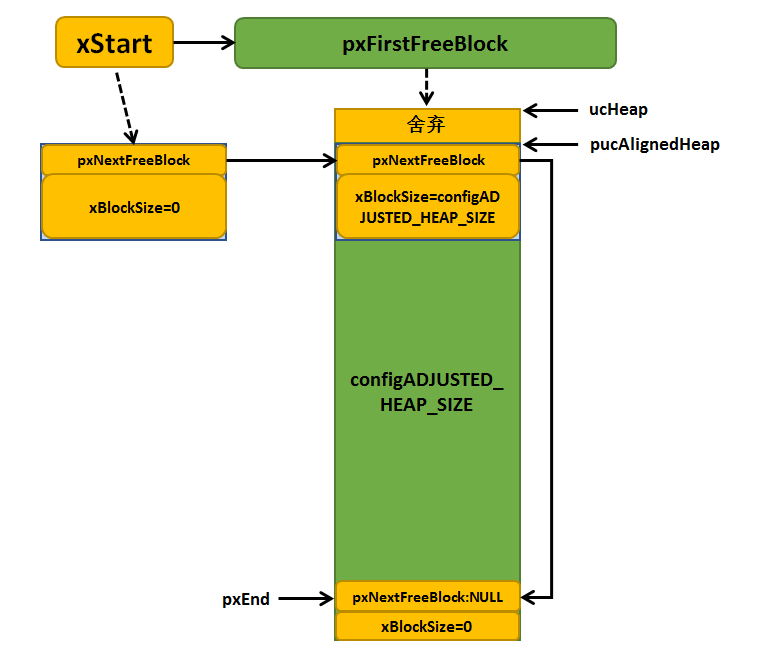

代码清单23_11_ **(2)**\ ：这里xWantedSize的大小有要求，需要最高位为0。因为后面BlockLink_t结构体中的xBlockSize的最高位需要使用这个成员的最高位被用来标识这个块是否空闲，因此要求申请的块大小不能使用这个位。

代码清单23_11_ **(3)**\ ：将被切割而产生的新空闲内存块添加到空闲链表中，这里与heap_2.c方案不一样，这里插入空闲内存块链表的时候会通过合并算法将可以合并成大内存块的相邻内存块进行合并，源码具体见代码清单23‑12。

.. code-block:: c
    :caption: 代码清单‑12 prvInsertBlockIntoFreeList()源码
    :name: 代码清单23_12
    :linenos:

	static void prvInsertBlockIntoFreeList( BlockLink_t *pxBlockToInsert )
	{
		BlockLink_t *pxIterator;
	uint8_t *puc;

	/* 首先找到和pxBlockToInsert相邻的前一个空闲内存 */
	for ( pxIterator = &xStart;
			pxIterator->pxNextFreeBlock < pxBlockToInsert;
			pxIterator = pxIterator->pxNextFreeBlock ) {		(1)

		}

		puc = ( uint8_t * ) pxIterator;
		/* 如果前一个内存的尾部恰好是pxBlockToInsert的头部，
	那代表这两个内存是连续的，可以合并*/
	if ( ( puc + pxIterator->xBlockSize ) == ( uint8_t * ) pxBlockToInsert ) {(2)
	/* 将pxBlockToInsert合并入pxIterator中 */
			pxIterator->xBlockSize += pxBlockToInsert->xBlockSize;		
			pxBlockToInsert = pxIterator;				(3)
		} else {
			mtCOVERAGE_TEST_MARKER();
		}
	
	/* 判断pxBlockToInsert是否和后面的空闲内存相邻 */
		puc = ( uint8_t * ) pxBlockToInsert;
	if ( ( puc + pxBlockToInsert->xBlockSize ) ==
			( uint8_t * ) pxIterator->pxNextFreeBlock ) {		(4)
	/* 与之相邻的下一个内存块不是链表尾节点 */
	if ( pxIterator->pxNextFreeBlock != pxEnd ) {		(5)
	/* 将后面的内存合入pxBlockToInsert，
	并用pxBlockToInsert代替该内存在链表中的位置 */
				pxBlockToInsert->xBlockSize +=
					pxIterator->pxNextFreeBlock->xBlockSize;
	
				pxBlockToInsert->pxNextFreeBlock =
					pxIterator->pxNextFreeBlock->pxNextFreeBlock;
			} else {
				pxBlockToInsert->pxNextFreeBlock = pxEnd;		(6)
			}
		} else {
	//后面不相邻，那么只能插入链表了
			pxBlockToInsert->pxNextFreeBlock = pxIterator->pxNextFreeBlock;(7)
		}
	
	/* 判断下前面是否已经合并了，如果合并了，就不用再更新链表了 */
	if ( pxIterator != pxBlockToInsert ) {
			pxIterator->pxNextFreeBlock = pxBlockToInsert;		(8)
		} else {
			mtCOVERAGE_TEST_MARKER();
		}
	}

代码清单23_12_ **(1)**\ ：首先找到和pxBlockToInsert相邻的前一个空闲内存，找到之后就会退出for循环。

代码清单23_12_ **(2)**\ ：循环结束后，如果前一个内存块的尾部地址恰好是pxBlockToInsert的头部地址，那代表这两个内存块是连续的，可以合并，那么就把pxBlockToInsert合并到该内存块中。

代码清单23_12_ **(3)**\ ：将pxBlockToInsert合并入pxIterator中。pxIterator的大小就是本身大小再加上pxBlockToInsert的大小。

代码清单23_12_ **(4)**\ ：同理，再判断pxBlockToInsert是否和后面的空闲内存相邻，如果pxBlockToInsert的尾部地址是下一个内存块的头部地址，那么也是说明这连个内存块是连续的，可以合并。

代码清单23_12_ **(5)**\ ：当然啦，还要判断pxBlockToInsert的下一个内存块是不是尾部节点pxEnd，为什么呢？因为尾部节点就是放在系统管理的内存块最后的地址上，而xStart不是，所以这里要判断一下。如果不是pxEnd，并且还连续的，那么就将后面的内存合入pxBlockT
oInsert，并用pxBlockToInsert代替该内存在链表中的位置，pxBlockToInsert的大小就是本身大小再加上下一个内存块的大小。

代码清单23_12_ **(6)**\ ：如果pxBlockToInsert的下一个内存块是pxEnd，那就不能合并，将内存块节点的成员变量pxNextFreeBlock指向pxEnd。

代码清单23_12_ **(7)**\ ：如果pxBlockToInsert与后面的内存块不相邻，那么只能插入链表了。

代码清单23_12_ **(8)**\ ：判断下前面是否已经合并了，如果合并了，就不用再更新链表了，否则就更新一下与前一个内存块的链表连接关系。

其实，这个合并的算法常用于释放内存的合并，申请内存的时候能合并的早已合并，因为申请内存是从一个空闲内存块前面分割，分割后产生的内存块都是一整块的，
基本不会进行合并，申请内存常见的情况具体见 图23_9_。

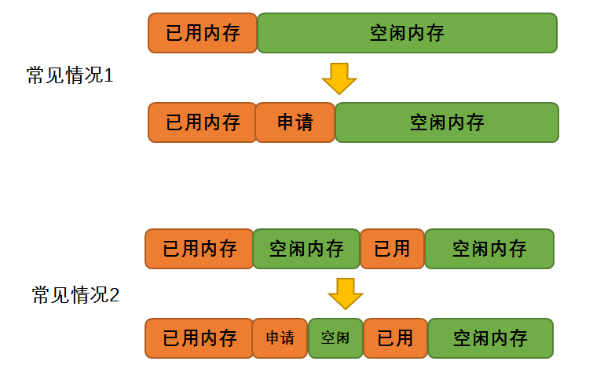

代码清单23_10_ **(4)**\ ：如果当前内存大小小于历史最小记录，更新历史最小内存记录。

代码清单23_10_ **(5)**\ ：注意这里的xBlockSize的最高位被设置为1，标记内存已经被申请使用，xBlockAllocatedBit在内存初始化的时候就被初始化了。

内存申请函数其实很简单的，在申请3次内存完成之后的示意图具体见 图23_10_。

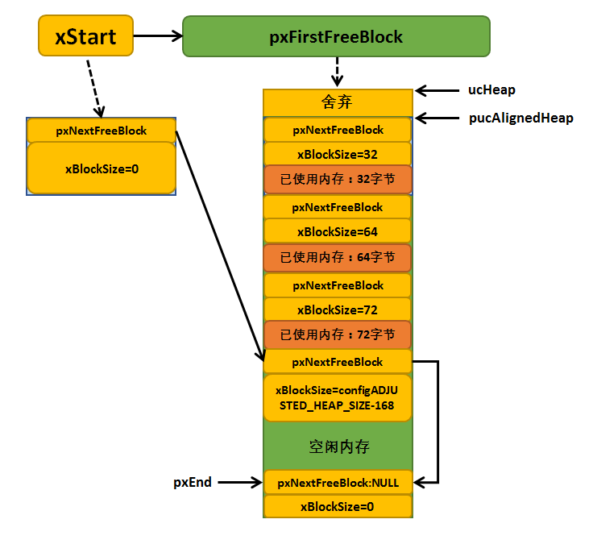

.. _内存释放函数vportfree-1:

内存释放函数vPortFree()
'''''''''''''''''

heap_4.c内存管理方案的内存释放函数vPortFree()也比较简单，根据传入要释放的内存块地址，偏移之后找到链表节点，然后将这个内存块插入到空闲内存块链表中，在内存块插入过程中会执行合并算法，这个我们已经在内存申请中讲过了（而且合并算法多用于释放内存中）。最后是将这个内存块标志为“空闲”（内
存块节点的xBlockSize成员变量最高位清0）、再更新未分配的内存堆大小即可，下面来看看vPortFree()的源码实现过程，具体见 代码清单23_13_。

.. code-block:: c
    :caption: 代码清单‑13vPortFree()源码（heap_4.c）
    :name: 代码清单23_13
    :linenos:

	void vPortFree( void *pv )
	{
	uint8_t *puc = ( uint8_t * ) pv;
		BlockLink_t *pxLink;
	
	if ( pv != NULL ) {
	/* 偏移得到节点地址 */
			puc -= xHeapStructSize;				(1)
	
			pxLink = ( void * ) puc;
	
	/* 断言 */
			configASSERT( ( pxLink->xBlockSize & xBlockAllocatedBit ) != 0 );
			configASSERT( pxLink->pxNextFreeBlock == NULL );
	
	/* 判断一下内存块是否已经是被分配使用的，如果是就释放该内存块 */
	if ( ( pxLink->xBlockSize & xBlockAllocatedBit ) != 0 ) {(2)
	if ( pxLink->pxNextFreeBlock == NULL ) {
	/* 将内存块标识为空闲 */
					pxLink->xBlockSize &= ~xBlockAllocatedBit;	(3)	

					vTaskSuspendAll();
					{
	/* 更新系统当前空闲内存的大小，添加到内存块空闲链表中 */
						xFreeBytesRemaining += pxLink->xBlockSize;(4)
						traceFREE( pv, pxLink->xBlockSize );
						prvInsertBlockIntoFreeList( ( ( BlockLink_t * ) pxLink ) );(5)
					}
					( void ) xTaskResumeAll();
				} else {
					mtCOVERAGE_TEST_MARKER();
				}
			} else {
				mtCOVERAGE_TEST_MARKER();
			}
		}
	}

代码清单23_13_ **(1)**\ ：根据要释放的内存块进行地址偏移找到对应的链表节点。

代码清单23_13_ **(2)**\ ：判断一下内存块是否已经是被分配使用的，如果是就释放该内存块。已经分配使用的内存块在其对应节点的成员变量xBlockSize最高位为1。

代码清单23_13_ **(3)**\ ：将内存块标识为空闲，将节点的成员变量xBlockSize最高位清0。

代码清单23_13_ **(4)**\ ：更新系统当前空闲内存的大小。

代码清单23_13_ **(5)**\ ：调用prvInsertBlockIntoFreeList()函数将释放的内存块添加到空闲内存块链表中，在这过程中，如果内存块可以合并就会进行内存块合并，否则就单纯插入空闲内存块链表（按内存地址排序）。

按照内存释放的过程，当我们释放一个内存时，如果与它相邻的内存块都不是空闲的，那么该内存块并不会合并，只会被添加到空闲内存块链表中，其过程示意图具体见 图23_11_。而如果某个时间段释放了另一个内存块，发现该内存块前面有一个空闲内存块与它在地址上是连续的，那么这两个内存块会合并成一个大的内存块，并插入空
闲内存块链表中，其过程示意图具体见 图23_12_，

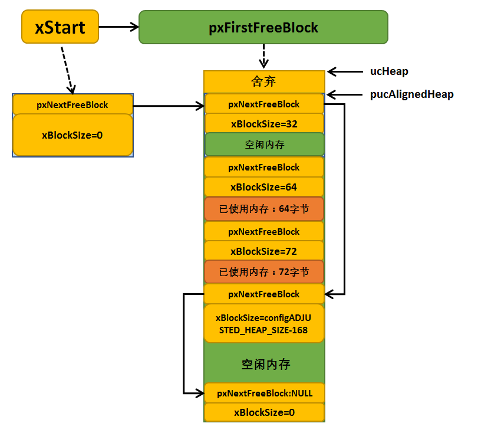

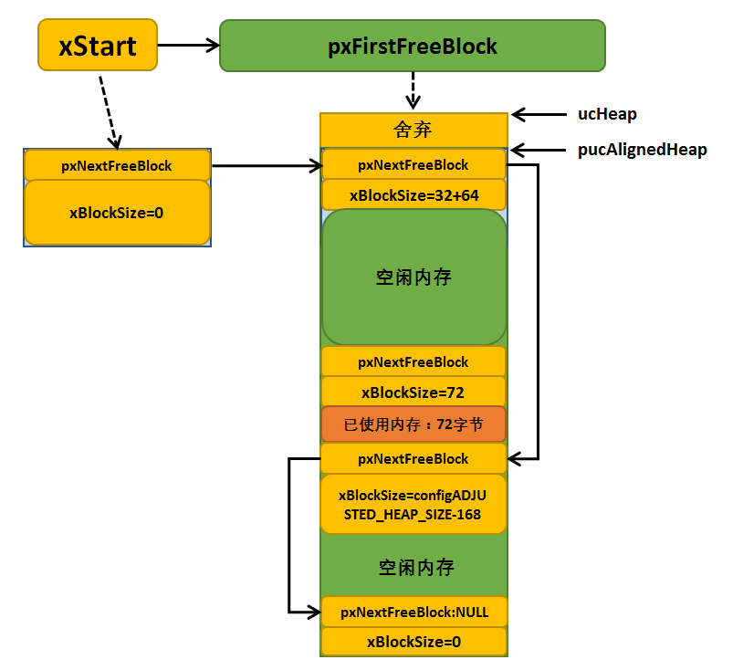

heap_5.c
^^^^^^^^^^^^^^^^

heap_5.c方案在实现动态内存分配时与heap4.c方案一样，采用最佳匹配算法和合并算法，并且允许内存堆跨越多个非连续的内存区，也就是允许在不连续的内存堆中实现内存分配，比如用户在片内RAM中定义一个内存堆，还可以在外部SDRAM再定义一个或多个内存堆，这些内存都归系统管理。

heap_5.c方案通过调用vPortDefineHeapRegions()函数来实现系统管理的内存初始化，在内存初始化未完成前不允许使用内存分配和释放函数。如创建FreeRTOS对象（任务、队列、信号量等）时会隐式的调用pvPortMalloc()函数，因此必须注意：使用heap_5.c内存管理方
案创建任何对象前，要先调用vPortDefineHeapRegions()函数将内存初始化。

vPortDefineHeapRegions()函数只有一个形参，该形参是一个HeapRegion_t类型的结构体数组。HeapRegion_t类型结构体在portable.h中定义，具体见 代码清单23_14_。

.. code-block:: c
    :caption: 代码清单‑14HeapRegion_t结构体定义
    :name: 代码清单23_14
    :linenos:

	typedefstruct HeapRegion {
	/* 用于内存堆的内存块起始地址*/
	uint8_t *pucStartAddress;

	/* 内存块大小 */
	size_t xSizeInBytes;
	} HeapRegion_t;

用户需要指定每个内存堆区域的起始地址和内存堆大小、将它们放在一个HeapRegion_t结构体类型数组中，这个数组必须用一个NULL指针和0作为结尾，起始地址必须从小到大排列。假设我们为内存堆分配两个内存块，第一个内存块大小为0x10000字节，起始地址为0x80000000；第二个内存块大小为0x
a0000字节，起始地址为0x90000000，vPortDefineHeapRegions()函数使用实例具体见 代码清单23_15_。

.. code-block:: c
    :caption: 代码清单‑15vPortDefineHeapRegions()函数应用举例
    :name: 代码清单23_15
    :linenos:

	/* 在内存中为内存堆分配两个内存块。
	第一个内存块大小为0x10000字节,起始地址为0x80000000,
	第二个内存块大小为0xa0000字节,起始地址为0x90000000。
	起始地址为0x80000000的内存块的起始地址更低,因此放到了数组的第一个位置。*/
	const HeapRegion_t xHeapRegions[] = {
		{ ( uint8_t * ) 0x80000000UL, 0x10000 },
		{ ( uint8_t * ) 0x90000000UL, 0xa0000 },
		{ NULL, 0 } /* 数组结尾 */
	};

	/* 向函数vPortDefineHeapRegions()传递形参 */
	vPortDefineHeapRegions( xHeapRegions );

用户在自定义好内存堆数组后，需要调用vPortDefineHeapRegions()函数初始化这些内存堆，系统会已一个空闲内存块链表的数据结构记录这些空闲内存，链表以xStart节点构开头，以pxEnd指针指向的位置结束。vPortDefineHeapRegions()函数对内存的初始化与heap_
4.c方案一样，在这里就不再重复赘述过程。以上面的内存堆数组为例，初始化完成后的内存堆示意图具体见 图23_13_。

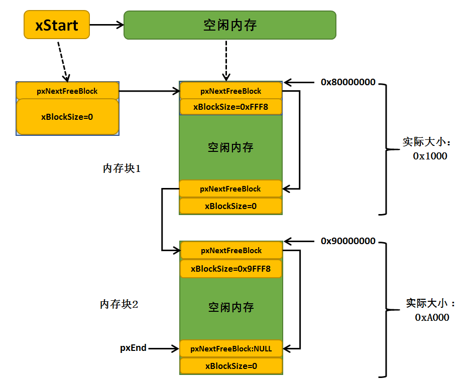

而对于heap_5.c方案的内存申请与释放函数，其实与heap_4.c方案是一样的，此处就不再重复赘述。

内存管理的实验
~~~~~~~~~~~~~~~~~~~~~

内存管理实验使用heap_4.c方案进行内存管理测试，创建了两个任务，分别是LED任务与内存管理测试任务，内存管理测试任务通过检测按键是否按下来申请内存或释放内存，当申请内存成功就像该内存写入一些数据，如当前系统的时间等信息，并且通过串口输出相关信息；LED任务是将LED翻转，表示系统处于运行状态。
在不需要再使用内存时，注意要及时释放该段内存，避免内存泄露，源码具体见 代码清单23_16_ 高亮部分。

.. code-block:: c
    :caption: 代码清单‑16内存管理的实验
    :emphasize-lines: 151-194
    :name:  代码清单23_16
    :linenos:

	/**
	******************************************************************
	* @file    main.c
	* @author  fire
	* @version V1.0
	* @date    2018-xx-xx
	* @brief   内存管理
	******************************************************************
	* @attention
	*
	* 实验平台:野火  i.MXRT1052开发板
	* 论坛    :http://www.firebbs.cn
	* 淘宝    :http://firestm32.taobao.com
	*
	******************************************************************
	*/
	#include"fsl_debug_console.h"
	
	#include"board.h"
	#include"pin_mux.h"
	#include"clock_config.h"
	
	#include"./led/bsp_led.h"
	#include"./key/bsp_key.h"
	
	#include <stdio.h>
	/* FreeRTOS头文件 */
	#include"FreeRTOS.h"
	#include"task.h"
	/**************************** 任务句柄 ********************************/
	/*
	* 任务句柄是一个指针，用于指向一个任务，当任务创建好之后，它就具有了一个任务句柄
	* 以后我们要想操作这个任务都需要通过这个任务句柄，如果是自身的任务操作自己，那么
	* 这个句柄可以为NULL。
	*/
	static TaskHandle_t AppTaskCreate_Handle = NULL;/* 创建任务句柄 */
	static TaskHandle_t LED_Task_Handle = NULL;/* LED_Task任务句柄 */
	static TaskHandle_t Test_Task_Handle = NULL;/* Test_Task任务句柄 */
	
	
	
	/*********************** 全局变量声明 ************************************/
	/*
	* 当我们在写应用程序的时候，可能需要用到一些全局变量。
	*/
	uint8_t *Test_Ptr = NULL;
	
	
	/*
	*************************************************************************
	*                             函数声明
	*************************************************************************
	*/
	static void AppTaskCreate(void);/* 用于创建任务 */
	
	static void LED_Task(void* pvParameters);/* LED_Task任务实现 */
	static void Test_Task(void* pvParameters);/* Test_Task任务实现 */
	
	static void BSP_Init(void);/* 用于初始化板载相关资源 */
	
	/*****************************************************************
	* @brief  主函数
	* @param  无
	* @retval 无
	* @note   第一步：开发板硬件初始化
	第二步：创建APP应用任务
	第三步：启动FreeRTOS，开始多任务调度
	****************************************************************/
	int main(void)
	{
		BaseType_t xReturn = pdPASS;/* 定义一个创建信息返回值，默认为pdPASS */
	/* 开发板硬件初始化 */
    BSP_Init();
    PRINTF("这是一个[野火]-全系列开发板-FreeRTOS内存管理实验\n");
    PRINTF("按下KEY1申请内存，按下KEY2释放内存\n");
	/* 创建AppTaskCreate任务 */
		xReturn = xTaskCreate((TaskFunction_t )AppTaskCreate,  /* 任务入口函数 

					(const char*    )"AppTaskCreate",/* 任务名字 */
					(uint16_t       )512,  /* 任务栈大小 */
					(void*          )NULL,/* 任务入口函数参数 */
					(UBaseType_t    )1, /* 任务的优先级 */
					(TaskHandle_t*  )&AppTaskCreate_Handle);/* 任务控制块指针 

	/* 启动任务调度 */
	if (pdPASS == xReturn)
			vTaskStartScheduler();   /* 启动任务，开启调度 */
	else
	return -1;

	while (1);  /* 正常不会执行到这里 */
	}

	/***********************************************************************
	* @ 函数名： AppTaskCreate
	* @ 功能说明：为了方便管理，所有的任务创建函数都放在这个函数里面
	* @ 参数：无
	* @ 返回值：无
	**********************************************************************/
	static void AppTaskCreate(void)
	{
		BaseType_t xReturn = pdPASS;/* 定义一个创建信息返回值，默认为pdPASS */
	
		taskENTER_CRITICAL();           //进入临界区
	
	/* 创建LED_Task任务 */
		xReturn = xTaskCreate((TaskFunction_t )LED_Task, /* 任务入口函数 */
					(const char*    )"LED_Task",/* 任务名字 */
					(uint16_t       )512,   /* 任务栈大小 */
					(void*          )NULL,  /* 任务入口函数参数 */
					(UBaseType_t    )2,     /* 任务的优先级 */
					(TaskHandle_t*  )&LED_Task_Handle);/* 任务控制块指针 */
	if (pdPASS == xReturn)
			PRINTF("创建LED_Task任务成功\n");
	
	/* 创建Test_Task任务 */
		xReturn = xTaskCreate((TaskFunction_t )Test_Task,  /* 任务入口函数 */
					(const char*    )"Test_Task",/* 任务名字 */
					(uint16_t       )512,  /* 任务栈大小 */
					(void*          )NULL,/* 任务入口函数参数 */
					(UBaseType_t    )3, /* 任务的优先级 */
					(TaskHandle_t*  )&Test_Task_Handle);/* 任务控制块指针 */
	if (pdPASS == xReturn)
			PRINTF("创建Test_Task任务成功\n\n");
	
		vTaskDelete(AppTaskCreate_Handle); //删除AppTaskCreate任务
	
		taskEXIT_CRITICAL();            //退出临界区
	}
	
	/**********************************************************************
	* @ 函数名： LED_Task
	* @ 功能说明： LED_Task任务主体
	* @ 参数：
	* @ 返回值：无
	********************************************************************/
	static void LED_Task(void* parameter)
	{
	while (1) {
			LED1_TOGGLE;
			vTaskDelay(1000);/* 延时1000个tick */
		}
	}

	/**********************************************************************
	* @ 函数名： Test_Task
	* @ 功能说明： Test_Task任务主体
	* @ 参数：
	* @ 返回值：无
	********************************************************************/
	static void Test_Task(void* parameter)
	{
	uint32_t g_memsize;
	while (1) {
	if ( Key_Scan(KEY1_GPIO_PORT,KEY1_PIN) == KEY_ON ) {
	/* KEY1 被按下 */
	if (NULL == Test_Ptr) {

	/* 获取当前内存大小 */
				g_memsize = xPortGetFreeHeapSize();
				PRINTF("系统当前内存大小为 %d 字节，开始申请内存\n",g_memsize);
				Test_Ptr = pvPortMalloc(1024);
	if (NULL != Test_Ptr) {
				PRINTF("内存申请成功\n");
				PRINTF("申请到的内存地址为%#x\n",(int)Test_Ptr);

	/* 获取当前内剩余存大小 */
				g_memsize = xPortGetFreeHeapSize();
				PRINTF("系统当前内存剩余存大小为 %d 字节\n",g_memsize);

	//向Test_Ptr中写入当数据:当前系统时间
		sprintf((char*)Test_Ptr,"当前系统TickCount = %d\n",xTaskGetTickCount());
					PRINTF("写入的数据是 %s\n",(char*)Test_Ptr);
					}
				} else {
					PRINTF("请先按下KEY2释放内存再申请\n");
				}
			}
	if ( Key_Scan(KEY2_GPIO_PORT,KEY2_PIN) == KEY_ON ) {
	/* KEY2 被按下 */
	if (NULL != Test_Ptr) {
					PRINTF("释放内存\n");
					vPortFree(Test_Ptr);  //释放内存
					Test_Ptr=NULL;
	/* 获取当前内剩余存大小 */
					g_memsize = xPortGetFreeHeapSize();
					PRINTF("系统当前内存大小为 %d 字节，内存释放完成\n",g_memsize);
				} else {
					PRINTF("请先按下KEY1申请内存再释放\n");
				}
			}
	        vTaskDelay(20);/* 延时20个tick */
    	}
	}

	/***********************************************************************
	* @ 函数名： BSP_Init
	* @ 功能说明：板级外设初始化，所有板子上的初始化均可放在这个函数里面
	* @ 参数：
	* @ 返回值：无
	*********************************************************************/
	static void BSP_Init(void)
	{
	/* 初始化内存保护单元 */
		BOARD_ConfigMPU();
	/* 初始化开发板引脚 */
		BOARD_InitPins();
	/* 初始化开发板时钟 */
		BOARD_BootClockRUN();
	/* 初始化调试串口 */
		BOARD_InitDebugConsole();
	/* 打印系统时钟 */
		PRINTF("\r\n");
		PRINTF("*****欢迎使用野火i.MX RT1052 开发板*****\r\n");
		PRINTF("CPU:             %d Hz\r\n", CLOCK_GetFreq(kCLOCK_CpuClk));
		PRINTF("AHB:             %d Hz\r\n", CLOCK_GetFreq(kCLOCK_AhbClk));
		PRINTF("SEMC:            %d Hz\r\n", CLOCK_GetFreq(kCLOCK_SemcClk));
		PRINTF("SYSPLL:          %d Hz\r\n", CLOCK_GetFreq(kCLOCK_SysPllClk));
		PRINTF("SYSPLLPFD0:      %d Hz\r\n", CLOCK_GetFreq(kCLOCK_SysPllPfd0Clk));
		PRINTF("SYSPLLPFD1:      %d Hz\r\n", CLOCK_GetFreq(kCLOCK_SysPllPfd1Clk));
		PRINTF("SYSPLLPFD2:      %d Hz\r\n", CLOCK_GetFreq(kCLOCK_SysPllPfd2Clk));
		PRINTF("SYSPLLPFD3:      %d Hz\r\n", CLOCK_GetFreq(kCLOCK_SysPllPfd3Clk));

	/* 初始化SysTick */
		SysTick_Config(SystemCoreClock / configTICK_RATE_HZ);

	/* 硬件BSP初始化统统放在这里，比如LED，串口，LCD等 */

	/* LED 端口初始化 */
		LED_GPIO_Config();

	/* KEY 端口初始化 */
		Key_GPIO_Config();

	}
	/****************************END OF FILE**********************/

 

 

内存管理的实验现象
~~~~~~~~~~~~~~~~~~

程序编译好，用USB线连接电脑和开发板的USB接口（对应丝印为USB转串口），用DAP仿真器把配套程序下载到野火I.MX
RT系列开发板（具体型号根据你买的板子而定，每个型号的板子都配套有对应的程序），在电脑上打开串口调试助手，然后复位开发板，我们按下KEY1申请内存，
然后按下KEY2释放内存，可以在调试助手中看到串口打印信息与运行结果，开发板的LED也在闪烁，具体见 图23_14_。

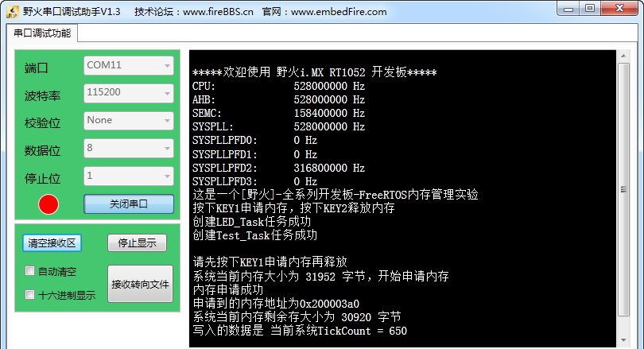

