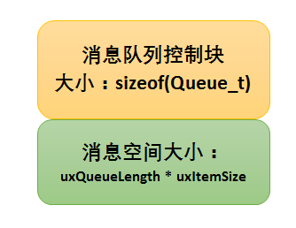
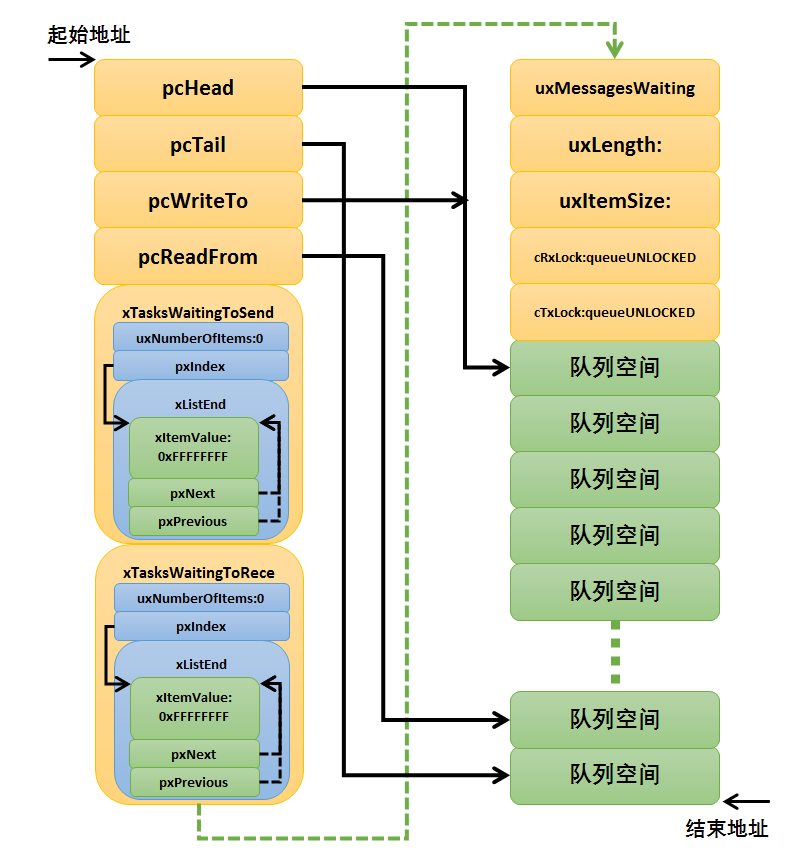
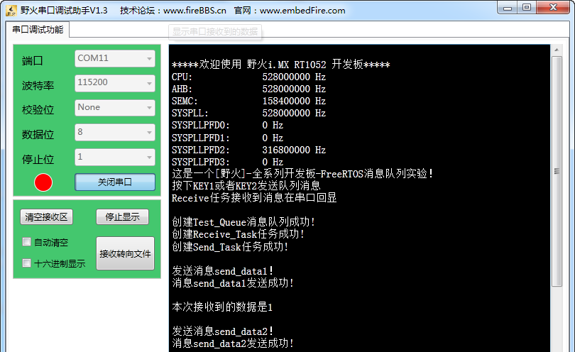

.. vim: syntax=rst

消息队列
================

同学们，回想一下，在我们裸机的编程中，我们是怎么样用全局的一个数组的呢？

消息队列的基本概念
~~~~~~~~~~~~~~~~~~

队列又称消息队列，是一种常用于任务间通信的数据结构，队列可以在任务与任务间、中断和任务间传递信息，实现了任务接收来自其他任务或中断的不固定长度的消息，任务能够从队列里面读取消息，当队列中的消息是空时，读取消息的任务将被阻塞，用户还可以指定阻塞的任务时间xTicksToWait，在这段时间中，如果队列
为空，该任务将保持阻塞状态以等待队列数据有效。当队列中有新消息时，被阻塞的任务会被唤醒并处理新消息；当等待的时间超过了指定的阻塞时间，即使队列中尚无有效数据，任务也会自动从阻塞态转为就绪态。消息队列是一种异步的通信方式。

通过消息队列服务，任务或中断服务例程可以将一条或多条消息放入消息队列中。同样，一个或多个任务可以从消息队列中获得消息。当有多个消息发送到消息队列时，通常是将先进入消息队列的消息先传给任务，也就是说，任务先得到的是最先进入消息队列的消息，即先进先出原则（FIFO），但是也支持后进先出原则（LIFO）。

FreeRTOS中使用队列数据结构实现任务异步通信工作，具有如下特性：

-  消息支持先进先出方式排队，支持异步读写工作方式。

-  读写队列均支持超时机制。

-  消息支持后进先出方式排队，往队首发送消息（LIFO）。

-  可以允许不同长度（不超过队列节点最大值）的任意类型消息。

-  一个任务能够从任意一个消息队列接收和发送消息。

-  多个任务能够从同一个消息队列接收和发送消息。

-  当队列使用结束后，可以通过删除队列函数进行删除。

消息队列的运作机制
~~~~~~~~~~~~~~~~~~

创建消息队列时FreeRTOS会先给消息队列分配一块内存空间，这块内存的大小等于消息队列控制块大小加上（单个消息空间大小与消息队列长度的乘积），接着再初始化消息队列，此时消息队列为空。FreeRTOS的消息队列控制块由多个元素组成，当消息队列被创建时，系统会为控制块分配对应的内存空间，用于保存消息队
列的一些信息如消息的存储位置，头指针pcHead、尾指针pcTail、消息大小uxItemSize以及队列长度uxLength等。同时每个消息队列都与消息空间在同一段连续的内存空间中，在创建成功的时候，这些内存就被占用了，只有删除了消息队列的时候，这段内存才会被释放掉，创建成功的时候就已经分配好每个
消息空间与消息队列的容量，无法更改，每个消息空间可以存放不大于消息大小uxItemSize的任意类型的数据，所有消息队列中的消息空间总数即是消息队列的长度，这个长度可在消息队列创建时指定。

任务或者中断服务程序都可以给消息队列发送消息，当发送消息时，如果队列未满或者允许覆盖入队，FreeRTOS会将消息拷贝到消息队列队尾，否则，会根据用户指定的阻塞超时时间进行阻塞，在这段时间中，如果队列一直不允许入队，该任务将保持阻塞状态以等待队列允许入队。当其它任务从其等待的队列中读取入了数据（队列
未满），该任务将自动由阻塞态转移为就绪态。当等待的时间超过了指定的阻塞时间，即使队列中还不允许入队，任务也会自动从阻塞态转移为就绪态，此时发送消息的任务或者中断程序会收到一个错误码errQUEUE_FULL。

发送紧急消息的过程与发送消息几乎一样，唯一的不同是，当发送紧急消息时，发送的位置是消息队列队头而非队尾，这样，接收者就能够优先接收到紧急消息，从而及时进行消息处理。

当某个任务试图读一个队列时，其可以指定一个阻塞超时时间。在这段时间中，如果队列为空，该任务将保持阻塞状态以等待队列数据有效。当其它任务或中断服务程序往其等待的队列中写入了数据，该任务将自动由阻塞态转移为就绪态。当等待的时间超过了指定的阻塞时间，即使队列中尚无有效数据，任务也会自动从阻塞态转移为就绪态
。

当消息队列不再被使用时，应该删除它以释放系统资源，一旦操作完成，消息队列将被永久性的删除。

消息队列的运作过程具体见 图17_1_。

.. image:: media/message_queue/messag002.png
   :align: center
   :name: 图17_1
   :alt: 图:Select_Device_ARMCM7_For_Target

消息队列的阻塞机制
~~~~~~~~~~~~~~~~~~

我们使用的消息队列一般不是属于某个任务的队列，在很多时候，我们创建的队列，是每个任务都可以去对他进行读写操作的，但是为了保护每个任务对它进行读写操作的过程，我们必须要有阻塞机制，在某个任务对它读写操作的时候，必须保证该任务能正常完成读写操作，而不受后来的任务干扰，凡事都有先来后到嘛！

那么，如何实现这个先来后到的机制呢，很简单，因为FreeRTOS已经为我们做好了，我们直接使用就好了，每个对消息队列读写的函数，都有这种机制，我称之为阻塞机制。假设有一个任务A对某个队列进行读操作的时候（也就是我们所说的出队），发现它没有消息，那么此时任务A有3个选择：第一个选择，任务A扭头就走，既
然队列没有消息，那我也不等了，干其它事情去，这样子任务A不会进入阻塞态；第二个选择，任务A还是在这里等等吧，可能过一会队列就有消息，此时任务A会进入阻塞状态，在等待着消息的道来，而任务A的等待时间就由我们自己定义，比如设置1000个系统时钟节拍tick的等待，在这1000个tick到来之前任务A都是
处于阻塞态，当阻塞的这段时间任务A等到了队列的消息，那么任务A就会从阻塞态变成就绪态，如果此时任务A比当前运行的任务优先级还高，那么，任务A就会得到消息并且运行；假如1000个tick都过去了，队列还没消息，那任务A就不等了，从阻塞态中唤醒，返回一个没等到消息的错误代码，然后继续执行任务A的其他代码
；第三个选择，任务A死等，不等到消息就不走了，这样子任务A就会进入阻塞态，直到完成读取队列的消息。

而在发送消息操作的时候，为了保护数据，当且仅当队列允许入队的时候，发送者才能成功发送消息；队列中无可用消息空间时，说明消息队列已满，此时，系统会根据用户指定的阻塞超时时间将任务阻塞，在指定的超时时间内如果还不能完成入队操作，发送消息的任务或者中断服务程序会收到一个错误码errQUEUE_FULL，然
后解除阻塞状态；当然，只有在任务中发送消息才允许进行阻塞状态，而在中断中发送消息不允许带有阻塞机制的，需要调用在中断中发送消息的API函数接口，因为发送消息的上下文环境是在中断中，不允许有阻塞的情况。

假如有多个任务阻塞在一个消息队列中，那么这些阻塞的任务将按照任务优先级进行排序，优先级高的任务将优先获得队列的访问权。

消息队列的应用场景
~~~~~~~~~~~~~~~~~~~~~~~~~~~

消息队列可以应用于发送不定长消息的场合，包括任务与任务间的消息交换，队列是FreeRTOS主要的任务间通讯方式，可以在任务与任务间、中断和任务间传送信息，发送到队列的消息是通过拷贝方式实现的，这意味着队列存储的数据是原数据，而不是原数据的引用。

消息队列控制块
~~~~~~~~~~~~~~~~

FreeRTOS的消息队列控制块由多个元素组成，当消息队列被创建时，系统会为控制块分配对应的内存空间，用于保存消息队列的一些信息如消息的存储位置，头指针pcHead、尾指针pcTail、消息大小uxItemSize以及队列长度uxLength，以及当前队列消息个数uxMessagesWaiting等
，具体见 代码清单17_1_。

.. code-block:: c
    :caption: 代码清单‑1消息队列控制块
    :name: 代码清单17_1
    :linenos:

	typedefstruct QueueDefinition {
	int8_t *pcHead;				(1)
	int8_t *pcTail;				(2)
	int8_t *pcWriteTo;				(3)
	
	union {
	int8_t *pcReadFrom;			(4)
			UBaseType_t uxRecursiveCallCount;	(5)	
		} u;
	
		List_t xTasksWaitingToSend;		(6)
	    List_t xTasksWaitingToReceive;		(7)

	volatile UBaseType_t uxMessagesWaiting;	(8)
		UBaseType_t uxLength;			(9)
		UBaseType_t uxItemSize;			(10)

	volatileint8_t cRxLock;			(11)
	volatileint8_t cTxLock;			(12)

	#if( ( configSUPPORT_STATIC_ALLOCATION == 1 )
	&& ( configSUPPORT_DYNAMIC_ALLOCATION == 1 ) )
	uint8_t ucStaticallyAllocated;
	#endif

	#if ( configUSE_QUEUE_SETS == 1 )
	struct QueueDefinition *pxQueueSetContainer;
	#endif

	#if ( configUSE_TRACE_FACILITY == 1 )
				UBaseType_t uxQueueNumber;
	uint8_t ucQueueType;
	#endif

			} xQUEUE;

	typedef xQUEUE Queue_t;

代码清单17_1_ **(1)**\ ：pcHead指向队列消息存储区起始位置，即第一个消息空间。

代码清单17_1_ **(2)**\ ：pcTail指向队列消息存储区结束位置地址。

代码清单17_1_ **(3)**\ ：pcWriteTo指向队列消息存储区下一个可用消息空间。

代码清单17_1_ **(4)**\
：pcReadFrom与uxRecursiveCallCount是一对互斥变量，使用联合体用来确保两个互斥的结构体成员不会同时出现。当结构体用于队列时，pcReadFrom指向出队消息空间的最后一个，见文知义，就是读取消息时候是从pcReadFrom指向的空间读取消息内容。

代码清单17_1_ **(5)**\ ：当结构体用于互斥量时，uxRecursiveCallCount用于计数，记录递归互斥量被“调用”的次数。

代码清单17_1_ **(6)**\ ：xTasksWaitingToSend是一个发送消息阻塞列表，用于保存阻塞在此队列的任务，任务按照优先级进行排序，由于队列已满，想要发送消息的任务无法发送消息。

代码清单17_1_ **(7)**\ ：xTasksWaitingToReceive是一个获取消息阻塞列表，用于保存阻塞在此队列的任务，任务按照优先级进行排序，由于队列是空的，想要获取消息的任务无法获取到消息。

代码清单17_1_ **(8)**\ ：uxMessagesWaiting用于记录当前消息队列的消息个数，如果消息队列被用于信号量的时候，这个值就表示有效信号量个数。

代码清单17_1_ **(9)**\ ：uxLength表示队列的长度，也就是能存放多少消息。

代码清单17_1_ **(10)**\ ：uxItemSize表示单个消息的大小。

代码清单17_1_ **(11)**\ ：队列上锁后，储存从队列收到的列表项数目，也就是出队的数量，如果队列没有上锁，设置为queueUNLOCKED。

代码清单17_1_ **(12)**\ ：队列上锁后，储存发送到队列的列表项数目，也就是入队的数量，如果队列没有上锁，设置为queueUNLOCKED。

这两个成员变量为queueUNLOCKED时，表示队列未上锁；当这两个成员变量为queueLOCKED_UNMODIFIED时，表示队列上锁。

消息队列常用函数讲解
~~~~~~~~~~~~~~~~~~~~~~~~~~~~~~

使用队列模块的典型流程如下：

-  创建消息队列。

-  写队列操作。

-  读队列操作。

-  删除队列。

消息队列创建函数xQueueCreate()
^^^^^^^^^^^^^^^^^^^^^^^^^^^^^^^^^^^^^^^^^^^^

xQueueCreate()用于创建一个新的队列并返回可用于访问这个队列的队列句柄。队列句柄其实就是一个指向队列数据结构类型的指针。

队列就是一个数据结构，用于任务间的数据的传递。每创建一个新的队列都需要为其分配RAM，一部分用于存储队列的状态，剩下的作为队列消息的存储区域。使用xQueueCreate()创建队列时，使用的是动态内存分配，所以要想使用该函数必须在FreeRTOSConfig.h中把\
`configSUPPORT_DYNAMIC_ALLOCATION <http://www.freertos.org/a00110.html#configSUPPORT_DYNAMIC_ALLOCATION>`__\
定义为1来使能，这是个用于使能动态内存分配的宏，通常情况下，在FreeRTOS中，凡是创建任务，队列，信号量和互斥量等内核对象都需要使用动态内存分配，所以这个宏默认在FreeRTOS.h头文件中已经使能（即定义为1）。如果想使用静态内存，则可以使用\ `xQueueCreateStatic() <h
ttp://www.freertos.org/xQueueCreateStatic.html>`__ 函数来创建一个队列。使用静态创建消息队列函数创建队列时需要的形参更多，需要的内存由编译的时候预先分配好，一般很少使用这种方法。xQueueCreate()函数原型具体见 代码清单17_2_ 高亮部分，使用
说明具体见 xQueueCreate函数说明_。

.. code-block:: c
    :caption: 代码清单‑2xQueueCreate()函数原型
    :emphasize-lines: 1-4
    :name: 代码清单17_2
    :linenos:
	
	#if( configSUPPORT_DYNAMIC_ALLOCATION == 1 )
	#define xQueueCreate( uxQueueLength, uxItemSize ) 	\
	xQueueGenericCreate( ( uxQueueLength ), ( uxItemSize ), ( queueQUEUE_TYPE_BASE ) )
	#endif

.. list-table::
   :widths: 33 33
   :name: xQueueCreate函数说明
   :header-rows: 0

   * - **函数原型**
     - QueueHandle_t xQueueCreate( UBaseType_t uxQueueLength,UBaseType_t uxItemSize );

   * - **功能**
     - 于创建一个新的队列。

   * - **参数1**
     - uxQueueLengt   队列能够存储的最大消息单元数目，即队列长度。

   * - **参数2**
     - uxItemSize	队列中消息单元的大小，以字节为单位。

   * - **返回值**
     - 如果创建成功则返回一个队列句柄，用于访问创建的队列。如果创建不成功则返回NULL，可能原因是创建队列需要的RAM无法分配成功。

从函数原型中，我们可以看到，创建队列真正使用的函数是xQueueGenericCreate()，消息队列创建函数，顾名思义，就是创建一个队列，与任务一样，都是需要先创建才能使用的东西，FreeRTOS肯定不知道我们需要什么样的队列，比如队列的长度，消息的大小这些信息都是需要我们自己定义的，FreeR
TOS提供给我们这个创建函数，爱怎么搞都是我们自己来实现，下面来看看xQueueGenericCreate()函数源码，具体见 代码清单17_3_。

.. code-block:: c
    :caption: 代码清单‑3xQueueGenericCreate()函数源码
    :name: 代码清单17_3
    :linenos:

	/*-----------------------------------------------------------*/
	#if( configSUPPORT_DYNAMIC_ALLOCATION == 1 )
	
	QueueHandle_t xQueueGenericCreate( const UBaseType_t uxQueueLength,
	const UBaseType_t uxItemSize,
	const uint8_t ucQueueType )
	{
		Queue_t *pxNewQueue;
	size_t xQueueSizeInBytes;
	uint8_t *pucQueueStorage;
	
		configASSERT( uxQueueLength > ( UBaseType_t ) 0 );
	
	if ( uxItemSize == ( UBaseType_t ) 0 ) {
	/* 消息空间大小为0*/
			xQueueSizeInBytes = ( size_t ) 0;			(1)
		} else {
	/* 分配足够消息存储空间，空间的大小为队列长度*单个消息大小 */
			xQueueSizeInBytes = ( size_t ) ( uxQueueLength * uxItemSize );(2)
		}
	/* 向系统申请内存，内存大小为消息队列控制块大小+消息存储空间大小 */
		pxNewQueue=(Queue_t*)pvPortMalloc(sizeof(Queue_t)+xQueueSizeInBytes);(3)
	
	if ( pxNewQueue != NULL ) {
	/* 计算出消息存储空间的起始地址 */
			pucQueueStorage = ( ( uint8_t * ) pxNewQueue ) + sizeof( Queue_t );(4)
	
	#if( configSUPPORT_STATIC_ALLOCATION == 1 )
			{
	
				pxNewQueue->ucStaticallyAllocated = pdFALSE;
			}
	#endif
	
			prvInitialiseNewQueue( uxQueueLength,			(5)
									uxItemSize,
									pucQueueStorage,
									ucQueueType,
									pxNewQueue );
		}
	
	return pxNewQueue;
	}
	
	#endif
	/*-----------------------------------------------------------*/

代码清单17_3_ **(1)**\ ：如果uxItemSize为0，也就是单个消息空间大小为0，这样子就不需要申请内存了，那么xQueueSizeInBytes也设置为0即可，设置为0是可以的，用作信号量的时候这个就可以设置为0。

代码清单17_3_ **(2)**\ ：uxItemSize并不是为0，那么需要分配足够存储消息的空间，内存的大小为队列长度*单个消息大小。

代码清单17_3_ **(3)**\ ：FreeRTOS调用pvPortMalloc()函数向系统申请内存空间，内存大小为消息队列控制块大小加上消息存储空间大小，因为这段内存空间是需要保证连续的，具体见 图17_2_。

代码清单17_3_ **(4)**\ ：计算出消息存储内存空间的起始地址，因为\ **(3)**\ 步骤中申请的内存是包含了消息队列控制块的内存空间，但是我们存储消息的内存空间在消息队列控制块后面。

代码清单17_3_ **(5)**\ ：调用prvInitialiseNewQueue()函数将消息队列进行初始化。其实xQueueGenericCreate()主要是用于分配消息队列内存的，消息队列初始化函数源码具体见代码清单17‑4。

.. code-block:: c
    :caption: 代码清单‑4prvInitialiseNewQueue()函数源码
    :name: 代码清单17_4
    :linenos:

	/*-----------------------------------------------------------*/
	static void prvInitialiseNewQueue( const UBaseType_t uxQueueLength,(1)
	const UBaseType_t uxItemSize,(2)
	uint8_t *pucQueueStorage,	(3)
	const uint8_t ucQueueType,	(4)
										Queue_t *pxNewQueue )		(5)
	{
		( void ) ucQueueType;
	
	if ( uxItemSize == ( UBaseType_t ) 0 ) {
	/* 没有为消息存储分配内存,但是pcHead指针不能设置为NULL,
	因为队列用作互斥量时,pcHead要设置成NULL。
	这里只是将pcHead指向一个已知的区域 */
			pxNewQueue->pcHead = ( int8_t * ) pxNewQueue;		(6)
		} else {
	/* 设置pcHead指向存储消息的起始地址 */
			pxNewQueue->pcHead = ( int8_t * ) pucQueueStorage;	(7)
		}
	
	/* 初始化消息队列控制块的其他成员 */
		pxNewQueue->uxLength = uxQueueLength;			(8)
	    pxNewQueue->uxItemSize = uxItemSize;
	/* 重置消息队列 */
		( void ) xQueueGenericReset( pxNewQueue, pdTRUE );		(9)

	#if ( configUSE_TRACE_FACILITY == 1 )
		{
			pxNewQueue->ucQueueType = ucQueueType;
		}
	#endif

	#if( configUSE_QUEUE_SETS == 1 )
		{
			pxNewQueue->pxQueueSetContainer = NULL;
		}
	#endif

		traceQUEUE_CREATE( pxNewQueue );
	}
	/*-----------------------------------------------------------*/

代码清单17_4_ **(1)**\ ：消息队列长度。

代码清单17_4_ **(2)**\ ：单个消息大小。

代码清单17_4_ **(3)**\ ：存储消息起始地址。

代码清单17_4_ **(4)**\ ：消息队列类型：

-  queueQUEUE_TYPE_BASE：表示队列。

-  queueQUEUE_TYPE_SET：表示队列集合。

-  queueQUEUE_TYPE_MUTEX：表示互斥量。

-  queueQUEUE_TYPE_COUNTING_SEMAPHORE：表示计数信号量。

-  queueQUEUE_TYPE_BINARY_SEMAPHORE：表示二进制信号量。

-  queueQUEUE_TYPE_RECURSIVE_MUTEX ：表示递归互斥量。

代码清单17_4_ **(5)**\ ：消息队列控制块。

代码清单17_4_ **(6)**\ ：如果没有为消息队列分配存储消息的内存空间，而且pcHead指针不能设置为NULL，因为队列用作互斥量时，pcHead要设置成NULL，这里只能将pcHead指向一个已知的区域，指向消息队列控制块pxNewQueue。

代码清单17_4_ **(7)**\ ：如果分配了存储消息的内存空间，则设置pcHead指向存储消息的起始地址pucQueueStorage。

代码清单17_4_ **(8)**\ ：初始化消息队列控制块的其他成员，消息队列的长度与消息的大小。

代码清单17_4_ **(9)**\ ：重置消息队列，在消息队列初始化的时候，需要重置一下相关参数，具体见 代码清单17_5_。

.. code-block:: c
    :caption: 代码清单‑5重置消息队列xQueueGenericReset()源码
    :name: 代码清单17_5
    :linenos:

	/*-----------------------------------------------------------*/
	BaseType_t xQueueGenericReset( QueueHandle_t xQueue,
									BaseType_t xNewQueue )
	{
		Queue_t * const pxQueue = ( Queue_t * ) xQueue;
	
		configASSERT( pxQueue );
	
		taskENTER_CRITICAL();					(1)
	     {
         pxQueue->pcTail = pxQueue->pcHead +
	( pxQueue->uxLength * pxQueue->uxItemSize );	(2)
			pxQueue->uxMessagesWaiting = ( UBaseType_t ) 0U;	(3)
			pxQueue->pcWriteTo = pxQueue->pcHead;			(4)
			pxQueue->u.pcReadFrom = pxQueue->pcHead +
	(( pxQueue->uxLength - ( UBaseType_t ) 1U ) * pxQueue->uxItemSize );(5)
			pxQueue->cRxLock = queueUNLOCKED;			(6)
			pxQueue->cTxLock = queueUNLOCKED;	
	
	if ( xNewQueue == pdFALSE ) {				(7)
	if ( listLIST_IS_EMPTY
					( &( pxQueue->xTasksWaitingToSend ) ) == pdFALSE ) {
	if ( xTaskRemoveFromEventList
						( &( pxQueue->xTasksWaitingToSend ) ) != pdFALSE ) {
						queueYIELD_IF_USING_PREEMPTION();
					} else {
						mtCOVERAGE_TEST_MARKER();
					}
				} else {
					mtCOVERAGE_TEST_MARKER();
				}
			} else {						(8)
				vListInitialise( &( pxQueue->xTasksWaitingToSend ) );
				vListInitialise( &( pxQueue->xTasksWaitingToReceive ) );
			}
		}
		taskEXIT_CRITICAL();					(9)
	
	return pdPASS;
	}
	/*-----------------------------------------------------------*/

代码清单17_5_ **(1)**\ ：进入临界段。

代码清单17_5_ **(2)**\ ：重置消息队列的成员变量，pcTail指向存储消息内存空间的结束地址。

代码清单17_5_ **(3)**\ ：当前消息队列中的消息个数uxMessagesWaiting为0。

代码清单17_5_ **(4)**\ ：pcWriteTo指向队列消息存储区下一个可用消息空间，因为是重置消息队列，就指向消息队列的第一个消息空间，也就是pcHead指向的空间。

代码清单17_5_ **(5)**\ ：pcReadFrom指向消息队列最后一个消息空间。

代码清单17_5_ **(6)**\ ：消息队列没有上锁，设置为queueUNLOCKED。

代码清单17_5_ **(7)**\ ：如果不是新建一个消息队列，那么之前的消息队列可能阻塞了一些任务，需要将其解除阻塞。如果有发送消息任务被阻塞，那么需要将它恢复，而如果任务是因为读取消息而阻塞，那么重置之后的消息队列也是空的，则无需被恢复。

代码清单17_5_ **(8)**\ ：如果是新创建一个消息队列，则需要将xTasksWaitingToSend列表与xTasksWaitingToReceive列表初始化，列表的初始化在前面的章节已经讲解了，具体见6.2 小节。

代码清单17_5_ **(9)**\ ：退出临界段。

至此，消息队列的创建就讲解完毕，创建完成的消息队列示意图具体见 图17_3_。

在创建消息队列的时候，是需要用户自己定义消息队列的句柄的，但是注意了，定义了队列的句柄并不等于创建了队列，创建队列必须是调用消息队列创建函数进行创建（可以是静态也可以是动态创建），否则，以后根据队列句柄使用消息队列的其它函数的时候会发生错误，创建完成会返回消息队列的句柄，用户通过句柄就可使用消息队列
进行发送与读取消息队列的操作，如果返回的是NULL则表示创建失败，消息队列创建函数xQueueCreate()使用实例具体见 代码清单17_6_ 高亮部分。

.. code-block:: c
    :caption: 代码清单‑6xQueueCreate()实例
    :emphasize-lines: 11-14
    :name: 代码清单17_6
    :linenos:

	QueueHandle_t Test_Queue =NULL;
 
	#define  QUEUE_LEN    4/* 队列的长度，最大可包含多少个消息 */
	#define  QUEUE_SIZE   4/* 队列中每个消息大小（字节） */
	
	BaseType_t xReturn = pdPASS;/* 定义一个创建信息返回值，默认为pdPASS */

	taskENTER_CRITICAL();           //进入临界区

	/* 创建Test_Queue */
	Test_Queue = xQueueCreate((UBaseType_t ) QUEUE_LEN,/* 消息队列的长度 */
							(UBaseType_t ) QUEUE_SIZE);/* 消息的大小 */
	if (NULL != Test_Queue)
		printf("创建Test_Queue消息队列成功!\r\n");

	taskEXIT_CRITICAL();            //退出临界区

 

消息队列静态创建函数xQueueCreateStatic()
^^^^^^^^^^^^^^^^^^^^^^^^^^^^^^^^^^^^^^^^^^^^^^^^^^^^^^^^^^^^

xQueueCreateStatic()用于创建一个新的队列并返回可用于访问这个队列的队列句柄。队列句柄其实就是一个指向队列数据结构类型的指针。

队列就是一个数据结构，用于任务间的数据的传递。每创建一个新的队列都需要为其分配RAM，一部分用于存储队列的状态，剩下的作为队列的存储区。使用xQueueCreateStatic()创建队列时，使用的是静态内存分配，所以要想使用该函数必须在FreeRTOSConfig.h中把configSUPPORT
_STATIC_ALLOCATION定义为1来使能。这是个用于使能静态内存分配的宏，需要的内存在程序编译的时候分配好，由用户自己定义，其实创建过程与xQueueCreate()都是差不多的，我们暂不深入讲解。
xQueueCreateStatic()函数的具体说明见表 xQueueCreateStatic函数说明_，使用实例具体见 代码清单17_7_ 高亮部分。

.. list-table::
   :widths: 33 33
   :name: xQueueCreateStatic函数说明
   :header-rows: 0

   * - **函数原型**
     - QueueHandle_t xQueueCreateStatic(UBaseType_t uxQueueLength,UBaseType_t uxItemSize,uint8_t \*pucQueueStorageBuffer,StaticQueue_t \*pxQueueBuffer );

   * - **功能**
     - 于创建一个新的队列。

   * - **参数**
     - uxQueueLength	队列能够存储的最大单元数目，即队列深度。

   * - **参数**
     - uxItemSize	队列中数据单元的长度，以字节为单位。

   * - **参数**
     - pucQueueStorageBuffer	指针，指向一个uint8_t类型的数组，数组的大小至少
       有uxQueueLength* uxItemSize个字节。当uxItemSize为0时，pucQueueStorageBuffer可以为NULL。

   * - **参数**
     - pxQueueBuffer	指针，指向StaticQueue_t类型的变量，该变量用于存储队列的数据结构。

   * - **返回值**
     - 如果创建成功则返回一个队列句柄，用于访问创建的队列。如
       果创建不成功则返回NULL，可能原因是创建队列需要的RAM无法分配成功。

.. code-block:: c
    :caption: 代码清单‑7xQueueCreateStatic()函数使用实例
    :name: 代码清单17_7
    :emphasize-lines: 9,15-19
    :linenos:

	/* 创建一个可以最多可以存储10个64位变量的队列 */
	#define QUEUE_LENGTH    10
	#define ITEM_SIZE       sizeof( uint64_t )
	
	/* 该变量用于存储队列的数据结构 */
	static StaticQueue_t xStaticQueue;
	
	/* 该数组作为队列的存储区域，大小至少有uxQueueLength * uxItemSize个字节 */
	uint8_t ucQueueStorageArea[ QUEUE_LENGTH * ITEM_SIZE ];

	void vATask( void *pvParameters )
	{
		QueueHandle_t xQueue;

	/* 创建一个队列 */
		xQueue = xQueueCreateStatic( QUEUE_LENGTH,      /* 队列深度 */
									ITEM_SIZE,         /* 队列数据单元的单位 */
									ucQueueStorageArea,/* 队列的存储区域 */
	&xStaticQueue );   /* 队列的数据结构 */
	/* 剩下的其他代码 */
	}

消息队列删除函数vQueueDelete()
^^^^^^^^^^^^^^^^^^^^^^^^^^^^^^^^^^^^^^^^^^^^

队列删除函数是根据消息队列句柄直接删除的，删除之后这个消息队列的所有信息都会被系统回收清空，而且不能再次使用这个消息队列了，但是需要注意的是，如果某个消息队列没有被创建，那也是无法被删除的，动脑子想想都知道，没创建的东西就不存在，怎么可能被删除。xQueue是vQueueDelete()函数的形参，
是消息队列句柄，表示的是要删除哪个想队列，其函数源码具体见 代码清单17_8_。

.. code-block:: c
    :caption: 代码清单‑8消息队列删除函数vQueueDelete()源码（已省略暂时无用部分）
    :name: 代码清单17_8
    :linenos:

	void vQueueDelete( QueueHandle_t xQueue )
	{
		Queue_t * const pxQueue = ( Queue_t * ) xQueue;
	
	/* 断言 */
		configASSERT( pxQueue );				(1)
		traceQUEUE_DELETE( pxQueue );
	
	#if ( configQUEUE_REGISTRY_SIZE > 0 )
		{
	/* 将消息队列从注册表中删除，我们目前没有添加到注册表中，暂时不用理会 */
			vQueueUnregisterQueue( pxQueue );		(2)
		}
	#endif
	
	#if( ( configSUPPORT_DYNAMIC_ALLOCATION == 1 )
	&& ( configSUPPORT_STATIC_ALLOCATION == 0 ) ) {
	/* 因为用的消息队列是动态分配内存的，所以需要调用
				vPortFree来释放消息队列的内存 */
			vPortFree( pxQueue );				(3)
		}
	}

代码清单17_8_ **(1)**\ ：对传入的消息队列句柄进行检查，如果消息队列是有效的才允许进行删除操作。

代码清单17_8_ **(2)**\ ：将消息队列从注册表中删除，我们目前没有添加到注册表中，暂时不用理会。

代码清单17_8_ **(3)**\ ：因为用的消息队列是动态分配内存的，所以需要调用vPortFree()函数来释放消息队列的内存。

消息队列删除函数vQueueDelete()的使用也是很简单的，只需传入要删除的消息队列的句柄即可，调用函数时，系统将删除这个消息队列。需要注意的是调用删除消息队列函数前，系统应存在xQueueCreate()或xQueueCreateStatic()函数创建的消息队列。此外vQueueDelete
()也可用于删除信号量。如果删除消息队列时，有任务正在等待消息，则不应该进行删除操作（官方说的是不允许进行删除操作，
但是源码并没有禁止删除的操作，使用的时候注意一下就行了），删除消息队列的实例具体见 代码清单17_9_ 高亮部分。

.. code-block:: c
    :caption: 代码清单‑9消息队列删除函数vQueueDelete()使用实例
    :emphasize-lines: 13-14
    :name: 代码清单17_9
    :linenos:

	#define QUEUE_LENGTH    5
	#define QUEUE_ITEM_SIZE 4

	int main( void )
	{
		QueueHandle_t xQueue;
	/* 创建消息队列 */
		xQueue = xQueueCreate( QUEUE_LENGTH, QUEUE_ITEM_SIZE );

	if ( xQueue == NULL ) {
	/* 消息队列创建失败 */
		} else {
	/* 删除已创建的消息队列 */
			vQueueDelete( xQueue );
		}
	}

向消息队列发送消息函数
^^^^^^^^^^^^^^^^^^^^^^

任务或者中断服务程序都可以给消息队列发送消息，当发送消息时，如果队列未满或者允许覆盖入队，FreeRTOS会将消息拷贝到消息队列队尾，否则，会根据用户指定的阻塞超时时间进行阻塞，在这段时间中，如果队列一直不允许入队，该任务将保持阻塞状态以等待队列允许入队。当其它任务从其等待的队列中读取入了数据（队列
未满），该任务将自动由阻塞态转为就绪态。当任务等待的时间超过了指定的阻塞时间，即使队列中还不允许入队，任务也会自动从阻塞态转移为就绪态，此时发送消息的任务或者中断程序会收到一个错误码errQUEUE_FULL。

发送紧急消息的过程与发送消息几乎一样，唯一的不同是，当发送紧急消息时，发送的位置是消息队列队头而非队尾，这样，接收者就能够优先接收到紧急消息，从而及时进行消息处理。

其实消息队列发送函数有好几个，都是使用宏定义进行展开的，有些只能在任务调用，有些只能在中断中调用，具体见下面讲解。

xQueueSend()与xQueueSendToBack()
''''''''''''''''''''''''''''''''''''''''''''''''''''''''''''''

.. code-block:: c
    :caption: 代码清单‑10 xQueueSend()函数原型
    :name: 代码清单17_10
    :linenos:

	#define xQueueSend( xQueue, pvItemToQueue, xTicksToWait ) 	\
 	xQueueGenericSend( ( xQueue ), ( pvItemToQueue ), 	\
 				( xTicksToWait ), queueSEND_TO_BACK )

.. code-block:: c
    :caption: 代码清单‑11 xQueueSendToBack()
    :name: 代码清单17_11
    :linenos:

	#define xQueueSendToBack( xQueue, pvItemToQueue, xTicksToWait ) 	\
	xQueueGenericSend( ( xQueue ), ( pvItemToQueue ), 	\
				( xTicksToWait ), queueSEND_TO_BACK )

xQueueSend()是一个宏，宏展开是调用函数xQueueGenericSend()，这个函数在后面会详细讲解其实现过程。该宏是为了向后兼容没有包含xQueueSendToFront()和xQueueSendToBack() 这两个宏的FreeRTOS版本。xQueueSend()等同于xQue
ueSendToBack()。

xQueueSend()用于向队列尾部发送一个队列消息。消息以拷贝的形式入队，而不是以引用的形式。该函数绝对不能在中断服务程序里面被调用，
中断中必须使用带有中断保护功能的xQueueSendFromISR()来代替。xQueueSend()函数的具体说明见表 xQueueSend函数说明_，应用实例具体见 代码清单17_12_ 高亮部分。

.. list-table::
   :widths: 33 33
   :name: xQueueSend函数说明
   :header-rows: 0

   * - **函数原型**
     - BaseType_t xQueueSend(QueueHandle_t xQueue,const void * pvItemToQueue,TickType_t xTicksToWait);

   * - **功能**
     - 用于向队列尾部发送一个队列消息。

   * - **参数**
     - xQueue	队列句柄。

   * - **参数**
     - pvItemToQueue	指针，指向要发送到队列尾部的队列消息。

   * - **参数**
     - xTicksToWait	队列满时，等待队列空闲的最大超时时间。如果队列满并且xTicksToWait被设置成0，函数立刻返回。超时时间的单位为系统节拍周期，常量portTICK_PERIOD_MS用于辅助计算真实的时间，单位为ms。如果INCLUDE_vTaskSuspend设置成1，并且指定延时为portMAX_DELAY将导致任务挂起（没有超时）。

   * - **返回值**
     - 消息发送成功成功返回pdTRUE，否则返回errQUEUE_FULL。

.. code-block:: c
    :caption: 代码清单‑12xQueueSend()函数使用实例
    :name: 代码清单17_12
    :emphasize-lines: 9-14,18-23
    :linenos:

    static void Send_Task(void* parameter)
    {
        BaseType_t xReturn = pdPASS;/* 定义一个创建信息返回值，默认为pdPASS */
    uint32_t send_data1 = 1;
    uint32_t send_data2 = 2;
    while (1) {
    if ( Key_Scan(KEY1_GPIO_PORT,KEY1_GPIO_PIN) == KEY_ON ) {
    /* K1 被按下 */
                printf("发送消息send_data1！\n");
                xReturn = xQueueSend( Test_Queue, /* 消息队列的句柄 */
    &send_data1,/* 发送的消息内容 */
                                    0 );        /* 等待时间 0 */
    if (pdPASS == xReturn)
                    printf("消息send_data1发送成功!\n\n");
            }
    if ( Key_Scan(KEY2_GPIO_PORT,KEY2_GPIO_PIN) == KEY_ON ) {
    /* K2 被按下 */
                printf("发送消息send_data2！\n");
                xReturn = xQueueSend( Test_Queue, /* 消息队列的句柄 */
    &send_data2,/* 发送的消息内容 */
                                    0 );        /* 等待时间 0 */
    if (pdPASS == xReturn)
                    printf("消息send_data2发送成功!\n\n");
            }
            vTaskDelay(20);/* 延时20个tick */
        }
    }

xQueueSendFromISR()与xQueueSendToBackFromISR()
''''''''''''''''''''''''''''''''''''''''''''''''''''''''''''''''''''''''''''''''''''''''''

.. code-block:: c
    :caption: 代码清单‑13xQueueSendFromISR()函数原型
    :name: 代码清单17_13
    :linenos:

	#define xQueueSendToFrontFromISR(xQueue,pvItemToQueue,pxHigherPriorityTaskWoken) \
	xQueueGenericSendFromISR( ( xQueue ), ( pvItemToQueue ),\
	 ( pxHigherPriorityTaskWoken ), queueSEND_TO_FRONT )

.. code-block:: c
    :caption: 代码清单‑14 xQueueSendToBackFromISR()函数原型
    :name: 代码清单17_14
    :linenos:

	#define xQueueSendToBackFromISR(xQueue,pvItemToQueue,pxHigherPriorityTaskWoken) \
	xQueueGenericSendFromISR( ( xQueue ), ( pvItemToQueue ), \
	 ( pxHigherPriorityTaskWoken ), queueSEND_TO_BACK )

xQueueSendFromISR()是一个宏，宏展开是调用函数xQueueGenericSendFromISR()。该宏是xQueueSend()的中断保护版本，用于在中断服务程序中向队列尾部发送一个队列消息，
等价于xQueueSendToBackFromISR()。xQueueSendFromISR()函数具体说明见表格 xQueueSendFromISR函数说明_，使用实例具体见 代码清单17_15_ 高亮部分。

.. list-table::
   :widths: 33 33
   :name: xQueueSendFromISR函数说明
   :header-rows: 0

   * - **函数原型**
     - BaseType_t xQueueSendFromISR(QueueHandle_t xQueue,const void \*pvItemToQueue,BaseType_t \*pxHigherPriorityTaskWoken);

   * - **功能**
     - 在中断服务程序中用于向队列尾部发送一个消息。

   * - **参数**
     - xQueue	队列句柄。

   * - **参数**
     - pvItemToQueue	指针，指向要发送到队列尾部的消息。

   * - **参数**
     - pxHigherPriorityTaskWoken	如果入队导致一个任务解锁，并且解锁的任务优先级高于当前被中断的任务，则将*pxHigherPriorityTaskWoken设置成pdTRUE，然后在中断退出前需要进行一次上下文切换，去执行被唤醒的优先级更高的任务。从FreeRTOS V7.3.0起，pxHigherPriorityTaskWoken作为一个可选参数，可以设置为NULL。

   * - **返回值**
     - 消息发送成功返回pdTRUE，否则返回errQUEUE_FULL。

.. code-block:: c
    :caption: 代码清单‑15xQueueSendFromISR()函数使用实例
    :name: 代码清单17_15
    :emphasize-lines: 4,7,14-15,19-23
    :linenos:

    void vBufferISR( void )
    {
        char cIn;
        BaseType_t xHigherPriorityTaskWoken;

        /* 在ISR开始的时候，我们并没有唤醒任务 */
        xHigherPriorityTaskWoken = pdFALSE;

        /* 直到缓冲区为空 */
    do {
            /* 从缓冲区获取一个字节的数据 */
            cIn = portINPUT_BYTE( RX_REGISTER_ADDRESS );

            /* 发送这个数据 */
            xQueueSendFromISR( xRxQueue, &cIn, &xHigherPriorityTaskWoken );

        } while ( portINPUT_BYTE( BUFFER_COUNT ) );

    /* 这时候buffer已经为空，如果需要则进行上下文切换 */
    if ( xHigherPriorityTaskWoken ) {
            /* 上下文切换，这是一个宏，不同的处理器，具体的方法不一样 */
            taskYIELD_FROM_ISR ();
        }
    }

xQueueSendToFront()
'''''''''''''''''''

.. code-block:: c
    :caption: 代码清单‑16xQueueSendToFront()函数原型
    :name: 代码清单17_16
    :linenos:

	#define xQueueSendToFront( xQueue, pvItemToQueue, xTicksToWait ) \
	xQueueGenericSend( ( xQueue ), ( pvItemToQueue ),	\
	( xTicksToWait ), queueSEND_TO_FRONT )

xQueueSendToFron()是一个宏，宏展开也是调用函数xQueueGenericSend()。xQueueSendToFront()用于向队列队首发送一个消息。消息以拷贝的形式入队，而不是以引用的形式。该函数绝不能在中断服务程序里面被调用，而是必须使用带有中断保护功能的xQueueSend
ToFrontFromISR ()来代替。xQueueSendToFron()函数的具体说明见表格 xQueueSendToFron函数说明_，使用方式与xQueueSend()函数一致。

表格‑5xQueueSendToFron()函数说明

.. list-table::
   :widths: 33 33
   :name: xQueueSendToFron函数说明
   :header-rows: 0

   * - **函数原型**
     - BaseType_t xQueueSendToFront( QueueHandle_t xQueue,const void \* pvItemToQueue,TickType_t xTicksToWait );

   * - **功能**
     - 于向队列队首发送一个消息。

   * - **参数**
     - xQueue	队列句柄。

   * - **参数**
     - pvItemToQueue	指针，指向要发送到队首的消息。

   * - **参数**
     - xTicksToWait	队列满时，等待队列空闲的最大超时时间。如果队列满并且xTicksToWait被设置成0，函数立刻返回。超时时间的单位为系统节拍周期，常量portTICK_PERIOD_MS用于辅助计算真实的时间，单位为ms。如果INCLUDE_vTaskSuspend设置成1，并且指定延时为portMAX_DELAY将导致任务无限阻塞（没有超时）。

   * - **返回值**
     - 发送消息成功返回pdTRUE，否则返回errQUEUE_FULL。

xQueueSendToFrontFromISR()
''''''''''''''''''''''''''

.. code-block:: c
    :caption: 代码清单‑17 xQueueSendToFrontFromISR()函数原型
    :name: 代码清单17_17
    :linenos:

    #define xQueueSendToFrontFromISR( xQueue,pvItemToQueue,pxHigherPriorityTaskWoken ) \
        xQueueGenericSendFromISR( ( xQueue ), ( pvItemToQueue ),		 \
        ( pxHigherPriorityTaskWoken ), queueSEND_TO_FRONT )

xQueueSendToFrontFromISR()是一个宏，宏展开是调用函数xQueueGenericSendFromISR()。该宏是xQueueSendToFront()的中断保护版本，用于在中断服务程序中向消息队列队首发送一个消息。
xQueueSendToFromISR()函数具体说明见表 xQueueSendToFromISR函数说明_，使用方式与xQueueSendFromISR()函数一致。

表格‑6xQueueSendToFromISR()函数说明

.. list-table::
   :widths: 33 33
   :name: xQueueSendToFromISR函数说明
   :header-rows: 0

   * - **函数原型**
     - BaseType_t xQueueSendToFrontFromISR(QueueHandle_t xQueue, const void \*pvItemToQueue,BaseType_t \*pxHigherPriorityTaskWoken);

   * - **功能**
     - 在中断服务程序中向消息队列队首发送一个消息。

   * - **参数**
     - xQueue	队列句柄。

   * - **参数**
     - pvItemToQueue	指针，指向要发送到队首的消息。

   * - **参数**
     - pxHigherPriorityTaskWoken	如果入队导致一个任务解锁，并且解锁的任务优先级高于当前被中断的任务，则将*pxHigherPriorityTaskWoken设置成pdTRUE，然后在中断退出前需要进行一次上下文切换，去执行被唤醒的优先级更高的任务。从FreeRTOS V7.3.0起，pxHigherPriorityTaskWoken作为一个可选参数，可以设置为NULL。

   * - **返回值**
     - 队列项投递成功返回pdTRUE，否则返回errQUEUE_FULL。

通用消息队列发送函数xQueueGenericSend()（任务）
''''''''''''''''''''''''''''''''''''''''''''''''''''''''''''''''''

上面看到的那些在任务中发送消息的函数都是xQueueGenericSend()展开的宏定义，真正起作用的就是xQueueGenericSend()函数，根据指定的参数不一样，发送消息的结果就不一样，
下面一起看看任务级的通用消息队列发送函数的实现过程，具体见 代码清单17_18_。

.. code-block:: c
    :caption: 代码清单‑18 xQueueGenericSend()\ **函数源码（已删减）**
    :name: 代码清单17_18
    :linenos:

	/*-----------------------------------------------------------*/
	BaseType_t xQueueGenericSend( QueueHandle_t xQueue,		(1)	
	const void * const pvItemToQueue,	(2)
								TickType_t xTicksToWait,		(3)
	const BaseType_t xCopyPosition )	(4)
	{
		BaseType_t xEntryTimeSet = pdFALSE, xYieldRequired;
		TimeOut_t xTimeOut;
		Queue_t * const pxQueue = ( Queue_t * ) xQueue;
	
	/* 已删除一些断言操作 */
	
	for ( ;; ) {
			taskENTER_CRITICAL();					(5)
			{
	/* 队列未满 */
	if ( ( pxQueue->uxMessagesWaiting < pxQueue->uxLength )
					|| ( xCopyPosition == queueOVERWRITE ) ) {	(6)	
					traceQUEUE_SEND( pxQueue );
					xYieldRequired =
	prvCopyDataToQueue( pxQueue, pvItemToQueue, xCopyPosition );(7)
	
	/* 已删除使用队列集部分代码 */
	/* 如果有任务在等待获取此消息队列 */
	if ( listLIST_IS_EMPTY(&(pxQueue->xTasksWaitingToReceive))==pdFALSE){(8)
	/* 将任务从阻塞中恢复 */
	if ( xTaskRemoveFromEventList(
	&( pxQueue->xTasksWaitingToReceive ) )!=pdFALSE) {(9)
	/* 如果恢复的任务优先级比当前运行任务优先级还高，
	那么需要进行一次任务切换 */
							queueYIELD_IF_USING_PREEMPTION();	(10)
						} else {
							mtCOVERAGE_TEST_MARKER();
						}
					} else if ( xYieldRequired != pdFALSE ) {
	/* 如果没有等待的任务，拷贝成功也需要任务切换 */
						queueYIELD_IF_USING_PREEMPTION();		(11)
					} else {
						mtCOVERAGE_TEST_MARKER();
					}

					taskEXIT_CRITICAL();				(12)
	return pdPASS;
				}
	/* 队列已满 */
	else {						(13)
	if ( xTicksToWait == ( TickType_t ) 0 ) {
	/* 如果用户不指定阻塞超时时间，退出 */
						taskEXIT_CRITICAL();			(14)
						traceQUEUE_SEND_FAILED( pxQueue );
	return errQUEUE_FULL;
					} else if ( xEntryTimeSet == pdFALSE ) {	
			/* 初始化阻塞超时结构体变量，初始化进入
		阻塞的时间xTickCount和溢出次数xNumOfOverflows */
						vTaskSetTimeOutState( &xTimeOut );		(15)
						xEntryTimeSet = pdTRUE;
					} else {
						mtCOVERAGE_TEST_MARKER();
					}
				}
			}
			taskEXIT_CRITICAL();					(16)
	/* 挂起调度器 */
			vTaskSuspendAll();
	/* 队列上锁 */
			prvLockQueue( pxQueue );

	/* 检查超时时间是否已经过去了 */
	if (xTaskCheckForTimeOut(&xTimeOut, &xTicksToWait)==pdFALSE){(17)
	/* 如果队列还是满的 */
	if ( prvIsQueueFull( pxQueue ) != pdFALSE ) {	(18)	
					traceBLOCKING_ON_QUEUE_SEND( pxQueue );	
	/* 将当前任务添加到队列的等待发送列表中
	以及阻塞延时列表，延时时间为用户指定的超时时间xTicksToWait */
					vTaskPlaceOnEventList(
	&( pxQueue->xTasksWaitingToSend ), xTicksToWait );(19)
	/* 队列解锁 */
					prvUnlockQueue( pxQueue );			(20)

	/* 恢复调度器 */
	if ( xTaskResumeAll() == pdFALSE ) {
						portYIELD_WITHIN_API();
					}
				} else {
	/* 队列有空闲消息空间，允许入队 */
					prvUnlockQueue( pxQueue );			(21)
	                ( void ) xTaskResumeAll();
            }
        } else {
	/* 超时时间已过，退出 */
				prvUnlockQueue( pxQueue );				(22)
				( void ) xTaskResumeAll();

				traceQUEUE_SEND_FAILED( pxQueue );
	return errQUEUE_FULL;
			}
		}
	}
	/*-----------------------------------------------------------*/

代码清单17_18_ **(1)**\ ：消息队列句柄。

代码清单17_18_ **(2)**\ ：指针，指向要发送的消息。

代码清单17_18_ **(3)**\ ：指定阻塞超时时间。

代码清单17_18_ **(4)**\ ：发送数据到消息队列的位置，有以下3个选择，在queue.h中有定义，queueSEND_TO_BACK：发送到队尾；queueSEND_TO_FRONT：发送到队头；queueOVERWRITE：以覆盖的方式发送。

代码清单17_18_ **(5)**\ ：进入临界段。

代码清单17_18_ **(6)**\ ：判断队列是否已满，而如果是使用覆盖的方式发送数据，无论队列满或者没满，都可以发送。

代码清单17_18_ **(7)**\ ：如果队列没满，可以调用prvCopyDataToQueue()函数将消息拷贝到消息队列中。

代码清单17_18_ **(8)**\ ：消息拷贝完毕，那么就看看有没有任务在等待消息。

代码清单17_18_ **(9)**\ ：如果有任务在等待获取此消息，就要将任务从阻塞中恢复，调用xTaskRemoveFromEventList()函数将等待的任务从队列的等待接收列表xTasksWaitingToReceive中删除，并且添加到就绪列表中。

代码清单17_18_ **(10)**\ ：将任务从阻塞中恢复，如果恢复的任务优先级比当前运行任务的优先级高，那么需要进行一次任务切换。

代码清单17_18_ **(11)**\ ：如果没有等待的任务，拷贝成功也需要进行一次任务切换。

代码清单17_18_ **(12)**\ ：退出临界段。

代码清单17_18_ **(13)**\ ：\ **(7)-(12)**\ 是队列未满的操作，如果队列已满，又会不一样的操作过程。

代码清单17_18_ **(14)**\ ：如果用户不指定阻塞超时时间，则直接退出，不会发送消息。

代码清单17_18_ **(15)**\ ：而如果用户指定了超时时间，系统就会初始化阻塞超时结构体变量，初始化进入阻塞的时间xTickCount和溢出次数xNumOfOverflows，为后面的阻塞任务做准备。

代码清单17_18_ **(16)**\ ：因为前面进入了临界段，所以应先退出临界段，并且把调度器挂起，因为接下来的操作系统不允许其他任务访问队列，简单粗暴挂起调度器就不会进行任务切换，但是挂起调度器并不会禁止中断的发生，所以还需给队列上锁，因为系统不希望突然有中断操作这个队列的xTasksWait
ingToReceive列表和xTasksWaitingToSend列表。

代码清单17_18_ **(17)**\ ：检查一下用户指定的超时时间是否已经过去了。如果没过则执行\ **(18)-(21)**\ 。

代码清单17_18_ **(18)**\ ：如果队列还是满的，系统只能根据用户指定的超时时间来阻塞一下任务。

代码清单17_18_ **(19)**\ ：当前任务添加到队列的等待发送列表中，以及阻塞延时列表，阻塞时间为用户指定时间xTicksToWait。

代码清单17_18_ **(20)**\ ：队列解锁，恢复调度器，如果调度器挂起期间有任务解除阻塞，并且解除阻塞的任务优先级比当前任务高，就需要进行一次任务切换。。

代码清单17_18_ **(21)**\ ：队列有空闲消息空间，允许入队，就重新发送消息。

代码清单17_18_ **(22)**\ ：超时时间已过，返回一个errQUEUE_FULL错误代码，退出。

从前面的函数中我们就知道怎么使用消息队列发送消息了，这里就不在重复赘述。

从消息队列的入队操作我们可以看出：如果阻塞时间不为0，则任务会因为等待入队而进入阻塞，在将任务设置为阻塞的过程中，系统不希望有其它任务和中断操作这个队列的xTasksWaitingToReceive列表和xTasksWaitingToSend列表，因为可能引起其它任务解除阻塞，这可能会发生优先级翻转
。比如任务A的优先级低于当前任务，但是在当前任务进入阻塞的过程中，任务A却因为其它原因解除阻塞了，这显然是要绝对禁止的。因此FreeRTOS使用挂起调度器禁止其它任务操作队列，因为挂起调度器意味着任务不能切换并且不准调用可能引起任务切换的API函数。但挂起调度器并不会禁止中断，中断服务函数仍然可以操
作队列事件列表，可能会解除任务阻塞、可能会进行上下文切换，这也是不允许的。于是，解决办法是不但挂起调度器，还要给队列上锁，禁止任何中断来操作队列。

消息队列发送函数xQueueGenericSendFromISR()（中断）
''''''''''''''''''''''''''''''''''''''''''''''''''''''''''''''''''''''''''''

既然有任务中发送消息的函数，当然也需要有在中断中发送消息函数，其实这个函数跟xQueueGenericSend()函数很像，只不过是执行的上下文环境是不一样的，
xQueueGenericSendFromISR()函数只能用于中断中执行，是不带阻塞机制的，源码具体见 代码清单17_19_。

.. code-block:: c
    :caption: 代码清单‑19xQueueGenericSendFromISR()函数源码
    :name: 代码清单17_19
    :linenos:

	BaseType_t xQueueGenericSendFromISR( QueueHandle_t xQueue,	(1)	
	const void * const pvItemToQueue,	(2)
	BaseType_t * const xHigherPriorityTaskWoken,(3)
	const BaseType_t xCopyPosition )	(4)
	{
		BaseType_t xReturn;
		UBaseType_t uxSavedInterruptStatus;
		Queue_t * const pxQueue = ( Queue_t * ) xQueue;
	
	/* 已删除一些断言操作 */
	
		uxSavedInterruptStatus = portSET_INTERRUPT_MASK_FROM_ISR();
		{
	/* 队列未满 */
	if ( ( pxQueue->uxMessagesWaiting < pxQueue->uxLength )
				|| ( xCopyPosition == queueOVERWRITE ) ) {		(5)
	const int8_t cTxLock = pxQueue->cTxLock;
				traceQUEUE_SEND_FROM_ISR( pxQueue );
	 
	/* 完成消息拷贝 */
		(void)prvCopyDataToQueue(pxQueue,pvItemToQueue,xCopyPosition );(6)
	
	/* 判断队列是否上锁 */
	if ( cTxLock == queueUNLOCKED ) {			(7)
	/* 已删除使用队列集部分代码 */
	{
	/* 如果有任务在等待获取此消息队列 */
	if ( listLIST_IS_EMPTY(
	&( pxQueue->xTasksWaitingToReceive ) ) == pdFALSE ) {(8)
	/* 将任务从阻塞中恢复 */
	if ( xTaskRemoveFromEventList(
	&( pxQueue->xTasksWaitingToReceive )) != pdFALSE ) {(9)
	if ( pxHigherPriorityTaskWoken != NULL ) {
	/* 解除阻塞的任务优先级比当前任务高,记录上下文切换请求,
	等返回中断服务程序后,就进行上下文切换 */
							*pxHigherPriorityTaskWoken = pdTRUE;	(10)
	} else {
							mtCOVERAGE_TEST_MARKER();
							}
						} else {
	mtCOVERAGE_TEST_MARKER();
						}
					} else {
					mtCOVERAGE_TEST_MARKER();
				}
				}
	
			} else {
	/* 队列上锁,记录上锁次数,等到任务解除队列锁时,
	使用这个计录数就可以知道有多少数据入队 */
					pxQueue->cTxLock = ( int8_t ) ( cTxLock + 1 );	(11)
				}
	
				xReturn = pdPASS;
			} else {
	/* 队列是满的，因为API执行的上下文环境是中断，
	所以不能阻塞，直接返回队列已满错误代码errQUEUE_FULL */
				traceQUEUE_SEND_FROM_ISR_FAILED( pxQueue );		(12)
				xReturn = errQUEUE_FULL;
			}
		}
		portCLEAR_INTERRUPT_MASK_FROM_ISR( uxSavedInterruptStatus );
	
	return xReturn;
	}

代码清单17_19_ **(1)**\ ：消息队列句柄。

代码清单17_19_ **(2)**\ ：指针，指向要发送的消息。

代码清单17_19_ **(3)**\
：如果入队导致一个任务解锁，并且解锁的任务优先级高于当前运行的任务，则该函数将*pxHigherPriorityTaskWoken设置成pdTRUE。如果xQueueSendFromISR()设置这个值为pdTRUE，则中断退出前需要一次上下文切换。从FreeRTOS
V7.3.0起，pxHigherPriorityTaskWoken称为一个可选参数，并可以设置为NULL。

代码清单17_19_ **(4)**\ ：发送数据到消息队列的位置，有以下3个选择，在queue.h中有定义，queueSEND_TO_BACK：发送到队尾；queueSEND_TO_FRONT：发送到队头；queueOVERWRITE：以覆盖的方式发送。

代码清单17_19_ **(5)**\ ：判断队列是否已满，而如果是使用覆盖的方式发送数据，无论队列满或者没满，都可以发送。

代码清单17_19_ **(6)**\ ：如果队列没满，可以调用prvCopyDataToQueue()函数将消息拷贝到消息队列中。

代码清单17_19_ **(7)**\ ：判断队列是否上锁，如果队列上锁了，那么队列的等待接收列表就不能被访问。

代码清单17_19_ **(8)**\ ：消息拷贝完毕，那么就看看有没有任务在等待消息，如果有任务在等待获取此消息，就要将任务从阻塞中恢复，

代码清单17_19_ **(9)**\ ：调用xTaskRemoveFromEventList()函数将等待的任务从队列的等待接收列表xTasksWaitingToReceive中删除，并且添加到就绪列表中。

代码清单17_19_ **(10)**\ ：如果恢复的任务优先级比当前运行任务的优先级高，那么需要记录上下文切换请求，等发送完成后，就进行一次任务切换。

代码清单17_19_ **(11)**\ ：如果队列上锁，就记录上锁次数，等到任务解除队列锁时，从这个记录次数就可以知道有多少数据入队。

代码清单17_19_ **(12)**\ ：队列是满的，因为API执行的上下文环境是中断，所以不能阻塞，直接返回队列已满错误代码errQUEUE_FULL。

xQueueGenericSendFromISR()函数没有阻塞机制，只能用于中断中发送消息，代码简单了很多，当成功入队后，如果有因为等待出队而阻塞的任务，系统会将该任务解除阻塞，要注意的是，解除了任务并不是会马上运行的，只是任务会被挂到就绪列表中。在执行解除阻塞操作之前，会判断队列是否上锁。如果没
有上锁，则可以解除被阻塞的任务，然后根据任务优先级情况来决定是否需要进行任务切换；如果队列已经上锁，则不能解除被阻塞的任务，只能是记录xTxLock的值，表示队列上锁期间消息入队的个数，也用来记录可以解除阻塞任务的个数，在队列解锁中会将任务解除阻塞。

从消息队列读取消息函数
^^^^^^^^^^^^^^^^^^^^^^

当任务试图读队列中的消息时，可以指定一个阻塞超时时间，当且仅当消息队列中有消息的时候，任务才能读取到消息。在这段时间中，如果队列为空，该任务将保持阻塞状态以等待队列数据有效。当其它任务或中断服务程序往其等待的队列中写入了数据，该任务将自动由阻塞态转为就绪态。当任务等待的时间超过了指定的阻塞时间，即使
队列中尚无有效数据，任务也会自动从阻塞态转移为就绪态。

xQueueReceive()与xQueuePeek()
''''''''''''''''''''''''''''''''''''''''''''''''''''''''

.. code-block:: c
    :caption: 代码清单‑20xQueueReceive()函数原型
    :name: 代码清单17_20
    :linenos:

	#define xQueueReceive( xQueue, pvBuffer, xTicksToWait ) 		\
	xQueueGenericReceive( ( xQueue ), ( pvBuffer ),		\
	( xTicksToWait ), pdFALSE )

xQueueReceive()是一个宏，宏展开是调用函数xQueueGenericReceive()。xQueueReceive()用于从一个队列中接收消息并把消息从队列中删除。接收的消息是以拷贝的形式进行的，所以我们必须提供一个足够大空间的缓冲区。具体能够拷贝多少数据到缓冲区，这个在队列创建的时候
已经设定。该函数绝不能在中断服务程序里面被调用，而是必须使用带有中断保护功能的xQueueReceiveFromISR ()来代替。xQueueReceive()函数的具体说明见表 xQueueReceive函数说明_，应用实例见 代码清单17_21_ 高亮部分。

xQueueReceive()函数说明

.. list-table::
   :widths: 33 33
   :name: xQueueReceive函数说明
   :header-rows: 0

   * - **函数原型**
     - BaseType_t xQueueReceive(QueueHandle_t xQueue,void \*pvBuffer,TickType_t xTicksToWait);

   * - **功能**
     - 用于从一个队列中接收消息，并把接收的消息从队列中删除。

   * - **参数**
     - xQueue	队列句柄。

   * - **参数**
     - pvBuffer	指针，指向接收到要保存的数据。

   * - **参数**
     - xTicksToWait	队列空时，阻塞超时的最大时间。如果该参数设置为0，函数立刻返回。超时时间的单位为系统节拍周期，常量portTICK_PERIOD_MS用于辅助计算真实的时间，单位为ms。如果INCLUDE_vTaskSuspend设置成1，并且指定延时为portMAX_DELAY将导致任务无限阻塞（没有超时）。

   * - **返回值**
     - 队列项接收成功返回pdTRUE，否则返回pdFALSE。

.. code-block:: c
    :caption: 代码清单‑21xQueueReceive()函数使用实例
    :name: 代码清单17_21
    :emphasize-lines: 6-12
    :linenos:

	static void Receive_Task(void* parameter)
	{
		BaseType_t xReturn = pdTRUE;/* 定义一个创建信息返回值，默认为pdPASS */
	uint32_t r_queue;	/* 定义一个接收消息的变量 */
	while (1) {
			xReturn = xQueueReceive( Test_Queue,    /* 消息队列的句柄 */
	&r_queue,      /* 发送的消息内容 */
									portMAX_DELAY); /* 等待时间一直等 */
	if (pdTRUE== xReturn)
				printf("本次接收到的数据是：%d\n\n",r_queue);
	else
				printf("数据接收出错,错误代码: 0x%lx\n",xReturn);
		}
	}

看到这里，有人就问了如果我接收了消息不想删除怎么办呢？其实，你能想到的东西，FreeRTOS看到也想到了，如果不想删除消息的话，就调用xQueuePeek()函数。

其实这个函数与xQueueReceive()函数的实现方式一样，连使用方法都一样，只不过xQueuePeek()函数接收消息完毕不会删除消息队列中的消息而已，函数原型具体见 代码清单17_22_。

.. code-block:: c
    :caption: 代码清单‑22xQueuePeek()函数原型
    :name: 代码清单17_22
    :emphasize-lines: 6-12
    :linenos:

	#define xQueuePeek( xQueue, pvBuffer, xTicksToWait ) 		\
	xQueueGenericReceive( ( xQueue ), ( pvBuffer ),		\
	( xTicksToWait ), pdTRUE )

xQueueReceiveFromISR()与xQueuePeekFromISR()
''''''''''''''''''''''''''''''''''''''''''''''''''''''''''''''''''''''''''''''''''''

xQueueReceiveFromISR()是xQueueReceive ()的中断版本，用于在中断服务程序中接收一个队列消息并把消息从队列中删除；xQueuePeekFromISR()是xQueuePeek()的中断版本，用于在中断中从一个队列中接收消息，但并不会把消息从队列中移除。

说白了这两个函数只能用于中断，是不带有阻塞机制的，并且是在中断中可以安全调用，函数说明具体见表 xQueueReceiveFromISR函数说明_ 与表 xQueuePeekFromISR函数说明_，
函数的使用实例具体见 代码清单17_23_ 高亮部分。

表格‑8xQueueReceiveFromISR()函数说明

.. list-table::
   :widths: 33 33
   :name: xQueueReceiveFromISR函数说明
   :header-rows: 0

   * - **函数原型**
     - BaseType_t xQueueReceiveFromISR(QueueHandle_t xQueue,void \*pvBuffer,BaseType_t \*pxHigherPriorityTaskWoken);

   * - **功能**
     - 在中断中从一个队列中接收消息，并从队列中删除该消息。

   * - **参数**
     - xQueue	队列句柄。

   * - **参数**
     - pvBuffer	指针，指向接收到要保存的数据。

   * - **参数**
     - pxHigherPriorityTaskWoken	任务在往队列投递信息时，如果队列满，则任务将阻塞在该队列上。如果xQueueReceiveFromISR()到账了一个任务解锁了则将*pxHigherPriorityTaskWoken设置为pdTRUE，否则*pxHigherPriorityTaskWoken的值将不变。从FreeRTOS V7.3.0起，pxHigherPriorityTaskWoken作为一个可选参数，可以设置为NULL。

   * - **返回值**
     - 队列项接收成功返回pdTRUE，否则返回pdFALSE。

表格‑9xQueuePeekFromISR()函数说明

.. list-table::
   :widths: 33 33
   :name: xQueuePeekFromISR函数说明
   :header-rows: 0

   * - **函数原型**
     - BaseType_t xQueuePeekFromISR(QueueHandle_t xQueue,void \*pvBuffer);

   * - **功能**
     - 在中断中从一个队列中接收消息，但并不会把消息从该队列中移除。

   * - **参数**
     - xQueue	队列句柄。

   * - **参数**
     - pvBuffer	指针，指向接收到要保存的数据。

   * - **返回值**
     - 队列项接收(peek)成功返回pdTRUE，否则返回pdFALSE。

.. code-block:: c
    :caption: 代码清单‑23xQueueReceiveFromISR()函数使用实例
    :name: 代码清单17_23
    :emphasize-lines: 37-39, 49-52
    :linenos:

	QueueHandle_t xQueue;

	 /* 创建一个队列，并往队列里面发送一些数据 */
	void vAFunction( void *pvParameters )
	{
	char cValueToPost;
	const TickType_t xTicksToWait = ( TickType_t )0xff;
	
	/* 创建一个可以容纳10个字符的队列 */
		xQueue = xQueueCreate( 10, sizeof( char ) );
	if ( xQueue == 0 ) {
	/* 队列创建失败 */
		}
	
	/* ... 任务其他代码 */
	
	/* 往队列里面发送两个字符
	如果队列满了则等待xTicksToWait个系统节拍周期*/
		cValueToPost = 'a';
		xQueueSend( xQueue, ( void * ) &cValueToPost, xTicksToWait 
		cValueToPost = 'b';
		xQueueSend( xQueue, ( void * ) &cValueToPost, xTicksToWait 
	
	/* 继续往队列里面发送字符
	当队列满的时候该任务将被阻塞*/
		cValueToPost = 'c';
		xQueueSend( xQueue, ( void * ) &cValueToPost, xTicksToWait 
	}
	
	
	/* 中断服务程序：输出所有从队列中接收到的字符 */
	void vISR_Routine( void )
	{
		BaseType_t xTaskWokenByReceive = pdFALSE;
	char cRxedChar;
	
	while ( xQueueReceiveFromISR( xQueue,
									( void * ) &cRxedChar,
	&xTaskWokenByReceive) ) {
	
	/* 接收到一个字符，然后输出这个字符 */
			vOutputCharacter( cRxedChar );
	
	/* 如果从队列移除一个字符串后唤醒了向此队列投递字符的任务，
	那么参数xTaskWokenByReceive将会设置成pdTRUE，这个循环无论重复多少次，
	仅会有一个任务被唤醒 */
		}
	
	if ( xTaskWokenByReceive != pdFALSE ) {
	/* 我们应该进行一次上下文切换，当ISR返回的时候则执行另外一个任务 */
	/* 这是一个上下文切换的宏，不同的处理器，具体处理的方式不一样 */
			taskYIELD ();
		}
	}

从队列读取消息函数xQueueGenericReceive()
''''''''''''''''''''''''''''''''''''''''''''''''''''''''''''''

由于在中断中接收消息的函数用的并不多，我们只讲解在任务中读取消息的函数——xQueueGenericReceive()，具体见 代码清单17_24_。

.. code-block:: c
    :caption: 代码清单‑24xQueueGenericReceive()函数源码
    :name: 代码清单17_24
    :linenos:

	/*-----------------------------------------------------------*/
 	BaseType_t xQueueGenericReceive( QueueHandle_t xQueue,		(1)	
	 void * const pvBuffer,		(2)
                                  TickType_t xTicksToWait,	(3)	
	const BaseType_t xJustPeeking )	(4)
	{
		BaseType_t xEntryTimeSet = pdFALSE;
		TimeOut_t xTimeOut;
	int8_t *pcOriginalReadPosition;
		Queue_t * const pxQueue = ( Queue_t * ) xQueue;
	
	/* 已删除一些断言 */
	for ( ;; ) {
			taskENTER_CRITICAL();					(5)
			{
	const UBaseType_t uxMessagesWaiting = pxQueue->uxMessagesWaiting;
	
	/* 看看队列中有没有消息 */
	if ( uxMessagesWaiting > ( UBaseType_t ) 0 ) {	(6)	
	/*防止仅仅是读取消息，而不进行消息出队操作*/
					pcOriginalReadPosition = pxQueue->u.pcReadFrom;	(7)
	/* 拷贝消息到用户指定存放区域pvBuffer */
					prvCopyDataFromQueue( pxQueue, pvBuffer );	(8)
	
	if ( xJustPeeking == pdFALSE ) {		(9)
	/* 读取消息并且消息出队 */
						traceQUEUE_RECEIVE( pxQueue );	
	
	/* 获取了消息，当前消息队列的消息个数需要减一 */
						pxQueue->uxMessagesWaiting = uxMessagesWaiting - 1;(10)
	/* 判断一下消息队列中是否有等待发送消息的任务 */
	if ( listLIST_IS_EMPTY(			(11)
	&( pxQueue->xTasksWaitingToSend ) ) == pdFALSE ) {
	/* 将任务从阻塞中恢复 */
	if ( xTaskRemoveFromEventList(		(12)
	&( pxQueue->xTasksWaitingToSend ) ) != pdFALSE ) {
	/* 如果被恢复的任务优先级比当前任务高，会进行一次任务切换 */
								queueYIELD_IF_USING_PREEMPTION();	(13)
							} else {
								mtCOVERAGE_TEST_MARKER();
							}
						} else {
							mtCOVERAGE_TEST_MARKER();
						}
					} else {					(14)
	/* 任务只是看一下消息（peek），并不出队 */	
						traceQUEUE_PEEK( pxQueue );
	
	/* 因为是只读消息所以还要还原读消息位置指针 */
						pxQueue->u.pcReadFrom = pcOriginalReadPosition;(15)
	
	/* 判断一下消息队列中是否还有等待获取消息的任务 */
	if ( listLIST_IS_EMPTY(			(16)
	&( pxQueue->xTasksWaitingToReceive ) ) == pdFALSE ) {
	/* 将任务从阻塞中恢复 */
	if ( xTaskRemoveFromEventList(			
	&( pxQueue->xTasksWaitingToReceive ) ) != pdFALSE ) {
	/* 如果被恢复的任务优先级比当前任务高，会进行一次任务切换 */
								queueYIELD_IF_USING_PREEMPTION();	
							} else {
								mtCOVERAGE_TEST_MARKER();
							}
						} else {
							mtCOVERAGE_TEST_MARKER();
						}
					}
	                taskEXIT_CRITICAL();				(1
	return pdPASS;
				} else {						(1
	/* 消息队列中没有消息可读 */
	if ( xTicksToWait == ( TickType_t ) 0 ) {	(19)	
	/* 不等待，直接返回 */
						taskEXIT_CRITICAL();
						traceQUEUE_RECEIVE_FAILED( pxQueue );
	return errQUEUE_EMPTY;
					} else if ( xEntryTimeSet == pdFALSE ) {		
	/* 初始化阻塞超时结构体变量，初始化进入
	阻塞的时间xTickCount和溢出次数xNumOfOverflows */
						vTaskSetTimeOutState( &xTimeOut );		(2
						xEntryTimeSet = pdTRUE;
					} else {
						mtCOVERAGE_TEST_MARKER();
					}
				}
			}
			taskEXIT_CRITICAL();					

			vTaskSuspendAll();
			prvLockQueue( pxQueue );				(2

	/* 检查超时时间是否已经过去了*/
	if ( xTaskCheckForTimeOut( &xTimeOut, &xTicksToWait ) == pdFALSE ) {(22)
	/* 如果队列还是空的 */
	if ( prvIsQueueEmpty( pxQueue ) != pdFALSE ) {
					traceBLOCKING_ON_QUEUE_RECEIVE( pxQueue );	(2
	/* 将当前任务添加到队列的等待接收列表中
	以及阻塞延时列表，阻塞时间为用户指定的超时时间xTicksToWait */
					vTaskPlaceOnEventList(				
	&( pxQueue->xTasksWaitingToReceive ), xTicksToWait );
					prvUnlockQueue( pxQueue );
	if ( xTaskResumeAll() == pdFALSE ) {		
	/* 如果有任务优先级比当前任务高，会进行一次任务切换 */
						portYIELD_WITHIN_API();			
					} else {
						mtCOVERAGE_TEST_MARKER();
					}
				} else {
	/* 如果队列有消息了，就再试一次获取消息 */
					prvUnlockQueue( pxQueue );			(2
					( void ) xTaskResumeAll();
				}
			} else {
	/* 超时时间已过，退出 */
				prvUnlockQueue( pxQueue );				(2
				( void ) xTaskResumeAll();
	
	if ( prvIsQueueEmpty( pxQueue ) != pdFALSE ) {
	/* 如果队列还是空的，返回错误代码errQUEUE_EMPTY */
					traceQUEUE_RECEIVE_FAILED( pxQueue );
	return errQUEUE_EMPTY;				(26)
				} else {
					mtCOVERAGE_TEST_MARKER();
				}
			}
		}
	}
	/*-----------------------------------------------------------*/

 

代码清单17_24_ **(1)**\ ：消息队列句柄。

代码清单17_24_ **(2)**\ ：指针，指向接收到要保存的数据。

代码清单17_24_ **(3)**\ ：队列空时，用户指定的阻塞超时时间。如果该参数设置为0，函数立刻返回。超时时间的单位为系统节拍周期，常量portTICK_PERIOD_MS用于辅助计算真实的时间，单位为ms。如果INCLUDE_vTaskSuspend设置成1，并且指定延时为portMAX_
DELAY将导致任务无限阻塞（没有超时）。

代码清单17_24_ **(4)**\ ：xJustPeeking用于标记消息是否需要出队，如果是pdFALSE，表示读取消息之后会进行出队操作，即读取消息后会把消息从队列中删除；如果是pdTRUE，则读取消息之后不会进行出队操作，消息还会保留在队列中。

代码清单17_24_ **(5)**\ ：进入临界段。

代码清单17_24_ **(6)**\ ：看看队列中有没有可读的消息。

代码清单17_24_ **(7)**\ ：如果有消息，先记录读消息位置，防止仅仅是读取消息，而不进行消息出队操作

代码清单17_24_ **(8)**\ ：拷贝消息到用户指定存放区域pvBuffer，pvBuffer由用户设置的，其空间大小必须不小于消息的大小。

代码清单17_24_ **(9)**\ ：判断一下xJustPeeking的值，如果是pdFALSE，表示读取消息之后会进行出队操作。

代码清单17_24_ **(10)**\ ：因为上面拷贝了消息到用户指定的数据区域，当前消息队列的消息个数需要减一。

代码清单17_24_ **(11)**\ ：判断一下消息队列中是否有等待发送消息的任务。

代码清单17_24_ **(12)**\ ：如果有任务在等待发送消息到这个队列，就要将任务从阻塞中恢复，调用xTaskRemoveFromEventList()函数将等待的任务从队列的等待发送列表xTasksWaitingToSend中删除，并且添加到就绪列表中。

代码清单17_24_ **(13)**\ ：将任务从阻塞中恢复，如果恢复的任务优先级比当前运行任务的优先级高，那么需要进行一次任务切换。

代码清单17_24_ **(14)**\ ：任务只是读取消息（xJustPeeking为pdTRUE），并不出队。

代码清单17_24_ **(15)**\ ：因为是只读消息，所以还要还原读消息位置指针。

代码清单17_24_ **(16)**\ ：判断一下消息队列中是否还有等待获取消息的任务，将那些任务恢复过来，如果恢复的任务优先级比当前运行任务的优先级高，那么需要进行一次任务切换。

代码清单17_24_ **(17)**\ ：退出临界段。

代码清单17_24_ **(18)**\ ：如果当前队列中没有可读的消息，那么系统会根据用户指定的阻塞超时时间xTicksToWait进行阻塞任务。

代码清单17_24_ **(19)**\ ：xTicksToWait为0，那么不等待，直接返回errQUEUE_EMPTY。

代码清单17_24_ **(20)**\ ：而如果用户指定了超时时间，系统就会初始化阻塞超时结构体变量，初始化进入阻塞的时间xTickCount和溢出次数xNumOfOverflows，为后面的阻塞任务做准备。

代码清单17_24_ **(21)**\ ：因为前面进入了临界段，所以应先退出临界段，并且把调度器挂起，因为接下来的操作系统不允许其他任务访问队列，简单粗暴挂起调度器就不会进行任务切换，但是挂起调度器并不会禁止中断的发生，所以还需给队列上锁，因为系统不希望突然有中断操作这个队列的xTasksWait
ingToReceive列表和xTasksWaitingToSend列表。

代码清单17_24_ **(22)**\ ：检查一下用户指定的超时时间是否已经过去了。如果没过则执行\ **(22)-(24)**\ 。

代码清单17_24_ **(23)**\ ：如果队列还是空的，就将当前任务添加到队列的等待接收列表中以及阻塞延时列表，阻塞时间为用户指定的超时时间xTicksToWait，然后恢复调度器，如果调度器挂起期间有任务解除阻塞，并且解除阻塞的任务优先级比当前任务高，就需要进行一次任务切换。

代码清单17_24_ **(24)**\ ：如果队列有消息了，就再试一次获取消息。

代码清单17_24_ **(25)**\ ：超时时间已过，退出。

代码清单17_24_ **(26)**\ ：返回错误代码errQUEUE_EMPTY。

消息队列使用注意事项
~~~~~~~~~~~~~~~~~~~~~~~~~~~~~~

在使用FreeRTOS提供的消息队列函数的时候，需要了解以下几点：

1. 使用xQueueSend()、xQueueSendFromISR()、xQueueReceive()等这些函数之前应先创建需消息队列，并根据队列句柄进行操作。

2. 队列读取采用的是先进先出（FIFO）模式，会先读取先存储在队列中的数据。当然也FreeRTOS也支持后进先出（LIFO）模式，那么读取的时候就会读取到后进队列的数据。

3. 在获取队列中的消息时候，我们必须要定义一个存储读取数据的地方，并且该数据区域大小不小于消息大小，否则，很可能引发地址非法的错误。

4. 无论是发送或者是接收消息都是以拷贝的方式进行，如果消息过于庞大，可以将消息的地址作为消息进行发送、接收。

5. 队列是具有自己独立权限的内核对象，并不属于任何任务。所有任务都可以向同一队列写入和读出。一个队列由多任务或中断写入是经常的事，但由多个任务读出倒是用的比较少。

消息队列实验
~~~~~~~~~~~~~~~~~~

消息队列实验是在FreeRTOS中创建了两个任务，一个是发送消息任务，一个是获取消息任务，两个任务独立运行，发送消息任务是通过检测按键的按下情况来发送消息，假如发送消息不成功，就把返回的错误情代码在串口打印出来，另一个任务是获取消息任务，在消息队列没有消息之前一直等待消息，一旦获取到消息就把消息打印
在串口调试助手里，具体见 代码清单17_25_ 高亮部分。

.. code-block:: c
    :caption: 代码清单‑25消息队列实验
    :name: 代码清单17_25
    :emphasize-lines: 62-63,125-129,167-178,188-212
    :linenos:

	/**
	******************************************************************
	* @file    main.c
	* @author  fire
	* @version V1.0
	  * @date    2018-xx-xx
	* @brief   消息队列
	******************************************************************
	* @attention
	*
	* 实验平台:野火  i.MXRT1052开发板
	* 论坛    :http://www.firebbs.cn
	* 淘宝    :http://firestm32.taobao.com
	*
	******************************************************************
	*/
	#include"fsl_debug_console.h"

	#include"board.h"
	#include"pin_mux.h"
	#include"clock_config.h"

	#include"./led/bsp_led.h"
	#include"./key/bsp_key.h"

	/* FreeRTOS头文件 */
	#include"FreeRTOS.h"
	#include"task.h"
	#include"queue.h"
	/**************************** 任务句柄 ********************************/
	/*
	* 任务句柄是一个指针，用于指向一个任务，当任务创建好之后，它就具有了一个任务句柄
	* 以后我们要想操作这个任务都需要通过这个任务句柄，如果是自身的任务操作自己，那么
	* 这个句柄可以为NULL。
	*/
	static TaskHandle_t AppTaskCreate_Handle = NULL;/* 创建任务句柄 */
	static TaskHandle_t Receive_Task_Handle = NULL;/* LED任务句柄 */
	static TaskHandle_t Send_Task_Handle = NULL;/* KEY任务句柄 */

	******************************内核对象句柄********************************/
	/*
	* 信号量，消息队列，事件标志组，软件定时器这些都属于内核的对象，要想使用这些内核
	* 对象，必须先创建，创建成功之后会返回一个相应的句柄。实际上就是一个指针，后续我
	* 们就可以通过这个句柄操作这些内核对象。
	*
	* 内核对象说白了就是一种全局的数据结构，通过这些数据结构我们可以实现任务间的通信，
	* 任务间的事件同步等各种功能。至于这些功能的实现我们是通过调用这些内核对象的函数
	* 来完成的
	*
	*/
	QueueHandle_t Test_Queue =NULL;

	/**************************全局变量声明*********************************/
	/*
	* 当我们在写应用程序的时候，可能需要用到一些全局变量。
	*/

	/****************************宏定义***********************************/
	/*
	* 当我们在写应用程序的时候，可能需要用到一些宏定义。
	*/
	#define  QUEUE_LEN    4/* 队列的长度，最大可包含多少个消息 */
	#define  QUEUE_SIZE   4/* 队列中每个消息大小（字节） */

	/*
	*************************************************************************
	*                             函数声明
	*************************************************************************
	*/
	static void AppTaskCreate(void);/* 用于创建任务 */

	static void Receive_Task(void* pvParameters);/* Receive_Task任务实现 */
	static void Send_Task(void* pvParameters);/* Send_Task任务实现 */

	static void BSP_Init(void);/* 用于初始化板载相关资源 */

	/*****************************************************************
	* @brief  主函数
	* @param  无
	* @retval 无
	* @note   第一步：开发板硬件初始化
	第二步：创建APP应用任务
	第三步：启动FreeRTOS，开始多任务调度
	****************************************************************/
	int main(void)
	{
		BaseType_t xReturn = pdPASS;/* 定义一个创建信息返回值，默认为pdPASS */

	/* 开发板硬件初始化 */
		BSP_Init();
		PRINTF("这是一个[野火]-全系列开发板-FreeRTOS消息队列实验！\n");
		PRINTF("按下KEY1或者KEY2发送队列消息\n");
		PRINTF("Receive任务接收到消息在串口回显\n\n");
	/* 创建AppTaskCreate任务 */
		xReturn = xTaskCreate((TaskFunction_t )AppTaskCreate,/* 任务入口函数 */
							(const char*    )"AppTaskCreate",/* 任务名字 */
							(uint16_t       )512,  /* 任务栈大小 */
							(void*          )NULL,/* 任务入口函数参数 */
							(UBaseType_t    )1, /* 任务的优先级 */
							(TaskHandle_t*  )&AppTaskCreate_Handle);/* 任务
	控制块指针 */
	/* 启动任务调度 */
	if (pdPASS == xReturn)
			vTaskStartScheduler();   /* 启动任务，开启调度 */
	else
	return -1;
	
	while (1);  /* 正常不会执行到这里 */
	}
	
	
	/***********************************************************************
	* @ 函数名： AppTaskCreate
	* @ 功能说明：为了方便管理，所有的任务创建函数都放在这个函数里面
	* @ 参数：无
	* @ 返回值：无
	
	*******************************************************************/
	static void AppTaskCreate(void)
	{
		BaseType_t xReturn = pdPASS;/* 定义一个创建信息返回值，默认为pdPASS */
	
		taskENTER_CRITICAL();           //进入临界区
	
	/* 创建Test_Queue */
		Test_Queue = xQueueCreate((UBaseType_t ) QUEUE_LEN,/* 消息队列的长度 */
	                               (UBaseType_t ) QUEUE_SIZE);/* 消息的大小 */
	if (NULL != Test_Queue)
			PRINTF("创建Test_Queue消息队列成功!\r\n");
	
	/* 创建Receive_Task任务 */
		xReturn = xTaskCreate((TaskFunction_t )Receive_Task, /* 任务入口函

							(const char*    )"Receive_Task",/* 任务名字 */
							(uint16_t       )512,   /* 任务栈大小 */
							(void*          )NULL,  /* 任务入口函数参数 */
							(UBaseType_t    )2,     /* 任务的优先级 */
							(TaskHandle_t*  )&Receive_Task_Handle);/* 任
	控制块指针 */
	if (pdPASS == xReturn)
			PRINTF("创建Receive_Task任务成功!\r\n");
	
	/* 创建Send_Task任务 */
		xReturn = xTaskCreate((TaskFunction_t )Send_Task,  /* 任务入口函数 */
							(const char*    )"Send_Task",/* 任务名字 */
							(uint16_t       )512,  /* 任务栈大小 */
							(void*          )NULL,/* 任务入口函数参数 */
							(UBaseType_t    )3, /* 任务的优先级 */
							(TaskHandle_t*  )&Send_Task_Handle);/* 任务控
	制块指针 */
	if (pdPASS == xReturn)
			PRINTF("创建Send_Task任务成功!\n\n");
	
		vTaskDelete(AppTaskCreate_Handle); //删除AppTaskCreate任务
	
		taskEXIT_CRITICAL();            //退出临界区
	}
	
	
	
	/**********************************************************************
	* @ 函数名： Receive_Task
	* @ 功能说明： Receive_Task任务主体
	* @ 参数：
	* @ 返回值：无
	********************************************************************/
	static void Receive_Task(void* parameter)
	{
		BaseType_t xReturn = pdTRUE;/* 定义一个创建信息返回值，默认为pdTRUE */
	uint32_t r_queue; /* 定义一个接收消息的变量 */
	while (1) {
			xReturn = xQueueReceive( Test_Queue,    /* 消息队列的句柄 */
									&r_queue,      /* 发送的消息内容 */
									portMAX_DELAY); /* 等待时间一直等 */
	if (pdTRUE == xReturn)
				PRINTF("本次接收到的数据是%d\n\n",r_queue);
	else
				PRINTF("数据接收出错,错误代码0x%lx\n",xReturn);
		}
	}
	
	/**********************************************************************
	* @ 函数名： Send_Task
	* @ 功能说明： Send_Task任务主体
	* @ 参数：
	* @ 返回值：无
   	********************************************************************/
	static void Send_Task(void* parameter)
	{
	BaseType_t xReturn = pdPASS;/* 定义一个创建信息返回值，默认为pdPASS */
	uint32_t send_data1 = 1;
	uint32_t send_data2 = 2;
	while (1) {
	if ( Key_Scan(KEY1_GPIO_PORT,KEY1_PIN) == KEY_ON ) {
	/* K1 被按下 */
			PRINTF("发送消息send_data1！\n");
			xReturn = xQueueSend( Test_Queue, /* 消息队列的句柄 */
									&send_data1,/* 发送的消息内容 */
									0 );        /* 等待时间 0 */
	if (pdPASS == xReturn)
					PRINTF("消息send_data1发送成功!\n\n");
			}
	if ( Key_Scan(KEY2_GPIO_PORT,KEY2_PIN) == KEY_ON ) {
	/* K2 被按下 */
			PRINTF("发送消息send_data2！\n");
			xReturn = xQueueSend( Test_Queue, /* 消息队列的句柄 */
									&send_data2,/* 发送的消息内容 */
									0 );        /* 等待时间 0 */
	if (pdPASS == xReturn)
					PRINTF("消息send_data2发送成功!\n\n");
			}
			vTaskDelay(20);/* 延时20个tick */
		}
	}
	/***********************************************************************
	* @ 函数名： BSP_Init
	* @ 功能说明：板级外设初始化，所有板子上的初始化均可放在这个函数里面
	* @ 参数：
	* @ 返回值：无
	*********************************************************************/
	static void BSP_Init(void)
	{
	/* 初始化内存保护单元 */
		BOARD_ConfigMPU();
	/* 初始化开发板引脚 */
		BOARD_InitPins();
	/* 初始化开发板时钟 */
		BOARD_BootClockRUN();
	/* 初始化调试串口 */
		BOARD_InitDebugConsole();
	/* 打印系统时钟 */
		PRINTF("\r\n");
		PRINTF("*****欢迎使用野火i.MX RT1052 开发板*****\r\n");
		PRINTF("CPU:             %d Hz\r\n", CLOCK_GetFreq(kCLOCK_CpuClk));
		PRINTF("AHB:             %d Hz\r\n", CLOCK_GetFreq(kCLOCK_AhbClk));
		PRINTF("SEMC:            %d Hz\r\n", CLOCK_GetFreq(kCLOCK_SemcClk));
		PRINTF("SYSPLL:          %d Hz\r\n", CLOCK_GetFreq(kCLOCK_SysPllClk));
		PRINTF("SYSPLLPFD0:      %d Hz\r\n", CLOCK_GetFreq(kCLOCK_SysPllPfd0Clk));
		PRINTF("SYSPLLPFD1:      %d Hz\r\n", CLOCK_GetFreq(kCLOCK_SysPllPfd1Clk));
		PRINTF("SYSPLLPFD2:      %d Hz\r\n", CLOCK_GetFreq(kCLOCK_SysPllPfd2Clk));
		PRINTF("SYSPLLPFD3:      %d Hz\r\n", CLOCK_GetFreq(kCLOCK_SysPllPfd3Clk));
	
	/* 初始化SysTick */
		SysTick_Config(SystemCoreClock / configTICK_RATE_HZ);
	
	/* 硬件BSP初始化统统放在这里，比如LED，串口，LCD等 */
	/* LED 端口初始化 */
    LED_GPIO_Config();

	/* KEY 端口初始化 */
		Key_GPIO_Config();

	}
	/****************************END OF FILE**********************/

 

消息队列实验现象
~~~~~~~~~~~~~~~~

将程序编译好，用USB线连接电脑和开发板的USB接口（对应丝印为USB转串口），用DAP仿真器把配套程序下载到野火I.MX RT系列开发板（具体型号根据你买的板子而定，每个型号的板子都配套有对应的程序），在电脑上打开串口调试助手，然后复位开发板就可以在调试助手中看到串口的打印信息，按下开发版的KEY
1按键发送消息1，按下KEY2按键发送消息2；我们按下KEY1试试，在串口调试助手中可以看到接收到消息1，我们按下KEY2试试，在串口调试助手中可以看到接收到消息2，具体见 图17_4_。

