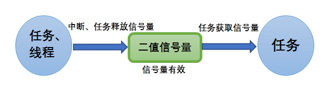
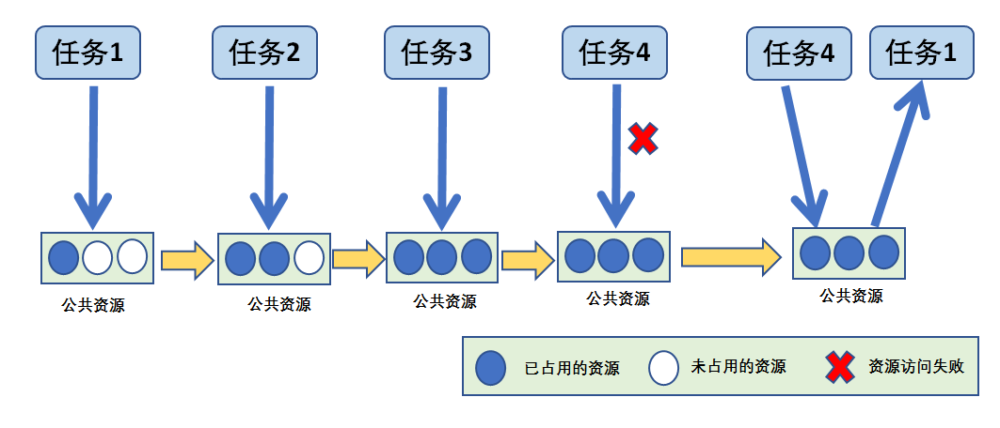
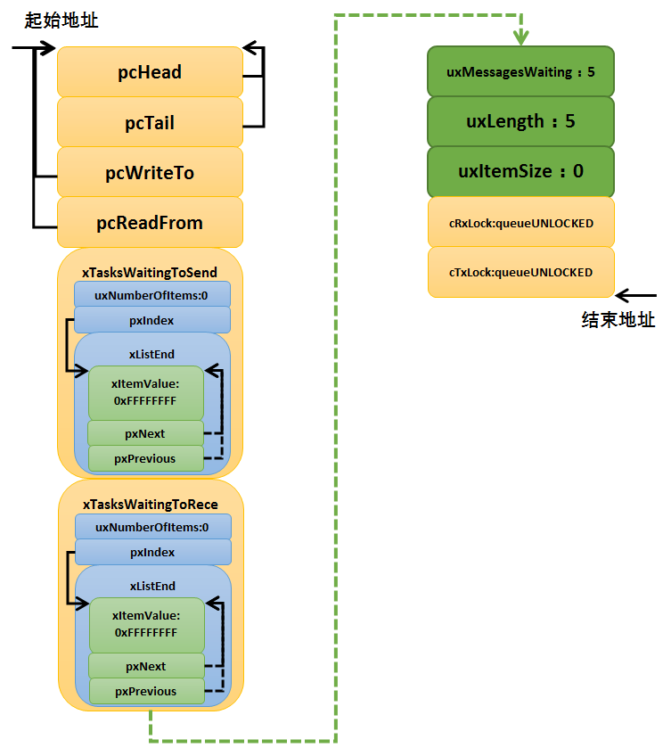
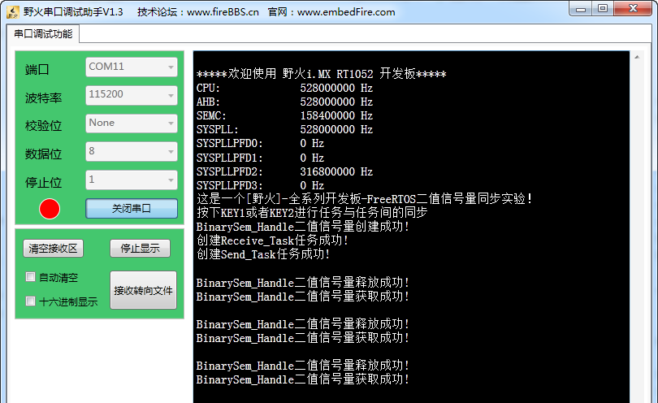
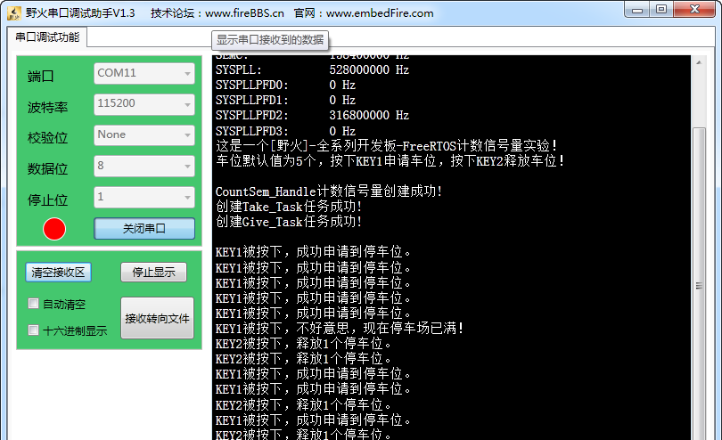

.. vim: syntax=rst

信号量
==========

同志们，回想一下，你是否在裸机编程中这样使用过一个变量：用于标记某个事件是否发生，或者标志一下某个东西是否正在被使用，如果是被占用了的或者没发生，我们就不对它进行操作。

信号量基本概念
~~~~~~~~~~~~~~

信号量（Semaphore）是一种实现任务间通信的机制，可以实现任务之间同步或临界资源的互斥访问，常用于协助一组相互竞争的任务来访问临界资源。在多任务系统中，各任务之间需要同步或互斥实现临界资源的保护，信号量功能可以为用户提供这方面的支持。

抽象的来讲，信号量是一个非负整数，所有获取它的任务都会将该整数减一（获取它当然是为了使用资源），当该整数值为零时，所有试图获取它的任务都将处于阻塞状态。通常一个信号量的计数值用于对应有效的资源数，表示剩下的可被占用的互斥资源数。其值的含义分两种情况：

-  0：表示没有积累下来的释放信号量操作，且有可能有在此信号量上阻塞的任务。

-  正值，表示有一个或多个释放信号量操作。

二值信号量
^^^^^^^^^^

二值信号量既可以用于临界资源访问也可以用于同步功能。

二值信号量和互斥信号量（以下使用互斥量表示互斥信号量）非常相似，但是有一些细微差别：互斥量有优先级继承机制，二值信号量则没有这个机制。这使得二值信号量更偏向应用于同步功能（任务与任务间的同步或任务和中断间同步），而互斥量更偏向应用于临界资源的访问。

用作同步时，信号量在创建后应被置为空，任务1获取信号量而进入阻塞，任务2在某种条件发生后，释放信号量，于是任务1获得信号量得以进入就绪态，如果任务1的优先级是最高的，那么就会立即切换任务，从而达到了两个任务间的同步。同样的，在中断服务函数中释放信号量，任务1也会得到信号量，从而达到任务与中断间的同步
。

还记得我们经常说的中断要快进快出吗，在裸机开发中我们经常是在中断中做一个标记，然后在退出的时候进行轮询处理，这个就是类似我们使用信号量进行同步的，当标记发生了，我们再做其他事情。在 FreeRTOS中我们用信号量用于同步，任务与任务的同步，中断与任务的同步，可以大大提高效率。

可以将二值信号量看作只有一个消息的队列，因此这个队列只能为空或满（因此称为二值），我们在运用的时候只需要知道队列中是否有消息即可，而无需关注消息是什么。

计数信号量
^^^^^^^^^^^^^^^

二进制信号量可以被认为是长度为1的队列，而计数信号量则可以被认为长度大于1的队列，信号量使用者依然不必关心存储在队列中的消息，只需关心队列是否有消息即可。

顾名思义，计数信号量肯定是用于计数的，在实际的使用中，我们常将计数信号量用于事件计数与资源管理。每当某个事件发生时，任务或者中断将释放一个信号量（信号量计数值加1），当处理被事件时（一般在任务中处理），处理任务会取走该信号量（信号量计数值减1），信号量的计数值则表示还有多少个事件没被处理。此外，系统
还有很多资源，我们也可以使用计数信号量进行资源管理，信号量的计数值表示系统中可用的资源数目，任务必须先获取到信号量才能获取资源访问权，当信号量的计数值为零时表示系统没有可用的资源，但是要注意，在使用完资源的时候必须归还信号量，否则当计数值为0的时候任务就无法访问该资源了。

计数型信号量允许多个任务对其进行操作，但限制了任务的数量。比如有一个停车场，里面只有100个车位，那么能停的车只有100辆，也相当于我们的信号量有100个，假如一开始停车场的车位还有100个，那么每进去一辆车就要消耗一个停车位，车位的数量就要减一，对应的，我们的信号量在使用之后也需要减一，当停车场停
满了100辆车的时候，此时的停车位为0，再来的车就不能停进去了，否则将造成事故，也相当于我们的信号量为0，后面的任务对这个停车场资源的访问也无法进行，当有车从停车场离开的时候，车位又空余出来了，那么，后面的车就能停进去了，我们信号量的操作也是一样的，当我们释放了这个资源，后面的任务才能对这个资源进行
访问。

互斥信号量
^^^^^^^^^^^^^^^

互斥信号量其实是特殊的二值信号量，由于其特有的优先级继承机制从而使它更适用于简单互锁，也就是保护临界资源（什么是优先级继承在后续相信讲解）。

用作互斥时，信号量创建后可用信号量个数应该是满的，任务在需要使用临界资源时，（临界资源是指任何时刻只能被一个任务访问的资源），先获取互斥信号量，使其变空，这样其他任务需要使用临界资源时就会因为无法获取信号量而进入阻塞，从而保证了临界资源的安全。

在操作系统中，我们使用信号量的很多时候是为了给临界资源建立一个标志，信号量表示了该临界资源被占用情况。这样，当一个任务在访问临界资源的时候，就会先对这个资源信息进行查询，从而在了解资源被占用的情况之后，再做处理，从而使得临界资源得到有效的保护。

递归信号量
^^^^^^^^^^^^^^^

递归信号量，见文知义，递归嘛，就是可以重复获取调用的，本来按照信号量的特性，每获取一次可用信号量个数就会减少一个，但是递归则不然，对于已经获取递归互斥量的任务可以重复获取该递归互斥量，该任务拥有递归信号量的所有权。任务成功获取几次递归互斥量，就要返还几次，在此之前递归互斥量都处于无效状态，其他任务无
法获取，只有持有递归信号量的任务才能获取与释放。

二值信号量应用场景
~~~~~~~~~~~~~~~~~~~~~~~~~~~

在嵌入式操作系统中二值信号量是任务间、任务与中断间同步的重要手段，信号量使用最多的一般都是二值信号量与互斥信号量（互斥信号量在下一章讲解）。为什么叫二值信号量呢？因为信号量资源被获取了，信号量值就是 0，信号量资源被释放，信号量值就是 1，把这种只有 0和 1 两种情况的信号量称之为二值信号量。

在多任务系统中，我们经常会使用这个二值信号量，比如，某个任务需要等待一个标记，那么任务可以在轮询中查询这个标记有没有被置位，但是这样子做，就会很消耗CPU资源并且妨碍其它任务执行，更好的做法是任务的大部分时间处于阻塞状态（允许其它任务执行），直到某些事件发生该任务才被唤醒去执行。可以使用二进制信号量
实现这种同步，当任务取信号量时，因为此时尚未发生特定事件，信号量为空，任务会进入阻塞状态；当事件的条件满足后，任务/中断便会释放信号量，告知任务这个事件发生了，任务取得信号量便被唤醒去执行对应的操作，任务执行完毕并不需要归还信号量，这样子的CPU的效率可以大大提高，而且实时响应也是最快的。

再比如某个任务使用信号量在等中断的标记的发生，在这之前任务已经进入了阻塞态，在等待着中断的发生，当在中断发生之后，释放一个信号量，也就是我们常说的标记，当它退出中断之后，操作系统会进行任务的调度，如果这个任务能够运行，系统就会把等待这个任务运行起来，这样子就大大提高了我们的效率。

二值信号量在任务与任务中同步的应用场景：假设我们有一个温湿度的传感器，假设是1s采集一次数据，那么我们让他在液晶屏中显示数据出来，这个周期也是要1s一次的，如果液晶屏刷新的周期是100ms更新一次，那么此时的温湿度的数据还没更新，液晶屏根本无需刷新，只需要在1s后温湿度数据更新的时候刷新即可，否则C
PU就是白白做了多次的无效数据更新，CPU的资源就被刷新数据这个任务占用了大半，造成CPU资源浪费，如果液晶屏刷新的周期是10s更新一次，那么温湿度的数据都变化了10次，液晶屏才来更新数据，那拿这个产品有啥用，根本就是不准确的，所以，还是需要同步协调工作，在温湿度采集完毕之后，进行液晶屏数据的刷新，
这样子，才是最准确的，并且不会浪费CPU的资源。

同理，二值信号量在任务与中断同步的应用场景：我们在串口接收中，我们不知道啥时候有数据发送过来，有一个任务是做接收这些数据处理，总不能在任务中每时每刻都在任务查询有没有数据到来，那样会浪费CPU资源，所以在这种情况下使用二值信号量是很好的办法，当没有数据到来的时候，任务就进入阻塞态，不参与任务的调度，
等到数据到来了，释放一个二值信号量，任务就立即从阻塞态中解除，进入就绪态，然后运行的时候处理数据，这样子系统的资源就会很好的被利用起来。

二值信号量运作机制
~~~~~~~~~~~~~~~~~~~~~~~~~~~

创建信号量时，系统会为创建的信号量对象分配内存，并把可用信号量初始化为用户自定义的个数，二值信号量的最大可用信号量个数为1。

二值信号量获取，任何任务都可以从创建的二值信号量资源中获取一个二值信号量，获取成功则返回正确，否则任务会根据用户指定的阻塞超时时间来等待其它任务/中断释放信号量。在等待这段时间，系统将任务变成阻塞态，任务将被挂到该信号量的阻塞等待列表中。

在二值信号量无效的时候，假如此时有任务获取该信号量的话，那么任务将进入阻塞状态，具体见 图18_1_。

假如某个时间中断/任务释放了信号量，其过程具体见 图18_2_，那么，由于获取无效信号量而进入阻塞态的任务将获得信号量并且恢复为就绪态，其过程具体见 图18_3_。

计数信号量运作机制
~~~~~~~~~~~~~~~~~~~~~~~~~~~

计数信号量可以用于资源管理，允许多个任务获取信号量访问共享资源，但会限制任务的最大数目。访问的任务数达到可支持的最大数目时，会阻塞其他试图获取该信号量的任务，直到有任务释放了信号量。这就是计数型信号量的运作机制，虽然计数信号量允许多个任务访问同一个资源，但是也有限定，比如某个资源限定只能有3个任务访
问，那么第4个任务访问的时候，会因为获取不到信号量而进入阻塞，等到有任务（比如任务1）释放掉该资源的时候，第4个任务才能获取到信号量从而进行资源的访问，其运作的机制具体见 图18_4_。

信号量控制块
~~~~~~~~~~~~~~~~~~

信号量API函数实际上都是宏，它使用现有的队列机制，这些宏定义在semphr.h文件中，如果使用信号量或者互斥量，需要包含semphr.h头文件。所以FreeRTOS的信号量控制块结构体与消息队列结构体是一模一样的，只不过结构体中某些成员变量代表的含义不一样而已，我们会具体讲解一下哪里与消息队列不一
样。先来看看信号量控制块，具体见 代码清单18_1_ 高亮部分。

注意：没说明的部分与消息队列一致。

.. code-block:: c
    :caption: 代码清单‑1信号量控制块
    :name: 代码清单18_1
    :emphasize-lines: 14-16
    :linenos:

	typedefstruct QueueDefinition {
	int8_t *pcHead;				
	int8_t *pcTail;				
	int8_t *pcWriteTo;				
	
	union {
	int8_t *pcReadFrom;			
			UBaseType_t uxRecursiveCallCount;		
		} u;
	
		List_t xTasksWaitingToSend;		
		List_t xTasksWaitingToReceive;		
	
	volatile UBaseType_t uxMessagesWaiting;	(1)
		UBaseType_t uxLength;			(2)
		UBaseType_t uxItemSize;			(3)
	
	volatileint8_t cRxLock;			
	volatileint8_t cTxLock;			
	
	#if( ( configSUPPORT_STATIC_ALLOCATION == 1 )
	&& ( configSUPPORT_DYNAMIC_ALLOCATION == 1 ) )
	uint8_t ucStaticallyAllocated;
	#endif

	#if ( configUSE_QUEUE_SETS == 1 )
	struct QueueDefinition *pxQueueSetContainer;
	#endif

	#if ( configUSE_TRACE_FACILITY == 1 )
				UBaseType_t uxQueueNumber;
	uint8_t ucQueueType;
	#endif

			} xQUEUE;

	typedef xQUEUE Queue_t;

代码清单18_1_ **(1)**\ ：如果控制块结构体是用于消息队列：uxMessagesWaiting用来记录当前消息队列的消息个数；如果控制块结构体被用于信号量的时候，这个值就表示有效信号量个数，有以下两种情况：

-  如果信号量是二值信号量、互斥信号量，这个值是1则表示有可用信号量，如果是0则表示没有可用信号量。

-  如果是计数信号量，这个值表示可用的信号量个数，在创建计数信号量的时候会被初始化一个可用信号量个数uxInitialCount，最大不允许超过创建信号量的初始值uxMaxCount。

代码清单18_1_ **(2)**\ ：如果控制块结构体是用于消息队列：uxLength表示队列的长度，也就是能存放多少消息；如果控制块结构体被用于信号量的时候，uxLength表示最大的信号量可用个数，会有以下两种情况：

-  如果信号量是二值信号量、互斥信号量，uxLength最大为1，因为信号量要么是有效的，要么是无效的。

-  如果是计数信号量，这个值表示最大的信号量个数，在创建计数信号量的时候将由用户指定这个值uxMaxCount。

代码清单18_1_ **(3)**\ ：如果控制块结构体是用于消息队列：uxItemSize表示单个消息的大小；如果控制块结构体被用于信号量的时候，则无需存储空间，为0即可。

常用信号量函数接口讲解
~~~~~~~~~~~~~~~~~~~~~~~~~~~~~~~~~

创建信号量函数
^^^^^^^^^^^^^^^^^^^^^

创建二值信号量xSemaphoreCreateBinary()
''''''''''''''''''''''''''''''''''''''''''''''''''''''''''''''

xSemaphoreCreateBinary()用于创建一个二值信号量，并返回一个句柄。其实二值信号量和互斥量都共同使用一个类型SemaphoreHandle_t的句柄，该句柄的原型是一个void 型的指针。使用该函数创建的二值信号量是空的，在使用函数xSemaphoreTake()获取之前必须先调
用函数xSemaphoreGive()释放后才可以获取。如果是使用老式的函数vSemaphoreCreateBinary()创建的二值信号量，则为1，在使用之前不用先释放。要想使用该函数必须在FreeRTOSConfig.h中把宏\ `configSUPPORT_DYNAMIC_ALLOCATION
<http://www.freertos.org/a00110.html#configSUPPORT_DYNAMIC_ALLOCATION>`__\
定义为1，即开启动态内存分配。其实该宏在FreeRTOS.h中默认定义为1，即所有FreeRTOS的对象在创建的时候都默认使用动态内存分配方案，xSemaphoreCreateBinary()函数原型具体见 代码清单18_2_。

.. code-block:: c
    :caption: 代码清单‑2 xSemaphoreCreateBinary()函数原型
    :name: 代码清单18_2
    :linenos:

	#if( configSUPPORT_DYNAMIC_ALLOCATION == 1 )
 
	#define xSemaphoreCreateBinary()				\
		xQueueGenericCreate( 					\
					(UBaseType_t ) 1, 			\(1)	
					semSEMAPHORE_QUEUE_ITEM_LENGTH, 	\(2)	
				queueQUEUE_TYPE_BINARY_SEMAPHORE )	(3)
	
	#endif

从这个函数原型我们就可以知道二值信号量的创建实际使用的函数就是xQueueGenericCreate()函数，是不是很熟悉，这就是消息队列的创建使用的函数，但是参数不一样，
根据xQueueGenericCreate()函数原型来讲解一下参数的作用。

.. code-block:: c
    :caption: 代码清单‑3xQueueGenericCreate()函数原型
    :name: 代码清单18_3
    :linenos:

	QueueHandle_t xQueueGenericCreate(const UBaseType_t uxQueueLength,
	const UBaseType_t uxItemSize, 
	const uint8_t ucQueueType )

代码清单18_2_ **(1)**\ ：uxQueueLength为1表示创建的队列长度为1，其实用作信号量就表示信号量的最大可用个数，从前面的知识点我们就知道，二值信号量的非空即满，长度为1不正是这样子的表示吗。

代码清单18_2_ **(2)**\
：semSEMAPHORE_QUEUE_ITEM_LENGTH其实是一个宏定义，其值为0，见文知义，它表示创建的消息空间（队列项）大小为0，因为这个所谓的“消息队列”其实并不是用于存储消息的，而是被用作二值信号量，因为我们根本无需关注消息内容是什么，只要知道有没有信号量就行了。

代码清单18_2_ **(3)**\ ：ucQueueType 表示的是创建消息队列的类型，在queue.h中有定义，具体见 代码清单18_4_，现在创建的是二值信号量，其类型就是queueQUEUE_TYPE_BINARY_SEMAPHORE。

.. code-block:: c
    :caption: 代码清单‑4ucQueueType可选类型
    :name: 代码清单18_4
    :linenos:

	#define queueQUEUE_TYPE_BASE			( ( uint8_t ) 0U )
	#define queueQUEUE_TYPE_SET		( ( uint8_t ) 0U )
	#define queueQUEUE_TYPE_MUTEX 			( ( uint8_t ) 1U )
	#define queueQUEUE_TYPE_COUNTING_SEMAPHORE	( ( uint8_t ) 2U )
	#define queueQUEUE_TYPE_BINARY_SEMAPHORE	( ( uint8_t ) 3U )
	#define queueQUEUE_TYPE_RECURSIVE_MUTEX	( ( uint8_t ) 4U )

可能很多人会问了，创建一个没有消息存储空间的队列，信号量用什么表示？其实二值信号量的释放和获取都是通过操作队列结控制块构体成员uxMessageWaiting来实现的，它表示信号量中当前可用的信号量个数。在信号量创建之后，变量uxMessageWaiting的值为0，这说明当前信号量处于无效状态，此
时的信号量是无法被获取的，在获取信号之前，应先释放一个信号量。后面讲到信号量释放和获取时还会详细介绍。

二值信号量的创建过程具体见17.6.1 章节，因为都是使用一样的函数创建，创建信号量后的示意图具体见 图18_5_。

创建计数信号量xSemaphoreCreateCounting()
''''''''''''''''''''''''''''''''''''''''''''''''''''''''''''''''''

xSemaphoreCreateCounting ()用于创建一个计数信号量。要想使用该函数必须在FreeRTOSConfig.h中把宏\ `configSUPPORT_DYNAMIC_ALLOCATION
<http://www.freertos.org/a00110.html#configSUPPORT_DYNAMIC_ALLOCATION>`__\ 定义为1，即开启动态内存分配。其实该宏在FreeRTOS.h中默认定义为1，即所有FreeRTOS的对象在创建的时候都默认使用动态内存分配方案。

其实计数信号量跟二值信号量的创建过程都差不多，其实也是间接调用xQueueGenericCreate()函数进行创建，
xSemaphoreCreateCounting()函数说明具体见 xSemaphoreCreateCounting函数说明_，其函数原型与源码具体见 代码清单18_5_。

表格‑1xSemaphoreCreateCounting()函数说明

.. list-table::
   :widths: 33 33
   :name: xSemaphoreCreateCounting函数说明
   :header-rows: 0

   * - **函数原型**
     - SemaphoreHandle_t xSemaphoreCreateCounting( UBaseType_t uxMaxCount, UBaseType_t uxInitialCount);

   * - **功能**
     - 创建一个计数信号量。

   * - **参数**
     - uxMaxCount	计数信号量的最大值，当达到这个值的时候，信号量不能再被释放。

   * - **参数**
     - uxInitialCount	创建计数信号量的初始值。

   * - **返回值**
     - 如果创建成功则返回一个计数信号量句柄，用于访问创建的计数信号量。如果创建不成功则返回NULL。

.. code-block:: c
    :caption: 代码清单‑5创建计数信号量xQueueCreateCountingSemaphore()源码
    :emphasize-lines: 11-13,20-26
    :name: 代码清单18_5
    :linenos:

	#if( configSUPPORT_DYNAMIC_ALLOCATION == 1 )

	#define xSemaphoreCreateCounting( uxMaxCount, uxInitialCount ) \
		xQueueCreateCountingSemaphore((uxMaxCount),(uxInitialCount))

	#endif
	//下面是函数源码
	#if( ( configUSE_COUNTING_SEMAPHORES == 1 )
		&& ( configSUPPORT_DYNAMIC_ALLOCATION == 1 ) )

	QueueHandle_t xQueueCreateCountingSemaphore(
				const UBaseType_t uxMaxCount,
			const UBaseType_t uxInitialCount )
	{
		QueueHandle_t xHandle;

		configASSERT( uxMaxCount != 0 );
		configASSERT( uxInitialCount <= uxMaxCount );

		xHandle = xQueueGenericCreate( uxMaxCount,
				queueSEMAPHORE_QUEUE_ITEM_LENGTH,
				queueQUEUE_TYPE_COUNTING_SEMAPHORE )

	if ( xHandle != NULL ) {
			( ( Queue_t * ) xHandle )->uxMessagesWaiting =
				uxInitialCount;

			traceCREATE_COUNTING_SEMAPHORE();
		} else {
			traceCREATE_COUNTING_SEMAPHORE_FAILED();
		}

	return xHandle;
	}

	#endif
	/*-----------------------------------------------------------*/

从代码清单18‑5加粗部分可以看出，创建计数信号量仍然调用通用队列创建函数xQueueGenericCreate()来创建一个计数信号量，信号量最大个数由参数uxMaxCount指定，每个消息空间的大小由宏queueSEMAPHORE_QUEUE_ITEM_LENGTH指定，这个宏被定义为0，也就是
说创建的计数信号量只有消息队列控制块结构体存储空间而没有消息存储空间，这一点与二值信号量一致，创建的信号量类型是计数信号量queueQUEUE_TYPE_COUNTING_SEMAPHORE。如果创建成功，还会将消息队列控制块中的uxMessagesWaiting成员变量赋值为用户指定的初始可用信号
量个数uxInitialCount，如果这个值大于0，则表示此时有uxInitialCount个计数信号量是可用的，这点与二值信号量的创建不一样，二值信号量在创建成功的时候是无效的（FreeRTOS新版源码，旧版源码在创建成功默认是有效的）。

如果我们创建一个最大计数值为5，并且默认有效的可用信号量个数为5的计数信号量，那么计数信号量创建成功的示意图具体见 图18_6_。

创建二值信号量与计数信号量的使用实例具体见 代码清单18_6_ 与 代码清单18_7_ 高亮部分。

.. code-block:: c
    :caption: 代码清单‑6二值信号量创建函数xSemaphoreCreateBinary()使用实例
    :emphasize-lines: 6
    :name: 代码清单18_6
    :linenos:

	SemaphoreHandle_t xSemaphore = NULL;

	void vATask( void * pvParameters )
	{
	/* 尝试创建一个信号量 */
		xSemaphore = xSemaphoreCreateBinary();
	
	if ( xSemaphore == NULL ) {
	/* 内存不足，创建失败 */
		} else {
	 /* 信号量现在可以使用，句柄存在变量xSemaphore中
	这个时候还不能调用函数xSemaphoreTake()来获取信号量
	因为使用xSemaphoreCreateBinary()函数创建的信号量是空的
	在第一次获取之前必须先调用函数xSemaphoreGive()先提交*/
		}
	}

.. code-block:: c
    :caption: 代码清单‑7计数信号量创建函数xSemaphoreCreateCounting()使用实例
    :emphasize-lines: 5
    :name: 代码清单18_7
    :linenos:

	 void vATask( void * pvParameters )
	{
		SemaphoreHandle_t xSemaphore;
	/* 创建一个计数信号量，用于事件计数*/
		xSemaphore = xSemaphoreCreateCounting( 5, 5 );
	
	if ( xSemaphore != NULL ) {
	/* 计数信号量创建成功 */
		}
	}

当然，创建信号量也有静态创建，其实都是差不多的，但是我们一般常使用动态创建，静态创建的我们暂时不讲解。

信号量删除函数vSemaphoreDelete()
^^^^^^^^^^^^^^^^^^^^^^^^^^^^^^^^^^^^^^^^^^^^^^^^^^

vSemaphoreDelete()用于删除一个信号量，包括二值信号量，计数信号量，互斥量和递归互斥量。如果有任务阻塞在该信号量上，那么不要删除该信号量。该函数的具体说明见表 vSemaphoreDelete函数说明_。
。

.. list-table::
   :widths: 33 33
   :name: vSemaphoreDelete函数说明
   :header-rows: 0

   * - **函数原型**
     - void vSemaphoreDelete( SemaphoreHandle_t xSemaphore );

   * - **功能**
     - 删除一个信号量。

   * - **参数**
     - xSemaphore	信号量句柄。

   * - **返回值**
     - 无。

删除信号量过程其实就是删除消息队列过程，因为信号量其实就是消息队列，只不过是无法存储消息的队列而已，其函数原型具体见 代码清单18_8_，具体的实现过程见17.6.3 章节。

.. code-block:: c
    :caption: 代码清单‑8vSemaphoreDelete()函数原型
    :name: 代码清单18_8
    :linenos:

	#define vSemaphoreDelete( xSemaphore ) \\

	vQueueDelete( ( QueueHandle_t ) ( xSemaphore ) )

信号量释放函数
^^^^^^^^^^^^^^^^^^^^^

与消息队列的操作一样，信号量的释放可以在任务、中断中使用，所以需要有不一样的API函数在不一样的上下文环境中调用。

在前面的讲解中，我们知道，当信号量有效的时候，任务才能获取信号量，那么，是什么函数使得信号量变得有效？其实有两个方式，一个是在创建的时候进行初始化，将它可用的信号量个数设置一个初始值；在二值信号量中，该初始值的范围是0~1（旧版本的FreeRTOS中创建二值信号量默认是有效的，而新版本则默认是无效）
，假如初始值为1个可用的信号量的话，被申请一次就变得无效了，那就需要我们释放信号量，FreeRTOS提供了信号量释放函数，每调用一次该函数就释放一个信号量。但是有个问题，能不能一直释放？很显然，这是不能的，无论是你的信号量是二值信号量还是计数信号量，都要注意可用信号量的范围，当用作二值信号量的时候，
必须确保其可用值在0~1范围内；而用作计数信号量的话，其范围是由用户在创建时指定uxMaxCount，其最大可用信号量不允许超出uxMaxCount，这代表我们不能一直调用信号量释放函数来释放信号量，其实一直调用也是无法释放成功的，在写代码的时候，我们要注意代码的严谨性罢了。

xSemaphoreGive()（任务）
''''''''''''''''''''''''''''''''''''''''

xSemaphoreGive()是一个用于释放信号量的宏，真正的实现过程是调用消息队列通用发送函数，xSemaphoreGive()函数原型具体见 代码清单18_8_。释放的信号量对象必须是已经被创建的，可以用于二值信号量、计数信号量、互斥量的释放，但不能释放由函数xSemaphoreCreateRec
ursiveMutex()创建的递归互斥量。此外该函数不能在中断中使用。

.. code-block:: c
    :caption: 代码清单‑9xSemaphoreGive()函数原型
    :name: 代码清单18_9
    :linenos:

	#define xSemaphoreGive( xSemaphore ) \\

	xQueueGenericSend( ( QueueHandle_t ) ( xSemaphore ), \\

	NULL, \\

	semGIVE_BLOCK_TIME, \\

	queueSEND_TO_BACK )

从该宏定义可以看出释放信号量实际上是一次入队操作，并且是不允许入队阻塞，因为阻塞时间为semGIVE_BLOCK_TIME，该宏的值为0。

通过消息队列入队过程分析，我们可以将释放一个信号量的过程简化：如果信号量未满，控制块结构体成员uxMessageWaiting就会加1，然后判断是否有阻塞的任务，如果有的话就会恢复阻塞的任务，然后返回成功信息（pdPASS）；如果信号量已满，则返回错误代码（err_QUEUE_FULL），具体的源码
分析过程参考17.6 章节。

xSemaphoreGive()函数使用实例见 代码清单18_10_ 高亮部分。

.. code-block:: c
    :caption: 代码清单‑10xSemaphoreGive()函数使用实例
    :emphasize-lines: 6-11,15-19
    :name: 代码清单18_10
    :linenos:

	static void Send_Task(void* parameter)
	{
		BaseType_t xReturn = pdPASS;/* 定义一个创建信息返回值，默认为pdPASS */
	while (1) {
	/* K1 被按下 */
	if ( Key_Scan(KEY1_GPIO_PORT,KEY1_GPIO_PIN) == KEY_ON ) {
			xReturn = xSemaphoreGive( BinarySem_Handle );//给出二值信号量
	if ( xReturn == pdTRUE )
					printf("BinarySem_Handle二值信号量释放成功!\r\n");
	else
					printf("BinarySem_Handle二值信号量释放失败!\r\n");
			}
	/* K2 被按下 */
	if ( Key_Scan(KEY2_GPIO_PORT,KEY2_GPIO_PIN) == KEY_ON ) {
	        xReturn = xSemaphoreGive( BinarySem_Handle );//给出二值信号量
	if ( xReturn == pdTRUE )
					printf("BinarySem_Handle二值信号量释放成功!\r\n");
	else
					printf("BinarySem_Handle二值信号量释放失败!\r\n");
			}
			vTaskDelay(20);
		}
	}

xSemaphoreGiveFromISR()（中断）
''''''''''''''''''''''''''''''''''''''''''''''''''''''

用于释放一个信号量，带中断保护。被释放的信号量可以是二进制信号量和计数信号量。和普通版本的释放信号量API函数有些许不同，它不能释放互斥量，这是因为互斥量不可以在中断中使用，互斥量的优先级继承机制只能在任务中起作用，而在中断中毫无意义。带中断保护的信号量释放其实也是一个宏，真正调用的函数是xQueu
eGiveFromISR ()，宏定义如下具体见 代码清单18_11_。

.. code-block:: c
    :caption: 代码清单‑11xSemaphoreGiveFromISR()源码
    :name: 代码清单18_11
    :linenos:

	#define xSemaphoreGiveFromISR( xSemaphore, 			\
	pxHigherPriorityTaskWoken ) 	\
	xQueueGiveFromISR(( QueueHandle_t )			\
					( xSemaphore ), 			\
	( pxHigherPriorityTaskWoken ) )

如果可用信号量未满，控制块结构体成员uxMessageWaiting就会加1，然后判断是否有阻塞的任务，如果有的话就会恢复阻塞的任务，然后返回成功信息（pdPASS），如果恢复的任务优先级比当前任务优先级高，那么在退出中断要进行任务切换一次；如果队列满，则返回错误代码（err_QUEUE_FULL）
，表示队列满，xQueueGiveFromISR()源码的实现过程在消息队列章节已经讲解，具体见17.6.4 6小节。

一个或者多个任务有可能阻塞在同一个信号量上，调用函数xSemaphoreGiveFromISR()可能会唤醒阻塞在该信号量上的任务，如果被唤醒的任务的优先级大于当前任务的优先级，那么形参pxHigherPriorityTaskWoken就会被设置为pdTRUE，然后在中断退出前执行一次上下文切换。从
FreeRTOS V7.3.0版本开始， pxHigherPriorityTaskWoken是一个可选的参数，可以设置为NULL，xSemaphoreGiveFromISR()函数使用实例具体见 代码清单18_12_ 高亮部分。

.. code-block:: c
    :caption: 代码清单‑12xSemaphoreGiveFromISR()函数使用实例
    :emphasize-lines: 12-17
    :name: 代码清单18_12
    :linenos:

	void vTestISR( void )
	{
		BaseType_t pxHigherPriorityTaskWoken;
	uint32_t ulReturn;
	/* 进入临界段，临界段可以嵌套 */
		ulReturn = taskENTER_CRITICAL_FROM_ISR();
	
	/* 判断是否产生中断 */
		{
	/* 如果产生中断，清除中断标志位 */
	
	//释放二值信号量，发送接收到新数据标志，供前台程序查询
			xSemaphoreGiveFromISR(BinarySem_Handle,&
								pxHigherPriorityTaskWoken);
	//如果需要的话进行一次任务切换，系统会判断是否需要进行切换
			portYIELD_FROM_ISR(pxHigherPriorityTaskWoken);
		}

	/* 退出临界段 */
		taskEXIT_CRITICAL_FROM_ISR( ulReturn );
	}

	

信号量获取函数
^^^^^^^^^^^^^^^^^^^^^

与消息队列的操作一样，信号量的获取可以在任务、中断（中断中使用并不常见）中使用，所以需要有不一样的API函数在不一样的上下文环境中调用。

与释放信号量对应的是获取信号量，我们知道，当信号量有效的时候，任务才能获取信号量，当任务获取了某个信号量的时候，该信号量的可用个数就减一，当它减到0的时候，任务就无法再获取了，并且获取的任务会进入阻塞态（假如用户指定了阻塞超时时间的话）。如果某个信号量中当前拥有1个可用的信号量的话，被获取一次就变得
无效了，那么此时另外一个任务获取该信号量的时候，就会无法获取成功，该任务便会进入阻塞态，阻塞时间由用户指定。

xSemaphoreTake()（任务）
''''''''''''''''''''''''''''''''''''''''

xSemaphoreTake()函数用于获取信号量，不带中断保护。获取的信号量对象可以是二值信号量、计数信号量和互斥量，但是递归互斥量并不能使用这个API函数获取。其实获取信号量是一个宏，真正调用的函数是xQueueGenericReceive
()。该宏不能在中断使用，而是必须由具体中断保护功能的xQueueReceiveFromISR()版本代替。该函数的具体说明见表 xSemaphoreTake函数说明_，应用举例见 代码清单18_13_。

表格‑3xSemaphoreTake()函数说明

.. list-table::
   :widths: 33 33
   :name: xSemaphoreTake函数说明
   :header-rows: 0

   * - **函数原型**
     - #define xSemaphoreTake( xSemaphore, xBlockTime )		xQueueGenericReceive( ( QueueHandle_t ) ( xSemaphore ), NULL, (xBlockTime ), pdFALSE )

   * - **功能**
     - 获取一个信号量，可以是二值信号量、计数信号量、互斥量。

   * - **参数**
     - xSemaphore	信号量句柄。

   * - **参数**
     - xBlockTime	等待信号量可用的最大超时时间，单位为tick（即系统节拍周期）。如果宏 INCLUDE_vTaskSuspend定义为1且形参xTicksToWait设置为portMAX_DELAY ，则任务将一直阻塞在该信号量上（即没有超时时间）。

   * - **返回值**
     - 获取成功则返回pdTRUE，在指定的超时时间中没有获取成功则返回errQUEUE_EMPTY。

从该宏定义可以看出释放信号量实际上是一次消息出队操作，阻塞时间由用户指定xBlockTime，当有任务试图获取信号量的时候，当且仅当信号量有效的时候，任务才能读获取到信号量。如果信号量无效，在用户指定的阻塞超时时间中，该任务将保持阻塞状态以等待信号量有效。当其它任务或中断释放了有效的信号量，该任务将
自动由阻塞态转移为就绪态。当任务等待的时间超过了指定的阻塞时间，即使信号量中还是没有可用信号量，任务也会自动从阻塞态转移为就绪态。

通过前面消息队列出队过程分析，我们可以将获取一个信号量的过程简化：如果有可用信号量，控制块结构体成员uxMessageWaiting就会减1，然后返回获取成功信息（pdPASS）；如果信号量无效并且阻塞时间为0，则返回错误代码（errQUEUE_EMPTY）；如果信号量无效并且用户指定了阻塞时间，则
任务会因为等待信号量而进入阻塞状态，任务会被挂接到延时列表中。具体的源码分析过程参考17.6 章节。（此处暂时未讲解互斥信号量）

xSemaphoreTake()函数使用实例具体见 代码清单18_13_ 高亮部分。

.. code-block:: c
    :caption: 代码清单‑13xSemaphoreTake()函数使用实例
    :emphasize-lines: 5-9
    :name: 代码清单18_13
    :linenos:

	static void Receive_Task(void* parameter)
	{
		BaseType_t xReturn = pdPASS;/* 定义一个创建信息返回值，默认为pdPASS */
	while (1) {
	//获取二值信号量 xSemaphore,没获取到则一直等待
			xReturn = xSemaphoreTake(BinarySem_Handle,/* 二值信号量句柄 */
									portMAX_DELAY); /* 等待时间 */
	if (pdTRUE == xReturn)
				printf("BinarySem_Handle二值信号量获取成功!\n\n");
			LED1_TOGGLE;
		}
	}

xSemaphoreTakeFromISR()（中断）
''''''''''''''''''''''''''''''''''''''''''''''''''''''

xSemaphoreTakeFromISR()是函数xSemaphoreTake()的中断版本，用于获取信号量，是一个不带阻塞机制获取信号量的函数，获取对象必须由是已经创建的信号量，信号量类型可以是二值信号量和计数信号量，它与xSemaphoreTake()函数不同，它不能用于获取互斥量，因为互斥量
不可以在中断中使用，并且互斥量特有的优先级继承机制只能在任务中起作用，而在中断中毫无意义。该函数的具体说明见表 xSemaphoreTakeFromISR函数说明_。

表格‑4xSemaphoreTakeFromISR()函数说明

.. list-table::
   :widths: 33 33
   :name: xSemaphoreTakeFromISR函数说明
   :header-rows: 0

   * - **函数原型**
     - xSemaphoreTakeFromISR(SemaphoreHandle_t xSemaphore,signed BaseType_t \*pxHigherPriorityTaskWoken)

   * - **功能**
     - 在中断中获一个信号量（其实很少在中断中获取信号量）。可以是二值信号量、计数信号量。

   * - **参数**
     - xSemaphore	信号量句柄。

   * - **参数**
     - pxHigherPriorityTaskWoken	一个或者多个任务有可能阻塞在同一个信号量上，调用函数xSemaphoreTakeFromISR()会唤醒阻塞在该信号量上优先级最高的信号量入队任务，如果被唤醒的任务的优先级大于或者等于被中断的任务的优先级，那么形参pxHigherPriorityTaskWoken就会被设置为pdTRUE，然后在中断退出前执行一次上下文切换，中断退出后则直接返回刚刚被唤醒的高优先级的任务。从FreeRTOS V7.3.0版本开始， pxHigherPriorityTaskWoken是一个可选的参数，可以设置为NULL。

   * - **返回值**
     - 获取成功则返回pdTRUE，没有获取成功则返回errQUEUE_EMPTY，没有获取成功是因为信号量不可用。

信号量实验
~~~~~~~~~~~~~~~~~~~~

二值信号量同步实验
^^^^^^^^^^^^^^^^^^

信号量同步实验是在FreeRTOS中创建了两个任务，一个是获取信号量任务，一个是释放互斥量任务，两个任务独立运行，获取信号量任务是一直在等待信号量，其等待时间是portMAX_DELAY，等到获取到信号量之后，任务开始执行任务代码，如此反复等待另外任务释放的信号量。

释放信号量任务在检测按键是否按下，如果按下则释放信号量，此时释放信号量会唤醒获取任务，获取任务开始运行，然后形成两个任务间的同步，
因为如果没按下按键，那么信号量就不会释放，只有当信号量释放的时候，获取信号量的任务才会被唤醒，如此一来就达到任务与任务的同步，
同时程序的运行会在串口打印出相关信息，具体见 代码清单18_14_ 高亮部分。

.. code-block:: c
    :caption: 代码清单‑14 二值信号量同步实验
    :emphasize-lines: 128, 168-177, 187-209
    :name: 代码清单18_14
    :linenos:

	/**
	******************************************************************
	* @file    main.c
	* @author  fire
	* @version V1.0
	* @date    2018-xx-xx
	* @brief   二值信号量
	******************************************************************
	* @attention
	*
	* 实验平台:野火  i.MXRT1052开发板
	* 论坛    :http://www.firebbs.cn
	* 淘宝    :http://firestm32.taobao.com
	*
	******************************************************************
	*/
	#include"fsl_debug_console.h"
	
	#include"board.h"
	#include"pin_mux.h"
	#include"clock_config.h"
	
	#include"./led/bsp_led.h"
	#include"./key/bsp_key.h"
	
	/* FreeRTOS头文件 */
	#include"FreeRTOS.h"
	#include"task.h"
	#include"queue.h"
	#include"semphr.h"
	/**************************** 任务句柄 ********************************/
	/*
	* 任务句柄是一个指针，用于指向一个任务，当任务创建好之后，它就具有了一个任务句柄
	* 以后我们要想操作这个任务都需要通过这个任务句柄，如果是自身的任务操作自己，那么
	* 这个句柄可以为NULL。
	*/
	static TaskHandle_t AppTaskCreate_Handle = NULL;/* 创建任务句柄 */
	static TaskHandle_t Receive_Task_Handle = NULL;/* LED任务句柄 */
	static TaskHandle_t Send_Task_Handle = NULL;/* KEY任务句柄 */
	
	/********************************** 内核对象句柄 
	*******************************/
	/*
	* 信号量，消息队列，事件标志组，软件定时器这些都属于内核的对象，要想使用这些内核
	* 对象，必须先创建，创建成功之后会返回一个相应的句柄。实际上就是一个指针，后续我
	* 们就可以通过这个句柄操作这些内核对象。
	*
	* 内核对象说白了就是一种全局的数据结构，通过这些数据结构我们可以实现任务间的通信，
	* 任务间的事件同步等各种功能。至于这些功能的实现我们是通过调用这些内核对象的函数
	* 来完成的
	*
	*/
	SemaphoreHandle_t BinarySem_Handle =NULL;
	
	/**********************全局变量声明***********************/
	/*
	* 当我们在写应用程序的时候，可能需要用到一些全局变量。
	*/
	
	
	/***********************宏定义******************************/
	/*
	* 当我们在写应用程序的时候，可能需要用到一些宏定义。
	*/
	
	
	/*
	*************************************************************************
	*                             函数声明
	*************************************************************************
	*/
	static void AppTaskCreate(void);/* 用于创建任务 */
	
	static void Receive_Task(void* pvParameters);/* Receive_Task任务实现 */
	static void Send_Task(void* pvParameters);/* Send_Task任务实现 */
	
	static void BSP_Init(void);/* 用于初始化板载相关资源 */
	
	/*****************************************************************
	* @brief  主函数
	* @param  无
	* @retval 无
	* @note   第一步：开发板硬件初始化
	第二步：创建APP应用任务
	第三步：启动FreeRTOS，开始多任务调度
	****************************************************************/
	int main(void)
	{
		BaseType_t xReturn = pdPASS;/* 定义一个创建信息返回值，默认为pdPASS */
	
	/* 开发板硬件初始化 */
	    BSP_Init();
    PRINTF("这是一个[野火]-全系列开发板-FreeRTOS二值信号量同步实验！\n");
    PRINTF("按下KEY1或者KEY2进行任务与任务间的同步\n");
	/* 创建AppTaskCreate任务 */
		xReturn = xTaskCreate((TaskFunction_t )AppTaskCreate,  /* 任务入口函数 

							(const char*    )"AppTaskCreate",/* 任务名字 */
							(uint16_t       )512,  /* 任务栈大小 */
							(void*          )NULL,/* 任务入口函数参数 */
							(UBaseType_t    )1, /* 任务的优先级 */
							(TaskHandle_t*  )&AppTaskCreate_Handle);/* 任务
	控制块指针 */
	/* 启动任务调度 */
	if (pdPASS == xReturn)
			vTaskStartScheduler();   /* 启动任务，开启调度 */
	else
	return -1;
	
	while (1);  /* 正常不会执行到这里 */
	}
	
	
	/***********************************************************************
	* @ 函数名： AppTaskCreate
	* @ 功能说明：为了方便管理，所有的任务创建函数都放在这个函数里面
	* @ 参数：无
	* @ 返回值：无
	
	*******************************************************************/
	static void AppTaskCreate(void)
	{
		BaseType_t xReturn = pdPASS;/* 定义一个创建信息返回值，默认为pdPASS */
	
		taskENTER_CRITICAL();           //进入临界区
	
	/* 创建 BinarySem */
		BinarySem_Handle = xSemaphoreCreateBinary();
	if (NULL != BinarySem_Handle)
			PRINTF("BinarySem_Handle二值信号量创建成功!\r\n");
	
	/* 创建Receive_Task任务 */
		xReturn = xTaskCreate((TaskFunction_t )Receive_Task, /* 任务入口函数 

							(const char*    )"Receive_Task",/* 任务名字 */
							(uint16_t       )512,   /* 任务栈大小 */
							(void*          )NULL,  /* 任务入口函数参数 */
							(UBaseType_t    )2,     /* 任务的优先级 */
							(TaskHandle_t*  )&Receive_Task_Handle);/* 任务
	控制块指针 */
	if (pdPASS == xReturn)
			PRINTF("创建Receive_Task任务成功!\r\n");
	
	/* 创建Send_Task任务 */
		xReturn = xTaskCreate((TaskFunction_t )Send_Task,  /* 任务入口函数 */
							(const char*    )"Send_Task",/* 任务名字 */
							(uint16_t       )512,  /* 任务栈大小 */
							(void*          )NULL,/* 任务入口函数参数 */
							(UBaseType_t    )3, /* 任务的优先级 */
							(TaskHandle_t*  )&Send_Task_Handle);/* 任务控制
	块指针 */
	 if (pdPASS == xReturn)
         PRINTF("创建Send_Task任务成功!\n\n");
 
     vTaskDelete(AppTaskCreate_Handle); //删除AppTaskCreate任务
 
     taskEXIT_CRITICAL();            //退出临界区
	}
	
	
	
	/**********************************************************************
	* @ 函数名： Receive_Task
	* @ 功能说明： Receive_Task任务主体
	* @ 参数：
	* @ 返回值：无
	********************************************************************/
	static void Receive_Task(void* parameter)
	{
		BaseType_t xReturn = pdPASS;/* 定义一个创建信息返回值，默认为pdPASS */
	while (1) {
	//获取二值信号量 xSemaphore,没获取到则一直等待
			xReturn = xSemaphoreTake(BinarySem_Handle,/* 二值信号量句柄 */
									portMAX_DELAY); /* 等待时间 */
	if (pdTRUE == xReturn)
				PRINTF("BinarySem_Handle二值信号量获取成功!\n\n");
			LED1_TOGGLE;
		}
	}
	
	/**********************************************************************
	* @ 函数名： Send_Task
	* @ 功能说明： Send_Task任务主体
	* @ 参数：
	* @ 返回值：无
	********************************************************************/
	static void Send_Task(void* parameter)
	{
		BaseType_t xReturn = pdPASS;/* 定义一个创建信息返回值，默认为pdPASS */
	while (1) {
	/* K1 被按下 */
	if ( Key_Scan(KEY1_GPIO_PORT,KEY1_PIN) == KEY_ON ) {
				xReturn = xSemaphoreGive( BinarySem_Handle );//给出二值信号量
	if ( xReturn == pdTRUE )
					PRINTF("BinarySem_Handle二值信号量释放成功!\r\n");
	else
					PRINTF("BinarySem_Handle二值信号量释放失败!\r\n");
			}
	/* K2 被按下 */
	if ( Key_Scan(KEY2_GPIO_PORT,KEY2_PIN) == KEY_ON ) {
				xReturn = xSemaphoreGive( BinarySem_Handle );//给出二值信号量
	if ( xReturn == pdTRUE )
					PRINTF("BinarySem_Handle二值信号量释放成功!\r\n");
	else
					PRINTF("BinarySem_Handle二值信号量释放失败!\r\n");
			}
			vTaskDelay(20);
		}
	}
	
	/***********************************************************************
	* @ 函数名： BSP_Init
	* @ 功能说明：板级外设初始化，所有板子上的初始化均可放在这个函数里面
	   * @ 参数：
  	 * @ 返回值：无
   	*********************************************************************/
	static void BSP_Init(void)
	{
	/* 初始化内存保护单元 */
		BOARD_ConfigMPU();
	/* 初始化开发板引脚 */
		BOARD_InitPins();
	/* 初始化开发板时钟 */
		BOARD_BootClockRUN();
	/* 初始化调试串口 */
		BOARD_InitDebugConsole();
	/* 打印系统时钟 */
		PRINTF("\r\n");
		PRINTF("*****欢迎使用野火i.MX RT1052 开发板*****\r\n");
		PRINTF("CPU:             %d Hz\r\n", CLOCK_GetFreq(kCLOCK_CpuClk));
		PRINTF("AHB:             %d Hz\r\n", CLOCK_GetFreq(kCLOCK_AhbClk));
		PRINTF("SEMC:            %d Hz\r\n", CLOCK_GetFreq(kCLOCK_SemcClk));
		PRINTF("SYSPLL:          %d Hz\r\n", CLOCK_GetFreq(kCLOCK_SysPllClk));
		PRINTF("SYSPLLPFD0:      %d Hz\r\n", CLOCK_GetFreq(kCLOCK_SysPllPfd0Clk));
		PRINTF("SYSPLLPFD1:      %d Hz\r\n", CLOCK_GetFreq(kCLOCK_SysPllPfd1Clk));
		PRINTF("SYSPLLPFD2:      %d Hz\r\n", CLOCK_GetFreq(kCLOCK_SysPllPfd2Clk));
		PRINTF("SYSPLLPFD3:      %d Hz\r\n", CLOCK_GetFreq(kCLOCK_SysPllPfd3Clk));
	
	/* 初始化SysTick */
		SysTick_Config(SystemCoreClock / configTICK_RATE_HZ);
	
	/* 硬件BSP初始化统统放在这里，比如LED，串口，LCD等 */
	
	/* LED 端口初始化 */
		LED_GPIO_Config();
	
	
	/* KEY 端口初始化 */
		Key_GPIO_Config();
	
	}
	/****************************END OF FILE**********************/

计数信号量实验
^^^^^^^^^^^^^^^^^^^^^

计数型信号量实验是模拟停车场工作运行。在创建信号量的时候初始化5个可用的信号量，并且创建了两个任务：一个是获取信号量任务，一个是释放信号量任务，两个任务独立运行，获取信号量任务是通过按下KEY1按键进行信号量的获取，模拟停车场停车操作，其等待时间是0，在串口调试助手输出相应信息。

释放信号量任务则是信号量的释放，释放信号量任务也是通过按下KEY2按键进行信号量的释放，模拟停车场取车操作，在串口调试助手输出相应信息，实验源码具体见 代码清单18_15_ 高亮部分。

.. code-block:: c
    :caption: 代码清单‑15计数信号量实验
    :emphasize-lines: 53, 127-130,167-180, 192-208
    :name: 代码清单18_15
    :linenos:

	/**
	******************************************************************
	* @file    main.c
	* @author  fire
	* @version V1.0
	* @date    2018-xx-xx
	  * @brief   计数信号量
	******************************************************************
	* @attention
	*
	* 实验平台:野火  i.MXRT1052开发板
	* 论坛    :http://www.firebbs.cn
	* 淘宝    :http://firestm32.taobao.com
	*
	******************************************************************
	*/
	#include"fsl_debug_console.h"

	#include"board.h"
	#include"pin_mux.h"
	#include"clock_config.h"

	#include"./led/bsp_led.h"
	#include"./key/bsp_key.h"

	/* FreeRTOS头文件 */
	#include"FreeRTOS.h"
	#include"task.h"
	#include"queue.h"
	#include"semphr.h"
	/**************************** 任务句柄 ********************************/
	/*
	* 任务句柄是一个指针，用于指向一个任务，当任务创建好之后，它就具有了一个任务句柄
	* 以后我们要想操作这个任务都需要通过这个任务句柄，如果是自身的任务操作自己，那么
	* 这个句柄可以为NULL。
	*/
	static TaskHandle_t AppTaskCreate_Handle = NULL;/* 创建任务句柄 */
	static TaskHandle_t Take_Task_Handle = NULL;/* Take_Task任务句柄 */
	static TaskHandle_t Give_Task_Handle = NULL;/* Give_Task任务句柄 */

	/********************************** 内核对象句柄 
	******************************/
	/*
	* 信号量，消息队列，事件标志组，软件定时器这些都属于内核的对象，要想使用这些内核
	* 对象，必须先创建，创建成功之后会返回一个相应的句柄。实际上就是一个指针，后续我
	* 们就可以通过这个句柄操作这些内核对象。
	*
	* 内核对象说白了就是一种全局的数据结构，通过这些数据结构我们可以实现任务间的通信，
	* 任务间的事件同步等各种功能。至于这些功能的实现我们是通过调用这些内核对象的函数
	* 来完成的
	*
	*/
	SemaphoreHandle_t CountSem_Handle =NULL;

	/************************全局变量声明*****************************/
	/*
	* 当我们在写应用程序的时候，可能需要用到一些全局变量。
	*/

	/************************宏定义*******************************/
	/*
	* 当我们在写应用程序的时候，可能需要用到一些宏定义。
	*/

	/*
	*************************************************************************
	*                             函数声明
	*************************************************************************
	*/
	static void AppTaskCreate(void);/* 用于创建任务 */

	static void Take_Task(void* pvParameters);/* Take_Task任务实现 */
	static void Give_Task(void* pvParameters);/* Give_Task任务实现 */

	static void BSP_Init(void);/* 用于初始化板载相关资源 */

	/*****************************************************************
	* @brief  主函数
	* @param  无
	* @retval 无
	* @note   第一步：开发板硬件初始化
	第二步：创建APP应用任务
	第三步：启动FreeRTOS，开始多任务调度
	****************************************************************/
	int main(void)
	{
		BaseType_t xReturn = pdPASS;/* 定义一个创建信息返回值，默认为pdPASS */

	/* 开发板硬件初始化 */
		BSP_Init();

		PRINTF("这是一个[野火]-全系列开发板-FreeRTOS计数信号量实验！\n");
		PRINTF("车位默认值为5个，按下KEY1申请车位，按下KEY2释放车位！\n\n");

	/* 创建AppTaskCreate任务 */
		xReturn = xTaskCreate((TaskFunction_t )AppTaskCreate,  /* 任务入口函数 

							(const char*    )"AppTaskCreate",/* 任务名字 */
							(uint16_t       )512,  /* 任务栈大小 */
							(void*          )NULL,/* 任务入口函数参数 */
							(UBaseType_t    )1, /* 任务的优先级 */
							(TaskHandle_t*  )&AppTaskCreate_Handle);/* 任务
	块指针 */
	/* 启动任务调度 */
	if (pdPASS == xReturn)
			vTaskStartScheduler();   /* 启动任务，开启调度 */
	else
	return -1;
	
	while (1);  /* 正常不会执行到这里 */
	}
	
	
	/***********************************************************************
	* @ 函数名： AppTaskCreate
	* @ 功能说明：为了方便管理，所有的任务创建函数都放在这个函数里面
	* @ 参数：无
	* @ 返回值：无
	
	*******************************************************************/
	static void AppTaskCreate(void)
	{
		BaseType_t xReturn = pdPASS;/* 定义一个创建信息返回值，默认为pdPASS */
	
		taskENTER_CRITICAL();           //进入临界区
	
	/* 创建Test_Queue */
	     CountSem_Handle = xSemaphoreCreateCounting(5,5);
	if (NULL != CountSem_Handle)
			PRINTF("CountSem_Handle计数信号量创建成功!\r\n");
	
	/* 创建Take_Task任务 */
		xReturn = xTaskCreate((TaskFunction_t )Take_Task, /* 任务入口函数 */
							(const char*    )"Take_Task",/* 任务名字 */
							(uint16_t       )512,   /* 任务栈大小 */
							(void*          )NULL,  /* 任务入口函数参数 */
							(UBaseType_t    )2,     /* 任务的优先级 */
							(TaskHandle_t*  )&Take_Task_Handle);/* 任务控制
	针 */
	if (pdPASS == xReturn)
			PRINTF("创建Take_Task任务成功!\r\n");
	
	/* 创建Give_Task任务 */
		xReturn = xTaskCreate((TaskFunction_t )Give_Task,  /* 任务入口函数 */
							(const char*    )"Give_Task",/* 任务名字 */
							(uint16_t       )512,  /* 任务栈大小 */
							(void*          )NULL,/* 任务入口函数参数 */
							(UBaseType_t    )3, /* 任务的优先级 */
							(TaskHandle_t*  )&Give_Task_Handle);/* 任务控制
	针 */
	if (pdPASS == xReturn)
			PRINTF("创建Give_Task任务成功!\n\n");
	
		vTaskDelete(AppTaskCreate_Handle); //删除AppTaskCreate任务
	
		taskEXIT_CRITICAL();            //退出临界区
	}
	
	
	
	/**********************************************************************
	* @ 函数名： Take_Task
	* @ 功能说明： Take_Task任务主体
	* @ 参数：
	* @ 返回值：无
	********************************************************************/
	static void Take_Task(void* parameter)
	{
		BaseType_t xReturn = pdTRUE;/* 定义一个创建信息返回值，默认为pdPASS */
	/* 任务都是一个无限循环，不能返回 */
	while (1) {
	//如果KEY1被单击
	if ( Key_Scan(KEY1_GPIO_PORT,KEY1_PIN) == KEY_ON ) {
	/* 获取一个计数信号量 */
				xReturn = xSemaphoreTake(CountSem_Handle, /* 计数信号量句柄 */
										0);  /* 等待时间：0 */
	if ( pdTRUE == xReturn )
					PRINTF( "KEY1被按下，成功申请到停车位。\n" );
	else
					PRINTF( "KEY1被按下，不好意思，现在停车场已满！\n" );
			}
			vTaskDelay(20);     //每20ms扫描一次
		}
	}
	
	/**********************************************************************
	* @ 函数名： Give_Task
	   * @ 功能说明： Give_Task任务主体
   	* @ 参数：
   	* @ 返回值：无
   	********************************************************************/
	static void Give_Task(void* parameter)
	{
		BaseType_t xReturn = pdTRUE;/* 定义一个创建信息返回值，默认为pdPASS */
	/* 任务都是一个无限循环，不能返回 */
	while (1) {
	//如果KEY2被单击
	if ( Key_Scan(KEY2_GPIO_PORT,KEY2_PIN) == KEY_ON ) {
	/* 获取一个计数信号量 */
				xReturn = xSemaphoreGive(CountSem_Handle);//给出计数信号量
	if ( pdTRUE == xReturn )
					PRINTF( "KEY2被按下，释放1个停车位。\n" );
	else
					PRINTF( "KEY2被按下，但已无车位可以释放！\n" );
			}
			vTaskDelay(20);     //每20ms扫描一次
		}
	}
	/***********************************************************************
	* @ 函数名： BSP_Init
	* @ 功能说明：板级外设初始化，所有板子上的初始化均可放在这个函数里面
	* @ 参数：
	* @ 返回值：无
	*********************************************************************/
	static void BSP_Init(void)
	{
	/* 初始化内存保护单元 */
		BOARD_ConfigMPU();
	/* 初始化开发板引脚 */
		BOARD_InitPins();
	/* 初始化开发板时钟 */
		BOARD_BootClockRUN();
	/* 初始化调试串口 */
		BOARD_InitDebugConsole();
	/* 打印系统时钟 */
		PRINTF("\r\n");
		PRINTF("*****欢迎使用野火i.MX RT1052 开发板*****\r\n");
		PRINTF("CPU:             %d Hz\r\n", CLOCK_GetFreq(kCLOCK_CpuClk));
		PRINTF("AHB:             %d Hz\r\n", CLOCK_GetFreq(kCLOCK_AhbClk));
		PRINTF("SEMC:            %d Hz\r\n", CLOCK_GetFreq(kCLOCK_SemcClk));
		PRINTF("SYSPLL:          %d Hz\r\n", CLOCK_GetFreq(kCLOCK_SysPllClk));
		PRINTF("SYSPLLPFD0:      %d Hz\r\n", CLOCK_GetFreq(kCLOCK_SysPllPfd0Clk));
		PRINTF("SYSPLLPFD1:      %d Hz\r\n", CLOCK_GetFreq(kCLOCK_SysPllPfd1Clk));
		PRINTF("SYSPLLPFD2:      %d Hz\r\n", CLOCK_GetFreq(kCLOCK_SysPllPfd2Clk));
		PRINTF("SYSPLLPFD3:      %d Hz\r\n", CLOCK_GetFreq(kCLOCK_SysPllPfd3Clk));
	
	/* 初始化SysTick */
		SysTick_Config(SystemCoreClock / configTICK_RATE_HZ);
	
	/* 硬件BSP初始化统统放在这里，比如LED，串口，LCD等 */
	
	/* LED 端口初始化 */
		LED_GPIO_Config();
	
	
	/* KEY 端口初始化 */
		Key_GPIO_Config();
	
	}

信号量实验现象
~~~~~~~~~~~~~~~~~~~~~~~~~~~~

二值信号量实验现象
^^^^^^^^^^^^^^^^^^^^^^^^^^^

将程序编译好，用USB线连接电脑和开发板的USB接口（对应丝印为USB转串口），用DAP仿真器把配套程序下载到野火I.MX
RT系列开发板（具体型号根据你买的板子而定，每个型号的板子都配套有对应的程序），在电脑上打开串口调试助手，然后复位开发板就可以在调试助手中看到串口的打印信息，
它里面输出了信息表明任务正在运行中，我们按下开发板的按键，串口打印任务运行的信息，表明两个任务同步成功，具体见 图18_8_。

计数信号量实验现象
^^^^^^^^^^^^^^^^^^^^^^^^^^^

将程序编译好，用USB线连接电脑和开发板的USB接口（对应丝印为USB转串口），用DAP仿真器把配套程序下载到野火I.MX RT系列开发板（具体型号根据你买的板子而定，每个型号的板子都配套有对应的程序），在电脑上打开串口调试助手，然后复位开发板就可以在调试助手中看到串口的打印信息，按下开发版的KEY
1按键获取信号量模拟停车，按下KEY2按键释放信号量模拟取车；我们按下KEY1与KEY2试试，在串口调试助手中可以看到运行结果，具体见 图18_9_。

