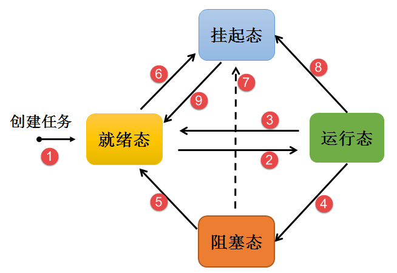
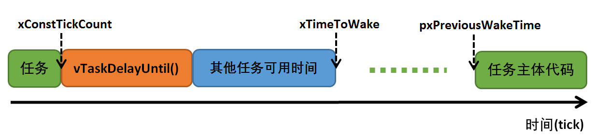
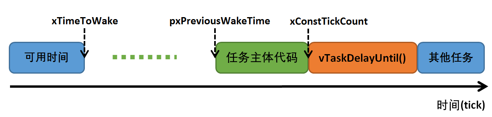
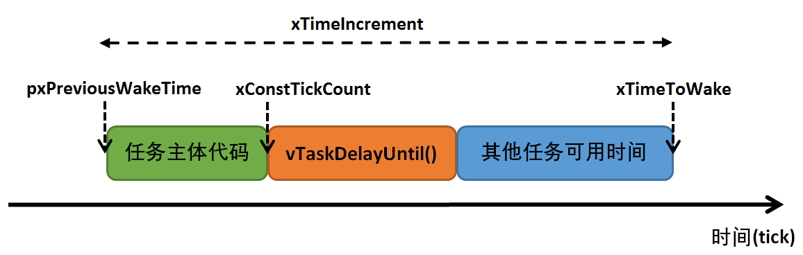
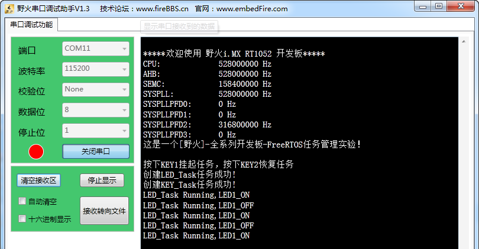

.. vim: syntax=rst

任务管理
==============

任务的基本概念
~~~~~~~~~~~~~~~~~~~~~

从系统的角度看，任务是竞争系统资源的最小运行单元。FreeRTOS是一个支持多任务的操作系统。在FreeRTOS中，任务可以使用或等待CPU、使用内存空间等系统资源，并独立于其它任务运行，任何数量的任务可以共享同一个优先级，如果宏configUSE_TIME_SLICING定义为1，处于就绪态的多个
相同优先级任务将会以时间片切换的方式共享处理器。

简而言之： FreeRTOS的任务可认为是一系列独立任务的集合。每个任务在自己的环境中运行。在任何时刻，只有一个任务得到运行，FreeRTOS调度器决定运行哪个任务。调度器会不断的启动、停止每一个任务，宏观看上去所有的任务都在同时在执行。作为任务，不需要对调度器的活动有所了解，在任务切入切出时保存上
下文环境（寄存器值、堆栈内容）是调度器主要的职责。为了实现这点，每个FreeRTOS任务都需要有自己的栈空间。当任务切出时，它的执行环境会被保存在该任务的栈空间中，这样当任务再次运行时，就能从堆栈中正确的恢复上次的运行环境，任务越多，需要的堆栈空间就越大，而一个系统能运行多少个任务，取决于系统的可用
的SRAM。

FreeRTOS的可以给用户提供多个任务单独享有独立的堆栈空间，系统可用决定任务的状态，决定任务是否可以运行，同时还能运用内核的IPC通信资源，实现了任务之间的通信，帮助用户管理业务程序流程。这样用户可以将更多的精力投入到业务功能的实现中。

FreeRTOS中的任务是抢占式调度机制，高优先级的任务可打断低优先级任务，低优先级任务必须在高优先级任务阻塞或结束后才能得到调度。同时FreeRTOS也支持时间片轮转调度方式，只不过时间片的调度是不允许抢占任务的CPU使用权。

任务通常会运行在一个死循环中，也不会退出，如果一个任务不再需要，可以调用FreeRTOS中的任务删除API函数接口显式地将其删除。

任务调度器的基本概念
~~~~~~~~~~~~~~~~~~~~~~~~~~~~~~

FreeRTOS中提供的任务调度器是基于优先级的全抢占式调度：在系统中除了中断处理函数、调度器上锁部分的代码和禁止中断的代码是不可抢占的之外，系统的其他部分都是可以抢占的。系统理论上可以支持无数个优先级(0 ～ N，优先级数值越小的任务优先级越低，0为最低优先级，分配给空闲任务使用，一般不建议用户来
使用这个优先级。假如使能了configUSE_PORT_OPTIMISED_TASK_SELECTION这个宏（在FreeRTOSConfig.h文件定义），一般强制限定最大可用优先级数目为32。在一些资源比较紧张的系统中，可以根据实际情况选择只支持8个或32个优先级的系统配置。在系统中，当有比当前
任务优先级更高的任务就绪时，当前任务将立刻被换出，高优先级任务抢占处理器运行。

一个操作系统如果只是具备了高优先级任务能够“立即”获得处理器并得到执行的特点，那么它仍然不算是实时操作系统。因为这个查找最高优先级任务的过程决定了调度时间是否具有确定性，例如一个包含n个就绪任务的系统中，如果仅仅从头找到尾，那么这个时间将直接和n相关，而下一个就绪任务抉择时间的长短将会极大的影响系统
的实时性。

FreeRTOS内核中采用两种方法寻找最高优先级的任务，第一种是通用的方法，在就绪链表中查找从高优先级往低查找uxTopPriority，因为在创建任务的时候已经将优先级进行排序，查找到的第一个uxTopPriority就是我们需要的任务，然后通过uxTopPriority获取对应的任务控制块。第二
种方法则是特殊方法，利用计算前导零指令CLZ，直接在uxTopReadyPriority这个32位的变量中直接得出uxTopPriority，这样子就知道哪一个优先级任务能够运行，这种调度算法比普通方法更快捷，但受限于平台（在I.MX RT中我们就使用这种方法）。

FreeRTOS内核中也允许创建相同优先级的任务。相同优先级的任务采用时间片轮转方式进行调度（也就是通常说的分时调度器），时间片轮转调度仅在当前系统中无更高优先级就绪任务存在的情况下才有效。为了保证系统的实时性，系统尽最大可能地保证高优先级的任务得以运行。任务调度的原则是一旦任务状态发生了改变，并且
当前运行的任务优先级小于优先级队列组中任务最高优先级时，立刻进行任务切换（除非当前系统处于中断处理程序中或禁止任务切换的状态）。

任务状态迁移
~~~~~~~~~~~~~~~~~~

FreeRTOS系统中的每一个任务都有多种运行状态，他们之间的转换关系是怎么样的呢？从运行态任务变成阻塞态，或者从阻塞态变成就绪态，这些任务状态是如何进行迁移？下面就让我们一起了解任务状态迁移吧，具体见图16‑1。

图16_1_ **(1)**\ ：创建任务→就绪态（Ready）：任务创建完成后进入就绪态，表明任务已准备就绪，随时可以运行，只等待调度器进行调度。

图16_1_ **(2)**\ ：就绪态→运行态（Running）：发生任务切换时，就绪列表中最高优先级的任务被执行，从而进入运行态。

图16_1_ **(3)**\ ：运行态→就绪态：有更高优先级任务创建或者恢复后，会发生任务调度，此刻就绪列表中最高优先级任务变为运行态，那么原先运行的任务由运行态变为就绪态，依然在就绪列表中，等待最高优先级的任务运行完毕继续运行原来的任务（此处可以看做是CPU使用权被更高优先级的任务抢占了）。

图16_1_ **(4)**\ ：运行态→阻塞态（Blocked）：正在运行的任务发生阻塞（挂起、延时、读信号量等待）时，该任务会从就绪列表中删除，任务状态由运行态变成阻塞态，然后发生任务切换，运行就绪列表中当前最高优先级任务。

图16_1_ **(5)**\ ：阻塞态→就绪态：阻塞的任务被恢复后（任务恢复、延时时间超时、读信号量超时或读到信号量等），此时被恢复的任务会被加入就绪列表，从而由阻塞态变成就绪态；如果此时被恢复任务的优先级高于正在运行任务的优先级，则会发生任务切换，将该任务将再次转换任务状态，由就绪态变成运行态。

图16_1_ **(6)(7)(8)**\ ：就绪态、阻塞态、运行态→挂起态（Suspended）：任务可以通过调用vTaskSuspend() API 函数都可以将处于任何状态的任务挂起，被挂起的任务得不到CPU的使用权，也不会参与调度，除非它从挂起态中解除。

图16_1_ **(9)**\ ：挂起态→就绪态：把一个挂起状态的任务恢复的唯一途径就是调用 vTaskResume() 或vTaskResumeFromISR() API 函数，如果此时被恢复任务的优先级高于正在运行任务的优先级，则会发生任务切换，将该任务将再次转换任务状态，由就绪态变成运行态。

任务状态的概念
~~~~~~~~~~~~~~

FreeRTOS系统中的每一任务都有多种运行状态。系统初始化完成后，创建的任务就可以在系统中竞争一定的资源，由内核进行调度。

任务状态通常分为以下四种：

-  就绪（Ready）：该任务在就绪列表中，就绪的任务已经具备执行的能力，只等待调度器进行调度，新创建的任务会初始化为就绪态。

-  运行（Running）：该状态表明任务正在执行，此时它占用处理器，FreeRTOS调度器选择运行的永远是处于最高优先级的就绪态任务，当任务被运行的一刻，它的任务状态就变成了运行态。

-  阻塞（Blocked）：如果任务当前正在等待某个时序或外部中断，我们就说这个任务处于阻塞状态，该任务不在就绪列表中。包含任务被挂起、任务被延时、任务正在等待信号量、读写队列或者等待读写事件等。

-  挂起态(Suspended)：处于挂起态的任务对调度器而言是不可见的，让一个任务进入挂起状态的唯一办法就是调用 vTaskSuspend()函数；而把一个挂起状态的任务恢复的唯一途径就是调用 vTaskResume()
  或vTaskResumeFromISR()函数，我们可以这么理解挂起态与阻塞态的区别，当任务有较长的时间不允许运行的时候，我们可以挂起任务，这样子调度器就不会管这个任务的任何信息，直到我们调用恢复任务的API函数；
  而任务处于阻塞态的时候，系统还需要判断阻塞态的任务是否超时，是否可以解除阻塞。

常用的任务函数讲解
~~~~~~~~~~~~~~~~~~

相信大家通过第一部分章节的学习，对任务创建以及任务调度的实现已然掌握了，下面就补充一些FreeRTOS提供给我们对任务操作的一些常用函数。

任务挂起函数
^^^^^^^^^^^^^^^^^^

vTaskSuspend()
''''''''''''''

挂起指定任务。被挂起的任务绝不会得到CPU的使用权，不管该任务具有什么优先级。

任务可以通过调用vTaskSuspend()函数都可以将处于任何状态的任务挂起，被挂起的任务得不到CPU的使用权，也不会参与调度，它相对于调度器而言是不可见的，除非它从挂起态中解除。
任务挂起是我们经常使用的一个函数，下面一起看看任务挂起的源码吧，具体见代码 代码清单16_1_ 。

.. code-block:: c
    :caption: 代码清单‑1任务挂起函数vTaskSuspend()源码
    :name: 代码清单16_1
    :linenos:

	/*-----------------------------------------------------------*/
	
	#if ( INCLUDE_vTaskSuspend == 1 )				(1)
	
	void vTaskSuspend( TaskHandle_t xTaskToSuspend )		(2)
	{
		TCB_t *pxTCB;
	
		taskENTER_CRITICAL();
		{
	/* 如果在此处传递null，那么它正在被挂起的正在运行的任务。 */
				pxTCB = prvGetTCBFromHandle( xTaskToSuspend );		(3)
	
				traceTASK_SUSPEND( pxTCB );				
	
	/* 从就绪/阻塞列表中删除任务并放入挂起列表中。 */
	if ( uxListRemove( &( pxTCB->xStateListItem ) ) == ( UBaseType_t ) 0 ) {
				taskRESET_READY_PRIORITY( pxTCB->uxPriority );	(4)	
				} else {
				mtCOVERAGE_TEST_MARKER();
				}
	
	/* 如果任务在等待事件，也从等待事件列表中移除 */
	if ( listLIST_ITEM_CONTAINER( &( pxTCB->xEventListItem ) ) != NULL ) {
				( void ) uxListRemove( &( pxTCB->xEventListItem ) );	(5)
				} else {
				mtCOVERAGE_TEST_MARKER();
				}
	/* 将任务状态添加到挂起列表中 */
				vListInsertEnd( &xSuspendedTaskList,&(pxTCB->xStateListItem));(6)
	
		}
		taskEXIT_CRITICAL();
	
	if ( xSchedulerRunning != pdFALSE ) {	
	/* 重置下一个任务的解除阻塞时间。

	重新计算一下还要多长时间执行下一个任务。
	如果下个任务的解锁，刚好是被挂起的那个任务，
	那么变量NextTaskUnblockTime就不对了，
	所以要重新从延时列表中获取一下。*/

			taskENTER_CRITICAL();
			{
				prvResetNextTaskUnblockTime();		(7)
			}
			taskEXIT_CRITICAL();
		} else {
			mtCOVERAGE_TEST_MARKER();
		}

	if ( pxTCB == pxCurrentTCB ) {				
	if ( xSchedulerRunning != pdFALSE ) {		(8)
	/* 当前的任务已经被挂起。 */
				configASSERT( uxSchedulerSuspended == 0 );	

	/* 调度器在运行时，如果这个挂起的任务是当前任务，立即切换任务。 */
				portYIELD_WITHIN_API();			
			} else {					(9)
	/* 调度器未运行(xSchedulerRunning == pdFALSE )，
	但pxCurrentTCB指向的任务刚刚被暂停，
	所以必须调整pxCurrentTCB以指向其他任务。
	首先调用函数 listCURRENT_LIST_LENGTH()
	判断一下系统中所有的任务是不是都被挂起了，
	也就是查看列表 xSuspendedTaskList
	的长度是不是等于 uxCurrentNumberOfTasks，
	事实上并不会发生这种情况，
	因为空闲任务是不允许被挂起和阻塞的，
	必须保证系统中无论如何都有一个任务可以运行*/

	if ( listCURRENT_LIST_LENGTH( &xSuspendedTaskList )
					== uxCurrentNumberOfTasks ) {		(10)
	/* 没有其他任务准备就绪，因此将pxCurrentTCB设置回NULL，
	以便在创建下一个任务时pxCurrentTCB将被设置为指向它，
	实际上并不会执行到这里 */

					pxCurrentTCB = NULL;			(11)
				} else {
	/*  有其他任务，则切换到其他任务 */

					vTaskSwitchContext();			(12)
				}
			}
		} else {
			mtCOVERAGE_TEST_MARKER();
		}
	}

	#endif/* INCLUDE_vTaskSuspend */
	/*-----------------------------------------------------------*/

代码清单16_1_ **(1)**\ ：如果想要使用任务挂起函数vTaskSuspend()则必须将宏定义INCLUDE_vTaskSuspend配置为1。

代码清单16_1_ **(2)**\ ：xTaskToSuspend是挂起指定任务的任务句柄，任务必须为已创建的任务，可以通过传递NULL来挂起任务自己。

代码清单16_1_ **(3)**\ ：利用任务句柄xTaskToSuspend来获取任务控制块，通过调用prvGetTCBFromHandle()API函数得到对应的任务控制块。

代码清单16_1_ **(4)**\ ：从就绪/阻塞列表中删除即将要挂起的任务。然后更新"最高优先级变量uxReadyPriorities"，目的是维护这个变量，这个变量的如下功能：

1. 在使用通用方法找到最高优先级任务时，它用来记录最高优先级任务的优先级。

2. 在使用硬件方法找到最高优先级任务时，它的每一位（共32bit）的状态代表这个优先级上边，有没有就绪的任务，具体见10.2 小节查找最高优先级就绪任务的讲解。

代码清单16_1_ **(5)**\ ：如果任务在等待事件，也将任务从等待事件列表中移除。

代码清单16_1_ **(6)**\ ：将任务状态添加到挂起列表中。在FreeRTOS中有专门的列表用于记录任务的状态，记录任务挂起态的列表就是xSuspendedTaskList，所有被挂起的任务都会放到这个列表中。

代码清单16_1_ **(7)**\
：重置下一个任务的解除阻塞时间。重新计算一下还要多长时间执行下一个任务，如果下个任务的解锁，刚好是被挂起的那个任务，那么就是不正确的了，因为挂起的任务对调度器而言是不可见的，所以调度器是无法对挂起态的任务进行调度，所以要重新从延时列表中获取下一个要解除阻塞的任务。

代码清单16_1_ **(8)**\ ：如果挂起的是当前运行中的任务，并且调度器已经是运行的，则需要立即切换任务。不然系统的任务就错乱了，这是不允许的。

代码清单16_1_ **(9)**\ ：调度器未运行(xSchedulerRunning == pdFALSE )，但pxCurrentTCB指向的任务刚刚被挂起，所以必须重置pxCurrentTCB以指向其他可以运行的任务。

代码清单16_1_ **(10)**\ ：首先调用函数 listCURRENT_LIST_LENGTH()判断一下系统中所有的任务是不是都被挂起了，也就是查看列表 xSuspendedTaskList的长度是不是等于
uxCurrentNumberOfTasks，事实上并不会发生这种情况，因为空闲任务是不允许被挂起和阻塞的，必须保证系统中无论如何都有一个任务可以运行。

代码清单16_1_ **(11)**\ ：如果没有其他任务准备就绪，因此将pxCurrentTCB设置为NULL，在创建下一个任务时pxCurrentTCB将重新被设置。但是实际上并不会执行到这里，因为系统中的空闲任务永远是可以运行的。

代码清单16_1_ **(12)**\ ：有其他可运行的任务，则切换到其他任务。

注：任务可以调用vTaskSuspend()这个函数来挂起任务自身，但是在挂起自身的时候会进行一次任务上下文切换，需要挂起自身就将xTaskToSuspend设置为NULL传递进来即可。无论任务是什么状态都可以被挂起，只要调用了vTaskSuspend()这个函数就会挂起成功，不论是挂起其他任务还是
挂起任务自身。

任务的挂起与恢复函数在很多时候都是很有用的，比如我们想暂停某个任务运行一段时间，但是我们又需要在其恢复的时候继续工作，那么删除任务是不可能的，因为删除了任务的话，任务的所有的信息都是不可能恢复的了，删除是完完全全删除了，里面的资源都被系统释放掉，但是挂起任务就不会这样子，调用挂起任务函数，仅仅是将任
务进入挂起态，其内部的资源都会保留下来，同时也不会参与系统中任务的调度，当调用恢复函数的时候，整个任务立即从挂起态进入就绪态，并且参与任务的调度，如果该任务的优先级是当前就绪态优先级最高的任务，那么立即会按照挂起前的任务状态继续执行该任务，从而达到我们需要的效果，注意，是继续执行，也就是说，挂起任务
之前是什么状态，都会被系统保留下来，在恢复的瞬间，继续执行。这个任务函数的使用方法是很简单的，只需把任务句柄传递进来即可，vTaskSuspend()会根据任务句柄的信息将对应的任务挂起，具体见  代码清单16_2_ 高亮部分。

.. code-block:: c
    :caption: 代码清单‑2 任务挂起函数vTaskSuspend()使用实例
    :emphasize-lines: 10-14
    :name: 代码清单16_2
    :linenos:

	/******************************************************************
	* @ 函数名： LED_Task
	* @ 功能说明： LED_Task任务主体
	* @ 参数：
	* @ 返回值：无
	****************************************************************
	static void KEY_Task(void* parameter)
	{
	while (1) {
	if ( Key_Scan(KEY1_GPIO_PORT,KEY1_PIN) == KEY_ON ) {
	/* K1 被按下 */
				PRINTF("挂起LED任务！\n");
				vTaskSuspend(LED_Task_Handle);/* 挂起LED任务 */
				PRINTF("挂起LED任务成功！\n");
			}
	if ( Key_Scan(KEY2_GPIO_PORT,KEY2_PIN) == KEY_ON ) {
	/* K2 被按下 */
				PRINTF("恢复LED任务！\n");
				vTaskResume(LED_Task_Handle);/* 恢复LED任务！ */
				PRINTF("恢复LED任务成功！\n");
			}
			vTaskDelay(20);/* 延时20个tick */
		}
	}

vTaskSuspendAll()
'''''''''''''''''

这个函数就是比较有意思的，将所有的任务都挂起，其实源码很简单，也很有意思，不管三七二十一将调度器锁定，并且这个函数是可以进行嵌套的，说白了挂起所有任务就是挂起任务调度器。调度器被挂起后则不能进行上下文切换，但是中断还是使能的。当调度器被挂起的时候，如果有中断需要进行上下文切换，那么这个中断将会被挂起
，在调度器恢复之后才响应这个中断。vTaskSuspendAll()源码具体见代码清单16‑3。调度器恢复可以调用xTaskResumeAll()函数，调用了多少次的vTaskSuspendAll()就要调用多少次xTaskResumeAll()进行恢复，xTaskResumeAll()的源码会在恢
复任务函数中讲解。

.. code-block:: c
    :caption: 代码清单‑3vTaskSuspendAll()源码
    :name: 代码清单16_3
    :linenos:

	void vTaskSuspendAll( void )
	{
		++uxSchedulerSuspended;		(1)
	}

代码清单16_3_ **(1)**\ ：uxSchedulerSuspended用于记录调度器是否被挂起，该变量默认初始值为pdFALSE，表明调度器是没被挂起的，每调用一次vTaskSuspendAll()函数就将变量加一，用于记录调用了多少次vTaskSuspendAll()函数。

任务恢复函数
^^^^^^^^^^^^

vTaskResume()
''''''''''''''''''''''''''

既然有任务的挂起，那么当然一样有恢复，不然任务怎么恢复呢，任务恢复就是让挂起的任务重新进入就绪状态，恢复的任务会保留挂起前的状态信息，在恢复的时候根据挂起时的状态继续运行。如果被恢复任务在所有就绪态任务中，处于最高优先级列表的第一位，那么系统将进行任务上下文的切换。下面一起看看任务恢复函数vTask
Resume()的源码，具体见 代码清单16_4_。

.. code-block:: c
    :caption: 代码清单‑4任务恢复函数vTaskResume()源码
    :name: 代码清单16_4
    :linenos:

	#if ( INCLUDE_vTaskSuspend == 1 )				(1)
 
	void vTaskResume( TaskHandle_t xTaskToResume )			(2)
	{
	/* 根据 xTaskToResume 获取对应的任务控制块 */
		TCB_t * const pxTCB = ( TCB_t * ) xTaskToResume;		(3)
	
	/* 检查要恢复的任务是否被挂起，
	如果没被挂起,恢复调用任务没有意义 */
		configASSERT( xTaskToResume );				(4)
	
	/* 该参数不能为NULL，
	同时也无法恢复当前正在执行的任务，
	因为当前正在运行的任务不需要恢复，
	只能恢复处于挂起态的任务
		*/
	if ( ( pxTCB != NULL ) && ( pxTCB != pxCurrentTCB ) ) {	(5)	
	/* 进入临界区 */
			taskENTER_CRITICAL();					(6)
			{
	if ( prvTaskIsTaskSuspended( pxTCB ) != pdFALSE ) {	(7)
					traceTASK_RESUME( pxTCB );
	
	/* 由于我们处于临界区，
	即使任务被挂起，我们也可以访问任务的状态列表。
	将要恢复的任务从挂起列表中删除 */
					( void ) uxListRemove(  &( pxTCB->xStateListItem ) );(8)
	
	/* 将要恢复的任务添加到就绪列表中去 */
					prvAddTaskToReadyList( pxTCB );		(9)
	
	/* 如果刚刚恢复的任务优先级比当前任务优先级更高
	则需要进行任务的切换 */
	if ( pxTCB->uxPriority >= pxCurrentTCB->uxPriority ){
	/* 因为恢复的任务在当前情况下的优先级最高
	调用taskYIELD_IF_USING_PREEMPTION()进行一次任务切换*/
						taskYIELD_IF_USING_PREEMPTION();		(10)
					} else {
						mtCOVERAGE_TEST_MARKER();
					}
				} else {
					mtCOVERAGE_TEST_MARKER();
				}
			}
			taskEXIT_CRITICAL();					(11)
		/* 退出临界区 */	
			} else {
				mtCOVERAGE_TEST_MARKER();			
		}
	}
	
	#endif/* INCLUDE_vTaskSuspend */
	
	/*-----------------------------------------------------------*/

代码清单16_4_ **(1)**\ ：如果想要使用任务恢复函数vTaskResume()则必须将宏定义INCLUDE_vTaskSuspend配置为1，因为任务挂起只能通过调用vTaskSuspend()函数进行挂起，没挂起的任务就无需恢复，当年需要调用vTaskSuspend()函数就必须使能I
NCLUDE_vTaskSuspend这个宏定义，所以想要使用FreeRTOS的任务挂起与恢复函数就必须将这个宏定义配置为1。

代码清单16_4_ **(2)**\ ：xTaskToResume是恢复指定任务的任务句柄。

代码清单16_4_ **(3)**\ ：根据 xTaskToResume 任务句柄获取对应的任务控制块。

代码清单16_4_ **(4)**\ ：检查要恢复的任务是存在，如果不存在，调用恢复任务函数没有任何意义。

代码清单16_4_ **(5)**\ ：pxTCB任务控制块指针不能为NULL，肯定要已经挂起的任务才需要恢复，同时要恢复的任务不能是当前正在运行的任务，因为当前正在运行（运行态）的任务不需要恢复，只能恢复处于挂起态的任务。

代码清单16_4_ **(6)**\ ：进入临界区，防止被打断。

代码清单16_4_ **(7)**\ ：判断要恢复的任务是否真的被挂起了，如果被挂起才需要恢复，没被挂起那当然也不需要恢复。

代码清单16_4_ **(8)**\ ：将要恢复的任务从挂起列表中删除。在FreeRTOS中有专门的列表用于记录任务的状态，记录任务挂起态的列表就是xSuspendedTaskList，现在恢复任务就将要恢复的任务从列表中删除。

代码清单16_4_ **(9)**\ ：将要恢复的任务添加到就绪列表中去，任务从挂起态恢复为就绪态。FreeRTOS也是有专门的列表记录处于就绪态的任务，这个列表就是pxReadyTasksLists。

代码清单16_4_ **(10)**\ ：如果恢复的任务优先级比当前正在运行的任务优先级更高，则需要进行任务的切换，调用taskYIELD_IF_USING_PREEMPTION()进行一次任务切换。

代码清单16_4_ **(11)**\ ：退出临界区。

vTaskResume()函数用于恢复挂起的任务。无论任务在挂起时候调用过多少次这个vTaskSuspend()函数，也只需调用一次 vTaskResume
()函数即可将任务恢复运行，当然，无论调用多少次的vTaskResume()函数，也只在任务是挂起态的时候才进行恢复。下面来看看任务恢复函数vTaskResume()的使用实例，具体见 代码清单16_5_ 高亮部分。

.. code-block:: c
    :caption: 代码清单‑5任务恢复函数vTaskResume()实例
    :emphasize-lines: 16-22
    :name: 代码清单16_5
    :linenos:

	/**********************************************************************
	* @ 函数名： LED_Task
	* @ 功能说明： LED_Task任务主体
	* @ 参数：
	* @ 返回值：无
	********************************************************************/
	static void KEY_Task(void* parameter)
	{
	while (1) {
	if ( Key_Scan(KEY1_GPIO_PORT,KEY1_PIN) == KEY_ON ) {
	/* K1 被按下 */
				PRINTF("挂起LED任务！\n");
				vTaskSuspend(LED_Task_Handle);/* 挂起LED任务 */
				PRINTF("挂起LED任务成功！\n");
			}
	if ( Key_Scan(KEY2_GPIO_PORT,KEY2_PIN) == KEY_ON ) {
	/* K2 被按下 */
				PRINTF("恢复LED任务！\n");
				vTaskResume(LED_Task_Handle);/* 恢复LED任务！ */
				PRINTF("恢复LED任务成功！\n");
			}
			vTaskDelay(20);/* 延时20个tick */
		}
	}

xTaskResumeFromISR()
''''''''''''''''''''

xTaskResumeFromISR()与 vTaskResume()一样都是用于恢复被挂起的任务，不一样的是 xTaskResumeFromISR()专门用在中断服务程序中。无论通过调用一次或多次 vTaskSuspend()函数而被挂起的任务，也只需调用一次
xTaskResumeFromISR()函数即可解挂。要想使用该函数必须在FreeRTOSConfig.h 中把INCLUDE_vTaskSuspend 和INCLUDE_vTaskResumeFromISR 都定义为 1
才有效。任务还没有处于挂起态的时候，调用xTaskResumeFromISR()函数是没有任何意义的，xTaskResumeFromISR()源码具体见 代码清单16_6_。

.. code-block:: c
    :caption: 代码清单‑6xTaskResumeFromISR()源码
    :name: 代码清单16_6
    :linenos:
	
	/*-----------------------------------------------------------*/

	#if ( ( INCLUDE_xTaskResumeFromISR == 1 ) && ( INCLUDE_vTaskSuspend == 1 ) )

	BaseType_t xTaskResumeFromISR( TaskHandle_t xTaskToResume )	(1)
	{
		BaseType_t xYieldRequired = pdFALSE;			(2)
		TCB_t * const pxTCB = ( TCB_t * ) xTaskToResume;		(3)
		UBaseType_t uxSavedInterruptStatus;				(4)

		configASSERT( xTaskToResume );				(5)

		portASSERT_IF_INTERRUPT_PRIORITY_INVALID();			

		uxSavedInterruptStatus = portSET_INTERRUPT_MASK_FROM_ISR();	(6)
		{
	if ( prvTaskIsTaskSuspended( pxTCB ) != pdFALSE ) {	(7)
				traceTASK_RESUME_FROM_ISR( pxTCB );

	/* 检查可以访问的就绪列表,检查调度器是否被挂起 */
	if ( uxSchedulerSuspended == ( UBaseType_t ) pdFALSE ) {(8)
	/* 如果刚刚恢复的任务优先级比当前任务优先级更高
	需要进行一次任务的切换
					xYieldRequired = pdTRUE 表示需要进行任务切换*/
	if ( pxTCB->uxPriority >= pxCurrentTCB->uxPriority ) {(9)
						xYieldRequired = pdTRUE;
					} else {
						mtCOVERAGE_TEST_MARKER();
					}
	 /* 可以访问就绪列表，
	因此可以将任务从挂起列表删除
	然后添加到就绪列表中。*/
					( void ) uxListRemove( &( pxTCB->xStateListItem ) );(10)
					prvAddTaskToReadyList( pxTCB );
				} else {
	/* 无法访问就绪列表，
	因此任务将被添加到待处理的就绪列表中，
	直到调度器被恢复再进行任务的处理。*/
					vListInsertEnd( &( xPendingReadyList ),		
	&( pxTCB->xEventListItem ) );	(11)
				}
			} else {
				mtCOVERAGE_TEST_MARKER();
			}
		}
		portCLEAR_INTERRUPT_MASK_FROM_ISR( uxSavedInterruptStatus );	(12)
	
	return xYieldRequired;					(13)
	}
	
	#endif
	/*-----------------------------------------------------------*/

代码清单16_6_ **(1)**\ ：xTaskToResume是恢复指定任务的任务句柄。

代码清单16_6_ **(2)**\ ：定义一个是否需要进行任务切换的变量xYieldRequired，默认为pdFALSE，当任务恢复成功并且需要任务切换的话则重置为pdTRUE，以表示需要进行任务切换。

代码清单16_6_ **(3)**\ ：根据 xTaskToResume 任务句柄获取对应的任务控制块。

代码清单16_6_ **(4)**\ ：定义一个变量uxSavedInterruptStatus用于保存关闭中断的状态。

代码清单16_6_ **(5)**\ ：检查要恢复的任务是存在，如果不存在，调用恢复任务函数没有任何意义。

代码清单16_6_ **(6)**\ ：调用portSET_INTERRUPT_MASK_FROM_ISR()函数设置basepri寄存器用于屏蔽系统可管理的中断，防止被处理被其他中断打断，当basepri设置为configMAX_SYSCALL_INTERRUPT_PRIORITY的时候（该宏在F
reeRTOSConfig.h中定义，现在配置为5），会让系统不响应比该优先级低的中断，而优先级比之更高的中断则不受影响。就是说当这个宏定义配置为5的时候，中断优先级数值在0、1、2、3、4的这些中断是不受FreeRTOS管理的，不可被屏蔽，而中断优先级在5到15的中断是受到系统管理，可用被屏蔽的。

代码清单16_6_ **(7)**\ ：判断要恢复的任务是否真的被挂起了，如果被挂起才需要恢复，没被挂起那当然也不需要恢复。

代码清单16_6_ **(8)**\ ：检查可以访问的就绪列表，检查调度器是否被挂起，如果没有被挂起，则继续执行\ **(9)(10)**\ 的程序内容。

代码清单16_6_ **(9)**\ ：如果刚刚恢复的任务优先级比当前任务优先级更高需要进行一次任务的切换，重置xYieldRequired = pdTRUE 表示需要进行任务切换。

代码清单16_6_ **(10)**\ ：可以访问就绪列表，因此可以将任务从挂起列表中删除，然后添加到就绪列表中。

代码清单16_6_ **(11)**\ ：因为uxSchedulerSuspended调度器被挂起，无法访问就绪列表，因此任务将被添加到待处理的就绪列表中，直到调度器被恢复再进行任务的处理。

代码清单16_6_ **(12)**\ ：调用portCLEAR_INTERRUPT_MASK_FROM_ISR()函数清除basepri的设置，恢复屏蔽的中断。

代码清单16_6_ **(13)**\ ：返回xYieldRequired结果，在外部选择是否进行任务切换。

使用xTaskResumeFromISR()的时候有几个需要注意的地方：

1. 当函数的返回值为pdTRUE时：恢复运行的任务的优先级等于或高于正在运行的任务，表明在中断服务函数退出后必须进行一次上下文切换，使用portYIELD_FROM_ISR()进行上下文切换。当函数的返回值为pdFALSE时：恢复运行的任务的优先级低于当前正在运行的任务，表明在中断服务函数退出后不需要进
   行上下文切换。

2. xTaskResumeFromISR() 通常被认为是一个危险的函数，因为它的调用并非是固定的，中断可能随时来来临。所以，xTaskResumeFromISR()不能用于任务和中断间的同步，如果中断恰巧在任务被挂起之前到达，这就会导致一次中断丢失（任务还没有挂起，调用xTaskResumeFromI
   SR()函数是没有意义的，只能等下一次中断）。这种情况下，可以使用信号量或者任务通知来同步就可以避免这种情况。

xTaskResumeFromISR()的使用方法具体见 代码清单16_7_ 高亮部分。

.. code-block:: c
    :caption: 代码清单‑7xTaskResumeFromISR()实例
    :emphasize-lines: 6-10
    :name: 代码清单16_7
    :linenos:

	void vAnExampleISR( void )
	{
		BaseType_t xYieldRequired;
	
	/* 恢复被挂起的任务 */
		xYieldRequired = xTaskResumeFromISR( xHandle );
	
	if ( xYieldRequired == pdTRUE ) {
	/* 执行上下文切换， ISR 返回的时候将运行另外一个任务 */
			portYIELD_FROM_ISR();
		}
	}

xTaskResumeAll()
''''''''''''''''

之前我们讲解过vTaskSuspendAll()函数，那么当调用了vTaskSuspendAll()函数将调度器挂起，想要恢复调度器的时候我们就需要调用xTaskResumeAll()函数，下面一起来看看xTaskResumeAll()的源码，具体见 代码清单16_8_。

.. code-block:: c
    :caption: 代码清单‑8xTaskResumeAll()源码
    :name: 代码清单16_8
    :linenos:

	/*----------------------------------------------------------*/
 
	BaseType_t xTaskResumeAll( void )
	{
		TCB_t *pxTCB = NULL;
		BaseType_t xAlreadyYielded = pdFALSE;			
	
	/* 如果uxSchedulerSuspended为0，
	则此函数与先前对vTaskSuspendAll（）的调用不匹配，
	不需要调用xTaskResumeAll()恢复调度器。 */
		configASSERT( uxSchedulerSuspended );			(1)

	 			
 
     /* 屏蔽中断 */
 
     taskENTER_CRITICAL();					(2)
     {
         --uxSchedulerSuspended;				(3)
 
	 if ( uxSchedulerSuspended == ( UBaseType_t ) pdFALSE ) {	(4)
	if ( uxCurrentNumberOfTasks > ( UBaseType_t ) 0U ) {
	/* 将任何准备好的任务从待处理就绪列表
	移动到相应的就绪列表中。 */
	while ( listLIST_IS_EMPTY( &xPendingReadyList ) == pdFALSE ) {(5)	
						pxTCB = ( TCB_t * ) listGET_OWNER_OF_HEAD_ENTRY
								( ( &xPendingReadyList ) );
						( void ) uxListRemove( &( pxTCB->xEventListItem ) );
						( void ) uxListRemove( &( pxTCB->xStateListItem ) );
						prvAddTaskToReadyList( pxTCB );
	
	/* 如果移动的任务的优先级高于当前任务，
	需要进行一次任务的切换
						xYieldPending = pdTRUE 表示需要进行任务切换 */
	if ( pxTCB->uxPriority >= pxCurrentTCB->uxPriority ) {(6)
							xYieldPending = pdTRUE;
						} else {
							mtCOVERAGE_TEST_MARKER();
						}
					}
	
	if ( pxTCB != NULL ) {			
	/* 在调度器被挂起时，任务被解除阻塞，
	这可能阻止了重新计算下一个解除阻塞时间，
	在这种情况下，重置下一个任务的解除阻塞时间 */
	
						prvResetNextTaskUnblockTime();		(7)
					}
	
	/*  如果在调度器挂起这段时间产生滴答定时器的计时
		并且在这段时间有任务解除阻塞，由于调度器的挂起导致
		没法切换任务，当恢复调度器的时候应立即处理这些任务。
		这样确保了滴答定时器的计数不会滑动，
		并且任何在延时的任务都会在正确的时间恢复。 */
					{
						UBaseType_t uxPendedCounts = uxPendedTicks;	
	
	if ( uxPendedCounts > ( UBaseType_t ) 0U ) {	(8)	
	do {
	if ( xTaskIncrementTick() != pdFALSE ) {(9)
									xYieldPending = pdTRUE;
								} else {
									mtCOVERAGE_TEST_MARKER();
								}
								--uxPendedCounts;
							} while ( uxPendedCounts > ( UBaseType_t ) 0U );
	
							uxPendedTicks = 0;
						} else {
							mtCOVERAGE_TEST_MARKER();
						}
					}
	
	if ( xYieldPending != pdFALSE ) {		
	#if( configUSE_PREEMPTION != 0 )
						{
	                        xAlreadyYielded = pdTRUE;
                    }
	#endif
						taskYIELD_IF_USING_PREEMPTION();		(10)
					} else {
						mtCOVERAGE_TEST_MARKER();			
					}
				}
			} else {
				mtCOVERAGE_TEST_MARKER();
			}
		}
		taskEXIT_CRITICAL();					(11)

	return xAlreadyYielded;
	}

 

代码清单16_8_ **(1)**\ ：断言，如果uxSchedulerSuspended为0，则此函数与先前对vTaskSuspendAll()的调用次数不匹配，也就是说明没有调用过不需要调用vTaskSuspendAll()函数，不需要调用xTaskResumeAll()恢复调度器。

代码清单16_8_ **(2)**\ ：进入临界区。

代码清单16_8_ **(3)**\ ：我们知道，每调用一次vTaskSuspendAll()函数就会将uxSchedulerSuspended变量加一，那么调用对应的xTaskResumeAll()肯定就是将变量减一。

代码清单16_8_ **(4)**\ ：如果调度器恢复正常工作，也就是调度器没有被挂起，就可以将所有待处理的就绪任务从待处理就绪列表xPendingReadyList移动到适当的就绪列表中。

代码清单16_8_ **(5)**\ ：当待处理就绪列表xPendingReadyList中是非空的时候，就需要将待处理就绪列表中的任务移除，添加到就绪列表中去。

代码清单16_8_ **(6)**\ ：如果移动的任务的优先级高于当前任务，需要进行一次任务的切换，重置xYieldPending = pdTRUE 表示需要进行任务切换。

代码清单16_8_ **(7)**\ ：在调度器被挂起时，任务被解除阻塞，这可能阻止了重新计算下一个解除阻塞时间，在这种情况下，需要重置下一个任务的解除阻塞时间。调用prvResetNextTaskUnblockTime()函数将从延时列表中获取下一个要解除阻塞的任务。

代码清单16_8_ **(8)**\ ：如果在调度器挂起这段时间产生滴答定时器的计时，并且在这段时间有任务解除阻塞，由于调度器的挂起导致没法切换任务，当恢复调度器的时候应立即处理这些任务。这样既确保了滴答定时器的计数不会滑动，也保证了所有在延时的任务都会在正确的时间恢复。

代码清单16_8_ **(9)**\ ：调用xTaskIncrementTick()函数查找是否有待进行切换的任务，如果有则应该进行任务切换。

代码清单16_8_ **(10)**\ ：如果需要任务切换，则调用taskYIELD_IF_USING_PREEMPTION()函数发起一次任务切换。

代码清单16_8_ **(11)**\ ：退出临界区。

xTaskResumeAll函数的使用方法很简单，但是要注意，调用了多少次vTaskSuspendAll()函数就必须同样调用多少次xTaskResumeAll()函数，具体见 代码清单16_9_ 高亮部分。

.. code-block:: c
    :caption: 代码清单‑9 xTaskResumeAll()实例伪代码
    :emphasize-lines: 10-12
    :name: 代码清单16_9
    :linenos:

	void vDemoFunction( void )
	{
		vTaskSuspendAll();
	/* 处理xxx代码 */
		vTaskSuspendAll();
	/* 处理xxx代码 */
		vTaskSuspendAll();
	/* 处理xxx代码 */
	
		xTaskResumeAll();
		xTaskResumeAll();
		xTaskResumeAll();
	}

任务删除函数vTaskDelete()
^^^^^^^^^^^^^^^^^^^^^^^^^^^^^^^^^^^^^^

vTaskDelete()用于删除一个任务。当一个任务删除另外一个任务时，形参为要删除任务创建时返回的任务句柄，如果是删除自身，则形参为 NULL。要想使用该函数必须在FreeRTOSConfig.h 中把 INCLUDE_vTaskDelete 定义为
1，删除的任务将从所有就绪，阻塞，挂起和事件列表中删除，任务删除函数vTaskDelete()源码具体见 代码清单16_10_。

.. code-block:: c
    :caption: 代码清单‑10任务删除函数vTaskDelete()源码
    :name: 代码清单16_10
    :linenos:

	/*-----------------------------------------------------------*/
 
	#if ( INCLUDE_vTaskDelete == 1 )
	
	void vTaskDelete( TaskHandle_t xTaskToDelete )		(1)
	{
		TCB_t *pxTCB;
	
		taskENTER_CRITICAL();
		{
	/* 获取任务控制块，如果xTaskToDelete为null
	则删除任务自身 */
			pxTCB = prvGetTCBFromHandle( xTaskToDelete );	(2)
	
	/* 将任务从就绪列表中移除 */
	if ( uxListRemove( &( pxTCB->xStateListItem ) ) == ( UBaseType_t ) 0 ) {
	/* 清除任务的就绪优先级变量中的标志位 */
				taskRESET_READY_PRIORITY( pxTCB->uxPriority );(3)
			} else {
				mtCOVERAGE_TEST_MARKER();
			}
	
	/* 如果当前任务在等待事件，那么将任务从事件列表中移除 */
	if ( listLIST_ITEM_CONTAINER( &( pxTCB->xEventListItem ) ) != NULL ) {
				( void ) uxListRemove( &( pxTCB->xEventListItem ) );	(4)
			} else {
				mtCOVERAGE_TEST_MARKER();
			}
	
			uxTaskNumber++;					
	
	if ( pxTCB == pxCurrentTCB ) {
	/*
	任务正在删除自己。这不能在任务本身内完成，
	因为需要上下文切换到另一个任务。
	将任务放在结束列表中。空闲任务会检查结束
	列表并释放掉删除的任务控制块
	和已删除任务的堆栈的任何内存。*/
	            vListInsertEnd( &xTasksWaitingTermination,		(5)
	&( pxTCB->xStateListItem ) );

	/* 增加 uxDeletedTasksWaitingCleanUp 变量，
	记录有多少个任务需要释放内存，
	以便空闲任务知道有一个已删除的任务，然后进行内存释放
	空闲任务会检查结束列表 xTasksWaitingTermination */
				++uxDeletedTasksWaitingCleanUp;			(6)

	/* 任务删除钩子函数 */
				portPRE_TASK_DELETE_HOOK( pxTCB, &xYieldPending );
			} else {
	/* 当前任务数减一，uxCurrentNumberOfTasks 是全局变量
	用于记录当前的任务数量 */
				--uxCurrentNumberOfTasks;				(7)
	/* 删除任务控制块 */
				prvDeleteTCB( pxTCB );				(8)

	/* 重置下一个任务的解除阻塞时间。重新计算一下
	还要多长时间执行下一个任务，如果下个任务的解锁，
	刚好是被删除的任务，那么这就是不正确的，
	因为删除的任务对调度器而言是不可见的，
	所以调度器是无法对删除的任务进行调度，
	所以要重新从延时列表中获取下一个要解除阻塞的任务。
	它是从延时列表的头部来获取的任务TCB，延时列表是按延时时间排序的*/
				prvResetNextTaskUnblockTime();			(9)
			}

			traceTASK_DELETE( pxTCB );
		}
		taskEXIT_CRITICAL();					(10)	

	/* 如删除的是当前的任务，则需要发起一次任务切换 */
	if ( xSchedulerRunning != pdFALSE ) {
	if ( pxTCB == pxCurrentTCB ) {
				configASSERT( uxSchedulerSuspended == 0 );
				portYIELD_WITHIN_API();				(11)
			} else {
				mtCOVERAGE_TEST_MARKER();
			}
		}
	}

	#endif/* INCLUDE_vTaskDelete */
	/*-----------------------------------------------------------*/

代码清单16_10_ **(1)**\ ：如果想要使用任务恢复函数vTaskDelete()则必须在FreeRTOSConfig.h中将宏定义INCLUDE_vTaskDelete 配置为1，xTaskToDelete是删除指定任务的任务句柄。

代码清单16_10_ **(2)**\ ：利用任务句柄xTaskToDelete来获取任务控制块，通过调用prvGetTCBFromHandle()函数得到对应的任务控制块。如果如果xTaskToDelete为NULL则会删除任务自身。

代码清单16_10_ **(3)**\ ：将任务从就绪列表中删除，如果删除后就绪列表的长度为0，当前没有就绪的任务，应该调用taskRESET_READY_PRIORITY()函数清除任务的最高就绪优先级变量uxTopReadyPriority中的位。

代码清单16_10_ **(4)**\ ：如果当前任务在等待事件，那么将任务从事件列表中移除。

代码清单16_10_ **(5)**\
：如果此时删除的任务是任务自身的话，那么删除任务函数不能在任务本身内完成，因为需要上下文切换到另一个任务。所以需要将任务放在结束列表中（xTasksWaitingTermination），空闲任务会检查结束列表并在空闲任务中释放删除任务的控制块和已删除任务的堆栈内存。

代码清单16_10_ **(6)**\ ：增加 uxDeletedTasksWaitingCleanUp 变量的值，该变量用于记录有多少个任务需要释放内存，以便空闲任务知道有多少个已删除的任务需要进行内存释放，空闲任务会检查结束列表 xTasksWaitingTermination并且释放对应删除任
务的内存空间，空闲任务调用prvCheckTasksWaitingTermination()函数进行这些相应操作，该函数是FreeRTOS内部调用的函数，在prvIdleTask中调用，本是无需用户理会的，现在为了学习原理就把它贴出来，源码具体见 代码清单16_11_。

.. code-block:: c
    :caption: 代码清单‑11prvCheckTasksWaitingTermination()源码
    :name: 代码清单16_11
    :linenos:

	static void prvCheckTasksWaitingTermination( void )
	{
	/* 这个函数是被空闲任务调用的 prvIdleTask */
	
	#if ( INCLUDE_vTaskDelete == 1 )
		{
			BaseType_t xListIsEmpty;
	
	/* uxDeletedTasksWaitingCleanUp 这个变量的值用于
	记录需要进行内存释放的任务个数,
	防止在空闲任务中过于频繁地调用vTaskSuspendAll()。 */
	while ( uxDeletedTasksWaitingCleanUp > ( UBaseType_t ) 0U ) {(1)
				vTaskSuspendAll();					(2)
				{
	/* 检查结束列表中的任务 */
					xListIsEmpty = listLIST_IS_EMPTY( &xTasksWaitingTermination );(3)
				}
				( void ) xTaskResumeAll();	
	
	if ( xListIsEmpty == pdFALSE ) {				
					TCB_t *pxTCB;
	
					taskENTER_CRITICAL();
					{
	/* 获取对应任务控制块 */
						pxTCB = ( TCB_t * ) listGET_OWNER_OF_HEAD_ENTRY
								( ( &xTasksWaitingTermination ) );	(4)
	
	/* 将任务从状态列表中删除 */
					( void ) uxListRemove( &(pxTCB->xStateListItem));(5)
	
	/* 当前任务个数减一 */
						--uxCurrentNumberOfTasks;			(6)
	/* uxDeletedTasksWaitingCleanUp 的值减一，直到为0退出循环 */
						--uxDeletedTasksWaitingCleanUp;			
					}
					taskEXIT_CRITICAL();
	/* 删除任务控制块与堆栈 */
					prvDeleteTCB( pxTCB );				(7)
				} else {
					mtCOVERAGE_TEST_MARKER();
				}
			}
		}
	#endif/* INCLUDE_vTaskDelete */

代码清单16_11_ **(1)**\ ：uxDeletedTasksWaitingCleanUp 这个变量的值用于记录需要进行内存释放的任务个数，只有在需要进行释放的时候才进入循环查找释放的任务，防止在空闲任务中过于频繁地调用vTaskSuspendAll()。

代码清单16_11_ **(2)**\ ：挂起任务调度器。

代码清单16_11_ **(3)**\ ：检查结束列表xTasksWaitingTermination中的任务个数是否为空。

代码清单16_11_ **(4)**\ ：如果结束列表是非空的话就根据xTasksWaitingTermination中的任务获取对应的任务控制块。

代码清单16_11_ **(5)**\ ：将任务从状态列表中删除。

代码清单16_11_ **(6)**\ ：当前任务个数减一，并且uxDeletedTasksWaitingCleanUp 的值也减一，直到为0退出循环。

代码清单16_11_ **(7)**\ ：调用prvDeleteTCB()函数释放任务控制块与堆栈空间。

这个函数的作用是在任务删除自身的时候才起作用，删除其他任务的时候是直接在删除函数中将其他任务的内存释放掉，不需要在空闲任务中释放。

代码清单16_11_ **(7)**\ ：删除的任务并非自身，则将当前任务个数减一，uxCurrentNumberOfTasks 是全局变量，用于记录当前的任务总数量。

代码清单16_11_ **(8)**\ ：调用prvDeleteTCB()函数释放任务控制块与堆栈空间。此处与在空闲任务中用法一致。

代码清单16_11_ **(9)**\ ：重置下一个任务的解除阻塞时间。重新计算一下还要多长时间执行下一个任务，如果下个任务的解锁，刚好是被删除的任务，那么这就是不正确的，因为删除的任务对调度器而言是不可见的，所以调度器是无法对删除的任务进行调度，所以要重新从延时列表中获取下一个要解除阻塞的任务。调
用prvResetNextTaskUnblockTime()函数从延时列表的头部来获取下一个要解除任务的TCB，延时列表按延时时间排序。

代码清单16_11_ **(10)**\ ：退出临界区。

代码清单16_11_ **(11)**\ ：如删除的是当前的任务，则需要发起一次任务切换。

删除任务时，只会自动释放内核本身分配给任务的内存。应用程序（而不是内核）分配给任务的内存或任何其他资源必须是删除任务时由应用程序显式释放。怎么理解这句话？就好像在某个任务中我申请了一大块内存，但是没释放就把任务删除，这块内存在任务删除之后不会自动释放的，所以我们应该在删除任务之前就把任务中的这些资源
释放掉，然后再进行删除，否则很容易造成内存泄漏，删除任务的使用很简单，具体见 代码清单16_12_ 高亮部分。

代码清单‑12任务删除函数vTaskDelete()实例

.. code-block:: c
    :caption: 代码清单‑12任务删除函数vTaskDelete()实例
    :emphasize-lines: 20, 24
    :name: 代码清单16_12
    :linenos:

	/* 创建一个任务，将创建的任务句柄存储在 DeleteHandle 中*/
	TaskHandle_t DeleteHandle;
	
	if (xTaskCreate(DeleteTask,
	"DeleteTask",
					STACK_SIZE,
					NULL,
					PRIORITY,
	&DeleteHandle) != pdPASS )
	{
	/* 创建任务失败，因为没有足够的堆内存可分配。 */
	}

	void DeleteTask( void )
	{
	/* 用户代码 xxxxx */
	/* ............ */

	/* 删除任务本身 */
		vTaskDelete( NULL );
	}

	/* 在其他任务删除DeleteTask任务 */
	vTaskDelete( DeleteHandle );

任务延时函数
^^^^^^^^^^^^

vTaskDelay()
''''''''''''''''''''''''

vTaskDelay()在我们任务中用得非常之多，每个任务都必须是死循环，并且是必须要有阻塞的情况，否则低优先级的任务就无法被运行了。要想使用FreeRTOS中的vTaskDelay()函数必须在 FreeRTOSConfig.h 中把 INCLUDE_vTaskDelay 定义为 1 来使能。

.. code-block:: c
    :caption: 代码清单‑13 vTaskDelay函数原型
    :name: 代码清单16_13
    :linenos:

	void vTaskDelay( const TickType_t xTicksToDelay )

vTaskDelay()用于阻塞延时，调用该函数后，任务将进入阻塞状态，进入阻塞态的任务将让出 CPU资源。延时的时长由形参 xTicksToDelay决定，单位为系统节拍周期，比如系统的时钟节拍周期为1ms，那么调用 vTaskDelay(1)的延时时间则为 1ms。

vTaskDelay()延时是相对性的延时，它指定的延时时间是从调用 vTaskDelay()结束后开始计算的，经过指定的时间后延时结束。比如 vTaskDelay(100)，从调用vTaskDelay()结束后，
任务进入阻塞状态，经过100个系统时钟节拍周期后，任务解除阻塞。因此，vTaskDelay()并不适用与周期性执行任务的场合。此外，其它任务和中断活动，
也会影响到 vTaskDelay()的调用（比如调用前高优先级任务抢占了当前任务），进而影响到任务的下一次执行的时间，下面来了解一下任务相对延时函数vTaskDelay()的源码，具体见 代码清单16_14_。

.. code-block:: c
    :caption: 代码清单‑14任务相对延时函数vTaskDelay()源码
    :name: 代码清单16_14
    :linenos:

	/*-----------------------------------------------------------*/
	#if ( INCLUDE_vTaskDelay == 1 )
	
	void vTaskDelay( const TickType_t xTicksToDelay )
	{
		BaseType_t xAlreadyYielded = pdFALSE;
	
	/* 延时时间要大于0个tick
	否则会进行强制切换任务 */	
	if ( xTicksToDelay > ( TickType_t ) 0U ) {			(1)
			configASSERT( uxSchedulerSuspended == 0 );
			vTaskSuspendAll();					(2)
			{
				traceTASK_DELAY();
	
	/* 将任务添加到延时列表中去 */
	            prvAddCurrentTaskToDelayedList( xTicksToDelay, pdFALSE );(3)
        }
        xAlreadyYielded = xTaskResumeAll();			(4)
    } else {
        mtCOVERAGE_TEST_MARKER();
    }

	/* 强制切换任务，将PendSV的bit28置1 */
	if ( xAlreadyYielded == pdFALSE ) {				
			portYIELD_WITHIN_API();				(5)
		} else {
			mtCOVERAGE_TEST_MARKER();
		}
	}

	#endif/* INCLUDE_vTaskDelay */
	/*-----------------------------------------------------------*/

代码清单16_14_ **(1)**\ ：延时时间xTicksToDelay要大于0个tick，否则会进行强制切换任务。

代码清单16_14_ **(2)**\ ：挂起任务调度器。

代码清单16_14_ **(3)**\ ：将任务添加到延时列表中，prvAddCurrentTaskToDelayedList()这个函数在后面详细讲解，具体见代码清单16‑15。

代码清单16_14_ **(4)**\ ：恢复任务调度器。

代码清单16_14_ **(5)**\ ：强制切换任务，调用portYIELD_WITHIN_API()函数将PendSV的bit28置1。

.. code-block:: c
    :caption: 代码清单‑15prvAddCurrentTaskToDelayedList()源码（已省略无用代码）
    :name: 代码清单16_15
    :linenos:

	/********************************************************************/
	static void prvAddCurrentTaskToDelayedList(
		TickType_t xTicksToWait,					(1)
	const BaseType_t xCanBlockIndefinitely )			(2)	
	{
		TickType_t xTimeToWake;
	const TickType_t xConstTickCount = xTickCount;		(3)
	
	/*在将任务添加到阻止列表之前，从就绪列表中删除任务，
	因为两个列表都使用相同的列表项。 */
	if ( uxListRemove( &( pxCurrentTCB->xStateListItem ) )
			== ( UBaseType_t ) 0 ) {				(4)
			portRESET_READY_PRIORITY( pxCurrentTCB->uxPriority,
									uxTopReadyPriority );
		} else {
			mtCOVERAGE_TEST_MARKER();
		}
	
	#if ( INCLUDE_vTaskSuspend == 1 )	
		{
	if ( ( xTicksToWait == portMAX_DELAY ) &&
				( xCanBlockIndefinitely != pdFALSE ) ) {		(5)
	/* 支持挂起，则将当前任务挂起，
	直接将任务添加到挂起列表，而不是延时列表！*/
				vListInsertEnd( &xSuspendedTaskList,
	&( pxCurrentTCB->xStateListItem ) );(6)
			} else {
	/* 计算唤醒任务的时间 */
				xTimeToWake = xConstTickCount + xTicksToWait;	(7)
	
	/* 列表项将按唤醒时间顺序插入 */
				listSET_LIST_ITEM_VALUE(
	&( pxCurrentTCB->xStateListItem ), xTimeToWake );

	if ( xTimeToWake < xConstTickCount ) {		(8)
	/* 唤醒时间如果溢出了，则会添加到延时溢出列表中 */
					vListInsert( pxOverflowDelayedTaskList,
	&( pxCurrentTCB->xStateListItem ) );
				} else {
	/* 没有溢出，添加到延时列表中 */
					vListInsert( pxDelayedTaskList,
	&( pxCurrentTCB->xStateListItem ) );(9)

	/* 如果进入阻塞状态的任务被放置在被阻止任务列表的头部，
	也就是下一个要唤醒的任务就是当前任务，那么就需要更新
					xNextTaskUnblockTime的值 */
	if ( xTimeToWake < xNextTaskUnblockTime ) {	(10)
						xNextTaskUnblockTime = xTimeToWake;
					} else {
						mtCOVERAGE_TEST_MARKER();
					}
				}
			}
		}
	}

代码清单16_15_ **(1)**\ ：xTicksToWait表示要延时多长时间，单位为系统节拍周期。

代码清单16_15_ **(2)**\ ：xCanBlockIndefinitely表示是否可以永久阻塞，如果pdFALSE表示不允许永久阻塞，也就是不允许挂起当然任务，而如果是pdTRUE，则可以永久阻塞。

代码清单16_15_ **(3)**\ ：获取当前调用延时函数的时间点。

代码清单16_15_ **(4)**\ ：在将任务添加到阻止列表之前，从就绪列表中删除任务，因为两个列表都使用相同的列表项。调用uxListRemove()函数将任务从就绪列表中删除。

代码清单16_15_ **(5)**\ ：支持挂起，则将当前任务挂起，此操作必须将INCLUDE_vTaskSuspend宏定义使能，并且xCanBlockIndefinitely为pdTRUE。

代码清单16_15_ **(6)**\ ：调用vListInsertEnd()函数直接将任务添加到挂起列表xSuspendedTaskList，而不是延时列表。

代码清单16_15_ **(7)**\ ：计算唤醒任务的时间。

代码清单16_15_ **(8)**\ ：唤醒时间如果溢出了，则会将任务添加到延时溢出列表中，任务的延时由两个列表来维护，一个是用于延时溢出情况，另一个用于非溢出情况，具体见代码清单16‑16。

.. code-block:: c
    :caption: 代码清单‑16两个延时列表
    :name: 代码清单16_16
    :linenos:

	PRIVILEGED_DATA static List_t * volatile pxDelayedTaskList;	

	PRIVILEGED_DATA static List_t * volatile pxOverflowDelayedTaskList;

代码清单16‑15\ **(9)**\ ：如果唤醒任务的时间没有溢出，就会将任务添加到延时列表中，而不是延时溢出列表。

代码清单16‑15\ **(10)**\ ：如果下一个要唤醒的任务就是当前延时的任务，那么就需要重置下一个任务的解除阻塞时间xNextTaskUnblockTime为唤醒当前延时任务的时间xTimeToWake。

任务的延时在实际中运用特别多，因为需要暂停一个任务，让任务放弃CPU，延时结束后再继续运行该任务，如果任务中没有阻塞的话，比该任务优先级低的任务则无法得到CPU的使用权，
就无法运行，具体见 代码清单16_17_ 高亮部分。

代码清单‑17相对延时函数vTaskDelay()的使用实例

.. code-block:: c
    :caption: 代码清单‑17相对延时函数vTaskDelay()的使用实例
    :emphasize-lines: 9
    :name: 代码清单16_17
    :linenos:

	void vTaskA( void * pvParameters )
	{
	while (1) {
	//  ...
	//  这里为任务主体代码
	//  ...
	
	/* 调用相对延时函数,阻塞1000个tick */
			vTaskDelay( 1000 );
		}
	}

vTaskDelayUntil()
'''''''''''''''''

在FreeRTOS中，除了相对延时函数，还有绝对延时函数vTaskDelayUntil()，这个绝对延时常用于较精确的周期运行任务，比如我有一个任务，希望它以固定频率定期执行，而不受外部的影响，任务从上一次运行开始到下一次运行开始的时间间隔是绝对的，而不是相对的，下面来学习一下vTaskDelayU
ntil()函数的实现过程，函数原型具体见 代码清单16_18_。

.. code-block:: c
    :caption: 代码清单‑18vTaskDelayUntil()函数原型
    :name: 代码清单16_18
    :linenos:

	#if ( INCLUDE_vTaskDelayUntil == 1 )
 
	void vTaskDelayUntil( TickType_t * const pxPreviousWakeTime,
	const TickType_t xTimeIncrement );

要想使用该函数必须在FreeRTOSConfig.h中把INCLUDE_vTaskDelayUntil定义为1来使能。

vTaskDelayUntil()与vTaskDelay ()一样都是用来实现任务的周期性延时。但vTaskDelay ()的延时是相对的，是不确定的，它的延时是等vTaskDelay ()调用完毕后开始计算的。并且vTaskDelay
()延时的时间到了之后，如果有高优先级的任务或者中断正在执行，被延时阻塞的任务并不会马上解除阻塞，所有每次执行任务的周期并不完全确定。而vTaskDelayUntil()延时是绝对的，适用于周期性执行的任务。当(*pxPreviousWakeTime +
xTimeIncrement)时间到达后，vTaskDelayUntil()函数立刻返回，如果任务是最高优先级的，那么任务会立马解除阻塞，所以说vTaskDelayUntil()函数的延时是绝对性的，其实现源码具体见 代码清单16_19_。

.. code-block:: c
    :caption: 代码清单‑19任务绝对延时函数vTaskDelayUntil()源码
    :name: 代码清单16_19
    :linenos:

	#if ( INCLUDE_vTaskDelayUntil == 1 )
 
	void vTaskDelayUntil( TickType_t * const pxPreviousWakeTime,	(1)
	const TickType_t xTimeIncrement )		(2)
	{
		TickType_t xTimeToWake;
		BaseType_t xAlreadyYielded, xShouldDelay = pdFALSE;
	
		configASSERT( pxPreviousWakeTime );
	    configASSERT( ( xTimeIncrement > 0U ) );
    configASSERT( uxSchedulerSuspended == 0 );

    vTaskSuspendAll();						
    {
	/* 获取开始进行延时的时间点 */
	const TickType_t xConstTickCount = xTickCount;		(3)

	/* 计算延时到达的时间，也就是唤醒任务的时间 */
			xTimeToWake = *pxPreviousWakeTime + xTimeIncrement;	(4)

	/* pxPreviousWakeTime 中保存的是上次唤醒时间,
		唤醒后需要一定时间执行任务主体代码,
		如果上次唤醒时间大于当前时间,说明节拍计数器溢出了*/
	if ( xConstTickCount < *pxPreviousWakeTime ) {		(5)
	/* 如果唤醒的时间小于上次唤醒时间，
	并且唤醒时间大于开始计时的时间，
	这样子就是相当于没有溢出，
	也就是保了证周期性延时时间大于任务主体代码的执行时间*/
	if ( ( xTimeToWake < *pxPreviousWakeTime )
	&& ( xTimeToWake > xConstTickCount ) ) {	(6)
					xShouldDelay = pdTRUE;
				} else {
					mtCOVERAGE_TEST_MARKER();
				}
			} else {
	/* 只是唤醒时间溢出的情况
	或者都没溢出，
	保证了延时时间大于任务主体代码的执行时间*/
	if ( ( xTimeToWake < *pxPreviousWakeTime )
					|| ( xTimeToWake > xConstTickCount ) ) {	(7)
					xShouldDelay = pdTRUE;
				} else {
					mtCOVERAGE_TEST_MARKER();
				}
			}

	/* 更新上一次的唤醒时间 */
			*pxPreviousWakeTime = xTimeToWake;			(8)

	if ( xShouldDelay != pdFALSE ) {
				traceTASK_DELAY_UNTIL( xTimeToWake );

	/* prvAddCurrentTaskToDelayedList()函数需要的是阻塞时间
	而不是唤醒时间，因此减去当前的滴答计数。 */
				prvAddCurrentTaskToDelayedList(
					xTimeToWake - xConstTickCount, pdFALSE );	(9)
			} else {
				mtCOVERAGE_TEST_MARKER();
			}
		}
		xAlreadyYielded = xTaskResumeAll();

	/* 强制执行一次上下文切换 */
	if ( xAlreadyYielded == pdFALSE ) {				(10)
			portYIELD_WITHIN_API();
		} else {
			mtCOVERAGE_TEST_MARKER();
		}
	}

代码清单16_19_ **(1)**\ ：指针，指向一个变量，该变量保存任务最后一次解除阻塞的的时刻。第一次使用时，该变量必须初始化为当前时间，之后这个变量会在vTaskDelayUntil()函数内自动更新。

代码清单16_19_ **(2)**\ ：周期循环时间。当时间等于(*pxPreviousWakeTime + xTimeIncrement)时，任务解除阻塞。如果不改变参数xTimeIncrement的值，调用该函数的任务会按照固定频率执行。

代码清单16_19_ **(3)**\ ：获取开始进行延时的时间点。

代码清单16_19_ **(4)**\ ：计算延时到达的时间，也就是唤醒任务的时间，由于变量xTickCount与xTimeToWake可能会溢出，所以程序必须检测各种溢出情况，并且要保证延时周期不得小于任务主体代码执行时间，才能保证绝对延时的正确性，具体见下面的几种溢出情况。

代码清单16_19_ **(5)**\ ：pxPreviousWakeTime 中保存的是上次唤醒时间，唤醒后需要一定时间执行任务主体代码，如果上次唤醒时间大于当前时间，说明节拍计数器溢出了。

代码清单16_19_ **(6)**\ ：如果本次任务的唤醒时间小于上次唤醒时间，但是大于开始进入延时的时间，进入延时的时间与任务唤醒时间都已经溢出了，这样子就可以看做没有溢出，其实也就是保了证周期性延时时间大于任务主体代码的执行时间，具体见图16‑2。

注意记住下面单词表示的含义：

xTimeIncrement：任务周期时间。

pxPreviousWakeTime：上一次唤醒任务的时间点。

xTimeToWake：本次要唤醒任务的时间点。

xConstTickCount：进入延时的时间点。

代码清单16_19_ **(7)**\ ：只是唤醒时间xTimeToWake溢出的情况，或者是xTickCount与xTimeToWake都没溢出的情况，都是符合要求的，因为都保证了周期性延时时间大于任务主体代码的执行时间，具体见 图16_3_ 与 图16_4_。

从 图16_2_、 图16_3_ 与 图16_4_ 可以看出无论是溢出还是没有溢出，都要求在下次唤醒任务之前，当前任务主体代码必须被执行完。也就是说任务执行的时间必须小于任务周期时间xTimeIncrement，总不能存在任务周期为10ms的任务，其主体代码执行时间为20ms，这样子根本执行不完任务主体代码。计算的
唤醒时间合法后，就将当前任务加入延时列表，同样延时列表也有两个。每次产生系统节拍中断，都会检查这两个延时列表，查看延时的任务是否到期，如果时间到，则将任务从延时列表中删除，重新加入就绪列表，任务从阻塞态变成就绪态，如果此时的任务优先级是最高的，则会触发一次上下文切换。

代码清单16_19_ **(8)**\ ：更新上一次唤醒任务的时间pxPreviousWakeTime。

代码清单16_19_ **(9)**\ ：prvAddCurrentTaskToDelayedList()函数需要的是阻塞时间而不是唤醒时间，因此减去当前的进入延时的时间xConstTickCount。

代码清单16_19_ **(10)**\ ：强制执行一次上下文切换。

下面看看vTaskDelayUntil()的使用方法，注意了，这vTaskDelayUntil()的使用方法与vTaskDelay()不一样，具体见 代码清单16_20_ 高亮部分。

.. code-block:: c
    :caption: 代码清单‑20绝对延时函数vTaskDelayUntil()实例
    :emphasize-lines: 3-9, 15-20
    :name: 代码清单16_20
    :linenos:
	
	 void vTaskA( void * pvParameters )  
	{  
	/* 用于保存上次时间。调用后系统自动更新 */
	static portTickType PreviousWakeTime;
	/* 设置延时时间，将时间转为节拍数 */
	const portTickType TimeIncrement = pdMS_TO_TICKS(1000);
		
	/* 获取当前系统时间 */
		PreviousWakeTime = xTaskGetTickCount();
		
	while (1) 
		{
	           
 
	/* 调用绝对延时函数,任务时间间隔为1000个tick */
			vTaskDelayUntil( &PreviousWakeTime，TimeIncrement );
			
	
	//  ...
	//  这里为任务主体代码
	//  ...
	
		}  
	} 

注意：在使用的时候要将延时时间转化为系统节拍，在任务主体之前要调用延时函数。

任务会先调用vTaskDelayUntil()使任务进入阻塞态，等到时间到了就从阻塞中解除，然后执行主体代码，任务主体代码执行完毕。会继续调用vTaskDelayUntil()使任务进入阻塞态，然后就是循环这样子执行。即使任务在执行过程中发生中断，那么也不会影响这个任务的运行周期，仅仅是缩短了阻塞的
时间而已，到了要唤醒的时间依旧会将任务唤醒。

任务的设计要点
~~~~~~~

作为一个嵌入式开发人员，要对自己设计的嵌入式系统要了如指掌，任务的优先级信息，任务与中断的处理，任务的运行时间、逻辑、状态等都要知道，才能设计出好的系统，所以，在设计的时候需要根据需求制定框架。在设计之初就应该考虑下面几点因素：任务运行的上下文环境、任务的执行时间合理设计。

FreeRTOS中程序运行的上下文包括：

-  中断服务函数。

-  普通任务。

-  空闲任务。

1. 中断服务函数：

中断服务函数是一种需要特别注意的上下文环境，它运行在非任务的执行环境下（一般为芯片的一种特殊运行模式（也被称作特权模式）），在这个上下文环境中不能使用挂起当前任务的操作，不允许调用任何会阻塞运行的API函数接口。另外需要注意的是，中断服务程序最好保持精简短小，快进快出，一般在中断服务函数中只做标记事
件的发生，然后通知任务，让对应任务去执行相关处理，因为中断服务函数的优先级高于任何优先级的任务，如果中断处理时间过长，将会导致整个系统的任务无法正常运行。所以在设计的时候必须考虑中断的频率、中断的处理时间等重要因素，以便配合对应中断处理任务的工作。

2. 任务：

任务看似没有什么限制程序执行的因素，似乎所有的操作都可以执行。但是做为一个优先级明确的实时系统，如果一个任务中的程序出现了死循环操作（此处的死循环是指没有阻塞机制的任务循环体），那么比这个任务优先级低的任务都将无法执行，当然也包括了空闲任务，因为死循环的时候，任务不会主动让出CPU，低优先级的任务是
不可能得到CPU的使用权的，而高优先级的任务就可以抢占CPU。这个情况在实时操作系统中是必须注意的一点，所以在任务中不允许出现死循环。如果一个任务只有就绪态而无阻塞态，势必会影响到其他低优先级任务的执行，所以在进行任务设计时，就应该保证任务在不活跃的时候，任务可以进入阻塞态以交出CPU使用权，这就需
要我们自己明确知道什么情况下让任务进入阻塞态，保证低优先级任务可以正常运行。在实际设计中，一般会将紧急的处理事件的任务优先级设置得高一些。

3. 空闲任务：

空闲任务（idle任务）是FreeRTOS系统中没有其他工作进行时自动进入的系统任务。因为处理器总是需要代码来执行——所以至少要有一个任务处于运行态。FreeRTOS为了保证这一点，当调用 vTaskStartScheduler()时，调度器会自动创建一个空闲任务，空闲任务是一个非常短小的循环。用户
可以通过空闲任务钩子方式，在空闲任务上钩入自己的功能函数。通常这个空闲任务钩子能够完成一些额外的特殊功能，例如系统运行状态的指示，系统省电模式等。除了空闲任务钩子，FreeRTOS系统还把空闲任务用于一些其他的功能，比如当系统删除一个任务或一个动态任务运行结束时，在执行删除任务的时候，并不会释放任务
的内存空间，只会将任务添加到结束列表中，真正的系统资源回收工作在空闲任务完成，空闲任务是唯一一个不允许出现阻塞情况的任务，因为FreeRTOS需要保证系统永远都有一个可运行的任务。

对于空闲任务钩子上挂接的空闲钩子函数，它应该满足以下的条件：

-  永远不会挂起空闲任务；

-  不应该陷入死循环，需要留出部分时间用于系统处理系统资源回收。

4. 任务的执行时间：

任务的执行时间一般是指两个方面，一是任务从开始到结束的时间，二是任务的周期。

在系统设计的时候这两个时间候我们都需要考虑，例如，对于事件A对应的服务任务Ta，系统要求的实时响应指标是10ms，而Ta的最大运行时间是1ms，那么10ms就是任务Ta的周期了，1ms则是任务的运行时间，简单来说任务Ta在10ms内完成对事件A的响应即可。此时，系统中还存在着以50ms为周期的另一任
务Tb，它每次运行的最大时间长度是100us。在这种情况下，即使把任务Tb的优先级抬到比Ta更高的位置，对系统的实时性指标也没什么影响，因为即使在Ta的运行过程中，Tb抢占了Ta的资源，等到Tb执行完毕，消耗的时间也只不过是100us，还是在事件A规定的响应时间内(10ms)，Ta能够安全完成对事件
A的响应。但是假如系统中还存在任务Tc，其运行时间为20ms，假如将Tc的优先级设置比Ta更高，那么在Ta运行的时候，突然间被Tc打断，等到Tc执行完毕，那Ta已经错过对事件A（10ms）的响应了，这是不允许的。所以在我们设计的时候，必须考虑任务的时间，一般来说处理时间更短的任务优先级应设置更高一些
。

任务管理实验
~~~~~~~~~~~~

任务管理实验是将任务常用的函数进行一次实验，在野火I.MX RT系列开发板上进行该试验，通过创建两个任务，一个是LED任务，
另一个是按键任务，LED任务是显示任务运行的状态，而按键任务是通过检测按键的按下与否来进行对LED任务的挂起与恢复，具体见 代码清单16_21_ 高亮部分。

.. code-block:: c
    :caption: 代码清单‑21任务管理实验
    :emphasize-lines: 152-163, 171-188
    :name: 代码清单16_21
    :linenos:

	/**
	******************************************************************
	* @file    main.c
	* @author  fire
	* @version V1.0
	* @date    2018-xx-xx
	* @brief   任务管理
	******************************************************************
	* @attention
	*
	* 实验平台:野火  i.MXRT1052开发板
	* 论坛    :http://www.firebbs.cn
	* 淘宝    :http://firestm32.taobao.com
	*
	******************************************************************
	*/
	#include"fsl_debug_console.h"
	
	#include"board.h"
	#include"pin_mux.h"
	#include"clock_config.h"
	
	#include"./led/bsp_led.h"
	#include"./key/bsp_key.h"
	
	/* FreeRTOS头文件 */
	#include"FreeRTOS.h"
	#include"task.h"
	/**************************** 任务句柄 ********************************/
	/*
	* 任务句柄是一个指针，用于指向一个任务，当任务创建好之后，它就具有了一个任务句柄
	* 以后我们要想操作这个任务都需要通过这个任务句柄，如果是自身的任务操作自己，那么
	* 这个句柄可以为NULL。
	*/
	static TaskHandle_t AppTaskCreate_Handle = NULL;/* 创建任务句柄 */
	static TaskHandle_t LED_Task_Handle = NULL;/* LED任务句柄 */
	static TaskHandle_t KEY_Task_Handle = NULL;/* KEY任务句柄 */
	
	/**************************内核对象句柄 *********************************/
	/*
	* 信号量，消息队列，事件标志组，软件定时器这些都属于内核的对象，要想使用这些内核
	* 对象，必须先创建，创建成功之后会返回一个相应的句柄。实际上就是一个指针，后续我
	* 们就可以通过这个句柄操作这些内核对象。
	*
	* 内核对象说白了就是一种全局的数据结构，通过这些数据结构我们可以实现任务间的通信，
	* 任务间的事件同步等各种功能。至于这些功能的实现我们是通过调用这些内核对象的函数
	* 来完成的
	*
	*/
	
	
	/**************************全局变量声明 *****************************/
	/*
	* 当我们在写应用程序的时候，可能需要用到一些全局变量。
	*/
	
	/*
	*************************************************************************
	*                             函数声明
	*************************************************************************
	*/
	static void AppTaskCreate(void);/* 用于创建任务 */

	static void LED_Task(void* pvParameters);/* LED_Task任务实现 */
	static void KEY_Task(void* pvParameters);/* KEY_Task任务实现 */

	static void BSP_Init(void);/* 用于初始化板载相关资源 */

	/*****************************************************************
	* @brief  主函数
	* @param  无
	* @retval 无
	* @note   第一步：开发板硬件初始化
	第二步：创建APP应用任务
	第三步：启动FreeRTOS，开始多任务调度
	****************************************************************/
	int main(void)
	{
		BaseType_t xReturn = pdPASS;/* 定义一个创建信息返回值，默认为pdPASS */

	/* 开发板硬件初始化 */
		BSP_Init();

		PRINTF("这是一个[野火]-全系列开发板-FreeRTOS任务管理实验！\n\n");
		PRINTF("按下KEY1挂起任务，按下KEY2恢复任务\n");

	/* 创建AppTaskCreate任务 */
		xReturn = xTaskCreate((TaskFunction_t )AppTaskCreate,  /* 任务入口函数 

							(const char*    )"AppTaskCreate",/* 任务名字 */
							(uint16_t       )512,  /* 任务栈大小 */
							(void*          )NULL,/* 任务入口函数参数 */
							(UBaseType_t    )1, /* 任务的优先级 */
							(TaskHandle_t*  )&AppTaskCreate_Handle);/* 任务
	控制块指针 */
	/* 启动任务调度 */
	if (pdPASS == xReturn)
			vTaskStartScheduler();   /* 启动任务，开启调度 */
	else
	return -1;
	
	while (1);  /* 正常不会执行到这里 */
	}
	
	
	/***********************************************************************
	* @ 函数名： AppTaskCreate
	* @ 功能说明：为了方便管理，所有的任务创建函数都放在这个函数里面
	* @ 参数：无
	* @ 返回值：无
	
	*******************************************************************/
	static void AppTaskCreate(void)
	{
		BaseType_t xReturn = pdPASS;/* 定义一个创建信息返回值，默认为pdPASS */
	     taskENTER_CRITICAL();           //进入临界区
 
	/* 创建LED_Task任务 */
		xReturn = xTaskCreate((TaskFunction_t )LED_Task, /* 任务入口函数 */
							(const char*    )"LED_Task",/* 任务名字 */
							(uint16_t       )512,   /* 任务栈大小 */
							(void*          )NULL,  /* 任务入口函数参数 */
							(UBaseType_t    )2,     /* 任务的优先级 */
							(TaskHandle_t*  )&LED_Task_Handle);/* 任务控制块
	指针*/
	if (pdPASS == xReturn)
			PRINTF("创建LED_Task任务成功!\r\n");
	/* 创建KEY_Task任务 */
		xReturn = xTaskCreate((TaskFunction_t )KEY_Task,  /* 任务入口函数 */
							(const char*    )"KEY_Task",/* 任务名字 */
							(uint16_t       )512,  /* 任务栈大小 */
							(void*          )NULL,/* 任务入口函数参数 */
							(UBaseType_t    )3, /* 任务的优先级 */
							(TaskHandle_t*  )&KEY_Task_Handle);/* 任务控制块
	指针*/
	if (pdPASS == xReturn)
			PRINTF("创建KEY_Task任务成功!\r\n");
	
		vTaskDelete(AppTaskCreate_Handle); //删除AppTaskCreate任务
	
		taskEXIT_CRITICAL();            //退出临界区
	}
	
	
	
	/**********************************************************************
	* @ 函数名： LED_Task
	* @ 功能说明： LED_Task任务主体
	* @ 参数：
	* @ 返回值：无
	********************************************************************/
	static void LED_Task(void* parameter)
	{
	while (1) {
			LED1_ON;
			PRINTF("LED_Task Running,LED1_ON\r\n");
			vTaskDelay(500);   /* 延时500个tick */
	
			LED1_OFF;
			PRINTF("LED_Task Running,LED1_OFF\r\n");
			vTaskDelay(500);   /* 延时500个tick */
		}
	}
	
	/**********************************************************************
	* @ 函数名： LED_Task
	* @ 功能说明： LED_Task任务主体
	* @ 参数：
	* @ 返回值：无
	********************************************************************/
	static void KEY_Task(void* parameter)
	{
	while (1) {
	if ( Key_Scan(KEY1_GPIO_PORT,KEY1_PIN) == KEY_ON ) {
	/* K1 被按下 */
				PRINTF("挂起LED任务！\n");
	             vTaskSuspend(LED_Task_Handle);/* 挂起LED任务 */
             PRINTF("挂起LED任务成功！\n");
         }
	if ( Key_Scan(KEY2_GPIO_PORT,KEY2_PIN) == KEY_ON ) {
	/* K2 被按下 */
				PRINTF("恢复LED任务！\n");
				vTaskResume(LED_Task_Handle);/* 恢复LED任务！ */
				PRINTF("恢复LED任务成功！\n");
			}
			vTaskDelay(20);/* 延时20个tick */
		}
	}
	/***********************************************************************
	* @ 函数名： BSP_Init
	* @ 功能说明：板级外设初始化，所有板子上的初始化均可放在这个函数里面
	* @ 参数：
	* @ 返回值：无
	*********************************************************************/
	static void BSP_Init(void)
	{
	/* 初始化内存保护单元 */
		BOARD_ConfigMPU();
	/* 初始化开发板引脚 */
		BOARD_InitPins();
	/* 初始化开发板时钟 */
		BOARD_BootClockRUN();
	/* 初始化调试串口 */
		BOARD_InitDebugConsole();
	/* 打印系统时钟 */
		PRINTF("\r\n");
		PRINTF("*****欢迎使用野火i.MX RT1052 开发板*****\r\n");
		PRINTF("CPU:             %d Hz\r\n", CLOCK_GetFreq(kCLOCK_CpuClk));
		PRINTF("AHB:             %d Hz\r\n", CLOCK_GetFreq(kCLOCK_AhbClk));
		PRINTF("SEMC:            %d Hz\r\n", CLOCK_GetFreq(kCLOCK_SemcClk));
		PRINTF("SYSPLL:          %d Hz\r\n", CLOCK_GetFreq(kCLOCK_SysPllClk));
		PRINTF("SYSPLLPFD0:      %d Hz\r\n", CLOCK_GetFreq(kCLOCK_SysPllPfd0Clk));
		PRINTF("SYSPLLPFD1:      %d Hz\r\n", CLOCK_GetFreq(kCLOCK_SysPllPfd1Clk));
		PRINTF("SYSPLLPFD2:      %d Hz\r\n", CLOCK_GetFreq(kCLOCK_SysPllPfd2Clk));
		PRINTF("SYSPLLPFD3:      %d Hz\r\n", CLOCK_GetFreq(kCLOCK_SysPllPfd3Clk));
	
	/* 初始化SysTick */
		SysTick_Config(SystemCoreClock / configTICK_RATE_HZ);
	
	/* 硬件BSP初始化统统放在这里，比如LED，串口，LCD等 */
	
	/* LED 端口初始化 */
		LED_GPIO_Config();
	
	
	/* KEY 端口初始化 */
		Key_GPIO_Config();
	
	}
	/****************************END OF FILE**********************/

 

任务管理实验现象
~~~~~~~~~~~~~~~~~~~~

将程序编译好，用USB线连接电脑和开发板的USB接口（对应丝印为USB转串口），用DAP仿真器把配套程序下载到野火I.MX RT系列开发板（具体型号根据你买的板子而定，每个型号的板子都配套有对应的程序），在电脑上打开串口调试助手，然后复位开发板就可以在调试助手中看到串口的打印信息，在开发板可以看到，
LED在闪烁，按下开发版的KEY1按键挂起任务，按下KEY2按键恢复任务；我们按下KEY1试试，可以看到开发板上的灯也不闪烁了，同时在串口调试助手也输出了相应的信息，说明任务已经被挂起，我们按下KEY2试试，可以看到开发板上的灯也恢复闪烁了，同时在串口调试助手也输出了相应的信息，说明任务已经被恢复，
具体见 图16_5_。

