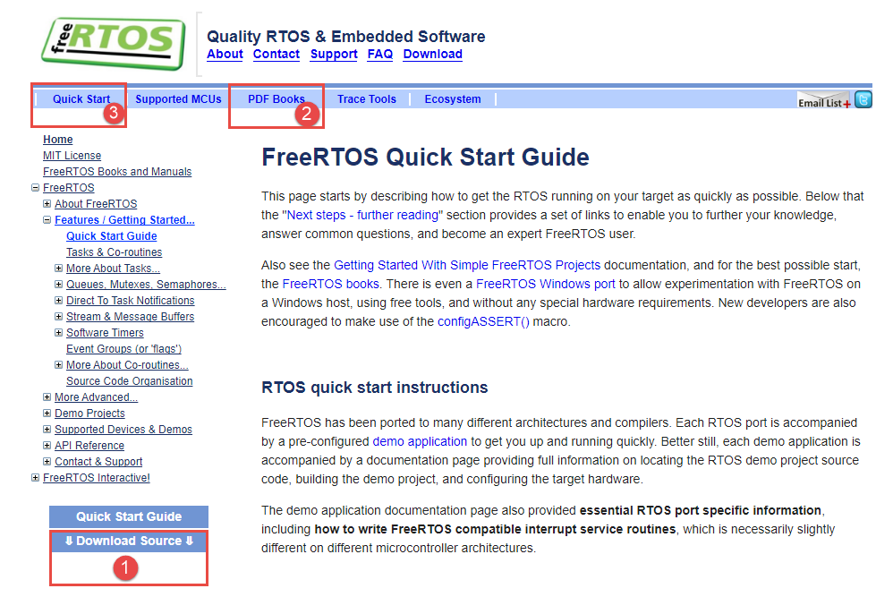
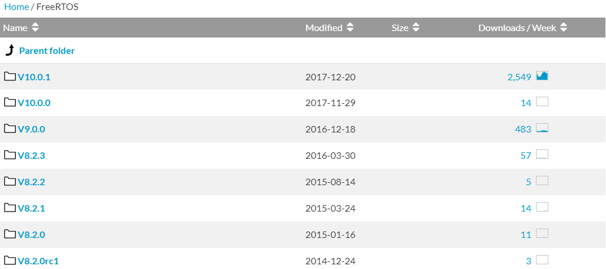
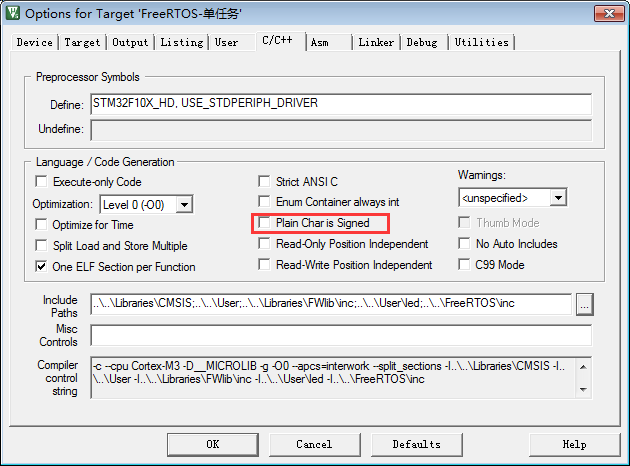

.. vim: syntax=rst

初识FreeRTOS
=============

FreeRTOS版权
~~~~~~~~~~~~~~~~~~~~

FreeRTOS由美国的Richard Barry于2003年发布，Richard Barry是FreeRTOS的拥有者和维护者，在过去的十多年中FreeRTOS历经了9个版本，与众多半导体厂商合作密切，累计开发者数百万，是目前市场占有率最高的RTOS。

FreeRTOS于2018年被亚马逊收购，改名为AWS FreeRTOS，版本号升级为V10，且开源协议也由原来的GPLv2+修改为MIT，与GPLv2+相比，MIT更加开放，你完全可以理解为是为所欲为的免费。V9以前的版本还是维持原样，V10版本相比于V9就是加入了一些物联网相关的组件，内核基本不
变。亚马逊收购FreeRTOS也是为了进军眼下炒的火热的物联网和人工智能。我们这本书还是以V9版本来讲解。

FreeRTOS收费问题
~~~~~~~~~~~~~~~~~~~~~~

FreeRTOS
^^^^^^^^^^^^^^^^

FreeRTOS是一款“开源免费”的实时操作系统，遵循的是GPLv2+的许可协议。这里说到的开源，指的是你可以免费得获取到FreeRTOS的源代码，且当你的产品使用了FreeRTOS且没有修改FreeRTOS内核源码的时候，你的产品的全部代码都可以闭源，不用开源，但是当你修改了FreeRTOS内核源
码的时候，就必须将修改的这部分开源，反馈给社区，其它应用部分不用开源。免费的意思是无论你是个人还是公司，都可以免费地使用，不需要掏一分钱。

OpenRTOS
^^^^^^^^^^^^^^^^

FreeRTOS 和 OpenRTOS 拥有的代码是一样的，但是可从官方获取到的服务却是不一样的。FreeRTOS号称免费，OpenRTOS号称收费，它们的具体区别见表格3‑1。

表格‑1FreeRTOS开源授权与OpenRTOS商业授权的区别

================================== ======================== ========
比较的项目                         FreeRTOS                 OpenRTOS
================================== ======================== ========
是否免费                           是                       否
可否商业使用                       是                       是
是否需要版权费                     否                       否
是否提供技术支持                   否                       是
是否被法律保护                     否                       是
是否需要开源工程代码               否                       否
是否需要开源修改的内核源码         是                       否
是否需要声明产品使用了FreeRTOS     如果发布源码，则需要声明 否
是否需要提供FreeRTOS的整个工程代码 如果发布源码，则需要提供 否
================================== ======================== ========

SaveRTOS
^^^^^^^^^^^^^^^^

SaveRTOS也是基于FreeRTOS，但是SaveRTOS为某些特定的领域做了安全相关的设计，有关SaveRTOS获得的安全验证具体见表格3‑2。当然，SaveRTOS也是需要收费，人家这些安全验证可不是白做的。

表格‑2SaveRTOS获得的安全方面的验证

========================= ===============================
行业类目                  验证编号
========================= ===============================
工控                      IEC 61508
铁路                      EN 50128
医疗                      IEC 62304/FDA 510K
Nuclear（翻译为核能？）   IEC 61513、IEC62138、ASME NQA-1
汽车电子                  ISO 26262
Process（这个怎么翻译？） IEC 61511
航空                      DO178B
========================= ===============================

FreeRTOS资料获取
~~~~~~~~~~~~~~~~~~~~~~~~

FreeRTOS的源码和相应的官方书籍均可从官网 `www.freertos.org <http://www.freertos.org>`_ 获得，
官网首页打开后具体见图 FreeRTOS官网首页_。

图3‑1FreeRTOS官网首页

获取源码
^^^^^^^^^^^^

FreeRTOS官网首页_ **(1)** ：点击Download Source 按钮，可以下载FreeRTOS最新版本的源码。如果想下载以往版本的可
从托管网址： https://sourceforge.net/projects/freertos/files/FreeRTOS/
下载。截止到目前，已经更新到V10.0.1，具体见图 FreeRTOS版本更新目录_。

图3‑2FreeRTOS版本更新目录

获取书籍
^^^^^^^^^^^^

FreeRTOS官网首页_ **(2)** ：点击PDF Books可以下载FreeRTOS官方的两本电子书，分别
为 `FreeRTOS V10.0.0 Reference Manual <https://www.freertos.org/Documentation/FreeRTOS_Reference_Manual_V10.0.0.pdf>`_ .pdf和
Mastering_the_FreeRTOS_Real_Time_Kernel-A_Hands-On_Tutorial_Guide.pdf，一本是API参考手册，
另外一本是手把手入门教程。不过都是英文的，英文不好的朋友看起来还是有些吃力。

快速入门
^^^^^^^^^^^^

FreeRTOS官网首页_ **(3)** ：Quick Start Guide是网页版的快速入门教程。

FreeRTOS的编程风格
~~~~~~~~~~~~~~~~~~~~~~~~~~

学习一个RTOS，搞懂它的编程的风格很重要，这可以大大提供我们阅读代码的效率。下面我们就以FreeRTOS里面的数据类型、变量名、函数名和宏这几个方面做简单介绍。

数据类型
^^^^^^^^

在FreeRTOS中，使用的数据类型虽然都是标准C里面的数据类型，但是针对不同的处理器，对标准C的数据类型又进行了重定义，给它们取了一个新的名字，比如char重新定义了一个名字portCHAR，这里面的port表示接口的意思，就是FreeRTOS要移植到这些处理器上需要这些接口文件来把它们连接在一起
。但是用户在写程序的时候并非一定要遵循FreeRTOS的风格，我们还是可以直接用C语言的标准类型。在FreeRTOS中，int型从不使用，只使用short和long型。在Cortex-M内核的MCU中，short为16位，long为32位。

FreeRTOS中详细的数据类型重定义在portmacro.h这个头文件中实现，具体汇总见表 FreeRTOS中的数据类型重定义_
和 代码清单:FreeRTOS中的数据类型重定义_。

表格3‑3 FreeRTOS中的数据类型重定义

.. list-table::
   :widths: 33 33 33
   :name: FreeRTOS中的数据类型重定义
   :header-rows: 0

   * - 新定义的数据类型实际的
     - 数据类型（C标准类型）
     -

   * - portCHAR
     - char
     -

   * - portSHORT
     - short
     -

   * - portLONG
     - long
     -

   * - portTickType
     - unsigned shortint
     - 用于定义系统时基计数器的值和阻塞时间的值。当FreeRTOSConfig.h头文件中的宏configUSE_16_BIT_TICKS为1时则为16位。 

   * -
     - unsigned int
     - 用于定义系统时基计数器的值和阻塞时间的值。FreeRTOSConfig.h头文件 中的宏configUSE_16_BIT_TICKS为1时则为32位。

   * - portBASE_TYPE
     - long
     - 根据处理器的架构来决定是多少位的，如果是32/16/8bit的处理器则是32/16/8bit的数据类型。一般用于定义函数的返回值或者布尔类型。

.. code-block:: c
    :caption: 代码清单:FreeRTOS中的数据类型重定义
    :name: 代码清单:FreeRTOS中的数据类型重定义
    :linenos:

    #define portCHAR    char
    #define portFLOAT   float
    #define portDOUBLE    double
    #define portLONG    long
    #define portSHORT   short
    #define portSTACK_TYPE  uint32_t
    #define portBASE_TYPE long

    typedef portSTACK_TYPE StackType_t;
    typedeflong BaseType_t;
    typedefunsigned long UBaseType_t;

    #if( configUSE_16_BIT_TICKS == 1 )
    typedefuint16_t TickType_t;
    #define portMAX_DELAY ( TickType_t ) 0xffff
    #else
    typedefuint32_t TickType_t;
    #define portMAX_DELAY ( TickType_t ) 0xffffffffUL

在编程的时候，如果用户没有明确指定char的符号类型，那么编译器会默认的指定char型的变量为无符号或者有符号。
正是因为这个原因，在FreeRTOS中，我们都需要明确的指定变量char是有符号的还是无符号的。在keil中，默认char
是无符号的，但是也可以配置为有符号的，具体配套过程见图 char型变量的符号配置_。

图3‑3 char型变量的符号配置（KEIL）

变量名
^^^^^^

在FreeRTOS中，定义变量的时候往往会把变量的类型当作前缀加在变量上，这样的好处是让用户一看到这个变量就知道该变量的类型。比如char型变量的前缀是c，short型变量的前缀是s，long型变量的前缀是l，
portBASE_TYPE类型变量的前缀是x。还有其他的数据类型，比如数据结构，任务句柄，队列句柄等定义的变量名的前缀也是x。

如果一个变量是无符号型的那么会有一个前缀u，如果是一个指针变量则会有一个前缀p。因此，当我们定义一个无符号的char型变量的时候会加一个uc前缀，当定义一个char型的指针变量的时候会有一个pc前缀。

函数名
^^^^^^

函数名包含了函数返回值的类型、函数所在的文件名和函数的功能，如果是私有的函数则会加一个prv（private）的前缀。特别的，在函数名中加入了函数所在的文件名，这大大的帮助了用户提高寻找函数定义的效率和了解函数作用的目的，具体的举例如下：

1. vTaskPrioritySet()函数的返回值为void型，在task.c这个文件中定义。

2. xQueueReceive()函数的返回值为portBASE_TYPE型，在queue.c这个文件中定义。

3. vSemaphoreCreateBinary()函数的返回值为void型，在semphr.h这个文件中定义。

宏
^^^

宏均是由大写字母表示，并配有小写字母的前缀，前缀用于表示该宏在哪个头文件定义，部分举例具体见表格3‑4。

表格3‑4 FreeRTOS宏定义举例

================================== ================
前缀                               宏定义的文件
================================== ================
port (举例, portMAX_DELAY)         portable.h
task (举例, taskENTER_CRITICAL())  task.h
pd (举例, pdTRUE)                  projdefs.h
config(举例, configUSE_PREEMPTION) FreeRTOSConfig.h
err (举例, errQUEUE_FULL)          projdefs.h
================================== ================

这里有个地方要注意的是信号量的函数都是一个宏定义，但是它的函数的命名方法是遵循函数的命名方法而不是宏定义的方法。

在贯穿FreeRTOS的整个代码中，还有几个通用的宏定义我们也要注意下，都是表示0和1的宏，具体见表格3‑5。

表格3‑5 FreeRTOS通用宏定义

======= ========
宏      实际的值
======= ========
pdTRUE  1
pdFALSE 0
pdPASS  1
pdFAIL  0
======= ========

格式
^^^^^^

一个tab键盘等于四个空格键。我们在编程的时候最好使用空格键而不是使用tab键，当两个编译器的tab键设置的大小不一样的时候，代码移植的时候代码的格式就会变乱，而使用空格键则不会出现这种问题。

