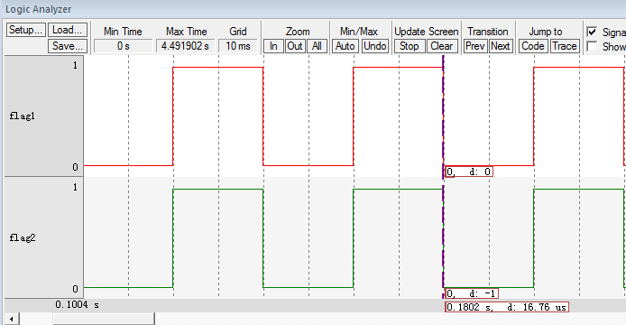

.. vim: syntax=rst

空闲任务与阻塞延时的实现
=============================

在上一章节中，任务体内的延时使用的是软件延时，即还是让CPU空等来达到延时的效果。使用RTOS的很大优势就是榨干CPU的性能，永远不能让它闲着，任务如果需要延时也就不能再让CPU空等来实现延时的效果。RTOS中的延时叫阻塞延时，即任务需要延时的时候，任务会放弃CPU的使用权，CPU可以去干其它的事情
，当任务延时时间到，重新获取CPU使用权，任务继续运行，这样就充分地利用了CPU的资源，而不是干等着。

当任务需要延时，进入阻塞状态，那CPU又去干什么事情了？如果没有其它任务可以运行，RTOS都会为CPU创建一个空闲任务，这个时候CPU就运行空闲任务。在FreeRTOS中，空闲任务是系统在【启动调度器】的时候创建的优先级最低的任务，空闲任务主体主要是做一些系统内存的清理工作。但是为了简单起见，我们本
章实现的空闲任务只是对一个全局变量进行计数。鉴于空闲任务的这种特性，在实际应用中，当系统进入空闲任务的时候，可在空闲任务中让单片机进入休眠或者低功耗等操作。

实现空闲任务
~~~~~~~~~~~~

目前我们在创建任务时使用的栈和TCB都使用的是静态的内存，即需要预先定义好内存，空闲任务也不例外。有关空闲任务的栈和TCB需要用到的内存空间均在main.c中定义。

定义空闲任务的栈
^^^^^^^^^^^^^^^^

空闲任务的栈在我们在main.c中定义，具体见 代码清单:阻塞延时-1_。

.. code-block:: c
    :caption: 代码清单:阻塞延时-1定义空闲任务的栈
    :name: 代码清单:阻塞延时-1
    :linenos:

    /* 定义空闲任务的栈 */
    #define configMINIMAL_STACK_SIZE	( ( unsigned short ) 128 )(2)
    StackType_t IdleTaskStack[configMINIMAL_STACK_SIZE];(1)

-   代码清单:阻塞延时-1_ **(1)**\ ：空闲任务的栈是一个定义好的数组，大小由FreeRTOSConfig.h中定义的
    宏configMINIMAL_STACK_SIZE控制，默认为128，单位为字，即512个字节。

定义空闲任务的任务控制块
^^^^^^^^^^^^^^^^^^^^^^^^

任务控制块是每一个任务必须的，空闲任务的的任务控制块我们在main.c中定义，是一个全局变量，具体见 代码清单:阻塞延时-2_。

.. code-block:: c
    :caption: 代码清单:阻塞延时-2定义空闲任务的任务控制块
    :name: 代码清单:阻塞延时-2
    :linenos:

    /* 定义空闲任务的任务控制块 */
    TCB_t IdleTaskTCB;

创建空闲任务
^^^^^^^^^^^^

当定义好空闲任务的栈，任务控制块后，就可以创建空闲任务。空闲任务在调度器启动函数vTaskStartScheduler()中创建，具体
实现见 代码清单:阻塞延时-3_ 的高亮部分。

.. code-block:: c
    :caption: 代码清单:阻塞延时-3创建空闲任务
    :emphasize-lines: 7-27
    :name: 代码清单:阻塞延时-3
    :linenos:

    extern TCB_t IdleTaskTCB;
    void vApplicationGetIdleTaskMemory( TCB_t **ppxIdleTaskTCBBuffer,
                                        StackType_t **ppxIdleTaskStackBuffer,
    uint32_t *pulIdleTaskStackSize );
    void vTaskStartScheduler( void )
    {
    /*=======================创建空闲任务start=======================*/
        TCB_t *pxIdleTaskTCBBuffer = NULL;         /* 用于指向空闲任务控制块 */
        StackType_t *pxIdleTaskStackBuffer = NULL; /* 用于空闲任务栈起始地址 */
    uint32_t ulIdleTaskStackSize;

    /* 获取空闲任务的内存：任务栈和任务TCB */(1)
        vApplicationGetIdleTaskMemory( &pxIdleTaskTCBBuffer,
    &pxIdleTaskStackBuffer,
    &ulIdleTaskStackSize );
    /* 创建空闲任务 */ (2)
        xIdleTaskHandle =
        xTaskCreateStatic( (TaskFunction_t)prvIdleTask,    /* 任务入口 */
                        (char *)"IDLE",             /* 任务名称，字符串形式 */
                        (uint32_t)ulIdleTaskStackSize ,  /* 任务栈大小，单位为字 */
                        (void *) NULL,                   /* 任务形参 */
                        (StackType_t *)pxIdleTaskStackBuffer, /* 任务栈起始地址 */
                        (TCB_t *)pxIdleTaskTCBBuffer ); /* 任务控制块 */
    /* 将任务添加到就绪列表 */(3)
        vListInsertEnd( &( pxReadyTasksLists[0] ),
    &( ((TCB_t *)pxIdleTaskTCBBuffer)->xStateListItem ) );
    /*==========================创建空闲任务end=====================*/

    /* 手动指定第一个运行的任务 */
        pxCurrentTCB = &Task1TCB;

    /* 启动调度器 */
    if ( xPortStartScheduler() != pdFALSE )
        {
    /* 调度器启动成功，则不会返回，即不会来到这里 */
        }
    }

-   代码清单:阻塞延时-3_ **(1)**\ ：获取空闲任务的内存，即将pxIdleTaskTCBBuffer和pxIdleTaskStackBuffer这两个接下来
    要作为形参传到xTaskCreateStatic()函数的指针分别指向空闲任务的TCB和栈的起始地址，这个操作由函数vApplicationGe
    tIdleTaskMemory()来实现，该函数需要用户自定义，目前我们在main.c中实现，具体见 代码清单:阻塞延时-4_。

.. code-block:: c
    :caption: 代码清单:阻塞延时-4vApplicationGetIdleTaskMemory()函数
    :name: 代码清单:阻塞延时-4
    :linenos:

    void vApplicationGetIdleTaskMemory( TCB_t **ppxIdleTaskTCBBuffer,
    StackType_t **ppxIdleTaskStackBuffer,
    uint32_t *pulIdleTaskStackSize )
    {
        *ppxIdleTaskTCBBuffer=&IdleTaskTCB;
        *ppxIdleTaskStackBuffer=IdleTaskStack;
        *pulIdleTaskStackSize=configMINIMAL_STACK_SIZE;
    }

-   代码清单:阻塞延时-3_ **(2)**\ ：调用xTaskCreateStatic()函数创建空闲任务。

-   代码清单:阻塞延时-3_ **(3)**\ ：将空闲任务插入到就绪列表的开头。在下一章我们会支持优先级，空闲任务默认的优先级是
    最低的，即排在就绪列表的开头。

实现阻塞延时
~~~~~~~~~~~~~~~

vTaskDelay()函数
^^^^^^^^^^^^^^^^^^^^^^^^^^^^

阻塞延时的阻塞是指任务调用该延时函数后，任务会被剥离CPU使用权，然后进入阻塞状态，直到延时结束，任务重新获取CPU使用权才
可以继续运行。在任务阻塞的这段时间，CPU可以去执行其他的任务，如果其他的任务也在延时状态，那么CPU就将运行空闲任务。阻塞
延时函数在task.c中定义，具体代码实现见 代码清单:阻塞延时-5_。

.. code-block:: c
    :caption: 代码清单:阻塞延时-5vTaskDelay()函数
    :name: 代码清单:阻塞延时-5
    :linenos:

    void vTaskDelay( const TickType_t xTicksToDelay )
    {
        TCB_t *pxTCB = NULL;

    /* 获取当前任务的TCB */
        pxTCB = pxCurrentTCB;(1)

    /* 设置延时时间 */
        pxTCB->xTicksToDelay = xTicksToDelay;(2)

    /* 任务切换 */
        taskYIELD();(3)
    }

-   代码清单:阻塞延时-5_ **(1)**\ ：获取当前任务的任务控制块。pxCurrentTCB是一个在task.c定义的全局指针，用于指向
    当前正在运行或者即将要运行的任务的任务控制块。

-   代码清单:阻塞延时-5_ **(2)**\ ：xTicksToDelay是任务控制块的一个成员，用于记录任务需要延时的时间，单位为SysTick
    的中断周期。比如我们本书当中SysTick的中断周期为10ms，调用vTaskDelay(2)则完成2*10ms的延时。xTicksToDelay定义具
    体见 代码清单:阻塞延时-6_ 的高亮部分。

.. code-block:: c
    :caption: 代码清单:阻塞延时-6xTicksToDelay定义
    :emphasize-lines: 11
    :name: 代码清单:阻塞延时-6
    :linenos:

    typedefstruct tskTaskControlBlock
    {
    volatile StackType_t    *pxTopOfStack;    /* 栈顶 */

        ListItem_t		xStateListItem;   /* 任务节点 */

        StackType_t             *pxStack;         /* 任务栈起始地址 */
    /* 任务名称，字符串形式 */
    char                    pcTaskName[ configMAX_TASK_NAME_LEN ];

        TickType_t xTicksToDelay; /* 用于延时 */
    } tskTCB;

修改vTaskSwitchContext()函数
^^^^^^^^^^^^^^^^^^^^^^^^^^^^^^^^^^^^^^^^^^^^^^^^

-   代码清单:阻塞延时-5_ **(3)**\ ：任务切换。调用tashYIELD()会产生PendSV中断，在PendSV中断服务函数中会调用上下文切换
    函数vTaskSwitchContext()，该函数的作用是寻找最高优先级的就绪任务，然后更新pxCurrentTCB。上一章我们只有两个任务，则
    pxCurrentTCB不是指向任务1就是指向任务2，本章节开始我们多增加了一个空闲任务，则需要让pxCurrentTCB在这三个任务中切换，
    算法需要改变，具体实现见 代码清单:阻塞延时-7_ 的高亮部分。

.. code-block:: c
    :caption: 代码清单:阻塞延时-7vTaskSwitchContext()函数
    :emphasize-lines: 15-72
    :name: 代码清单:阻塞延时-7
    :linenos:

    #if 0
    void vTaskSwitchContext( void )
    {/* 两个任务轮流切换 */
    if ( pxCurrentTCB == &Task1TCB )
        {
            pxCurrentTCB = &Task2TCB;
        }
    else
        {
            pxCurrentTCB = &Task1TCB;
        }
    }
    #else

    void vTaskSwitchContext( void )
    {
    /* 如果当前任务是空闲任务，那么就去尝试执行任务1或者任务2，
    看看他们的延时时间是否结束，如果任务的延时时间均没有到期，
    那就返回继续执行空闲任务 */
    if ( pxCurrentTCB == &IdleTaskTCB )(1)
        {
    if (Task1TCB.xTicksToDelay == 0)
            {
                pxCurrentTCB =&Task1TCB;
            }
    else if (Task2TCB.xTicksToDelay == 0)
            {
                pxCurrentTCB =&Task2TCB;
            }
    else
            {
    return;	/* 任务延时均没有到期则返回，继续执行空闲任务 */
            }
        }
    else/* 当前任务不是空闲任务则会执行到这里 */(2)
        {
    /*如果当前任务是任务1或者任务2的话，检查下另外一个任务,
    如果另外的任务不在延时中，就切换到该任务
    否则，判断下当前任务是否应该进入延时状态，
    如果是的话，就切换到空闲任务。否则就不进行任何切换 */
    if (pxCurrentTCB == &Task1TCB)
            {
    if (Task2TCB.xTicksToDelay == 0)
                {
                    pxCurrentTCB =&Task2TCB;
                }
    else if (pxCurrentTCB->xTicksToDelay != 0)
                {
                    pxCurrentTCB = &IdleTaskTCB;
                }
    else
                {
    return;	/* 返回，不进行切换，因为两个任务都处于延时中 */
                }
            }
    else if (pxCurrentTCB == &Task2TCB)
            {
    if (Task1TCB.xTicksToDelay == 0)
                {
                    pxCurrentTCB =&Task1TCB;
                }
    else if (pxCurrentTCB->xTicksToDelay != 0)
                {
                    pxCurrentTCB = &IdleTaskTCB;
                }
    else
                {
    return;	/* 返回，不进行切换，因为两个任务都处于延时中 */
                }
            }
        }
    }

    #endif

-   代码清单:阻塞延时-7_ **(1)**\ ：如果当前任务是空闲任务，那么就去尝试执行任务1或者任务2，看看他们的延时
    时间是否结束，如果任务的延时时间均没有到期，那就返回继续执行空闲任务。

-   代码清单:阻塞延时-7_ **(2)**\ ：如果当前任务是任务1或者任务2的话，检查下另外一个任务，如果另外的任务不
    在延时中，就切换到该任务。否则，判断下当前任务是否应该进入延时状态，如果是的话，就切换到空闲任务，否则就
    不进行任何切换。

SysTick中断服务函数
~~~~~~~~~~~~~~~~~~~~~~~~~~

在任务上下文切换函数vTaskSwitchContext()中，会判断每个任务的任务控制块中的延时成员xTicksToDelay的值是否为0，
如果为0就要将对应的任务就绪，如果不为0就继续延时。如果一个任务要延时，一开始xTicksToDelay肯定不为0，
当xTicksToDelay变为0的时候表示延时结束，那么xTicksToDelay是以什么周期在递减？在哪里递减？在FreeRTOS中，这个
周期由SysTick中断提供，操作系统里面的最小的时间单位就是SysTick的中断周期，我们称之为一个tick，SysTick中断服
务函数在port.c.c中实现，具体见 代码清单:阻塞延时-8_ 。

.. code-block:: c
    :caption: 代码清单:阻塞延时-8SysTick中断服务函数
    :name: 代码清单:阻塞延时-8
    :linenos:

    void xPortSysTickHandler( void )
    {
    /* 关中断 */
        vPortRaiseBASEPRI();(1)

    /* 更新系统时基 */
        xTaskIncrementTick();(2)

    /* 开中断 */
        vPortClearBASEPRIFromISR();(3)
    }

-   代码清单:阻塞延时-8_ **(1)**\ ：进入临界段，关中断。

xTaskIncrementTick()函数
^^^^^^^^^^^^^^^^^^^^^^^^^^^^^^^^^

-   代码清单:阻塞延时-8_ **(2)**\ ：更新系统时基，该函数在task.c中定义，具体见 代码清单:阻塞延时-9_。

.. code-block:: c
    :caption: 代码清单:阻塞延时-9xTaskIncrementTick()函数
    :name: 代码清单:阻塞延时-9
    :linenos:

    void xTaskIncrementTick( void )
    {
        TCB_t *pxTCB = NULL;
        BaseType_t i = 0;

    /* 更新系统时基计数器xTickCount，xTickCount是一个在port.c中定义的全局变量 */(1)
    const TickType_t xConstTickCount = xTickCount + 1;
        xTickCount = xConstTickCount;

    /* 扫描就绪列表中所有任务的xTicksToDelay，如果不为0，则减1 */(2)
    for (i=0; i<configMAX_PRIORITIES; i++)
        {
    pxTCB = ( TCB_t * ) listGET_OWNER_OF_HEAD_ENTRY( ( &pxReadyTasksLists[i] ) );
    if (pxTCB->xTicksToDelay > 0)
            {
                pxTCB->xTicksToDelay --;
            }
        }

    /* 任务切换 */(3)
        portYIELD();
    }

-   代码清单:阻塞延时-9_ **(1)**\ ：更新系统时基计数器xTickCount，加一操作。xTickCount是一个在port.c中定义的全
    局变量，在函数vTaskStartScheduler()中调用xPortStartScheduler()函数前初始化。

-   代码清单:阻塞延时-9_ **(2)**\ ：扫描就绪列表中所有任务的xTicksToDelay，如果不为0，则减1。

-   代码清单:阻塞延时-9_ **(3)**\ ：执行一次任务切换。

-   代码清单:阻塞延时-8_ **(3)**\ ：退出临界段，开中断。

SysTick初始化函数
~~~~~~~~~~~~~~~~~~~~~~~~

SSysTick的中断服务函数要想被顺利执行，则SysTick必须先初始化。SysTick初始化函数在port.c中定义，具体见 代码清单:阻塞延时-10_。

.. code-block:: c
    :caption: 代码清单:阻塞延时-10vPortSetupTimerInterrupt()函数
    :emphasize-lines: 7-13
    :name: 代码清单:阻塞延时-10
    :linenos:

    /* SysTick 控制寄存器 */(1)
    #define portNVIC_SYSTICK_CTRL_REG  (*((volatile uint32_t *) 0xe000e010 ))
    /* SysTick 重装载寄存器寄存器 */
    #define portNVIC_SYSTICK_LOAD_REG  (*((volatile uint32_t *) 0xe000e014 ))

    /* SysTick 时钟源选择 */
    #ifndef configSYSTICK_CLOCK_HZ
    #define configSYSTICK_CLOCK_HZ configCPU_CLOCK_HZ
    /* 确保SysTick的时钟与内核时钟一致 */
    #define portNVIC_SYSTICK_CLK_BIT	( 1UL << 2UL )
    #else
    #define portNVIC_SYSTICK_CLK_BIT	( 0 )
    #endif

    #define portNVIC_SYSTICK_INT_BIT			( 1UL << 1UL )
    #define portNVIC_SYSTICK_ENABLE_BIT			( 1UL << 0UL )

    void vPortSetupTimerInterrupt( void )(2)
    {
    /* 设置重装载寄存器的值 */(2)-1
    portNVIC_SYSTICK_LOAD_REG = ( configSYSTICK_CLOCK_HZ / configTICK_RATE_HZ ) - 1UL;

    /* 设置系统定时器的时钟等于内核时钟(2)-2
    使能SysTick 定时器中断
    使能SysTick 定时器 */
        portNVIC_SYSTICK_CTRL_REG = ( portNVIC_SYSTICK_CLK_BIT |
                                    portNVIC_SYSTICK_INT_BIT |
                                    portNVIC_SYSTICK_ENABLE_BIT );
    }

-   代码清单:阻塞延时-10_ **(1)**\ ：配置SysTick需要用到的寄存器和宏定义，在port.c中实现。

-   代码清单:阻塞延时-10_ **(2)**\ ：SysTick初始化函数vPortSetupTimerInterrupt()，在xPortStartScheduler()
    中被调用，具体见 代码清单:阻塞延时-11_ 的高亮部分。

.. code-block:: c
    :caption: 代码清单:阻塞延时-11xPortStartScheduler()函数中调用vPortSetupTimerInterrupt()
    :emphasize-lines: 5-8
    :name: 代码清单:阻塞延时-11
    :linenos:

    BaseType_t xPortStartScheduler( void )
    {
    /* 配置PendSV 和 SysTick 的中断优先级为最低 */
        portNVIC_SYSPRI2_REG |= portNVIC_PENDSV_PRI;
        portNVIC_SYSPRI2_REG |= portNVIC_SYSTICK_PRI;

    /* 初始化SysTick */
        vPortSetupTimerInterrupt();

    /* 启动第一个任务，不再返回 */
        prvStartFirstTask();

    /* 不应该运行到这里 */
    return 0;
    }

-   代码清单:阻塞延时-10_ **(2)-1**\ ：设置重装载寄存器的值，决定SysTick的中断周期。
    从 代码清单:阻塞延时-10_ **(1)**\ 可以知道：如果没有定义configSYSTICK_CLOCK_HZ那
    么configSYSTICK_CLOCK_HZ就等于configCPU_CLOCK_HZ，configSYSTICK_CLOCK_HZ确实没
    有定义，则configSYSTICK_CLOCK_HZ由在FreeRTOSConfig.h中定义的configCPU_CLOCK_HZ决
    定，同时configTICK_RATE_HZ也在FreeRTOSConfig.h中定义，具体见 代码清单:阻塞延时-12_。

.. code-block:: c
    :caption: 代码清单:阻塞延时-12configCPU_CLOCK_HZ与configTICK_RATE_HZ宏定义
    :name: 代码清单:阻塞延时-12
    :linenos:

    #define configCPU_CLOCK_HZ	(( unsigned long ) 25000000)(1)
    #define configTICK_RATE_HZ	(( TickType_t ) 100)(2)

-   代码清单:阻塞延时-12_ **(1)**\ ：系统时钟的大小，因为目前是软件仿真，需要配置成与
    system_ARMCM3.c(system_ARMCM4.c或system_ARMCM7.c)文件中的SYSTEM_CLOCK的一样，
    即等于25M。如果有具体的硬件，则配置成与硬件的系统时钟一样。

-   代码清单:阻塞延时-12_ **(2)**\ ：SysTick每秒中断多少次，目前配置为100，即每10ms中断一次。

-   代码清单:阻塞延时-10_ **(2)-②**\ ：设置系统定时器的时钟等于内核时钟，使能SysTick
    定时器中断，使能SysTick 定时器。

main函数
~~~~~~~~~~~~

main函数和任务代码变动不大，具体见 代码清单:阻塞延时-13_，有变动部分代码已高亮。

.. code-block:: c
    :caption: 代码清单:阻塞延时-13 main函数
    :emphasize-lines: 114-117,135-140,144-154
    :name: 代码清单:阻塞延时-13
    :linenos:

    /*
    *************************************************************************
    *                             包含的头文件
    *************************************************************************
    */
    #include"FreeRTOS.h"
    #include"task.h"

    /*
    *************************************************************************
    *                              全局变量
    *************************************************************************
    */
    portCHAR flag1;
    portCHAR flag2;

    extern List_t pxReadyTasksLists[ configMAX_PRIORITIES ];

    /*
    *************************************************************************
    *                        任务控制块& STACK
    *************************************************************************
    */
    TaskHandle_t Task1_Handle;
    #define TASK1_STACK_SIZE                    128
    StackType_t Task1Stack[TASK1_STACK_SIZE];
    TCB_t Task1TCB;

    TaskHandle_t Task2_Handle;
    #define TASK2_STACK_SIZE                    128
    StackType_t Task2Stack[TASK2_STACK_SIZE];
    TCB_t Task2TCB;

    /*
    *************************************************************************
    *                               函数声明
    *************************************************************************
    */
    void delay (uint32_t count);
    void Task1_Entry( void *p_arg );
    void Task2_Entry( void *p_arg );

    /*
    ************************************************************************
    *                                main函数
    ************************************************************************
    */

    int main(void)
    {
    /* 硬件初始化 */
    /* 将硬件相关的初始化放在这里，如果是软件仿真则没有相关初始化代码 */

    /* 初始化与任务相关的列表，如就绪列表 */
        prvInitialiseTaskLists();

    /* 创建任务 */
        Task1_Handle =
            xTaskCreateStatic( (TaskFunction_t)Task1_Entry,   /* 任务入口 */
            (char *)"Task1",               /* 任务名称，字符串形式 */
            (uint32_t)TASK1_STACK_SIZE ,   /* 任务栈大小，单位为字 */
            (void *) NULL,                 /* 任务形参 */
            (StackType_t *)Task1Stack,     /* 任务栈起始地址 */
            (TCB_t *)&Task1TCB );      /* 任务控制块 */
    /* 将任务添加到就绪列表 */
        vListInsertEnd( &( pxReadyTasksLists[1] ),
    &( ((TCB_t *)(&Task1TCB))->xStateListItem ) );

        Task2_Handle =
            xTaskCreateStatic( (TaskFunction_t)Task2_Entry,   /* 任务入口 */
            (char *)"Task2",               /* 任务名称，字符串形式 */
            (uint32_t)TASK2_STACK_SIZE ,   /* 任务栈大小，单位为字 */
            (void *) NULL,                 /* 任务形参 */
            (StackType_t *)Task2Stack,     /* 任务栈起始地址 */
            (TCB_t *)&Task2TCB );          /* 任务控制块 */
    /* 将任务添加到就绪列表 */
        vListInsertEnd( &( pxReadyTasksLists[2] ),
    &( ((TCB_t *)(&Task2TCB))->xStateListItem ) );

    /* 启动调度器，开始多任务调度，启动成功则不返回 */
        vTaskStartScheduler();

    for (;;)
        {
            /* 系统启动成功不会到达这里 */
        }
    }

    /*
    *************************************************************************
    *                               函数实现
    *************************************************************************
    */

    /* 软件延时 */
    void delay (uint32_t count)
    {
        for (; count!=0; count--);
    }
    /* 任务1 */
    void Task1_Entry( void *p_arg )
    {
    for ( ;; )
        {
    #if 0
            flag1 = 1;
            delay( 100 );
            flag1 = 0;
            delay( 100 );

    /* 任务切换，这里是手动切换 */
            portYIELD();
    #else
            flag1 = 1;
            vTaskDelay( 2 );(1)
            flag1 = 0;
            vTaskDelay( 2 );
    #endif
        }
    }

    /* 任务2 */
    void Task2_Entry( void *p_arg )
    {
    for ( ;; )
        {
    #if 0
            flag2 = 1;
            delay( 100 );
            flag2 = 0;
            delay( 100 );

    /* 任务切换，这里是手动切换 */
            portYIELD();
    #else
            flag2 = 1;
            vTaskDelay( 2 );(2)
            flag2 = 0;
            vTaskDelay( 2 );
    #endif
        }
    }

    /* 获取空闲任务的内存 */
    StackType_t IdleTaskStack[configMINIMAL_STACK_SIZE];(3)
    TCB_t IdleTaskTCB;
    void vApplicationGetIdleTaskMemory( TCB_t **ppxIdleTaskTCBBuffer,
                                        StackType_t **ppxIdleTaskStackBuffer,
    uint32_t *pulIdleTaskStackSize )
    {
        *ppxIdleTaskTCBBuffer=&IdleTaskTCB;
        *ppxIdleTaskStackBuffer=IdleTaskStack;
        *pulIdleTaskStackSize=configMINIMAL_STACK_SIZE;
    }

-   代码清单:阻塞延时-13_ **(1)**\ 和\ **(2)**\ ：延时函数均由原来的软件延时替代
    为阻塞延时，延时时间均为2个SysTick中断周期，即20ms。

-   代码清单:阻塞延时-13_ **(3)**\ ：定义空闲任务的栈和TCB。

实验现象
~~~~~~~~

进入软件调试，全速运行程序，从逻辑分析仪中可以看到两个任务的波形是完全同步，就好像CPU
在同时干两件事情，具体仿真的波形图见图 实验现象1_ 和图 实验现象2_。

.. image:: media/Implementation_of_idle_tasks_and_blocking_delays/Implem002.png
   :align: center
   :name: 实验现象1
   :alt: 实验现象1

从图 实验现象1_ 和图 实验现象2_ 可以看出，flag1和flag2的高电平的时间为(0.1802-0.1602)s，
刚好等于阻塞延时的20ms，所以实验现象跟代码要实现的功能是一致的。
