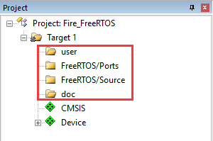

.. vim: syntax=rst

新建FreeRTOS工程—软件仿真
=============================

在开始写FreeRTOS内核之前，我们先新建一个FreeRTOS的工程，Device选择Cortex-M3（Cortex-M4或Cortex-M7）内核的处理器，调试方式选择软件仿真，然后我们再开始一步一步地教大家把FreeRTOS内核从0到1写出来，让大家彻底搞懂FreeRTOS的内部实现和设计的
哲学思想。最后我们再把FreeRTOS移植到野火I.MX RT开发板上，到了最后的移植其实已经非常简单，只需要换一下启动文件和添加bsp驱动就行。

新建本地工程文件夹
~~~~~~~~~~~~~~~~~~

在开始新建工程之前，我们先在本地电脑端新建一个文件夹用于存放工程。文件夹名字我们取为“新建FreeRTOS工程—软件仿真”（名字可以随意取），然后再在该文件夹下面新建各个文件夹和文件，有关这些文件夹的包含关系和作用具体见表格4‑1。

表格‑1工程文件夹根目录下的文件夹的作用

.. list-table::
   :widths: 33 33 33
   :header-rows: 0

   * - 文件夹名称文件夹
     - 文件夹作用
     - 

   * - Doc
     - -
     - 用于存放对整个工程的说明文件，如readme.txt。通常情况下，我们都要对整个工程实现的功能，如何编译，如何使用等做一个简要的说明。

   * - Project
     - -
     - 用于存放新建的工程文件。  

   * - freertos
     - Demo
     - 存放板级支持包，暂时为空。

   * -
     - License
     - 存放FreeRTOS组件，暂时未空。 

   * -
     - Source/include
     - 存放头文件，暂时为空。   

   * -
     - Sou rce/portable/RVDS/ARM_CM3
     - 存放与处理器相关的接口文件，也叫移植文件，暂时为空。

   * -
     - Sou rce/portable/RVDS/ARM_CM4
     -

   * -
     - Sou rce/portable/RVDS/ARM_CM7
     -

   * -
     - Source
     - 存放FreeRTOS内核源码，暂时为空。 

   * - User
     -
     - 存放main.c和其它的用户编写的程序，main.c第一次使用需要用户自行新建。

使用KEIL新建工程
~~~~~~~~~~~~~~~~~~~~

开发环境我们使用KEIL5，版本为5.23，高于或者低于5.23都行，只要是版本5就行。

New Progect
^^^^^^^^^^^^^^^^^^^^^^

首先打开KEIL5软件，新建一个工程，工程文件放在目录Project下面，名称命名为Fire_FreeRTOS，名称可以随便取，但是必须是英文，不能是中文，切记。

Select Device For Target
^^^^^^^^^^^^^^^^^^^^^^^^^^^^^^^^^^^^^^^^^^^^^^^^

当命名好工程名称，点击确定之后会弹出Select Device for Target的选项框，让我们选择处理器，这里我们选择ARMCM3
（ARMCM4或ARMCM7）具体见 图:Select_Device_ARMCM3_For_Target_ 
（图:Select_Device_ARMCM4_For_Target_ 或 图:Select_Device_ARMCM7_For_Target_）。

.. image:: media/Newly_established_FreeRTOS_project/Newlye003.png
   :align: center
   :name: 图:Select_Device_ARMCM4_For_Target
   :alt: 图:Select_Device_ARMCM4_For_Target

.. image:: media/Newly_established_FreeRTOS_project/Newlye004.png
   :align: center
   :name: 图:Select_Device_ARMCM7_For_Target
   :alt: 图:Select_Device_ARMCM7_For_Target

Manage Run-Time Environment
^^^^^^^^^^^^^^^^^^^^^^^^^^^^^^^^^^^^^^^^^^^^^^^^^^^^^^

选择好处理器，点击OK按钮后会弹出Manage Run-Time Environment选项框。这里我们在CMSIS栏选中CORE和Device栏选
中Startup这两个文件即可，具体见 图:Manage_Run-Time_Environment_。

.. image:: media/Newly_established_FreeRTOS_project/Newlye005.png
   :align: center
   :name: 图:Manage_Run-Time_Environment
   :alt: 图:Manage_Run-Time_Environment

点击OK，关闭Manage Run-Time Environment选项框之后，刚刚我们选择的CORE和Startup这两个文件就会添加到我们的工
程组里面，具体见 图:CORE和Startup文件_。

其实这两个文件刚开始都是存放在KEIL的安装目录下，当我们配置Manage Run-Time Environment选项框之后，软件就会把选中好的文件从KEIL的安装目录拷贝到我们的工程目录：Project\RTE\Device\ARMCM3（ARMCM4或ARMCM7）下面。其中startup_A
RMCM3.s（startup_ARMCM4.s或startup_ARMCM7.s）是汇编编写的启动文件，system_ARMCM3.c（startup_ARMCM4.c或startup_ARMCM7.c）是C语言编写的跟时钟相关的文件。更加具体的可直接阅读这两个文件的源码。只要是Cortex-M3
（ARMCM4或ARMCM7）内核的单片机，这两个文件都适用。

在KEIL工程里面新建文件组
~~~~~~~~~~~~~~~~~~~~~~~~~~~~

在工程里面添加user、rtt/ports、rtt/source和doc这几个文件组，用于管理文件，具体见 图:新添加的文件组_。

对于新手，这里有个问题就是如何添加文件组？具体的方法为鼠标右键Target1，在弹出的选项里面选择Add Group…即可，具
体见 图:如何添加组_，需要多少个组就鼠标右击多少次Target1。

在KEIL工程里面添加文件
~~~~~~~~~~~~~~~~~~~~~~~~~~

在工程里面添加好组之后，我们需要把本地工程里面新建好的文件添加到工程里面。具体为把readme.txt文件添加到doc组，main.c
添加到user组，至于FreeRTOS相关的文件我们还没有编写，那么FreeRTOS相关的组就暂时为空，具体见 图:往组里面添加好的文件_。

对于新手，这里有个问题就是如何将本地工程里面的文件添加到工程组里里面？具体的方法为鼠标左键双击相应的组，在弹出的文件
选择框中找到要添加的文件，默认的文件类型是C文件，如果要添加的是文本或者汇编文件，那么此时将看不到，这个时候就需要把
文件类型选择为AllFiles，最后点击Add按钮即可，具体见 图:如何往组里面添加文件_。

编写main函数
^^^^^^^^^^^^^^^^

一个工程如果没有main函数是编译不成功的，会出错。因为系统在开始执行的时候先执行启动文件里面的复位程序，复位程序里面会
调用C库函数__main，__main的作用是初始化好系统变量，如全局变量，只读的，可读可写的等等。__main最后会调用__rtentry，
再由__rtentry调用main函数，从而由汇编跳入到C的世界，这里面的main函数就需要我们手动编写，如果没有编写main函数，就会
出现main函数没有定义的错误，具体见 图:没定义main函数的错误_。

.. image:: media/Newly_established_FreeRTOS_project/Newlye011.png
   :align: center
   :name: 图:没定义main函数的错误
   :alt: 图:没定义main函数的错误

main函数我们写在main.c文件里面，因为是刚刚新建工程，所以main函数暂时为空，具体见 代码清单:main函数_。

.. code-block:: c
    :caption: 代码清单:main函数
    :name: 代码清单:main函数
    :linenos:

    /*
    ************************************************************************
    *                                main函数
    ************************************************************************
    */
    int main(void)
    {
    for (;;)
        {
            /* 啥事不干 */
        }
    }

调试配置
~~~~~~~~~~~~~

设置软件仿真
^^^^^^^^^^^^^^^

最后，我们再配置下调试相关的配置即可。为了方便，我们全部代码都用软件仿真，即不需要开发板也不需要仿真器，只需要一个KEIL软件即可，有关软件仿真的配置具体见 图:软件仿真的配置_。

.. image:: media/Newly_established_FreeRTOS_project/Newlye012.png
   :align: center
   :name: 图:软件仿真的配置
   :alt: 图:软件仿真的配置

修改时钟大小
^^^^^^^^^^^^^^^^^^

在时钟相关文件system_ARMCM3.c（system_ARMCM4.c或system_ARMCM7.c）的开头，有一段代码定义了系统时钟的大小为25M，
具体见 代码清单:时钟相关宏定义_。在软件仿真的时候，确保时间的准确性，代码里面的系统时钟跟软件仿真的时钟必须一致，所以
Options for Target->Target的时钟应该由默认的12M改成25M，具体见 图:软件仿真时钟配置_。

.. code-block:: c
    :caption: 代码清单:时钟相关宏定义
    :name: 代码清单:时钟相关宏定义
    :linenos:

    #define __HSI            ( 8000000UL)
    #define __XTAL    ( 5000000UL)

    #define __SYSTEM_CLOCK    (5*__XTAL)

.. image:: media/Newly_established_FreeRTOS_project/Newlye013.png
   :align: center
   :name: 图:软件仿真时钟配置
   :alt: 图:软件仿真时钟配置

添加头文件路径
^^^^^^^^^^^^^^

在C/C++选项卡里面指定工程头文件的路径，不然编译会出错，头文件路径的具体指定方法见 图:指定头文件的路径_。

至此，一个完整的基于Cortex-M3（Cortex-M4或Cortex-M7）内核的FreeRTOS软件仿真的工程就建立完毕。
