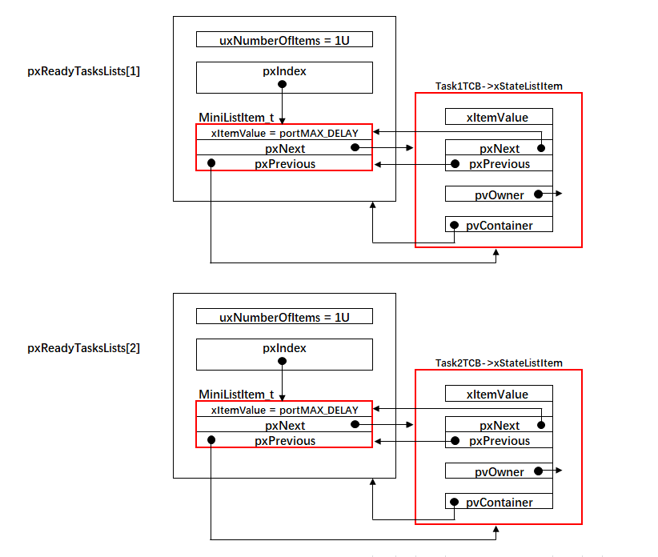
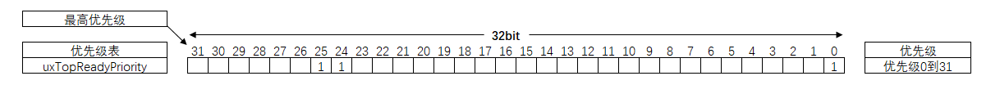
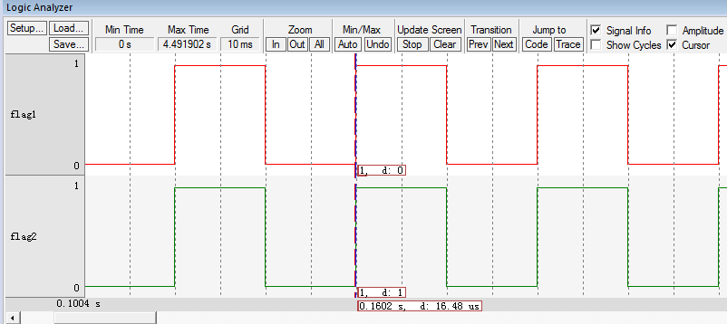
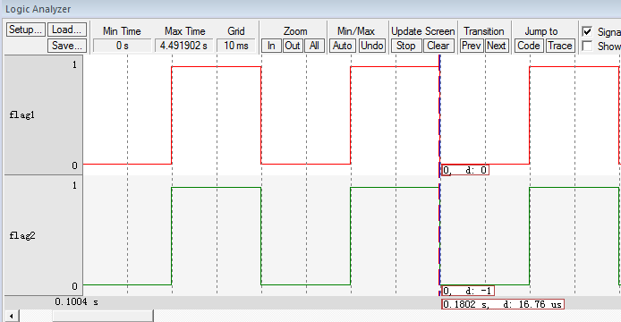

.. vim: syntax=rst

支持多优先级
==============

在本章之前，FreeRTOS还没有支持多优先级，只支持两个任务互相切换，从本章开始，任务中我们开始加入优先
级的功能。在FreeRTOS中，数字优先级越小，逻辑优先级也越小，这与隔壁的RT-Thread和μC/OS刚好相反。

如何支持多优先级
~~~~~~~~~~~~~~~~

就绪列表pxReadyTasksLists[ configMAX_PRIORITIES ]是一个数组，数组里面存的是就绪任务的TCB（准确来
说是TCB里面的xStateListItem节点），数组的下标对应任务的优先级，优先级越低对应的数组下标越小。空闲任
务的优先级最低，对应的是下标为0的链表。图 就绪列表中有两个任务就绪_ 演示的是就绪列表中有两个任务就绪，
优先级分别为1和2，其中空闲任务没有画出来，空闲任务自系统启动后会一直就绪，因为系统至少得保证有一个任务可以运行。

任务在创建的时候，会根据任务的优先级将任务插入到就绪列表不同的位置。相同优先级的任务插入到就绪列表里面
的同一条链表中，这就是我们下一章要讲解的支持时间片。

pxCurrenTCB是一个全局的TCB指针，用于指向优先级最高的就绪任务的TCB，即当前正在运行的TCB。那么我们要想让
任务支持优先级，即只要解决在任务切换（taskYIELD）的时候，让pxCurrenTCB指向最高优先级的就绪任务的TCB就
可以，前面的章节我们是手动地让pxCurrenTCB在任务1、任务2和空闲任务中轮转，现在我们要改成pxCurrenTCB在任务
切换的时候指向最高优先级的就绪任务的TCB即可，那问题的关键就是：如果找到最高优先级的就绪任务的TCB。FreeRTOS提
供了两套方法，一套是通用的，一套是根据特定的处理器优化过的，接下来我们重点讲解下这两个方法。

讲解查找最高优先级的就绪任务相关代码
~~~~~~~~~~~~~~~~~~~~~~~~~~~~~~~~~~~~

寻找最高优先级的就绪任务相关代码在task.c中定义，具体见 代码清单:优先级-1_。

.. code-block:: c
    :caption: 代码清单:优先级-1查找最高优先级的就绪任务的相关代码
    :name: 代码清单:优先级-1
    :linenos:

    /* 查找最高优先级的就绪任务：通用方法 */
    #if ( configUSE_PORT_OPTIMISED_TASK_SELECTION == 0 )(1)
    /* uxTopReadyPriority 存的是就绪任务的最高优先级 */
    #define taskRECORD_READY_PRIORITY( uxPriority )\(2)
        {\
        if( ( uxPriority ) > uxTopReadyPriority )\
        {\
        uxTopReadyPriority = ( uxPriority );\
        }\
        }/* taskRECORD_READY_PRIORITY */

    /*-----------------------------------------------------------*/

    #define taskSELECT_HIGHEST_PRIORITY_TASK()\(3)
        {\
        UBaseType_t uxTopPriority = uxTopReadyPriority;\(3)-1
        /* 寻找包含就绪任务的最高优先级的队列 */\(3)-2
        while( listLIST_IS_EMPTY( &( pxReadyTasksLists[ uxTopPriority ] ) ) )\
        {\
        --uxTopPriority;\
        }\
        /* 获取优先级最高的就绪任务的TCB，然后更新到pxCurrentTCB */\
        listGET_OWNER_OF_NEXT_ENTRY(pxCurrentTCB, &(pxReadyTasksLists[ uxTopPriority ]));\(3)-3
        /* 更新uxTopReadyPriority */\
        uxTopReadyPriority = uxTopPriority;\(3)-4
        }/* taskSELECT_HIGHEST_PRIORITY_TASK */

    /*-----------------------------------------------------------*/

    /* 这两个宏定义只有在选择优化方法时才用，这里定义为空 */
    #define taskRESET_READY_PRIORITY( uxPriority )
    #define portRESET_READY_PRIORITY( uxPriority, uxTopReadyPriority )

    /* 查找最高优先级的就绪任务：根据处理器架构优化后的方法 */
    #else/* configUSE_PORT_OPTIMISED_TASK_SELECTION */(4)

    #define taskRECORD_READY_PRIORITY( uxPriority ) \(5)
        portRECORD_READY_PRIORITY( uxPriority, uxTopReadyPriority )

    /*-----------------------------------------------------------*/

    #define taskSELECT_HIGHEST_PRIORITY_TASK()\(7)
        {\
        UBaseType_t uxTopPriority;\
        /* 寻找最高优先级 */\
        portGET_HIGHEST_PRIORITY( uxTopPriority, uxTopReadyPriority );\(7)-1
        /* 获取优先级最高的就绪任务的TCB，然后更新到pxCurrentTCB */\
    listGET_OWNER_OF_NEXT_ENTRY( pxCurrentTCB, &( pxReadyTasksLists[ uxTopPriority ] ) );\(7)-2
        }/* taskSELECT_HIGHEST_PRIORITY_TASK() */

    /*-----------------------------------------------------------*/
    #if 0
    #define taskRESET_READY_PRIORITY( uxPriority )\(注意)
        {\
        if(listCURRENT_LIST_LENGTH(&(pxReadyTasksLists[( uxPriority)]))==(UBaseType_t)0)\
        {\
        portRESET_READY_PRIORITY( ( uxPriority ), ( uxTopReadyPriority ) );\
        }\
        }
    #else
    #define taskRESET_READY_PRIORITY( uxPriority )\(6)
        {\
    portRESET_READY_PRIORITY((uxPriority ), (uxTopReadyPriority));\
        }
    #endif

    #endif/* configUSE_PORT_OPTIMISED_TASK_SELECTION */

-   代码清单:优先级-1_ **(1)**\：查找最高优先级的就绪任务有两种方法，具体由
    configUSE_PORT_OPTIMISED_TASK_SELECTION这个宏控制，定义为0选择通用方法，定义为1选择根据处理器
    优化的方法，该宏默认在portmacro.h中定义为1，即使用优化过的方法，但是通用方法我们也讲解下。

通用方法
^^^^^^^^

taskRECORD_READY_PRIORITY()
''''''''''''''''''''''''''''''''''''''''''''''''''''''

-   代码清单:优先级-1_ **(2)**\：taskRECORD_READY_PRIORITY()用于更新uxTopReadyPriority的值。
    uxTopReadyPriority是一个在task.c中定义的静态变量，用于表示创建的任务的最高优先级，默认初始化为0，
    即空闲任务的优先级，具体实现见 代码清单:优先级-2_。

.. code-block:: c
    :caption: 代码清单:优先级-2uxTopReadyPriority定义
    :name: 代码清单:优先级-2
    :linenos:

    /* 空闲任务优先级宏定义，在task.h中定义 */
    #define tskIDLE_PRIORITY		 ( ( UBaseType_t ) 0U )

    /* 定义uxTopReadyPriority，在task.c中定义 */
    staticvolatile UBaseType_t uxTopReadyPriority = tskIDLE_PRIORITY;

taskSELECT_HIGHEST_PRIORITY_TASK()
''''''''''''''''''''''''''''''''''''''''''''''''''''''''''''''''''''

-   代码清单:优先级-1_ **(3)**\ ：taskSELECT_HIGHEST_PRIORITY_TASK()用于寻找优先级最高的就绪任务，实质就
    是更新uxTopReadyPriority和pxCurrentTCB的值。

-   代码清单:优先级-1_ **(3)-1**\ ：将uxTopReadyPriority的值暂存到局部变量uxTopPriority，接下来需要用到。

-   代码清单:优先级-1_ **(3)-2**\ ：从最高优先级对应的就绪列表数组下标开始寻找当前链表下是否有任务存在，如果
    没有，则uxTopPriority减一操作，继续寻找下一个优先级对应的链表中是否有任务存在，如果有则跳出while循环，表示找
    到了最高优先级的就绪任务。之所以可以采用从最高优先级往下搜索，是因为任务的优先级与就绪列表的下标是一一对应
    的，优先级越高，对应的就绪列表数组的下标越大。

-   代码清单:优先级-1_ **(3)-3**\ ：获取优先级最高的就绪任务的TCB，然后更新到pxCurrentTCB。

-   代码清单:优先级-1_ **(3)-4**\ ：更新uxTopPriority的值到uxTopReadyPriority。

优化方法
^^^^^^^^

-   代码清单:优先级-1_ **(4)**\ ：优化的方法，这得益于Cortex-M内核有一个计算前导零的指令CLZ，所谓前导零就是
    计算一个变量（Cortex-M内核单片机的变量为32位）从高位开始第一次出现1的位的前面的零的个数。比如：一个32位的
    变量uxTopReadyPriority，其位0、位24和位25均置1，其余位为0，具体见。那么使用前导零
    指令__CLZ(uxTopReadyPriority)可以很快的计算出uxTopReadyPriority的前导零的个数为6。

如果uxTopReadyPriority的每个位号对应的是任务的优先级，任务就绪时，则将对应的位置1，反之则清零。那么
图 uxTopReadyPriority位展示_ 就表示优先级0、优先级24和优先级25这三个任务就绪，其中优先级为25的任务优先级最
高。利用前导零计算指令可以很快计算出就绪任务中的最高优先级
为：( 31UL - (uint32_t ) \__clz( ( uxReadyPriorities ) ) ) = ( 31UL - ( uint32_t ) 6 )=25。

.. _taskrecord_ready_priority-1:

taskRECORD_READY_PRIORITY()
''''''''''''''''''''''''''''''''''''''''''''''''''''''

-   代码清单:优先级-1_ **(5)**\ ：taskRECORD_READY_PRIORITY()用于根据传进来的形参（通常形参就是任务的优先
    级）将变量uxTopReadyPriority的某个位置1。uxTopReadyPriority是一个在task.c中定义的静态变量，默认初始化
    为0。与通用方法中用来表示创建的任务的最高优先级不一样，它在优化方法中担任的是一个优先级位图表的角色，即该
    变量的每个位对应任务的优先级，如果任务就绪，则将对应的位置1，反之清零。根据这个原理，只需要计算出
    uxTopReadyPriority的前导零个数就算找到了就绪任务的最高优先级。与taskRECORD_READY_PRIORITY()作用相反的
    是taskRESET_READY_PRIORITY()。taskRECORD_READY_PRIORITY()与taskRESET_READY_PRIORITY()具体的实现
    见 代码清单:优先级-3_。

.. code-block:: c
    :caption: 代码清单:优先级-3taskRECORD_READY_PRIORITY()taskRESET_READY_PRIORITY()（portmacro.h中定义）
    :name: 代码清单:优先级-3
    :linenos:

    #define portRECORD_READY_PRIORITY( uxPriority, uxReadyPriorities )\
            ( uxReadyPriorities ) |= ( 1UL << ( uxPriority ) )

    #define portRESET_READY_PRIORITY( uxPriority, uxReadyPriorities )\
            ( uxReadyPriorities ) &= ~( 1UL << ( uxPriority ) )

taskRESET_READY_PRIORITY()
''''''''''''''''''''''''''''''''''''''''''''''''''''

-   代码清单:优先级-1_ **(6)**\ ：taskRESET_READY_PRIORITY()用于根据传进来的形参（通常形参就是任务的优先级）将
    变量uxTopReadyPriority的某个位清零。

-   代码清单:优先级-1_ **(注意)**\ ：实际上根据优先级调用taskRESET_READY_PRIORITY()函数复位uxTopReadyPriorit
    变量中对应的位时，要先确保就绪列表中对应该优先级下的链表没有任务才行。但是我们当前实现的阻塞延时方案还是通过扫描
    就绪列表里面的TCB的延时变量xTicksToDelay来实现的，还没有单独实现延时列表（任务延时列表将在下一个章节讲解），
    所以任务非就绪时暂时不能将任务从就绪列表移除，而是仅仅通过将任务优先级在变量uxTopReadyPriority中对应的位清零。
    在下一章我们实现任务延时列表之后，任务非就绪时，不仅会将任务优先级在变量uxTopReadyPriority中对应的位清零，还
    会降任务从就绪列表删除。

taskSELECT_HIGHEST_PRIORITY_TASK()
''''''''''''''''''''''''''''''''''

-   代码清单:优先级-1_ **(7)**\ ：taskSELECT_HIGHEST_PRIORITY_TASK()用于寻找优先级最高的就绪任务，实质就是更
    新uxTopReadyPriority和pxCurrentTCB的值。

-   代码清单:优先级-1_ **(7)-1**\ ：根据uxTopReadyPriority的值，找到最高优先级，然后更新到uxTopPriority这个局
    部变量中。portGET_HIGHEST_PRIORITY()具体的宏实现见 代码清单:优先级-4_，在portmacro.h中定义。

.. code-block:: c
    :caption: 代码清单:优先级-4portGET_HIGHEST_PRIORITY()宏定义
    :name: 代码清单:优先级-4
    :linenos:

    #define portGET_HIGHEST_PRIORITY( uxTopPriority, uxReadyPriorities )\
    uxTopPriority = ( 31UL - ( uint32_t ) __clz( ( uxReadyPriorities ) ) )

-   代码清单:优先级-1_ **(7)-2**\ ：根据uxTopPriority的值，从就绪列表中找到就绪的最高优先级的任务的TCB，然后将
    TCB更新到pxCurrentTCB。

修改代码，支持多优先级
~~~~~~~~~~~~~~~~~~~~~~

接下来我们在上一章的代码上，继续迭代修改，从而实现多优先级。

修改任务控制块
^^^^^^^^^^^^^^^

在任务控制块中增加与优先级相关的成员，具体见 代码清单:优先级-5_ 高亮部分。

.. code-block:: c
    :caption: 代码清单:优先级-5修改任务控制块代码，增加优先级相关成员
    :emphasize-lines: 12
    :name: 代码清单:优先级-5
    :linenos:

    typedefstruct tskTaskControlBlock
    {
    volatile StackType_t *pxTopOfStack;    /* 栈顶 */

        ListItem_t xStateListItem;   /* 任务节点 */

        StackType_t *pxStack;         /* 任务栈起始地址 */
    /* 任务名称，字符串形式 */
    char pcTaskName[ configMAX_TASK_NAME_LEN ];

        TickType_t xTicksToDelay;
        UBaseType_t	uxPriority;
    } tskTCB;

修改xTaskCreateStatic()函数
^^^^^^^^^^^^^^^^^^^^^^^^^^^^^^^

修改任务创建xTaskCreateStatic()函数，具体见 代码清单:优先级-6_ 的高亮部分。

.. code-block:: c
    :caption: 代码清单:优先级-6xTaskCreateStatic()函数
    :emphasize-lines: 6,20-26,29
    :name: 代码清单:优先级-6
    :linenos:

    TaskHandle_t
    xTaskCreateStatic(TaskFunction_t pxTaskCode,
    const char * const pcName,
    const uint32_t ulStackDepth,
    void * const pvParameters,
    /* 任务优先级，数值越大，优先级越高 */
                    UBaseType_t uxPriority,(1)
                    StackType_t * const puxStackBuffer,
                    TCB_t * const pxTaskBuffer )
    {
        TCB_t *pxNewTCB;
        TaskHandle_t xReturn;

    if ( ( pxTaskBuffer != NULL ) && ( puxStackBuffer != NULL ) )
        {
            pxNewTCB = ( TCB_t * ) pxTaskBuffer;
            pxNewTCB->pxStack = ( StackType_t * ) puxStackBuffer;

    /* 创建新的任务 */(2)
            prvInitialiseNewTask( pxTaskCode,
                                pcName,
                                ulStackDepth,
                                pvParameters,
                                uxPriority,
    &xReturn,
                                pxNewTCB);

    /* 将任务添加到就绪列表 */(3)
            prvAddNewTaskToReadyList( pxNewTCB );

        }
    else
        {
            xReturn = NULL;
        }

    return xReturn;
    }

-   代码清单:优先级-6_ **(1)**\ ：增加优先级形参，数值越大，优先级越高。

prvInitialiseNewTask()函数
'''''''''''''''''''''''''''''

-   代码清单:优先级-6_ **(2)**\ ：修改prvInitialiseNewTask()函数，增加优先级形参和优先级初始化相关代
    码，具体修改见 代码清单:优先级-7_ 的高亮部分。

.. code-block:: c
    :caption: 代码清单:优先级-7prvInitialiseNewTask()函数
    :emphasize-lines: 5-6,37-42
    :name: 代码清单:优先级-7
    :linenos:

    static void prvInitialiseNewTask(TaskFunction_t pxTaskCode,
    const char * const pcName,
    const uint32_t ulStackDepth,
    void * const pvParameters,
    /* 任务优先级，数值越大，优先级越高 */
                                    UBaseType_t uxPriority,
                                    TaskHandle_t * const pxCreatedTask,
                                    TCB_t *pxNewTCB )

    {
        StackType_t *pxTopOfStack;
        UBaseType_t x;

    /* 获取栈顶地址 */
        pxTopOfStack = pxNewTCB->pxStack + ( ulStackDepth - ( uint32_t ) 1 );
    /* 向下做8字节对齐 */
    pxTopOfStack = ( StackType_t * ) ( ( ( uint32_t ) pxTopOfStack ) & ( ~( ( uint32_t ) 0x0007 ) ) );

    /* 将任务的名字存储在TCB中 */
    for ( x = ( UBaseType_t ) 0; x < ( UBaseType_t ) configMAX_TASK_NAME_LEN; x++ )
        {
            pxNewTCB->pcTaskName[ x ] = pcName[ x ];

    if ( pcName[ x ] == 0x00 )
            {
    break;
            }
        }
    /* 任务名字的长度不能超过configMAX_TASK_NAME_LEN */
        pxNewTCB->pcTaskName[ configMAX_TASK_NAME_LEN - 1 ] = '\0';

    /* 初始化TCB中的xStateListItem节点 */
        vListInitialiseItem( &( pxNewTCB->xStateListItem ) );
    /* 设置xStateListItem节点的拥有者 */
        listSET_LIST_ITEM_OWNER( &( pxNewTCB->xStateListItem ), pxNewTCB );

    /* 初始化优先级 */
    if ( uxPriority >= ( UBaseType_t ) configMAX_PRIORITIES )
        {
    uxPriority = ( UBaseType_t ) configMAX_PRIORITIES - ( UBaseType_t ) 1U;
        }
        pxNewTCB->uxPriority = uxPriority;

    /* 初始化任务栈 */
    pxNewTCB->pxTopOfStack = pxPortInitialiseStack( pxTopOfStack, pxTaskCode, pvParameters );

    /* 让任务句柄指向任务控制块 */
    if ( ( void * ) pxCreatedTask != NULL )
        {
            *pxCreatedTask = ( TaskHandle_t ) pxNewTCB;
        }
    }

prvAddNewTaskToReadyList()函数
'''''''''''''''''''''''''''''''''''

-   代码清单:优先级-6_ **(3)**\ ：新增将任务添加到就绪列表的函数prvAddNewTaskToReadyList()，该函数在task.c
    中实现，具体见 代码清单:优先级-8_。

.. code-block:: c
    :caption: 代码清单:优先级-8prvAddNewTaskToReadyList()函数
    :name: 代码清单:优先级-8
    :linenos:

    static void prvAddNewTaskToReadyList( TCB_t *pxNewTCB )
    {
    /* 进入临界段 */
        taskENTER_CRITICAL();
        {
    /* 全局任务计时器加一操作 */
            uxCurrentNumberOfTasks++;(1)

    /* 如果pxCurrentTCB为空，则将pxCurrentTCB指向新创建的任务 */
    if ( pxCurrentTCB == NULL )(2)
            {
                pxCurrentTCB = pxNewTCB;

    /* 如果是第一次创建任务，则需要初始化任务相关的列表 */
    if ( uxCurrentNumberOfTasks == ( UBaseType_t ) 1 )(3)
                {
    /* 初始化任务相关的列表 */
                    prvInitialiseTaskLists();
                }
            }
    else/* 如果pxCurrentTCB不为空，(4)
            则根据任务的优先级将pxCurrentTCB指向最高优先级任务的TCB */
            {
    if ( pxCurrentTCB->uxPriority <= pxNewTCB->uxPriority )
                {
                    pxCurrentTCB = pxNewTCB;
                }
            }

    /* 将任务添加到就绪列表 */
            prvAddTaskToReadyList( pxNewTCB );(5)

        }
    /* 退出临界段 */
        taskEXIT_CRITICAL();
    }

-   代码清单:优先级-8_ **(1)**\ ：全局任务计时器uxCurrentNumberOfTasks加一操作。uxCurrentNumberOfTasks
    是一个在task.c中定义的静态变量，默认初始化为0

-   代码清单:优先级-8_ **(2)**\ ：如果pxCurrentTCB为空，则将pxCurrentTCB指向新创建的任务。pxCurrentTCB
    是一个在task.c定义的全局指针，用于指向当前正在运行或者即将要运行的任务的任务控制块，默认初始化为NULL。

-   代码清单:优先级-8_ **(3)**\ ：如果是第一次创建任务，则需要调用函数prvInitialiseTaskLists()初始化任
    务相关的列表，目前只有就绪列表需要初始化，该函数在task.c中定义，具体实现见 代码清单:优先级-9_。

prvInitialiseTaskLists()函数

.. code-block:: c
    :caption: 代码清单:优先级-9prvInitialiseTaskLists()函数
    :name: 代码清单:优先级-9
    :linenos:

    /* 初始化任务相关的列表 */
    void prvInitialiseTaskLists( void )
    {
        UBaseType_t uxPriority;

        for ( uxPriority = ( UBaseType_t ) 0U; uxPriority < ( UBaseType_t ) configMAX_PRIORITIES; uxPriority++ )
        {
            vListInitialise( &( pxReadyTasksLists[ uxPriority ] ) );
        }
    }

-   代码清单:优先级-8_ **(4)**\ ：如果pxCurrentTCB不为空，表示当前已经有任务存在，则根据任务的优先级将
    pxCurrentTCB指向最高优先级任务的TCB。在创建任务时，始终让pxCurrentTCB指向最高优先级任务的TCB。

-   代码清单:优先级-8_ **(5)**\ ：将任务添加到就绪列表。prvAddTaskToReadyList()是一个带参宏，在task.c
    中定义，具体实现见 代码清单:优先级-10_。

prvAddTaskToReadyList()函数

.. code-block:: c
    :caption: 代码清单:优先级-10prvAddTaskToReadyList()函数
    :name: 代码清单:优先级-10
    :linenos:

    /* 将任务添加到就绪列表 */
    #define prvAddTaskToReadyList( pxTCB )\
            taskRECORD_READY_PRIORITY( ( pxTCB )->uxPriority );\(1)
        vListInsertEnd( &( pxReadyTasksLists[ ( pxTCB )->uxPriority ] ),\(2)
        &( ( pxTCB )->xStateListItem ) );

-   代码清单:优先级-10_ **(1)**\ ：根据优先级将优先级位图表uxTopReadyPriority中对应的位置位。

-   代码清单:优先级-10_ **(2)**\ ：根据优先级将任务插入到就绪列表pxReadyTasksLists[]。

修改vTaskStartScheduler()函数
^^^^^^^^^^^^^^^^^^^^^^^^^^^^^^^^^

修改开启任务调度函数vTaskStartScheduler()，具体见 代码清单:优先级-11_ 的高亮部分。

.. code-block:: c
    :caption: 代码清单:优先级-11vTaskStartScheduler()函数
    :emphasize-lines: 18-19
    :name: 代码清单:优先级-11
    :linenos:

    void vTaskStartScheduler( void )
    {
    /*======================创建空闲任务start==========================*/
        TCB_t *pxIdleTaskTCBBuffer = NULL;
        StackType_t *pxIdleTaskStackBuffer = NULL;
    uint32_t ulIdleTaskStackSize;

    /* 获取空闲任务的内存：任务栈和任务TCB */
        vApplicationGetIdleTaskMemory( &pxIdleTaskTCBBuffer,
    &pxIdleTaskStackBuffer,
    &ulIdleTaskStackSize );

        xIdleTaskHandle =
    xTaskCreateStatic( (TaskFunction_t)prvIdleTask,
    (char *)"IDLE",
    (uint32_t)ulIdleTaskStackSize ,
    (void *) NULL,
    /* 任务优先级，数值越大，优先级越高 */
    (UBaseType_t) tskIDLE_PRIORITY,(1)
    (StackType_t *)pxIdleTaskStackBuffer,
    (TCB_t *)pxIdleTaskTCBBuffer );
    /* 将任务添加到就绪列表 */(2)
    /* vListInsertEnd( &( pxReadyTasksLists[0] ),
    &( ((TCB_t *)pxIdleTaskTCBBuffer)->xStateListItem ) ); */
    /*===================创建空闲任务end=========================*/

    /* 手动指定第一个运行的任务 */(3)
    //pxCurrentTCB = &Task1TCB;

    /* 启动调度器 */
    if ( xPortStartScheduler() != pdFALSE )
        {
    /* 调度器启动成功，则不会返回，即不会来到这里 */
        }
    }

-   代码清单:优先级-11_ **(1)**\ ：创建空闲任务时，优先级配置为tskIDLE_PRIORITY，该宏在task.h中
    定义，默认为0，表示空闲任务的优先级为最低。

-   代码清单:优先级-11_ **(2)**\ ：刚刚我们已经修改了创建任务函数xTaskCreateStatic()，在创建任务
    时，就已经将任务添加到了就绪列表，这里将注释掉。

-   代码清单:优先级-11_ **(3)**\ ：在刚刚修改的创建任务函数xTaskCreateStatic()中，增加了将任务添
    加到就绪列表的函数prvAddNewTaskToReadyList()，这里将注释掉。

修改vTaskDelay()函数
^^^^^^^^^^^^^^^^^^^^

vTaskDelay()函数修改内容是添加了将任务从就绪列表移除的操作，具体实现见 代码清单:优先级-12_ 高亮部分。

.. code-block:: c
    :caption: 代码清单:优先级-12vTaskDelay()函数
    :emphasize-lines: 11-13
    :name: 代码清单:优先级-12
    :linenos:

    void vTaskDelay( const TickType_t xTicksToDelay )
    {
        TCB_t *pxTCB = NULL;

    /* 获取当前任务的TCB */
        pxTCB = pxCurrentTCB;

    /* 设置延时时间 */
        pxTCB->xTicksToDelay = xTicksToDelay;

    /* 将任务从就绪列表移除 */
    //uxListRemove( &( pxTCB->xStateListItem ) );(注意)
        taskRESET_READY_PRIORITY( pxTCB->uxPriority );

    /* 任务切换 */
        taskYIELD();
    }

-   代码清单:优先级-12_ **(注意)**\ ：将任务从就绪列表移除本应该完成两个操作：1个是将任务从就绪列表移除，
    由函数uxListRemove()来实现；另一个是根据优先级将优先级位图表uxTopReadyPriority中对应的位清零，由函
    数taskRESET_READY_PRIORITY()来实现。但是鉴于我们目前的时基更新函数xTaskIncrementTick还是需要通过
    扫描就绪列表的任务来判断任务的延时时间是否到期，所以不能将任务从就绪列表移除。当我们在接下来的“任务延
    时列表的实现”章节中，会专门添加一个延时列表，到时延时的时候除了根据优先级将优先级位图表
    uxTopReadyPriority中对应的位清零外，还需要将任务从就绪列表移除。

修改vTaskSwitchContext()函数
^^^^^^^^^^^^^^^^^^^^^^^^^^^^^^

在新的任务切换函数vTaskSwitchContext()中，不再是手动的让pxCurrentTCB指针在任务1、任务2和空闲任务中切换，
而是直接调用函数taskSELECT_HIGHEST_PRIORITY_TASK()寻找到优先级最高的就绪任务的TCB，然后更新到
pxCurrentTCB，具体实现见 代码清单:优先级-13_ 的高亮部分。

.. code-block:: c
    :caption: 代码清单:优先级-13vTaskSwitchContext()函数
    :emphasize-lines: 3-7
    :name: 代码清单:优先级-13
    :linenos:

    #if 1
    /* 任务切换，即寻找优先级最高的就绪任务 */
    void vTaskSwitchContext( void )
    {
    /* 获取优先级最高的就绪任务的TCB，然后更新到pxCurrentTCB */
        taskSELECT_HIGHEST_PRIORITY_TASK();
    }
    #else
    void vTaskSwitchContext( void )
    {
    /* 如果当前任务是空闲任务，那么就去尝试执行任务1或者任务2，
    看看他们的延时时间是否结束，如果任务的延时时间均没有到期，
    那就返回继续执行空闲任务 */
    if ( pxCurrentTCB == &IdleTaskTCB )
        {
    if (Task1TCB.xTicksToDelay == 0)
            {
                pxCurrentTCB =&Task1TCB;
            }
    else if (Task2TCB.xTicksToDelay == 0)
            {
                pxCurrentTCB =&Task2TCB;
            }
    else
            {
    return;	/* 任务延时均没有到期则返回，继续执行空闲任务 */
            }
        }
    else
        {
    /*如果当前任务是任务1或者任务2的话，
    检查下另外一个任务,如果另外的任务不在延时中，
    就切换到该任务。否则，判断下当前任务是否应该进入延时状态，
    如果是的话，就切换到空闲任务。否则就不进行任何切换 */
    if (pxCurrentTCB == &Task1TCB)
            {
    if (Task2TCB.xTicksToDelay == 0)
                {
                    pxCurrentTCB =&Task2TCB;
                }
    else if (pxCurrentTCB->xTicksToDelay != 0)
                {
                    pxCurrentTCB = &IdleTaskTCB;
                }
    else
                {
    return;	/* 返回，不进行切换，因为两个任务都处于延时中 */
                }
            }
    else if (pxCurrentTCB == &Task2TCB)
            {
    if (Task1TCB.xTicksToDelay == 0)
                {
                    pxCurrentTCB =&Task1TCB;
                }
    else if (pxCurrentTCB->xTicksToDelay != 0)
                {
                    pxCurrentTCB = &IdleTaskTCB;
                }
    else
                {
    return;	/* 返回，不进行切换，因为两个任务都处于延时中 */
                }
            }
        }
    }

    #endif

修改xTaskIncrementTick()函数
^^^^^^^^^^^^^^^^^^^^^^^^

修修改xTaskIncrementTick()函数，即在原来的基础上增加：当任务延时时间到，将任务就绪的代码，具体
见 代码清单:优先级-14_ 的高亮部分。

.. code-block:: c
    :caption: 代码清单:优先级-14xTaskIncrementTick()函数
    :emphasize-lines: 17-21
    :name: 代码清单:优先级-14
    :linenos:

    void xTaskIncrementTick( void )
    {
        TCB_t *pxTCB = NULL;
        BaseType_t i = 0;

    const TickType_t xConstTickCount = xTickCount + 1;
        xTickCount = xConstTickCount;

    /* 扫描就绪列表中所有任务的remaining_tick，如果不为0，则减1 */
    for (i=0; i<configMAX_PRIORITIES; i++)
        {
    pxTCB = ( TCB_t * ) listGET_OWNER_OF_HEAD_ENTRY( ( &pxReadyTasksLists[i] ) );
    if (pxTCB->xTicksToDelay > 0)
            {
                pxTCB->xTicksToDelay --;

    /* 延时时间到，将任务就绪 */(增加)
    if ( pxTCB->xTicksToDelay ==0 )
                {
                    taskRECORD_READY_PRIORITY( pxTCB->uxPriority );
                }
            }
        }

    /* 任务切换 */
        portYIELD();
    }

-   代码清单:优先级-14_ **(增加)**\ ：延时时间到，将任务就绪。即根据优先级将优先级位图表uxTopReadyPriority
    中对应的位置位。在刚刚修改的上下文切换函数vTaskSwitchContext()中，就是通过优先级位图表uxTopReadyPriority
    来寻找就绪任务的最高优先级的。

main函数
~~~~~~~~~~~~

本章main函数与上一章基本一致，修改不大，具体修改见 代码清单:优先级-15_ 的高亮部分。

.. code-block:: guess
    :caption: 代码清单:优先级-15main函数
    :emphasize-lines: 64-65,68-70,77-78,81-83
    :name: 代码清单:优先级-15
    :linenos:

    /*
    *************************************************************************
    *                             包含的头文件
    *************************************************************************
    */
    #include"FreeRTOS.h"
    #include"task.h"

    /*
    *************************************************************************
    *                              全局变量
    *************************************************************************
    */
    portCHAR flag1;
    portCHAR flag2;

    extern List_t pxReadyTasksLists[ configMAX_PRIORITIES ];

    /*
    *************************************************************************
    *                        任务控制块& STACK
    *************************************************************************
    */
    TaskHandle_t Task1_Handle;
    #define TASK1_STACK_SIZE                    128
    StackType_t Task1Stack[TASK1_STACK_SIZE];
    TCB_t Task1TCB;

    TaskHandle_t Task2_Handle;
    #define TASK2_STACK_SIZE                    128
    StackType_t Task2Stack[TASK2_STACK_SIZE];
    TCB_t Task2TCB;

    /*
    *************************************************************************
    *                               函数声明
    *************************************************************************
    */
    void delay (uint32_t count);
    void Task1_Entry( void *p_arg );
    void Task2_Entry( void *p_arg );

    /*
    ************************************************************************
    *                                main函数
    ************************************************************************
    */
    int main(void)
    {
    /* 硬件初始化 */
    /* 将硬件相关的初始化放在这里，如果是软件仿真则没有相关初始化代码 */

    /* 创建任务 */
    Task1_Handle =
        xTaskCreateStatic( (TaskFunction_t)Task1_Entry,
                        (char *)"Task1",
                        (uint32_t)TASK1_STACK_SIZE ,
                        (void *) NULL,
    /* 任务优先级，数值越大，优先级越高 */(1)
                            (UBaseType_t) 1,
                            (StackType_t *)Task1Stack,
                            (TCB_t *)&Task1TCB );
    /* 将任务添加到就绪列表 */(2)
    /* vListInsertEnd( &( pxReadyTasksLists[1] ),
    &( ((TCB_t *)(&Task1TCB))->xStateListItem ) ); */

    Task2_Handle =
        xTaskCreateStatic( (TaskFunction_t)Task2_Entry,
                        (char *)"Task2",
                        (uint32_t)TASK2_STACK_SIZE ,
                        (void *) NULL,
    /* 任务优先级，数值越大，优先级越高 */(3)
                            (UBaseType_t) 2,
                            (StackType_t *)Task2Stack,
                            (TCB_t *)&Task2TCB );
    /* 将任务添加到就绪列表 */(4)
    /* vListInsertEnd( &( pxReadyTasksLists[2] ),
    &( ((TCB_t *)(&Task2TCB))->xStateListItem ) ); */

    /* 启动调度器，开始多任务调度，启动成功则不返回 */
        vTaskStartScheduler();

    for (;;)
        {
            /* 系统启动成功不会到达这里 */
        }
    }

    /*
    *************************************************************************
    *                               函数实现
    *************************************************************************
    */
    /* 软件延时 */
    void delay (uint32_t count)
    {
    for (; count!=0; count--);
    }
    /* 任务1 */
    void Task1_Entry( void *p_arg )
    {
    for ( ;; )
        {
            flag1 = 1;
            vTaskDelay( 2 );
            flag1 = 0;
            vTaskDelay( 2 );
        }
    }

    /* 任务2 */
    void Task2_Entry( void *p_arg )
    {
    for ( ;; )
        {
            flag2 = 1;
            vTaskDelay( 2 );
            flag2 = 0;
            vTaskDelay( 2 );
        }
    }

    /* 获取空闲任务的内存 */
    StackType_t IdleTaskStack[configMINIMAL_STACK_SIZE];
    TCB_t IdleTaskTCB;
    void vApplicationGetIdleTaskMemory( TCB_t **ppxIdleTaskTCBBuffer,
                            StackType_t **ppxIdleTaskStackBuffer,
                            uint32_t *pulIdleTaskStackSize )
    {
        *ppxIdleTaskTCBBuffer=&IdleTaskTCB;
        *ppxIdleTaskStackBuffer=IdleTaskStack;
        *pulIdleTaskStackSize=configMINIMAL_STACK_SIZE;
    }

-   代码清单:优先级-15_ **(1)和(3)**\ ：设置任务的优先级，数字优先级越高，逻辑优先级越高。

-   代码清单:优先级-15_ **(2)和(4)**\ ：这部分代码删除，因为在任务创建函数xTaskCreateStatic()
    中，已经调用函数prvAddNewTaskToReadyList()将任务插入到了就绪列表。。

实验现象
~~~~~~~~

进入软件调试，全速运行程序，从逻辑分析仪中可以看到两个任务的波形是完全同步，就好像CPU在同时干两件
事情，具体仿真的波形图见图 实验现象1_ 和图 实验现象2_。

从图 实验现象1_ 和图 实验现象2_ 可以看出，flag1和flag2的高电平的时间为(0.1802-0.1602)s，刚好等
于阻塞延时的20ms，所以实验现象跟代码要实现的功能是一致的。。
