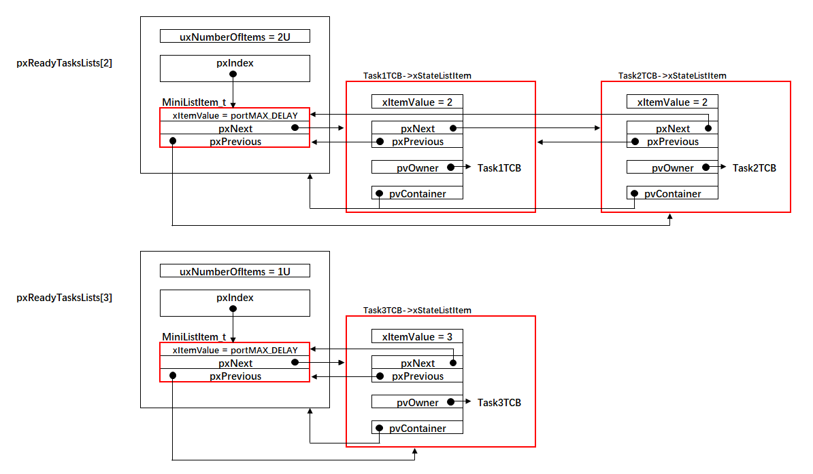
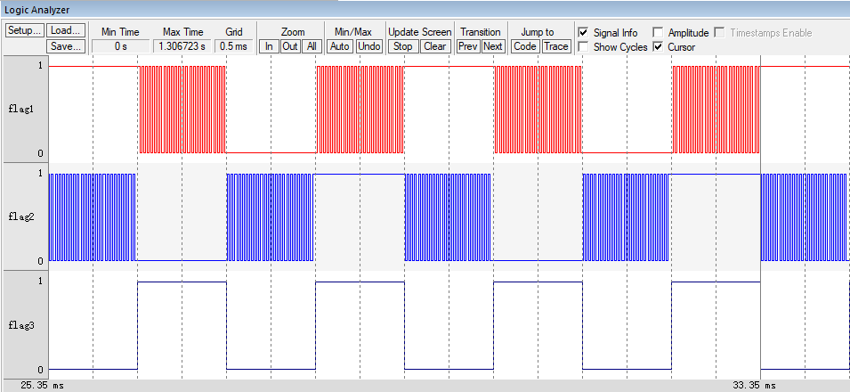
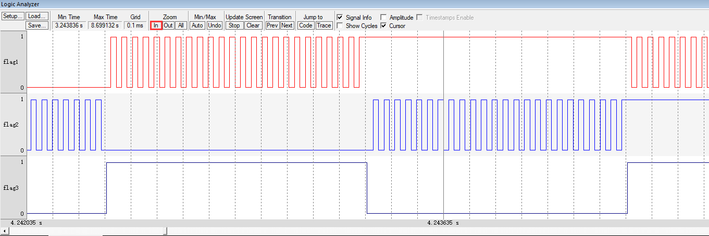

.. vim: syntax=rst

支持时间片
===========

FreeRTOS与隔壁的RT-Thread和μC/OS一样，都支持时间片的功能。所谓时间片就是同一个优先级下可以有多个任务，
每个任务轮流地享有相同的CPU时间，享有CPU的时间我们叫时间片。在RTOS中，最小的时间单位为一个tick，即
SysTick的中断周期，RT-Thread和μC/OS可以指定时间片的大小为多个tick，但是FreeRTOS不一样，时间片只能
是一个tick。与其说FreeRTOS支持时间片，倒不如说它的时间片就是正常的任务调度。

其实时间片的功能我们已经实现，剩下的就是通过实验来验证。那么接下来我们就先看实验现象，再分析原理，透过现象看本质。

时间片测试实验
~~~~~~~~~~~~~~

假设目前系统中有三个任务就绪（算上空闲任务就是4个），任务1和任务2的优先级为2，任务3的优先级为3，整个就
绪列表的示意图具体见 有三个任务就绪时就绪列表示意图_空闲任务没有画出来_。

为了方便在逻辑分析仪中地分辨出任务1和任务2使用的时间片大小，任务1和任务2的主体编写成一个无限循环函数，
不会阻塞，任务3的阻塞时间设置为1个tick。任务1和任务2的任务主体编写为一个无限循环，这就意味着，优先级
低于2的任务就会被饿死，得不到执行，比如空闲任务。在真正的项目中，并不会这样写，这里只是为了实验方便。
整个mai.c的文件的实验代码具体见 代码清单:时间片-1_。

main函数
~~~~~~~~~~~~

.. code-block:: c
    :caption: 代码清单:时间片-1时间片实验
    :emphasize-lines: 35-38,66,75,84,109-121,123-135
    :name: 代码清单:时间片-1
    :linenos:

    /*
    *************************************************************************
    *                             包含的头文件
    *************************************************************************
    */
    #include"FreeRTOS.h"
    #include"task.h"

    /*
    *************************************************************************
    *                              全局变量
    *************************************************************************
    */
    portCHAR flag1;
    portCHAR flag2;
    portCHAR flag3;

    extern List_t pxReadyTasksLists[ configMAX_PRIORITIES ];

    /*
    *************************************************************************
    *                        任务控制块& STACK
    *************************************************************************
    */
    TaskHandle_t Task1_Handle;
    #define TASK1_STACK_SIZE                    128
    StackType_t Task1Stack[TASK1_STACK_SIZE];
    TCB_t Task1TCB;

    TaskHandle_t Task2_Handle;
    #define TASK2_STACK_SIZE                    128
    StackType_t Task2Stack[TASK2_STACK_SIZE];
    TCB_t Task2TCB;

    TaskHandle_t Task3_Handle;
    #define TASK3_STACK_SIZE                    128
    StackType_t Task3Stack[TASK3_STACK_SIZE];
    TCB_t Task3TCB;

    /*
    *************************************************************************
    *                               函数声明
    *************************************************************************
    */
    void delay (uint32_t count);
    void Task1_Entry( void *p_arg );
    void Task2_Entry( void *p_arg );
    void Task3_Entry( void *p_arg );

    /*
    ************************************************************************
    *                                main函数
    ************************************************************************
    */
    int main(void)
    {
        /* 硬件初始化 */
        /* 将硬件相关的初始化放在这里，如果是软件仿真则没有相关初始化代码 */

        /* 创建任务 */
        Task1_Handle =
            xTaskCreateStatic( (TaskFunction_t)Task1_Entry,
            (char *)"Task1",
            (uint32_t)TASK1_STACK_SIZE ,
            (void *) NULL,
            (UBaseType_t) 2,
            (StackType_t *)Task1Stack,
            (TCB_t *)&Task1TCB );

        Task2_Handle =
            xTaskCreateStatic( (TaskFunction_t)Task2_Entry,
            (char *)"Task2",
            (uint32_t)TASK2_STACK_SIZE ,
            (void *) NULL,
            (UBaseType_t) 2,
            (StackType_t *)Task2Stack,
            (TCB_t *)&Task2TCB );

        Task3_Handle =
            xTaskCreateStatic( (TaskFunction_t)Task3_Entry,
            (char *)"Task3",
            (uint32_t)TASK3_STACK_SIZE ,
            (void *) NULL,
            (UBaseType_t) 3,
            (StackType_t *)Task3Stack,
            (TCB_t *)&Task3TCB );

        portDISABLE_INTERRUPTS();

        /* 启动调度器，开始多任务调度，启动成功则不返回 */
        vTaskStartScheduler();(1)

        for (;;)
        {
            /* 系统启动成功不会到达这里 */
        }
    }

    /*
    ************************************************************************
    *                               函数实现
    ************************************************************************
    */
    /* 软件延时 */
    void delay (uint32_t count)
    {
        for (; count!=0; count--);
    }
    /* 任务1 */(2)
    void Task1_Entry( void *p_arg )
    {
        for ( ;; )
        {
            flag1 = 1;
            //vTaskDelay( 1 );
            delay (100);
            flag1 = 0;
            delay (100);
            //vTaskDelay( 1 );
        }
    }

    /* 任务2 */(3)
    void Task2_Entry( void *p_arg )
    {
        for ( ;; )
        {
            flag2 = 1;
            //vTaskDelay( 1 );
            delay (100);
            flag2 = 0;
            delay (100);
            //vTaskDelay( 1 );
        }
    }

    void Task3_Entry( void *p_arg )(4)
    {
        for ( ;; )
        {
            flag3 = 1;
            vTaskDelay( 1 );
            //delay (100);
            flag3 = 0;
            vTaskDelay( 1 );
            //delay (100);
        }
    }

    /* 获取空闲任务的内存 */
    StackType_t IdleTaskStack[configMINIMAL_STACK_SIZE];
    TCB_t IdleTaskTCB;
    void vApplicationGetIdleTaskMemory( TCB_t **ppxIdleTaskTCBBuffer,
                                        StackType_t **ppxIdleTaskStackBuffer,
    uint32_t *pulIdleTaskStackSize )
    {
        *ppxIdleTaskTCBBuffer=&IdleTaskTCB;
        *ppxIdleTaskStackBuffer=IdleTaskStack;
        *pulIdleTaskStackSize=configMINIMAL_STACK_SIZE;
    }

-   代码清单:时间片-1_ **(2)和(3)**\ ：为了方便观察任务1和任务2使用的时间片大小，特意将任务的主体编写成一个无限循环。
实际项目中不会这样使用，否则低于任务1和任务2优先级的任务就会被饿死，一直没有机会被执行。

-   代码清单:时间片-1_ **(4)**\ ：因为任务1和任务2的主体是无限循环的，要想任务3有机会执行，其优先级就必须高于
任务1和任务2的优先级。为了方便观察任务1和任务2使用的时间片大小，任务3的阻塞延时我们设置为1个tick。

实验现象
~~~~~~~~

进入软件调试，全速运行程序，从逻辑分析仪中可以看到任务1和任务2轮流执行，每一次运行的时间等于任务3
中flag3输出高电平或者低电平的时间，即一个tick，具体仿真的波形图见图 时间片实验实验现象_。

在这一个tick（时间片）里面，任务1和任务2的flag标志位做了很多次的翻转，点击逻辑分析仪中Zoom In 按
钮将波形放大后就可以看到flag翻转的细节，具体见图 任务中flag翻转的细节图_。

原理分析
~~~~~~~~

之所以在同一个优先级下可以有多个任务，最终还是得益于taskRESET_READY_PRIORITY()和
taskSELECT_HIGHEST_PRIORITY_TASK()这两个函函数的实现方法。接下来我们分析下这两个
函数是如何在同一个优先级下有多个任务的时候起作用的。

系统在任务切换的时候总会从就绪列表中寻找优先级最高的任务来执行，寻找优先级最高的任务这个功能
由taskSELECT_HIGHEST_PRIORITY_TASK()函数来实现，该函数在task.c中定义，具体实现见 代码清单:时间片-2_。

taskSELECT_HIGHEST_PRIORITY_TASK()函数
^^^^^^^^^^^^^^^^^^^^^^^^^^^^^^^^^^^^^^^^^

.. code-block:: c
    :caption: 代码清单:时间片-2taskSELECT_HIGHEST_PRIORITY_TASK()函数
    :name: 代码清单:时间片-2
    :linenos:

    #define taskSELECT_HIGHEST_PRIORITY_TASK()
    {
        UBaseType_t uxTopPriority;
        /* 寻找就绪任务的最高优先级 */(1)
        portGET_HIGHEST_PRIORITY( uxTopPriority, uxTopReadyPriority );
        /* 获取优先级最高的就绪任务的TCB，然后更新到pxCurrentTCB */(2)
        listGET_OWNER_OF_NEXT_ENTRY( pxCurrentTCB,
        &( pxReadyTasksLists[ uxTopPriority ] ) );
    }

-   代码清单:时间片-2_ **(1)**\ ：寻找就绪任务的最高优先级。即根据优先级位图表uxTopReadyPriority找到就绪任
    务的最高优先级，然后将优先级暂存在uxTopPriority。

-   代码清单:时间片-2_ **(2)**\ ：获取优先级最高的就绪任务的TCB，然后更新到pxCurrentTCB。目前我们的实验是在
    优先级2上有任务1和任务2，假设任务1运行了一个tick，那接下来再从对应优先级2的就绪列表上选择任务来运行
    就应该是选择任务2？怎么选择，代码上怎么实现？奥妙就在listGET_OWNER_OF_NEXT_ENTRY()函数中，该函数
    在list.h中定义，具体实现见 代码清单:时间片-3_。

.. code-block:: c
    :caption: 代码清单:时间片-3listGET_OWNER_OF_NEXT_ENTRY()函数
    :name: 代码清单:时间片-3
    :linenos:

    #define listGET_OWNER_OF_NEXT_ENTRY( pxTCB, pxList )
    {
        List_t * const pxConstList = ( pxList );
        /* 节点索引指向链表第一个节点调整节点索引指针，指向下一个节点，
    如果当前链表有N个节点，当第N次调用该函数时，pxIndex则指向第N个节点 */
        ( pxConstList )->pxIndex = ( pxConstList )->pxIndex->pxNext;
        /* 当遍历完链表后，pxIndex回指到根节点 */\
        if( ( void * ) ( pxConstList )->pxIndex == ( void * ) &( ( pxConstList )->xListEnd ) )
        {
            ( pxConstList )->pxIndex = ( pxConstList )->pxIndex->pxNext;
        }
        /* 获取节点的OWNER，即TCB */
        ( pxTCB ) = ( pxConstList )->pxIndex->pvOwner;
    }

listGET_OWNER_OF_NEXT_ENTRY()函数的妙处在于它并不是获取链表下的第一个节点的OWNER，而且用于获取下一个
节点的OWNER。有下一个那么就会有上一个的说法，怎么理解？假设当前链表有N个节点，当第N次调用该函数时，
pxIndex则指向第N个节点，即每调用一次，节点遍历指针pxIndex则会向后移动一次，用于指向下一个节点。

本实验中，优先级2下有两个任务，当系统第一次切换到优先级为2的任务（包含了任务1和任务2，因为它们的优先级
相同）时，pxIndex指向任务1，任务1得到执行。当任务1执行完毕，系统重新切换到优先级为2的任务时，这个时候
pxIndex指向任务2，任务2得到执行，任务1和任务2轮流执行，享有相同的CPU时间，即所谓的时间片。

本实验中，任务1和任务2的主体都是无限循环，那如果任务1和任务2都会调用将自己挂起的函数（实际运用中，任务
体都不能是无限循环的，必须调用能将自己挂起的函数），比如vTaskDelay()。调用能将任务挂起的函数中，都会
先将任务从就绪列表删除，然后将任务在优先级位图表uxTopReadyPriority中对应的位清零，这一功能由
taskRESET_READY_PRIORITY()函数来实现，该函数在task.c中定义，具体实现见 代码清单:时间片-4_。

taskRESET_READY_PRIORITY()函数
^^^^^^^^^^^^^^^^^^^^^^^^^^^^^^^^

.. code-block:: c
    :caption: 代码清单:时间片-4taskRESET_READY_PRIORITY()函数
    :emphasize-lines: 3-4
    :name: 代码清单:时间片-4
    :linenos:

    #define taskRESET_READY_PRIORITY( uxPriority )
    {
        if( listCURRENT_LIST_LENGTH( &( pxReadyTasksLists[ ( uxPriority ) ] ) )
                                == ( UBaseType_t ) 0 )
        {
            portRESET_READY_PRIORITY( ( uxPriority ),
                                    ( uxTopReadyPriority ) );
        }
    }

taskRESET_READY_PRIORITY()函数的妙处在于清除优先级位图表uxTopReadyPriority中相应的位时候，会先判断当前优先级链表下是否还有其它任务，如果有则不清零。假设当前实验中，任务1会调用vTaskDelay()，会将自己挂起，只能是将任务1从就绪列表删除，不能将任务
1在优先级位图表uxTopReadyPriority中对应的位清0，因为该优先级下还有任务2，否则任务2将得不到执行。

修改代码，支持优先级
~~~~~~~~~~~~~~~~~~~~

其实，我们的代码已经支持了时间片，实现的算法与FreeRTOS官方是一样的，即taskSELECT_HIGHEST_PRIORITY_TASK()和taskRESET_READY_PRIORITY()这两个函数的实现。但是在代码的编排组织上与FreeRTOS官方的还是有点不一样，为了与FreeRTO
S官方代码统一起来，我们还是稍作修改。

xPortSysTickHandler()函数
^^^^^^^^^^^^^^^^^^^^^^^

xPortSysTickHandler()函数具体修改见 代码清单:时间片-5_ 的高亮部分，即当xTaskIncrementTick()函数返回为真时
才进行任务切换，原来的xTaskIncrementTick()是不带返回值的，执行到最后会调用taskYIELD()执行任务切换。

.. code-block:: c
    :caption: 代码清单:时间片-5xPortSysTickHandler()函数
    :emphasize-lines: 6-14
    :name: 代码清单:时间片-5
    :linenos:

    void xPortSysTickHandler( void )
    {
        /* 关中断 */
        vPortRaiseBASEPRI();
        {
            //xTaskIncrementTick();

            /* 更新系统时基 */
            if ( xTaskIncrementTick() != pdFALSE )
            {
                /* 任务切换，即触发PendSV */
                //portNVIC_INT_CTRL_REG = portNVIC_PENDSVSET_BIT;
                taskYIELD();
            }
        }

        /* 开中断 */
        vPortClearBASEPRIFromISR();
    }

修改xTaskIncrementTick()函数
''''''''''''''''''''''''''''''

xTaskIncrementTick()函数具体修改见 代码清单:时间片-6_ 的高亮部分。

.. code-block:: c
    :caption: 代码清单:时间片-6xTaskIncrementTick()函数
    :emphasize-lines: 1-2,6,46-53,58-66,68-69
    :name: 代码清单:时间片-6
    :linenos:

    //void xTaskIncrementTick( void )
    BaseType_t xTaskIncrementTick( void )(1)
    {
        TCB_t * pxTCB;
        TickType_t xItemValue;
        BaseType_t xSwitchRequired = pdFALSE;(2)

        const TickType_t xConstTickCount = xTickCount + 1;
        xTickCount = xConstTickCount;

        /* 如果xConstTickCount溢出，则切换延时列表 */
        if ( xConstTickCount == ( TickType_t ) 0U )
        {
            taskSWITCH_DELAYED_LISTS();
        }

        /* 最近的延时任务延时到期 */
        if ( xConstTickCount >= xNextTaskUnblockTime )
        {
            for ( ;; )
            {
                stLIST_IS_EMPTY( pxDelayedTaskList ) != pdFALSE )
                {
                    * 延时列表为空，设置xNextTaskUnblockTime为可能的最大值 */
                    xNextTaskUnblockTime = portMAX_DELAY;
                    break;
                }
                else/* 延时列表不为空 */
                {
                    pxTCB = ( TCB_t * ) listGET_OWNER_OF_HEAD_ENTRY( pxDelayedTaskList );
                    xItemValue = listGET_LIST_ITEM_VALUE( &( pxTCB->xStateListItem ) );

                    /* 直到将延时列表中所有延时到期的任务移除才跳出for循环 */
                    if ( xConstTickCount < xItemValue )
                    {
                        xNextTaskUnblockTime = xItemValue;
                        break;
                    }

                    /* 将任务从延时列表移除，消除等待状态 */
                    ( void ) uxListRemove( &( pxTCB->xStateListItem ) );

                    /* 将解除等待的任务添加到就绪列表 */
                    prvAddTaskToReadyList( pxTCB );

    #if (  configUSE_PREEMPTION == 1 )(3)
                    {
                        if ( pxTCB->uxPriority >= pxCurrentTCB->uxPriority )
                        {
                            xSwitchRequired = pdTRUE;
                        }
                    }
    #endif/* configUSE_PREEMPTION */
                }
            }
        }/* xConstTickCount >= xNextTaskUnblockTime */

    #if ( ( configUSE_PREEMPTION == 1 ) && ( configUSE_TIME_SLICING == 1 ) )(4)
        {
            if ( listCURRENT_LIST_LENGTH( &( pxReadyTasksLists[ pxCurrentTCB->uxPriority ] ) )
            > ( UBaseType_t ) 1 )
            {
                xSwitchRequired = pdTRUE;
            }
        }
    #endif/* ( ( configUSE_PREEMPTION == 1 ) && ( configUSE_TIME_SLICING == 1 ) ) */

    /* 任务切换 */
    //portYIELD();(5)
    }

-   代码清单:时间片-6_ **(1)**\ ：将xTaskIncrementTick()函数修改成带返回值的函数。

-   代码清单:时间片-6_ **(2)**\ ：定义一个局部变量xSwitchRequired，用于存储
    xTaskIncrementTick()函数的返回值，当返回值是pdTRUE时，需要执行一次任务切换，默认初始化为pdFALSE。

-   代码清单:时间片-6_ **(3)**\ ：configUSE_PREEMPTION是在FreeRTOSConfig.h的一个宏，
    默认为1，表示有任务就绪
    且就绪任务的优先级比当前优先级高时，需要执行一次任务切换，即将xSwitchRequired的值置为pdTRUE。在
    xTaskIncrementTick()函数还没有修改成带返回值的时候，我们是在执行完xTaskIncrementTick()函数的时候，
    不管是否有任务就绪，不管就绪的任务的优先级是否比当前任务优先级高都执行一次任务切换。如果就绪任务的优先
    级比当前优先级高，那么执行一次任务切换与加了 代码清单:时间片-6_ **(3)**\这段代码实现的功能是一样的。如果没有
    任务就绪呢？就不需要执行任务切换，这样与之前的实现方法相比就省了一次任务切换的时间。虽然说没有更高优先级
    的任务就绪，执行任务切换的时候还是会运行原来的任务，但这是以多花一次任务切换的时间为代价的。

-   代码清单:时间片-6_ **(4)**\ ：这部分与时间片功能相关。当configUSE_PREEMPTION与
    configUSE_TIME_SLICING都为
    真，且当前优先级下不止一个任务时就执行一次任务切换，即将xSwitchRequired置为pdTRUE即可。在xTaskIncrementTick()
    函数还没有修改成带返回值之前，这部分代码不需要也是可以实现时间片功能的，即只要在执行完xTaskIncrementTick()
    函数后执行一次任务切换即可。configUSE_PREEMPTION在FreeRTOSConfig.h中默认定义为1，configUSE_TIME_SLICING
    如果没有定义，则会默认在FreeRTOS.h中定义为1。

其实FreeRTOS的这种时间片功能不能说是真正意义的时间片，因为它不能随意的设置时间为多少个tick，而是默认
一个tick，然后默认在每个tick中断周期中进行任务切换而已。

-   代码清单:时间片-6_ **(5)**\ ：不在这里进行任务切换，而是放到了xPortSysTickHandler()函数中。
    当xTaskIncrementTick()函数的返回值为真时才进行任务切换。

至此，FreeRTOS时间片功能就讲完。本书第一部分的知识点“从0到1教你写FreeRTOS内核”也就到这里完结。
