.. vim: syntax=rst

任务的定义与任务切换的实现
===========================

本章目标
~~~~~~~~~~~~

本章是我们真正从从0到1写FreeRTOS的第一章，属于基础中的基础，必须要学会创建任务，并重点掌握任务是如何切换的。因为任务的切换是由汇编代码来完成的，所以代码看起来比较难懂，但是我会尽力把代码讲得透彻。如果本章内容学不会，后面的内容根本无从下手。

在这章中，我们会创建两个任务，并让这两个任务不断地切换，任务的主体都是让一个变量按照一定的频率翻转，
通过KEIL的软件仿真功能，在逻辑分析仪中观察变量的波形变化，最终的波形图具体见 任务轮流切换波形图_。

.. image:: media/Task_definition_and_implementation_of_task_switching/Taskde002.png
   :align: center
   :name: 任务轮流切换波形图
   :alt: 任务轮流切换波形图

其实，图 任务轮流切换波形图_  的效果，并不是真正的多任务系统中任务切换的效果图，这个效果其实可以完全由裸机代
码来实现，具体见 代码清单:任务-1_。

.. code-block:: c
    :caption: 代码清单:任务-1裸机系统中两个变量轮流翻转
    :name: 代码清单:任务-1
    :linenos:

    /* flag 必须定义成全局变量才能添加到逻辑分析仪里面观察波形
    *在逻辑分析仪中要设置以 bit 的模式才能看到波形，不能用默认的模拟量
    */
    uint32_t flag1;
    uint32_t flag2;

    /* 软件延时，不必纠结具体的时间 */
    void delay( uint32_t count )
    {
        for (; count!=0; count--);
    }

    int main(void)
    {
        /* 无限循环，顺序执行 */
        for (;;)
        {
            flag1 = 1;
            delay( 100 );
            flag1 = 0;
            delay( 100 );

            flag2 = 1;
            delay( 100 );
            flag2 = 0;
            delay( 100 );
        }
    }

在多任务系统中，两个任务不断切换的效果图应该像 多任务系统任务切换波形图_ 所示那样，即两个变量的波形是完全一样的，就好像
CPU在同时干两件事一样，这才是多任务的意义。虽然两者的波形图一样，但是，代码的实现方式是完全不一样
的，由原来的顺序执行变成了任务的主动切换，这是根本区别。这章只是开始，我们先掌握好任务是如何切换，在
后面章节中，我们会陆续的完善功能代码，加入系统调度，实现真正的多任务。千里之行，始于本章节，不要急。

.. image:: media/Task_definition_and_implementation_of_task_switching/Taskde003.png
   :align: center
   :name: 多任务系统任务切换波形图
   :alt: 多任务系统任务切换波形图

什么是任务
~~~~~~~~~~~~~

在裸机系统中，系统的主体就是main函数里面顺序执行的无限循环，这个无限循环里面CPU按照顺序完成各种事
情。在多任务系统中，我们根据功能的不同，把整个系统分割成一个个独立的且无法返回的函数，这个函数我们
称为任务。任务的大概形式具体见 代码清单:任务-2_。

.. code-block:: c
    :caption: 代码清单:任务-2多任务系统中任务的形式
    :name: 代码清单:任务-2
    :linenos:

    void task_entry (void *parg)
    {
        /* 任务主体，无限循环且不能返回 */
        for (;;)
        {
            /* 任务主体代码 */
        }
    }

创建任务
~~~~~~~~~~~~

定义任务栈
^^^^^^^^^^^^^

我们先回想下，在一个裸机系统中，如果有全局变量，有子函数调用，有中断发生。那么系统在运行的时候，全
局变量放在哪里，子函数调用时，局部变量放在哪里，中断发生时，函数返回地址放哪里。如果只是单纯的裸机
编程，它们放哪里我们不用管，但是如果要写一个RTOS，这些种种环境参数，我们必须弄清楚他们是如何存储的。
在裸机系统中，他们统统放在一个叫栈的地方，栈是单片机RAM里面一段连续的内存空间，栈的大小一般在启动
文件或者链接脚本里面指定，最后由C库函数_main进行初始化。

但是，在多任务系统中，每个任务都是独立的，互不干扰的，所以要为每个任务都分配独立的栈空间，这个栈空
间通常是一个预先定义好的全局数组，也可以是动态分配的一段内存空间，但它们都存在于RAM中。

本章我们要实现两个变量按照一定的频率轮流的翻转，每个变量对应一个任务，那么就需要定义两个任务栈，具
体见 代码清单:任务-3_。在多任务系统中，有多少个任务就需要定义多少个任务栈。

.. code-block:: c
    :caption: 代码清单:任务-3定义任务栈
    :name: 代码清单:任务-3
    :linenos:

    #define TASK1_STACK_SIZE                    128(1)
    StackType_t Task1Stack[TASK1_STACK_SIZE];(1)

    #define TASK2_STACK_SIZE                    128
    StackType_t Task2Stack[TASK2_STACK_SIZE];

-   代码清单:任务-3_ **(1)**\ ：任务栈其实就是一个预先定义好的全局数据，数据类型为StackType_t，大小由
TASK1_STACK_SIZE这个宏来定义，默认为128，单位为字，即512字节，这也是FreeRTOS推荐的最小的任务栈。
在FreeRTOS中，凡是涉及数据类型的地方，FreeRTOS都会将标准的C数据类型用typedef 重新取一个类型名。
这些经过重定义的数据类型放在portmacro.h（rtdef.h第一次使用需要在include文件夹下面新建然后添加
到工程freertos/source这个组文件）这个头文件，具体见 代码清单:任务-4_。代码清单:任务-4_ 中除了StackType_t外，
其他数据类型重定义是本章后面内容需要使用到，这里统一贴出来，后面将不再赘述。

.. code-block:: c
    :caption: 代码清单:任务-4portmacro.h 文件中的数据类型
    :name: 代码清单:任务-4
    :linenos:

    #ifndef PORTMACRO_H
    #define PORTMACRO_H

    /* 包含标准库头文件 */
    #include"stdint.h"
    #include"stddef.h"

    /* 数据类型重定义 */
    #define portCHAR		char
    #define portFLOAT		float
    #define portDOUBLE		double
    #define portLONG		long
    #define portSHORT		short
    #define portSTACK_TYPE	uint32_t
    #define portBASE_TYPE	long

    typedef portSTACK_TYPE StackType_t;
    typedeflong BaseType_t;
    typedefunsigned long UBaseType_t;

    #endif/* PORTMACRO_H */

定义任务函数
^^^^^^^^^^^^^^^^^^

任务是一个独立的函数，函数主体无限循环且不能返回。本章我们在main.c中定义的两个任务具体见 代码清单:任务-5_。

.. code-block:: c
    :caption: 代码清单:任务-5任务函数
    :name: 代码清单:任务-5
    :linenos:

    /* 软件延时 */
    void delay (uint32_t count)
    {
    for (; count!=0; count--);
    }
    /* 任务1 */
    void Task1_Entry( void *p_arg )(1)
    {
    for ( ;; )
        {
            flag1 = 1;
            delay( 100 );
            flag1 = 0;
            delay( 100 );
        }
    }

    /* 任务2 */
    void Task2_Entry( void *p_arg )(2)
    {
    for ( ;; )
        {
            flag2 = 1;
            delay( 100 );
            flag2 = 0;
            delay( 100 );
        }
    }

-   代码清单:任务-5_ **(1)**\ 、\ **(2)**\ ：正如我们所说的那样，任务是一个独立的、无限循环且不能
返回的函数。

定义任务控制块
^^^^^^^^^^^^^^^^^^^

在裸机系统中，程序的主体是CPU按照顺序执行的。而在多任务系统中，任务的执行是由系统调度的。系统为了顺利
的调度任务，为每个任务都额外定义了一个任务控制块，这个任务控制块就相当于任务的身份证，里面存有任务的
所有信息，比如任务的栈指针，任务名称，任务的形参等。有了这个任务控制块之后，以后系统对任务的全部操作都
可以通过这个任务控制块来实现。定义一个任务控制块需要一个新的数据类型，该数据类型在task.c这C头文件中声
明（为了tskTCB这个数据类型能在其他地方使用，讲解的时候我把这个任务控制块的声明放在了FreeRTOS.h这个头
文件），具体的声明见 代码清单:任务-6_，使用它可以为每个任务都定义一个任务控制块实体。

.. code-block:: c
    :caption: 代码清单:任务-6任务控制块类型声明
    :name: 代码清单:任务-6
    :linenos:

    typedefstruct tskTaskControlBlock
    {
    volatile StackType_t    *pxTopOfStack;    /* 栈顶 */(1)

        ListItem_t		xStateListItem;   /* 任务节点 */(2)

        StackType_t             *pxStack;         /* 任务栈起始地址 */(3)
    /* 任务名称，字符串形式 */(4)
    char                    pcTaskName[ configMAX_TASK_NAME_LEN ];
    } tskTCB;
    typedef tskTCB TCB_t;(5)

-   代码清单:任务-6_ **(1)**\ ：栈顶指针，作为TCB的第一个成员。

-   代码清单:任务-6_ **(2)**\ ：任务节点，这是一个内置在TCB控制块中的链表节点，通过这个节点，可以将任务控
    制块挂接到各种链表中。这个节点就类似晾衣架的钩子，TCB就是衣服。有关链表的知识点我已经在本章之前独立
    开辟了一章做了详细讲解，不懂的可回看，这里不再赘述。

-   代码清单:任务-6_ **(3)**\ ：任务栈起始地址。

-   代码清单:任务-6_ **(4)**\ ：任务名称，字符串形式，长度由宏configMAX_TASK_NAME_LEN来控制，该宏在
    FreeRTOSConfig.h中定义，默认为16。

-   代码清单:任务-6_ **(5)**\ ：数据类型重定义。

在本章实验中，我们在main.c文件中为两个任务定义的任务控制块，具体见 代码清单:任务-7_。

.. code-block:: c
    :caption: 代码清单:任务-7任务控制块定义
    :name: 代码清单:任务-7
    :linenos:

    /* 定义任务控制块 */
    TCB_t Task1TCB;
    TCB_t Task2TCB;

实现任务创建函数
^^^^^^^^^^^^^^^^^^^^^^^^

任务的栈，任务的函数实体，任务的控制块最终需要联系起来才能由系统进行统一调度。那么这个联系的工作就由
任务创建函数xTaskCreateStatic()来实现，该函数在task.c（task.c第一次使用需要自行在文件夹freertos中
新建并添加到工程的freertos/source组）中定义，在task.h中声明，所有跟任务相关的函数都在这个文件定义。
xTaskCreateStatic()函数的实现见 代码清单:任务-8_。

xTaskCreateStatic()函数
'''''''''''''''''''''''''''''''''''''''''''''''''''''''''''''

.. code-block:: c
    :caption: 代码清单:任务-8xTaskCreateStatic()函数
    :name: 代码清单:任务-8
    :linenos:

    #if( configSUPPORT_STATIC_ALLOCATION == 1 )(1)

    TaskHandle_t xTaskCreateStatic(	TaskFunction_t pxTaskCode, (2)
    const char * const pcName,(3)
    const uint32_t ulStackDepth,(4)
    void * const pvParameters,(5)
                                    StackType_t * const puxStackBuffer,(6)
                                    TCB_t * const pxTaskBuffer )(7)
    {
        TCB_t *pxNewTCB;
        TaskHandle_t xReturn;(8)

    if ( ( pxTaskBuffer != NULL ) && ( puxStackBuffer != NULL ) )
        {
            pxNewTCB = ( TCB_t * ) pxTaskBuffer;
            pxNewTCB->pxStack = ( StackType_t * ) puxStackBuffer;

    /* 创建新的任务 */(9)
            prvInitialiseNewTask( pxTaskCode,        /* 任务入口 */
                                pcName,            /* 任务名称，字符串形式 */
                                ulStackDepth,      /* 任务栈大小，单位为字 */
                                pvParameters,      /* 任务形参 */
    &xReturn,          /* 任务句柄 */
                                pxNewTCB);         /* 任务栈起始地址 */

        }
    else
        {
            xReturn = NULL;
        }

    /* 返回任务句柄，如果任务创建成功，此时xReturn应该指向任务控制块 */
    return xReturn;(10)
    }

    #endif/* configSUPPORT_STATIC_ALLOCATION */

-   代码清单:任务-3_ **(1)**\ ：FreeRTOS中，任务的创建有两种方法，一种是使用动态创建，一种是使用静态创建。
    动态创建时，任务控制块和栈的内存是创建任务时动态分配的，任务删除时，内存可以释放。静态创建时，任务
    控制块和栈的内存需要事先定义好，是静态的内存，任务删除时，内存不能释放。目前我们以静态创建为例来讲
    解，configSUPPORT_STATIC_ALLOCATION在FreeRTOSConfig.h中定义，我们配置为1。

-   代码清单:任务-8_ **(2)**\ ：任务入口，即任务的函数名称。TaskFunction_t是在projdefs.h（projdefs.h第
    一次使用需要在include文件夹下面新建然后添加到工程freertos/source这个组文件）中重定义的一个数据类
    型，实际就是空指针，具体实现见 代码清单:任务-9_ TaskFunction_t定义。

.. code-block:: c
    :caption: 代码清单:任务-9TaskFunction_t定义
    :name: 代码清单:任务-9
    :linenos:

    #ifndef PROJDEFS_H
    #define PROJDEFS_H

    typedefvoid (*TaskFunction_t)( void * );

    #define pdFALSE			( ( BaseType_t ) 0 )
    #define pdTRUE			( ( BaseType_t ) 1 )

    #define pdPASS			( pdTRUE )
    #define pdFAIL			( pdFALSE )

    #endif/* PROJDEFS_H */

-   代码清单:任务-8_ **(3)**\ ：任务名称，字符串形式，方便调试。

-   代码清单:任务-8_ **(4)**\ ：任务栈大小，单位为字。

-   代码清单:任务-8_ **(5)**\ ：任务形参。

-   代码清单:任务-8_ **(6)**\ ：任务栈起始地址。

-   代码清单:任务-8_ **(7)**\ ：任务控制块指针。

-   代码清单:任务-8_ **(8)**\ ：定义一个任务句柄xReturn，任务句柄用于指向任务的TCB。任务句柄的数据类型为
    TaskHandle_t，在task.h中定义，实际上就是一个空指针，具体实现见 代码清单:任务-10_。

.. code-block:: c
    :caption: 代码清单:任务-10TaskHandle_t定义
    :name: 代码清单:任务-10
    :linenos:

    /* 任务句柄 */
    typedefvoid * TaskHandle_t;

-   代码清单:任务-8_ **(9)**\ ：调用prvInitialiseNewTask()函数，创建新任务，该函数在task.c实现，具体实
    现见 代码清单:任务-11_。

prvInitialiseNewTask()函数
''''''''''''''''''''''''''''''''''''''''''''''''''''''''''''''''''''''''

.. code-block:: c
    :caption: 代码清单:任务-11prvInitialiseNewTask()函数
    :name: 代码清单:任务-11
    :linenos:

    static void prvInitialiseNewTask(TaskFunction_t pxTaskCode, (1)
    const char * const pcName, (2)
    const uint32_t ulStackDepth,(3)
    void * const pvParameters,(4)
    TaskHandle_t * const pxCreatedTask, (5)
    TCB_t *pxNewTCB ) (6)

    {
        StackType_t *pxTopOfStack;
        UBaseType_t x;

    /* 获取栈顶地址 */(7)
        pxTopOfStack = pxNewTCB->pxStack + ( ulStackDepth - ( uint32_t ) 1 );
    /* 向下做8字节对齐 */(8)
    pxTopOfStack = ( StackType_t * ) ( ( ( uint32_t ) pxTopOfStack ) & ( ~( ( uint32_t ) 0x0007 ) ) );

    /* 将任务的名字存储在TCB中 */(9)
    for ( x = ( UBaseType_t ) 0; x < ( UBaseType_t ) configMAX_TASK_NAME_LEN; x++ )
        {
            pxNewTCB->pcTaskName[ x ] = pcName[ x ];

    if ( pcName[ x ] == 0x00 )
            {
    break;
            }
        }
    /* 任务名字的长度不能超过configMAX_TASK_NAME_LEN */(10)
        pxNewTCB->pcTaskName[ configMAX_TASK_NAME_LEN - 1 ] = '\0';

    /* 初始化任务栈 */(11)
    pxNewTCB->pxTopOfStack = pxPortInitialiseStack( pxTopOfStack, pxTaskCode, pvParameters );

    /* 让任务句柄指向任务控制块 */(12)
    if ( ( void * ) pxCreatedTask != NULL )
        {
            *pxCreatedTask = ( TaskHandle_t ) pxNewTCB;
        }
    }

    /*******************************************************************/

    static void prvInitialiseNewTask(TaskFunction_t pxTaskCode,(1)
    const char * const pcName,(2)
    const uint32_t ulStackDepth,(3)
    void * const pvParameters,(4)
    TaskHandle_t * const pxCreatedTask,(5)
    TCB_t *pxNewTCB )(6)

    {
        StackType_t *pxTopOfStack;
        UBaseType_t x;

    /* 获取栈顶地址 */(7)
        pxTopOfStack = pxNewTCB->pxStack + ( ulStackDepth - ( uint32_t ) 1 );
    /* 向下做8字节对齐 */(8)
        pxTopOfStack = ( StackType_t * ) \
    ( ( ( uint32_t ) pxTopOfStack ) & ( ~( ( uint32_t ) 0x0007 ) ) );

    /* 将任务的名字存储在TCB中 */(9)
    for ( x = ( UBaseType_t ) 0; x < ( UBaseType_t ) configMAX_TASK_NAME_LEN; x++ )
        {
            pxNewTCB->pcTaskName[ x ] = pcName[ x ];

    if ( pcName[ x ] == 0x00 )
            {
    break;
            }
        }
    /* 任务名字的长度不能超过configMAX_TASK_NAME_LEN */(10)
        pxNewTCB->pcTaskName[ configMAX_TASK_NAME_LEN - 1 ] = '\0';

    /* 初始化TCB中的xStateListItem节点 */(11)
        vListInitialiseItem( &( pxNewTCB->xStateListItem ) );
    /* 设置xStateListItem节点的拥有者 */(12)
        listSET_LIST_ITEM_OWNER( &( pxNewTCB->xStateListItem ), pxNewTCB );

    /* 初始化任务栈 */(13)
        pxNewTCB->pxTopOfStack = pxPortInitialiseStack( pxTopOfStack,
                                pxTaskCode,
                                pvParameters );

    /* 让任务句柄指向任务控制块 */(14)
    if ( ( void * ) pxCreatedTask != NULL )
        {
            *pxCreatedTask = ( TaskHandle_t ) pxNewTCB;
        }
    }

-   代码清单:任务-11_ **(1)**\ ：任务入口。

-   代码清单:任务-11_ **(2)**\ ：任务名称，字符串形式。

-   代码清单:任务-11_ **(3)**\ ：任务栈大小，单位为字。

-   代码清单:任务-11_ **(4)**\ ：任务形参。

-   代码清单:任务-11_ **(5)**\ ：任务句柄。

-   代码清单:任务-11_ **(6)**\ ：任务控制块指针。

-   代码清单:任务-11_ **(7)**\ ：获取栈顶地址。

-   代码清单:任务-11_ **(8)**\ ：将栈顶指针向下做8字节对齐。在Cortex-M3（Cortex-M4或Cortex-M7）内核的
    单片机中，因为总线宽度是32位的，通常只要栈保持4字节对齐就行，可这样为啥要8字节？难道有哪些操作是64
    位的？确实有，那就是浮点运算，所以要8字节对齐（但是目前我们都还没有涉及浮点运算，只是为了后续兼容
    浮点运行的考虑）。如果栈顶指针是8字节对齐的，在进行向下8字节对齐的时候，指针不会移动，如果不是8字
    节对齐的，在做向下8字节对齐的时候，就会空出几个字节，不会使用，比如当pxTopOfStack是33，明显不能
    整除8，进行向下8字节对齐就是32，那么就会空出一个字节不使用。

-   代码清单:任务-11_ **(9)**\ ：将任务的名字存储在TCB中。

-   代码清单:任务-11_ **(10)**\ ：任务名字的长度不能超过configMAX_TASK_NAME_LEN，并以'\0'结尾。

-   代码清单:任务-11_ **(11)**\ ：初始化TCB中的xStateListItem节点，即初始化该节点所在的链表为空，表示节
    点还没有插入任何链表。

-   代码清单:任务-11_ **(12)**\ ：设置xStateListItem节点的拥有者，即拥有这个节点本身的TCB。

-   代码清单:任务-11_ **(13)**\ ：调用pxPortInitialiseStack()函数初始化任务栈，并更新栈顶指针，任务第一
    次运行的环境参数就存在任务栈中。该函数在port.c（port.c第一次使用需要在freertos\portable\RVDS\ARM_CM3（ARM_CM4或ARM_CM7）
    文件夹下面新建然后添加到工程freertos/source这个组文件）中定义，具体实现见 代码清单:任务-12_。任务栈初始
    化完毕之后，栈空间内部分布图具体见图 任务栈初始化完后栈空间分布图_。

pxPortInitialiseStack()函数
'''''''''''''''''''''''''''''''''''''''''''''''''''''''''''''''''''''''''

.. code-block:: c
    :caption: 代码清单:任务-12pxPortInitialiseStack函数
    :name: 代码清单:任务-12
    :linenos:

    #define portINITIAL_XPSR		( 0x01000000 )
    #define portSTART_ADDRESS_MASK	( ( StackType_t ) 0xfffffffeUL )

    static void prvTaskExitError( void )
    {
    /* 函数停止在这里 */
    for (;;);
    }

    StackType_t *pxPortInitialiseStack( StackType_t *pxTopOfStack,
                                        TaskFunction_t pxCode,
    void *pvParameters )
    {
    /* 异常发生时，自动加载到CPU寄存器的内容 */(1)
        pxTopOfStack--;
        *pxTopOfStack = portINITIAL_XPSR;(2)
        pxTopOfStack--;
        *pxTopOfStack = ( ( StackType_t ) pxCode ) & portSTART_ADDRESS_MASK;(3)
        pxTopOfStack--;
        *pxTopOfStack = ( StackType_t ) prvTaskExitError;(4)
        pxTopOfStack -= 5;	/* R12, R3, R2 and R1 默认初始化为0 */
        *pxTopOfStack = ( StackType_t ) pvParameters;	(5)

    /* 异常发生时，手动加载到CPU寄存器的内容 */(6)
        pxTopOfStack -= 8;	

    /* 返回栈顶指针，此时pxTopOfStack指向空闲栈 */
    return pxTopOfStack;(7)
    }

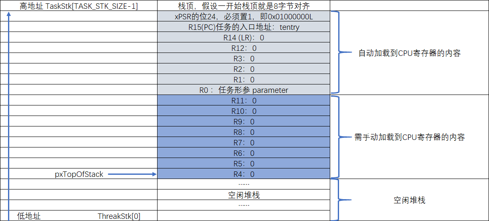

-   代码清单:任务-12_ **(1)**\ ：异常发生时，CPU自动从栈中加载到CPU寄存器的内容。包括8个寄存器，分别为R0、
    R1、R2、R3、R12、R14、R15和xPSR的位24，且顺序不能变。

-   代码清单:任务-12_ **(2)**\ ：xPSR的bit24必须置1，即0x01000000。

-   代码清单:任务-12_ **(3)**\ ：任务的入口地址。

-   代码清单:任务-12_ **(4)**\ ：任务的返回地址，通常任务是不会返回的，如果返回了就跳转到prvTaskExitError，
    该函数是一个无限循环。

-   代码清单:任务-12_ **(5)**\ ：R12, R3, R2 and R1 默认初始化为0。

-   代码清单:任务-12_ **(6)**\ ：异常发生时，需要手动加载到CPU寄存器的内容，总共有8个，分别为R4、R5、R6、
    R7、R8、R9、R10和R11，默认初始化为0。

-   代码清单:任务-12_ **(7)**\ ：返回栈顶指针，此时pxTopOfStack指向具体见图5‑3。任务第一次运行时，就是从这
    个栈指针开始手动加载8个字的内容到CPU寄存器：R4、R5、R6、R7、R8、R9、R10和R11，当退出异常时，栈中剩下
    的8个字的内容会自动加载到CPU寄存器：R0、R1、R2、R3、R12、R14、R15和xPSR的位24。此时PC指针就指向了任
    务入口地址，从而成功跳转到第一个任务。

-   代码清单:任务-11_ **(14)**\ ：让任务句柄指向任务控制块。

-   代码清单:任务-8_ **(10)**\ ：返回任务句柄，如果任务创建成功，此时xReturn应该指向任务控制块，xReturn作为
    形参传入到prvInitialiseNewTask函数。

实现就绪列表
~~~~~~~~~~~~~~~~~~

定义就绪列表
^^^^^^^^^^^^^^^^^^

任务创建好之后，我们需要把任务添加到就绪列表里面，表示任务已经就绪，系统随时可以调度。就绪列表在task.c
中定义，具体见 代码清单:任务-13_。

.. code-block:: c
    :caption: 代码清单:任务-13定义就绪列表
    :name: 代码清单:任务-13
    :linenos:

    /* 任务就绪列表 */
    List_t pxReadyTasksLists[ configMAX_PRIORITIES ];

-   代码清单:任务-13_ **(1)**\ ：就绪列表实际上就是一个List_t类型的数组，数组的大小由决定最大任务优先级的宏
    configMAX_PRIORITIES决定，configMAX_PRIORITIES在FreeRTOSConfig.h中默认定义为5，最大支持256个优先
    级。数组的下标对应了任务的优先级，同一优先级的任务统一插入到就绪列表的同一条链表中。一个空的就绪列表
    具体见图 空的就绪列表_。

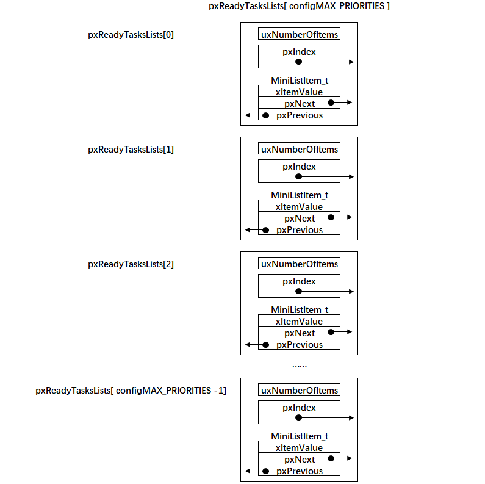

就绪列表初始化
^^^^^^^^^^^^^^

就绪列表在使用前需要先初始化，就绪列表初始化的工作在函数prvInitialiseTaskLists()里面实现，具体见
代码清单:任务-14_。就绪列表初始化完毕之后，示意图见 就绪列表初始化完毕之后示意图_。

.. code-block:: c
    :caption: 代码清单:任务-14就绪列表初始化
    :name: 代码清单:任务-14
    :linenos:

    void prvInitialiseTaskLists( void )
    {
        UBaseType_t uxPriority;

    for ( uxPriority = ( UBaseType_t ) 0U;
    uxPriority < ( UBaseType_t ) configMAX_PRIORITIES;
    uxPriority++ )
        {
            vListInitialise( &( pxReadyTasksLists[ uxPriority ] ) );
        }
    }

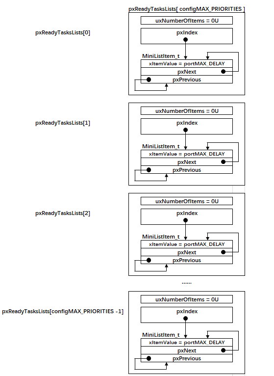

将任务插入到就绪列表
^^^^^^^^^^^^^^^^^^^^

任务控制块里面有一个xStateListItem成员，数据类型为ListItem_t，我们将任务插入到就绪列表里面，就是通过
将任务控制块的xStateListItem这个节点插入到就绪列表中来实现的。如果把就绪列表比作是晾衣架，任务是衣服，
那xStateListItem就是晾衣架上面的钩子，每个任务都自带晾衣架钩子，就是为了把自己挂在各种不同的链表中。

在本章实验中，我们在任务创建好之后，紧跟着将任务插入到就绪列表，具体实现见 代码清单:任务-15_ 的高亮部分。

.. code-block:: c
    :caption: 代码清单:任务-15将任务插入到就绪列表
    :emphasize-lines: 1-2,12-14,23-25
    :name: 代码清单:任务-15
    :linenos:

    /* 初始化与任务相关的列表，如就绪列表 */
    prvInitialiseTaskLists();

    Task1_Handle =                                    /* 任务句柄 */
    xTaskCreateStatic( (TaskFunction_t)Task1_Entry,   /* 任务入口 */
        (char *)"Task1",               /* 任务名称，字符串形式 */
        (uint32_t)TASK1_STACK_SIZE ,   /* 任务栈大小，单位为字 */
        (void *) NULL,                 /* 任务形参 */
        (StackType_t *)Task1Stack,     /* 任务栈起始地址 */
        (TCB_t *)&Task1TCB );          /* 任务控制块 */

    /* 将任务添加到就绪列表 */
    vListInsertEnd( &( pxReadyTasksLists[1] ),
    &( ((TCB_t *)(&Task1TCB))->xStateListItem ) );

    Task2_Handle =                                    /* 任务句柄 */
        xTaskCreateStatic( (TaskFunction_t)Task2_Entry,   /* 任务入口 */
        (char *)"Task2",               /* 任务名称，字符串形式 */
        (uint32_t)TASK2_STACK_SIZE ,   /* 任务栈大小，单位为字 */
        (void *) NULL,                 /* 任务形参 */
        (StackType_t *)Task2Stack,     /* 任务栈起始地址 */
        (TCB_t *)&Task2TCB );          /* 任务控制块 */
    /* 将任务添加到就绪列表 */
    vListInsertEnd( &( pxReadyTasksLists[2] ),
    &( ((TCB_t *)(&Task2TCB))->xStateListItem ) );

就绪列表的下标对应的是任务的优先级，但是目前我们的任务还不支持优先级，有关支持多优先级的知识点我们后面会
讲到，所以Task1和Task2任务在插入到就绪列表的时候，可以随便选择插入的位置。在 代码清单:任务-15_ 中，我们选择将
Task1任务插入到就绪列表下标为1的链表中，Task2任务插入到就绪列表下标为2的链表中，具体的示意图见 任务插入到就绪列表示意图_。

.. image:: media/Task_definition_and_implementation_of_task_switching/Taskde007.png
   :align: center
   :name: 任务插入到就绪列表示意图
   :alt: 任务插入到就绪列表示意图

实现调度器
~~~~~~~~~~~~~

调度器是操作系统的核心，其主要功能就是实现任务的切换，即从就绪列表里面找到优先级最高的任务，然后去执行该
任务。从代码上来看，调度器无非也就是由几个全局变量和一些可以实现任务切换的函数组成，全部都在task.c文件中实现。

启动调度器
^^^^^^^^^^^^^

调度器的启动由vTaskStartScheduler()函数来完成，该函数在task.c中定义，具体实现见 代码清单:任务-16_。

vTaskStartScheduler()函数
'''''''''''''''''''''''''''''''''''''''''''''''''''''''''''''''

.. code-block:: c
    :caption: 代码清单:任务-16vTaskStartScheduler()函数
    :name: 代码清单:任务-16
    :linenos:

    void vTaskStartScheduler( void )
    {
    /* 手动指定第一个运行的任务 */
        pxCurrentTCB = &Task1TCB;(1)

    /* 启动调度器 */
    if ( xPortStartScheduler() != pdFALSE )
        {
    /* 调度器启动成功，则不会返回，即不会来到这里 */(2)
        }
    }

-   代码清单:任务-16_ **(1)**\ ：pxCurrentTCB是一个在task.c定义的全局指针，用于指向当前正在运行或者即将要运行
    的任务的任务控制块。目前我们还不支持优先级，则手动指定第一个要运行的任务。

-   代码清单:任务-16_ **(2)**\ ：调用函数xPortStartScheduler()启动调度器，调度器启动成功，则不会返回。该函数
    在port.c中实现，具体见 代码清单:任务-17_。

xPortStartScheduler()函数
'''''''''''''''''''''''''''''''''''''''''''''''''''''''''''''''

.. code-block:: c
    :caption: 代码清单:任务-17xPortStartScheduler()函数
    :name: 代码清单:任务-17
    :linenos:

    /*
    *参考资料《STM32F10xxx Cortex-M3 programming manual》4.4.3，百度搜索“PM0056”即可找到这个文档
    * 在Cortex-M中，内核外设SCB中SHPR3寄存器用于设置SysTick和PendSV的异常优先级
    * System handler priority register 3 (SCB_SHPR3) SCB_SHPR3：0xE000 ED20
    * Bits 31:24 PRI_15[7:0]: Priority of system handler 15, SysTick exception
    * Bits 23:16 PRI_14[7:0]: Priority of system handler 14, PendSV
    */
    #define portNVIC_SYSPRI2_REG	 (*(( volatile uint32_t *) 0xe000ed20))

    #define portNVIC_PENDSV_PRI(((uint32_t) configKERNEL_INTERRUPT_PRIORITY ) << 16UL)
    #define portNVIC_SYSTICK_PRI(((uint32_t) configKERNEL_INTERRUPT_PRIORITY ) << 24UL )

    BaseType_t xPortStartScheduler( void )
    {
    /* 配置PendSV 和 SysTick 的中断优先级为最低 */(1)
        portNVIC_SYSPRI2_REG |= portNVIC_PENDSV_PRI;
        portNVIC_SYSPRI2_REG |= portNVIC_SYSTICK_PRI;

    /* 启动第一个任务，不再返回 */
        prvStartFirstTask();(2)

    /* 不应该运行到这里 */
    return 0;
    }

-   代码清单:任务-17_ **(1)**\ ：配置PendSV 和 SysTick 的中断优先级为最低。SysTick和PendSV都会涉及系统调度，
    系统调度的优先级要低于系统的其他硬件中断优先级，即优先相应系统中的外部硬件中断，所以SysTick和PendSV的中
    断优先级配置为最低。

-   代码清单:任务-17_ **(2)**\ ：调用函数prvStartFirstTask()启动第一个任务，启动成功后，则不再返回，该函数由汇
    编编写，在port.c实现，具体代码见 代码清单:任务-18_。

prvStartFirstTask()函数
'''''''''''''''''''''''''''''''''''''''''''''''''''''''''''''

prvStartFirstTask()函数用于开始第一个任务，主要做了两个动作，一个是更新MSP的值，二是产生SVC系统调用，
然后去到SVC的中断服务函数里面真正切换到第一个任务。该函数的具体实现见 代码清单:任务-18_。

.. code-block:: guess
    :caption: 代码清单:任务-18prvStartFirstTask()函数
    :name: 代码清单:任务-18
    :linenos:

    /*
    * 参考资料《STM32F10xxx Cortex-M3 programming manual》4.4.3，百度搜索“PM0056”即可找到这个文档
    * 在Cortex-M中，内核外设SCB的地址范围为：0xE000ED00-0xE000ED3F
    * 0xE000ED008为SCB外设中SCB_VTOR这个寄存器的地址，里面存放的是向量表的起始地址，即MSP的地址
    */

    (1)
    __asm void prvStartFirstTask( void )
    {
        PRESERVE8(2)

    /* 在Cortex-M中，0xE000ED08是SCB_VTOR这个寄存器的地址，(3)
    里面存放的是向量表的起始地址，即MSP的地址 */
        ldr r0, =0xE000ED08(4)
    ldr r0, [r0](5)
    ldr r0, [r0](6)

    /* 设置主栈指针msp的值 */
    msr msp, r0(7)

    /* 使能全局中断 */(8)
    cpsie i
    cpsie f
        dsb
        isb

    /* 调用SVC去启动第一个任务 */
        svc 0(9)
        nop
        nop
    }

-   代码清单:任务-18_ **(1)**\ ：

-   代码清单:任务-18_ **(2)**\ ：当前栈需按照8字节对齐，如果都是32位的操作则4个字节对齐即可。在Cortex-M中浮点
    运算是8字节的。

-   代码清单:任务-18_ **(3)**\ ：在Cortex-M中，0xE000ED08是SCB_VTOR寄存器的地址，里面存放的是向量表的起始地
    址，即MSP的地址。向量表通常是从内部FLASH的起始地址开始存放，那么可知memory：0x00000000处存放的就是MSP的值。
    这个可以通过仿真时查看内存的值证实，具体见图 memory_0x00000000处的值_。

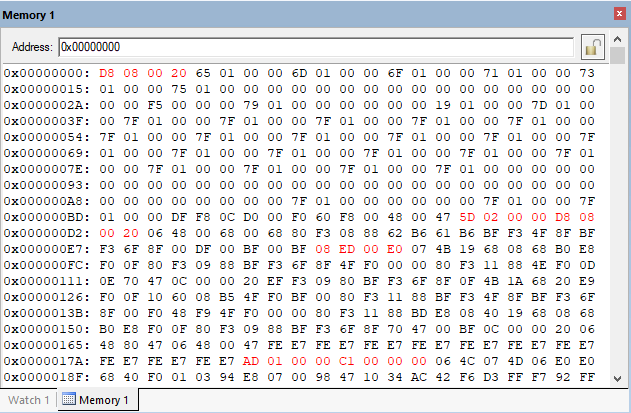

-   代码清单:任务-18_ **(4)**\ ：将0xE000ED08这个立即数加载到寄存器R0。

-   代码清单:任务-18_ **(5)**\ ：将0xE000ED08这个地址指向的内容加载到寄存器R0，此时R0等于SCB_VTOR寄存器的值，
    等于0x00000000，即memory的起始地址。

-   代码清单:任务-18_ **(6)**\ ：将0x00000000这个地址指向的内容加载到R0，此时R0等于0x200008DB，与图5‑7
    查询到的值吻合。

-   代码清单:任务-18_ **(7)**\ ：将R0的值存储到MSP，此时MSP等于0x200008DB，这是主栈的栈顶指针。起始这一步操
    作有点多余，因为当系统启动的时候，执行完Reset_Handler的时候，向量表已经初始化完毕，MSP的值就已经更新
    为向量表的起始值，即指向主栈的栈顶指针。

-   代码清单:任务-18_ **(8)**\ ：使用CPS指令把全局中断打开。为了快速地开关中断， Cortex-M内核专门设置了一条
    CPS指令，有4种用法，具体见 代码清单:任务-19_。

.. code-block:: guess
    :caption: 代码清单:任务-19CPS 指令用法
    :name: 代码清单:任务-19
    :linenos:

    CPSID I ;PRIMASK=1     ;关中断
    CPSIE I ;PRIMASK=0     ;开中断
    CPSID F ;FAULTMASK=1   ;关异常
    CPSIE F ;FAULTMASK=0   ;开异常

-   代码清单:任务-19_ 中PRIMASK和FAULTMAST是Cortex-M内核里面三个中断屏蔽寄存器中的两个，还有一个是BASEPRI，有关
    这三个寄存器的详细用法见下表。

表5‑1Cortex-M内核中断屏蔽寄存器组描述

.. list-table::
   :widths: 50 50
   :header-rows: 0

   * - 名字
     - 功能描述

   * - PRIMASK
     - 这是个只有单一比特的寄存器。在它被置1后，就关掉所有可屏蔽的异常，只剩下NMI和硬FAULT可以响应。它的缺省值是0，表示没有关中断。

   * - FAULTMASK
     - 这是个只有1个位的寄存器。当它置1时，只有NMI才能响应，所有其他的异常，甚至是硬FAULT，也通通闭嘴。它的缺省值也是0，表示没有关异常。

   * - BASEPRI
     - 这个寄存器最多有9位（由表达优先级的位数决定）。它定义了被屏蔽优先级的阈值。当它被设成
       某个值后，所有优先级号大于等于此值的中断都被关（优先级号越大，优先级越低）。但若被设成0，则不关闭任何中断，0也是缺省值。                                            |

-   代码清单:任务-18_ **(9)**\ ：产生系统调用，服务号0表示SVC中断，接下来将会执行SVC中断服务函数。

vPortSVCHandler()函数
'''''''''''''''''''''''''''''''''''''''''''''''''''

SVC中断要想被成功响应，其函数名必须与向量表注册的名称一致，在启动文件的向量表中，SVC的中断服务函数注册的名称
是SVC_Handler，所以SVC中断服务函数的名称我们应该写成SVC_Handler，但是在FreeRTOS中，官方版本写的是
vPortSVCHandler()，为了能够顺利的响应SVC中断，我们有两个选择，改中断向量表中SVC的注册的函数名称或者改FreeRTOS
中SVC的中断服务名称。这里，我们采取第二种方法，即在FreeRTOSConfig.h中添加添加宏定义的方法来修改，
具体见 代码清单:任务-20_，顺便把PendSV和SysTick的中断服务函数名也改成与向量表的一致。

.. code-block:: c
    :caption: 代码清单:任务-20修改FreeRos中SVC、PendSV和SysTick中断服务函数的名称
    :name: 代码清单:任务-20
    :linenos:

    #define xPortPendSVHandler   PendSV_Handler
    #define xPortSysTickHandler  SysTick_Handler
    #define vPortSVCHandler      SVC_Handler

vPortSVCHandler()函数开始真正启动第一个任务，不再返回，实现具体见 代码清单:任务-21_。

.. code-block:: guess
    :caption: 代码清单:任务-21vPortSVCHandler()函数
    :name: 代码清单:任务-21
    :linenos:

    __asm void vPortSVCHandler( void )
    {
    extern pxCurrentTCB;(1)

        PRESERVE8

        ldrr3, =pxCurrentTCB(2)
    ldr r1, [r3](3)
    ldr r0, [r1](4)
    ldmia r0!, {r4-r11}(5)
    msr psp, r0(6)
    isb
    mov r0, #0(7)
    msrbasepri, r0(8)
        orr r14, #0xd(9)

    bx r14(10)
    }

-   代码清单:任务-21_ **(1)**\ ：声明外部变量pxCurrentTCB，pxCurrentTCB是一个在task.c中定义的全局指针，用
    于指向当前正在运行或者即将要运行的任务的任务控制块。

-   代码清单:任务-21_ **(2)**\ ：加载pxCurrentTCB的地址到r3。

-   代码清单:任务-21_ **(3)**\ ：加载pxCurrentTCB到r3。

-   代码清单:任务-21_ **(4)**\ ：加载pxCurrentTCB指向的任务控制块到r0，任务控制块的第一个成员就是栈顶指针，
    所以此时r0等于栈顶指针。一个刚刚被创建还没有运行过的任务的栈空间分布具体如 任务栈初始化完后栈空间分布图_ 所示，即r0等于图中的pxTopOfStack。

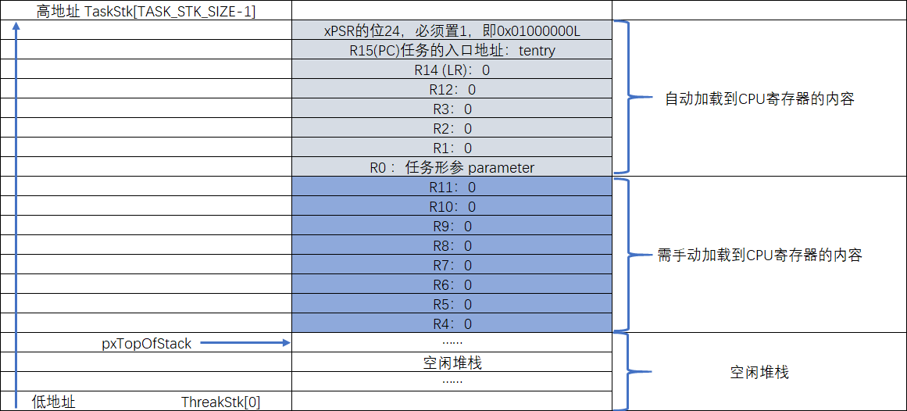

-   代码清单:任务-21_ **(5)**\ ：以r0为基地址，将栈中向上增长的8个字的内容加载到CPU寄存器r4~r11，同时r0也会跟着自增。

-   代码清单:任务-21_ **(6)**\ ：将新的栈顶指针r0更新到psp，任务执行的时候使用的栈指针是psp。此时psp的指向具体见。

-   代码清单:任务-21_ **(7)**\ ：将寄存器r0清0。

-   代码清单:任务-21_ **(8)**\ ：设置basepri寄存器的值为0，即打开所有中断。basepri是一个中断屏蔽寄存器，大
    于等于此寄存器值的中断都将被屏蔽。

-   代码清单:任务-21_ **(9)**\ ：当从SVC中断服务退出前，通过向r14寄存器最后4位按位或上0x0D，使得硬件在退出
    时使用进程栈指针PSP完成出栈操作并返回后进入任务模式、返回Thumb状态。在SVC中断服务里面，使用的是MSP栈
    指针，是处在ARM状态。

-   代码清单:任务-21_ **(10)**\ ：异常返回，这个时候出栈使用的是PSP指针，自动将栈中的剩下内容加载到CPU
    寄存器： xPSR，PC（任务入口地址），R14，R12，R3，R2，R1，R0（任务的形参）同时PSP的值也将更新，即
    指向任务栈的栈顶，具体指向见图 第一个任务启动成功后psp的指向_。

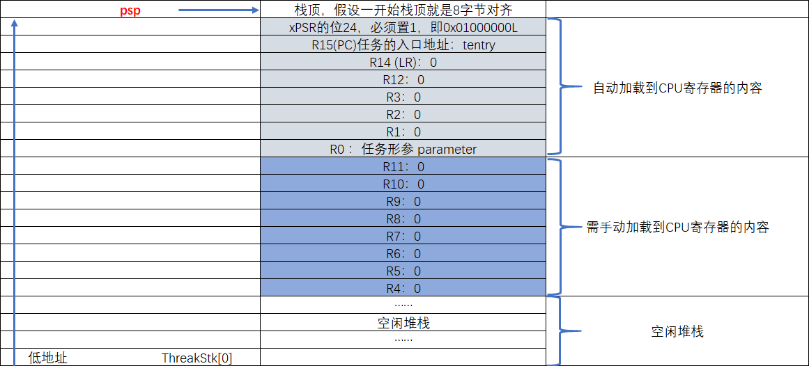

任务切换
^^^^^^^^^^^^

任务切换就是在就绪列表中寻找优先级最高的就绪任务，然后去执行该任务。但是目前我们还不支持优先级，仅实
现两个任务轮流切换，任务切换函数taskYIELD()具体实现见 代码清单:任务-22_。

taskYIELD()
'''''''''''''''''''''''''''

.. code-block:: c
    :caption: 代码清单:任务-22taskYIELD()的实现
    :name: 代码清单:任务-22
    :linenos:

    /* 在task.h中定义 */
    #define taskYIELD()			portYIELD()

    /* 在portmacro.h中定义 */
    /* 中断控制状态寄存器：0xe000ed04
    * Bit 28 PENDSVSET: PendSV 悬起位
    */
    #define portNVIC_INT_CTRL_REG		(*(( volatile uint32_t *) 0xe000ed04))
    #define portNVIC_PENDSVSET_BIT		( 1UL << 28UL )

    #define portSY_FULL_READ_WRITE		( 15 )

    #define portYIELD()
    {
        /* 触发PendSV，产生上下文切换 */
        portNVIC_INT_CTRL_REG = portNVIC_PENDSVSET_BIT;(1)
        __dsb( portSY_FULL_READ_WRITE );
        __isb( portSY_FULL_READ_WRITE );
    }

-   代码清单:任务-22_ **(1)**\ ：portYIELD的实现很简单，实际就是将PendSV的悬起位置1，当没有其他中断运行的
    时候响应PendSV中断，去执行我们写好的PendSV中断服务函数，在里面实现任务切换。

xPortPendSVHandler()函数
''''''''''''''''''''''''''''''''''''''''''''''''''''''''''''''

PendSV中断服务函数是真正实现任务切换的地方，具体实现见 代码清单:任务-23_。

.. code-block:: guess
    :caption: 代码清单:任务-23xPortPendSVHandler()函数
    :name: 代码清单:任务-23
    :linenos:

    __asm void xPortPendSVHandler( void )
    {
    extern pxCurrentTCB;(1)
    extern vTaskSwitchContext;(2)

        PRESERVE8(3)

        mrs r0, psp(4)
        isb

        ldrr3, =pxCurrentTCB(5)
    ldrr2, [r3](6)

    stmdb r0!, {r4-r11}(7)
    str r0, [r2](8)

    stmdb sp!, {r3, r14}(9)
        mov r0, #configMAX_SYSCALL_INTERRUPT_PRIORITY(10)
        msr basepri, r0(11)
        dsb
        isb
        bl vTaskSwitchContext(12)
        mov r0, #0(13)
        msr basepri, r0
        ldmia sp!, {r3, r14}(14)

        ldr r1, [r3](15)
        ldr r0, [r1](16)
        ldmia r0!, {r4-r11}(17)
        msr psp, r0(18)
        isb
        bx r14(19)
        nop
    }

-   代码清单:任务-23_ **(1)**\ ：声明外部变量pxCurrentTCB，pxCurrentTCB是一个在task.c中定义的全局指针，用
    于指向当前正在运行或者即将要运行的任务的任务控制块。

-   代码清单:任务-23_ **(2)**\ ：声明外部函数vTaskSwitchContext，等下会用到。

-   代码清单:任务-23_ **(3)**\ ：当前栈需按照8字节对齐，如果都是32位的操作则4个字节对齐即可。在Cortex-M中浮
    点运算是8字节的。

-   代码清单:任务-23_ **(4)**\ ：将PSP的值存储到r0。当进入PendSVC Handler时，上一个任务运行的环境即：xPSR，
    PC（任务入口地址），R14，R12，R3，R2，R1，R0（任务的形参）这些CPU寄存器的值会自动存储到任务的栈中，剩
    下的r4~r11需要手动保存，同时PSP会自动更新（在更新之前PSP指向任务栈的栈顶），此时PSP具体指向见
    图 上一个任务的运行环境自动存储到任务栈后psp的指向_。

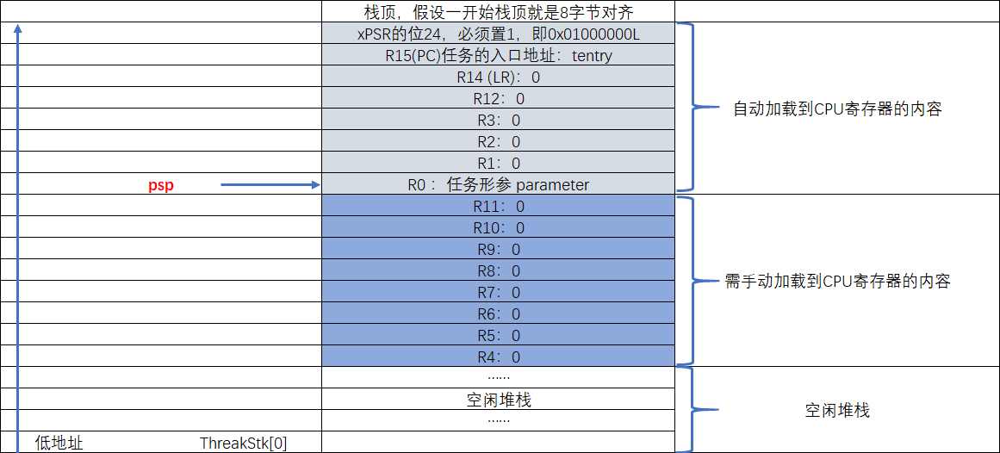

-   代码清单:任务-23_ **(5)**\ ：加载pxCurrentTCB的地址到r3。

-   代码清单:任务-23_ **(6)**\ ：加载r3指向的内容到r2，即r2等于pxCurrentTCB。

-   代码清单:任务-23_ **(7)**\ ：以r0作为基址（指针先递减，再操作，STMDB的DB表示 Decrease Befor），将CPU寄
    存器r4~r11的值存储到任务栈，同时更新r0的值，此时r0的指向具体见 上一个任务的运行环境手动存储到任务栈后r0的指向_。

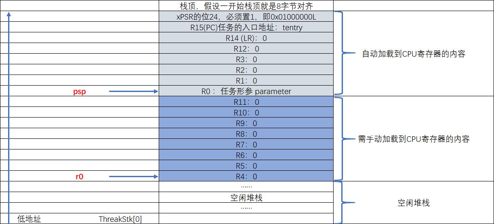

-   代码清单:任务-23_ **(8)**\ ：将r0的值存储到r2指向的内容，r2等于pxCurrentTCB。具体为将r0的值存储到上一个
    任务的栈顶指针pxTopOfStack，具体指向如图5‑11的r0指向一样。到此，上下文切换中的上文保存就完成了。

-   代码清单:任务-23_ **(9)**\ ：将R3和R14临时压入栈（在整个系统中，中断使用的是主栈，栈指针使用的是MSP），因
    为接下来要调用函数vTaskSwitchContext，调用函数时，返回地址自动保存到R14中，所以一旦调用发生，R14的值
    会被覆盖（PendSV中断服务函数执行完毕后，返回的时候需要根据R14的值来决定返回处理器模式还是任务模式，出栈
    时使用的是PSP还是MSP），因此需要入栈保护。R3保存的是当前正在运行的任务（准确来说是上文，因为接下来即将
    要切换到新的任务）的TCB指针(pxCurrentTCB)地址，函数调用后pxCurrentTCB的值会被更新，后面我们还需要通过
    R3来操作pxCurrentTCB，但是运行函数vTaskSwitchContext时不确定会不会使用R3寄存器作为中间变量，所以为了
    保险起见，R3也入栈保护起来。

-   代码清单:任务-23_ **(10)**\ ：将configMAX_SYSCALL_INTERRUPT_PRIORITY的值存储到r0，
    该宏在FreeRTOSConfig.h中定义，用来配置中断屏蔽寄存器BASEPRI的值，高四位有效。目前
    配置为191，因为是高四位有效，所以实际值等于11，即优先级高于或者等于11的中断都将被屏
    蔽。在关中断方面，FreeRTOS与其他的RTOS关中断不同，而是操作BASEPRI寄存器来预留一部
    分中断，并不像μC/OS或者RT-Thread那样直接操作PRIMASK把所有中断都关闭掉（除了硬FAULT）。

-   代码清单:任务-23_ **(11)**\ ：关中断，进入临界段，因为接下来要更新全局指针pxCurrentTCB的值。

-   代码清单:任务-23_ **(12)**\：调用函数vTaskSwitchContext。该函数在task.c中定义，作用只有一个，选择优先级最
    高的任务，然后更新pxCurrentTCB。目前我们还不支持优先级，则手动切换，不是任务1就是任务2，该函数的具体实现
    见 代码清单:任务-24_ vTaskSwitchContext()函数。

vTaskSwitchContext()函数
''''''''''''''''''''''''''''''''''''''''''''

.. code-block:: c
    :caption: 代码清单:任务-24vTaskSwitchContext()函数
    :name: 代码清单:任务-24
    :linenos:

    void vTaskSwitchContext( void )
    {
    /* 两个任务轮流切换 */
    if ( pxCurrentTCB == &Task1TCB )(1)
        {
            pxCurrentTCB = &Task2TCB;
        }
    else(2)
        {
            pxCurrentTCB = &Task1TCB;
        }
    }

-   代码清单:任务-24_ **(1)**\ ：如果当前任务为任务1，则把下一个要运行的任务改为任务2。

-   代码清单:任务-24_ **(2)**\ ：如果当前任务为任务2，则把下一个要运行的任务改为任务1。

-   代码清单:任务-23_ **(13)**\ ：退出临界段，开中断，直接往BASEPRI写0。

-   代码清单:任务-23_ **(14)**\ ：从主栈中恢复寄存器r3和r14的值，此时的sp使用的是MSP。

-   代码清单:任务-23_ **(15)**\ ：加载r3指向的内容到r1。r3存放的是pxCurrentTCB的地址，即让r1等于pxCurrentTCB。
    pxCurrentTCB在上面的vTaskSwitchContext函数中被更新，指向了下一个将要运行的任务的TCB。

-   代码清单:任务-23_ **(16)**\ ：加载r1指向的内容到r0，即下一个要运行的任务的栈顶指针。

-   代码清单:任务-23_ **(17)**\ ：以r0作为基地址（先取值，再递增指针，LDMIA的IA表示Increase After），将下一个要
    运行的任务的任务栈的内容加载到CPU寄存器r4~r11。

-   代码清单:任务-23_ **(18)**\ ：更新psp的值，等下异常退出时，会以psp作为基地址，将任务栈中剩下的内容自动加载到CPU寄存器。

-   代码清单:任务-23_ **(19)**\ ：异常发生时，R14中保存异常返回标志，包括返回后进入任务模式还是处理器模式、使用PSP
    栈指针还是MSP栈指针。此时的r14等于0xfffffffd，最表示异常返回后进入任务模式，SP以PSP作为栈指针出栈，出栈完
    毕后PSP指向任务栈的栈顶。当调用 bxr14指令后，系统以PSP作为SP指针出栈，把接下来要运行的新任务的任务栈中剩下
    的内容加载到CPU寄存器：R0（任务形参）、R1、R2、R3、R12、R14（LR）、R15（PC）和xPSR，从而切换到新的任务。

main函数
~~~~~~~~~~~~~~~~~~

任务的创建，就绪列表的实现，调度器的实现均已经讲完，现在我们把全部的测试代码都放到main.c里面，具体见 代码清单:任务-25_。

.. code-block:: c
    :caption: 代码清单:任务-25main.c代码
    :name: 代码清单:任务-25
    :linenos:

    /*************************************************************************
    * @file    main.c
    * @author  fire
    * @version V1.0
    * @date    2018-xx-xx
    * @brief   《FreeRTOS内核实现与应用开发实战指南》书籍例程
    *           任务的定义与任务切换的实现
    ***********************************************************************
    * @attention
    *
    * 实验平台:野火 STM32 系列开发板
    *
    * 官网    : www.embedfire.com
    * 论坛    : http://www.firebbs.cn
    * 淘宝    : https://fire-stm32.taobao.com
    *
    ***********************************************************************
    */

    /*
    *************************************************************************
    *                             包含的头文件
    *************************************************************************
    */
    #include"FreeRTOS.h"
    #include"task.h"

    /*
    *************************************************************************
    *                              全局变量
    *************************************************************************
    */
    portCHAR flag1;
    portCHAR flag2;

    extern List_t pxReadyTasksLists[ configMAX_PRIORITIES ];

    /*
    *************************************************************************
    *                        任务控制块& STACK
    *************************************************************************
    */
    TaskHandle_t Task1_Handle;
    #define TASK1_STACK_SIZE                    128
    StackType_t Task1Stack[TASK1_STACK_SIZE];
    TCB_t Task1TCB;

    TaskHandle_t Task2_Handle;
    #define TASK2_STACK_SIZE                    128
    StackType_t Task2Stack[TASK2_STACK_SIZE];
    TCB_t Task2TCB;

    /*
    *************************************************************************
    *                               函数声明
    *************************************************************************
    */
    void delay (uint32_t count);
    void Task1_Entry( void *p_arg );
    void Task2_Entry( void *p_arg );

    /*
    ************************************************************************
    *                                main函数
    ************************************************************************
    */
    /*
    * 注意事项：1、该工程使用软件仿真，debug需选择 Ude Simulator
    *           2、在Target选项卡里面把晶振Xtal(Mhz)的值改为25，默认是12，
    *              改成25是为了跟system_ARMCM3.c中定义的__SYSTEM_CLOCK相同，
    *              确保仿真的时候时钟一致
    */
    int main(void)
    {
    /* 硬件初始化 */
    /* 将硬件相关的初始化放在这里，如果是软件仿真则没有相关初始化代码 */

    /* 初始化与任务相关的列表，如就绪列表 */
        prvInitialiseTaskLists();

    /* 创建任务 */
        Task1_Handle =
    xTaskCreateStatic( (TaskFunction_t)Task1_Entry,   /* 任务入口 */
    (char *)"Task1",               /* 任务名称，字符串形式 */
    (uint32_t)TASK1_STACK_SIZE ,   /* 任务栈大小，单位为字 */
    (void *) NULL,                 /* 任务形参 */
    (StackType_t *)Task1Stack,     /* 任务栈起始地址 */
    (TCB_t *)&Task1TCB );          /* 任务控制块 */
    /* 将任务添加到就绪列表 */
        vListInsertEnd( &( pxReadyTasksLists[1] ),
    &( ((TCB_t *)(&Task1TCB))->xStateListItem ) );

        Task2_Handle =
    xTaskCreateStatic( (TaskFunction_t)Task2_Entry,   /* 任务入口 */
    (char *)"Task2",               /* 任务名称，字符串形式 */
    (uint32_t)TASK2_STACK_SIZE ,   /* 任务栈大小，单位为字 */
    (void *) NULL,                 /* 任务形参 */
    (StackType_t *)Task2Stack,     /* 任务栈起始地址 */
    (TCB_t *)&Task2TCB );          /* 任务控制块 */
    /* 将任务添加到就绪列表 */
        vListInsertEnd( &( pxReadyTasksLists[2] ),
    &( ((TCB_t *)(&Task2TCB))->xStateListItem ) );

    /* 启动调度器，开始多任务调度，启动成功则不返回 */
        vTaskStartScheduler();

    for (;;)
        {
    /* 系统启动成功不会到达这里 */
        }
    }

    /*
    ***********************************************************************
    *                               函数实现
    ***********************************************************************
    */
    /* 软件延时 */
    void delay (uint32_t count)
    {
    for (; count!=0; count--);
    }
    /* 任务1 */
    void Task1_Entry( void *p_arg )
    {
    for ( ;; )
        {
            flag1 = 1;
            delay( 100 );
            flag1 = 0;
            delay( 100 );

    /* 任务切换，这里是手动切换 */
            taskYIELD();(注意)
        }
    }

    /* 任务2 */
    void Task2_Entry( void *p_arg )
    {
    for ( ;; )
        {
            flag2 = 1;
            delay( 100 );
            flag2 = 0;
            delay( 100 );

    /* 任务切换，这里是手动切换 */
            taskYIELD();(注意)
        }
    }

代码清单:任务-25_ 中的每个局部的代码均已经讲解过，剩下的看代码注释即可。

-   代码清单:任务-25_ **(注意)**\ ：因为目前还不支持优先级，每个任务执行完毕之后都主动调用任务切换函数taskYIELD()来实现任务的切换。

实验现象
~~~~~~~~~~~~

本章代码讲解完毕，接下来是软件调试仿真，具体过程见

-   图 点击Debug按钮进入调试界面_
-   图 点击逻辑分析仪按钮调出逻辑分析仪_
-   图 将要观察的变量添加到逻辑分析仪_
-   图 将变量设置为Bit模式_，默认是Analog
-   图 点击全速运行按钮_，即可看到波形，Zoom栏的In Out All可放大和缩小波形

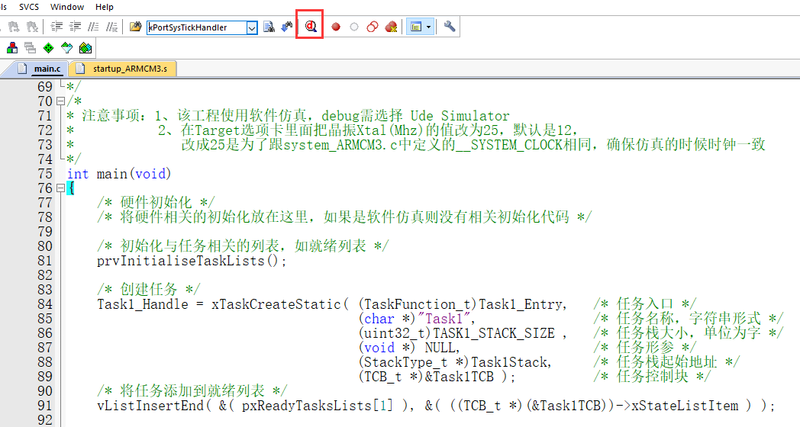

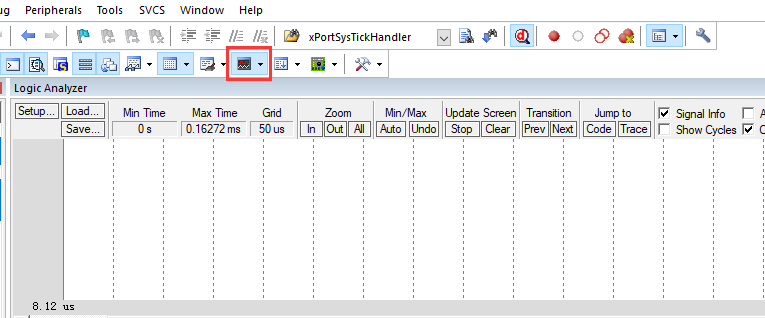

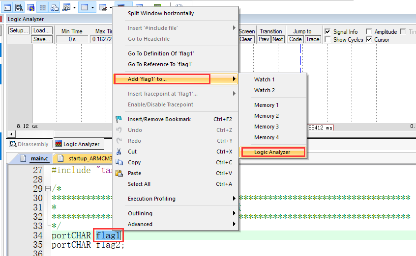

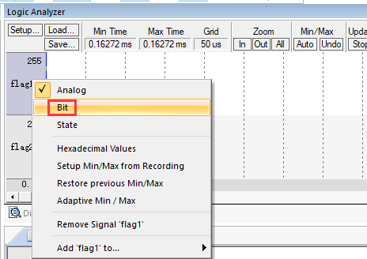

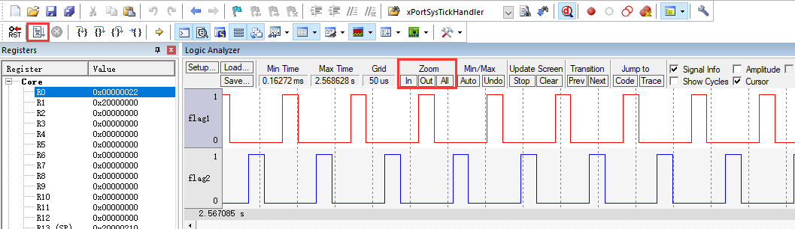

至此，本章讲解完毕。但是，只是把本章的内容看完，然后再仿真看看波形是远远不够的，应该是把当前任务控制块指针
pxCurrentTCB、就绪列表pxReadyTaskLists、每个任务的控制块和任务的栈这些变量统统添加到观察窗口，然后单步执
行程序，看看这些变量是怎么变化的。特别是任务切换时，CPU寄存器、任务栈和PSP这些是怎么变化的，让机器执行代码
的过程在自己的脑子里面过一遍。图 软件调试仿真时的Watch窗口_ 就是我在仿真调试时的观察窗口。

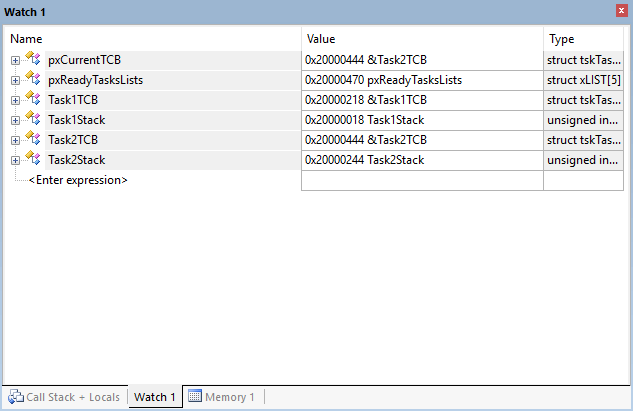

本章涉及的汇编指令讲解
~~~~~~~~~~~~~~~~~~~~~~~~~~~~~~~

本章中有些函数是用汇编编写的，涉及的ARM 汇编指令具体参考下表。

表:ARM常用汇编指令讲解

.. list-table::
   :widths: 50 50
   :header-rows: 0

   * - 指令名称作用
     - 作用

   * - EQU
     - 给数字常量取一个符号名，相当于C语言中的define

   * - AREA
     - 汇编一个新的代码段或者数据段

   * - SPACE
     - 分配内存空间

   * - PRESERVE8
     - 当前文件栈需按照8字节对齐

   * - EXPORT
     - 声明一个标号具有全局属性，可被外部的文件使用

   * - DCD
     - 以字为单位分配内存，要求4字节对齐，并要求初始化这些内存

   * - PROC
     - 定义子程序，与ENDP成对使用，表示子程序结束

   * - WEAK
     - 弱定义，如果外部文件声明了一个标号，则优先使用外部文件定义的标号，如果外部文件没有定义也不出错。要注意的是：这个不是ARM的指令，是编译器的，这里放在一起只是为了方便。

   * - IMPORT
     - 声明标号来自外部文件，跟C语言中的EXTERN关键字类似

   * - B
     - 跳转到一个标号

   * - ALIGN
     - 编译器对指令或者数据的存放地址进行对齐，一般需要跟一个立即数，缺省表示4字节对齐。要注意的是：这个不是ARM的指令，是编译器的，这里放在一起只是为了方便。

   * - END
     - 到达文件的末尾，文件结束

   * - IF,ELSE,ENDIF
     - 汇编条件分支语句，跟C语言的if else类似

   * - MRS
     - 加载特殊功能寄存器的值到通用寄存器

   * - MSR
     - 存储通用寄存器的值到特殊功能寄存器

   * - CBZ
     - 比较，如果结果为0 就转移

   * - CBNZ
     - 比较，如果结果非0 就转移

   * - LDR
     - 从存储器中加载字到一个寄存器中

   * - LDR[伪指令] 加
     - 一个立即数或者一个地址值到一个寄存器。举例：LDR | Rd, = label，如果label是立即数，那Rd等于立即数，如果label是一个标识符，比如指针，那存到Rd的就是label这个标识符的地址

   * - LDRH
     - 从存储器中加载半字到一个寄存器中

   * - LDRB
     - 从存储器中加载字节到一个寄存器中

   * - STR
     - 把一个寄存器按字存储到存储器中

   * - STRH
     - 把一个寄存器存器的低半字存储到存储器中

   * - STRB
     - 把一个寄存器的低字节存储到存储器中

   * - LDMIA
     - 将多个字从存储器加载到CPU寄存器，先操作，指针在递增。

   * - STMDB
     - 将多个字从CPU寄存器存储到存储器，指针先递减，再操作

   * - LDMFD
     -

   * - ORR
     - 按位或

   * - BX
     - 直接跳转到由寄存器给定的地址

   * - BL
     - 跳转到标号对应的地址，并且把跳转前的下条指令地址保存到LR

   * - BLX
     - 跳转到由寄存器REG给出的的地址，并根据REG的LSB切换处理器状态，还要把转移前的下条指令地址保存到LR。ARM(LSB=0)，Thumb(LSB=1)。CM3 只在Thumb中运行，就必须保证reg 的LSB=1，否则一个fault 打过来

