.. vim: syntax=rst

数据结构—列表与列表项讲解
==========================

在FreeRTOS中存在着大量的基础数据结构列表和列表项的操作，要想读懂FreeRTOS的源码或者从0到1开始实现FreeRTOS，就必须弄懂列表和列表项的操作，其实也没那么难。

列表和列表项是直接从FreeRTOS源码的注释中的list 和 list item翻译过来的，其实就是对应我们C语言当中的链表和节点，在后续的讲解中，我们说的链表就是列表，节点就是列表项。

C语言链表简介
~~~~~~~~~~~~~~

链表作为C语言中一种基础的数据结构，在平时写程序的时候用的并不多，但在操作系统里面使用的非常多。链表就好比一个圆形的晾衣架，具体见图6‑1，晾衣架上面有很多钩子，钩子首尾相连。链表也是，链表由节点组成，节点与节点之间首尾相连。

晾衣架的钩子本身不能代表很多东西，但是钩子本身却可以挂很多东西。同样，链表也类似，链表的节点本身不能存储太多东西，或者说链表的节点本来就不是用来存储大量数据的，但是节点跟晾衣架的钩子一样，可以挂很多数据。

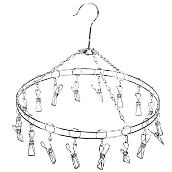

链表分为单向链表和双向链表，单向链表很少用，使用最多的还是双向链表。

单向链表
^^^^^^^^

链表的定义
''''''''''

单向链表示意图具体见图 单向链表_。该链表中共有n个节点，前一个节点都有一个箭头指向后一个节点，首尾相连，组成一个圈。

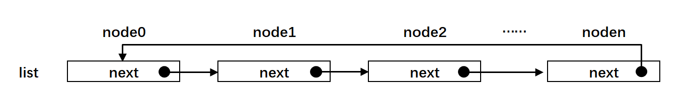

节点本身必须包含一个节点指针，用于指向后一个节点，除了这个节点指针是必须有的之外，节点本身还可以携带一些私有信息，怎么携带？

节点都是一个自定义类型的数据结构，在这个数据结构里面可以有单个的数据、数组、指针数据和自定义的结构体数据类型等等信息，具体见 代码清单:列表-1_。

.. code-block:: c
    :caption:  代码清单:列表-1节点结构体定义
    :name: 代码清单:列表-1
    :linenos:

    struct node
    {
        struct node *next;        /* 指向链表的下一个节点 */
        char   data1;             /* 单个的数据 */
        unsigned char array[];    /* 数组 */
        unsigned long *prt        /* 指针数据 */
        struct userstruct data2;  /*自定义结构体类型数据 */
        /* ...... */
    }

在 代码清单:列表-1_ 除了struct node \*next 这个节点指针之外，剩下的成员都可以理解为节点携带的数据，但是这种方法很少用。
通常的做法是节点里面只包含一个用于指向下一个节点的指针。要通过链表存储的数据内嵌一个节点即可，这些要存储的数据通过
这个内嵌的节点即可挂接到链表中，就好像晾衣架的钩子一样，把衣服挂接到晾衣架中，具体的伪代码实现见 代码清单:列表-2_，具体
的示意图见 节点内嵌在一个数据结构中_。

.. code-block:: c
    :caption:  代码清单:列表-2节点内嵌在一个数据结构中
    :name:  代码清单:列表-2
    :linenos:

    /* 节点定义 */
    struct node
    {
    struct node *next;        /* 指向链表的下一个节点 */
    }

    struct userstruct
    {
    /* 在结构体中，内嵌一个节点指针，通过这个节点将数据挂接到链表 */
    struct node *next;
    /* 各种各样......，要存储的数据 */
    }

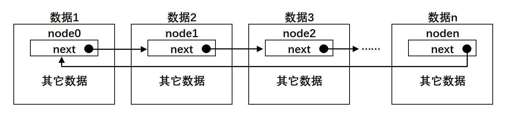

链表的操作
''''''''''

链表最大的作用是通过节点把离散的数据链接在一起，组成一个表，这大概就是链表的字面解释了吧。链表常规的操作就是节点
的插入和删除，为了顺利的插入，通常一条链表我们会人为地规定一个根节点，这个根节点称为生产者。通常根节点还会有一个
节点计数器，用于统计整条链表的节点个数，具体见图 带根节点的链表_ 中的root_node。
。

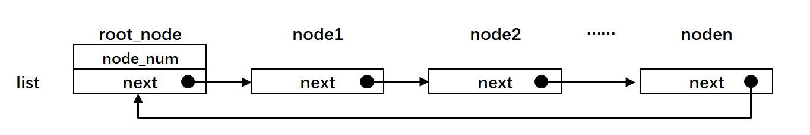

有关链表节点的删除和操作的代码讲解这里先略过，具体的可参考本章接下来的“FreeRTO中链表的实现”小节，在这个小节里面会有非常详细的讲解，这里我们先建立概念为主。

双向链表
^^^^^^^^

双向链表与单向链表的区别就是节点中有两个节点指针，分别指向前后两个节点，其他完全一样。有关双向链表的文字描述参考单
向链表小节即可，有关双向链表的示意图具体见图 双向链表_。

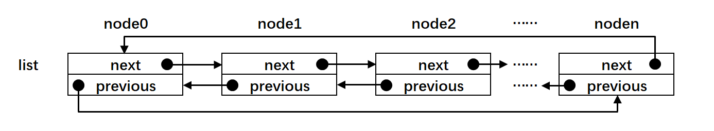

链表与数组的对比
^^^^^^^^^^^^^^^^

在很多公司的嵌入式面试中，通常会问到链表和数组的区别。在C语言中，链表与数组确实很像，两者的示意图具体见图 链表与数组的对比_，这里
以双向链表为例。

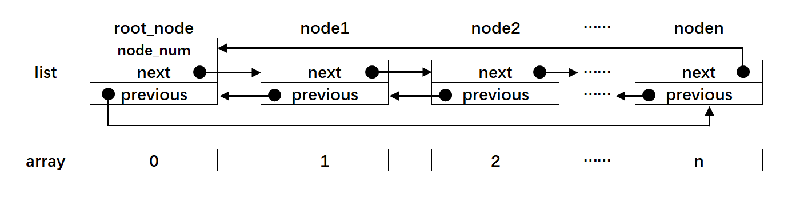

链表是通过节点把离散的数据链接成一个表，通过对节点的插入和删除操作从而实现对数据的存取。而数组是通过开辟一段连续的内存来存储数据，这是数组和链表最大的区别。数组的每个成员对应链表的节点，成员和节点的数据类型可以是标准的C类型或者是用户自定义的结构体。数组有起始地址和结束地址，而链表是一个圈，没有头和
尾之分，但是为了方便节点的插入和删除操作会人为的规定一个根节点。

FreeRTOS中链表的实现
~~~~~~~~~~~~~~~~~~~~~~~~~~~~~~~~~~~~~~~~~~

FreeRTOS中与链表相关的操作均在list.h和list.c这两个文件中实现，list.h第一次使用需要在include文件夹下面新建然后添加到工程freertos/source这个组文件，list.c第一次使用需要在freertos文件夹下面新建然后添加到工程freertos/source这个
组文件。

实现链表节点
^^^^^^^^^^^^^^^^^^^^^^^^

定义链表节点数据结构
''''''''''''''''''''''''''''''

链表节点的数据结构在list.h中定义，具体实现见 代码清单:列表-3_，节点示意图具体见 节点示意图_。

.. code-block:: c
    :caption: 代码清单:列表-3链表节点数据结构定义
    :name: 代码清单:列表-3
    :linenos:

    struct xLIST_ITEM
    {
        TickType_t xItemValue;           /* 辅助值，用于帮助节点做顺序排列 */(1)
        struct xLIST_ITEM *  pxNext;     /* 指向链表下一个节点 */(2)
        struct xLIST_ITEM *  pxPrevious; /* 指向链表前一个节点 */(3)
        void * pvOwner;			/* 指向拥有该节点的内核对象，通常是TCB */(4)
        void *  pvContainer;		/* 指向该节点所在的链表 */(5)
    };
    typedefstruct xLIST_ITEM ListItem_t; /* 节点数据类型重定义 */(6)

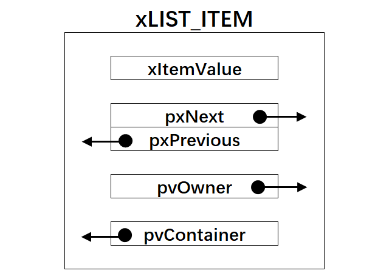

-   代码清单:列表-3_ **(1)**\ ：一个辅助值，用于帮助节点做顺序排列。该辅助值的数据类型为TickType_t，在FreeRTOS中，凡是
    涉及数据类型的地方，FreeRTOS都会将标准的C数据类型用typedef 重新取一个类型名。这些经过重定义的数据类型放在
    portmacro.h（portmacro.h第一次使用需要在include文件夹下面新建然后添加到工程freertos/source这个组文件）这个头
    文件，具体见 代码清单:列表-4_。 代码清单:列表-4中除了TickType_t外，其他数据类型重定义是本章后面内容需要使用到，这里统一贴出
    来，后面将不再赘述。

.. code-block:: c
    :caption: 代码清单:列表-4portmacro.h 文件中的数据类型
    :name: 代码清单:列表-4
    :linenos:

    #ifndef PORTMACRO_H
    #define PORTMACRO_H

    #include"stdint.h"
    #include"stddef.h"

    /* 数据类型重定义 */
    #define portCHAR		char
    #define portFLOAT		float
    #define portDOUBLE		double
    #define portLONG		long
    #define portSHORT		short
    #define portSTACK_TYPE	uint32_t
    #define portBASE_TYPE	long

    typedef portSTACK_TYPE StackType_t;
    typedeflong BaseType_t;
    typedefunsigned long UBaseType_t;

    #if( configUSE_16_BIT_TICKS == 1 )(1)
    typedefuint16_t TickType_t;
    #define portMAX_DELAY ( TickType_t ) 0xffff
    #else
    typedefuint32_t TickType_t;
    #define portMAX_DELAY ( TickType_t ) 0xffffffffUL
    #endif

    #endif/* PORTMACRO_H */

-   代码清单:列表-4_ **(1)**\ ：TickType_t具体表示16位还是32位，由configUSE_16_BIT_TICKS这
    个宏决定，当该宏定义为1时，TickType_t为16位，否则为32位。该宏在
    FreeRTOSConfig.h（FreeRTOSConfig.h第一次使用需要在include文件夹下面新建然后添加到工程
    freertos/source这个组文件）中默认定义为0，具体实现见 代码清单:列表-5_，所以TickType_t表示32位。

.. code-block:: c
    :caption: 代码清单:列表-5configUSE_16_BIT_TICKS宏定义
    :name: 代码清单:列表-5
    :linenos:
 
    #ifndef FREERTOS_CONFIG_H
    #define FREERTOS_CONFIG_H

    #define configUSE_16_BIT_TICKS		0

    #endif/* FREERTOS_CONFIG_H */

-   代码清单:列表-3_ **(2)**\ ：用于指向链表下一个节点。

-   代码清单:列表-3_ **(3)**\ ：用于指向链表前一个节点。

-   代码清单:列表-3_ **(4)**\ ：用于指向该节点的拥有者，即该节点内嵌在哪个数据结构中，属于哪个数据结构的一个成员。

-   代码清单:列表-3_ **(5)**\ ：用于指向该节点所在的链表，通常指向链表的根节点。

-   代码清单:列表-3_ **(6)**\ ：节点数据类型重定义。

链表节点初始化
''''''''''''''

链表节点初始化函数在list.c中实现，具体实现见 代码清单:列表-6_。

.. code-block:: c
    :caption: 代码清单:列表-6链表节点初始化
    :name: 代码清单:列表-6
    :linenos:

    void vListInitialiseItem( ListItem_t * const pxItem )
    {
    /* 初始化该节点所在的链表为空，表示节点还没有插入任何链表 */
        pxItem->pvContainer = NULL;(1)
    }

-   代码清单:列表-6_ **(1)**\ ：链表节点ListItem_t总共有5个成员，但是初始化的时候只需将pvContainer初始化为空即可，表
    示该节点还没有插入到任何链表。一个初始化好的节点示意图具体见图 节点初始化_。

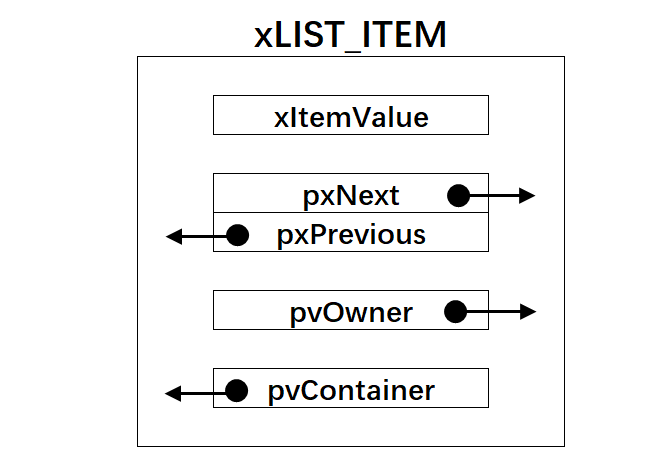

实现链表根节点
^^^^^^^^^^^^^^^^^^^^^

定义链表根节点数据结构
''''''''''''''''''''''

链表根节点的数据结构在list.h中定义，具体实现见 代码清单:列表-7_，根节点示意图具体见 根节点示意图_。

.. code-block:: c
    :caption:  代码清单:列表-7链表根节点数据结构定义
    :name: 代码清单:列表-7
    :linenos:

    typedefstruct xLIST
    {
        UBaseType_t uxNumberOfItems;    /* 链表节点计数器 */(1)
        ListItem_t *  pxIndex;		/* 链表节点索引指针 */(2)
        MiniListItem_t xListEnd;		/* 链表最后一个节点 */(3)
    } List_t;

.. image:: media/data_structure/datast0010.png
   :align: center
   :name: 根节点示意图
   :alt: 根节点示意图

-   代码清单:列表-7_ **(1)**\ ：链表节点计数器，用于表示该链表下有多少个节点，根节点除外。

-   代码清单:列表-7_ **(2)**\ ：链表节点索引指针，用于遍历节点。

-   代码清单:列表-7_ **(3)**\ ：链表最后一个节点。我们知道，链表是首尾相连的，是一个圈，首就是尾，尾就是首，这里从字面上
    理解就是链表的最后一个节点，实际也就是链表的第一个节点，我们称之为生产者。该生产者的数据类型是一个精简的节点，也
    在list.h中定义，具体实现见 代码清单:列表-9_。

.. code-block:: c
    :caption: 代码清单:列表-9链表精简节点结构体定义
    :name: 代码清单:列表-9
    :linenos:

    struct xMINI_LIST_ITEM
    {
        TickType_t xItemValue;                      /* 辅助值，用于帮助节点做升序排列 */
        struct xLIST_ITEM *  pxNext;                /* 指向链表下一个节点 */
        struct xLIST_ITEM *  pxPrevious;            /* 指向链表前一个节点 */
    };
    typedefstruct xMINI_LIST_ITEM MiniListItem_t;  /* 精简节点数据类型重定义 */

链表根节点初始化
''''''''''''''''
链表节点初始化函数在list.c中实现，具体实现见 代码清单:列表-10_，初始化好的根节点示意图具体见 根节点初始化_。

.. code-block:: c
    :caption: 代码清单:列表-10链表根节点初始化
    :name: 代码清单:列表-10
    :linenos:

    void vListInitialise( List_t * const pxList )
    {
        /* 将链表索引指针指向最后一个节点 */(1)
        pxList->pxIndex = ( ListItem_t * ) &( pxList->xListEnd );

        /* 将链表最后一个节点的辅助排序的值设置为最大，确保该节点就是链表的最后节点 */(2)
        pxList->xListEnd.xItemValue = portMAX_DELAY;

        /* 将最后一个节点的pxNext和pxPrevious指针均指向节点自身，表示链表为空 */(3)
        pxList->xListEnd.pxNext = ( ListItem_t * ) &( pxList->xListEnd );
        pxList->xListEnd.pxPrevious = ( ListItem_t * ) &( pxList->xListEnd );

        /* 初始化链表节点计数器的值为0，表示链表为空 */(4)
        pxList->uxNumberOfItems = ( UBaseType_t ) 0U;
    }

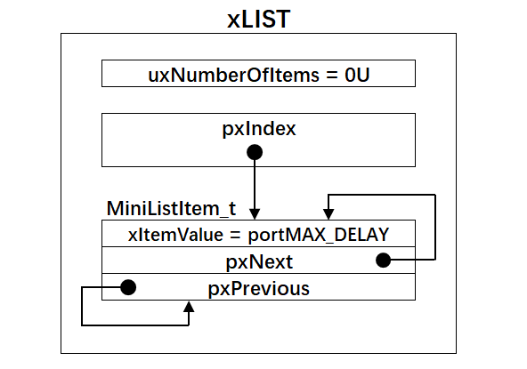

-   代码清单:列表-10_ **(1)**\ ：将链表索引指针指向最后一个节点，即第一个节点，或者第零个节点更准确，因为这个节点不会算入
    节点计数器的值。

-   代码清单:列表-10_ **(2)**\ ：将链表最后（也可以理解为第一）一个节点的辅助排序的值设置为最大，确保该节点就是链表的最
    后节点（也可以理解为第一）。

-   代码清单:列表-10_ **(3)**\ ：将最后一个节点（也可以理解为第一）的pxNext和pxPrevious指针均指向节点自身，表示链表为空。

-   代码清单:列表-10_ **(4)**\ ：初始化链表节点计数器的值为0，表示链表为空。

将节点插入到链表的尾部
''''''''''''''''''''''

将节点插入到链表的尾部（可以理解为头部）就是将一个新的节点插入到一个空的链表，具体代码实现见 代码清单:列表-11_，插入过
程的示意图见图 将节点插入到链表的尾部_。

.. code-block:: c
    :caption: 代码清单:列表-11将节点插入到链表的尾部
    :name: 代码清单:列表-11
    :linenos:

    void vListInsertEnd( List_t * const pxList, ListItem_t * const pxNewListItem )
    {
        ListItem_t * const pxIndex = pxList->pxIndex;

        pxNewListItem->pxNext = pxIndex;①
        pxNewListItem->pxPrevious = pxIndex->pxPrevious;②
        pxIndex->pxPrevious->pxNext = pxNewListItem;③
        pxIndex->pxPrevious = pxNewListItem;④

        /* 记住该节点所在的链表 */
        pxNewListItem->pvContainer = ( void * ) pxList;         ⑤

        /* 链表节点计数器++ */
        ( pxList->uxNumberOfItems )++;                             ⑥
    }

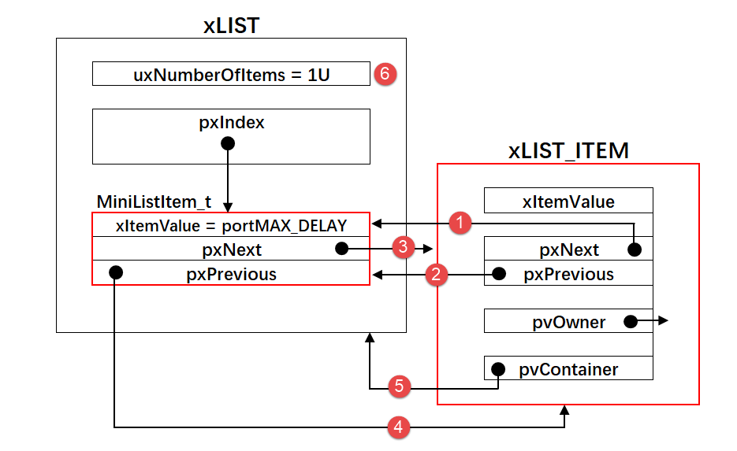

将节点按照升序排列插入到链表
''''''''''''''''''''''''''''

将节点按照升序排列插入到链表，如果有两个节点的值相同，则新节点在旧节点的后面插入，具体实现见 代码清单:列表-12_。

.. code-block:: c
    :caption: 代码清单:列表-12将节点按照升序排列插入到链表
    :name: 代码清单:列表-12
    :linenos:
 
    void vListInsert( List_t * const pxList, ListItem_t * const pxNewListItem )
    {
        ListItem_t *pxIterator;

        /* 获取节点的排序辅助值 */
        const TickType_t xValueOfInsertion = pxNewListItem->xItemValue;(1)

        /* 寻找节点要插入的位置 */(2)
        if ( xValueOfInsertion == portMAX_DELAY )
            {
                pxIterator = pxList->xListEnd.pxPrevious;
            }
        else
            {
        for ( pxIterator = ( ListItem_t * ) &( pxList->xListEnd );
                        pxIterator->pxNext->xItemValue <= xValueOfInsertion;
                        pxIterator = pxIterator->pxNext )
                {
                    /* 没有事情可做，不断迭代只为了找到节点要插入的位置 */
                }
            }
            /* 根据升序排列，将节点插入 */(3)
            pxNewListItem->pxNext = pxIterator->pxNext;             ①
            pxNewListItem->pxNext->pxPrevious = pxNewListItem;    ②
            pxNewListItem->pxPrevious = pxIterator;                 ③
            pxIterator->pxNext = pxNewListItem;                      ④

            /* 记住该节点所在的链表 */
            pxNewListItem->pvContainer = ( void * ) pxList;        ⑤

            /* 链表节点计数器++ */
            ( pxList->uxNumberOfItems )++;                            ⑥
    }

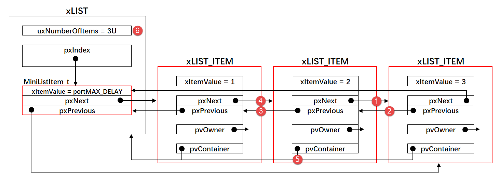

-   代码清单:列表-12_ **(1)**\ ：获取节点的排序辅助值。

-   代码清单:列表-12_ **(2)**\ ：根据节点的排序辅助值，找到节点要插入的位置，按照升序排列。

-   代码清单:列表-12_ **(3)**\ ：按照升序排列，将节点插入到链表。假设将一个节点排序辅助值是2的节点插入到有两个节点的链
    表中，这两个现有的节点的排序辅助值分别是1和3，那么插入过程的示意图具体见图 将节点按照升序排列插入到链表_。

将节点从链表删除
''''''''''''''''

将节点从链表删除具体实现见 代码清单:列表-13_。假设将一个有三个节点的链表中的中间节点节点删除，删除操作的过程示意图具
体可见图 将节点从链表删除_。

.. code-block:: c
    :caption: 代码清单:列表-13将节点从链表删除
    :name: 代码清单:列表-13
    :linenos:
 
    UBaseType_t uxListRemove( ListItem_t * const pxItemToRemove )
    {
        /* 获取节点所在的链表 */
        List_t * const pxList = ( List_t * ) pxItemToRemove->pvContainer;
        /* 将指定的节点从链表删除*/
        pxItemToRemove->pxNext->pxPrevious = pxItemToRemove->pxPrevious;①
        pxItemToRemove->pxPrevious->pxNext = pxItemToRemove->pxNext;②

        /*调整链表的节点索引指针 */
        if ( pxList->pxIndex == pxItemToRemove )
            {
                pxList->pxIndex = pxItemToRemove->pxPrevious;
            }

        /* 初始化该节点所在的链表为空，表示节点还没有插入任何链表 */
        pxItemToRemove->pvContainer = NULL;                                   ③

        /* 链表节点计数器-- */
        ( pxList->uxNumberOfItems )--;                                         ④

        /* 返回链表中剩余节点的个数 */
        return pxList->uxNumberOfItems;
    }

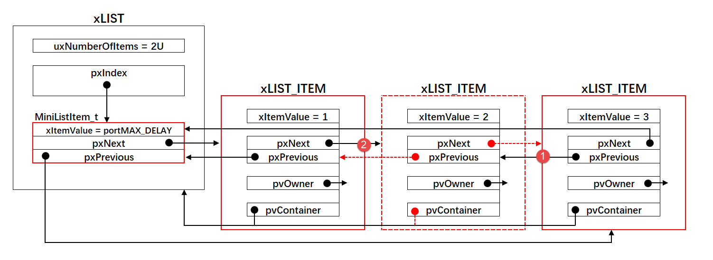

节点带参宏小函数
''''''''''''''''

在list.h中，还定义了各种各样的带参宏，方便对节点做一些简单的操作，具体实现见 代码清单:列表-14_ 节点带参宏小函数。

.. code-block:: c
    :caption: 代码清单:列表-14节点带参宏小函数
    :name: 代码清单:列表-14
    :linenos:
 
    /* 初始化节点的拥有者 */
    #define listSET_LIST_ITEM_OWNER( pxListItem, pxOwner )\
            ( ( pxListItem )->pvOwner = ( void * ) ( pxOwner ) )

    /* 获取节点拥有者 */
    #define listGET_LIST_ITEM_OWNER( pxListItem )\
            ( ( pxListItem )->pvOwner )

    /* 初始化节点排序辅助值 */
    #define listSET_LIST_ITEM_VALUE( pxListItem, xValue )\
            ( ( pxListItem )->xItemValue = ( xValue ) )

    /* 获取节点排序辅助值 */
    #define listGET_LIST_ITEM_VALUE( pxListItem )\
            ( ( pxListItem )->xItemValue )

    /* 获取链表根节点的节点计数器的值 */
    #define listGET_ITEM_VALUE_OF_HEAD_ENTRY( pxList )\
            ( ( ( pxList )->xListEnd ).pxNext->xItemValue )

    /* 获取链表的入口节点 */
    #define listGET_HEAD_ENTRY( pxList )\
            ( ( ( pxList )->xListEnd ).pxNext )

    /* 获取节点的下一个节点 */
    #define listGET_NEXT( pxListItem )\
            ( ( pxListItem )->pxNext )

    /* 获取链表的最后一个节点 */
    #define listGET_END_MARKER( pxList )\
            ( ( ListItem_t const * ) ( &( ( pxList )->xListEnd ) ) )

    /* 判断链表是否为空 */
    #define listLIST_IS_EMPTY( pxList )\
            ( ( BaseType_t ) ( ( pxList )->uxNumberOfItems == ( UBaseType_t )
    )

    /* 获取链表的节点数 */
    #define listCURRENT_LIST_LENGTH( pxList )\
            ( ( pxList )->uxNumberOfItems )

    /* 获取链表第一个节点的OWNER，即TCB */
    #define listGET_OWNER_OF_NEXT_ENTRY( pxTCB, pxList )
    {
        List_t * const pxConstList = ( pxList );
        /* 节点索引指向链表第一个节点 */
        ( pxConstList )->pxIndex = ( pxConstList )->pxIndex->pxNext;
        /* 这个操作有啥用？ */
        if( ( void * ) ( pxConstList )->pxIndex == ( void * ) &( ( pxConstList )->xListEnd ) )
        {
            ( pxConstList )->pxIndex = ( pxConstList )->pxIndex->pxNext;
        }
        /* 获取节点的OWNER，即TCB */
        ( pxTCB ) = ( pxConstList )->pxIndex->pvOwner;
    }

链表节点插入实验实验
~~~~~~~~~~~~~~~~~~~~

我们新建一个根节点（也可以理解为链表）和三个普通节点，然后将这三个普通节点按照节点的排序辅助值做升序排列插入
到链表中，具体代码见 代码清单:列表-15_。

.. code-block:: c
    :caption: 代码清单:列表-15链表节点插入实验
    :name: 代码清单:列表-15
    :linenos:
 
    /*
    *************************************************************************
    *                             包含的头文件
    *************************************************************************
    */
    #include"list.h"

    /*
    *************************************************************************
    *                              全局变量
    *************************************************************************
    */

    /* 定义链表根节点 */
    struct xLIST       List_Test;(1)

    /* 定义节点 */
    struct xLIST_ITEM  List_Item1;(2)
    struct xLIST_ITEM  List_Item2;
    struct xLIST_ITEM  List_Item3;

    /*
    ************************************************************************
    *                                main函数
    ************************************************************************
    */
    /*
    int main(void)
    {

        /* 链表根节点初始化 */
        vListInitialise( &List_Test );(3)

        /* 节点1初始化 */
        vListInitialiseItem( &List_Item1 );(4)
        List_Item1.xItemValue = 1;

        /* 节点2初始化 */
        vListInitialiseItem( &List_Item2 );
        List_Item2.xItemValue = 2;

        /* 节点3初始化 */
        vListInitialiseItem( &List_Item3 );
        List_Item3.xItemValue = 3;

        /* 将节点插入链表，按照升序排列 */(5)
        vListInsert( &List_Test, &List_Item2 );
        vListInsert( &List_Test, &List_Item1 );
        vListInsert( &List_Test, &List_Item3 );

        for (;;)
        {
            /* 啥事不干 */
        }
    }

-   代码清单:列表-15_**(1)**\ ：定义链表根节点，有根了，节点才能在此基础上生长。

-   代码清单:列表-15_**(2)**\ ：定义3个普通节点。

-   代码清单:列表-15_**(3)**\ ：链表根节点初始化，初始化完毕之后，根节点示意图见图 链表根节点初始化_。

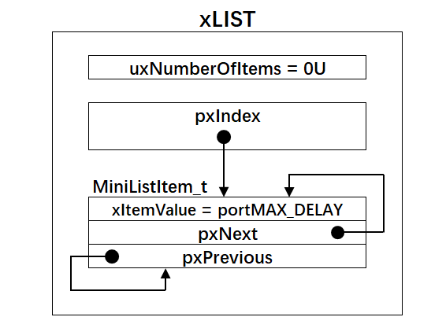

-   代码清单:列表-15_**(4)**\ ：节点初始化，初始化完毕之后节点示意图见图 链表节点初始化_，其中xItemValue等于你的初始化值。

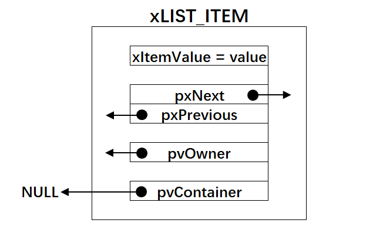

-   代码清单:列表-15_**(5)**\ ：将节点按照他们的排序辅助值做升序排列插入到链表，插入完成后链表
    的示意图见图 节点按照排序辅助值做升序排列插入到链表_。

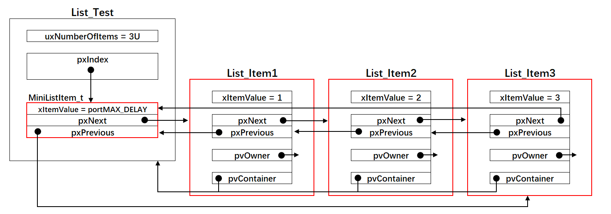

实验现象
^^^^^^^^^^^^

实验现象如图 节点按照排序辅助值做升序排列插入到链表_ 所示，但这好像是我得出的结论，是否有准确的数据支撑？有的，我们可以通过软件仿真来证实。

将程序编译好之后，点击调试按钮，然后全速运行，再然后把List_Test、List_Item1、List_Item2和List_Item3这四个
全局变量添加到观察窗口，然后查看这几个数据结构中pxNext和pxPrevious的值即可证实
图 节点按照排序辅助值做升序排列插入到链表_ 是正确的，具体的仿真数据见图 节点按照排序辅助值做升序排列插入到链表软件仿真数据_。

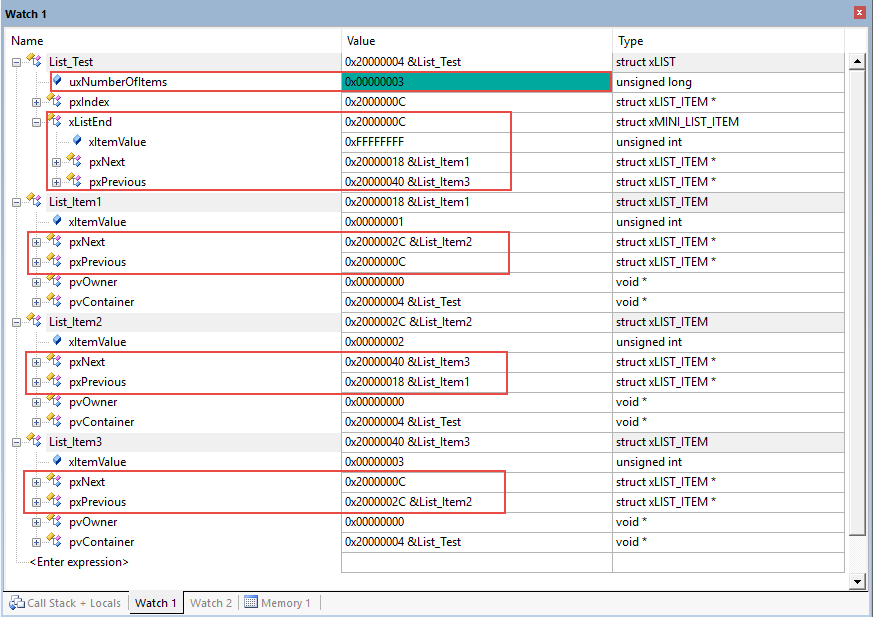

