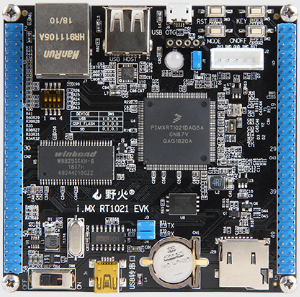
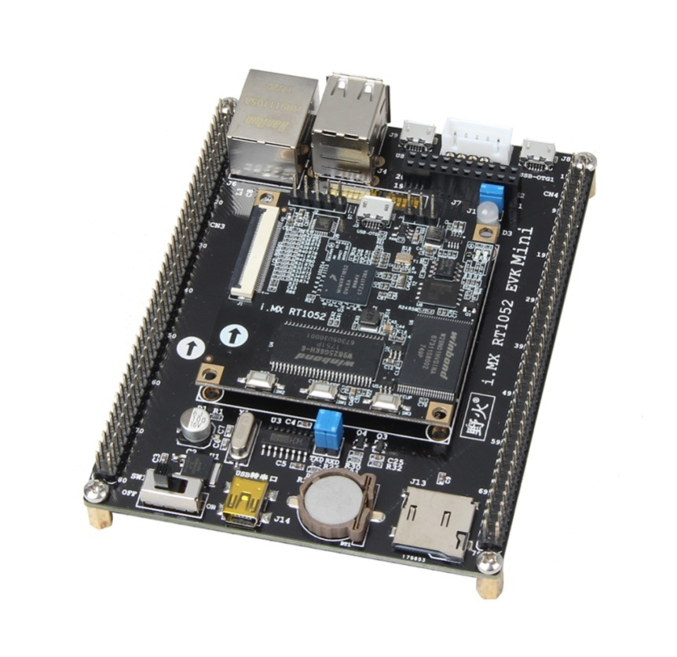
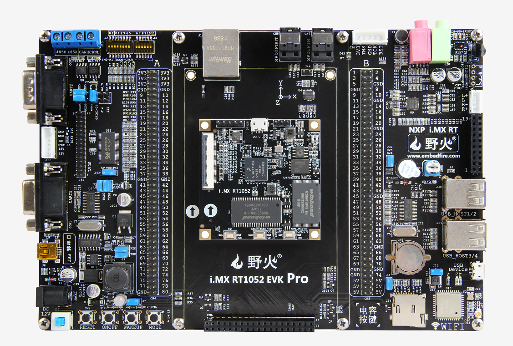
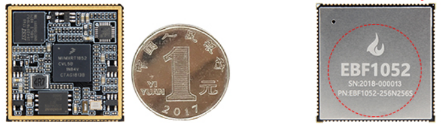

.. vim: syntax=rst

前言
============

如何学习本书
~~~~~~~~~~~~

本书是首本系统讲解FreeRTOS的中文书籍，共分为两个部分，第一部分为“从0到1教你写FreeRTOS内核”，即重点讲解FreeRTOS的原理实现，从0开始，不断迭代，教你怎么把FreeRTOS的内核写出来，让你彻底学会任务是如何定义的，系统是如何调度的（包括底层的汇编代码讲解），多优先级是如何实
现的等等操作系统最深层次的知识。当你拿到本书开始学习的时候你一定会惊讶，原来RTOS的学习并没有那么复杂，反而是那么的有趣，原来自己也可以写RTOS，成就感立马爆棚。

当第一部分知识你彻底掌握好之后，再切换到其它RTOS的学习，那简直就是易如反掌，纵观现在市面上流行的几种RTOS，它们的内核的实现基本都差不多，只需要深入研究其中一种即可，没有必要每一种RTOS都深入的研究源码，如果你时间允许，看看那也无所谓。第二部分是“FreeRTOS内核应用开发”，重点讲解Fr
eeRTOS的移植，内核每个组件的应用，比起第一部分，这部分内容掌握起来比较容易。

全书内容循序渐进，不断迭代，前一章都是后一章的基础，必须从头开始阅读，不能进行跳跃式的阅读。在学习的时候务必做到两点：一是不能一味地看书，要把代码和书本结合起来学习，一边看书，一边调试代码。看书倒是很简单，那如何调试代码？即单步执行每一条程序，看看程序的执行流程和执行的效果与自己大脑所想是不是一样；
二是在每学完一章之后，必须将配套的例程重写一遍（切记不要复制，哪怕是一个分号，但可以抄），做到举一反三，确保真正理解。在自己写的时候肯定会错漏百出，这个时候要珍惜这些错误，好好调试，这是你提高编程能力的最好的机会。记住，程序不是一气呵成写出来的，而是一步一步调试出来的。

本书的参考资料
~~~~~~~~~~~~~~

1. FreeRTOSV9.0.0官方源代码

2. FreeRTOS_Reference_Manual_V9.0.0（电子版）

3. Mastering_the_FreeRTOS_Real_Time_Kernel-A_Hands-On_Tutorial_Guide（电子版）

4. Using the FreeRTOS Real Time Kernel - A Practical Guide - Cortex-M3 Edition（电子版）

5. 《I.MX RT库开发实战指南》（电子版）

本书的编写风格
~~~~~~~~~~~~~~

本书第一部分以FreeRTOSV9.0.0官方源码为蓝本，抽丝剥茧，不断迭代，教你怎么从0开始把FreeRTOS内核写出来。书中涉及到的数据类型，变量名称、函数名称，文件名称，文件存放的位置都完全按照FreeRTOS官方的方式来实现，当你学完这本书之后可以无缝地切换到原版的FreeRTOS的使用。要
注意的是，在实现的过程中，某些函数我会去掉一些形参和一些冗余的代码，只保留核心的功能，但这并不会影响我们学习。

本书第二部分主要讲FreeRTOS的移植和内核组件的使用，不会再去深入讲解源码，着重讲应用，如果对第一部分不感兴趣的朋友，可以跳过第一部分，直接进入第二部分的学习，两者之间没有必然的联系。

本书的配套硬件
~~~~~~~~~~~~~~

本书支持野火i.MX RT开发板全套系列，具体型号见表格1‑1，具体图片见  图 1-1_、 图 1-2_、图 1-3_、和 图 1-4_。学习的时候如果配套这些硬件平台做实验，学习必会达到事半功倍的效果，可以省去中间硬件不一样时移植遇到的各种问题。

表格:野火RT1052开发板型号汇总

==========  =========  ====  =====  
   型号       内核     引脚   RAM    
==========  =========  ====  =====  
RT1021      Cortex-M7  144   256KB   
RT1052      Cortex-M7  196   512KB  
==========  =========  ====  =====  

图 1-1 野火[i.MX RT1021 EVK ]开发板

图 1-2  野火[i.MX RT1052 MINI ]开发板

图 1-3 野火[i.MX RT1052  Pro ]开发板

图 1-4 野火[i.MX RT1052 邮票孔 ]核心板

本书的技术论坛
~~~~~~~~~~~~~~

如果在学习过程中遇到问题，可以到野火电子论坛：\ `www.firebbs.cn发帖交流 <http://www.firebbs.cn发帖交流>`__\ ，开源共享，共同进步。

鉴于水平有限，本书难免有纰漏，热心的读者也可把勘误发到论坛好让我们改进做得更好，祝您学习愉快，FreeRTOS的世界，野火与您同行。
